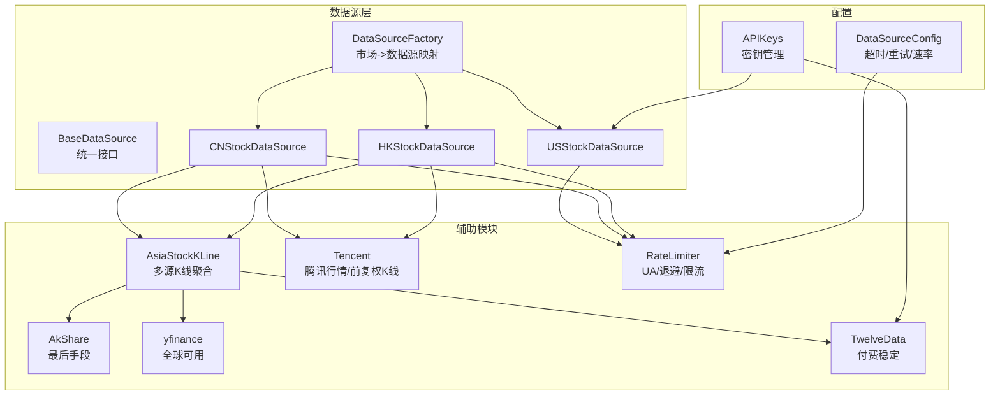
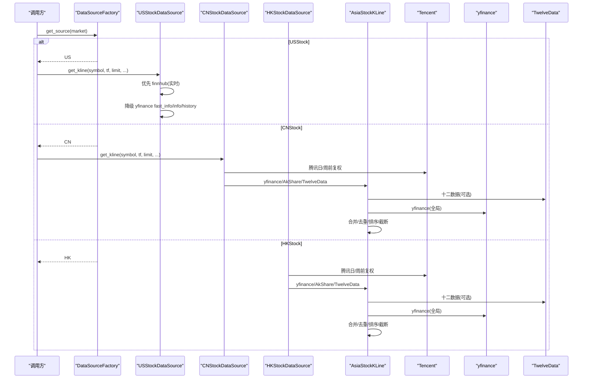
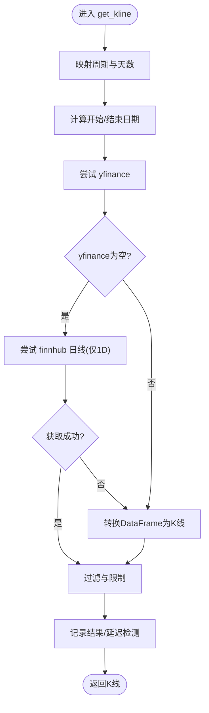
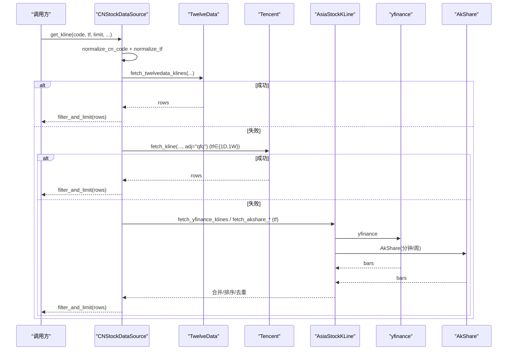
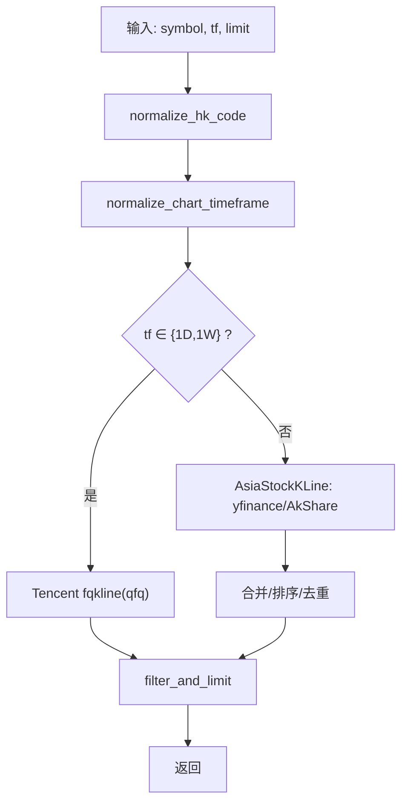
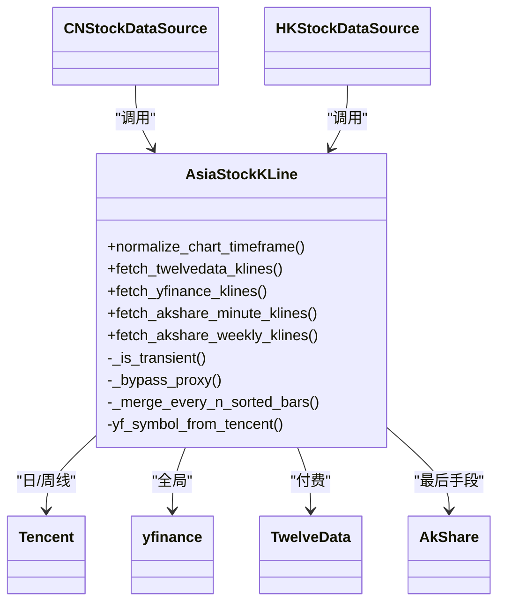
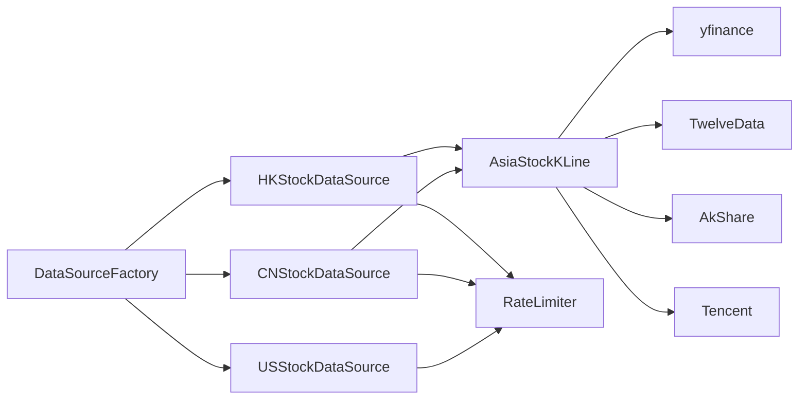

# 股票数据源

<cite>
**本文引用的文件**
- [backend_api_python/app/data_sources/base.py](file://backend_api_python/app/data_sources/base.py)
- [backend_api_python/app/data_sources/factory.py](file://backend_api_python/app/data_sources/factory.py)
- [backend_api_python/app/data_sources/us_stock.py](file://backend_api_python/app/data_sources/us_stock.py)
- [backend_api_python/app/data_sources/cn_stock.py](file://backend_api_python/app/data_sources/cn_stock.py)
- [backend_api_python/app/data_sources/hk_stock.py](file://backend_api_python/app/data_sources/hk_stock.py)
- [backend_api_python/app/data_sources/asia_stock_kline.py](file://backend_api_python/app/data_sources/asia_stock_kline.py)
- [backend_api_python/app/data_sources/tencent.py](file://backend_api_python/app/data_sources/tencent.py)
- [backend_api_python/app/data_sources/rate_limiter.py](file://backend_api_python/app/data_sources/rate_limiter.py)
- [backend_api_python/app/config/api_keys.py](file://backend_api_python/app/config/api_keys.py)
- [backend_api_python/app/config/data_sources.py](file://backend_api_python/app/config/data_sources.py)
</cite>

## 目录
1. [简介](#简介)
2. [项目结构](#项目结构)
3. [核心组件](#核心组件)
4. [架构总览](#架构总览)
5. [详细组件分析](#详细组件分析)
6. [依赖分析](#依赖分析)
7. [性能考量](#性能考量)
8. [故障排查指南](#故障排查指南)
9. [结论](#结论)
10. [附录](#附录)

## 简介
本文件系统性梳理了该代码库中的股票数据源实现，重点覆盖以下市场与能力：
- 美国股市（USStockDataSource）：基于 yfinance 与 finnhub 的多层降级方案，支持分钟到周线级别。
- 中国大陆 A 股（CNStockDataSource）：多源融合（Twelve Data、腾讯、yfinance、AkShare），支持 T+1 交易机制下的日线与分钟线。
- 港股/H 股（HKStockDataSource）：与 A 股类似的多源融合策略，适配港股市场。
- 亚洲其他市场 K 线（AsiaStockKLine 辅助模块）：提供统一的多源 K 线获取与合并逻辑，支持分钟/小时/日/周线。
- 特殊市场考虑：交易日历、停牌、分红除权（前复权）、汇率转换等在当前实现中以“多源融合”和“前复权调整”为主，具体落地取决于上游数据源能力。

## 项目结构
围绕股票数据源的关键文件组织如下：
- 基类与工厂：BaseDataSource 定义统一接口；DataSourceFactory 提供市场到数据源的映射与便捷访问。
- 美股：USStockDataSource 基于 yfinance 与 finnhub。
- 亚洲市场：CNStockDataSource、HKStockDataSource 通过 tencent.py 与 asia_stock_kline.py 组合多数据源。
- 限流与鲁棒性：rate_limiter.py 提供 UA 轮换、指数退避、请求限速等策略。
- 配置：api_keys.py、data_sources.py 提供 API Key 与各数据源配置项。

**图表来源**
- [backend_api_python/app/data_sources/base.py:27-179](file://backend_api_python/app/data_sources/base.py#L27-L179)
- [backend_api_python/app/data_sources/factory.py:47-102](file://backend_api_python/app/data_sources/factory.py#L47-L102)
- [backend_api_python/app/data_sources/us_stock.py:17-334](file://backend_api_python/app/data_sources/us_stock.py#L17-L334)
- [backend_api_python/app/data_sources/cn_stock.py:30-125](file://backend_api_python/app/data_sources/cn_stock.py#L30-L125)
- [backend_api_python/app/data_sources/hk_stock.py:30-125](file://backend_api_python/app/data_sources/hk_stock.py#L30-L125)
- [backend_api_python/app/data_sources/asia_stock_kline.py:1-593](file://backend_api_python/app/data_sources/asia_stock_kline.py#L1-L593)
- [backend_api_python/app/data_sources/tencent.py:1-239](file://backend_api_python/app/data_sources/tencent.py#L1-L239)
- [backend_api_python/app/data_sources/rate_limiter.py:1-273](file://backend_api_python/app/data_sources/rate_limiter.py#L1-L273)
- [backend_api_python/app/config/api_keys.py:1-184](file://backend_api_python/app/config/api_keys.py#L1-L184)
- [backend_api_python/app/config/data_sources.py:1-171](file://backend_api_python/app/config/data_sources.py#L1-L171)

**章节来源**
- [backend_api_python/app/data_sources/base.py:27-179](file://backend_api_python/app/data_sources/base.py#L27-L179)
- [backend_api_python/app/data_sources/factory.py:47-102](file://backend_api_python/app/data_sources/factory.py#L47-L102)

## 核心组件
- BaseDataSource：定义 get_kline、get_ticker、format_kline、filter_and_limit、log_result 等统一接口与通用逻辑。
- DataSourceFactory：根据市场字符串（如 USStock、CNStock、HKStock）返回对应数据源实例，并提供便捷的 get_kline/get_ticker 方法。
- USStockDataSource：优先 finnhub（实时），降级 yfinance fast_info/info/history，支持 1m~1W。
- CNStockDataSource / HKStockDataSource：统一走 asia_stock_kline 的多源融合路径，优先 Twelve Data（若配置），其次腾讯（日/周前复权），再 yfinance，最后 AkShare。
- AsiaStockKLine：封装 Twelve Data、yfinance、AkShare 的 K 线获取与合并，含时间窗、退避重试、代理绕过（AkShare）等。
- Tencent：提供 A/H 股代码归一化、实时报价解析、前复权日/周 K 线解析。
- RateLimiter：UA 轮换、指数退避、请求限速，降低被封禁风险。
- 配置：APIKeys（密钥来源）、DataSourceConfig（超时/重试/速率）。

**章节来源**
- [backend_api_python/app/data_sources/base.py:27-179](file://backend_api_python/app/data_sources/base.py#L27-L179)
- [backend_api_python/app/data_sources/factory.py:47-102](file://backend_api_python/app/data_sources/factory.py#L47-L102)
- [backend_api_python/app/data_sources/us_stock.py:17-334](file://backend_api_python/app/data_sources/us_stock.py#L17-L334)
- [backend_api_python/app/data_sources/cn_stock.py:30-125](file://backend_api_python/app/data_sources/cn_stock.py#L30-L125)
- [backend_api_python/app/data_sources/hk_stock.py:30-125](file://backend_api_python/app/data_sources/hk_stock.py#L30-L125)
- [backend_api_python/app/data_sources/asia_stock_kline.py:1-593](file://backend_api_python/app/data_sources/asia_stock_kline.py#L1-L593)
- [backend_api_python/app/data_sources/tencent.py:1-239](file://backend_api_python/app/data_sources/tencent.py#L1-L239)
- [backend_api_python/app/data_sources/rate_limiter.py:1-273](file://backend_api_python/app/data_sources/rate_limiter.py#L1-L273)
- [backend_api_python/app/config/api_keys.py:1-184](file://backend_api_python/app/config/api_keys.py#L1-L184)
- [backend_api_python/app/config/data_sources.py:1-171](file://backend_api_python/app/config/data_sources.py#L1-L171)

## 架构总览
下图展示 US/CN/HK 三类数据源如何通过统一工厂接入，并在亚洲市场场景下复用 AsiaStockKLine 与 Tencent 的能力。

**图表来源**
- [backend_api_python/app/data_sources/factory.py:47-102](file://backend_api_python/app/data_sources/factory.py#L47-L102)
- [backend_api_python/app/data_sources/us_stock.py:17-334](file://backend_api_python/app/data_sources/us_stock.py#L17-L334)
- [backend_api_python/app/data_sources/cn_stock.py:53-125](file://backend_api_python/app/data_sources/cn_stock.py#L53-L125)
- [backend_api_python/app/data_sources/hk_stock.py:53-125](file://backend_api_python/app/data_sources/hk_stock.py#L53-L125)
- [backend_api_python/app/data_sources/asia_stock_kline.py:169-264](file://backend_api_python/app/data_sources/asia_stock_kline.py#L169-L264)
- [backend_api_python/app/data_sources/tencent.py:194-239](file://backend_api_python/app/data_sources/tencent.py#L194-L239)

## 详细组件分析

### USStockDataSource（美股）
- 支持周期：1m、5m、15m、30m、1H、4H、1D、1W。
- 数据源优先级：Finhub（实时）→ yfinance fast_info → yfinance info → yfinance 1 分钟历史回退。
- 关键点：
  - 使用 INTERVAL_MAP/DAYS_MAP 将请求的 limit 映射为 yfinance 的 start/end。
  - 日线在 end 参数上做“包含结束日”的修正（end 加一天）。
  - 403/权限类错误会降级记录为 debug，避免刷屏。
- 适用市场：纳斯达克、纽约证券交易所等主要美市。

**图表来源**
- [backend_api_python/app/data_sources/us_stock.py:170-234](file://backend_api_python/app/data_sources/us_stock.py#L170-L234)
- [backend_api_python/app/data_sources/us_stock.py:236-254](file://backend_api_python/app/data_sources/us_stock.py#L236-L254)
- [backend_api_python/app/data_sources/us_stock.py:256-291](file://backend_api_python/app/data_sources/us_stock.py#L256-L291)
- [backend_api_python/app/data_sources/us_stock.py:293-332](file://backend_api_python/app/data_sources/us_stock.py#L293-L332)

**章节来源**
- [backend_api_python/app/data_sources/us_stock.py:17-334](file://backend_api_python/app/data_sources/us_stock.py#L17-L334)

### CNStockDataSource（A股）
- 支持周期：1m、5m、15m、30m、1H、4H、1D、1W。
- 多源融合顺序（优先级）：Twelve Data（付费，最稳定）→ 腾讯日/周前复权 → yfinance → AkShare。
- 关键点：
  - normalize_cn_code 将多种输入格式（600519、600519.SH、SH600519、SZ000001）统一为腾讯代码（sh600519、sz000001）。
  - 日/周线默认使用腾讯 fqkline（前复权），分钟线在腾讯 fqkline 不支持时回退到 yfinance/AkShare。
  - 4H 线在 yfinance/AkShare 后进行 N 根合并（每 4 根合成一根）。
- T+1 机制：当前实现未显式在代码中体现“T+1”，但日线前复权（qfq）可反映除权影响；实际交易时序建议结合业务侧的交易日历与结算安排。

**图表来源**
- [backend_api_python/app/data_sources/cn_stock.py:53-125](file://backend_api_python/app/data_sources/cn_stock.py#L53-L125)
- [backend_api_python/app/data_sources/asia_stock_kline.py:169-264](file://backend_api_python/app/data_sources/asia_stock_kline.py#L169-L264)
- [backend_api_python/app/data_sources/asia_stock_kline.py:355-408](file://backend_api_python/app/data_sources/asia_stock_kline.py#L355-L408)
- [backend_api_python/app/data_sources/asia_stock_kline.py:485-530](file://backend_api_python/app/data_sources/asia_stock_kline.py#L485-L530)
- [backend_api_python/app/data_sources/asia_stock_kline.py:533-592](file://backend_api_python/app/data_sources/asia_stock_kline.py#L533-L592)
- [backend_api_python/app/data_sources/tencent.py:194-239](file://backend_api_python/app/data_sources/tencent.py#L194-L239)

**章节来源**
- [backend_api_python/app/data_sources/cn_stock.py:30-125](file://backend_api_python/app/data_sources/cn_stock.py#L30-L125)
- [backend_api_python/app/data_sources/tencent.py:24-66](file://backend_api_python/app/data_sources/tencent.py#L24-L66)

### HKStockDataSource（港股/H股）
- 与 CNStock 类似的多源融合策略，is_hk 标记贯穿 yfinance/AkShare/TwelveData 调用。
- 关键点：
  - normalize_hk_code 将多种输入（700、0700、00700.HK、HK00700）统一为腾讯代码（hk00700）。
  - 日/周线同样优先腾讯 fqkline（前复权），分钟线回退至 yfinance/AkShare。
  - 4H 线在 yfinance/AkShare 后进行 N 根合并（每 4 根合成一根）。

**图表来源**
- [backend_api_python/app/data_sources/hk_stock.py:53-125](file://backend_api_python/app/data_sources/hk_stock.py#L53-L125)
- [backend_api_python/app/data_sources/tencent.py:50-66](file://backend_api_python/app/data_sources/tencent.py#L50-L66)
- [backend_api_python/app/data_sources/asia_stock_kline.py:355-408](file://backend_api_python/app/data_sources/asia_stock_kline.py#L355-L408)

**章节来源**
- [backend_api_python/app/data_sources/hk_stock.py:30-125](file://backend_api_python/app/data_sources/hk_stock.py#L30-L125)
- [backend_api_python/app/data_sources/tencent.py:50-66](file://backend_api_python/app/data_sources/tencent.py#L50-L66)

### AsiaStockKLine（亚洲市场K线聚合）
- 统一的多源 K 线获取与合并：
  - Twelve Data：需配置 TWELVE_DATA_API_KEY，支持所有周期。
  - yfinance：全局可用，支持 CN/HK 所有常用周期。
  - AkShare：国内站点，海外不稳定，作为最后手段；提供分钟与周线接口。
- 关键实现细节：
  - normalize_chart_timeframe：统一 1w/1d/1h/4h 等别名为 1W/1D/1H/4H。
  - _is_transient：识别瞬时错误（连接中断、超时、429、速率限制等）并触发指数退避重试。
  - _bypass_proxy：在调用 AkShare 时临时清除代理环境变量，提升成功率。
  - _merge_every_n_sorted_bars：将 N 根合并为 1H/4H 等长周期。
  - yf_symbol_from_tencent：将 SH/SZ/HK 代码转换为 yfinance ticker（.SS/.SZ/.HK）。
  - fetch_akshare_*：分钟/周线接口，带 qfq 前复权参数。

**图表来源**
- [backend_api_python/app/data_sources/asia_stock_kline.py:92-125](file://backend_api_python/app/data_sources/asia_stock_kline.py#L92-L125)
- [backend_api_python/app/data_sources/asia_stock_kline.py:169-264](file://backend_api_python/app/data_sources/asia_stock_kline.py#L169-L264)
- [backend_api_python/app/data_sources/asia_stock_kline.py:271-352](file://backend_api_python/app/data_sources/asia_stock_kline.py#L271-L352)
- [backend_api_python/app/data_sources/asia_stock_kline.py:355-408](file://backend_api_python/app/data_sources/asia_stock_kline.py#L355-L408)
- [backend_api_python/app/data_sources/asia_stock_kline.py:485-530](file://backend_api_python/app/data_sources/asia_stock_kline.py#L485-L530)
- [backend_api_python/app/data_sources/asia_stock_kline.py:533-592](file://backend_api_python/app/data_sources/asia_stock_kline.py#L533-L592)
- [backend_api_python/app/data_sources/tencent.py:194-239](file://backend_api_python/app/data_sources/tencent.py#L194-L239)

**章节来源**
- [backend_api_python/app/data_sources/asia_stock_kline.py:1-593](file://backend_api_python/app/data_sources/asia_stock_kline.py#L1-L593)

### Tencent（A/H 股行情与前复权K线）
- normalize_cn_code / normalize_hk_code：标准化代码格式，便于下游统一处理。
- fetch_quote / parse_quote_to_ticker：获取实时报价并转换为统一结构。
- fetch_kline / tencent_kline_rows_to_dicts：获取前复权日/周 K 线并转为内部结构。
- 注意：腾讯 fqkline 不支持分钟线，分钟线应走 yfinance/AkShare。

**章节来源**
- [backend_api_python/app/data_sources/tencent.py:24-66](file://backend_api_python/app/data_sources/tencent.py#L24-L66)
- [backend_api_python/app/data_sources/tencent.py:74-106](file://backend_api_python/app/data_sources/tencent.py#L74-L106)
- [backend_api_python/app/data_sources/tencent.py:108-146](file://backend_api_python/app/data_sources/tencent.py#L108-L146)
- [backend_api_python/app/data_sources/tencent.py:194-239](file://backend_api_python/app/data_sources/tencent.py#L194-L239)

## 依赖分析
- 工厂与基类耦合度低：通过工厂注入市场到具体数据源，符合开闭原则。
- 多源融合解耦：CN/HK 共用 AsiaStockKLine，减少重复实现。
- 外部依赖：
  - yfinance：全球可用，适合日/周线与分钟线。
  - finnhub：美股实时报价，受权限限制。
  - Twelve Data：付费，覆盖 XSHG/XSHE/XHKG 全周期。
  - AkShare：国内站点，不稳定，仅作为最后手段。
  - 腾讯：fqkline 对日/周线友好，前复权 qfq。
- 限流与鲁棒性：统一 UA 轮换、指数退避、限速，降低风控与封禁风险。

**图表来源**
- [backend_api_python/app/data_sources/factory.py:47-102](file://backend_api_python/app/data_sources/factory.py#L47-L102)
- [backend_api_python/app/data_sources/cn_stock.py:66-104](file://backend_api_python/app/data_sources/cn_stock.py#L66-L104)
- [backend_api_python/app/data_sources/hk_stock.py:66-104](file://backend_api_python/app/data_sources/hk_stock.py#L66-L104)
- [backend_api_python/app/data_sources/asia_stock_kline.py:169-264](file://backend_api_python/app/data_sources/asia_stock_kline.py#L169-L264)
- [backend_api_python/app/data_sources/rate_limiter.py:238-273](file://backend_api_python/app/data_sources/rate_limiter.py#L238-L273)

**章节来源**
- [backend_api_python/app/data_sources/factory.py:47-102](file://backend_api_python/app/data_sources/factory.py#L47-L102)
- [backend_api_python/app/data_sources/rate_limiter.py:238-273](file://backend_api_python/app/data_sources/rate_limiter.py#L238-L273)

## 性能考量
- 数据源选择与降级：
  - US：优先实时性强的 finnhub，失败回退 yfinance，兼顾时效与稳定性。
  - CN/HK：优先 Twelve Data（若配置），否则腾讯 fqkline（前复权），再回退 yfinance/AkShare。
- 时间窗估算：
  - US：DAYS_MAP 基于分钟到日的近似换算，结合 limit 估算 start/end。
  - Asia：_YF_DAYS_MAP/_YF_INTERVAL_MAP 控制 yfinance 查询天数与周期映射。
- 合并与去重：
  - AsiaStockKLine 对多源返回进行排序、去重、截断，保证输出一致性。
- 限流与退避：
  - RateLimiter 提供随机抖动与指数退避，降低被限频或封禁概率。
- 代理与网络：
  - AkShare 调用前临时清除代理，提高成功率。

**章节来源**
- [backend_api_python/app/data_sources/us_stock.py:34-45](file://backend_api_python/app/data_sources/us_stock.py#L34-L45)
- [backend_api_python/app/data_sources/asia_stock_kline.py:300-309](file://backend_api_python/app/data_sources/asia_stock_kline.py#L300-L309)
- [backend_api_python/app/data_sources/asia_stock_kline.py:202-218](file://backend_api_python/app/data_sources/asia_stock_kline.py#L202-L218)
- [backend_api_python/app/data_sources/rate_limiter.py:170-231](file://backend_api_python/app/data_sources/rate_limiter.py#L170-L231)
- [backend_api_python/app/data_sources/asia_stock_kline.py:34-46](file://backend_api_python/app/data_sources/asia_stock_kline.py#L34-L46)

## 故障排查指南
- 常见问题与定位：
  - 403/权限不足：US（finnhub）与 Twelve Data 可能因权限受限降级为 debug 日志，检查密钥配置。
  - 速率限制/429：Twelve Data 与 yfinance 可能触发限流，启用指数退避与限速器。
  - AkShare 不稳定：海外网络波动导致失败，可切换为 yfinance 或腾讯 fqkline。
  - 超时与连接异常：增大 DataSourceConfig 的超时与重试次数。
- 关键检查清单：
  - 确认 TWELVE_DATA_API_KEY/FINNHUB_API_KEY 是否正确配置。
  - 检查代理环境变量是否影响 AkShare 访问。
  - 核对 symbol 格式是否通过 normalize_* 函数正确归一化。
  - 关注 log_result 的“数据延迟”警告，判断最新 bar 是否滞后。
- 相关实现位置：
  - API 密钥读取与校验：[APIKeys:168-184](file://backend_api_python/app/config/api_keys.py#L168-L184)
  - 数据源超时/重试/速率配置：[DataSourceConfig:26-98](file://backend_api_python/app/config/data_sources.py#L26-L98)
  - 退避与限流：[RateLimiter:170-231](file://backend_api_python/app/data_sources/rate_limiter.py#L170-L231)
  - 日志延迟检测：[BaseDataSource.log_result:141-179](file://backend_api_python/app/data_sources/base.py#L141-L179)

**章节来源**
- [backend_api_python/app/config/api_keys.py:168-184](file://backend_api_python/app/config/api_keys.py#L168-L184)
- [backend_api_python/app/config/data_sources.py:26-98](file://backend_api_python/app/config/data_sources.py#L26-L98)
- [backend_api_python/app/data_sources/rate_limiter.py:170-231](file://backend_api_python/app/data_sources/rate_limiter.py#L170-L231)
- [backend_api_python/app/data_sources/base.py:141-179](file://backend_api_python/app/data_sources/base.py#L141-L179)

## 结论
- 该实现以“多源融合 + 降级回退”为核心策略，覆盖美股与亚洲主要市场。
- US 股市强调实时性（finnhub），CN/HK 强调稳定性与前复权（tencent fqkline + Twelve Data）。
- AsiaStockKLine 提供统一的多源聚合与合并逻辑，便于扩展更多市场与周期。
- 对于交易日历、停牌、T+1、分红除权等复杂市场规则，当前实现通过“前复权”与“多源融合”间接支撑，具体落地建议结合业务侧的外部日历与结算规则。

## 附录

### 股票市场特殊考虑与建议
- 交易日历与时区：
  - 代码层以 UTC 秒时间戳存储与比较，日线/周线“最新 bar”允许跨周末/节假日的自然日滞后阈值已在日志延迟检测中体现。
- 停牌机制：
  - 多源融合可缓解单一来源的缺失，但停牌期间仍可能出现空洞，建议在策略层增加“静默/跳过”逻辑。
- 分红除权处理：
  - 腾讯 fqkline 默认 qfq（前复权），Twelve Data 与 yfinance 亦提供相应字段；AkShare 同样支持 qfq。
- 汇率转换：
  - 本仓库未直接暴露汇率转换逻辑；若涉及美元计价与人民币计价的跨币种转换，可在上层策略或服务层补充。

**章节来源**
- [backend_api_python/app/data_sources/base.py:141-179](file://backend_api_python/app/data_sources/base.py#L141-L179)
- [backend_api_python/app/data_sources/tencent.py:194-239](file://backend_api_python/app/data_sources/tencent.py#L194-L239)
- [backend_api_python/app/data_sources/asia_stock_kline.py:232-264](file://backend_api_python/app/data_sources/asia_stock_kline.py#L232-L264)

### 代码片段路径索引（不含具体代码内容）
- US 股实时报价与降级流程：[USStockDataSource.get_ticker:58-168](file://backend_api_python/app/data_sources/us_stock.py#L58-L168)
- US 股 K 线主流程：[USStockDataSource.get_kline:170-234](file://backend_api_python/app/data_sources/us_stock.py#L170-L234)
- A 股多源融合主流程：[CNStockDataSource.get_kline:53-125](file://backend_api_python/app/data_sources/cn_stock.py#L53-L125)
- 港股多源融合主流程：[HKStockDataSource.get_kline:53-125](file://backend_api_python/app/data_sources/hk_stock.py#L53-L125)
- 亚洲市场 K 线统一入口（Twelve Data/yfinance/AkShare）：[AsiaStockKLine.fetch_twelvedata_klines:169-264](file://backend_api_python/app/data_sources/asia_stock_kline.py#L169-L264), [AsiaStockKLine.fetch_yfinance_klines:355-408](file://backend_api_python/app/data_sources/asia_stock_kline.py#L355-L408), [AsiaStockKLine.fetch_akshare_minute_klines:485-530](file://backend_api_python/app/data_sources/asia_stock_kline.py#L485-L530), [AsiaStockKLine.fetch_akshare_weekly_klines:533-592](file://backend_api_python/app/data_sources/asia_stock_kline.py#L533-L592)
- 腾讯代码归一化与前复权 K 线：[tencent.py.normalize_cn_code:24-47](file://backend_api_python/app/data_sources/tencent.py#L24-L47), [tencent.py.normalize_hk_code:50-66](file://backend_api_python/app/data_sources/tencent.py#L50-L66), [tencent.py.fetch_kline:194-239](file://backend_api_python/app/data_sources/tencent.py#L194-L239)
- 工厂与市场映射：[DataSourceFactory.get_source:47-60](file://backend_api_python/app/data_sources/factory.py#L47-L60), [DataSourceFactory.normalize_market:36-44](file://backend_api_python/app/data_sources/factory.py#L36-L44)
- 基类统一接口与过滤：[BaseDataSource.get_kline:32-55](file://backend_api_python/app/data_sources/base.py#L32-L55), [BaseDataSource.filter_and_limit:105-139](file://backend_api_python/app/data_sources/base.py#L105-L139)
- 密钥与配置：[APIKeys:168-184](file://backend_api_python/app/config/api_keys.py#L168-L184), [DataSourceConfig:26-98](file://backend_api_python/app/config/data_sources.py#L26-L98)
- 限流与退避：[RateLimiter.retry_with_backoff:170-231](file://backend_api_python/app/data_sources/rate_limiter.py#L170-L231), [RateLimiter.get_tencent_limiter:265-267](file://backend_api_python/app/data_sources/rate_limiter.py#L265-L267)