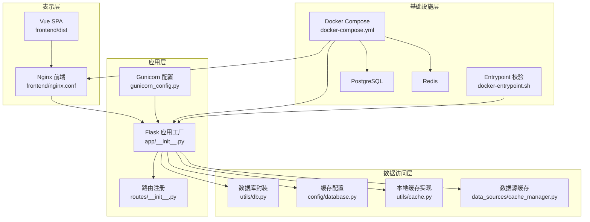
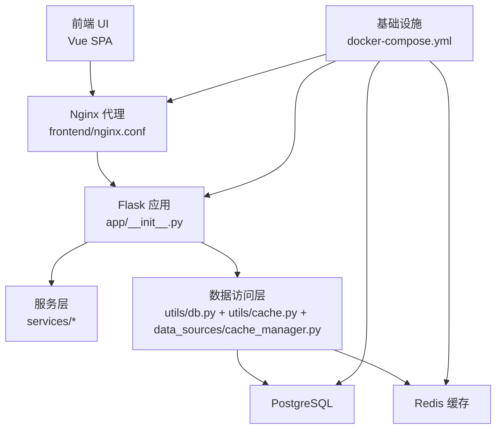
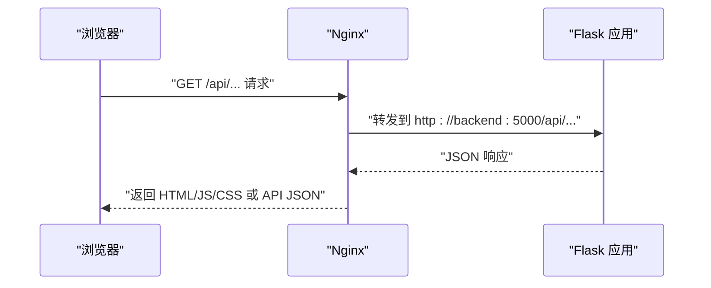
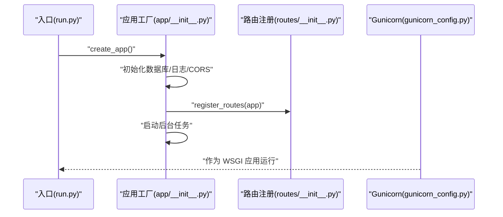
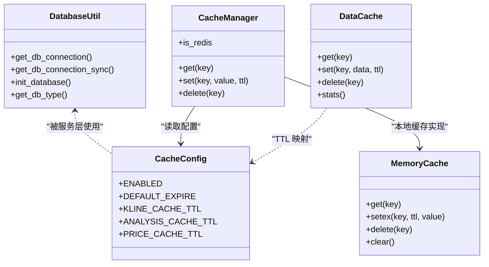
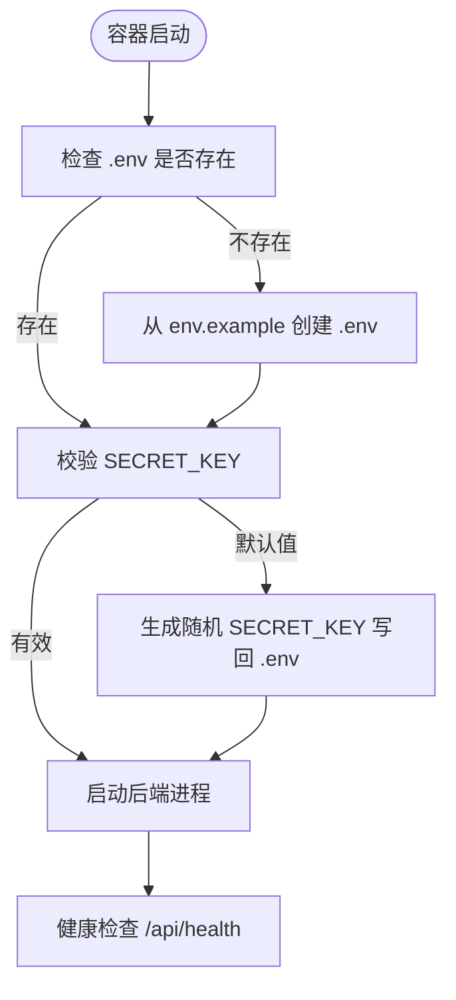
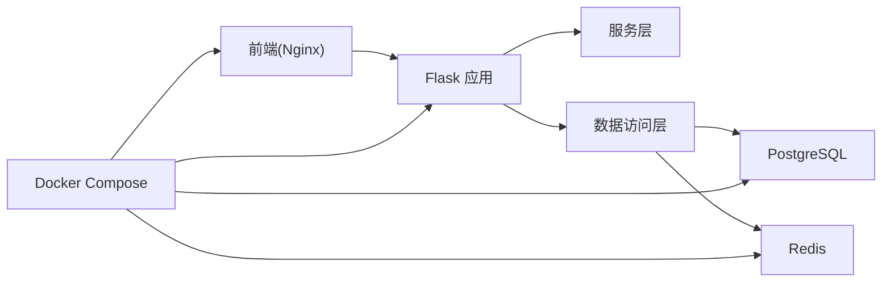

# 分层架构设计

<cite>
**本文引用的文件**
- [run.py](file://backend_api_python/run.py)
- [app/__init__.py](file://backend_api_python/app/__init__.py)
- [gunicorn_config.py](file://backend_api_python/gunicorn_config.py)
- [routes/__init__.py](file://backend_api_python/app/routes/__init__.py)
- [utils/db.py](file://backend_api_python/app/utils/db.py)
- [config/database.py](file://backend_api_python/app/config/database.py)
- [data_sources/cache_manager.py](file://backend_api_python/app/data_sources/cache_manager.py)
- [docker-entrypoint.sh](file://backend_api_python/docker-entrypoint.sh)
- [Dockerfile](file://frontend/Dockerfile)
- [nginx.conf](file://frontend/nginx.conf)
- [services/__init__.py](file://backend_api_python/app/services/__init__.py)
- [data_sources/factory.py](file://backend_api_python/app/data_sources/factory.py)
- [data_sources/base.py](file://backend_api_python/app/data_sources/base.py)
- [utils/cache.py](file://backend_api_python/app/utils/cache.py)
- [docker-compose.yml](file://docker-compose.yml)
</cite>

## 目录
1. [引言](#引言)
2. [项目结构](#项目结构)
3. [核心组件](#核心组件)
4. [架构总览](#架构总览)
5. [详细组件分析](#详细组件分析)
6. [依赖分析](#依赖分析)
7. [性能考虑](#性能考虑)
8. [故障排查指南](#故障排查指南)
9. [结论](#结论)
10. [附录](#附录)

## 引言
本设计文档围绕 QuantDinger 的分层架构展开，系统采用四层架构：表示层（Vue.js 单页应用 + Nginx 静态资源服务）、应用层（Flask 应用工厂 + 路由系统 + 服务层）、数据访问层（数据库连接 + ORM 封装 + 缓存管理）、基础设施层（外部 API 集成 + 消息队列 + 文件存储）。文档解释每层的设计原则、职责边界与依赖关系，并阐述分层如何支撑关注点分离、提升可维护性与可测试性，同时给出层间通信机制、数据传递模式与错误处理策略。

## 项目结构
- 表示层
  - 前端构建产物位于 frontend/dist，通过 Nginx 提供静态服务，nginx.conf 定义代理后端 API、SPA 路由回退与健康检查。
- 应用层
  - 后端以 Flask 应用工厂创建应用，集中初始化数据库、CORS、日志与后台任务；路由注册在 routes/__init__.py 中完成。
- 数据访问层
  - 数据库连接封装于 utils/db.py，统一 PostgreSQL 接口；缓存配置位于 config/database.py，缓存实现位于 utils/cache.py 与 data_sources/cache_manager.py。
- 基础设施层
  - docker-compose.yml 定义 PostgreSQL、Redis、后端与前端容器及网络；docker-entrypoint.sh 在容器启动前校验并自动补全 SECRET_KEY；Dockerfile 与 nginx.conf 构建与运行前端镜像。

图表来源
- [nginx.conf:1-56](file://frontend/nginx.conf#L1-L56)
- [app/__init__.py:212-268](file://backend_api_python/app/__init__.py#L212-L268)
- [routes/__init__.py:7-53](file://backend_api_python/app/routes/__init__.py#L7-L53)
- [gunicorn_config.py:1-36](file://backend_api_python/gunicorn_config.py#L1-L36)
- [utils/db.py:1-66](file://backend_api_python/app/utils/db.py#L1-L66)
- [config/database.py:1-90](file://backend_api_python/app/config/database.py#L1-L90)
- [utils/cache.py:1-129](file://backend_api_python/app/utils/cache.py#L1-L129)
- [data_sources/cache_manager.py:1-233](file://backend_api_python/app/data_sources/cache_manager.py#L1-L233)
- [docker-compose.yml:25-167](file://docker-compose.yml#L25-L167)
- [docker-entrypoint.sh:1-49](file://backend_api_python/docker-entrypoint.sh#L1-L49)

章节来源
- [nginx.conf:1-56](file://frontend/nginx.conf#L1-L56)
- [app/__init__.py:212-268](file://backend_api_python/app/__init__.py#L212-L268)
- [routes/__init__.py:7-53](file://backend_api_python/app/routes/__init__.py#L7-L53)
- [gunicorn_config.py:1-36](file://backend_api_python/gunicorn_config.py#L1-L36)
- [utils/db.py:1-66](file://backend_api_python/app/utils/db.py#L1-L66)
- [config/database.py:1-90](file://backend_api_python/app/config/database.py#L1-L90)
- [utils/cache.py:1-129](file://backend_api_python/app/utils/cache.py#L1-L129)
- [data_sources/cache_manager.py:1-233](file://backend_api_python/app/data_sources/cache_manager.py#L1-L233)
- [docker-compose.yml:25-167](file://docker-compose.yml#L25-L167)
- [docker-entrypoint.sh:1-49](file://backend_api_python/docker-entrypoint.sh#L1-L49)

## 核心组件
- 表示层
  - Nginx 配置负责安全头、压缩、静态资源缓存、API 代理到后端、SPA 回退路由与健康检查。
- 应用层
  - Flask 应用工厂负责 CORS、日志、数据库初始化、管理员账户确保、后台任务启动与路由注册。
  - 路由系统按功能模块注册蓝图，统一以 /api 前缀暴露 REST 接口。
  - Gunicorn 配置控制并发模型（gthread）、超时与日志级别。
- 数据访问层
  - 数据库封装提供 PostgreSQL 连接池与可用性检测。
  - 缓存配置支持 Redis 与本地内存双实现，按需启用。
  - 数据源缓存提供 TTL/LRU 策略与线程安全。
- 基础设施层
  - docker-compose 统一编排数据库、缓存、后端与前端，定义健康检查与环境变量。
  - docker-entrypoint.sh 在容器启动前校验并自动补全 SECRET_KEY，保障安全启动。

章节来源
- [nginx.conf:1-56](file://frontend/nginx.conf#L1-L56)
- [app/__init__.py:212-268](file://backend_api_python/app/__init__.py#L212-L268)
- [routes/__init__.py:7-53](file://backend_api_python/app/routes/__init__.py#L7-L53)
- [gunicorn_config.py:1-36](file://backend_api_python/gunicorn_config.py#L1-L36)
- [utils/db.py:1-66](file://backend_api_python/app/utils/db.py#L1-L66)
- [config/database.py:1-90](file://backend_api_python/app/config/database.py#L1-L90)
- [utils/cache.py:1-129](file://backend_api_python/app/utils/cache.py#L1-L129)
- [data_sources/cache_manager.py:1-233](file://backend_api_python/app/data_sources/cache_manager.py#L1-L233)
- [docker-compose.yml:25-167](file://docker-compose.yml#L25-L167)
- [docker-entrypoint.sh:1-49](file://backend_api_python/docker-entrypoint.sh#L1-L49)

## 架构总览
下图展示四层架构的交互关系与数据流方向：前端通过 Nginx 代理访问后端 API；后端应用层协调服务层与数据访问层；数据访问层通过数据库与缓存实现数据持久化与加速；基础设施层提供数据库、缓存与容器化运行环境。

图表来源
- [nginx.conf:26-42](file://frontend/nginx.conf#L26-L42)
- [app/__init__.py:244-245](file://backend_api_python/app/__init__.py#L244-L245)
- [utils/db.py:38-48](file://backend_api_python/app/utils/db.py#L38-L48)
- [utils/cache.py:49-99](file://backend_api_python/app/utils/cache.py#L49-L99)
- [data_sources/cache_manager.py:44-175](file://backend_api_python/app/data_sources/cache_manager.py#L44-L175)
- [docker-compose.yml:29-154](file://docker-compose.yml#L29-L154)

## 详细组件分析

### 表示层（Vue SPA + Nginx）
- 设计原则
  - 静态资源由 Nginx 提供，具备安全头、压缩与长期缓存策略，降低后端压力。
  - 通过 /api 前缀代理到后端，SPA 路由回退至 index.html，保证刷新与深度链接可用。
- 关键实现
  - Nginx 配置定义了代理、超时、缓存与健康检查端点。
- 层间通信
  - 前端通过 HTTP 请求访问后端 /api/* 路由，响应体遵循后端 JSON 规范。

图表来源
- [nginx.conf:26-42](file://frontend/nginx.conf#L26-L42)
- [app/__init__.py:244-245](file://backend_api_python/app/__init__.py#L244-L245)

章节来源
- [nginx.conf:1-56](file://frontend/nginx.conf#L1-L56)
- [Dockerfile:1-19](file://frontend/Dockerfile#L1-L19)

### 应用层（Flask 应用工厂 + 路由系统 + 服务层）
- 设计原则
  - 应用工厂集中初始化与启动钩子，确保一致性与可测试性。
  - 路由按功能模块注册，统一前缀，便于扩展与维护。
  - 服务层封装业务逻辑，避免控制器臃肿，利于单元测试。
- 关键实现
  - 应用工厂创建 Flask 实例、设置 JSON 提供者、CORS、日志与数据库初始化。
  - 启动阶段启动后台任务（订单、组合监控、USDT 支付、Polymarket、AI 校准、反思）。
  - 路由注册集中于 routes/__init__.py，按模块导入并注册蓝图。
  - Gunicorn 配置采用 gthread 并发模型，避免预加载导致后台线程丢失。
- 层间通信
  - 控制器（蓝图）调用服务层接口，服务层再访问数据访问层与外部数据源。

图表来源
- [run.py:96-101](file://backend_api_python/run.py#L96-L101)
- [app/__init__.py:212-268](file://backend_api_python/app/__init__.py#L212-L268)
- [routes/__init__.py:7-53](file://backend_api_python/app/routes/__init__.py#L7-L53)
- [gunicorn_config.py:10-28](file://backend_api_python/gunicorn_config.py#L10-L28)

章节来源
- [run.py:1-134](file://backend_api_python/run.py#L1-L134)
- [app/__init__.py:212-268](file://backend_api_python/app/__init__.py#L212-L268)
- [routes/__init__.py:7-53](file://backend_api_python/app/routes/__init__.py#L7-L53)
- [gunicorn_config.py:1-36](file://backend_api_python/gunicorn_config.py#L1-L36)

### 数据访问层（数据库连接 + ORM 封装 + 缓存管理）
- 设计原则
  - 统一 PostgreSQL 连接接口，提供可用性检测与连接池配置。
  - 缓存策略本地优先，Redis 可选启用，提供 TTL 与 LRU 管理。
- 关键实现
  - 数据库封装 re-export PostgreSQL 连接函数，提供初始化与类型查询。
  - 缓存配置通过环境变量控制启用与 TTL 映射。
  - 本地缓存实现 MemoryCache 与 CacheManager，支持 JSON 序列化与过期控制。
  - 数据源缓存 DataCache 提供线程安全、TTL/LRU 与命中统计。
- 层间通信
  - 服务层通过统一接口访问数据库与缓存，避免直接耦合具体实现。

图表来源
- [utils/db.py:19-31](file://backend_api_python/app/utils/db.py#L19-L31)
- [config/database.py:49-89](file://backend_api_python/app/config/database.py#L49-L89)
- [utils/cache.py:17-99](file://backend_api_python/app/utils/cache.py#L17-L99)
- [data_sources/cache_manager.py:44-175](file://backend_api_python/app/data_sources/cache_manager.py#L44-L175)

章节来源
- [utils/db.py:1-66](file://backend_api_python/app/utils/db.py#L1-L66)
- [config/database.py:1-90](file://backend_api_python/app/config/database.py#L1-L90)
- [utils/cache.py:1-129](file://backend_api_python/app/utils/cache.py#L1-L129)
- [data_sources/cache_manager.py:1-233](file://backend_api_python/app/data_sources/cache_manager.py#L1-L233)

### 基础设施层（外部 API 集成 + 消息队列 + 文件存储）
- 设计原则
  - 通过 docker-compose 统一编排数据库、缓存与后端，定义健康检查与环境变量。
  - docker-entrypoint.sh 在容器启动前校验并自动补全 SECRET_KEY，防止默认密钥部署。
- 关键实现
  - docker-compose 定义 PostgreSQL 与 Redis 服务、后端与前端服务及其依赖与端口映射。
  - 前端 Nginx 镜像基于 Alpine，复制 dist 与配置，暴露 80 端口。
- 层间通信
  - 后端通过 DATABASE_URL 连接数据库；缓存通过 RedisConfig/CacheConfig 读取配置；前端通过 Nginx 代理访问后端。

图表来源
- [docker-entrypoint.sh:11-44](file://backend_api_python/docker-entrypoint.sh#L11-L44)
- [docker-compose.yml:81-131](file://docker-compose.yml#L81-L131)

章节来源
- [docker-compose.yml:25-167](file://docker-compose.yml#L25-L167)
- [docker-entrypoint.sh:1-49](file://backend_api_python/docker-entrypoint.sh#L1-L49)
- [Dockerfile:1-19](file://frontend/Dockerfile#L1-L19)

## 依赖分析
- 层内依赖
  - 应用层依赖数据访问层提供的数据库与缓存接口；路由系统依赖服务层实现业务逻辑。
  - 数据访问层内部通过配置模块与缓存模块解耦。
- 层间依赖
  - 表示层依赖应用层的 /api 接口；应用层依赖数据访问层与基础设施层（数据库、缓存）。
- 外部依赖
  - docker-compose 统一管理数据库、缓存与后端/前端容器；Nginx 作为反向代理与静态资源服务器。

图表来源
- [routes/__init__.py:7-53](file://backend_api_python/app/routes/__init__.py#L7-L53)
- [utils/db.py:38-48](file://backend_api_python/app/utils/db.py#L38-L48)
- [utils/cache.py:49-99](file://backend_api_python/app/utils/cache.py#L49-L99)
- [docker-compose.yml:29-154](file://docker-compose.yml#L29-L154)

章节来源
- [routes/__init__.py:7-53](file://backend_api_python/app/routes/__init__.py#L7-L53)
- [utils/db.py:1-66](file://backend_api_python/app/utils/db.py#L1-L66)
- [utils/cache.py:1-129](file://backend_api_python/app/utils/cache.py#L1-L129)
- [docker-compose.yml:25-167](file://docker-compose.yml#L25-L167)

## 性能考虑
- 并发模型
  - Gunicorn 采用 gthread 模型，默认 1 个工作进程与 4 个线程，适合单机 I/O 密集场景；可通过环境变量调整工作进程数与线程数。
- 缓存策略
  - 本地缓存优先，Redis 可选启用；K 线与分析类缓存设置不同 TTL，平衡时效性与性能。
- 数据库连接池
  - 通过环境变量配置最小/最大连接数与获取超时，避免连接池耗尽。
- 前端静态资源
  - Nginx 对 JS/CSS/图片等静态资源设置一年缓存与不可变属性，显著降低带宽与延迟。

章节来源
- [gunicorn_config.py:10-28](file://backend_api_python/gunicorn_config.py#L10-L28)
- [config/database.py:52-84](file://backend_api_python/app/config/database.py#L52-L84)
- [utils/cache.py:71-99](file://backend_api_python/app/utils/cache.py#L71-L99)
- [nginx.conf:19-24](file://frontend/nginx.conf#L19-L24)

## 故障排查指南
- 启动阶段
  - SECRET_KEY 默认值问题：docker-entrypoint.sh 会检测并自动生成随机密钥，建议在生产中持久化设置。
  - 数据库连接失败：检查 DATABASE_URL 与 PostgreSQL 健康状态；utils/db.py 提供可用性检测。
- 运行阶段
  - 缓存不可用：当 Redis 不可用时自动降级为本地内存缓存；查看日志确认降级行为。
  - 后台任务异常：应用工厂在启动阶段捕获异常并记录日志，避免阻塞主流程。
- 健康检查
  - 后端健康检查路径为 /api/health；前端健康检查路径为 /health；compose 中定义了健康检查间隔与重试。

章节来源
- [docker-entrypoint.sh:25-44](file://backend_api_python/docker-entrypoint.sh#L25-L44)
- [utils/db.py:38-48](file://backend_api_python/app/utils/db.py#L38-L48)
- [app/__init__.py:247-265](file://backend_api_python/app/__init__.py#L247-L265)
- [docker-compose.yml:127-153](file://docker-compose.yml#L127-L153)
- [nginx.conf:49-54](file://frontend/nginx.conf#L49-L54)

## 结论
QuantDinger 的分层架构通过清晰的职责划分与依赖约束，实现了关注点分离与高内聚低耦合。表示层专注于用户体验与静态资源交付；应用层集中处理请求与业务编排；数据访问层屏蔽底层差异并提供缓存加速；基础设施层提供稳定可靠的运行环境。该设计提升了可维护性与可测试性，并为后续扩展（如消息队列、文件存储）预留了清晰的接入点。

## 附录
- 代码示例路径（用于定位实现模式）
  - 应用工厂与启动流程：[app/__init__.py:212-268](file://backend_api_python/app/__init__.py#L212-L268)
  - 路由注册与蓝图前缀：[routes/__init__.py:7-53](file://backend_api_python/app/routes/__init__.py#L7-L53)
  - 数据库封装与初始化：[utils/db.py:38-48](file://backend_api_python/app/utils/db.py#L38-L48)
  - 缓存配置与 TTL 映射：[config/database.py:52-84](file://backend_api_python/app/config/database.py#L52-L84)
  - 本地缓存与 CacheManager：[utils/cache.py:49-99](file://backend_api_python/app/utils/cache.py#L49-L99)
  - 数据源缓存 DataCache：[data_sources/cache_manager.py:44-175](file://backend_api_python/app/data_sources/cache_manager.py#L44-L175)
  - 数据源工厂与基类接口：[data_sources/factory.py:27-103](file://backend_api_python/app/data_sources/factory.py#L27-L103), [data_sources/base.py:27-104](file://backend_api_python/app/data_sources/base.py#L27-L104)
  - 前端 Nginx 配置与代理：[nginx.conf:26-42](file://frontend/nginx.conf#L26-L42)
  - Gunicorn 并发配置：[gunicorn_config.py:10-28](file://backend_api_python/gunicorn_config.py#L10-L28)
  - 容器编排与健康检查：[docker-compose.yml:29-154](file://docker-compose.yml#L29-L154)
  - 容器启动前密钥校验：[docker-entrypoint.sh:25-44](file://backend_api_python/docker-entrypoint.sh#L25-L44)