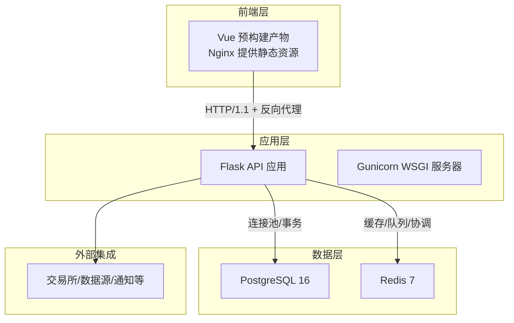
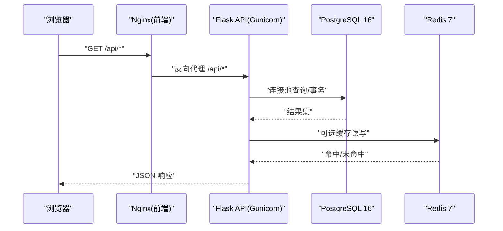
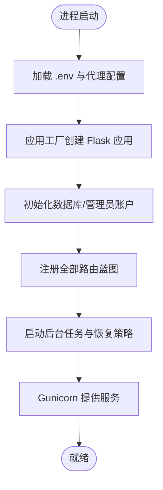
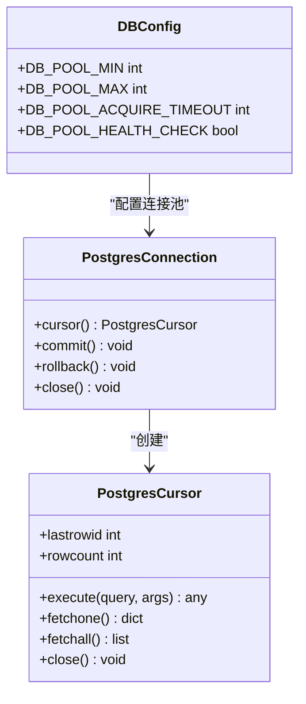
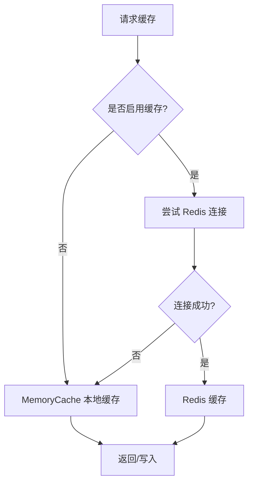
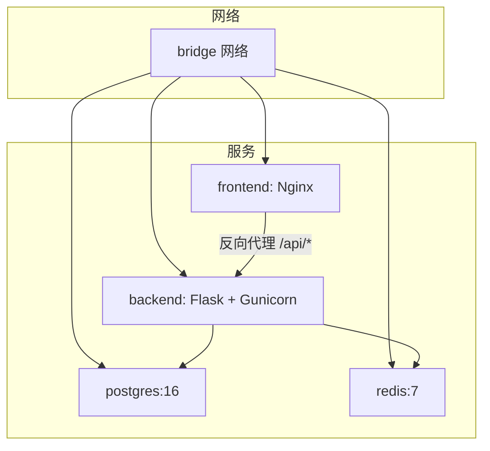

# 技术栈选型

<cite>
**本文引用的文件**
- [README.md](file://README.md)
- [docker-compose.yml](file://docker-compose.yml)
- [backend_api_python/Dockerfile](file://backend_api_python/Dockerfile)
- [frontend/Dockerfile](file://frontend/Dockerfile)
- [frontend/nginx.conf](file://frontend/nginx.conf)
- [backend_api_python/requirements.txt](file://backend_api_python/requirements.txt)
- [backend_api_python/run.py](file://backend_api_python/run.py)
- [backend_api_python/gunicorn_config.py](file://backend_api_python/gunicorn_config.py)
- [backend_api_python/app/__init__.py](file://backend_api_python/app/__init__.py)
- [backend_api_python/app/config/settings.py](file://backend_api_python/app/config/settings.py)
- [backend_api_python/app/config/database.py](file://backend_api_python/app/config/database.py)
- [backend_api_python/app/utils/db_postgres.py](file://backend_api_python/app/utils/db_postgres.py)
- [backend_api_python/app/utils/cache.py](file://backend_api_python/app/utils/cache.py)
- [backend_api_python/app/routes/health.py](file://backend_api_python/app/routes/health.py)
</cite>

## 目录
1. [引言](#引言)
2. [项目结构](#项目结构)
3. [核心组件](#核心组件)
4. [架构总览](#架构总览)
5. [详细组件分析](#详细组件分析)
6. [依赖分析](#依赖分析)
7. [性能考量](#性能考量)
8. [故障排查指南](#故障排查指南)
9. [结论](#结论)
10. [附录](#附录)

## 引言
本技术栈选型文档面向QuantDinger项目的后端与基础设施，聚焦以下核心技术与框架的选型理由、兼容性与集成方案，并结合仓库中的实际实现进行深入解析：  
- 后端：Python 3.12 + Flask 3.1.3 + Gunicorn  
- 前端：Vue.js（预构建产物）+ Nginx  
- 数据存储：PostgreSQL 16 + Redis 7  
- 部署：Docker容器化与docker-compose编排  

文档同时给出版本兼容性要求、性能与扩展性评估、演进路线图与替代方案对比，重点说明该技术栈如何支撑量化交易系统的高并发、低延迟与可靠性需求。

## 项目结构
QuantDinger采用“前后端分离 + 多容器编排”的工程组织方式：  
- 后端API位于 backend_api_python，包含Flask应用工厂、路由、服务层、工具库与Dockerfile  
- 前端位于 frontend，包含预构建产物与Nginx运行时Dockerfile及配置  
- docker-compose统一编排PostgreSQL、Redis、后端与前端服务  
- README提供架构概览、快速启动与使用说明

图表来源
- [docker-compose.yml:25-167](file://docker-compose.yml#L25-L167)
- [frontend/nginx.conf:26-42](file://frontend/nginx.conf#L26-L42)
- [backend_api_python/app/utils/db_postgres.py:107-161](file://backend_api_python/app/utils/db_postgres.py#L107-L161)
- [backend_api_python/app/utils/cache.py:49-99](file://backend_api_python/app/utils/cache.py#L49-L99)

章节来源
- [README.md:246-321](file://README.md#L246-L321)
- [docker-compose.yml:25-167](file://docker-compose.yml#L25-L167)

## 核心组件
- 后端技术栈：Python 3.12（容器基础镜像）、Flask 3.1.3、Gunicorn 22、psycopg2 2.9.9（PostgreSQL驱动）、redis 5.0（可选缓存）、bcrypt、PyJWT、dotenv、ccxt、yfinance、finnhub-python、akshare 等  
- 前端技术栈：Vue.js（预构建产物），Nginx 1.25（静态文件与反向代理）  
- 数据存储：PostgreSQL 16（多用户模式 + 连接池）、Redis 7（可选缓存/队列）  
- 部署：Dockerfile与docker-compose.yml，含健康检查、卷挂载、环境变量注入与网络隔离

章节来源
- [backend_api_python/requirements.txt:1-37](file://backend_api_python/requirements.txt#L1-L37)
- [backend_api_python/Dockerfile:3-61](file://backend_api_python/Dockerfile#L3-L61)
- [frontend/Dockerfile:7-18](file://frontend/Dockerfile#L7-L18)
- [docker-compose.yml:29-76](file://docker-compose.yml#L29-L76)

## 架构总览
下图展示从浏览器到后端API、再到数据库与缓存的整体调用链路与职责边界：

图表来源
- [frontend/nginx.conf:26-42](file://frontend/nginx.conf#L26-L42)
- [backend_api_python/app/utils/db_postgres.py:402-438](file://backend_api_python/app/utils/db_postgres.py#L402-L438)
- [backend_api_python/app/utils/cache.py:100-124](file://backend_api_python/app/utils/cache.py#L100-L124)

章节来源
- [README.md:269-321](file://README.md#L269-L321)
- [frontend/nginx.conf:1-56](file://frontend/nginx.conf#L1-L56)

## 详细组件分析

### 后端：Flask + Gunicorn + 运行入口
- 应用工厂与安全JSON提供者：通过SafeJSONProvider确保NaN/Inf被转换为null，避免前端解析异常；CORS已启用  
- 启动流程：run.py加载.env、应用代理配置、创建Flask应用实例；生产环境强制随机化SECRET_KEY；支持gunicorn启动  
- Gunicorn配置：默认单进程多线程（gthread），可通过环境变量调整工作进程数与线程数；禁用preload以保证后台任务在worker内正确初始化  
- 路由注册与启动钩子：注册所有蓝图并在应用上下文中启动订单/组合监控/USDT支付/Polymarket等后台任务；恢复运行中策略

图表来源
- [backend_api_python/run.py:96-134](file://backend_api_python/run.py#L96-L134)
- [backend_api_python/app/__init__.py:212-268](file://backend_api_python/app/__init__.py#L212-L268)
- [backend_api_python/gunicorn_config.py:10-36](file://backend_api_python/gunicorn_config.py#L10-L36)

章节来源
- [backend_api_python/run.py:1-134](file://backend_api_python/run.py#L1-L134)
- [backend_api_python/app/__init__.py:1-269](file://backend_api_python/app/__init__.py#L1-L269)
- [backend_api_python/gunicorn_config.py:1-36](file://backend_api_python/gunicorn_config.py#L1-L36)

### 数据库：PostgreSQL 16 连接池与兼容性
- 连接池：基于psycopg2的ThreadedConnectionPool，支持最小/最大连接数、获取超时、健康检查；支持UTC时区与keepalives  
- 懒加载与等待：当池耗尽时按指数回退等待，最长等待时间由DB_POOL_ACQUIRE_TIMEOUT控制  
- SQL兼容：对?占位符与INSERT OR IGNORE语法做向后兼容转换；自动处理RETURNING id回退逻辑  
- 健康检查：提供is_postgres_available与连接可用性检测  
- 环境变量：DATABASE_URL、DB_POOL_MIN/MAX/ACQUIRE_TIMEOUT/HEALTH_CHECK等

图表来源
- [backend_api_python/app/utils/db_postgres.py:107-161](file://backend_api_python/app/utils/db_postgres.py#L107-L161)
- [backend_api_python/app/utils/db_postgres.py:237-370](file://backend_api_python/app/utils/db_postgres.py#L237-L370)
- [backend_api_python/app/config/database.py:5-90](file://backend_api_python/app/config/database.py#L5-L90)

章节来源
- [backend_api_python/app/utils/db_postgres.py:1-495](file://backend_api_python/app/utils/db_postgres.py#L1-L495)
- [backend_api_python/app/config/database.py:1-90](file://backend_api_python/app/config/database.py#L1-L90)

### 缓存：本地内存缓存与Redis可选层
- 设计原则：本地优先（MemoryCache），仅在显式启用时使用Redis；不可用时自动降级为内存缓存  
- TTL策略：针对K线、分析、价格等设定不同TTL；支持JSON序列化/反序列化  
- 运行期探测：启动时尝试ping Redis，失败静默降级

图表来源
- [backend_api_python/app/utils/cache.py:49-99](file://backend_api_python/app/utils/cache.py#L49-L99)

章节来源
- [backend_api_python/app/utils/cache.py:1-129](file://backend_api_python/app/utils/cache.py#L1-L129)
- [backend_api_python/app/config/database.py:49-90](file://backend_api_python/app/config/database.py#L49-L90)

### 健康检查与容器编排
- 健康检查：后端/前端均提供/health端点；compose中定义了健康检查与重启策略  
- 端口映射：默认前端8888、后端5000、数据库5432、Redis 6379  
- 网络隔离：统一桥接网络，便于服务间通信  
- 环境变量：通过环境变量控制数据库URL、Redis地址、连接池大小、Gunicorn并发、功能开关等

图表来源
- [docker-compose.yml:25-167](file://docker-compose.yml#L25-L167)
- [backend_api_python/app/routes/health.py:10-34](file://backend_api_python/app/routes/health.py#L10-L34)

章节来源
- [docker-compose.yml:25-167](file://docker-compose.yml#L25-L167)
- [backend_api_python/app/routes/health.py:1-34](file://backend_api_python/app/routes/health.py#L1-L34)

### 前端：Vue 预构建 + Nginx
- 预构建交付：前端源码位于独立仓库，此处仅包含预构建产物与Nginx运行时Dockerfile  
- Nginx配置：启用安全头、Gzip压缩、静态资源强缓存、SPA路由回退至index.html、/api/代理到后端、/health健康检查  
- 默认监听80端口，通过docker-compose映射到宿主机端口

章节来源
- [frontend/Dockerfile:1-19](file://frontend/Dockerfile#L1-L19)
- [frontend/nginx.conf:1-56](file://frontend/nginx.conf#L1-L56)

## 依赖分析
- 版本与兼容性要点
  - Python 3.12：容器基础镜像为python:3.12-slim-bookworm；后端入口run.py明确UTF-8输出与代理环境注入  
  - Flask 3.1.3：配合Werkzeug 3.1.6+（修复会话/Vary: Cookie与safe_join漏洞）  
  - Gunicorn 22：稳定生产WSGI，禁用preload以适配后台任务生命周期  
  - PostgreSQL 16：compose使用postgres:16-alpine，数据库初始化SQL随容器启动执行  
  - Redis 7：compose使用redis:7-alpine，限制内存与淘汰策略，适合作为缓存/轻量队列  
  - Nginx 1.25：前端运行时镜像nginx:1.25-alpine，提供静态资源与反向代理  
- 第三方库：ccxt、yfinance、finnhub-python、akshare、PyJWT、bcrypt、psycopg2-binary、redis、ib_insync、bip-utils等

章节来源
- [backend_api_python/Dockerfile:3-61](file://backend_api_python/Dockerfile#L3-L61)
- [backend_api_python/requirements.txt:1-37](file://backend_api_python/requirements.txt#L1-L37)
- [docker-compose.yml:29-76](file://docker-compose.yml#L29-L76)
- [frontend/Dockerfile:7-18](file://frontend/Dockerfile#L7-L18)

## 性能考量
- 并发模型
  - 后端：gthread（单进程多线程）默认配置，适合I/O密集型；可通过GUNICORN_WORKERS与GUNICORN_THREADS提升吞吐  
  - 数据库：连接池上限DB_POOL_MAX、获取超时DB_POOL_ACQUIRE_TIMEOUT、健康检查DB_POOL_HEALTH_CHECK，避免请求阻塞  
  - 缓存：Redis可选启用，显著降低热点查询压力；内存缓存作为降级保障  
- 延迟优化
  - Nginx启用Gzip与静态资源强缓存，减少首屏与资源传输延迟  
  - /api/代理设置较长读写超时（如600s），满足长时间回测请求  
- 可靠性
  - 健康检查与重启策略；数据库与Redis均配置健康检查；后端/前端/数据库分别独立容器，故障隔离  
  - SECRET_KEY强制随机化，防止默认密钥导致的安全风险

章节来源
- [backend_api_python/gunicorn_config.py:10-36](file://backend_api_python/gunicorn_config.py#L10-L36)
- [backend_api_python/app/utils/db_postgres.py:53-56](file://backend_api_python/app/utils/db_postgres.py#L53-L56)
- [frontend/nginx.conf:12-42](file://frontend/nginx.conf#L12-L42)
- [docker-compose.yml:54-131](file://docker-compose.yml#L54-L131)
- [backend_api_python/run.py:109-120](file://backend_api_python/run.py#L109-L120)

## 故障排查指南
- 健康检查
  - 后端：访问/api/health；compose中curl探针定时检查  
  - 前端：访问/health；Nginx直接返回OK  
- 常见问题定位
  - 数据库连接池耗尽：检查DB_POOL_MAX与DB_POOL_ACQUIRE_TIMEOUT；观察慢查询与长事务  
  - Redis不可用：确认CACHE_ENABLED与Redis连通性；若不可用将自动降级为内存缓存  
  - SECRET_KEY默认值：生产环境必须替换默认密钥，否则后端容器不会启动  
  - 代理与国内数据源：run.py中对代理与NO_PROXY做了特殊处理，避免国内金融数据绕行海外代理造成延迟

章节来源
- [backend_api_python/app/routes/health.py:10-34](file://backend_api_python/app/routes/health.py#L10-L34)
- [docker-compose.yml:54-154](file://docker-compose.yml#L54-L154)
- [backend_api_python/run.py:36-91](file://backend_api_python/run.py#L36-L91)

## 结论
QuantDinger采用“Python + Flask + Gunicorn + Nginx + PostgreSQL + Redis”的成熟技术栈，结合docker-compose实现一键部署与健康检查。该选型在以下方面具备优势：  
- 高并发：gthread并发模型与连接池机制，满足I/O密集型服务  
- 低延迟：Nginx静态资源与代理优化、Redis可选缓存、短连接超时与健康检查  
- 可靠性：容器化隔离、健康检查、自动重启、连接池健康检查与错误回退  
- 可扩展性：通过环境变量调节并发与连接池，支持横向扩展（多worker）与纵向扩展（更大连接池）

## 附录

### 技术栈演进路线图与替代方案对比
- 后端
  - 当前：Flask 3.1.3 + Gunicorn 22（稳定、生态成熟）  
  - 替代：FastAPI（异步、自动生成OpenAPI文档）；需评估异步生态与迁移成本  
- 数据库
  - 当前：PostgreSQL 16（成熟、ACID、多用户模式）  
  - 替代：TimescaleDB（时序数据优化）、CockroachDB（分布式一致性）  
- 缓存
  - 当前：Redis 7（键值缓存/队列）  
  - 替代：Memcached（简单KV）、ClickHouse（OLAP）、MinIO（对象存储）  
- 部署
  - 当前：Docker + docker-compose（开发友好）  
  - 替代：Kubernetes（更复杂的编排与弹性伸缩）

章节来源
- [backend_api_python/requirements.txt:1-37](file://backend_api_python/requirements.txt#L1-L37)
- [docker-compose.yml:29-76](file://docker-compose.yml#L29-L76)