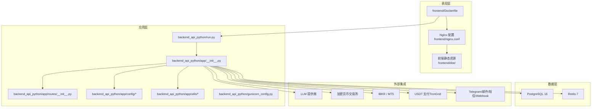
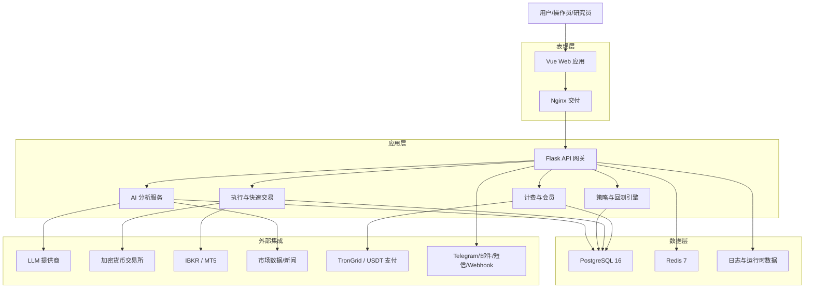
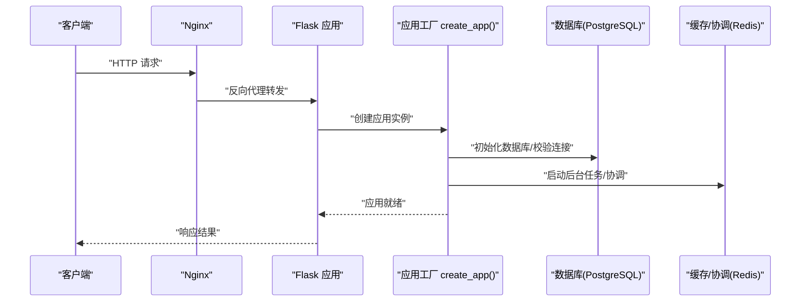
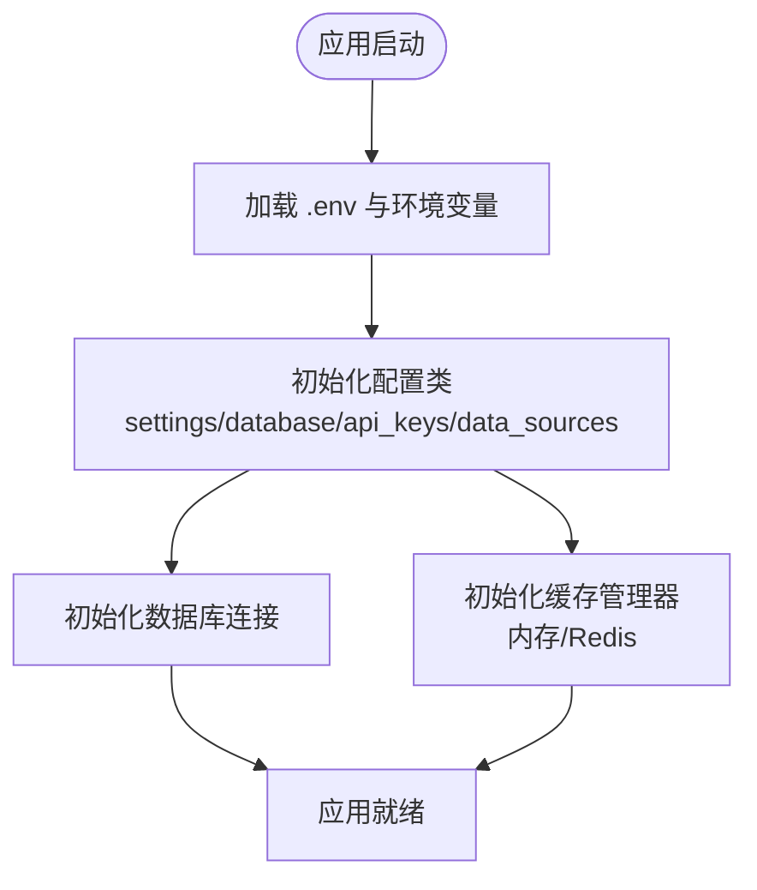
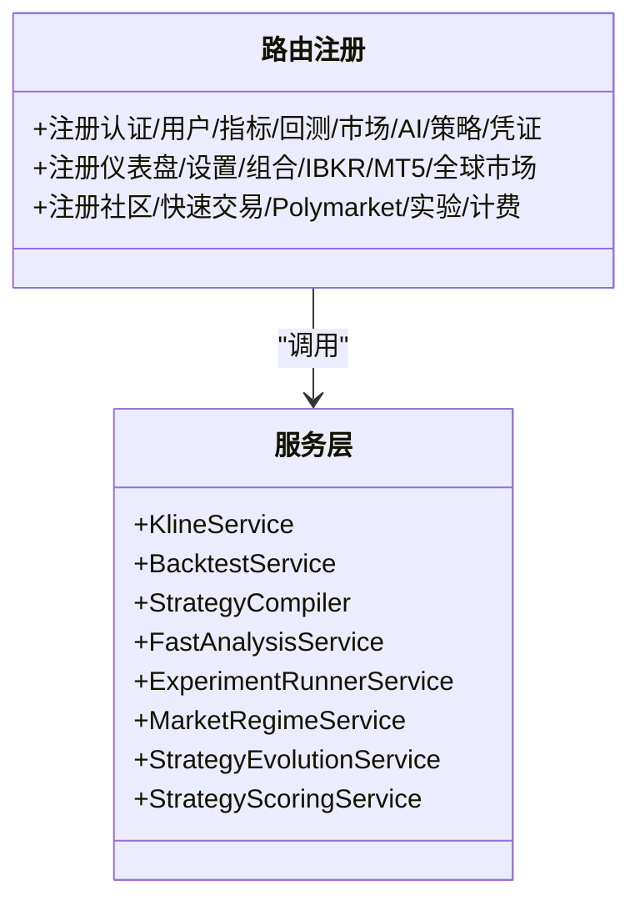
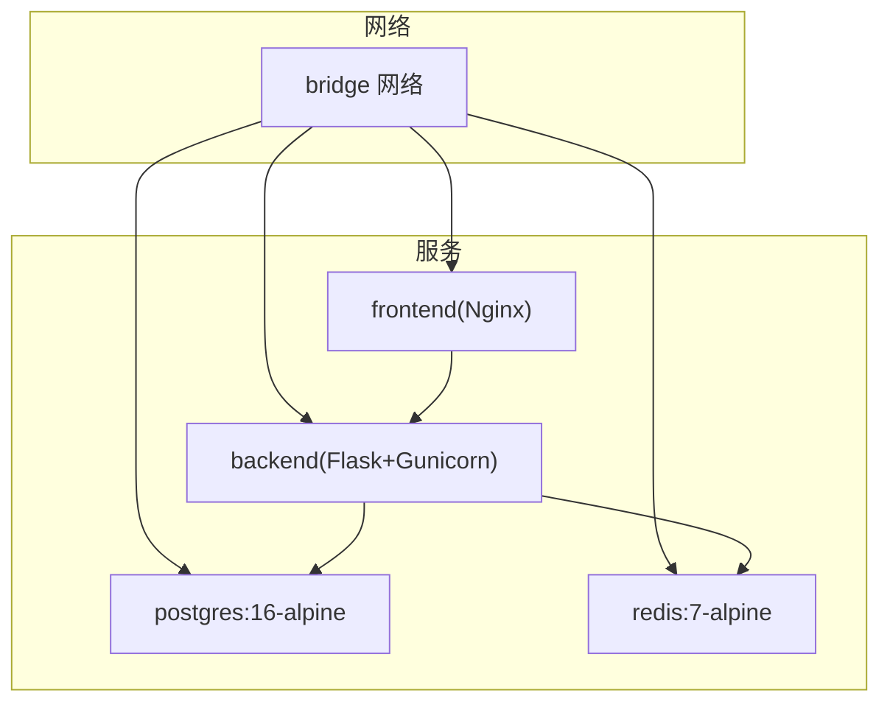
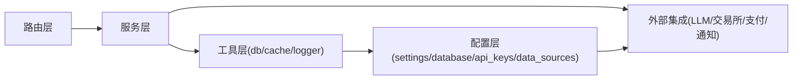

# 整体架构概览

<cite>
**本文档引用的文件**
- [README.md](file://README.md)
- [docker-compose.yml](file://docker-compose.yml)
- [backend_api_python/run.py](file://backend_api_python/run.py)
- [backend_api_python/app/__init__.py](file://backend_api_python/app/__init__.py)
- [backend_api_python/app/config/settings.py](file://backend_api_python/app/config/settings.py)
- [backend_api_python/app/config/database.py](file://backend_api_python/app/config/database.py)
- [backend_api_python/app/config/api_keys.py](file://backend_api_python/app/config/api_keys.py)
- [backend_api_python/app/config/data_sources.py](file://backend_api_python/app/config/data_sources.py)
- [backend_api_python/app/routes/__init__.py](file://backend_api_python/app/routes/__init__.py)
- [backend_api_python/app/utils/db.py](file://backend_api_python/app/utils/db.py)
- [backend_api_python/app/utils/cache.py](file://backend_api_python/app/utils/cache.py)
- [backend_api_python/gunicorn_config.py](file://backend_api_python/gunicorn_config.py)
- [frontend/Dockerfile](file://frontend/Dockerfile)
- [backend_api_python/Dockerfile](file://backend_api_python/Dockerfile)
</cite>

## 目录
1. [简介](#简介)
2. [项目结构](#项目结构)
3. [核心组件](#核心组件)
4. [架构总览](#架构总览)
5. [详细组件分析](#详细组件分析)
6. [依赖关系分析](#依赖关系分析)
7. [性能考量](#性能考量)
8. [故障排查指南](#故障排查指南)
9. [结论](#结论)

## 简介
QuantDinger 是一个自托管、本地优先的量化交易与算法交易平台，提供从 AI 市场研究、Python 指标与策略开发、回测到实盘执行与运营监控的一体化工作流。系统采用分层架构：表现层（Vue 前端通过 Nginx 提供静态资源）、应用层（Flask API 网关与业务服务）、数据层（PostgreSQL 与 Redis）以及外部集成层（AI 服务、交易所/经纪商 API、支付网关、通知服务）。系统强调模块化设计与可扩展性，支持多用户、计费、会员体系，并提供 Docker Compose 一键部署能力。

章节来源
- [README.md: 236-321:236-321](file://README.md#L236-L321)

## 项目结构
仓库采用按功能域组织的分层结构：
- 表现层：frontend/（预构建 SPA，由 Nginx 提供）
- 应用层：backend_api_python/（Flask 后端，包含 routes、services、utils、config 等）
- 文档与示例：docs/（使用指南、策略开发、部署说明等）
- 脚本与编排：scripts/、docker-compose.yml

图表来源
- [frontend/Dockerfile: 1-19:1-19](file://frontend/Dockerfile#L1-L19)
- [backend_api_python/run.py: 96-101:96-101](file://backend_api_python/run.py#L96-L101)
- [backend_api_python/app/__init__.py: 212-267:212-267](file://backend_api_python/app/__init__.py#L212-L267)
- [backend_api_python/app/routes/__init__.py: 7-53:7-53](file://backend_api_python/app/routes/__init__.py#L7-L53)
- [backend_api_python/app/config/settings.py: 10-28:10-28](file://backend_api_python/app/config/settings.py#L10-L28)
- [backend_api_python/app/utils/db.py: 19-25:19-25](file://backend_api_python/app/utils/db.py#L19-L25)
- [backend_api_python/app/utils/cache.py: 49-99:49-99](file://backend_api_python/app/utils/cache.py#L49-L99)

章节来源
- [README.md: 466-484:466-484](file://README.md#L466-L484)
- [docker-compose.yml: 25-167:25-167](file://docker-compose.yml#L25-L167)

## 核心组件
- 前端（Nginx + Vue SPA）
  - 使用预构建的前端包，通过 Nginx 提供静态资源；容器内暴露 80 端口并进行健康检查。
- 后端（Flask API + Gunicorn）
  - 应用工厂模式创建 Flask 应用，注册路由蓝图，初始化数据库与管理员账户，启动后台任务（挂单处理、组合监控、USDT 订单、Polymarket 分析、AI 校准与反思）。
  - 通过 gunicorn_config.py 控制并发模型（单进程多线程），避免预加载导致后台线程丢失。
- 数据层（PostgreSQL + Redis）
  - PostgreSQL 作为主存储，迁移脚本初始化表结构；Redis 作为可选缓存与后台任务协调。
- 外部集成
  - AI 层：OpenRouter、OpenAI、Gemini、DeepSeek、Grok、自定义 LLM 等；支持搜索增强（Tavily、SerpAPI）。
  - 交易层：加密货币交易所适配器（Binance、OKX、Bybit、Gate.io、HTX 等）；IBKR/MT5 传统市场接入。
  - 支付与通知：USDT TRC20 支付（TronGrid），多渠道通知（Telegram、邮件、短信、Webhook）。

章节来源
- [README.md: 240-321:240-321](file://README.md#L240-L321)
- [backend_api_python/app/__init__.py: 212-267:212-267](file://backend_api_python/app/__init__.py#L212-L267)
- [backend_api_python/app/config/api_keys.py: 10-184:10-184](file://backend_api_python/app/config/api_keys.py#L10-L184)
- [backend_api_python/app/config/database.py: 6-47:6-47](file://backend_api_python/app/config/database.py#L6-L47)
- [backend_api_python/app/utils/db.py: 19-48:19-48](file://backend_api_python/app/utils/db.py#L19-L48)
- [backend_api_python/app/utils/cache.py: 49-99:49-99](file://backend_api_python/app/utils/cache.py#L49-L99)

## 架构总览
系统采用“表现层-应用层-数据层-外部集成层”的四层架构，通过 Nginx 与 Flask/Gunicorn 协同，实现高内聚、低耦合的模块化设计。系统边界清晰：前端仅负责静态资源交付，后端提供 API 与业务服务，数据层负责持久化与缓存，外部集成通过可插拔适配器对接。

图表来源
- [README.md: 267-321:267-321](file://README.md#L267-L321)
- [backend_api_python/app/__init__.py: 248-265:248-265](file://backend_api_python/app/__init__.py#L248-L265)
- [backend_api_python/app/utils/db.py: 19-25:19-25](file://backend_api_python/app/utils/db.py#L19-L25)
- [backend_api_python/app/utils/cache.py: 49-99:49-99](file://backend_api_python/app/utils/cache.py#L49-L99)

## 详细组件分析

### 组件一：应用工厂与启动流程
- 应用工厂 create_app() 负责：
  - 初始化安全 JSON 提供者，确保 NaN/Infinity 被转换为 null，避免前端解析错误。
  - 注册 CORS，设置日志。
  - 初始化数据库并确保管理员账户存在。
  - 注册所有路由蓝图。
  - 启动后台任务：挂单处理、组合监控、USDT 订单、Polymarket 分析、AI 校准与反思。
  - 启动时尝试恢复 IndicatorStrategy 类型的运行中策略。
- run.py 负责：
  - 早期加载 .env，设置代理与编码，注入项目根目录到 Python 路径。
  - 创建应用实例并通过 Flask 开发服务器或 Gunicorn 启动。
  - 在生产模式下对默认 SECRET_KEY 进行安全检查并自动替换。

图表来源
- [backend_api_python/run.py: 96-134:96-134](file://backend_api_python/run.py#L96-L134)
- [backend_api_python/app/__init__.py: 212-267:212-267](file://backend_api_python/app/__init__.py#L212-L267)
- [backend_api_python/app/utils/db.py: 38-48:38-48](file://backend_api_python/app/utils/db.py#L38-L48)
- [backend_api_python/app/utils/cache.py: 49-99:49-99](file://backend_api_python/app/utils/cache.py#L49-L99)

章节来源
- [backend_api_python/run.py: 17-134:17-134](file://backend_api_python/run.py#L17-L134)
- [backend_api_python/app/__init__.py: 212-267:212-267](file://backend_api_python/app/__init__.py#L212-L267)

### 组件二：配置与数据源
- 配置体系
  - 应用配置（settings.py）：主机、端口、调试、版本、认证、日志、限流、功能开关等。
  - 数据库与缓存配置（database.py）：Redis 主机、端口、密码、DB、超时、最大连接数；缓存 TTL 等。
  - API 密钥配置（api_keys.py）：统一管理 LLM 与第三方 API 密钥，支持环境变量与附加配置覆盖。
  - 数据源配置（data_sources.py）：超时、重试、速率限制、映射（如 yfinance 时间框架、CCXT 默认交易所、Akshare 周期映射）。
- 数据访问与缓存
  - 数据库：统一使用 PostgreSQL，提供连接池与同步/异步连接接口。
  - 缓存：本地优先（内存缓存），可选启用 Redis；当 Redis 不可用时自动降级为内存缓存。

图表来源
- [backend_api_python/app/config/settings.py: 10-99:10-99](file://backend_api_python/app/config/settings.py#L10-L99)
- [backend_api_python/app/config/database.py: 6-90:6-90](file://backend_api_python/app/config/database.py#L6-L90)
- [backend_api_python/app/config/api_keys.py: 10-184:10-184](file://backend_api_python/app/config/api_keys.py#L10-L184)
- [backend_api_python/app/config/data_sources.py: 26-171:26-171](file://backend_api_python/app/config/data_sources.py#L26-L171)
- [backend_api_python/app/utils/db.py: 19-48:19-48](file://backend_api_python/app/utils/db.py#L19-L48)
- [backend_api_python/app/utils/cache.py: 49-99:49-99](file://backend_api_python/app/utils/cache.py#L49-L99)

章节来源
- [backend_api_python/app/config/settings.py: 10-99:10-99](file://backend_api_python/app/config/settings.py#L10-L99)
- [backend_api_python/app/config/database.py: 6-90:6-90](file://backend_api_python/app/config/database.py#L6-L90)
- [backend_api_python/app/config/api_keys.py: 10-184:10-184](file://backend_api_python/app/config/api_keys.py#L10-L184)
- [backend_api_python/app/config/data_sources.py: 26-171:26-171](file://backend_api_python/app/config/data_sources.py#L26-L171)
- [backend_api_python/app/utils/db.py: 19-48:19-48](file://backend_api_python/app/utils/db.py#L19-L48)
- [backend_api_python/app/utils/cache.py: 49-99:49-99](file://backend_api_python/app/utils/cache.py#L49-L99)

### 组件三：路由与服务层
- 路由注册（routes/__init__.py）
  - 统一注册所有蓝图，按前缀组织 API，涵盖认证、用户、指标、回测、市场、AI、策略、凭证、仪表盘、设置、组合、IBKR、MT5、全球市场、社区、快速交易、Polymarket、实验、计费等。
- 服务层（services/*）
  - 包含 Kline、Backtest、StrategyCompiler、FastAnalysis、Experiment（Runner/Regime/Evolution/Scoring）等核心服务，支撑策略开发、回测与实验。

图表来源
- [backend_api_python/app/routes/__init__.py: 7-53:7-53](file://backend_api_python/app/routes/__init__.py#L7-L53)
- [backend_api_python/app/services/__init__.py: 4-26:4-26](file://backend_api_python/app/services/__init__.py#L4-L26)

章节来源
- [backend_api_python/app/routes/__init__.py: 7-53:7-53](file://backend_api_python/app/routes/__init__.py#L7-L53)
- [backend_api_python/app/services/__init__.py: 4-26:4-26](file://backend_api_python/app/services/__init__.py#L4-L26)

### 组件四：部署拓扑与容器编排
- docker-compose.yml
  - PostgreSQL：初始化脚本、健康检查、连接上限与共享缓冲配置。
  - Redis：内存限制与淘汰策略，健康检查。
  - Backend：基于 Dockerfile 构建，挂载日志与数据卷，注入 .env，设置数据库连接池与 Gunicorn 并发参数，健康检查。
  - Frontend：基于 Nginx 镜像，复制 dist 与 nginx.conf，暴露 80 端口，健康检查。
- 健康检查
  - 后端：访问 /api/health。
  - 前端：访问 /health。
  - 数据库：pg_isready 检查。

图表来源
- [docker-compose.yml: 29-154:29-154](file://docker-compose.yml#L29-L154)
- [backend_api_python/Dockerfile: 1-62:1-62](file://backend_api_python/Dockerfile#L1-L62)
- [frontend/Dockerfile: 1-19:1-19](file://frontend/Dockerfile#L1-L19)

章节来源
- [docker-compose.yml: 29-154:29-154](file://docker-compose.yml#L29-L154)
- [backend_api_python/Dockerfile: 1-62:1-62](file://backend_api_python/Dockerfile#L1-L62)
- [frontend/Dockerfile: 1-19:1-19](file://frontend/Dockerfile#L1-L19)

## 依赖关系分析
- 组件内聚与解耦
  - 路由层仅负责请求分发，业务逻辑集中在服务层；配置类集中管理环境变量与默认值，降低耦合。
  - 数据访问通过统一工具模块封装，缓存层支持本地与 Redis 双栈，便于横向扩展。
- 外部依赖
  - Flask 生态（CORS、JSON Provider）。
  - 数据库与缓存驱动（SQLAlchemy/psycopg2、Redis）。
  - 第三方服务（LLM、交易所、支付、通知）通过配置类与适配器解耦。
- 循环依赖
  - 应用工厂在启动阶段延迟导入服务以避免循环依赖；后台任务通过条件启动与日志记录保证健壮性。

图表来源
- [backend_api_python/app/routes/__init__.py: 7-53:7-53](file://backend_api_python/app/routes/__init__.py#L7-L53)
- [backend_api_python/app/__init__.py: 244-265:244-265](file://backend_api_python/app/__init__.py#L244-L265)
- [backend_api_python/app/utils/db.py: 19-25:19-25](file://backend_api_python/app/utils/db.py#L19-L25)
- [backend_api_python/app/utils/cache.py: 49-99:49-99](file://backend_api_python/app/utils/cache.py#L49-L99)
- [backend_api_python/app/config/api_keys.py: 10-184:10-184](file://backend_api_python/app/config/api_keys.py#L10-L184)

章节来源
- [backend_api_python/app/__init__.py: 244-265:244-265](file://backend_api_python/app/__init__.py#L244-L265)
- [backend_api_python/app/utils/db.py: 19-25:19-25](file://backend_api_python/app/utils/db.py#L19-L25)
- [backend_api_python/app/utils/cache.py: 49-99:49-99](file://backend_api_python/app/utils/cache.py#L49-L99)

## 性能考量
- 并发模型
  - 使用 gthread（单进程多线程）提升 I/O 并发，避免预加载导致后台线程丢失；可通过 GUNICORN_WORKERS 与 GUNICORN_THREADS 调整。
- 数据库连接池
  - 通过 DB_POOL_MIN/MAX/ACQUIRE_TIMEOUT/HEALTH_CHECK 参数优化连接池，减少“连接池耗尽”问题。
- 缓存策略
  - K线、分析、价格等 TTL 差异化配置；Redis 可选启用，不可用时自动降级为内存缓存。
- 代理与网络
  - 支持全局代理与国内金融数据直连绕过，减少不必要的跨境流量。

章节来源
- [backend_api_python/gunicorn_config.py: 10-36:10-36](file://backend_api_python/gunicorn_config.py#L10-L36)
- [docker-compose.yml: 110-122:110-122](file://docker-compose.yml#L110-L122)
- [backend_api_python/app/config/database.py: 52-85:52-85](file://backend_api_python/app/config/database.py#L52-L85)
- [backend_api_python/run.py: 60-91:60-91](file://backend_api_python/run.py#L60-L91)

## 故障排查指南
- 启动失败（SECRET_KEY 默认值）
  - 现象：生产模式下若 SECRET_KEY 未修改，应用会自动生成随机密钥并提示设置持久密钥。
  - 排查：检查 backend_api_python/.env 中 SECRET_KEY 是否被修改。
- 健康检查失败
  - 后端：访问 /api/health；确认数据库与 Redis 健康检查通过。
  - 前端：访问 /health；确认 Nginx 正常提供静态资源。
- 数据库连接问题
  - 确认 DATABASE_URL、POSTGRES_* 环境变量正确；查看初始化 SQL 是否成功执行。
- 缓存不可用
  - 若启用 Redis 但不可达，系统会自动降级为内存缓存；检查 Redis_HOST/PORT/PASSWORD。
- 后台任务未启动
  - 检查对应开关（如 ENABLE_PENDING_ORDER_WORKER、ENABLE_PORTFOLIO_MONITOR、USDT_PAY_ENABLED）与日志输出。

章节来源
- [backend_api_python/run.py: 109-120:109-120](file://backend_api_python/run.py#L109-L120)
- [docker-compose.yml: 54-154:54-154](file://docker-compose.yml#L54-L154)
- [backend_api_python/app/utils/db.py: 38-48:38-48](file://backend_api_python/app/utils/db.py#L38-L48)
- [backend_api_python/app/utils/cache.py: 77-98:77-98](file://backend_api_python/app/utils/cache.py#L77-L98)
- [backend_api_python/app/__init__.py: 110-150:110-150](file://backend_api_python/app/__init__.py#L110-L150)

## 结论
QuantDinger 通过清晰的分层架构与模块化设计，实现了从研究、策略开发、回测到实盘执行与运营的全链路整合。前端采用 Nginx 承载预构建 SPA，后端以 Flask + Gunicorn 提供稳定 API 服务，数据层以 PostgreSQL 为核心并辅以 Redis 缓存，外部集成通过可插拔适配器实现灵活扩展。系统具备良好的可扩展性与可运维性，适合团队与运营场景下的私有化部署与商业化落地。