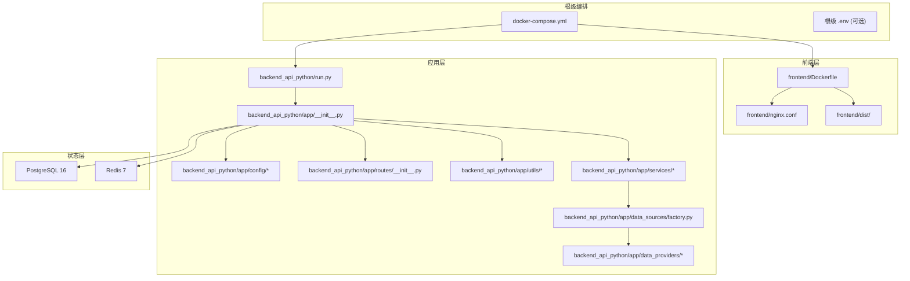
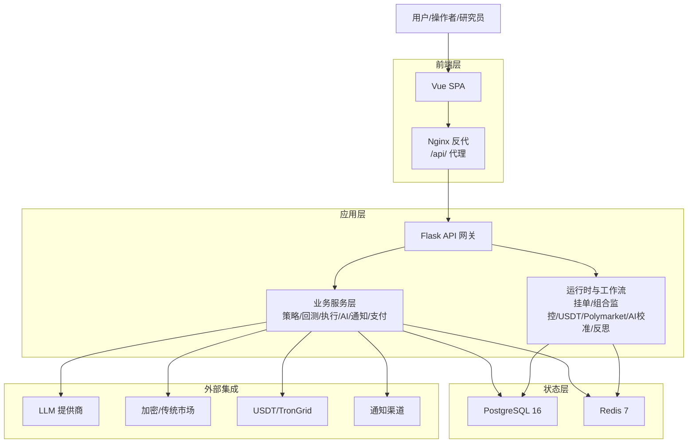
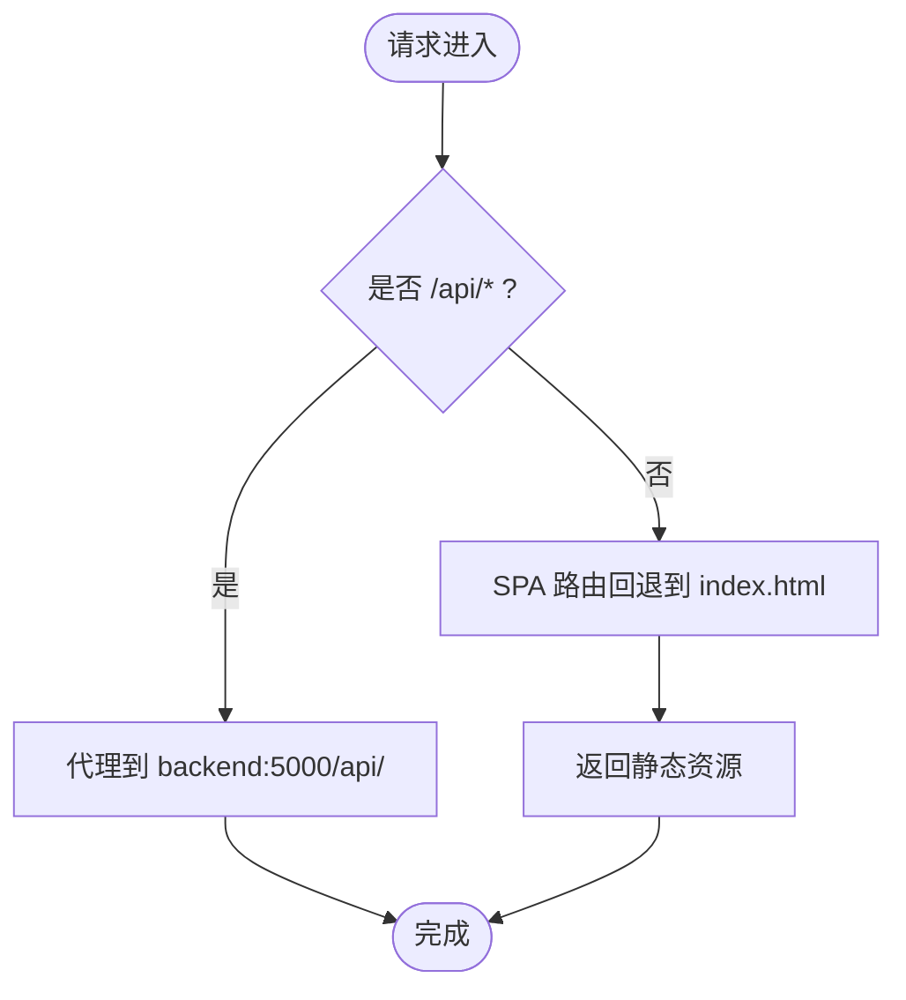
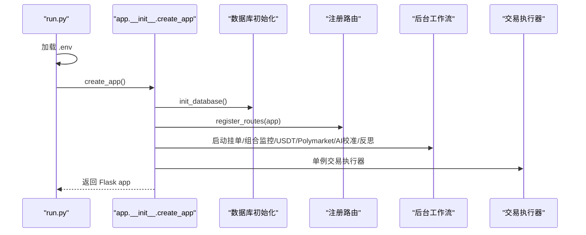
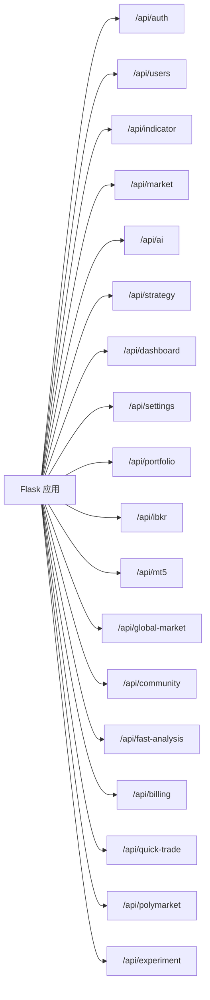
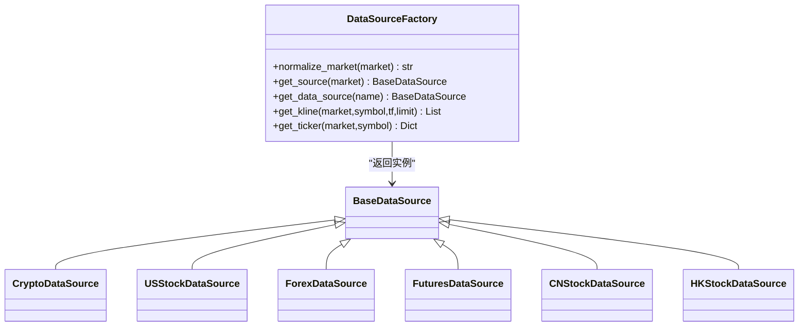
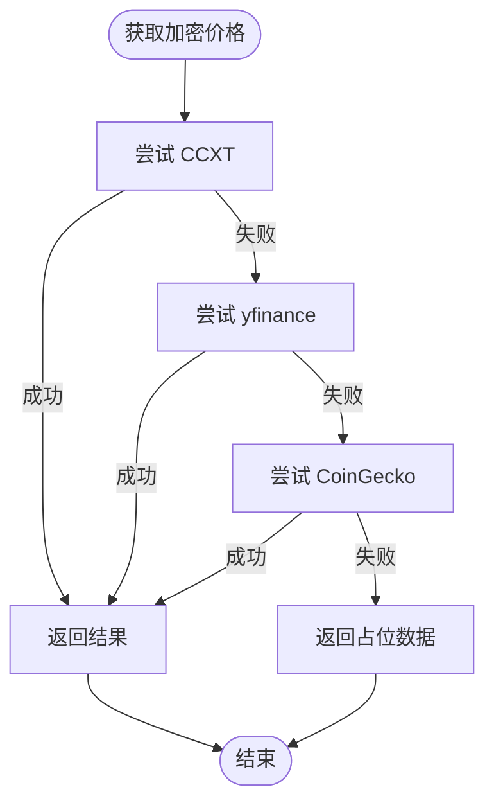
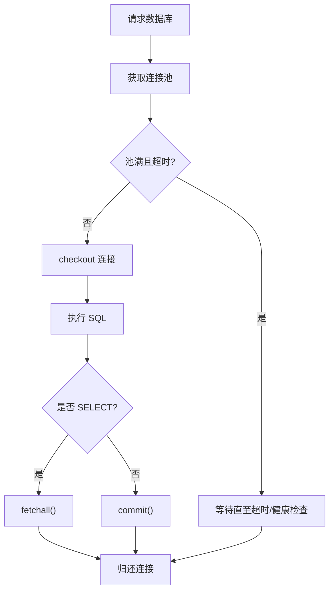
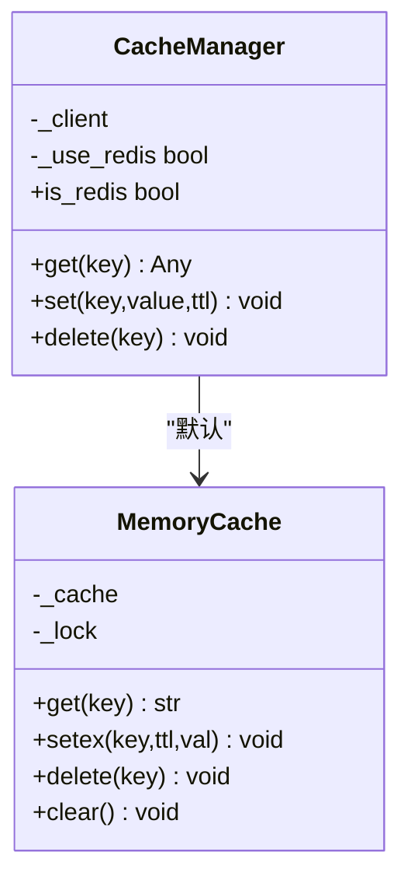
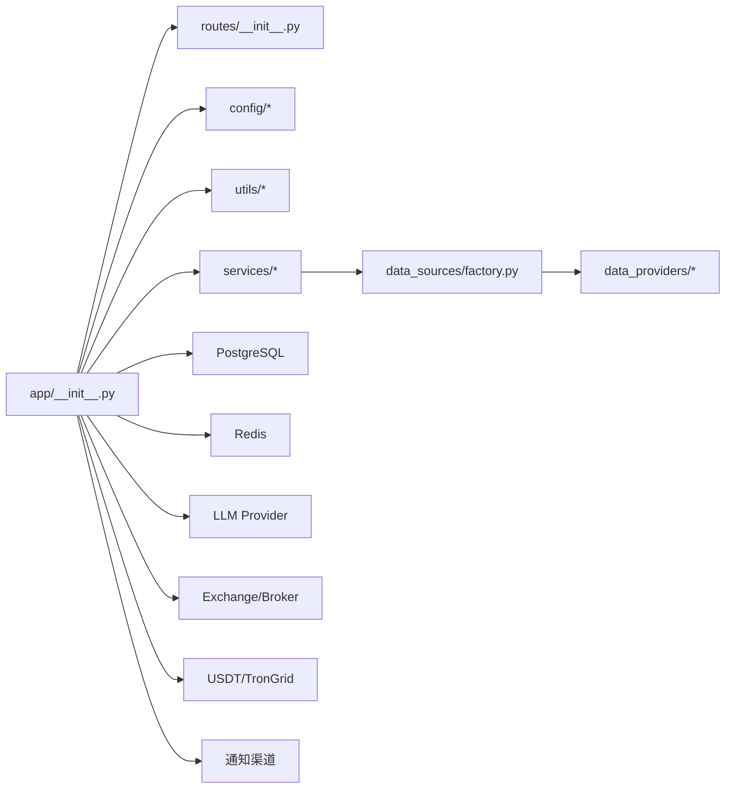

# 架构设计

<cite>
**本文引用的文件**
- [README.md](file://README.md)
- [docker-compose.yml](file://docker-compose.yml)
- [backend_api_python/run.py](file://backend_api_python/run.py)
- [backend_api_python/app/__init__.py](file://backend_api_python/app/__init__.py)
- [backend_api_python/app/config/settings.py](file://backend_api_python/app/config/settings.py)
- [backend_api_python/app/config/database.py](file://backend_api_python/app/config/database.py)
- [backend_api_python/app/routes/__init__.py](file://backend_api_python/app/routes/__init__.py)
- [backend_api_python/app/utils/db_postgres.py](file://backend_api_python/app/utils/db_postgres.py)
- [backend_api_python/app/utils/cache.py](file://backend_api_python/app/utils/cache.py)
- [backend_api_python/app/utils/logger.py](file://backend_api_python/app/utils/logger.py)
- [backend_api_python/app/utils/db.py](file://backend_api_python/app/utils/db.py)
- [backend_api_python/app/data_sources/factory.py](file://backend_api_python/app/data_sources/factory.py)
- [backend_api_python/app/data_providers/crypto.py](file://backend_api_python/app/data_providers/crypto.py)
- [backend_api_python/gunicorn_config.py](file://backend_api_python/gunicorn_config.py)
- [backend_api_python/Dockerfile](file://backend_api_python/Dockerfile)
- [frontend/Dockerfile](file://frontend/Dockerfile)
- [frontend/nginx.conf](file://frontend/nginx.conf)
- [backend_api_python/env.example](file://backend_api_python/env.example)
</cite>

## 目录
1. [引言](#引言)
2. [项目结构](#项目结构)
3. [核心组件](#核心组件)
4. [架构总览](#架构总览)
5. [详细组件分析](#详细组件分析)
6. [依赖分析](#依赖分析)
7. [性能考量](#性能考量)
8. [故障排查指南](#故障排查指南)
9. [结论](#结论)
10. [附录](#附录)

## 引言
QuantDinger 是一个“自托管、本地优先”的量化交易与算法交易平台，面向研究、策略开发、回测、实盘执行、组合监控与商业化运营。其核心承诺是“一套栈替代五套栈”，将 AI 分析、图表、策略逻辑、运行时服务、告警与运营能力整合到一个可部署的产品中。

系统采用分层架构与微服务思想结合的事件驱动设计：前端通过 Nginx 提供静态资源与反向代理；后端以 Flask API 网关为核心，承载路由、业务服务与运行时；状态层以 PostgreSQL 与 Redis 组合提供持久化与缓存/协调；外部集成层覆盖 LLM 提供商、交易所、支付与通知通道。

## 项目结构
仓库采用“根级编排 + 后端源码 + 前端交付包”的组织方式：
- 根级 docker-compose 定义容器编排与网络、卷、健康检查
- backend_api_python：Flask 应用源码、路由、服务、工具与配置
- frontend：预构建 SPA 包与 Nginx 配置
- docs：产品与部署文档
- scripts：构建与辅助脚本

**图表来源**
- [docker-compose.yml:25-167](file://docker-compose.yml#L25-L167)
- [frontend/Dockerfile:1-19](file://frontend/Dockerfile#L1-L19)
- [frontend/nginx.conf:1-56](file://frontend/nginx.conf#L1-L56)
- [backend_api_python/run.py:96-101](file://backend_api_python/run.py#L96-L101)
- [backend_api_python/app/__init__.py:212-268](file://backend_api_python/app/__init__.py#L212-L268)
- [backend_api_python/app/routes/__init__.py:7-53](file://backend_api_python/app/routes/__init__.py#L7-L53)
- [backend_api_python/app/config/database.py:6-47](file://backend_api_python/app/config/database.py#L6-L47)
- [backend_api_python/app/data_sources/factory.py:27-103](file://backend_api_python/app/data_sources/factory.py#L27-L103)

**章节来源**
- [README.md:466-484](file://README.md#L466-L484)
- [docker-compose.yml:1-167](file://docker-compose.yml#L1-L167)
- [frontend/Dockerfile:1-19](file://frontend/Dockerfile#L1-L19)
- [backend_api_python/Dockerfile:1-62](file://backend_api_python/Dockerfile#L1-L62)

## 核心组件
- 前端层（Nginx + 预构建 SPA）
  - 使用 Nginx 提供静态资源、安全头、Gzip 压缩与 SPA 路由回退
  - 将 /api/ 请求代理至后端 Flask 服务
- 应用层（Flask API 网关 + Python 服务）
  - 应用工厂创建 Flask 实例，注册路由蓝图，初始化数据库与管理员账户
  - 启动后台工作流：挂单处理、组合监控、USDT 支付、Polymarket、AI 校准与反思
  - 提供策略引擎、回测、指标、AI 快速分析、交易执行、社区、仪表盘等服务
- 状态层（PostgreSQL 16 + Redis 7）
  - PostgreSQL 承载用户、策略、历史、配置等状态；连接池可调
  - Redis 作为可选缓存与运行时协调（队列/锁），默认禁用
- 外部集成层
  - LLM 提供商：OpenRouter、OpenAI、Gemini、DeepSeek、Grok、Minimax 等
  - 交易所与经纪：多加密交易所适配、IBKR/MT5 传统市场接入
  - 支付：USDT TRC20 与 TronGrid 集成
  - 通知：Telegram、邮件、短信、Webhook 等

**章节来源**
- [frontend/nginx.conf:1-56](file://frontend/nginx.conf#L1-L56)
- [backend_api_python/app/__init__.py:212-268](file://backend_api_python/app/__init__.py#L212-L268)
- [backend_api_python/app/config/database.py:6-47](file://backend_api_python/app/config/database.py#L6-L47)
- [backend_api_python/env.example:64-94](file://backend_api_python/env.example#L64-L94)
- [README.md:246-321](file://README.md#L246-L321)

## 架构总览
系统采用“前端 Nginx + 后端 Flask + 状态层 PostgreSQL/Redis + 外部集成”的四层架构，配合 Docker Compose 实现一键部署与健康检查。

**图表来源**
- [README.md:269-321](file://README.md#L269-L321)
- [docker-compose.yml:25-167](file://docker-compose.yml#L25-L167)
- [backend_api_python/app/__init__.py:247-265](file://backend_api_python/app/__init__.py#L247-L265)
- [backend_api_python/env.example:64-182](file://backend_api_python/env.example#L64-L182)

## 详细组件分析

### 前端交付与反向代理（Nginx）
- 静态资源安全头与压缩
- SPA 路由回退至 index.html
- /api/ 请求转发至后端 5000 端口
- 健康检查端点 /health 返回 200

**图表来源**
- [frontend/nginx.conf:26-47](file://frontend/nginx.conf#L26-L47)

**章节来源**
- [frontend/nginx.conf:1-56](file://frontend/nginx.conf#L1-L56)
- [docker-compose.yml:133-154](file://docker-compose.yml#L133-L154)

### Flask 应用工厂与启动流程
- 应用工厂负责：
  - JSON 提供者（安全序列化，避免 NaN/Inf）
  - CORS、日志初始化
  - 数据库初始化与管理员账户确保
  - 路由注册
  - 启动后台工作流与运行时服务
  - 启动时恢复运行中的 IndicatorStrategy

**图表来源**
- [backend_api_python/run.py:17-29](file://backend_api_python/run.py#L17-L29)
- [backend_api_python/run.py:96-101](file://backend_api_python/run.py#L96-L101)
- [backend_api_python/app/__init__.py:212-268](file://backend_api_python/app/__init__.py#L212-L268)

**章节来源**
- [backend_api_python/run.py:17-29](file://backend_api_python/run.py#L17-L29)
- [backend_api_python/run.py:104-134](file://backend_api_python/run.py#L104-L134)
- [backend_api_python/app/__init__.py:212-268](file://backend_api_python/app/__init__.py#L212-L268)

### 路由与蓝图组织
- 路由蓝图按功能域划分，统一在应用工厂中注册
- 示例：认证、用户、指标/回测、市场、AI、策略、仪表盘、设置、组合、IBKR/MT5、全局市场、社区、快速交易、Polymarket、实验等

**图表来源**
- [backend_api_python/app/routes/__init__.py:7-53](file://backend_api_python/app/routes/__init__.py#L7-L53)

**章节来源**
- [backend_api_python/app/routes/__init__.py:7-53](file://backend_api_python/app/routes/__init__.py#L7-L53)

### 数据源工厂与多市场适配
- 工厂根据市场类型返回对应数据源（Crypto、USStock、Forex、Futures、CNStock、HKStock）
- 支持别名归一化与 K 线/实时报价获取
- 为回测与实时行情提供统一入口

**图表来源**
- [backend_api_python/app/data_sources/factory.py:27-103](file://backend_api_python/app/data_sources/factory.py#L27-L103)

**章节来源**
- [backend_api_python/app/data_sources/factory.py:12-169](file://backend_api_python/app/data_sources/factory.py#L12-L169)

### 数据提供者与多源回退
- 加密货币价格：优先 CCXT，其次 yfinance，最后 CoinGecko
- 热力图：CoinGecko 与 CoinCap 回退
- 统一数值安全转换与异常降级

**图表来源**
- [backend_api_python/app/data_providers/crypto.py:118-169](file://backend_api_python/app/data_providers/crypto.py#L118-L169)

**章节来源**
- [backend_api_python/app/data_providers/crypto.py:13-232](file://backend_api_python/app/data_providers/crypto.py#L13-L232)

### 数据库与连接池
- 基于 psycopg2 的线程池连接池，支持最小/最大连接、获取超时、健康检查
- 自动解析 DATABASE_URL，设置时区与 keepalives
- 上下文管理器封装，异常时自动回滚并释放连接
- 提供兼容旧语法的占位符转换与 RETURNING 兼容

**图表来源**
- [backend_api_python/app/utils/db_postgres.py:107-162](file://backend_api_python/app/utils/db_postgres.py#L107-L162)
- [backend_api_python/app/utils/db_postgres.py:402-438](file://backend_api_python/app/utils/db_postgres.py#L402-L438)

**章节来源**
- [backend_api_python/app/utils/db_postgres.py:1-495](file://backend_api_python/app/utils/db_postgres.py#L1-L495)
- [backend_api_python/app/config/database.py:6-47](file://backend_api_python/app/config/database.py#L6-L47)

### 缓存与本地优先策略
- 默认使用内存缓存；当启用 Redis 时切换为 Redis 客户端
- TTL 针对 K 线、分析、价格分别配置
- 读写失败静默降级，保证系统稳定性

**图表来源**
- [backend_api_python/app/utils/cache.py:49-99](file://backend_api_python/app/utils/cache.py#L49-L99)

**章节来源**
- [backend_api_python/app/utils/cache.py:1-129](file://backend_api_python/app/utils/cache.py#L1-L129)
- [backend_api_python/app/config/database.py:49-85](file://backend_api_python/app/config/database.py#L49-L85)

### 日志与可观测性
- 全局日志初始化，过滤噪声日志
- 文件轮转，UTF-8 编码
- 特定模块（USDT 对账、计费）提升日志级别

**章节来源**
- [backend_api_python/app/utils/logger.py:9-48](file://backend_api_python/app/utils/logger.py#L9-L48)

### 配置与环境治理
- 主配置集中于 settings.py，读取环境变量
- 数据库与缓存配置分离
- 环境示例覆盖认证、数据库、AI/LLM、OAuth、支付、代理、本地桌面 Broker、安全阈值、AI 调优、缓存等

**章节来源**
- [backend_api_python/app/config/settings.py:1-99](file://backend_api_python/app/config/settings.py#L1-L99)
- [backend_api_python/app/config/database.py:1-90](file://backend_api_python/app/config/database.py#L1-L90)
- [backend_api_python/env.example:1-288](file://backend_api_python/env.example#L1-L288)

## 依赖分析
- 组件耦合
  - app/__init__.py 作为中枢，依赖路由注册、数据库初始化、后台工作流与运行时单例
  - 服务层依赖数据源工厂与配置，间接依赖外部数据提供者
  - 前端仅通过 /api/ 与后端通信，低耦合
- 外部依赖
  - PostgreSQL/Redis 通过环境变量与 docker-compose 配置
  - LLM 提供商通过环境变量选择与模型配置
  - 交易所与支付通过凭证与第三方 API

**图表来源**
- [backend_api_python/app/__init__.py:244-265](file://backend_api_python/app/__init__.py#L244-L265)
- [backend_api_python/app/routes/__init__.py:7-53](file://backend_api_python/app/routes/__init__.py#L7-L53)
- [backend_api_python/app/data_sources/factory.py:81-103](file://backend_api_python/app/data_sources/factory.py#L81-L103)
- [backend_api_python/env.example:64-182](file://backend_api_python/env.example#L64-L182)

**章节来源**
- [backend_api_python/app/__init__.py:244-265](file://backend_api_python/app/__init__.py#L244-L265)
- [backend_api_python/app/data_sources/factory.py:81-103](file://backend_api_python/app/data_sources/factory.py#L81-L103)
- [backend_api_python/env.example:64-182](file://backend_api_python/env.example#L64-L182)

## 性能考量
- 并发模型
  - Gunicorn 默认单进程多线程（gthread），适合 I/O 密集型场景
  - 可通过环境变量调整 workers 与 threads 提升吞吐
- 连接池与执行器
  - PostgreSQL 连接池可调（min/max/acquire_timeout/health_check）
  - 路由级并行执行器（市场/组合）需与连接池上限匹配
- 缓存策略
  - 默认禁用 Redis，降低复杂度；启用后针对 K 线、分析、价格设置 TTL
- I/O 优化
  - Nginx Gzip、静态资源缓存、长超时支持大文件上传与长回测

**章节来源**
- [backend_api_python/gunicorn_config.py:1-36](file://backend_api_python/gunicorn_config.py#L1-L36)
- [backend_api_python/app/utils/db_postgres.py:53-57](file://backend_api_python/app/utils/db_postgres.py#L53-L57)
- [backend_api_python/app/utils/cache.py:52-75](file://backend_api_python/app/utils/cache.py#L52-L75)
- [frontend/nginx.conf:12-24](file://frontend/nginx.conf#L12-L24)
- [frontend/nginx.conf:37-41](file://frontend/nginx.conf#L37-L41)

## 故障排查指南
- 启动失败（SECRET_KEY 默认值）
  - 后端启动前会检测 SECRET_KEY，若为默认值则生成随机密钥并提示设置持久密钥
- 数据库连接池耗尽
  - 检查 DB_POOL_MAX 与并发负载；适当提高 max_connections 或降低并发
- Redis 不可用
  - 当启用 CACHE_ENABLED 但 Redis 不可达时，自动降级为内存缓存
- 健康检查
  - 后端 /api/health、前端 /health、PostgreSQL/Redis 健康检查均已在 docker-compose 中配置
- 日志定位
  - 使用 RotatingFileHandler 输出到 logs/app.log，必要模块提升日志级别

**章节来源**
- [backend_api_python/run.py:109-120](file://backend_api_python/run.py#L109-L120)
- [backend_api_python/app/utils/db_postgres.py:205-210](file://backend_api_python/app/utils/db_postgres.py#L205-L210)
- [backend_api_python/app/utils/cache.py:94-98](file://backend_api_python/app/utils/cache.py#L94-L98)
- [docker-compose.yml:54-58](file://docker-compose.yml#L54-L58)
- [docker-compose.yml:127-131](file://docker-compose.yml#L127-L131)
- [docker-compose.yml:150-154](file://docker-compose.yml#L150-L154)
- [backend_api_python/app/utils/logger.py:40-48](file://backend_api_python/app/utils/logger.py#L40-L48)

## 结论
QuantDinger 通过清晰的分层架构与微服务思想，将前端、后端、状态层与外部集成有效解耦，并以事件驱动与后台工作流实现自动化与可扩展。其 Docker Compose 一键部署与完善的环境配置，使得自托管与生产部署具备良好可操作性。在安全性、可观测性与性能方面，项目提供了多项工程化实践，满足从研究到生产的全链路需求。

## 附录
- 基础设施要求
  - CPU/内存：依据并发与策略数量调整 Gunicorn workers/threads 与 DB 连接池
  - 存储：PostgreSQL 与 Redis 建议独立持久化卷
  - 网络：开放前端端口（默认 8888）、后端端口（默认 5000）、数据库端口（默认 5432）、Redis 端口（默认 6379）
- 可扩展性
  - 水平扩展：增加 Gunicorn workers，注意 DB 连接池上限
  - 垂直扩展：提高 Redis 内存策略与 PostgreSQL 参数
- 部署拓扑
  - 单机：docker-compose 默认栈（前端/Nginx、后端、PostgreSQL、Redis）
  - 生产：结合反向代理、域名、证书与云数据库/缓存服务
- 横切关注点
  - 安全：强制非默认 SECRET_KEY、CORS、速率限制、OAuth、验证码
  - 监控：健康检查、日志轮转、后台工作流状态
  - 灾难恢复：数据库备份、Redis 持久化、日志归档

**章节来源**
- [docker-compose.yml:25-167](file://docker-compose.yml#L25-L167)
- [backend_api_python/env.example:187-288](file://backend_api_python/env.example#L187-L288)
- [README.md:246-321](file://README.md#L246-L321)