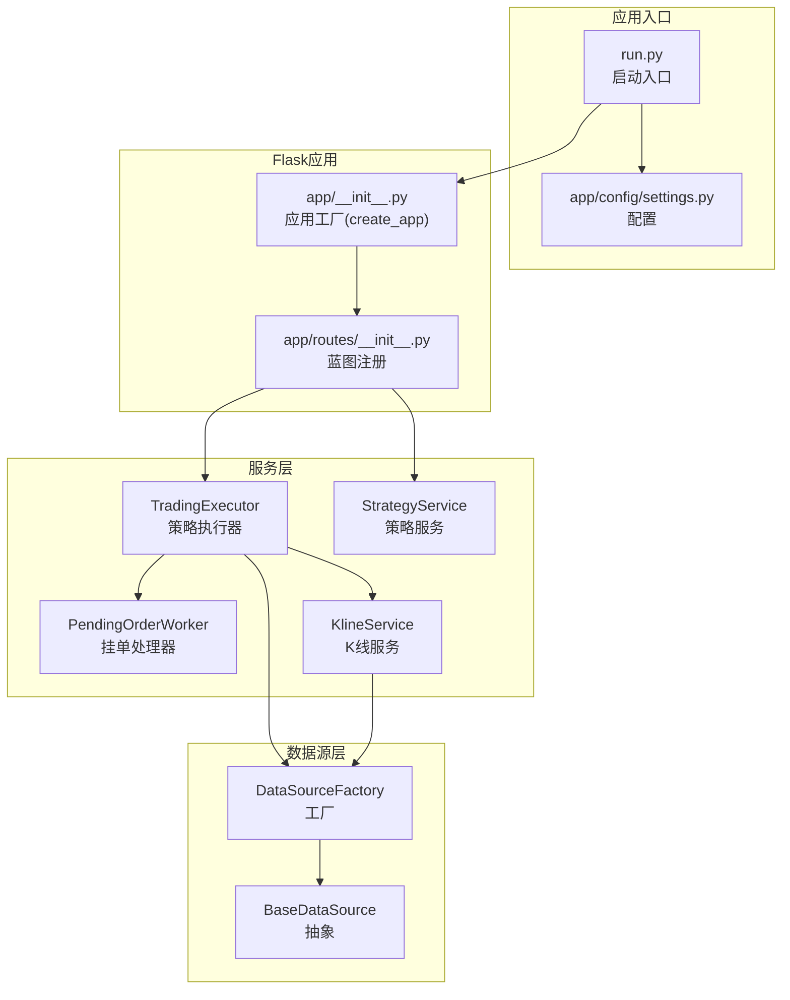
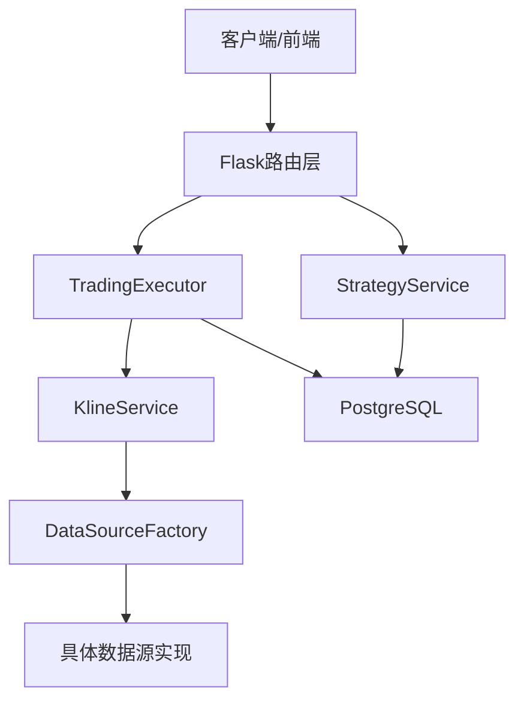
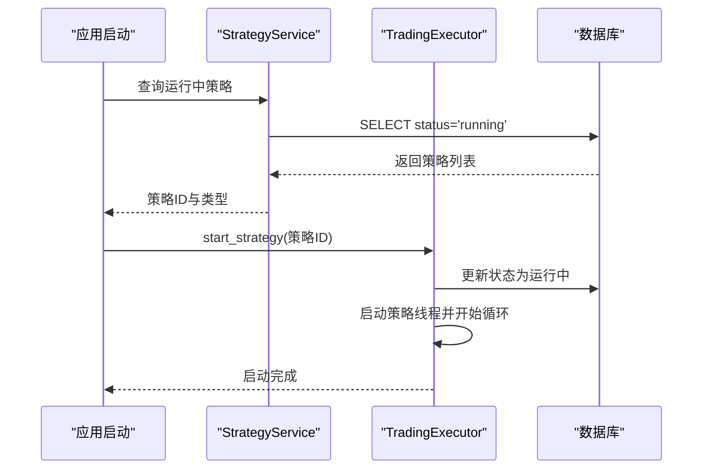
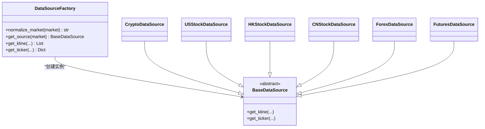
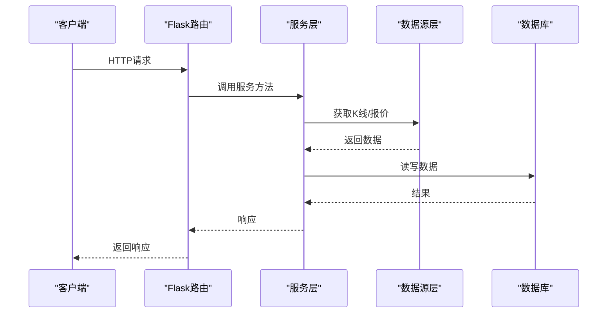
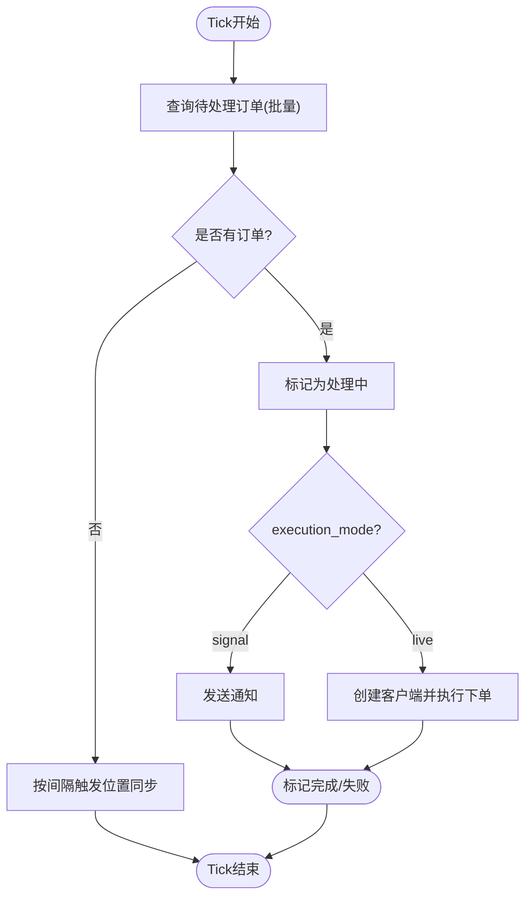
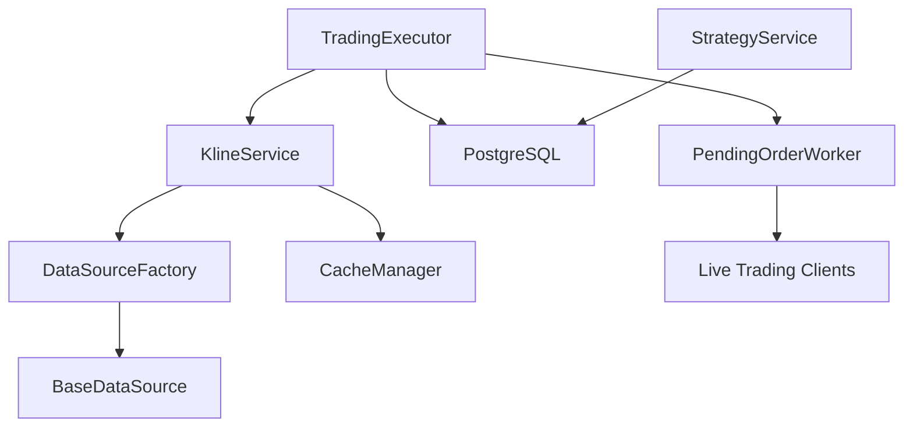

# 组件交互关系

<cite>
**本文档引用的文件**
- [app/services/trading_executor.py](file://backend_api_python/app/services/trading_executor.py)
- [app/services/pending_order_worker.py](file://backend_api_python/app/services/pending_order_worker.py)
- [app/data_sources/factory.py](file://backend_api_python/app/data_sources/factory.py)
- [app/data_sources/base.py](file://backend_api_python/app/data_sources/base.py)
- [app/services/kline.py](file://backend_api_python/app/services/kline.py)
- [app/services/strategy.py](file://backend_api_python/app/services/strategy.py)
- [app/utils/db.py](file://backend_api_python/app/utils/db.py)
- [app/routes/__init__.py](file://backend_api_python/app/routes/__init__.py)
- [app/__init__.py](file://backend_api_python/app/__init__.py)
- [run.py](file://backend_api_python/run.py)
- [app/config/settings.py](file://backend_api_python/app/config/settings.py)
</cite>

## 目录
1. [引言](#引言)
2. [项目结构](#项目结构)
3. [核心组件](#核心组件)
4. [架构总览](#架构总览)
5. [详细组件分析](#详细组件分析)
6. [依赖分析](#依赖分析)
7. [性能考虑](#性能考虑)
8. [故障排查指南](#故障排查指南)
9. [结论](#结论)
10. [附录](#附录)

## 引言
本文件聚焦QuantDinger后端Python服务的组件交互关系，围绕三大主线展开：
- TradingExecutor与StrategyService的策略执行协调：前者负责策略线程调度与信号生成，后者负责策略元数据与运行态查询。
- DataSourceFactory与各类数据源的解耦设计：通过工厂模式屏蔽不同市场（加密、美股、港股、期货、外汇）的数据源差异，统一K线与实时报价接口。
- API路由与服务层的请求处理流程：Flask蓝图注册、请求进入服务层、数据访问与外部执行器协同。

同时，文档阐述组件间的依赖注入、事件传播与状态同步机制，解释单例模式的应用（TradingExecutor、PendingOrderWorker）、全局状态管理、组件生命周期管理、资源共享策略与并发控制机制，并提供序列图与时序图以直观展示关键业务流程。

## 项目结构
后端采用Flask应用工厂模式，核心目录组织如下：
- app/：应用主体
  - routes/：API蓝图注册与路由分发
  - services/：业务服务层（策略、交易执行、数据访问、指标、回测等）
  - data_sources/：数据源抽象与工厂，面向多市场统一接口
  - utils/：通用工具（数据库、缓存、日志、HTTP等）
  - config/：配置加载与运行参数
  - __init__.py：应用工厂、单例管理、启动钩子
- run.py：应用入口与启动参数处理

图表来源
- [run.py:104-134](file://backend_api_python/run.py#L104-L134)
- [app/__init__.py:212-269](file://backend_api_python/app/__init__.py#L212-L269)
- [app/routes/__init__.py:7-53](file://backend_api_python/app/routes/__init__.py#L7-L53)
- [app/services/trading_executor.py:37-100](file://backend_api_python/app/services/trading_executor.py#L37-L100)
- [app/services/pending_order_worker.py:52-120](file://backend_api_python/app/services/pending_order_worker.py#L52-L120)
- [app/services/kline.py:14-70](file://backend_api_python/app/services/kline.py#L14-L70)
- [app/data_sources/factory.py:27-103](file://backend_api_python/app/data_sources/factory.py#L27-L103)

章节来源
- [run.py:104-134](file://backend_api_python/run.py#L104-L134)
- [app/__init__.py:212-269](file://backend_api_python/app/__init__.py#L212-L269)
- [app/routes/__init__.py:7-53](file://backend_api_python/app/routes/__init__.py#L7-L53)

## 核心组件
- TradingExecutor（策略执行器）
  - 负责策略线程管理、信号生成、去重、资金与仓位上下文构建、与数据库交互等。
  - 关键特性：线程上限控制、信号去重缓存、价格缓存、脚本运行时状态持久化。
- PendingOrderWorker（挂单处理器）
  - 负责轮询待处理订单、派发通知或实盘执行、位置同步校验。
  - 关键特性：批量处理、失败重试、位置对账、延迟启动与优雅停止。
- DataSourceFactory（数据源工厂）
  - 提供统一的市场枚举归一化、按市场类型创建具体数据源实例。
  - 关键特性：别名映射、懒加载、统一K线与实时报价接口。
- KlineService（K线服务）
  - 对DataSourceFactory进行封装，提供缓存与降级策略，统一对外接口。
- StrategyService（策略服务）
  - 提供策略运行态查询、交换对查询、连接测试、显示参数构建等。
- 应用工厂与单例管理
  - create_app集中注册蓝图与启动钩子；get_trading_executor/get_pending_order_worker提供单例，避免重复线程与资源竞争。

章节来源
- [app/services/trading_executor.py:37-100](file://backend_api_python/app/services/trading_executor.py#L37-L100)
- [app/services/pending_order_worker.py:52-120](file://backend_api_python/app/services/pending_order_worker.py#L52-L120)
- [app/data_sources/factory.py:27-103](file://backend_api_python/app/data_sources/factory.py#L27-L103)
- [app/services/kline.py:14-70](file://backend_api_python/app/services/kline.py#L14-L70)
- [app/services/strategy.py:14-58](file://backend_api_python/app/services/strategy.py#L14-L58)
- [app/__init__.py:54-75](file://backend_api_python/app/__init__.py#L54-L75)

## 架构总览
系统采用“路由-服务-数据源”三层协作：
- API路由层：通过蓝图注册，将HTTP请求映射到服务层方法。
- 服务层：策略执行、挂单处理、K线与数据源访问、策略元数据管理。
- 数据源层：抽象统一接口，工厂按市场类型创建具体实现，支持缓存与降级。

图表来源
- [app/routes/__init__.py:7-53](file://backend_api_python/app/routes/__init__.py#L7-L53)
- [app/services/trading_executor.py:37-100](file://backend_api_python/app/services/trading_executor.py#L37-L100)
- [app/services/kline.py:14-70](file://backend_api_python/app/services/kline.py#L14-L70)
- [app/data_sources/factory.py:27-103](file://backend_api_python/app/data_sources/factory.py#L27-L103)
- [app/utils/db.py:19-31](file://backend_api_python/app/utils/db.py#L19-L31)

## 详细组件分析

### TradingExecutor 与 StrategyService 的策略执行协调
- 协作方式
  - 启动恢复：应用启动时，通过StrategyService查询运行中的策略，交由TradingExecutor逐一启动策略线程。
  - 状态同步：TradingExecutor在启动/停止策略时更新数据库状态，保证UI与后端一致。
  - 信号生成：策略线程内基于K线与脚本计算信号，生成待处理订单写入队列，由PendingOrderWorker后续派发。
- 关键点
  - 线程上限与资源监控，避免OOM与线程耗尽。
  - 信号去重：按策略+标的+信号类型+时间戳去重，避免同一K线重复下单。
  - 价格缓存：轻量内存缓存替代Redis，降低部署复杂度。
  - 脚本运行时状态持久化：支持策略脚本参数与最后闭合K线时间的持久化，保障重启后连续执行。

图表来源
- [app/__init__.py:152-210](file://backend_api_python/app/__init__.py#L152-L210)
- [app/services/strategy.py:24-58](file://backend_api_python/app/services/strategy.py#L24-L58)
- [app/services/trading_executor.py:393-484](file://backend_api_python/app/services/trading_executor.py#L393-L484)

章节来源
- [app/__init__.py:152-210](file://backend_api_python/app/__init__.py#L152-L210)
- [app/services/strategy.py:24-58](file://backend_api_python/app/services/strategy.py#L24-L58)
- [app/services/trading_executor.py:393-484](file://backend_api_python/app/services/trading_executor.py#L393-L484)

### DataSourceFactory 与数据源解耦设计
- 设计要点
  - 市场枚举归一化：支持别名映射，确保调用方传入的market字符串能稳定映射到具体实现。
  - 工厂创建：按市场类型动态导入并实例化具体数据源，避免硬编码分支。
  - 统一接口：提供get_kline与get_ticker便捷方法，内部调用具体数据源实现。
- 与KlineService协作
  - KlineService在获取K线前先查缓存，未命中则委托DataSourceFactory，再由具体数据源抓取并写入缓存。

图表来源
- [app/data_sources/factory.py:27-103](file://backend_api_python/app/data_sources/factory.py#L27-L103)
- [app/data_sources/base.py:27-65](file://backend_api_python/app/data_sources/base.py#L27-L65)

章节来源
- [app/data_sources/factory.py:27-103](file://backend_api_python/app/data_sources/factory.py#L27-L103)
- [app/data_sources/base.py:27-65](file://backend_api_python/app/data_sources/base.py#L27-L65)
- [app/services/kline.py:14-70](file://backend_api_python/app/services/kline.py#L14-L70)

### API路由与服务层请求处理流程
- 路由注册
  - 所有蓝图在应用工厂中集中注册，形成清晰的URL前缀与模块划分。
- 请求处理
  - 路由函数调用相应服务层方法，服务层通过工具模块（如数据库、缓存、日志）完成业务逻辑。
- 启动钩子
  - 应用启动时自动开启挂单处理器、组合投资监控、USDT支付工作器、Polymarket工作器等后台任务。

图表来源
- [app/routes/__init__.py:7-53](file://backend_api_python/app/routes/__init__.py#L7-L53)
- [app/services/kline.py:14-70](file://backend_api_python/app/services/kline.py#L14-L70)
- [app/utils/db.py:19-31](file://backend_api_python/app/utils/db.py#L19-L31)

章节来源
- [app/routes/__init__.py:7-53](file://backend_api_python/app/routes/__init__.py#L7-L53)
- [app/__init__.py:244-269](file://backend_api_python/app/__init__.py#L244-L269)

### PendingOrderWorker 的订单派发与位置同步
- 轮询与批处理
  - 定期查询待处理订单，批量处理，避免长事务与锁竞争。
- 模式区分
  - signal模式：仅发送通知，不执行实盘。
  - live模式：通过具体交易所客户端执行下单。
- 位置同步
  - 定期与交易所快照对账，清理“幽灵持仓”，修复尺寸与开仓价偏差。

图表来源
- [app/services/pending_order_worker.py:91-122](file://backend_api_python/app/services/pending_order_worker.py#L91-L122)
- [app/services/pending_order_worker.py:712-799](file://backend_api_python/app/services/pending_order_worker.py#L712-L799)

章节来源
- [app/services/pending_order_worker.py:91-122](file://backend_api_python/app/services/pending_order_worker.py#L91-L122)
- [app/services/pending_order_worker.py:712-799](file://backend_api_python/app/services/pending_order_worker.py#L712-L799)

### 单例模式与全局状态管理
- 单例管理
  - TradingExecutor与PendingOrderWorker通过全局变量与工厂函数实现单例，避免重复线程与资源竞争。
- 全局状态
  - 线程运行列表、信号去重缓存、价格缓存、交易所手续费缓存等均作为进程内共享状态。
- 生命周期
  - 应用启动时初始化并注册到应用上下文，随进程存活；可通过API或配置控制启停。

章节来源
- [app/__init__.py:54-75](file://backend_api_python/app/__init__.py#L54-L75)
- [app/services/trading_executor.py:37-100](file://backend_api_python/app/services/trading_executor.py#L37-L100)
- [app/services/pending_order_worker.py:52-120](file://backend_api_python/app/services/pending_order_worker.py#L52-L120)

### 并发控制与资源共享
- 线程模型
  - 策略执行采用每个策略一个守护线程，线程上限受环境变量控制，避免资源耗尽。
- 锁与原子操作
  - 关键共享结构（运行列表、信号去重、价格缓存）均配有互斥锁，保证并发安全。
- 数据库连接
  - 采用连接池封装，按需获取连接，减少连接泄漏风险。

章节来源
- [app/services/trading_executor.py:403-444](file://backend_api_python/app/services/trading_executor.py#L403-L444)
- [app/utils/db.py:19-31](file://backend_api_python/app/utils/db.py#L19-L31)

## 依赖分析
- 组件耦合
  - TradingExecutor依赖KlineService与DataSourceFactory，间接依赖数据库与缓存。
  - KlineService依赖DataSourceFactory与缓存模块。
  - StrategyService依赖数据库与外部执行器工厂。
  - PendingOrderWorker依赖通知器、执行器工厂与数据库。
- 外部依赖
  - PostgreSQL：统一数据存储。
  - 各类交易所REST/客户端：实盘执行与账户查询。
- 循环依赖
  - 当前设计未发现循环依赖，工厂与服务层通过接口解耦。

图表来源
- [app/services/trading_executor.py:37-100](file://backend_api_python/app/services/trading_executor.py#L37-L100)
- [app/services/kline.py:14-70](file://backend_api_python/app/services/kline.py#L14-L70)
- [app/data_sources/factory.py:27-103](file://backend_api_python/app/data_sources/factory.py#L27-L103)
- [app/services/pending_order_worker.py:52-120](file://backend_api_python/app/services/pending_order_worker.py#L52-L120)
- [app/services/strategy.py:14-58](file://backend_api_python/app/services/strategy.py#L14-L58)

章节来源
- [app/services/trading_executor.py:37-100](file://backend_api_python/app/services/trading_executor.py#L37-L100)
- [app/services/kline.py:14-70](file://backend_api_python/app/services/kline.py#L14-L70)
- [app/data_sources/factory.py:27-103](file://backend_api_python/app/data_sources/factory.py#L27-L103)
- [app/services/pending_order_worker.py:52-120](file://backend_api_python/app/services/pending_order_worker.py#L52-L120)
- [app/services/strategy.py:14-58](file://backend_api_python/app/services/strategy.py#L14-L58)

## 性能考虑
- 缓存策略
  - K线与实时价格缓存：减少对外部数据源与数据库压力，提升响应速度。
- 批量处理
  - PendingOrderWorker批量查询与处理订单，降低数据库与网络调用频率。
- 线程与资源限制
  - 策略线程上限与资源状态日志，避免过度并发导致系统不稳定。
- 降级策略
  - K线服务在ticker不可用时降级为K线或日线，保证系统可用性。

## 故障排查指南
- 策略无法启动
  - 检查线程上限与资源状态日志；确认数据库状态更新成功。
- 订单未派发
  - 检查PendingOrderWorker是否启动、批量大小与轮询间隔；查看订单状态与失败原因。
- 数据延迟告警
  - 查看K线服务的日志延迟阈值与告警输出，确认数据源可用性。
- 位置不同步
  - 检查位置同步开关与间隔；确认交易所客户端与账户配置正确。

章节来源
- [app/services/trading_executor.py:147-174](file://backend_api_python/app/services/trading_executor.py#L147-L174)
- [app/services/kline.py:141-179](file://backend_api_python/app/services/kline.py#L141-L179)
- [app/services/pending_order_worker.py:123-137](file://backend_api_python/app/services/pending_order_worker.py#L123-L137)

## 结论
QuantDinger通过清晰的分层与工厂模式实现了策略执行、数据访问与API路由的解耦；通过单例与并发控制保障了稳定性；通过缓存与降级策略提升了性能与可用性。TradingExecutor与StrategyService的协作、DataSourceFactory的抽象以及PendingOrderWorker的派发机制共同构成了系统的执行闭环。

## 附录
- 启动流程概览
  - run.py加载环境变量与代理配置，创建Flask应用，注册蓝图并启动各类后台任务，最后恢复运行中的策略。

章节来源
- [run.py:17-91](file://backend_api_python/run.py#L17-L91)
- [app/__init__.py:244-269](file://backend_api_python/app/__init__.py#L244-L269)