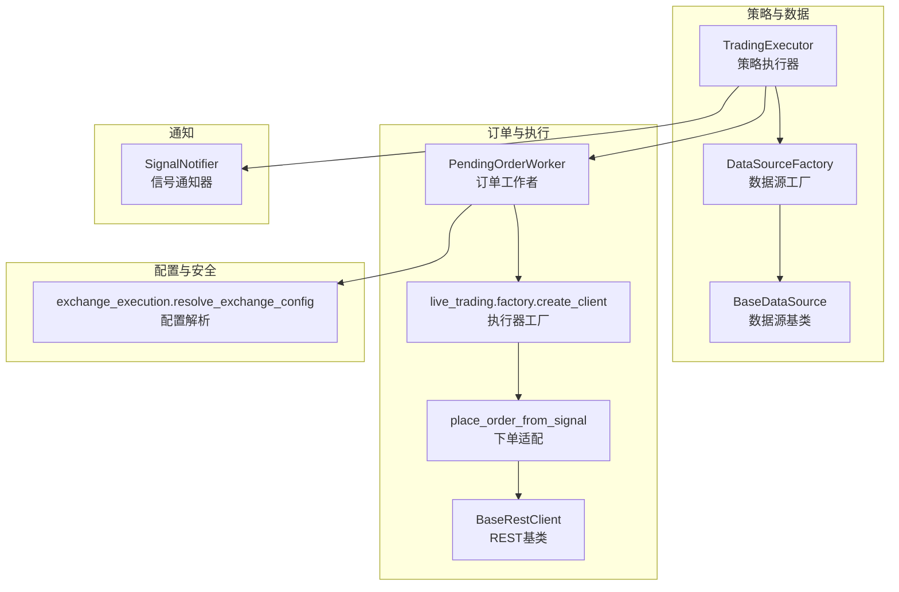
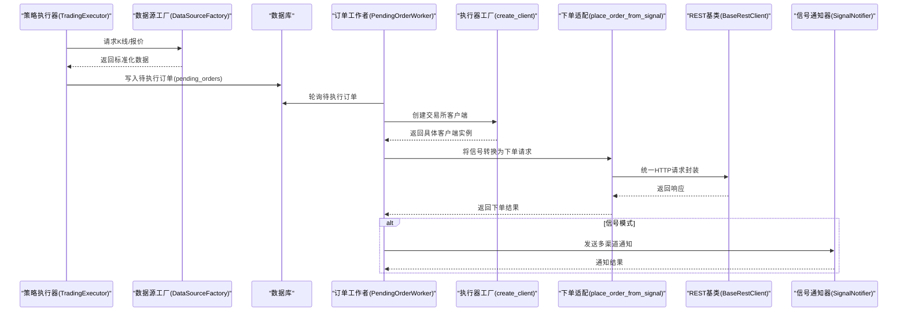
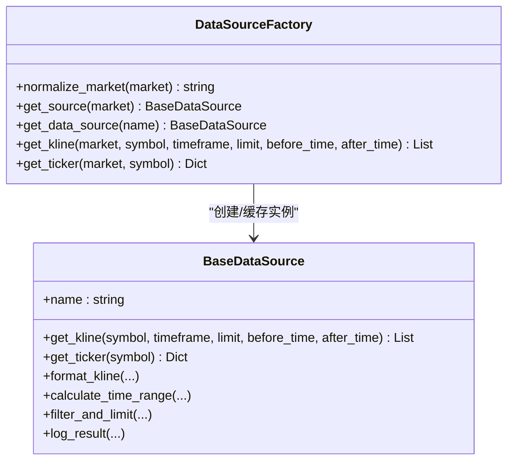
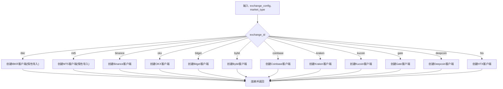
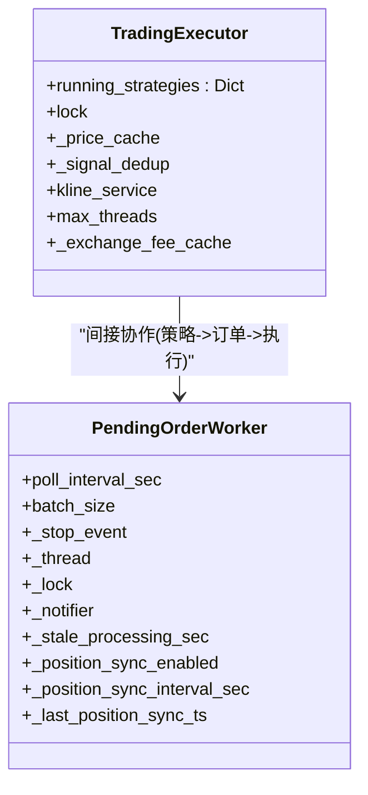
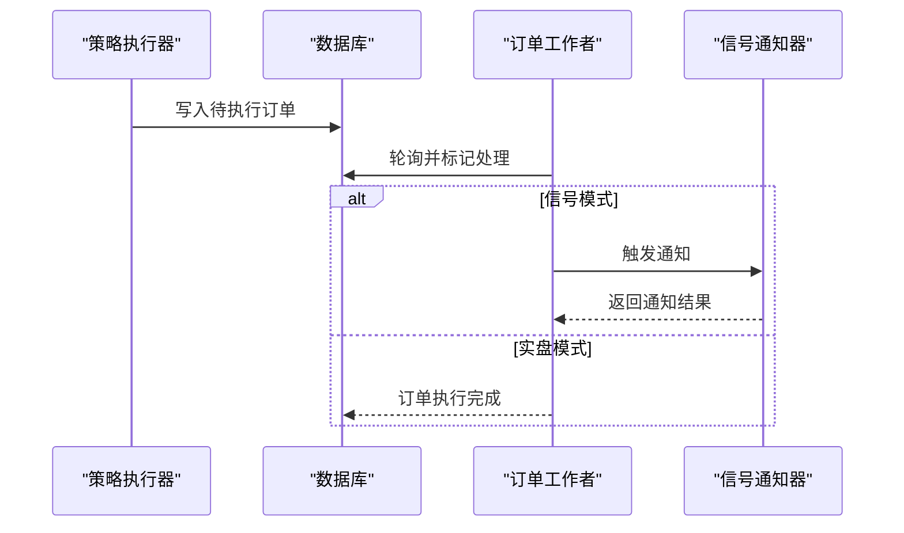
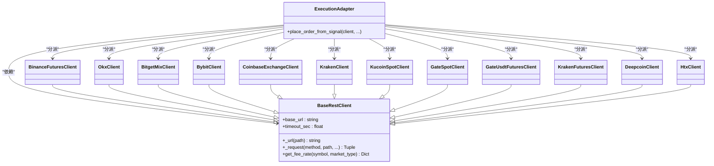
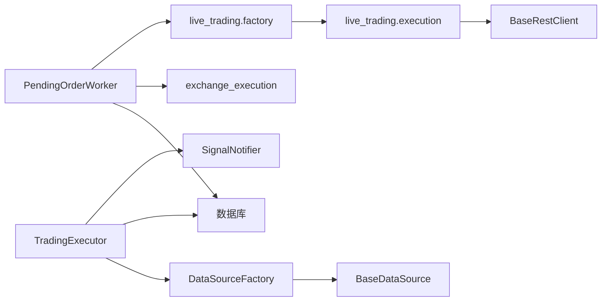

# 设计模式应用

<cite>
**本文引用的文件**
- [factory.py](file://backend_api_python/app/data_sources/factory.py)
- [base.py](file://backend_api_python/app/data_sources/base.py)
- [factory.py](file://backend_api_python/app/services/live_trading/factory.py)
- [execution.py](file://backend_api_python/app/services/live_trading/execution.py)
- [base.py](file://backend_api_python/app/services/live_trading/base.py)
- [pending_order_worker.py](file://backend_api_python/app/services/pending_order_worker.py)
- [signal_notifier.py](file://backend_api_python/app/services/signal_notifier.py)
- [exchange_execution.py](file://backend_api_python/app/services/exchange_execution.py)
- [trading_executor.py](file://backend_api_python/app/services/trading_executor.py)
</cite>

## 目录
1. [引言](#引言)
2. [项目结构](#项目结构)
3. [核心组件](#核心组件)
4. [架构总览](#架构总览)
5. [详细组件分析](#详细组件分析)
6. [依赖分析](#依赖分析)
7. [性能考量](#性能考量)
8. [故障排查指南](#故障排查指南)
9. [结论](#结论)
10. [附录](#附录)

## 引言
本文件面向QuantDinger后端服务，系统梳理并深入解析项目中实际应用的设计模式，重点覆盖以下方面：
- 工厂模式：数据源工厂（DataSourceFactory）与实盘执行器工厂（live_trading/factory.py）。
- 单例模式：通过模块级惰性导入与类级缓存实现“单实例”语义（交易执行器、订单工作者）。
- 观察者模式：事件驱动的策略执行与通知通道（PendingOrderWorker + SignalNotifier）。
- 适配器模式：交易所API适配（BaseRestClient + 各交易所客户端）。

我们将结合具体代码路径说明实现细节、解决的问题、带来的收益，并给出最佳实践与常见陷阱，最后分析这些模式之间的协同作用与整体架构影响。

## 项目结构
后端Python服务位于backend_api_python目录，围绕“策略执行—订单派发—实盘执行—通知”的主链路组织模块：
- 数据层：数据源工厂与抽象基类，统一不同市场的K线与报价接口。
- 执行层：策略执行器负责生成信号并落库；订单工作者轮询待执行订单并派发；实盘执行器将信号转换为交易所下单请求。
- 通知层：信号通知器提供多通道通知能力。
- 配置与安全：交换机配置解析与凭证解密，保障实盘执行的安全与可配置性。

图表来源
- [trading_executor.py](file://backend_api_python/app/services/trading_executor.py)
- [factory.py](file://backend_api_python/app/data_sources/factory.py)
- [base.py](file://backend_api_python/app/data_sources/base.py)
- [pending_order_worker.py](file://backend_api_python/app/services/pending_order_worker.py)
- [factory.py](file://backend_api_python/app/services/live_trading/factory.py)
- [execution.py](file://backend_api_python/app/services/live_trading/execution.py)
- [base.py](file://backend_api_python/app/services/live_trading/base.py)
- [signal_notifier.py](file://backend_api_python/app/services/signal_notifier.py)
- [exchange_execution.py](file://backend_api_python/app/services/exchange_execution.py)

章节来源
- [trading_executor.py](file://backend_api_python/app/services/trading_executor.py)
- [factory.py](file://backend_api_python/app/data_sources/factory.py)
- [base.py](file://backend_api_python/app/data_sources/base.py)
- [pending_order_worker.py](file://backend_api_python/app/services/pending_order_worker.py)
- [factory.py](file://backend_api_python/app/services/live_trading/factory.py)
- [execution.py](file://backend_api_python/app/services/live_trading/execution.py)
- [base.py](file://backend_api_python/app/services/live_trading/base.py)
- [signal_notifier.py](file://backend_api_python/app/services/signal_notifier.py)
- [exchange_execution.py](file://backend_api_python/app/services/exchange_execution.py)

## 核心组件
- 数据源工厂与基类：统一不同市场的K线/报价接口，屏蔽底层差异。
- 实盘执行器工厂：根据配置动态创建不同交易所/市场的客户端。
- 交易执行器：策略线程生成信号，写入待执行队列。
- 订单工作者：轮询待执行订单，派发到对应交易所客户端并进行位置同步。
- 信号通知器：将策略信号投递到浏览器、Webhook、Discord、Telegram、Email、短信等多通道。
- REST基类：为各交易所客户端提供统一的HTTP请求封装与证书校验策略。

章节来源
- [factory.py](file://backend_api_python/app/data_sources/factory.py)
- [base.py](file://backend_api_python/app/data_sources/base.py)
- [factory.py](file://backend_api_python/app/services/live_trading/factory.py)
- [execution.py](file://backend_api_python/app/services/live_trading/execution.py)
- [base.py](file://backend_api_python/app/services/live_trading/base.py)
- [pending_order_worker.py](file://backend_api_python/app/services/pending_order_worker.py)
- [signal_notifier.py](file://backend_api_python/app/services/signal_notifier.py)
- [exchange_execution.py](file://backend_api_python/app/services/exchange_execution.py)
- [trading_executor.py](file://backend_api_python/app/services/trading_executor.py)

## 架构总览
下图展示了从策略到实盘执行与通知的整体流程，以及各设计模式在其中的落地位置。

图表来源
- [trading_executor.py](file://backend_api_python/app/services/trading_executor.py)
- [factory.py](file://backend_api_python/app/data_sources/factory.py)
- [pending_order_worker.py](file://backend_api_python/app/services/pending_order_worker.py)
- [factory.py](file://backend_api_python/app/services/live_trading/factory.py)
- [execution.py](file://backend_api_python/app/services/live_trading/execution.py)
- [base.py](file://backend_api_python/app/services/live_trading/base.py)
- [signal_notifier.py](file://backend_api_python/app/services/signal_notifier.py)

## 详细组件分析

### 工厂模式：数据源工厂（DataSourceFactory）
- 解决的问题
  - 不同市场（加密、美股、港股、期货、外汇）的数据接口差异巨大，需要统一入口与标准化输出。
  - 避免硬编码分支与重复导入，提升可扩展性与可维护性。
- 实现要点
  - 类级缓存：通过类变量保存已创建的数据源实例，避免重复初始化。
  - 名称归一：提供别名映射与规范化逻辑，保证输入多样但输出一致。
  - 便捷方法：提供K线与报价的快捷入口，内部复用统一数据源实例。
- 代码路径
  - [DataSourceFactory 类与方法](file://backend_api_python/app/data_sources/factory.py)
  - [BaseDataSource 抽象接口](file://backend_api_python/app/data_sources/base.py)
- 好处
  - 降低耦合：调用方只依赖统一工厂，不关心具体实现。
  - 提升性能：实例缓存减少重复创建成本。
  - 易于扩展：新增市场只需在工厂中增加分支与映射。

图表来源
- [factory.py](file://backend_api_python/app/data_sources/factory.py)
- [base.py](file://backend_api_python/app/data_sources/base.py)

章节来源
- [factory.py](file://backend_api_python/app/data_sources/factory.py)
- [base.py](file://backend_api_python/app/data_sources/base.py)

### 工厂模式：实盘执行器工厂（live_trading.factory）
- 解决的问题
  - 支持多家交易所与多种市场类型（现货/永续），避免在业务层分散创建逻辑。
  - 动态选择客户端并处理演示/真实交易切换、URL与参数差异。
- 实现要点
  - 条件分支：根据exchange_id与market_type选择具体客户端。
  - 惰性导入：仅在需要时导入特定交易所模块，避免不必要的依赖。
  - 参数归一：统一从配置字典中提取必要参数，屏蔽外部差异。
- 代码路径
  - [create_client 主入口](file://backend_api_python/app/services/live_trading/factory.py)
  - [IBKR/MT5 特殊分支与连接逻辑](file://backend_api_python/app/services/live_trading/factory.py)
- 好处
  - 降低耦合：调用方无需了解各交易所差异。
  - 易于扩展：新增交易所只需在工厂中增加分支与构造参数。
  - 运行时灵活性：支持运行时切换演示/真实交易与市场类型。

图表来源
- [factory.py](file://backend_api_python/app/services/live_trading/factory.py)

章节来源
- [factory.py](file://backend_api_python/app/services/live_trading/factory.py)

### 单例模式：交易执行器与订单工作者
- 语义说明
  - 项目通过“模块级惰性导入”与“类级缓存”实现“单实例”语义，而非严格意义上的全局单例。
  - 例如：PendingOrderWorker在类内持有共享锁与通知器实例，作为进程内的唯一工作线程。
- 实现要点
  - PendingOrderWorker：线程安全启动/停止、批量处理、位置同步、异常恢复。
  - 交易执行器：线程池式管理策略线程，限制最大并发，避免资源耗尽。
- 代码路径
  - [PendingOrderWorker 类与线程循环](file://backend_api_python/app/services/pending_order_worker.py)
  - [TradingExecutor 类与线程/缓存管理](file://backend_api_python/app/services/trading_executor.py)
- 好处
  - 控制资源：避免过多线程/进程导致系统不稳定。
  - 简化状态：集中管理共享状态与锁，降低竞态风险。
- 注意事项
  - 单实例并非分布式单例，需避免跨进程共享状态。
  - 需要显式停止与超时控制，防止优雅退出问题。

图表来源
- [trading_executor.py](file://backend_api_python/app/services/trading_executor.py)
- [pending_order_worker.py](file://backend_api_python/app/services/pending_order_worker.py)

章节来源
- [pending_order_worker.py](file://backend_api_python/app/services/pending_order_worker.py)
- [trading_executor.py](file://backend_api_python/app/services/trading_executor.py)

### 观察者模式：事件驱动的策略执行与通知
- 解释
  - 策略执行器产生信号事件，订单工作者作为“观察者”订阅待执行队列，触发实盘执行或通知。
  - SignalNotifier作为“发布者”，将事件广播到多个通知通道。
- 实现要点
  - 订单工作者轮询数据库中的待执行订单，标记处理状态并执行。
  - 信号通知器根据策略配置选择通道，渲染消息并发送。
- 代码路径
  - [PendingOrderWorker._dispatch_one/_tick](file://backend_api_python/app/services/pending_order_worker.py)
  - [SignalNotifier.notify_signal/_render_messages](file://backend_api_python/app/services/signal_notifier.py)
- 好处
  - 解耦：策略与执行/通知分离，职责清晰。
  - 可扩展：新增通知通道只需在通知器中扩展。
  - 可观测：统一的日志与追踪字段，便于排障。

图表来源
- [pending_order_worker.py](file://backend_api_python/app/services/pending_order_worker.py)
- [signal_notifier.py](file://backend_api_python/app/services/signal_notifier.py)

章节来源
- [pending_order_worker.py](file://backend_api_python/app/services/pending_order_worker.py)
- [signal_notifier.py](file://backend_api_python/app/services/signal_notifier.py)

### 适配器模式：交易所API适配（BaseRestClient + 各交易所客户端）
- 解决的问题
  - 各交易所REST接口命名、参数、签名与认证方式差异极大，需要统一适配层。
- 实现要点
  - BaseRestClient：统一URL拼接、请求封装、超时与证书校验策略。
  - 各交易所客户端：在适配层之上实现各自API的参数映射与响应解析。
  - 下单适配：place_order_from_signal根据客户端类型分派到具体实现。
- 代码路径
  - [BaseRestClient](file://backend_api_python/app/services/live_trading/base.py)
  - [下单适配入口与分支](file://backend_api_python/app/services/live_trading/execution.py)
  - [执行器工厂创建客户端](file://backend_api_python/app/services/live_trading/factory.py)
- 好处
  - 屏蔽差异：上层只关心下单行为，不感知底层差异。
  - 易于扩展：新增交易所只需实现适配层与下单适配分支。
  - 安全可控：统一的证书与超时策略，降低接入风险。

图表来源
- [base.py](file://backend_api_python/app/services/live_trading/base.py)
- [execution.py](file://backend_api_python/app/services/live_trading/execution.py)
- [factory.py](file://backend_api_python/app/services/live_trading/factory.py)

章节来源
- [base.py](file://backend_api_python/app/services/live_trading/base.py)
- [execution.py](file://backend_api_python/app/services/live_trading/execution.py)
- [factory.py](file://backend_api_python/app/services/live_trading/factory.py)

### 设计模式协同与整体架构影响
- 工厂模式 + 适配器模式：数据源工厂与执行器工厂分别屏蔽了“数据来源差异”和“交易所差异”，使上层策略与执行逻辑保持稳定。
- 单例模式：PendingOrderWorker与TradingExecutor以“单实例语义”集中管理资源与状态，避免多实例竞争与资源浪费。
- 观察者模式：订单工作者与信号通知器形成事件驱动的解耦闭环，便于扩展新的通知通道与执行模式。
- 整体收益
  - 可扩展性：新增市场/交易所/通知通道只需在对应工厂或适配层扩展。
  - 可维护性：职责清晰、接口统一，降低变更成本。
  - 可测试性：通过工厂注入与适配层隔离，便于单元测试与集成测试。

章节来源
- [factory.py](file://backend_api_python/app/data_sources/factory.py)
- [base.py](file://backend_api_python/app/data_sources/base.py)
- [factory.py](file://backend_api_python/app/services/live_trading/factory.py)
- [execution.py](file://backend_api_python/app/services/live_trading/execution.py)
- [base.py](file://backend_api_python/app/services/live_trading/base.py)
- [pending_order_worker.py](file://backend_api_python/app/services/pending_order_worker.py)
- [signal_notifier.py](file://backend_api_python/app/services/signal_notifier.py)
- [trading_executor.py](file://backend_api_python/app/services/trading_executor.py)

## 依赖分析
- 组件耦合
  - TradingExecutor依赖DataSourceFactory与数据库；与SignalNotifier弱耦合（仅在信号模式下通知）。
  - PendingOrderWorker依赖数据库、exchange_execution配置解析、live_trading工厂与执行器。
  - live_trading执行器依赖BaseRestClient与各交易所客户端。
- 外部依赖
  - HTTP请求：requests；证书校验策略统一由BaseRestClient处理。
  - 数据库：PostgreSQL，通过上下文管理连接。
- 循环依赖
  - 通过惰性导入与函数级导入避免循环依赖（如IBKR/MT5）。

图表来源
- [trading_executor.py](file://backend_api_python/app/services/trading_executor.py)
- [factory.py](file://backend_api_python/app/data_sources/factory.py)
- [base.py](file://backend_api_python/app/data_sources/base.py)
- [pending_order_worker.py](file://backend_api_python/app/services/pending_order_worker.py)
- [exchange_execution.py](file://backend_api_python/app/services/exchange_execution.py)
- [factory.py](file://backend_api_python/app/services/live_trading/factory.py)
- [execution.py](file://backend_api_python/app/services/live_trading/execution.py)
- [base.py](file://backend_api_python/app/services/live_trading/base.py)

章节来源
- [trading_executor.py](file://backend_api_python/app/services/trading_executor.py)
- [factory.py](file://backend_api_python/app/data_sources/factory.py)
- [base.py](file://backend_api_python/app/data_sources/base.py)
- [pending_order_worker.py](file://backend_api_python/app/services/pending_order_worker.py)
- [exchange_execution.py](file://backend_api_python/app/services/exchange_execution.py)
- [factory.py](file://backend_api_python/app/services/live_trading/factory.py)
- [execution.py](file://backend_api_python/app/services/live_trading/execution.py)
- [base.py](file://backend_api_python/app/services/live_trading/base.py)

## 性能考量
- 工厂缓存
  - 数据源工厂与执行器工厂均采用类级缓存，避免重复创建实例，降低CPU与内存开销。
- 线程与批处理
  - PendingOrderWorker支持批量处理与位置同步间隔控制，降低数据库压力与网络抖动影响。
  - TradingExecutor限制最大线程数，防止资源耗尽。
- I/O与网络
  - BaseRestClient统一证书校验与超时策略，减少TLS握手与证书校验失败导致的重试成本。
- 数据过滤与缓存
  - DataSourceFactory与TradingExecutor内置价格缓存与去重机制，减少重复计算与网络请求。

## 故障排查指南
- SSL/TLS证书问题
  - 症状：HTTPS证书校验失败或代理环境下连接异常。
  - 排查：检查LIVE_TRADING_SSL_VERIFY/LIVE_TRADING_CA_BUNDLE等环境变量，确认系统CA包路径或自定义PEM路径。
  - 参考路径：[BaseRestClient 证书解析逻辑](file://backend_api_python/app/services/live_trading/base.py)
- 交易所连接失败
  - 症状：IBKR/MT5连接失败或MT5仅支持外汇。
  - 排查：确认配置项（主机、端口、账号、服务器、终端路径）是否正确；检查平台兼容性（MT5仅Windows）。
  - 参考路径：[IBKR/MT5创建与连接逻辑](file://backend_api_python/app/services/live_trading/factory.py)
- 订单执行异常
  - 症状：下单失败或不支持的客户端类型。
  - 排查：确认信号类型与市场类型匹配（如现货不支持做空）；检查客户端类型与下单参数映射。
  - 参考路径：[下单适配与错误处理](file://backend_api_python/app/services/live_trading/execution.py)
- 通知失败
  - 症状：Webhook/Discord/Email/Phone等通道发送失败。
  - 排查：检查通道URL、令牌、签名密钥与超时设置；查看通知器返回的错误摘要。
  - 参考路径：[SignalNotifier 通知通道实现](file://backend_api_python/app/services/signal_notifier.py)
- 配置解析错误
  - 症状：凭证解密失败或配置合并异常。
  - 排查：确认凭证ID与用户ID正确；检查加密blob与密钥一致性。
  - 参考路径：[exchange_execution 配置解析](file://backend_api_python/app/services/exchange_execution.py)

章节来源
- [base.py](file://backend_api_python/app/services/live_trading/base.py)
- [factory.py](file://backend_api_python/app/services/live_trading/factory.py)
- [execution.py](file://backend_api_python/app/services/live_trading/execution.py)
- [signal_notifier.py](file://backend_api_python/app/services/signal_notifier.py)
- [exchange_execution.py](file://backend_api_python/app/services/exchange_execution.py)

## 结论
QuantDinger通过工厂模式、单例模式、观察者模式与适配器模式，构建了高内聚、低耦合且易于扩展的交易执行与通知体系。工厂与适配器屏蔽差异，单例与观察者保障稳定性与可观测性，整体架构在可扩展性、可维护性与可测试性方面表现良好。建议在新增功能时遵循现有模式边界，优先通过工厂/适配层扩展，避免在业务层引入重复逻辑。

## 附录
- 最佳实践
  - 新增市场/交易所时，优先扩展工厂与适配层，保持上层接口不变。
  - 使用类级缓存与惰性导入控制资源占用，避免全局单例滥用。
  - 在观察者模式中，确保异常可捕获与可观测，便于快速定位问题。
- 常见陷阱
  - 忘记处理演示/真实交易切换参数，导致误下单。
  - 在通知器中泄露敏感URL或令牌，应使用掩码与最小权限原则。
  - 未考虑平台兼容性（如MT5仅Windows），导致部署失败。
- 相关代码路径
  - [工厂与适配层](file://backend_api_python/app/data_sources/factory.py)
  - [工厂与适配层](file://backend_api_python/app/services/live_trading/factory.py)
  - [下单适配](file://backend_api_python/app/services/live_trading/execution.py)
  - [通知器](file://backend_api_python/app/services/signal_notifier.py)
  - [配置解析](file://backend_api_python/app/services/exchange_execution.py)
  - [执行器与工作者](file://backend_api_python/app/services/trading_executor.py)
  - [执行器与工作者](file://backend_api_python/app/services/pending_order_worker.py)