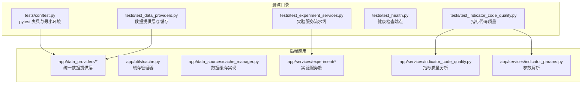
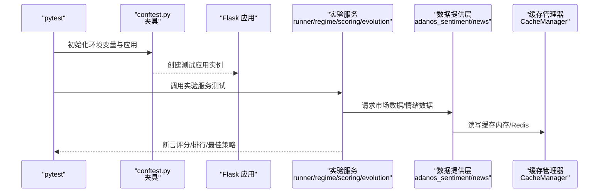
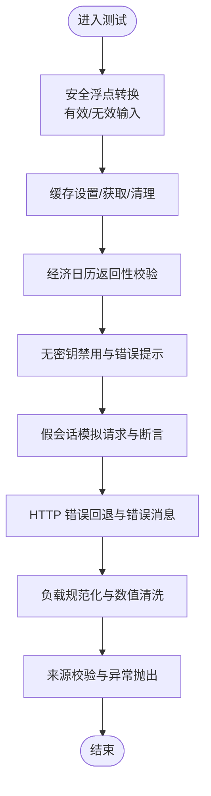
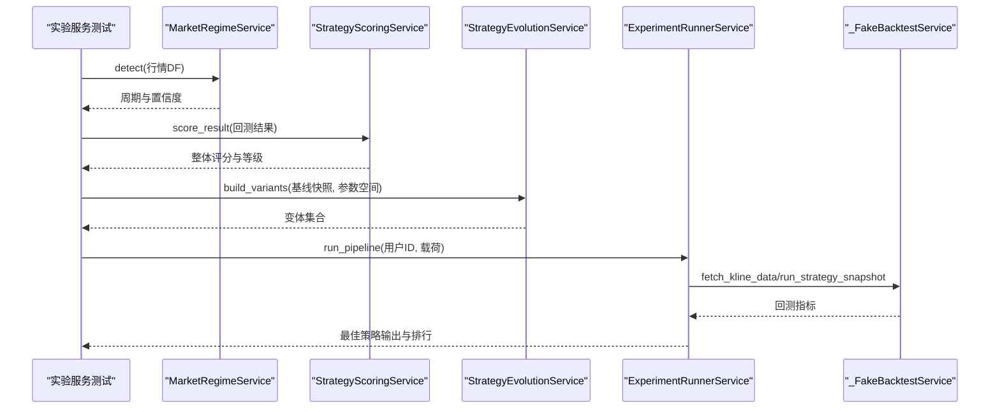
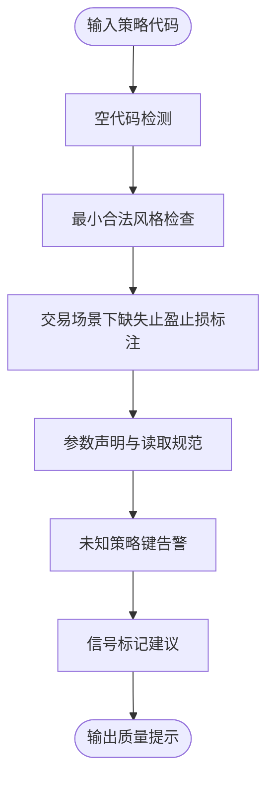
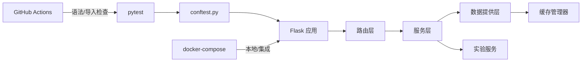

# 测试策略

<cite>
**本文引用的文件**
- [backend_api_python/tests/conftest.py](file://backend_api_python/tests/conftest.py)
- [backend_api_python/tests/test_data_providers.py](file://backend_api_python/tests/test_data_providers.py)
- [backend_api_python/tests/test_experiment_services.py](file://backend_api_python/tests/test_experiment_services.py)
- [backend_api_python/tests/test_health.py](file://backend_api_python/tests/test_health.py)
- [backend_api_python/tests/test_indicator_code_quality.py](file://backend_api_python/tests/test_indicator_code_quality.py)
- [backend_api_python/run.py](file://backend_api_python/run.py)
- [.github/workflows/basic-ci.yml](file://.github/workflows/basic-ci.yml)
- [docker-compose.yml](file://docker-compose.yml)
- [backend_api_python/app/data_providers/__init__.py](file://backend_api_python/app/data_providers/__init__.py)
- [backend_api_python/app/utils/cache.py](file://backend_api_python/app/utils/cache.py)
- [backend_api_python/app/data_sources/cache_manager.py](file://backend_api_python/app/data_sources/cache_manager.py)
- [backend_api_python/app/services/experiment/__init__.py](file://backend_api_python/app/services/experiment/__init__.py)
- [backend_api_python/app/services/experiment/regime.py](file://backend_api_python/app/services/experiment/regime.py)
- [backend_api_python/app/services/experiment/scoring.py](file://backend_api_python/app/services/experiment/scoring.py)
- [backend_api_python/app/services/experiment/evolution.py](file://backend_api_python/app/services/experiment/evolution.py)
- [backend_api_python/app/services/experiment/runner.py](file://backend_api_python/app/services/experiment/runner.py)
- [backend_api_python/app/data_providers/adanos_sentiment.py](file://backend_api_python/app/data_providers/adanos_sentiment.py)
- [backend_api_python/app/data_providers/news.py](file://backend_api_python/app/data_providers/news.py)
- [backend_api_python/app/services/indicator_code_quality.py](file://backend_api_python/app/services/indicator_code_quality.py)
- [backend_api_python/app/services/indicator_params.py](file://backend_api_python/app/services/indicator_params.py)
- [backend_api_python/requirements.txt](file://backend_api_python/requirements.txt)
</cite>

## 目录
1. [引言](#引言)
2. [项目结构](#项目结构)
3. [核心组件](#核心组件)
4. [架构总览](#架构总览)
5. [详细组件分析](#详细组件分析)
6. [依赖分析](#依赖分析)
7. [性能考虑](#性能考虑)
8. [故障排查指南](#故障排查指南)
9. [结论](#结论)
10. [附录](#附录)

## 引言
本文件系统化阐述 QuantDinger 的测试策略与实现，覆盖单元测试、集成测试与端到端测试的分层设计；详述测试数据管理、测试环境配置与测试用例设计原则；重点解析四大关键测试模块：策略执行测试、数据源测试、交易执行测试与实验服务测试；并给出测试最佳实践、代码覆盖率目标、持续集成配置、测试自动化与性能/回归测试实施建议，以及测试报告生成、缺陷跟踪与质量保证流程。

## 项目结构
后端测试位于 backend_api_python/tests 下，采用 pytest 固定夹具与最小化环境变量注入，确保可重复且隔离的测试执行。测试覆盖数据提供层、实验服务、指标质量与健康检查等关键路径。CI 使用 GitHub Actions 执行语法与导入检查，不直接运行数据库或外部服务，避免对生产环境造成影响。

图表来源
- [backend_api_python/tests/conftest.py:1-31](file://backend_api_python/tests/conftest.py#L1-L31)
- [backend_api_python/tests/test_data_providers.py:1-193](file://backend_api_python/tests/test_data_providers.py#L1-L193)
- [backend_api_python/tests/test_experiment_services.py:1-132](file://backend_api_python/tests/test_experiment_services.py#L1-L132)
- [backend_api_python/tests/test_health.py:1-10](file://backend_api_python/tests/test_health.py#L1-L10)
- [backend_api_python/tests/test_indicator_code_quality.py:1-135](file://backend_api_python/tests/test_indicator_code_quality.py#L1-L135)
- [backend_api_python/app/data_providers/__init__.py:1-46](file://backend_api_python/app/data_providers/__init__.py#L1-L46)
- [backend_api_python/app/utils/cache.py:1-80](file://backend_api_python/app/utils/cache.py#L1-L80)
- [backend_api_python/app/data_sources/cache_manager.py:44-93](file://backend_api_python/app/data_sources/cache_manager.py#L44-L93)
- [backend_api_python/app/services/experiment/__init__.py:1-16](file://backend_api_python/app/services/experiment/__init__.py#L1-L16)
- [backend_api_python/app/services/indicator_code_quality.py](file://backend_api_python/app/services/indicator_code_quality.py)
- [backend_api_python/app/services/indicator_params.py](file://backend_api_python/app/services/indicator_params.py)

章节来源
- [backend_api_python/tests/conftest.py:1-31](file://backend_api_python/tests/conftest.py#L1-L31)
- [backend_api_python/tests/test_data_providers.py:1-193](file://backend_api_python/tests/test_data_providers.py#L1-L193)
- [backend_api_python/tests/test_experiment_services.py:1-132](file://backend_api_python/tests/test_experiment_services.py#L1-L132)
- [backend_api_python/tests/test_health.py:1-10](file://backend_api_python/tests/test_health.py#L1-L10)
- [backend_api_python/tests/test_indicator_code_quality.py:1-135](file://backend_api_python/tests/test_indicator_code_quality.py#L1-L135)

## 核心组件
- 测试夹具与环境
  - 通过 conftest.py 注入最小化环境变量，确保配置类在测试中不会因缺少键而失败，并提供 Flask 测试客户端。
  - 关键夹具：会话级应用工厂与请求级测试客户端。
- 测试覆盖范围
  - 数据提供层：缓存工具、经济日历、第三方情感数据接口（含错误回退）。
  - 实验服务：市场周期检测、策略评分、参数空间变体构建、实验流水线运行。
  - 指标质量：策略注解与参数读取规范、未知策略键告警、信号标记建议。
  - 健康检查：端点可达性与响应非空校验。

章节来源
- [backend_api_python/tests/conftest.py:1-31](file://backend_api_python/tests/conftest.py#L1-L31)
- [backend_api_python/tests/test_data_providers.py:1-193](file://backend_api_python/tests/test_data_providers.py#L1-L193)
- [backend_api_python/tests/test_experiment_services.py:1-132](file://backend_api_python/tests/test_experiment_services.py#L1-L132)
- [backend_api_python/tests/test_indicator_code_quality.py:1-135](file://backend_api_python/tests/test_indicator_code_quality.py#L1-L135)
- [backend_api_python/tests/test_health.py:1-10](file://backend_api_python/tests/test_health.py#L1-L10)

## 架构总览
下图展示测试从夹具到被测模块的调用链路，以及与缓存与实验服务的交互。

图表来源
- [backend_api_python/tests/conftest.py:1-31](file://backend_api_python/tests/conftest.py#L1-L31)
- [backend_api_python/tests/test_experiment_services.py:1-132](file://backend_api_python/tests/test_experiment_services.py#L1-L132)
- [backend_api_python/app/data_providers/adanos_sentiment.py](file://backend_api_python/app/data_providers/adanos_sentiment.py)
- [backend_api_python/app/data_providers/news.py](file://backend_api_python/app/data_providers/news.py)
- [backend_api_python/app/utils/cache.py:1-80](file://backend_api_python/app/utils/cache.py#L1-L80)
- [backend_api_python/app/data_sources/cache_manager.py:44-93](file://backend_api_python/app/data_sources/cache_manager.py#L44-L93)
- [backend_api_python/app/services/experiment/__init__.py:1-16](file://backend_api_python/app/services/experiment/__init__.py#L1-L16)

## 详细组件分析

### 数据提供层与缓存测试
- 测试要点
  - 类型转换与容错：安全浮点转换、无效输入默认值。
  - 缓存往返：设置/获取/清理后应为 None。
  - 经济日历：返回列表且包含必要字段。
  - 第三方情感数据：无密钥禁用、HTTP 错误回退、负载规范化与数值清洗、来源校验。
- 设计原则
  - 使用 monkeypatch 注入假会话与环境变量，隔离外部依赖。
  - 对异常路径进行显式断言，确保“失败开火”策略下的稳定输出。
- 性能与可靠性
  - 缓存 TTL 与淘汰策略由统一缓存层管理，测试关注一致性与过期行为。

图表来源
- [backend_api_python/tests/test_data_providers.py:1-193](file://backend_api_python/tests/test_data_providers.py#L1-L193)
- [backend_api_python/app/data_providers/adanos_sentiment.py](file://backend_api_python/app/data_providers/adanos_sentiment.py)
- [backend_api_python/app/data_providers/news.py](file://backend_api_python/app/data_providers/news.py)
- [backend_api_python/app/data_providers/__init__.py:1-46](file://backend_api_python/app/data_providers/__init__.py#L1-L46)
- [backend_api_python/app/utils/cache.py:1-80](file://backend_api_python/app/utils/cache.py#L1-L80)
- [backend_api_python/app/data_sources/cache_manager.py:44-93](file://backend_api_python/app/data_sources/cache_manager.py#L44-L93)

章节来源
- [backend_api_python/tests/test_data_providers.py:1-193](file://backend_api_python/tests/test_data_providers.py#L1-L193)
- [backend_api_python/app/data_providers/__init__.py:1-46](file://backend_api_python/app/data_providers/__init__.py#L1-L46)
- [backend_api_python/app/utils/cache.py:1-80](file://backend_api_python/app/utils/cache.py#L1-L80)
- [backend_api_python/app/data_sources/cache_manager.py:44-93](file://backend_api_python/app/data_sources/cache_manager.py#L44-L93)

### 实验服务测试（策略执行与评分）
- 测试要点
  - 市场周期检测：上升趋势识别、置信度与策略家族匹配。
  - 策略评分：综合指标可排名、评分等级与分量存在。
  - 参数空间变体：网格法构建上限、参数注入正确性。
  - 实验流水线：基于虚拟回测服务的完整管道，断言最佳策略与排行首项。
- 设计原则
  - 使用伪回测服务提供确定性输入与输出，便于断言。
  - 以 DataFrame 驱动周期检测，确保时间序列格式与列名一致。
- 可扩展性
  - 通过 RunnerService 将周期、评分、进化串联，便于替换具体实现。

图表来源
- [backend_api_python/tests/test_experiment_services.py:1-132](file://backend_api_python/tests/test_experiment_services.py#L1-L132)
- [backend_api_python/app/services/experiment/regime.py](file://backend_api_python/app/services/experiment/regime.py)
- [backend_api_python/app/services/experiment/scoring.py](file://backend_api_python/app/services/experiment/scoring.py)
- [backend_api_python/app/services/experiment/evolution.py](file://backend_api_python/app/services/experiment/evolution.py)
- [backend_api_python/app/services/experiment/runner.py](file://backend_api_python/app/services/experiment/runner.py)

章节来源
- [backend_api_python/tests/test_experiment_services.py:1-132](file://backend_api_python/tests/test_experiment_services.py#L1-L132)
- [backend_api_python/app/services/experiment/__init__.py:1-16](file://backend_api_python/app/services/experiment/__init__.py#L1-L16)

### 指标代码质量测试
- 测试要点
  - 空代码告警、最小合法风格、缺失止盈止损标注、未知策略键、参数未通过 params.get 读取、信号标记使用 where(None) 建议。
- 设计原则
  - 通过解析器与质量分析器联合验证注解与参数读取规范，确保策略可编译、可运行、可维护。
- 质量保障
  - 将策略注解纳入静态检查，降低运行期风险。

图表来源
- [backend_api_python/tests/test_indicator_code_quality.py:1-135](file://backend_api_python/tests/test_indicator_code_quality.py#L1-L135)
- [backend_api_python/app/services/indicator_code_quality.py](file://backend_api_python/app/services/indicator_code_quality.py)
- [backend_api_python/app/services/indicator_params.py](file://backend_api_python/app/services/indicator_params.py)

章节来源
- [backend_api_python/tests/test_indicator_code_quality.py:1-135](file://backend_api_python/tests/test_indicator_code_quality.py#L1-L135)
- [backend_api_python/app/services/indicator_code_quality.py](file://backend_api_python/app/services/indicator_code_quality.py)
- [backend_api_python/app/services/indicator_params.py](file://backend_api_python/app/services/indicator_params.py)

### 健康检查端点测试
- 测试要点
  - GET /api/health 返回 200，响应非空。
- 设计原则
  - 通过 Flask 测试客户端发起请求，验证服务存活与基本可用性。

章节来源
- [backend_api_python/tests/test_health.py:1-10](file://backend_api_python/tests/test_health.py#L1-L10)

## 依赖分析
- 测试对应用的耦合
  - 通过 conftest.py 的应用工厂与测试客户端，测试仅依赖公开路由与服务接口，避免直接访问内部状态。
- 外部依赖与隔离
  - 数据提供层通过假会话与环境变量隔离第三方 API；缓存层支持本地内存与 Redis，测试默认禁用 Redis 以提升稳定性。
- CI 与部署
  - CI 仅做语法与导入检查，不启动数据库或外部服务；docker-compose 提供完整的本地/集成环境，适合手动集成测试与端到端验证。

图表来源
- [backend_api_python/tests/conftest.py:1-31](file://backend_api_python/tests/conftest.py#L1-L31)
- [.github/workflows/basic-ci.yml:1-118](file://.github/workflows/basic-ci.yml#L1-L118)
- [docker-compose.yml:1-167](file://docker-compose.yml#L1-L167)
- [backend_api_python/app/utils/cache.py:1-80](file://backend_api_python/app/utils/cache.py#L1-L80)
- [backend_api_python/app/data_providers/__init__.py:1-46](file://backend_api_python/app/data_providers/__init__.py#L1-L46)
- [backend_api_python/app/services/experiment/__init__.py:1-16](file://backend_api_python/app/services/experiment/__init__.py#L1-L16)

章节来源
- [.github/workflows/basic-ci.yml:1-118](file://.github/workflows/basic-ci.yml#L1-L118)
- [docker-compose.yml:1-167](file://docker-compose.yml#L1-L167)
- [backend_api_python/app/utils/cache.py:1-80](file://backend_api_python/app/utils/cache.py#L1-L80)
- [backend_api_python/app/data_providers/__init__.py:1-46](file://backend_api_python/app/data_providers/__init__.py#L1-L46)
- [backend_api_python/app/services/experiment/__init__.py:1-16](file://backend_api_python/app/services/experiment/__init__.py#L1-L16)

## 性能考虑
- 单元测试
  - 使用假对象与内存缓存，避免网络与数据库抖动；断言关键分支而非全量数据。
- 集成测试
  - 在 docker-compose 提供的本地环境中运行，优先覆盖关键路径；对第三方 API 设置合理超时与重试。
- 端到端测试
  - 以健康检查与核心路由为入口，逐步深入到实验流水线；对长耗时操作采用异步或分阶段断言。
- 性能回归
  - 将关键服务（如实验流水线）纳入定时回归，记录耗时与吞吐；结合缓存命中率与数据库连接池使用情况评估。

## 故障排查指南
- 常见问题
  - 第三方 API 限流或错误：检查假会话返回码与错误消息；确认环境变量注入与来源校验逻辑。
  - 缓存异常：确认缓存开关与 TTL；验证内存/Redis 切换逻辑。
  - 实验服务断言失败：核对 DataFrame 列名与时间格式；检查参数空间与变体数量上限。
- 定位方法
  - 通过 conftest.py 的最小环境变量快速复现；逐步缩小到具体模块。
  - 使用 pytest 的 -v 与 -s 输出详细日志与调试信息。
- 修复建议
  - 为外部依赖引入可配置的超时与重试；完善错误回退与告警日志。

章节来源
- [backend_api_python/tests/test_data_providers.py:1-193](file://backend_api_python/tests/test_data_providers.py#L1-L193)
- [backend_api_python/tests/test_experiment_services.py:1-132](file://backend_api_python/tests/test_experiment_services.py#L1-L132)
- [backend_api_python/app/utils/cache.py:1-80](file://backend_api_python/app/utils/cache.py#L1-L80)

## 结论
QuantDinger 的测试体系以 pytest 为核心，通过最小化环境与夹具确保可重复性；以数据提供层、实验服务、指标质量与健康检查四类测试覆盖关键业务路径；配合 CI 的语法与导入检查，形成从单元到集成的基础防线。建议后续补充覆盖率统计、端到端自动化与性能回归，持续完善质量保障闭环。

## 附录

### 测试数据管理
- 缓存策略
  - 统一 TTL 与最大容量；内存缓存优先，Redis 可选启用。
- 数据提供层
  - 经济日历与第三方情感数据作为外部依赖，测试通过假会话与环境变量隔离。
- 实验数据
  - 使用 DataFrame 驱动周期检测；通过伪回测服务提供确定性指标。

章节来源
- [backend_api_python/app/data_providers/__init__.py:1-46](file://backend_api_python/app/data_providers/__init__.py#L1-L46)
- [backend_api_python/app/utils/cache.py:1-80](file://backend_api_python/app/utils/cache.py#L1-L80)
- [backend_api_python/app/data_sources/cache_manager.py:44-93](file://backend_api_python/app/data_sources/cache_manager.py#L44-L93)
- [backend_api_python/tests/test_data_providers.py:1-193](file://backend_api_python/tests/test_data_providers.py#L1-L193)
- [backend_api_python/tests/test_experiment_services.py:1-132](file://backend_api_python/tests/test_experiment_services.py#L1-L132)

### 测试环境配置
- 测试夹具
  - 注入最小环境变量，创建测试应用与客户端。
- CI 配置
  - 仅执行语法检查与导入检查，不启动数据库或外部服务。
- 本地集成
  - 使用 docker-compose 启动数据库与缓存，便于手动集成测试与端到端验证。

章节来源
- [backend_api_python/tests/conftest.py:1-31](file://backend_api_python/tests/conftest.py#L1-L31)
- [.github/workflows/basic-ci.yml:1-118](file://.github/workflows/basic-ci.yml#L1-L118)
- [docker-compose.yml:1-167](file://docker-compose.yml#L1-L167)

### 测试用例设计原则
- 单元测试
  - 面向函数/方法边界，使用假对象与最小输入；断言明确、可重复。
- 集成测试
  - 覆盖真实依赖（数据库/缓存/路由），关注端到端数据流。
- 端到端测试
  - 以用户故事为入口，逐步深入到关键业务流程；关注错误路径与回退行为。

### 关键测试模块
- 策略执行测试
  - 通过伪回测服务驱动实验流水线，断言最佳策略与排行。
- 数据源测试
  - 缓存往返、经济日历、第三方情感数据的可用性与错误回退。
- 交易执行测试
  - 建议在本地容器环境中，结合模拟订单簿与回测引擎进行断言。
- 实验服务测试
  - 周期检测、评分、参数空间变体与流水线运行。

章节来源
- [backend_api_python/tests/test_experiment_services.py:1-132](file://backend_api_python/tests/test_experiment_services.py#L1-L132)
- [backend_api_python/tests/test_data_providers.py:1-193](file://backend_api_python/tests/test_data_providers.py#L1-L193)
- [backend_api_python/app/services/experiment/__init__.py:1-16](file://backend_api_python/app/services/experiment/__init__.py#L1-L16)

### 测试最佳实践
- 用例命名清晰，断言具体；优先断言行为而非实现细节。
- 使用夹具与假对象隔离外部依赖；对异常路径进行显式断言。
- 保持测试独立与可并行；避免共享状态与全局副作用。

### 代码覆盖率要求
- 建议目标：核心服务与关键路径覆盖率不低于 80%，重要分支与异常路径 100%。
- 工具：pytest 与 coverage 结合，CI 中增加覆盖率报告与阈值检查。

### 持续集成配置
- 当前 CI：语法与导入检查，不涉及数据库或外部服务。
- 建议增强：在专用 CI 任务中运行测试套件，结合 docker-compose 进行集成测试；对覆盖率与报告进行归档。

章节来源
- [.github/workflows/basic-ci.yml:1-118](file://.github/workflows/basic-ci.yml#L1-L118)
- [docker-compose.yml:1-167](file://docker-compose.yml#L1-L167)

### 测试自动化、性能测试与回归测试
- 自动化
  - 将现有测试纳入 CI；对关键路由与服务添加定时任务。
- 性能测试
  - 对实验流水线与数据提供层关键函数进行基准测试；记录耗时与资源占用。
- 回归测试
  - 对重大变更与修复进行回归集；结合历史缺陷清单建立回归用例。

### 测试报告生成、缺陷跟踪与质量保证流程
- 报告
  - pytest 输出与覆盖率报告；CI 归档 artifacts 以便追溯。
- 缺陷跟踪
  - 将失败用例与日志关联到缺陷系统；按严重级别分类与优先级排期。
- 质量门禁
  - 语法/导入检查通过后方可合并；测试通过与覆盖率达标作为合并前提。