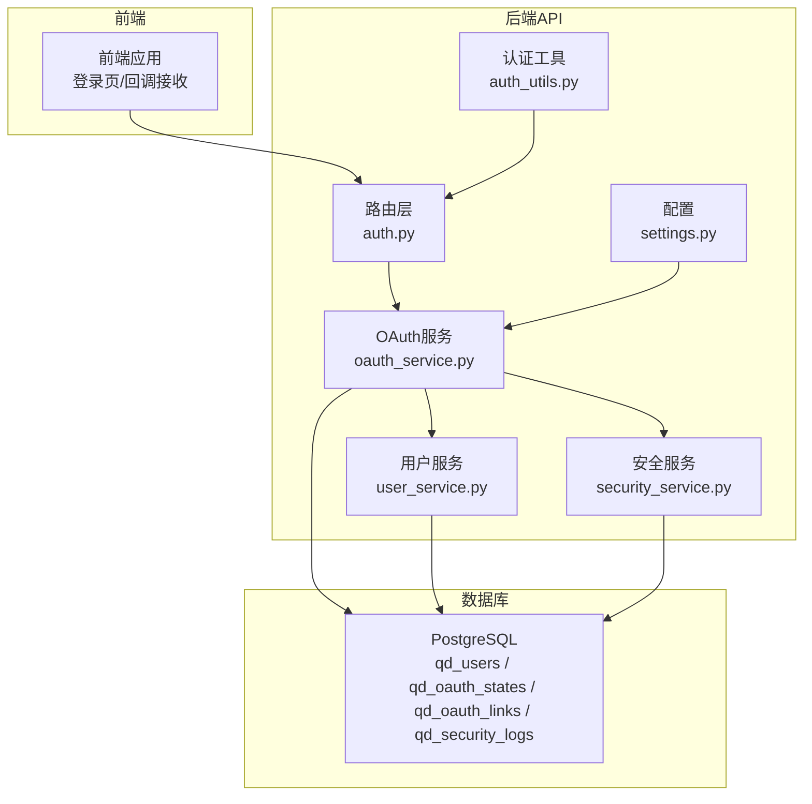
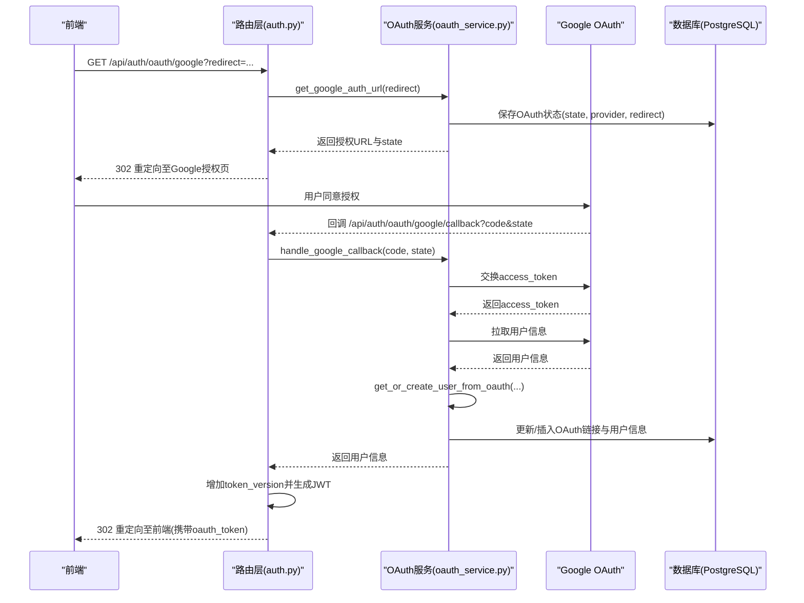
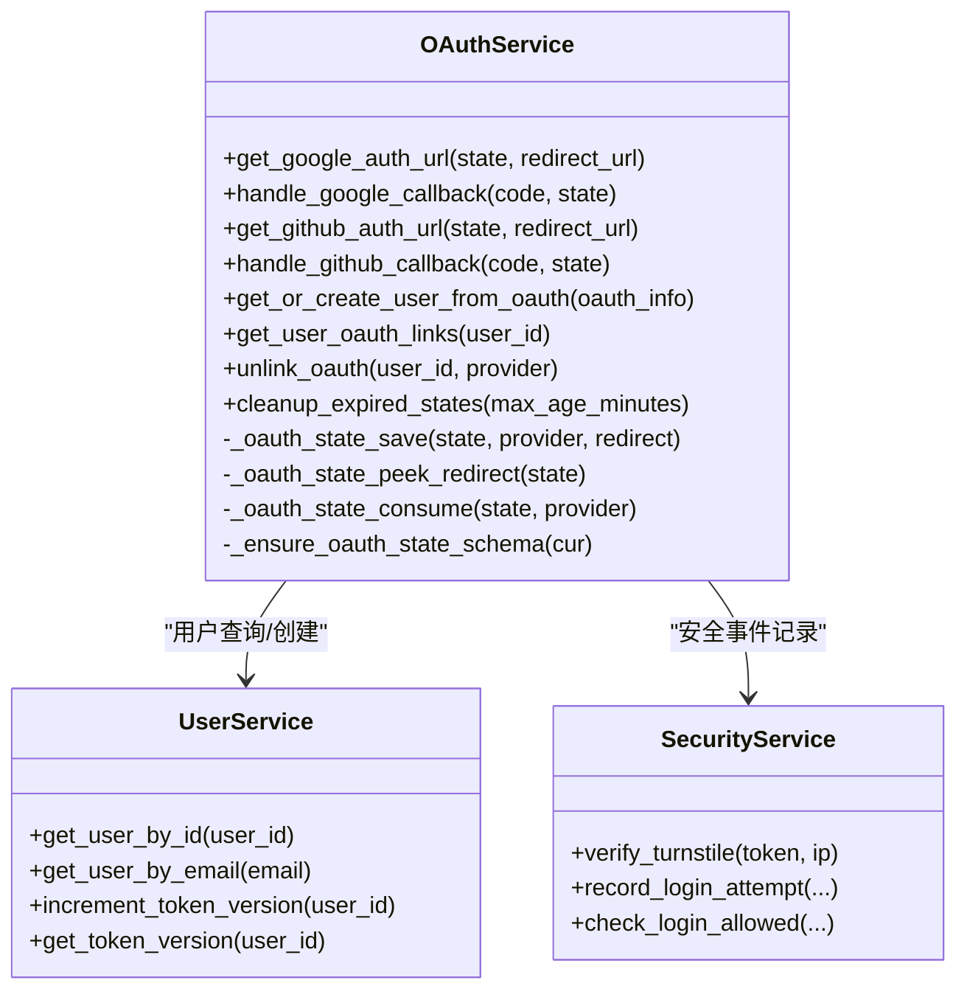
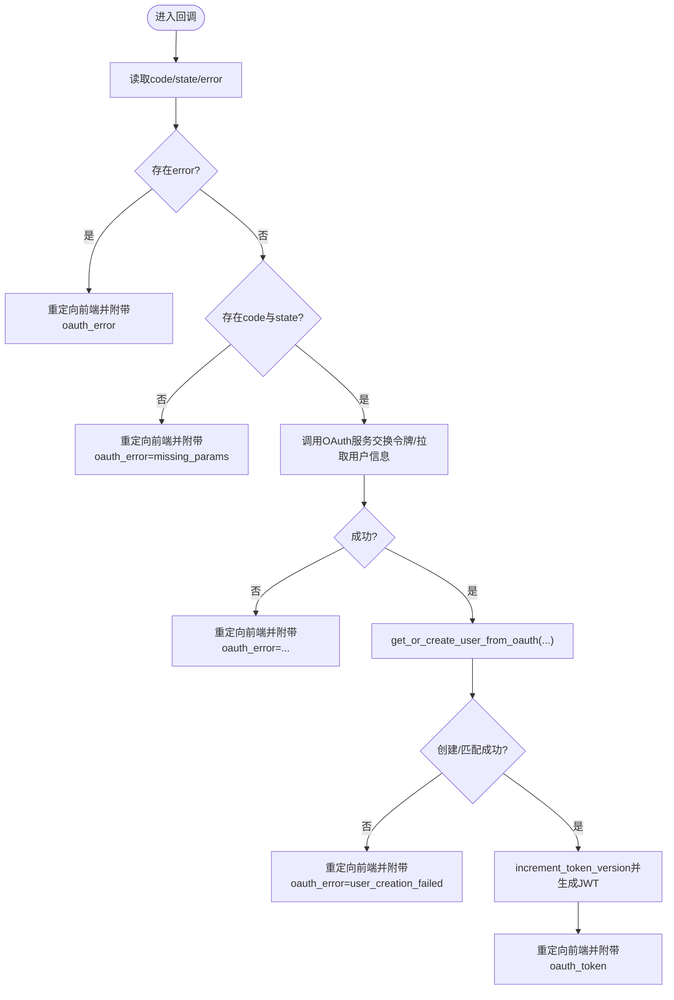
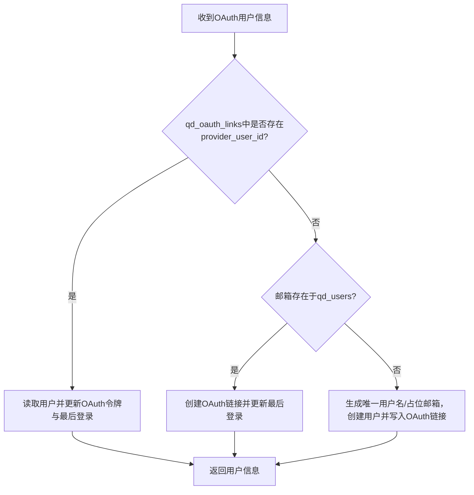
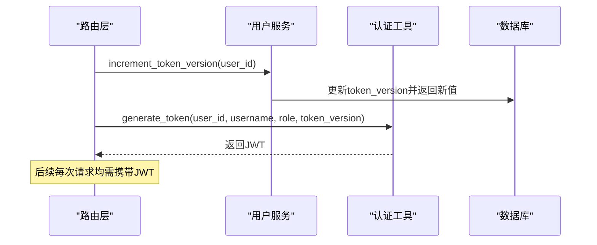
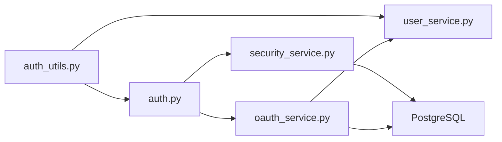
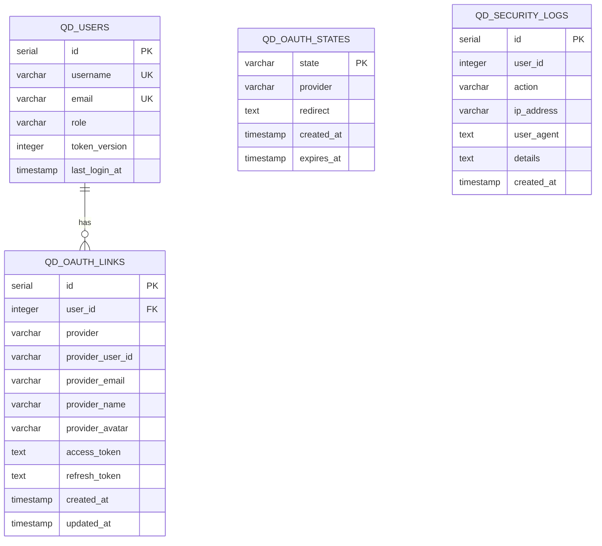

# OAuth集成

<cite>
**本文引用的文件列表**
- [oauth_service.py](file://backend_api_python/app/services/oauth_service.py)
- [auth.py](file://backend_api_python/app/routes/auth.py)
- [auth_utils.py](file://backend_api_python/app/utils/auth.py)
- [settings.py](file://backend_api_python/app/config/settings.py)
- [security_service.py](file://backend_api_python/app/services/security_service.py)
- [user_service.py](file://backend_api_python/app/services/user_service.py)
- [init.sql](file://backend_api_python/migrations/init.sql)
- [OAUTH_CONFIG_EN.md](file://docs/OAUTH_CONFIG_EN.md)
</cite>

## 目录
1. [简介](#简介)
2. [项目结构](#项目结构)
3. [核心组件](#核心组件)
4. [架构总览](#架构总览)
5. [详细组件分析](#详细组件分析)
6. [依赖关系分析](#依赖关系分析)
7. [性能考量](#性能考量)
8. [故障排查指南](#故障排查指南)
9. [结论](#结论)
10. [附录](#附录)

## 简介
本文件面向QuantDinger平台的OAuth集成，系统性阐述第三方登录（Google与GitHub）的实现架构、配置方法、回调处理流程、用户信息映射与账户创建策略、令牌管理与刷新机制、安全性设计以及部署与运维最佳实践。文档同时提供完整的配置示例与常见问题排查指引，帮助开发者快速完成集成并稳定运行。

## 项目结构
QuantDinger后端采用Flask微服务架构，OAuth能力集中在服务层与路由层：
- 路由层：定义OAuth授权入口与回调接口，负责参数校验、状态回传与前端重定向。
- 服务层：封装Google/GitHub OAuth交互、用户映射与账户创建、OAuth链接管理、状态持久化。
- 工具层：JWT生成与校验、安全配置与速率限制。
- 数据层：PostgreSQL模式包含用户表、OAuth状态表、OAuth链接表与安全审计日志表。

图示来源
- [auth.py:900-1080](file://backend_api_python/app/routes/auth.py#L900-L1080)
- [oauth_service.py:27-190](file://backend_api_python/app/services/oauth_service.py#L27-L190)
- [user_service.py:56-120](file://backend_api_python/app/services/user_service.py#L56-L120)
- [security_service.py:26-66](file://backend_api_python/app/services/security_service.py#L26-L66)
- [settings.py:30-42](file://backend_api_python/app/config/settings.py#L30-L42)
- [init.sql:104-171](file://backend_api_python/migrations/init.sql#L104-L171)

章节来源
- [auth.py:900-1080](file://backend_api_python/app/routes/auth.py#L900-L1080)
- [oauth_service.py:27-190](file://backend_api_python/app/services/oauth_service.py#L27-L190)
- [init.sql:104-171](file://backend_api_python/migrations/init.sql#L104-L171)

## 核心组件
- OAuth服务（OAuthService）
  - 提供Google与GitHub授权URL生成、回调处理、用户信息提取、OAuth链接管理与用户创建。
  - 维护OAuth状态表（qd_oauth_states），确保跨多进程/多实例的安全CSRF保护。
- 路由层（auth.py）
  - 定义/oauth/google与/oauth/github入口，以及对应的回调处理。
  - 负责参数校验、状态回读、错误回传与前端重定向。
- 用户服务（user_service.py）
  - 提供用户查询、密码哈希、令牌版本管理（单点登录控制）。
- 安全服务（security_service.py）
  - 提供Turnstile验证、登录尝试记录、速率限制与安全配置公开。
- 认证工具（auth_utils.py）
  - JWT生成与校验、装饰器、令牌版本校验。
- 配置（settings.py）
  - 应用级配置，包括密钥、管理员凭据等。

章节来源
- [oauth_service.py:27-190](file://backend_api_python/app/services/oauth_service.py#L27-L190)
- [auth.py:900-1080](file://backend_api_python/app/routes/auth.py#L900-L1080)
- [user_service.py:248-313](file://backend_api_python/app/services/user_service.py#L248-L313)
- [security_service.py:26-66](file://backend_api_python/app/services/security_service.py#L26-L66)
- [auth_utils.py:18-80](file://backend_api_python/app/utils/auth.py#L18-L80)
- [settings.py:30-42](file://backend_api_python/app/config/settings.py#L30-L42)

## 架构总览
下图展示Google OAuth登录的端到端流程：前端触发授权、后端生成状态并持久化、用户在Google完成授权后回调后端、后端交换令牌并拉取用户信息、映射用户并生成JWT，最终重定向回前端。

图示来源
- [auth.py:900-982](file://backend_api_python/app/routes/auth.py#L900-L982)
- [oauth_service.py:200-298](file://backend_api_python/app/services/oauth_service.py#L200-L298)
- [init.sql:104-171](file://backend_api_python/migrations/init.sql#L104-L171)

章节来源
- [auth.py:900-982](file://backend_api_python/app/routes/auth.py#L900-L982)
- [oauth_service.py:200-298](file://backend_api_python/app/services/oauth_service.py#L200-L298)

## 详细组件分析

### OAuth服务（OAuthService）
- 状态管理
  - 使用qd_oauth_states表保存state、提供商与重定向目标，带过期时间索引，保证跨多进程/多实例一致性。
  - 提供保存、窥视与消费state的方法，消费时进行CSRF校验与过期检查。
- Google OAuth
  - 生成授权URL（包含client_id、redirect_uri、scope、state、prompt等）。
  - 回调处理：校验state，交换access_token，拉取用户信息，返回标准化用户信息字典。
- GitHub OAuth
  - 生成授权URL（包含client_id、redirect_uri、scope、state）。
  - 回调处理：校验state，交换access_token，拉取用户信息；若用户未公开邮箱则额外请求邮箱列表并选择主邮箱或已验证邮箱。
- 用户映射与账户创建
  - 优先匹配qd_oauth_links中的OAuth账号；若不存在，则按邮箱匹配qd_users；若仍不存在则自动创建新用户，生成随机密码（OAuth登录无需该密码）、唯一用户名与占位邮箱，写入qd_oauth_links并更新最后登录时间。
  - 新用户创建后可授予注册积分奖励，种子内置指标与默认关注清单。
- OAuth链接管理
  - 支持查询用户所有OAuth链接、解绑指定提供商（需保留至少一种认证方式）。
- 清理过期状态
  - 提供清理过期state的后台任务方法。

图示来源
- [oauth_service.py:27-696](file://backend_api_python/app/services/oauth_service.py#L27-L696)
- [user_service.py:102-193](file://backend_api_python/app/services/user_service.py#L102-L193)
- [security_service.py:72-110](file://backend_api_python/app/services/security_service.py#L72-L110)

章节来源
- [oauth_service.py:27-696](file://backend_api_python/app/services/oauth_service.py#L27-L696)
- [user_service.py:102-193](file://backend_api_python/app/services/user_service.py#L102-L193)
- [security_service.py:72-110](file://backend_api_python/app/services/security_service.py#L72-L110)

### 路由层（auth.py）
- 入口与回调
  - /api/auth/oauth/google：生成Google授权URL并重定向。
  - /api/auth/oauth/google/callback：处理Google回调，校验state，换取令牌，映射用户，生成JWT并重定向回前端。
  - /api/auth/oauth/github：生成GitHub授权URL并重定向。
  - /api/auth/oauth/github/callback：处理GitHub回调，逻辑同上。
- 错误处理
  - 对缺失参数、Provider错误、用户创建失败等情况，通过查询参数回传错误码给前端，前端据此提示。
- 前端重定向构建
  - 支持PC哈希模式与SPA历史模式两种前端路由风格，自动规范化登录页URL并附加OAuth参数。

图示来源
- [auth.py:920-982](file://backend_api_python/app/routes/auth.py#L920-L982)
- [auth.py:1014-1080](file://backend_api_python/app/routes/auth.py#L1014-L1080)

章节来源
- [auth.py:900-1080](file://backend_api_python/app/routes/auth.py#L900-L1080)

### 用户映射与账户创建流程
- 匹配优先级
  - 优先匹配qd_oauth_links中的provider_user_id；
  - 若不存在，按邮箱匹配qd_users；
  - 若仍不存在，自动创建新用户，生成随机密码（OAuth登录无需该密码）、唯一用户名与占位邮箱，写入qd_oauth_links并更新最后登录时间。
- 注册奖励与种子数据
  - 新用户创建后可授予注册积分奖励；
  - 种子内置指标与默认关注清单，提升首次体验。

图示来源
- [oauth_service.py:432-636](file://backend_api_python/app/services/oauth_service.py#L432-L636)

章节来源
- [oauth_service.py:432-636](file://backend_api_python/app/services/oauth_service.py#L432-L636)

### 令牌管理与单点登录
- 令牌生成
  - 使用HS256算法，载荷包含用户ID、用户名、角色与token_version。
- 令牌版本控制
  - 登录成功后递增token_version，旧令牌因版本不匹配而失效，实现单点登录（踢出旧会话）。
- 令牌校验
  - 校验签名与过期时间，同时核对数据库中的token_version，防止并发会话冲突。

图示来源
- [auth_utils.py:18-80](file://backend_api_python/app/utils/auth.py#L18-L80)
- [user_service.py:274-313](file://backend_api_python/app/services/user_service.py#L274-L313)

章节来源
- [auth_utils.py:18-80](file://backend_api_python/app/utils/auth.py#L18-L80)
- [user_service.py:274-313](file://backend_api_python/app/services/user_service.py#L274-L313)

### 安全性设计
- CSRF防护
  - 使用state参数并持久化到qd_oauth_states，回调时严格校验state与过期时间。
- 回调URL白名单
  - 仅允许在OAUTH_ALLOWED_REDIRECTS中配置的域名回跳，避免开放重定向风险。
- 速率限制与暴力破解防护
  - 登录尝试记录与阻断策略，支持按IP与账户维度配置。
- Turnstile验证码
  - 可选的Cloudflare Turnstile验证，降低自动化攻击风险。
- 单点登录
  - 通过token_version强制旧令牌失效，保障会话安全。

章节来源
- [oauth_service.py:36-190](file://backend_api_python/app/services/oauth_service.py#L36-L190)
- [security_service.py:72-110](file://backend_api_python/app/services/security_service.py#L72-L110)
- [auth_utils.py:82-113](file://backend_api_python/app/utils/auth.py#L82-L113)

## 依赖关系分析
- 组件耦合
  - 路由层依赖OAuth服务与安全服务；OAuth服务依赖用户服务与数据库；认证工具被路由层与用户服务共同使用。
- 外部依赖
  - Google OAuth与GitHub OAuth API；
  - Cloudflare Turnstile API；
  - PostgreSQL数据库（qd_users、qd_oauth_states、qd_oauth_links、qd_security_logs）。
- 潜在循环依赖
  - 通过模块导入避免直接循环；各服务以函数式单例访问，降低耦合。

图示来源
- [auth.py:900-1080](file://backend_api_python/app/routes/auth.py#L900-L1080)
- [oauth_service.py:27-190](file://backend_api_python/app/services/oauth_service.py#L27-L190)
- [user_service.py:56-120](file://backend_api_python/app/services/user_service.py#L56-L120)
- [security_service.py:26-66](file://backend_api_python/app/services/security_service.py#L26-L66)
- [auth_utils.py:18-80](file://backend_api_python/app/utils/auth.py#L18-L80)

章节来源
- [auth.py:900-1080](file://backend_api_python/app/routes/auth.py#L900-L1080)
- [oauth_service.py:27-190](file://backend_api_python/app/services/oauth_service.py#L27-L190)
- [user_service.py:56-120](file://backend_api_python/app/services/user_service.py#L56-L120)
- [security_service.py:26-66](file://backend_api_python/app/services/security_service.py#L26-L66)
- [auth_utils.py:18-80](file://backend_api_python/app/utils/auth.py#L18-L80)

## 性能考量
- 状态表索引
  - qd_oauth_states.expiry列建立索引，定期清理过期状态，避免表膨胀。
- 并发与多实例
  - 状态持久化于数据库，避免多进程/多实例间内存态丢失导致的state不一致。
- 网络调用超时
  - 对Google/GitHub与Turnstile的HTTP请求设置合理超时，避免阻塞。
- 令牌版本校验
  - 每次校验均需查询数据库，建议在高并发场景下优化数据库连接池与索引。

[本节为通用指导，无需特定文件来源]

## 故障排查指南
- 常见错误与定位
  - redirect_uri_mismatch：检查GOOGLE_REDIRECT_URI/GITHUB_REDIRECT_URI与Provider后台配置是否完全一致（含协议、端口、路径）。
  - invalid_state：确认前端发起授权时保存的state与回调state一致且未过期；检查qd_oauth_states表清理任务是否正常执行。
  - missing_params：回调URL缺少code或state参数，检查前端重定向逻辑与Provider回调配置。
  - user_creation_failed：用户映射/创建异常，查看OAuth服务日志与数据库约束（邮箱唯一、用户名唯一）。
  - oauth_error=server_error：后端异常，查看路由层与OAuth服务错误日志。
- 配置核对清单
  - GOOGLE_CLIENT_ID/GITHUB_CLIENT_ID/GITHUB_CLIENT_SECRET
  - GOOGLE_REDIRECT_URI/GITHUB_REDIRECT_URI
  - FRONTEND_URL与OAUTH_ALLOWED_REDIRECTS
  - TURNSTILE_SITE_KEY/TURNSTILE_SECRET_KEY（可选）
  - SECRET_KEY（JWT密钥）

章节来源
- [OAUTH_CONFIG_EN.md:183-221](file://docs/OAUTH_CONFIG_EN.md#L183-L221)
- [auth.py:920-982](file://backend_api_python/app/routes/auth.py#L920-L982)
- [auth.py:1014-1080](file://backend_api_python/app/routes/auth.py#L1014-L1080)

## 结论
QuantDinger的OAuth集成以数据库为中心的状态管理与严格的CSRF防护为核心，结合用户映射与账户创建策略，实现了Google与GitHub的无缝登录体验。配合令牌版本控制、速率限制与Turnstile验证码，整体方案在可用性与安全性之间取得良好平衡。按照本文提供的配置步骤与排障指南，可快速完成生产环境部署与长期稳定运行。

[本节为总结，无需特定文件来源]

## 附录

### OAuth配置示例（基于文档）
- Google OAuth
  - 在Google Cloud Console创建OAuth客户端，配置授权回调URI为后端API回调地址。
  - 在.env中设置GOOGLE_CLIENT_ID、GOOGLE_CLIENT_SECRET、GOOGLE_REDIRECT_URI。
- GitHub OAuth
  - 在GitHub Developer Settings创建OAuth App，配置回调URL为后端API回调地址。
  - 在.env中设置GITHUB_CLIENT_ID、GITHUB_CLIENT_SECRET、GITHUB_REDIRECT_URI。
- 前端与回调
  - 设置FRONTEND_URL与OAUTH_ALLOWED_REDIRECTS，确保回调重定向合法。
- Turnstile（可选）
  - 在Cloudflare创建站点，获取SITE_KEY与SECRET_KEY并配置到.env。

章节来源
- [OAUTH_CONFIG_EN.md:15-179](file://docs/OAUTH_CONFIG_EN.md#L15-L179)

### 数据模型概览（OAuth相关）

图示来源
- [init.sql:104-171](file://backend_api_python/migrations/init.sql#L104-L171)