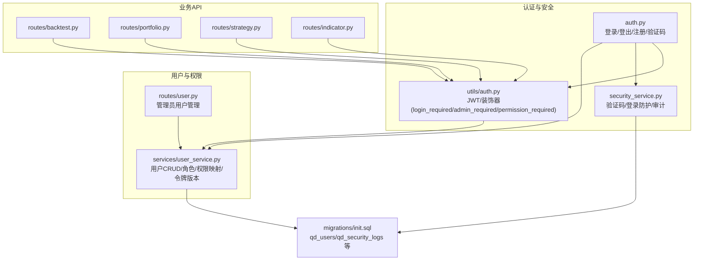
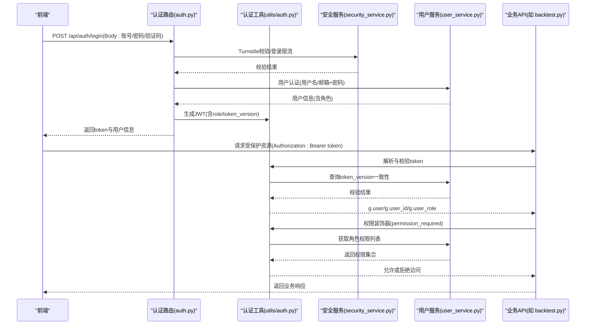
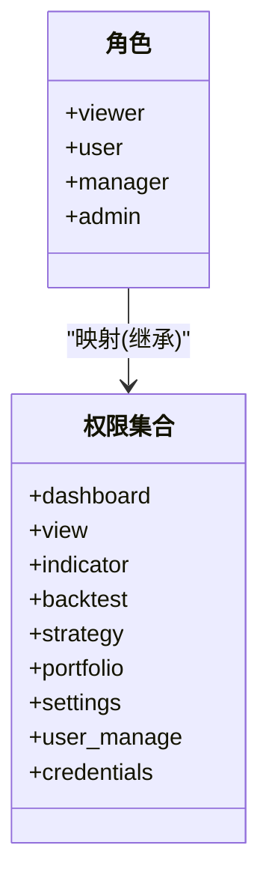
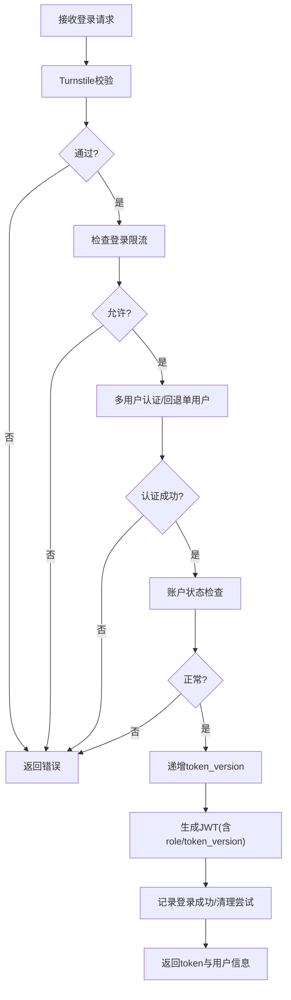
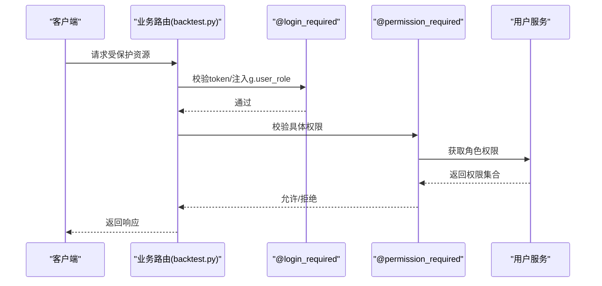
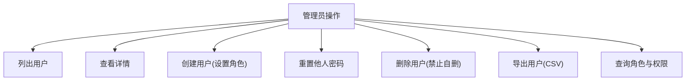
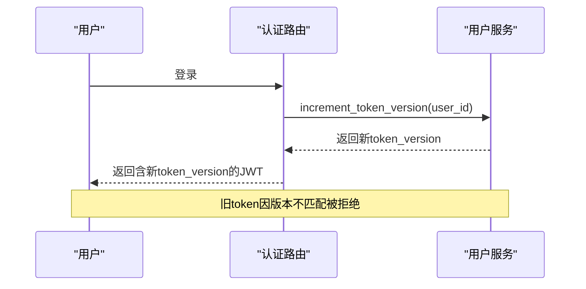
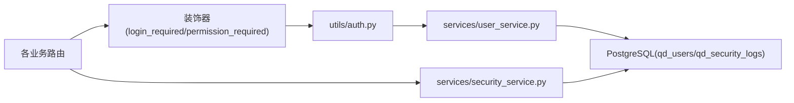
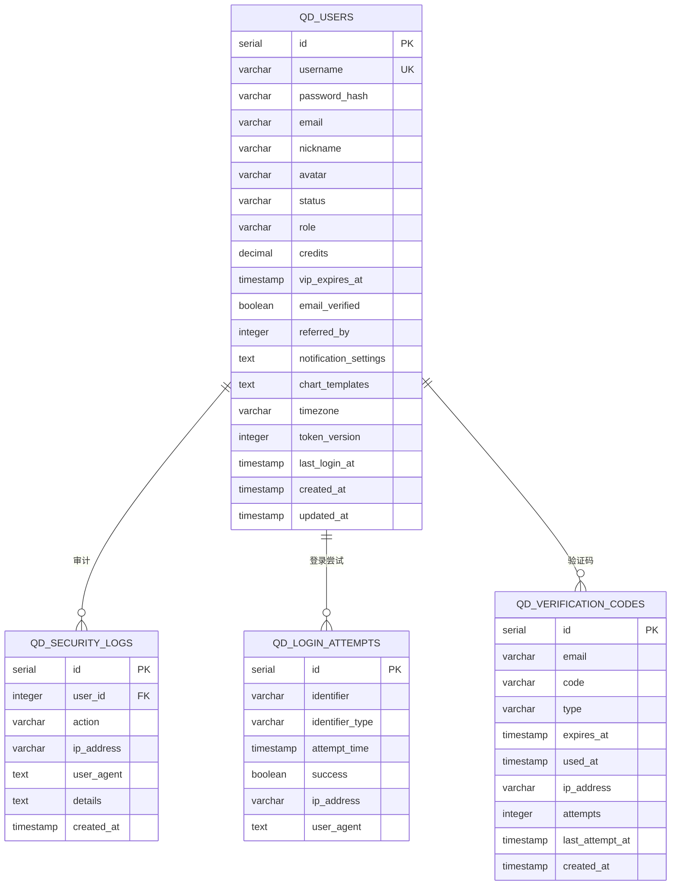

# 用户权限管理

<cite>
**本文引用的文件**
- [backend_api_python/app/utils/auth.py](file://backend_api_python/app/utils/auth.py)
- [backend_api_python/app/services/user_service.py](file://backend_api_python/app/services/user_service.py)
- [backend_api_python/app/routes/auth.py](file://backend_api_python/app/routes/auth.py)
- [backend_api_python/app/routes/user.py](file://backend_api_python/app/routes/user.py)
- [backend_api_python/app/services/security_service.py](file://backend_api_python/app/services/security_service.py)
- [backend_api_python/app/routes/backtest.py](file://backend_api_python/app/routes/backtest.py)
- [backend_api_python/app/routes/portfolio.py](file://backend_api_python/app/routes/portfolio.py)
- [backend_api_python/app/routes/strategy.py](file://backend_api_python/app/routes/strategy.py)
- [backend_api_python/app/routes/indicator.py](file://backend_api_python/app/routes/indicator.py)
- [backend_api_python/app/config/settings.py](file://backend_api_python/app/config/settings.py)
- [backend_api_python/migrations/init.sql](file://backend_api_python/migrations/init.sql)
</cite>

## 目录
1. [简介](#简介)
2. [项目结构](#项目结构)
3. [核心组件](#核心组件)
4. [架构总览](#架构总览)
5. [详细组件分析](#详细组件分析)
6. [依赖关系分析](#依赖关系分析)
7. [性能考虑](#性能考虑)
8. [故障排查指南](#故障排查指南)
9. [结论](#结论)
10. [附录](#附录)

## 简介
本文件系统化阐述 QuantDinger 的用户权限管理体系，围绕基于角色的访问控制（RBAC）模型，详细说明四类用户角色（viewer、user、manager、admin）的权限分配与功能限制，解释权限检查机制、资源访问控制与操作授权验证流程。文档还覆盖权限继承关系、权限组合与动态权限调整策略，提供权限管理最佳实践（最小权限原则、权限审计与安全日志记录），并说明管理员功能（用户管理、权限分配与系统配置）。最后给出权限系统的扩展性设计与自定义权限实现方法。

## 项目结构
QuantDinger 后端采用 Flask 蓝图组织 API，权限控制贯穿认证、路由与服务层：
- 认证与中间件：JWT 令牌生成与校验、登录保护装饰器、角色与权限装饰器
- 用户服务：用户 CRUD、密码哈希、角色与权限映射、令牌版本控制
- 安全服务：验证码与登录防护、Turnstile 验证、安全事件审计
- 路由层：各业务模块 API，统一使用 @login_required、@admin_required 等装饰器进行权限约束
- 数据层：PostgreSQL 初始化脚本定义用户表与审计日志表等

**图表来源**
- [backend_api_python/app/routes/auth.py:140-278](file://backend_api_python/app/routes/auth.py#L140-L278)
- [backend_api_python/app/utils/auth.py:18-157](file://backend_api_python/app/utils/auth.py#L18-L157)
- [backend_api_python/app/services/security_service.py:26-399](file://backend_api_python/app/services/security_service.py#L26-L399)
- [backend_api_python/app/services/user_service.py:56-68](file://backend_api_python/app/services/user_service.py#L56-L68)
- [backend_api_python/app/routes/user.py:41-287](file://backend_api_python/app/routes/user.py#L41-L287)
- [backend_api_python/migrations/init.sql:8-31](file://backend_api_python/migrations/init.sql#L8-L31)

**章节来源**
- [backend_api_python/app/routes/auth.py:140-278](file://backend_api_python/app/routes/auth.py#L140-L278)
- [backend_api_python/app/utils/auth.py:18-157](file://backend_api_python/app/utils/auth.py#L18-L157)
- [backend_api_python/app/services/security_service.py:26-399](file://backend_api_python/app/services/security_service.py#L26-L399)
- [backend_api_python/app/services/user_service.py:56-68](file://backend_api_python/app/services/user_service.py#L56-L68)
- [backend_api_python/app/routes/user.py:41-287](file://backend_api_python/app/routes/user.py#L41-L287)
- [backend_api_python/migrations/init.sql:8-31](file://backend_api_python/migrations/init.sql#L8-L31)

## 核心组件
- 认证工具（JWT 与装饰器）
  - 令牌生成与校验、Bearer 认证中间件、角色与权限装饰器、单客户端登录控制（token_version）
- 用户服务（RBAC 实现）
  - 角色常量与权限映射、用户 CRUD、密码哈希与校验、令牌版本递增与查询、管理员保障
- 安全服务（风控与审计）
  - Turnstile 验证、登录尝试记录与限流、验证码发送频率限制、安全事件审计日志
- 路由层（权限约束）
  - 各业务 API 统一使用 @login_required、@admin_required、@permission_required 等装饰器
- 数据层（权限相关表）
  - 用户表（角色、状态、令牌版本）、安全审计日志表、登录尝试表、验证码表

**章节来源**
- [backend_api_python/app/utils/auth.py:18-157](file://backend_api_python/app/utils/auth.py#L18-L157)
- [backend_api_python/app/services/user_service.py:56-68](file://backend_api_python/app/services/user_service.py#L56-L68)
- [backend_api_python/app/services/security_service.py:26-399](file://backend_api_python/app/services/security_service.py#L26-L399)
- [backend_api_python/migrations/init.sql:8-31](file://backend_api_python/migrations/init.sql#L8-L31)

## 架构总览
下图展示登录与权限检查的整体流程：前端携带 Bearer 令牌访问受保护资源，后端通过装饰器链完成身份解析、角色判定与权限校验，同时记录安全事件与登录尝试。

**图表来源**
- [backend_api_python/app/routes/auth.py:140-278](file://backend_api_python/app/routes/auth.py#L140-L278)
- [backend_api_python/app/utils/auth.py:50-157](file://backend_api_python/app/utils/auth.py#L50-L157)
- [backend_api_python/app/services/security_service.py:72-241](file://backend_api_python/app/services/security_service.py#L72-L241)
- [backend_api_python/app/services/user_service.py:248-313](file://backend_api_python/app/services/user_service.py#L248-L313)
- [backend_api_python/app/routes/backtest.py:149-186](file://backend_api_python/app/routes/backtest.py#L149-L186)

**章节来源**
- [backend_api_python/app/routes/auth.py:140-278](file://backend_api_python/app/routes/auth.py#L140-L278)
- [backend_api_python/app/utils/auth.py:50-157](file://backend_api_python/app/utils/auth.py#L50-L157)
- [backend_api_python/app/services/security_service.py:72-241](file://backend_api_python/app/services/security_service.py#L72-L241)
- [backend_api_python/app/services/user_service.py:248-313](file://backend_api_python/app/services/user_service.py#L248-L313)
- [backend_api_python/app/routes/backtest.py:149-186](file://backend_api_python/app/routes/backtest.py#L149-L186)

## 详细组件分析

### RBAC 角色与权限模型
- 角色层级（特权递增）：viewer < user < manager < admin
- 权限映射（按角色）：
  - viewer：dashboard、view
  - user：dashboard、view、indicator、backtest、strategy、portfolio
  - manager：在 user 权限基础上新增 settings
  - admin：在 manager 权限基础上新增 user_manage、credentials
- 权限继承：高权限角色自动继承低权限角色的所有权限
- 权限组合：通过角色映射实现“权限集合”的组合，支持细粒度装饰器校验

**图表来源**
- [backend_api_python/app/services/user_service.py:59-68](file://backend_api_python/app/services/user_service.py#L59-L68)

**章节来源**
- [backend_api_python/app/services/user_service.py:59-68](file://backend_api_python/app/services/user_service.py#L59-L68)

### 登录与令牌校验流程
- 登录步骤：
  1) Turnstile 校验（可选）
  2) 登录尝试限流检查
  3) 多用户模式认证或回退至单用户模式
  4) 账户状态校验
  5) 令牌版本递增（单客户端登录）
  6) 生成 JWT（含 role 与 token_version）
  7) 记录成功/失败日志与清理尝试
- 令牌校验：
  - 解码 JWT，校验签名与有效期
  - 校验 token_version 与数据库一致
  - 将用户上下文注入 g 对象（user、user_id、user_role）

**图表来源**
- [backend_api_python/app/routes/auth.py:140-278](file://backend_api_python/app/routes/auth.py#L140-L278)
- [backend_api_python/app/utils/auth.py:50-157](file://backend_api_python/app/utils/auth.py#L50-L157)
- [backend_api_python/app/services/security_service.py:200-241](file://backend_api_python/app/services/security_service.py#L200-L241)
- [backend_api_python/app/services/user_service.py:274-313](file://backend_api_python/app/services/user_service.py#L274-L313)

**章节来源**
- [backend_api_python/app/routes/auth.py:140-278](file://backend_api_python/app/routes/auth.py#L140-L278)
- [backend_api_python/app/utils/auth.py:50-157](file://backend_api_python/app/utils/auth.py#L50-L157)
- [backend_api_python/app/services/security_service.py:200-241](file://backend_api_python/app/services/security_service.py#L200-L241)
- [backend_api_python/app/services/user_service.py:274-313](file://backend_api_python/app/services/user_service.py#L274-L313)

### 权限检查与资源访问控制
- 装饰器链：
  - @login_required：提取并校验 token，注入用户上下文
  - @admin_required/@manager_required：基于角色的粗粒度授权
  - @permission_required("xxx")：基于细粒度权限字符串的授权
- 权限来源：用户服务根据角色返回权限集合
- 资源访问控制：所有业务 API 在路由层统一加注 @login_required，部分敏感接口再叠加角色或权限装饰器

**图表来源**
- [backend_api_python/app/utils/auth.py:126-217](file://backend_api_python/app/utils/auth.py#L126-L217)
- [backend_api_python/app/services/user_service.py:656-659](file://backend_api_python/app/services/user_service.py#L656-L659)
- [backend_api_python/app/routes/backtest.py:149-186](file://backend_api_python/app/routes/backtest.py#L149-L186)

**章节来源**
- [backend_api_python/app/utils/auth.py:126-217](file://backend_api_python/app/utils/auth.py#L126-L217)
- [backend_api_python/app/services/user_service.py:656-659](file://backend_api_python/app/services/user_service.py#L656-L659)
- [backend_api_python/app/routes/backtest.py:149-186](file://backend_api_python/app/routes/backtest.py#L149-L186)

### 管理员功能与系统配置
- 管理员用户保障：若数据库无用户，自动以环境变量创建 admin
- 用户管理（仅 admin）：
  - 列表、详情、创建、更新、删除、重置密码
  - 导出用户信息（CSV）
  - 角色与权限查询
- 系统配置（通过环境变量与配置类）：
  - SECRET_KEY、ADMIN_USER/PASSWORD、Turnstile 配置、注册开关、积分奖励等

**图表来源**
- [backend_api_python/app/routes/user.py:41-287](file://backend_api_python/app/routes/user.py#L41-L287)
- [backend_api_python/app/services/user_service.py:660-690](file://backend_api_python/app/services/user_service.py#L660-L690)
- [backend_api_python/app/config/settings.py:30-42](file://backend_api_python/app/config/settings.py#L30-L42)

**章节来源**
- [backend_api_python/app/routes/user.py:41-287](file://backend_api_python/app/routes/user.py#L41-L287)
- [backend_api_python/app/services/user_service.py:660-690](file://backend_api_python/app/services/user_service.py#L660-L690)
- [backend_api_python/app/config/settings.py:30-42](file://backend_api_python/app/config/settings.py#L30-L42)

### 单客户端登录与令牌版本控制
- 机制：每次登录成功后递增 token_version，旧 token 因版本不匹配而失效
- 作用：踢掉重复登录的旧会话，实现“单一客户端登录”
- 影响：用户在新设备登录会立即使旧设备登出

**图表来源**
- [backend_api_python/app/routes/auth.py:227-242](file://backend_api_python/app/routes/auth.py#L227-L242)
- [backend_api_python/app/services/user_service.py:274-313](file://backend_api_python/app/services/user_service.py#L274-L313)
- [backend_api_python/app/utils/auth.py:82-113](file://backend_api_python/app/utils/auth.py#L82-L113)

**章节来源**
- [backend_api_python/app/routes/auth.py:227-242](file://backend_api_python/app/routes/auth.py#L227-L242)
- [backend_api_python/app/services/user_service.py:274-313](file://backend_api_python/app/services/user_service.py#L274-L313)
- [backend_api_python/app/utils/auth.py:82-113](file://backend_api_python/app/utils/auth.py#L82-L113)

### 权限继承、组合与动态调整
- 继承关系：admin ⊃ manager ⊃ user ⊃ viewer，天然具备“向上继承”
- 权限组合：通过角色映射形成权限集合，支持细粒度装饰器校验
- 动态调整：
  - 角色变更：管理员更新用户角色，即时生效
  - 权限映射：可在用户服务中调整角色到权限的映射
  - 令牌版本：登录即动态更新，实现即时生效的会话控制

**章节来源**
- [backend_api_python/app/services/user_service.py:59-68](file://backend_api_python/app/services/user_service.py#L59-L68)
- [backend_api_python/app/services/user_service.py:411-454](file://backend_api_python/app/services/user_service.py#L411-L454)
- [backend_api_python/app/services/user_service.py:274-313](file://backend_api_python/app/services/user_service.py#L274-L313)

### 最小权限原则与安全实践
- 最小权限原则：仅授予完成任务所需的最少权限
- 安全日志与审计：登录、注册、密码修改、重置、OAuth 登录等均记录审计日志
- 风控措施：验证码发送频率限制、登录尝试计数与封禁、Turnstile 人机验证
- 密码安全：优先 bcrypt，降级 SHA256 并带盐；密码强度校验

**章节来源**
- [backend_api_python/app/services/security_service.py:246-277](file://backend_api_python/app/services/security_service.py#L246-L277)
- [backend_api_python/app/services/security_service.py:283-326](file://backend_api_python/app/services/security_service.py#L283-L326)
- [backend_api_python/app/services/security_service.py:331-356](file://backend_api_python/app/services/security_service.py#L331-L356)
- [backend_api_python/app/services/user_service.py:70-100](file://backend_api_python/app/services/user_service.py#L70-L100)

### 扩展性设计与自定义权限
- 自定义权限字符串：通过装饰器 @permission_required("xxx") 实现细粒度授权
- 权限映射扩展：在用户服务中维护角色到权限集合的映射，便于集中管理
- 插件化能力：业务模块可按需添加新的权限字符串，无需改动核心逻辑

**章节来源**
- [backend_api_python/app/utils/auth.py:188-217](file://backend_api_python/app/utils/auth.py#L188-L217)
- [backend_api_python/app/services/user_service.py:656-659](file://backend_api_python/app/services/user_service.py#L656-L659)

## 依赖关系分析
- 路由层依赖认证工具与用户服务，实现统一的权限约束
- 安全服务为认证与注册流程提供风控与审计支撑
- 数据层通过初始化脚本定义用户与审计相关表，支撑权限与审计需求

**图表来源**
- [backend_api_python/app/utils/auth.py:126-217](file://backend_api_python/app/utils/auth.py#L126-L217)
- [backend_api_python/app/services/user_service.py:56-68](file://backend_api_python/app/services/user_service.py#L56-L68)
- [backend_api_python/app/services/security_service.py:26-399](file://backend_api_python/app/services/security_service.py#L26-L399)
- [backend_api_python/migrations/init.sql:8-31](file://backend_api_python/migrations/init.sql#L8-L31)

**章节来源**
- [backend_api_python/app/utils/auth.py:126-217](file://backend_api_python/app/utils/auth.py#L126-L217)
- [backend_api_python/app/services/user_service.py:56-68](file://backend_api_python/app/services/user_service.py#L56-L68)
- [backend_api_python/app/services/security_service.py:26-399](file://backend_api_python/app/services/security_service.py#L26-L399)
- [backend_api_python/migrations/init.sql:8-31](file://backend_api_python/migrations/init.sql#L8-L31)

## 性能考虑
- 令牌版本查询与更新：登录成功后进行一次数据库读写，开销极小
- 权限查询：装饰器内按角色查权限集合，内存查找，性能优异
- 登录限流与验证码限流：通过数据库计数实现，注意索引与清理策略
- 建议：对高频接口启用缓存与连接池优化，确保审计日志写入异步化

## 故障排查指南
- 401 未授权：检查 Authorization 头是否为 Bearer token，token 是否过期
- 403 权限不足：确认用户角色与目标权限字符串是否匹配
- 登录频繁受限：检查 IP/账号维度的登录尝试计数与封禁剩余时间
- 验证码发送受限：检查邮箱维度与 IP 维度的发送频率限制
- 审计日志缺失：确认安全服务日志写入是否成功，数据库连接是否正常

**章节来源**
- [backend_api_python/app/utils/auth.py:140-157](file://backend_api_python/app/utils/auth.py#L140-L157)
- [backend_api_python/app/services/security_service.py:200-241](file://backend_api_python/app/services/security_service.py#L200-L241)
- [backend_api_python/app/services/security_service.py:283-326](file://backend_api_python/app/services/security_service.py#L283-L326)

## 结论
QuantDinger 的权限体系以 RBAC 为核心，结合 JWT、装饰器与安全服务，实现了从登录到资源访问的全链路控制。通过角色继承与权限映射，系统既满足最小权限原则，又具备良好的扩展性。配合安全审计与风控机制，整体方案兼顾可用性与安全性。

## 附录
- 数据模型（权限相关）
  - 用户表：包含角色、状态、令牌版本等字段，支撑角色与单客户端登录控制
  - 审计日志表：记录安全事件，支持权限审计与溯源
  - 登录尝试与验证码表：支撑风控与防刷

**图表来源**
- [backend_api_python/migrations/init.sql:8-31](file://backend_api_python/migrations/init.sql#L8-L31)
- [backend_api_python/migrations/init.sql:138-149](file://backend_api_python/migrations/init.sql#L138-L149)
- [backend_api_python/migrations/init.sql:117-133](file://backend_api_python/migrations/init.sql#L117-L133)
- [backend_api_python/migrations/init.sql:177-189](file://backend_api_python/migrations/init.sql#L177-L189)