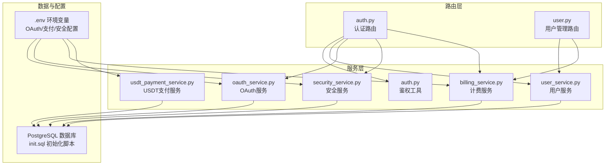
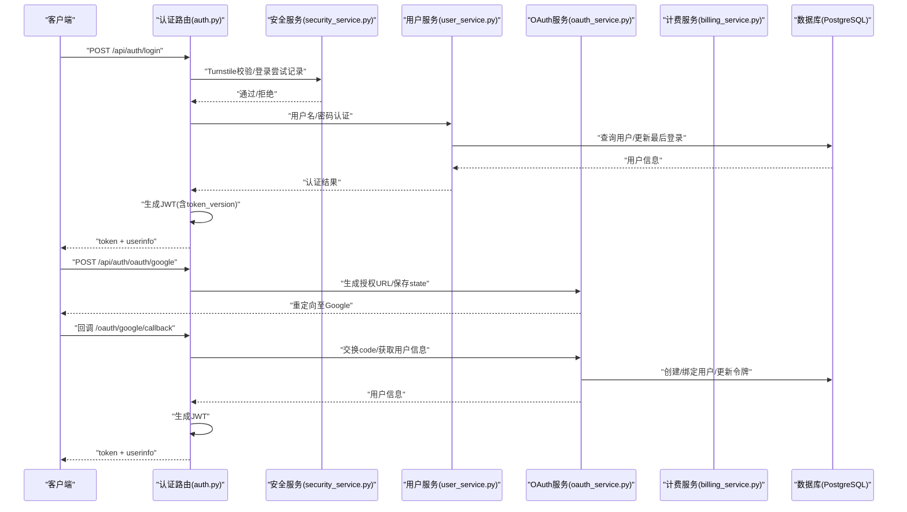
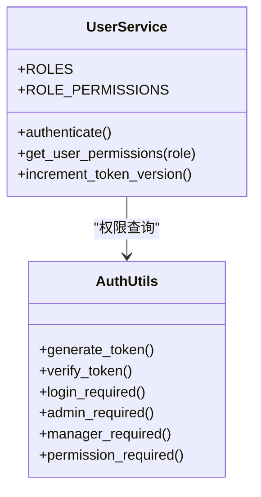
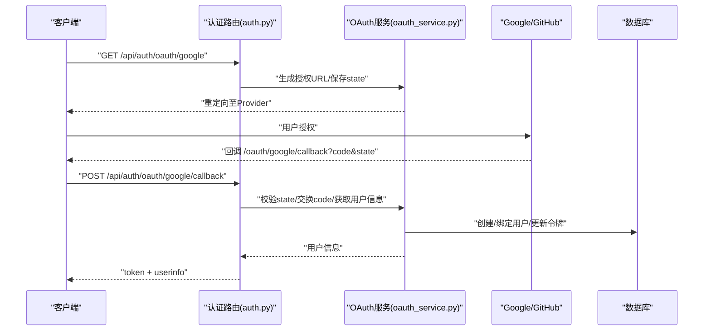
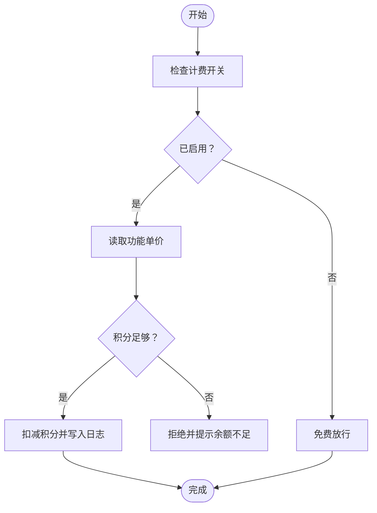
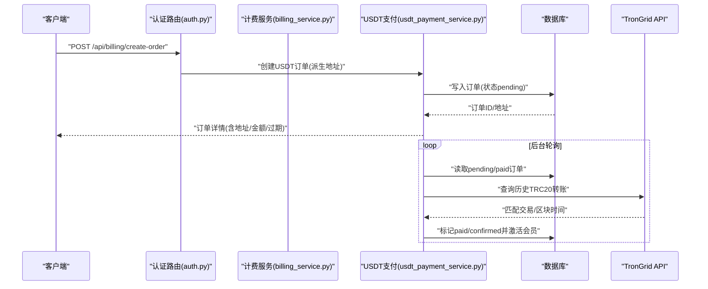
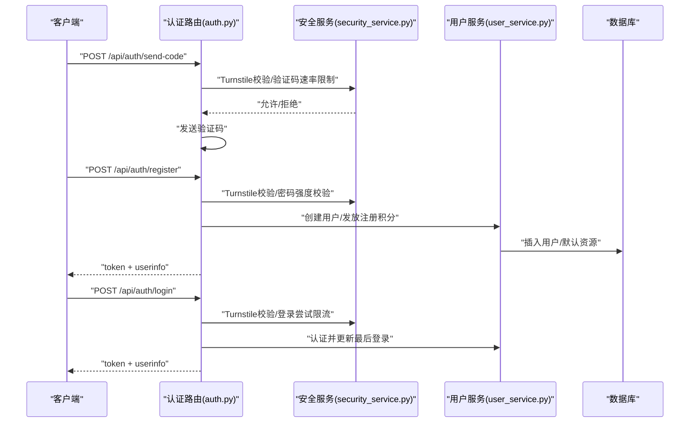
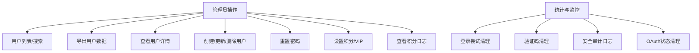
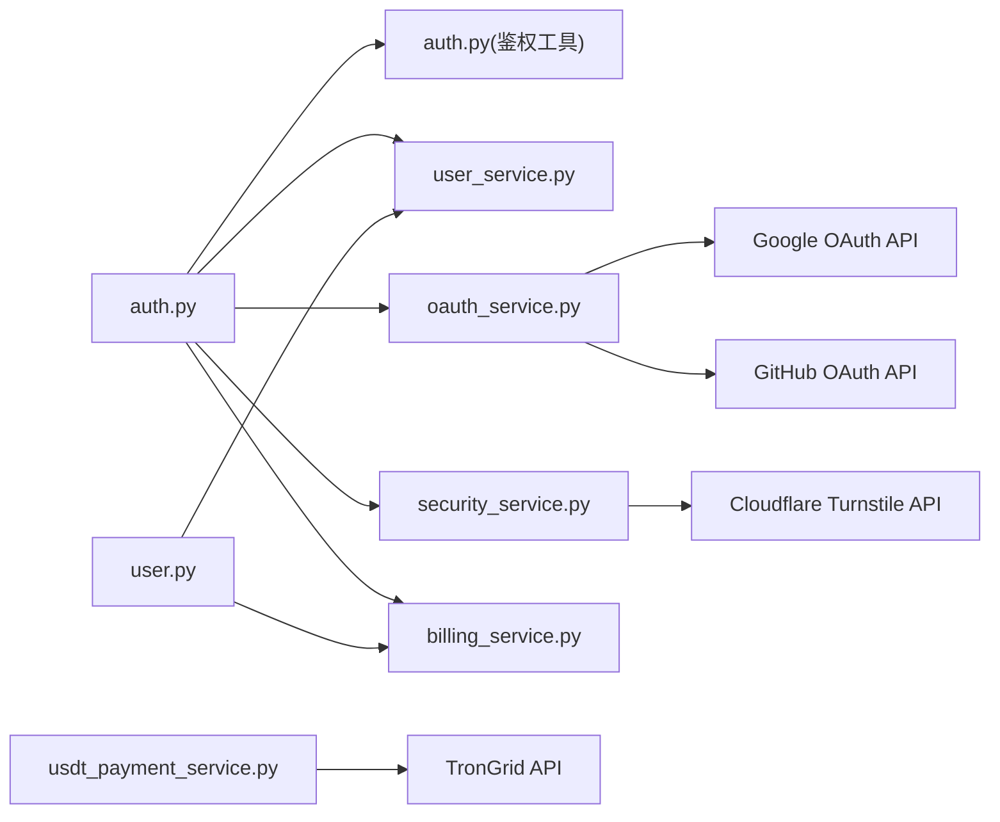

# 用户管理

<cite>
**本文引用的文件**
- [backend_api_python/app/routes/user.py](file://backend_api_python/app/routes/user.py)
- [backend_api_python/app/services/user_service.py](file://backend_api_python/app/services/user_service.py)
- [backend_api_python/app/services/oauth_service.py](file://backend_api_python/app/services/oauth_service.py)
- [backend_api_python/app/services/billing_service.py](file://backend_api_python/app/services/billing_service.py)
- [backend_api_python/app/services/security_service.py](file://backend_api_python/app/services/security_service.py)
- [backend_api_python/app/routes/auth.py](file://backend_api_python/app/routes/auth.py)
- [backend_api_python/app/utils/auth.py](file://backend_api_python/app/utils/auth.py)
- [backend_api_python/app/services/usdt_payment_service.py](file://backend_api_python/app/services/usdt_payment_service.py)
- [backend_api_python/migrations/init.sql](file://backend_api_python/migrations/init.sql)
- [docs/OAUTH_CONFIG_EN.md](file://docs/OAUTH_CONFIG_EN.md)
</cite>

## 目录
1. [简介](#简介)
2. [项目结构](#项目结构)
3. [核心组件](#核心组件)
4. [架构总览](#架构总览)
5. [详细组件分析](#详细组件分析)
6. [依赖分析](#依赖分析)
7. [性能考量](#性能考量)
8. [故障排查指南](#故障排查指南)
9. [结论](#结论)
10. [附录](#附录)

## 简介
本文件面向QuantDinger用户管理系统，系统采用多用户架构，支持基于角色的访问控制（RBAC）、第三方OAuth登录（Google、GitHub）、内置积分与会员体系、以及USDT TRC20支付集成。文档覆盖从用户注册、登录、权限管理到账户管理、管理员功能、用户统计与系统监控的完整流程，并提供安全最佳实践与合规建议。

## 项目结构
后端采用Flask微服务架构，路由层位于app/routes，业务服务位于app/services，工具与通用能力位于app/utils，数据库初始化脚本位于migrations。OAuth配置文档位于docs目录。

**图示来源**
- [backend_api_python/app/routes/auth.py:1-1161](file://backend_api_python/app/routes/auth.py#L1-L1161)
- [backend_api_python/app/routes/user.py:1-1894](file://backend_api_python/app/routes/user.py#L1-L1894)
- [backend_api_python/app/services/user_service.py:1-701](file://backend_api_python/app/services/user_service.py#L1-L701)
- [backend_api_python/app/services/oauth_service.py:1-715](file://backend_api_python/app/services/oauth_service.py#L1-L715)
- [backend_api_python/app/services/billing_service.py:1-758](file://backend_api_python/app/services/billing_service.py#L1-L758)
- [backend_api_python/app/services/security_service.py:1-399](file://backend_api_python/app/services/security_service.py#L1-L399)
- [backend_api_python/app/services/usdt_payment_service.py:1-830](file://backend_api_python/app/services/usdt_payment_service.py#L1-L830)
- [backend_api_python/migrations/init.sql:1-1026](file://backend_api_python/migrations/init.sql#L1-L1026)

**章节来源**
- [backend_api_python/app/routes/auth.py:1-1161](file://backend_api_python/app/routes/auth.py#L1-L1161)
- [backend_api_python/app/routes/user.py:1-1894](file://backend_api_python/app/routes/user.py#L1-L1894)
- [backend_api_python/migrations/init.sql:1-1026](file://backend_api_python/migrations/init.sql#L1-L1026)

## 核心组件
- 用户服务：负责用户CRUD、密码哈希/校验、令牌版本控制、角色与权限查询、默认看板与内置指标种子。
- OAuth服务：统一处理Google/GitHub授权、CSRF状态持久化、回调处理、用户自动创建与绑定、令牌更新与解绑。
- 计费服务：统一积分管理、会员计划、消费扣减、充值/调整、日志审计、会员激活。
- 安全服务：Turnstile验证、登录尝试记录与限流、暴力破解防护、验证码速率限制、安全事件审计。
- USDT支付服务：TRC20收款订单生成、链上扫描与对账、确认延迟、后台轮询、会员激活。
- 路由与鉴权：登录/注册/验证码发送、OAuth授权与回调、用户资料与积分日志、管理员用户管理。

**章节来源**
- [backend_api_python/app/services/user_service.py:1-701](file://backend_api_python/app/services/user_service.py#L1-L701)
- [backend_api_python/app/services/oauth_service.py:1-715](file://backend_api_python/app/services/oauth_service.py#L1-L715)
- [backend_api_python/app/services/billing_service.py:1-758](file://backend_api_python/app/services/billing_service.py#L1-L758)
- [backend_api_python/app/services/security_service.py:1-399](file://backend_api_python/app/services/security_service.py#L1-L399)
- [backend_api_python/app/services/usdt_payment_service.py:1-830](file://backend_api_python/app/services/usdt_payment_service.py#L1-L830)
- [backend_api_python/app/utils/auth.py:1-239](file://backend_api_python/app/utils/auth.py#L1-L239)

## 架构总览
系统以“路由层-服务层-数据层”分层，路由层负责请求入口与参数解析；服务层封装业务规则与外部集成；数据层为PostgreSQL，配合迁移脚本初始化表结构与索引。OAuth与USDT支付通过外部API交互，安全策略贯穿登录、验证码与审计。

**图示来源**
- [backend_api_python/app/routes/auth.py:140-278](file://backend_api_python/app/routes/auth.py#L140-L278)
- [backend_api_python/app/services/security_service.py:72-110](file://backend_api_python/app/services/security_service.py#L72-L110)
- [backend_api_python/app/services/user_service.py:194-246](file://backend_api_python/app/services/user_service.py#L194-L246)
- [backend_api_python/app/services/oauth_service.py:200-298](file://backend_api_python/app/services/oauth_service.py#L200-L298)

## 详细组件分析

### RBAC与权限模型
- 角色定义：viewer、user、manager、admin，按权限集合逐级扩展。
- 权限映射：每个角色对应一组权限字符串，用于细粒度控制端点与功能。
- 鉴权装饰器：@login_required、@admin_required、@manager_required、@permission_required，统一在路由层应用。
- 用户资料：登录成功后返回角色与权限列表，前端据此渲染界面与按钮。

**图示来源**
- [backend_api_python/app/services/user_service.py:56-68](file://backend_api_python/app/services/user_service.py#L56-L68)
- [backend_api_python/app/utils/auth.py:126-217](file://backend_api_python/app/utils/auth.py#L126-L217)

**章节来源**
- [backend_api_python/app/services/user_service.py:56-68](file://backend_api_python/app/services/user_service.py#L56-L68)
- [backend_api_python/app/utils/auth.py:126-217](file://backend_api_python/app/utils/auth.py#L126-L217)

### OAuth集成（Google、GitHub）
- 授权流程：生成state并持久化（跨多实例共享）、重定向到提供商、回调交换code并获取用户信息。
- 用户绑定：优先匹配OAuth链接，其次匹配邮箱，否则自动创建用户并授予注册积分。
- 令牌管理：更新access/refresh token，支持解绑第三方账号（需保留至少一种登录方式）。
- 配置要点：客户端ID/密钥、回调URI、允许的重定向域名白名单、Turnstile开关。

**图示来源**
- [backend_api_python/app/routes/auth.py:1-1161](file://backend_api_python/app/routes/auth.py#L1-L1161)
- [backend_api_python/app/services/oauth_service.py:200-426](file://backend_api_python/app/services/oauth_service.py#L200-L426)
- [docs/OAUTH_CONFIG_EN.md:1-228](file://docs/OAUTH_CONFIG_EN.md#L1-L228)

**章节来源**
- [backend_api_python/app/services/oauth_service.py:1-715](file://backend_api_python/app/services/oauth_service.py#L1-L715)
- [docs/OAUTH_CONFIG_EN.md:1-228](file://docs/OAUTH_CONFIG_EN.md#L1-L228)

### 计费与会员系统
- 计费模型：全局开关与功能单价配置，积分余额不足则拒绝消费。
- 会员计划：月卡、年卡、终身卡，支持叠加与终身卡周期性发放月度积分。
- 积分管理：充值、消费、管理员调整、退款、日志审计，支持查询明细。
- 会员激活：USDT支付完成后触发会员激活与积分发放。

**图示来源**
- [backend_api_python/app/services/billing_service.py:461-525](file://backend_api_python/app/services/billing_service.py#L461-L525)

**章节来源**
- [backend_api_python/app/services/billing_service.py:1-758](file://backend_api_python/app/services/billing_service.py#L1-L758)

### USDT TRC20支付集成
- 订单生成：为每个用户/计划生成唯一TRC20地址与过期时间，记录到数据库。
- 链上对账：轮询TronGrid历史交易，匹配目标地址、金额与时间窗口，标记paid/confirmed。
- 确认延迟：满足区块确认阈值后才激活会员并发放月度积分。
- 后台工作线程：定期扫描待处理订单，避免用户关闭页面导致错过确认。

**图示来源**
- [backend_api_python/app/routes/auth.py:1-1161](file://backend_api_python/app/routes/auth.py#L1-L1161)
- [backend_api_python/app/services/usdt_payment_service.py:132-750](file://backend_api_python/app/services/usdt_payment_service.py#L132-L750)

**章节来源**
- [backend_api_python/app/services/usdt_payment_service.py:1-830](file://backend_api_python/app/services/usdt_payment_service.py#L1-L830)

### 用户注册、登录与权限管理
- 注册：邮箱验证码发送与校验、用户名/密码强度校验、自动登录并发放注册积分。
- 登录：Turnstile校验、登录尝试限流、失败记录与阻断、成功后生成JWT并更新最后登录。
- 权限管理：RBAC装饰器在路由层强制执行，管理员可查看/导出用户、修改角色/状态、设置积分与VIP。
- 资料管理：用户可更新昵称、头像、时区；管理员可重置密码、删除用户（禁止自删）。

**图示来源**
- [backend_api_python/app/routes/auth.py:491-751](file://backend_api_python/app/routes/auth.py#L491-L751)
- [backend_api_python/app/services/security_service.py:72-110](file://backend_api_python/app/services/security_service.py#L72-L110)
- [backend_api_python/app/services/user_service.py:314-410](file://backend_api_python/app/services/user_service.py#L314-L410)

**章节来源**
- [backend_api_python/app/routes/auth.py:1-1161](file://backend_api_python/app/routes/auth.py#L1-L1161)
- [backend_api_python/app/services/security_service.py:1-399](file://backend_api_python/app/services/security_service.py#L1-L399)
- [backend_api_python/app/services/user_service.py:1-701](file://backend_api_python/app/services/user_service.py#L1-L701)

### 管理员功能、用户统计与系统监控
- 管理员端：用户列表/导出、详情查询、创建/更新/删除、重置密码、设置积分/VIP、查看积分日志。
- 用户统计：用户增长、活跃度、注册来源（推荐人）、积分流水。
- 系统监控：登录尝试清理、验证码过期清理、安全审计日志、OAuth状态过期清理。

**图示来源**
- [backend_api_python/app/routes/user.py:41-1894](file://backend_api_python/app/routes/user.py#L41-L1894)
- [backend_api_python/app/services/security_service.py:362-399](file://backend_api_python/app/services/security_service.py#L362-L399)

**章节来源**
- [backend_api_python/app/routes/user.py:1-1894](file://backend_api_python/app/routes/user.py#L1-L1894)
- [backend_api_python/app/services/security_service.py:1-399](file://backend_api_python/app/services/security_service.py#L1-L399)

## 依赖分析
- 路由到服务：认证路由依赖安全与用户服务；用户管理路由依赖用户与计费服务；OAuth路由依赖OAuth服务。
- 服务到数据库：用户、OAuth、计费、安全、USDT支付均通过统一数据库连接工具访问。
- 外部依赖：Google/GitHub OAuth API、TronGrid API、Cloudflare Turnstile API。
- 配置依赖：OAuth客户端凭据、回调URI、Turnstile密钥、USDT支付配置、计费开关与单价。

**图示来源**
- [backend_api_python/app/routes/auth.py:1-1161](file://backend_api_python/app/routes/auth.py#L1-L1161)
- [backend_api_python/app/routes/user.py:1-1894](file://backend_api_python/app/routes/user.py#L1-L1894)
- [backend_api_python/app/services/oauth_service.py:1-715](file://backend_api_python/app/services/oauth_service.py#L1-L715)
- [backend_api_python/app/services/security_service.py:1-399](file://backend_api_python/app/services/security_service.py#L1-L399)
- [backend_api_python/app/services/usdt_payment_service.py:1-830](file://backend_api_python/app/services/usdt_payment_service.py#L1-L830)

**章节来源**
- [backend_api_python/app/routes/auth.py:1-1161](file://backend_api_python/app/routes/auth.py#L1-L1161)
- [backend_api_python/app/routes/user.py:1-1894](file://backend_api_python/app/routes/user.py#L1-L1894)
- [backend_api_python/app/services/oauth_service.py:1-715](file://backend_api_python/app/services/oauth_service.py#L1-L715)
- [backend_api_python/app/services/security_service.py:1-399](file://backend_api_python/app/services/security_service.py#L1-L399)
- [backend_api_python/app/services/usdt_payment_service.py:1-830](file://backend_api_python/app/services/usdt_payment_service.py#L1-L830)

## 性能考量
- 连接池与事务：数据库操作尽量短事务，HTTP调用（TronGrid、OAuth）在短事务外进行，避免长时间持有连接。
- 索引优化：用户、订单、日志、审计表均建立必要索引，提升查询效率。
- 缓存配置：计费配置带缓存（TTL），降低频繁读取环境变量开销。
- 后台轮询：USDT支付后台线程按固定间隔扫描，避免阻塞主请求路径。
- 速率限制：登录尝试与验证码发送均有窗口与上限控制，防止滥用。

[本节为通用指导，不涉及具体文件分析]

## 故障排查指南
- OAuth回调失败：检查回调URI与提供商配置一致、state未过期、允许的重定向域名白名单。
- Turnstile失败：确认站点密钥与密钥正确、域名已添加到Turnstile白名单。
- 登录被限流：检查IP/账户失败次数与阻断剩余时间，等待冷却或联系管理员。
- USDT未到账：确认订单状态、过期时间、金额与区块时间窗口，检查TronGrid接口可用性。
- 积分异常：核对计费开关与单价、消费日志与余额变更记录。

**章节来源**
- [backend_api_python/app/services/oauth_service.py:185-190](file://backend_api_python/app/services/oauth_service.py#L185-L190)
- [backend_api_python/app/services/security_service.py:72-110](file://backend_api_python/app/services/security_service.py#L72-L110)
- [backend_api_python/app/services/usdt_payment_service.py:543-605](file://backend_api_python/app/services/usdt_payment_service.py#L543-L605)
- [backend_api_python/app/services/billing_service.py:675-727](file://backend_api_python/app/services/billing_service.py#L675-L727)

## 结论
QuantDinger用户管理系统以清晰的分层架构实现了多用户、RBAC、OAuth与计费/支付闭环。通过严格的风控与审计机制保障安全性，结合灵活的会员与积分体系提升用户留存与商业价值。建议在生产部署中完善监控告警、定期清理历史数据与配置审计，持续优化性能与用户体验。

[本节为总结性内容，不涉及具体文件分析]

## 附录
- 数据库初始化：包含用户、积分日志、会员订单、USDT订单、OAuth状态、验证码、登录尝试、OAuth链接、安全审计等表结构与索引。
- OAuth配置指南：涵盖Google/GitHub OAuth与Turnstile的完整配置步骤与部署注意事项。

**章节来源**
- [backend_api_python/migrations/init.sql:1-1026](file://backend_api_python/migrations/init.sql#L1-L1026)
- [docs/OAUTH_CONFIG_EN.md:1-228](file://docs/OAUTH_CONFIG_EN.md#L1-L228)