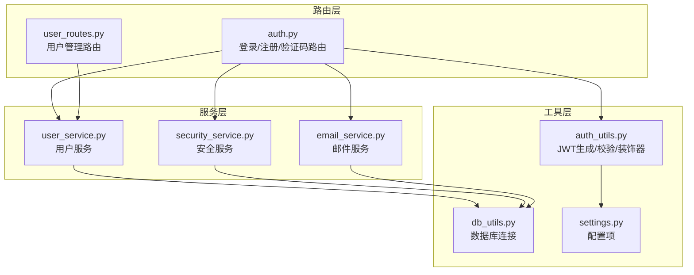
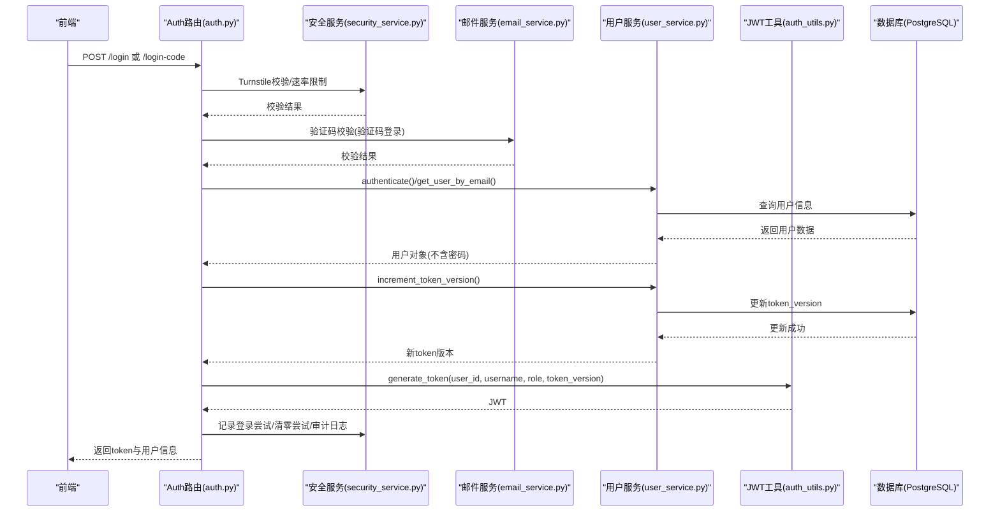
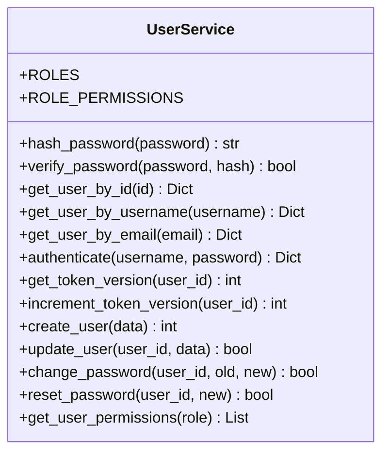
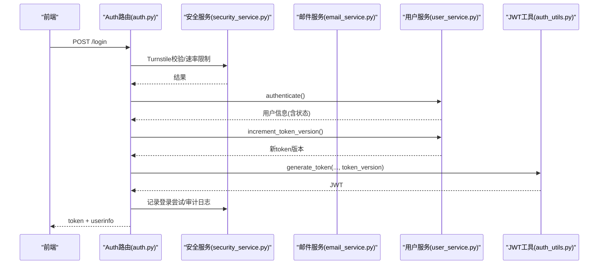
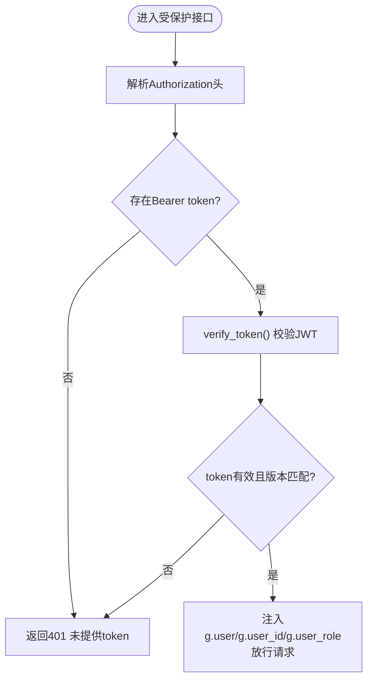
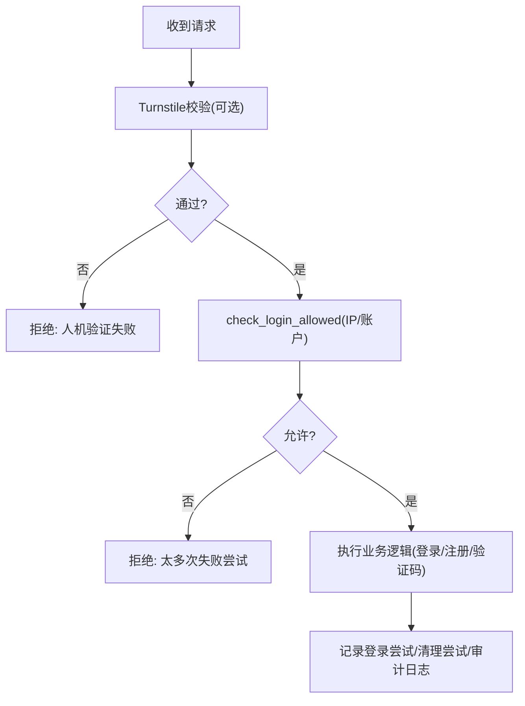
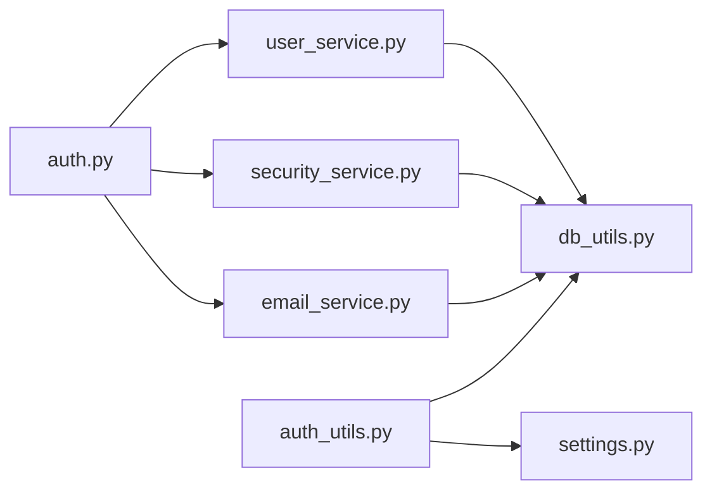

# 用户认证与授权

<cite>
**本文引用的文件列表**
- [user_service.py](file://backend_api_python/app/services/user_service.py)
- [auth.py](file://backend_api_python/app/routes/auth.py)
- [auth_utils.py](file://backend_api_python/app/utils/auth.py)
- [user_routes.py](file://backend_api_python/app/routes/user.py)
- [security_service.py](file://backend_api_python/app/services/security_service.py)
- [email_service.py](file://backend_api_python/app/services/email_service.py)
- [settings.py](file://backend_api_python/app/config/settings.py)
- [db_utils.py](file://backend_api_python/app/utils/db.py)
- [init.sql](file://backend_api_python/migrations/init.sql)
</cite>

## 目录
1. [简介](#简介)
2. [项目结构](#项目结构)
3. [核心组件](#核心组件)
4. [架构总览](#架构总览)
5. [详细组件分析](#详细组件分析)
6. [依赖关系分析](#依赖关系分析)
7. [性能考量](#性能考量)
8. [故障排查指南](#故障排查指南)
9. [结论](#结论)
10. [附录](#附录)

## 简介
本文件面向QuantDinger的用户认证与授权系统，围绕UserService类展开，系统性阐述以下主题：
- 用户注册、登录验证、密码哈希与校验机制
- 基于bcrypt的安全密码存储方案与SHA256回退策略
- 单一客户端登录（踢出其他设备）的实现原理与token版本管理
- 用户状态管理（active/disabled/pending）与最后登录时间更新逻辑
- 用户认证流程的完整示例：用户名/邮箱双重登录、验证码登录、密码重置
- 安全最佳实践与常见认证问题的解决方案

## 项目结构
QuantDinger采用Flask微服务架构，认证相关代码主要分布在以下模块：
- 路由层：处理HTTP请求与响应，负责登录、注册、验证码发送等入口
- 工具层：JWT生成与校验、数据库连接、日志工具
- 服务层：用户服务（密码哈希/校验、用户信息查询/更新）、安全服务（验证码、速率限制、审计日志）、邮件服务（验证码发送）

**图示来源**
- [auth.py:140-278](file://backend_api_python/app/routes/auth.py#L140-L278)
- [user_routes.py:41-68](file://backend_api_python/app/routes/user.py#L41-L68)
- [auth_utils.py:18-157](file://backend_api_python/app/utils/auth.py#L18-L157)
- [user_service.py:56-701](file://backend_api_python/app/services/user_service.py#L56-L701)
- [security_service.py:26-399](file://backend_api_python/app/services/security_service.py#L26-L399)
- [email_service.py:29-362](file://backend_api_python/app/services/email_service.py#L29-L362)
- [db_utils.py:19-66](file://backend_api_python/app/utils/db.py#L19-L66)
- [settings.py:30-42](file://backend_api_python/app/config/settings.py#L30-L42)

**章节来源**
- [auth.py:140-278](file://backend_api_python/app/routes/auth.py#L140-L278)
- [user_routes.py:41-68](file://backend_api_python/app/routes/user.py#L41-L68)
- [auth_utils.py:18-157](file://backend_api_python/app/utils/auth.py#L18-L157)
- [user_service.py:56-701](file://backend_api_python/app/services/user_service.py#L56-L701)
- [security_service.py:26-399](file://backend_api_python/app/services/security_service.py#L26-L399)
- [email_service.py:29-362](file://backend_api_python/app/services/email_service.py#L29-L362)
- [db_utils.py:19-66](file://backend_api_python/app/utils/db.py#L19-L66)
- [settings.py:30-42](file://backend_api_python/app/config/settings.py#L30-L42)

## 核心组件
- UserService：用户管理核心，负责密码哈希/校验、用户查询/创建/更新、角色权限映射、token版本管理、状态与登录时间维护
- Auth路由：提供登录、验证码登录、注册、密码重置等接口，集成安全服务与邮件服务
- Auth工具：JWT生成与校验、token版本验证、权限装饰器
- 安全服务：Turnstile验证、登录尝试记录与阻断、验证码发送速率限制、安全事件审计
- 邮件服务：验证码生成、存储、验证与邮件发送

**章节来源**
- [user_service.py:56-701](file://backend_api_python/app/services/user_service.py#L56-L701)
- [auth.py:140-751](file://backend_api_python/app/routes/auth.py#L140-L751)
- [auth_utils.py:18-157](file://backend_api_python/app/utils/auth.py#L18-L157)
- [security_service.py:26-399](file://backend_api_python/app/services/security_service.py#L26-L399)
- [email_service.py:29-362](file://backend_api_python/app/services/email_service.py#L29-L362)

## 架构总览
认证系统的关键交互如下：
- 登录流程：前端提交用户名/邮箱+密码或验证码；后端调用UserService.authenticate或验证码登录接口；成功后递增token_version并生成JWT；记录登录尝试与安全事件
- 密码存储：优先bcrypt，回退SHA256；校验时根据哈希前缀自动识别算法
- 单一客户端登录：每次登录递增token_version，JWT中携带该版本；校验时对比数据库当前版本，不一致则拒绝
- 安全防护：Turnstile人机验证、登录尝试统计与阻断、验证码速率限制与暴力破解保护

**图示来源**
- [auth.py:140-278](file://backend_api_python/app/routes/auth.py#L140-L278)
- [security_service.py:72-241](file://backend_api_python/app/services/security_service.py#L72-L241)
- [email_service.py:119-213](file://backend_api_python/app/services/email_service.py#L119-L213)
- [user_service.py:194-313](file://backend_api_python/app/services/user_service.py#L194-L313)
- [auth_utils.py:18-80](file://backend_api_python/app/utils/auth.py#L18-L80)

**章节来源**
- [auth.py:140-278](file://backend_api_python/app/routes/auth.py#L140-L278)
- [user_service.py:194-313](file://backend_api_python/app/services/user_service.py#L194-L313)
- [auth_utils.py:18-80](file://backend_api_python/app/utils/auth.py#L18-L80)
- [security_service.py:72-241](file://backend_api_python/app/services/security_service.py#L72-L241)
- [email_service.py:119-213](file://backend_api_python/app/services/email_service.py#L119-L213)

## 详细组件分析

### UserService：用户管理与认证核心
- 密码哈希与校验
  - 优先bcrypt（HAS_BCRYPT），回退SHA256（带盐）
  - 校验时依据哈希前缀自动识别算法
- 用户查询
  - 支持按用户名与邮箱查询，均包含密码哈希（仅内部使用）
  - 认证成功后移除密码哈希字段
- 认证流程
  - 支持用户名/邮箱双重登录
  - 禁用账户不可登录
  - 无密码用户（验证码登录）需特殊处理
  - 成功后更新last_login_at
- 单一客户端登录
  - get_token_version：查询当前token版本
  - increment_token_version：递增token版本，使旧token失效
- 用户状态与登录时间
  - status字段支持active/disabled/pending
  - 登录成功后更新last_login_at
- 用户创建与更新
  - create_user：用户名必填，密码长度≥6（若提供），邮箱唯一性检查
  - update_user：允许更新邮箱、昵称、头像、角色、状态、时区
- 密码变更与重置
  - change_password：要求旧密码校验（无密码用户除外）
  - reset_password：管理员操作，无需旧密码
- 角色与权限
  - ROLES与ROLE_PERMISSIONS定义权限映射
  - get_user_permissions返回角色权限列表

**图示来源**
- [user_service.py:56-701](file://backend_api_python/app/services/user_service.py#L56-L701)

**章节来源**
- [user_service.py:56-701](file://backend_api_python/app/services/user_service.py#L56-L701)

### Auth路由：登录、注册与验证码流程
- 登录
  - 支持用户名/邮箱+密码登录
  - 支持验证码登录（自动创建新用户）
  - 登录成功后递增token_version并生成JWT
  - 记录登录尝试、清理尝试、审计日志
- 注册
  - 邮箱验证码注册，用户名格式与强度校验
  - 注册成功后自动登录（获取token_version）
- 验证码登录
  - 验证码校验通过后登录，未注册则自动创建
  - 支持邀请奖励与注册奖励
- 密码重置
  - 邮箱验证码重置密码，密码强度校验

**图示来源**
- [auth.py:140-278](file://backend_api_python/app/routes/auth.py#L140-L278)
- [user_service.py:194-313](file://backend_api_python/app/services/user_service.py#L194-L313)
- [auth_utils.py:18-80](file://backend_api_python/app/utils/auth.py#L18-L80)
- [security_service.py:72-241](file://backend_api_python/app/services/security_service.py#L72-L241)
- [email_service.py:119-213](file://backend_api_python/app/services/email_service.py#L119-L213)

**章节来源**
- [auth.py:140-751](file://backend_api_python/app/routes/auth.py#L140-L751)

### Auth工具：JWT生成与校验
- generate_token：生成JWT，包含user_id、username、role、token_version
- verify_token：校验JWT有效性，同时验证token_version与数据库一致
- _verify_token_version：从数据库读取当前token_version进行比对
- 权限装饰器：login_required、admin_required、manager_required、permission_required

**图示来源**
- [auth_utils.py:50-157](file://backend_api_python/app/utils/auth.py#L50-L157)

**章节来源**
- [auth_utils.py:18-157](file://backend_api_python/app/utils/auth.py#L18-L157)

### 安全服务：验证码、速率限制与审计
- Turnstile验证：可选的人机验证，失败时拒绝请求
- 登录尝试记录与阻断：按IP与账户维度统计失败次数，超过阈值临时阻断
- 验证码速率限制：同一邮箱短时间内仅允许一次验证码请求，IP每小时上限
- 暴力破解保护：验证码错误计数与锁定时间
- 安全事件审计：登录、注册、密码重置等关键动作记录

**图示来源**
- [security_service.py:72-241](file://backend_api_python/app/services/security_service.py#L72-L241)

**章节来源**
- [security_service.py:26-399](file://backend_api_python/app/services/security_service.py#L26-L399)

### 邮件服务：验证码生成与发送
- 验证码生成：固定长度数字验证码，可配置过期时间与尝试上限
- 存储与校验：数据库存储验证码，校验时检查过期、尝试次数、锁定状态
- 发送：SMTP发送HTML邮件，支持TLS/SSL

**章节来源**
- [email_service.py:29-362](file://backend_api_python/app/services/email_service.py#L29-L362)

## 依赖关系分析
- 数据库模式：用户表包含token_version、status、last_login_at等字段，支撑单一客户端登录与状态管理
- 组件耦合：
  - Auth路由依赖UserService、SecurityService、EmailService
  - UserService依赖数据库工具与日志
  - Auth工具依赖配置与数据库工具
- 外部依赖：bcrypt（可选）、Cloudflare Turnstile、SMTP

**图示来源**
- [auth.py:140-278](file://backend_api_python/app/routes/auth.py#L140-L278)
- [user_service.py:56-701](file://backend_api_python/app/services/user_service.py#L56-L701)
- [auth_utils.py:18-157](file://backend_api_python/app/utils/auth.py#L18-L157)
- [security_service.py:26-399](file://backend_api_python/app/services/security_service.py#L26-L399)
- [email_service.py:29-362](file://backend_api_python/app/services/email_service.py#L29-L362)
- [db_utils.py:19-66](file://backend_api_python/app/utils/db.py#L19-L66)
- [settings.py:30-42](file://backend_api_python/app/config/settings.py#L30-L42)

**章节来源**
- [init.sql:8-31](file://backend_api_python/migrations/init.sql#L8-L31)
- [auth.py:140-278](file://backend_api_python/app/routes/auth.py#L140-L278)
- [user_service.py:56-701](file://backend_api_python/app/services/user_service.py#L56-L701)
- [auth_utils.py:18-157](file://backend_api_python/app/utils/auth.py#L18-L157)
- [security_service.py:26-399](file://backend_api_python/app/services/security_service.py#L26-L399)
- [email_service.py:29-362](file://backend_api_python/app/services/email_service.py#L29-L362)
- [db_utils.py:19-66](file://backend_api_python/app/utils/db.py#L19-L66)
- [settings.py:30-42](file://backend_api_python/app/config/settings.py#L30-L42)

## 性能考量
- bcrypt成本较高，建议在生产环境启用bcrypt；若回退至SHA256，注意其安全性较低
- token版本递增与JWT校验均为O(1)数据库操作，开销较小
- 登录尝试与验证码记录使用索引字段，查询效率高
- 建议对频繁登录场景启用Turnstile与速率限制，降低暴力破解风险

## 故障排查指南
- 登录失败
  - 检查用户名/邮箱是否存在、状态是否为active
  - 若用户为验证码登录，密码登录会被拒绝
  - 查看安全服务的登录尝试记录与阻断状态
- 密码错误
  - 确认密码强度符合要求（bcrypt回退时仍需满足最小长度）
  - 检查哈希算法识别是否正确（bcrypt前缀或sha256$）
- 验证码问题
  - 确认邮箱配置正确，SMTP可用
  - 检查验证码是否过期、尝试次数是否超限
- 单一客户端登录
  - 若提示token无效，确认是否在其他设备登录导致token版本被递增
  - 检查JWT中token_version与数据库当前版本是否一致

**章节来源**
- [user_service.py:194-246](file://backend_api_python/app/services/user_service.py#L194-L246)
- [auth.py:172-216](file://backend_api_python/app/routes/auth.py#L172-L216)
- [security_service.py:115-241](file://backend_api_python/app/services/security_service.py#L115-L241)
- [email_service.py:119-213](file://backend_api_python/app/services/email_service.py#L119-L213)
- [auth_utils.py:50-114](file://backend_api_python/app/utils/auth.py#L50-L114)

## 结论
QuantDinger的用户认证与授权系统以UserService为核心，结合JWT、bcrypt/SHA256、验证码与安全服务，实现了：
- 双重登录入口（用户名/邮箱）
- 安全的密码存储与校验
- 单一客户端登录（踢出其他设备）
- 完整的用户状态与审计能力
- 面向生产的速率限制与暴力破解防护

建议在生产环境中：
- 明确启用bcrypt，确保密码安全
- 启用Turnstile与严格的速率限制
- 定期清理过期验证码与登录尝试记录
- 对敏感操作（密码重置、注册）严格校验输入与速率

## 附录

### 用户认证流程示例

- 用户名/邮箱双重登录
  - 请求体包含username或account与password
  - 服务端先按用户名查找，再按邮箱查找
  - 校验状态为active，bcrypt/SHA256校验密码
  - 成功后更新last_login_at并返回用户信息

- 验证码登录
  - 请求体包含email与code
  - 验证码服务校验code与类型
  - 若用户不存在且允许注册，则自动创建用户（无密码）
  - 登录成功后递增token_version并返回token

- 密码重置
  - 请求体包含email、code、new_password
  - 验证码校验通过后更新用户密码
  - 密码强度校验通过

**章节来源**
- [auth.py:140-751](file://backend_api_python/app/routes/auth.py#L140-L751)
- [user_service.py:194-246](file://backend_api_python/app/services/user_service.py#L194-L246)
- [email_service.py:277-350](file://backend_api_python/app/services/email_service.py#L277-L350)

### 安全最佳实践
- 使用bcrypt作为首选密码哈希算法
- 为所有认证接口启用Turnstile
- 为登录、注册、密码重置等接口设置速率限制
- 对验证码设置过期时间与尝试上限
- 审计所有关键安全事件
- 定期清理过期数据

**章节来源**
- [security_service.py:72-399](file://backend_api_python/app/services/security_service.py#L72-L399)
- [email_service.py:119-213](file://backend_api_python/app/services/email_service.py#L119-L213)
- [auth.py:172-216](file://backend_api_python/app/routes/auth.py#L172-L216)