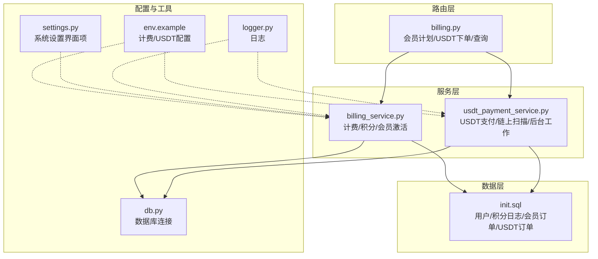
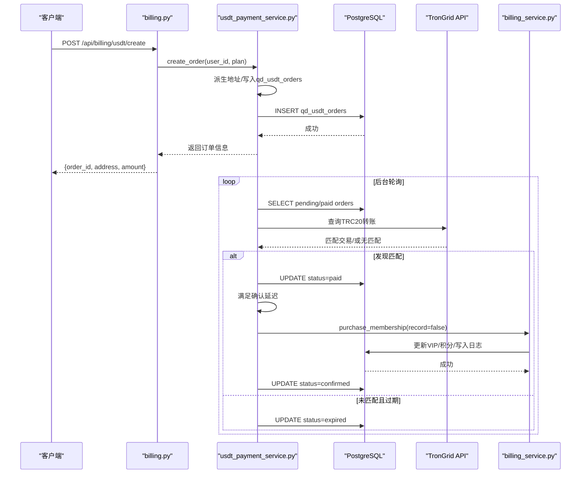
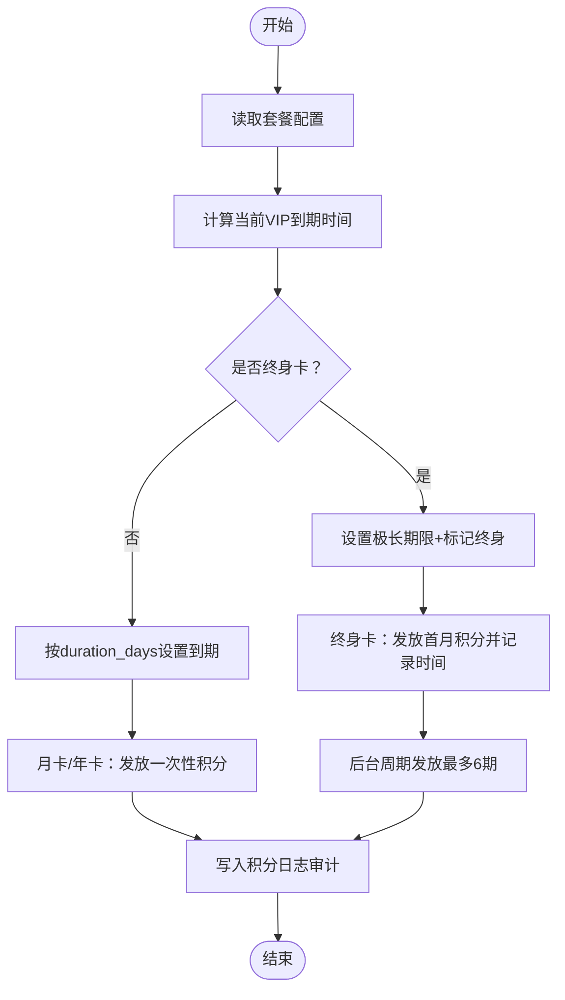
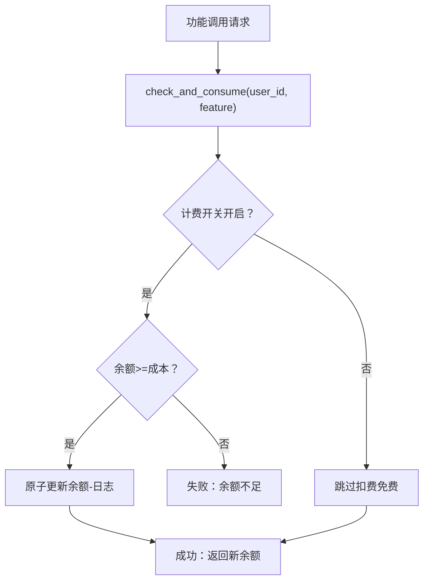
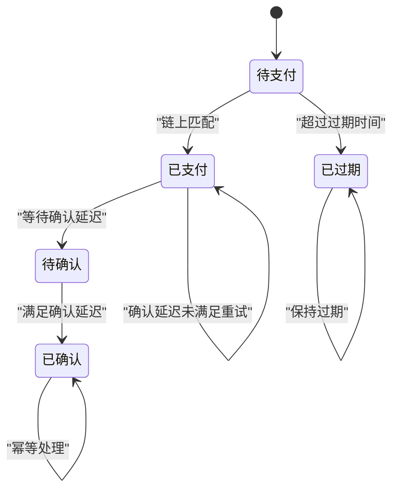
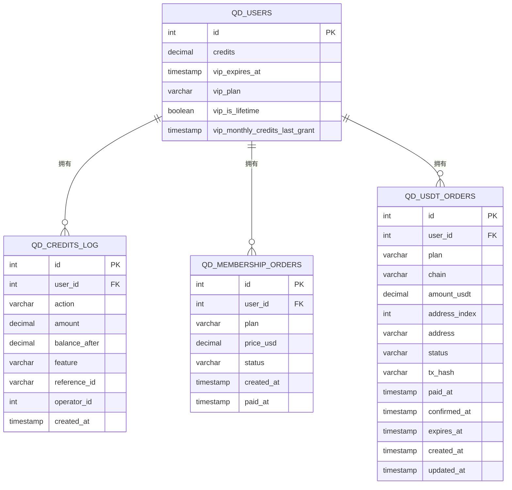
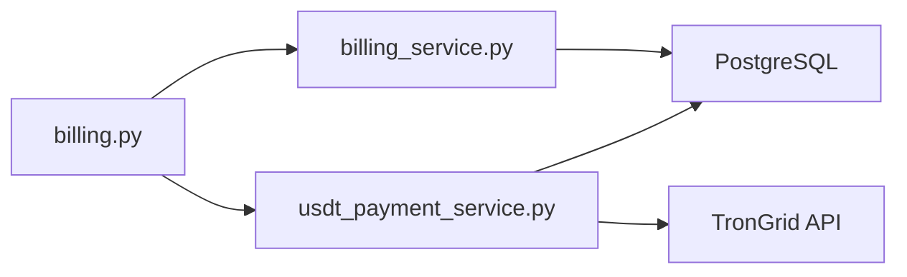

# 计费与会员系统

<cite>
**本文档引用的文件**
- [billing.py](file://backend_api_python/app/routes/billing.py)
- [billing_service.py](file://backend_api_python/app/services/billing_service.py)
- [usdt_payment_service.py](file://backend_api_python/app/services/usdt_payment_service.py)
- [init.sql](file://backend_api_python/migrations/init.sql)
- [env.example](file://backend_api_python/env.example)
- [settings.py](file://backend_api_python/app/routes/settings.py)
- [db.py](file://backend_api_python/app/utils/db.py)
- [logger.py](file://backend_api_python/app/utils/logger.py)
</cite>

## 目录
1. [简介](#简介)
2. [项目结构](#项目结构)
3. [核心组件](#核心组件)
4. [架构总览](#架构总览)
5. [详细组件分析](#详细组件分析)
6. [依赖关系分析](#依赖关系分析)
7. [性能考量](#性能考量)
8. [故障排查指南](#故障排查指南)
9. [结论](#结论)
10. [附录](#附录)

## 简介
本文件面向QuantDinger计费与会员系统，围绕以下目标进行系统化说明：
- 会员计划管理：月卡、年卡、终身卡三档套餐，价格与权益配置。
- 订阅状态跟踪：基于用户表的VIP到期时间与套餐标识，支持叠加续期。
- 计费周期处理：月卡/年卡到期与终身会员周期性积分发放。
- 积分系统：获取、消耗、余额管理与审计日志。
- USDT TRC20支付：每单独立地址派生、链上扫描、自动对账与激活。
- 支付状态监控、异常处理与退款机制（现状与建议）。
- 会员升级/降级/续费/取消订阅流程。
- 计费数据存储结构、历史记录与报表生成思路。
- 支付安全、防重复支付与欺诈检测建议。

## 项目结构
后端采用Flask蓝图路由 + 服务层封装 + 数据库迁移脚本的分层设计：
- 路由层：billing.py提供会员计划查询、传统购买接口（已禁用）、USDT下单与查询。
- 服务层：
  - billing_service.py：计费配置、积分管理、会员激活与日志。
  - usdt_payment_service.py：USDT TRC20支付流水、地址派生、链上扫描、状态刷新与后台工作线程。
- 数据层：init.sql定义用户、积分日志、会员订单与USDT订单表结构。
- 配置层：env.example提供计费与USDT支付的关键环境变量；settings.py提供系统设置界面项。
- 工具层：db.py提供PostgreSQL连接工具；logger.py提供统一日志输出。

**图示来源**
- [billing.py:1-95](file://backend_api_python/app/routes/billing.py#L1-L95)
- [billing_service.py:1-758](file://backend_api_python/app/services/billing_service.py#L1-L758)
- [usdt_payment_service.py:1-830](file://backend_api_python/app/services/usdt_payment_service.py#L1-L830)
- [init.sql:1-1026](file://backend_api_python/migrations/init.sql#L1-L1026)
- [env.example:153-182](file://backend_api_python/env.example#L153-L182)
- [settings.py:740-887](file://backend_api_python/app/routes/settings.py#L740-L887)
- [db.py:1-66](file://backend_api_python/app/utils/db.py#L1-L66)
- [logger.py:1-63](file://backend_api_python/app/utils/logger.py#L1-L63)

**章节来源**
- [billing.py:1-95](file://backend_api_python/app/routes/billing.py#L1-L95)
- [billing_service.py:1-758](file://backend_api_python/app/services/billing_service.py#L1-L758)
- [usdt_payment_service.py:1-830](file://backend_api_python/app/services/usdt_payment_service.py#L1-L830)
- [init.sql:1-1026](file://backend_api_python/migrations/init.sql#L1-L1026)
- [env.example:153-182](file://backend_api_python/env.example#L153-L182)
- [settings.py:740-887](file://backend_api_python/app/routes/settings.py#L740-L887)
- [db.py:1-66](file://backend_api_python/app/utils/db.py#L1-L66)
- [logger.py:1-63](file://backend_api_python/app/utils/logger.py#L1-L63)

## 核心组件
- 计费配置与积分管理
  - 通过环境变量加载计费开关与功能单价，支持缓存与热更新。
  - 提供积分余额查询、消费、充值、设置与日志查询。
- 会员计划与状态
  - 三档套餐：月卡、年卡、终身卡；月卡/年卡支持叠加续期；终身卡按30天周期发放月度积分。
- USDT TRC20支付
  - 每单派生独立地址，TronGrid扫描链上转账，满足确认延迟后自动激活会员。
  - 后台工作线程定期批量刷新待处理订单，避免长事务占用连接池。
- 数据存储
  - 用户表含积分与VIP状态字段；积分日志记录所有收支；会员订单与USDT订单分别承载不同支付路径。

**章节来源**
- [billing_service.py:55-80](file://backend_api_python/app/services/billing_service.py#L55-L80)
- [billing_service.py:160-200](file://backend_api_python/app/services/billing_service.py#L160-L200)
- [billing_service.py:461-577](file://backend_api_python/app/services/billing_service.py#L461-L577)
- [usdt_payment_service.py:132-187](file://backend_api_python/app/services/usdt_payment_service.py#L132-L187)
- [usdt_payment_service.py:543-605](file://backend_api_python/app/services/usdt_payment_service.py#L543-L605)
- [init.sql:8-31](file://backend_api_python/migrations/init.sql#L8-L31)
- [init.sql:42-57](file://backend_api_python/migrations/init.sql#L42-L57)
- [init.sql:63-71](file://backend_api_python/migrations/init.sql#L63-L71)
- [init.sql:79-99](file://backend_api_python/migrations/init.sql#L79-L99)

## 架构总览
下图展示了从用户请求到链上确认再到会员激活的全链路：

**图示来源**
- [billing.py:55-94](file://backend_api_python/app/routes/billing.py#L55-L94)
- [usdt_payment_service.py:132-187](file://backend_api_python/app/services/usdt_payment_service.py#L132-L187)
- [usdt_payment_service.py:543-605](file://backend_api_python/app/services/usdt_payment_service.py#L543-L605)
- [usdt_payment_service.py:609-750](file://backend_api_python/app/services/usdt_payment_service.py#L609-L750)
- [billing_service.py:202-345](file://backend_api_python/app/services/billing_service.py#L202-L345)

## 详细组件分析

### 会员计划与状态管理
- 三档套餐参数来源于环境变量，支持通过系统设置界面动态调整。
- 月卡/年卡：以当前VIP到期时间作为基点进行叠加续期。
- 终身卡：首次激活授予首月积分并记录最近发放时间；后台按30天周期补发，最多补6期，防止滥用。
- VIP状态查询：返回是否有效及到期时间，支持前端展示。

**图示来源**
- [billing_service.py:160-200](file://backend_api_python/app/services/billing_service.py#L160-L200)
- [billing_service.py:202-345](file://backend_api_python/app/services/billing_service.py#L202-L345)
- [billing_service.py:397-459](file://backend_api_python/app/services/billing_service.py#L397-L459)

**章节来源**
- [billing_service.py:160-200](file://backend_api_python/app/services/billing_service.py#L160-L200)
- [billing_service.py:202-345](file://backend_api_python/app/services/billing_service.py#L202-L345)
- [billing_service.py:397-459](file://backend_api_python/app/services/billing_service.py#L397-L459)
- [settings.py:756-798](file://backend_api_python/app/routes/settings.py#L756-L798)

### 积分系统
- 获取：注册奖励、推荐奖励、会员首月/周期发放、后台补发。
- 消耗：功能调用前检查余额，不足则拒绝；成功后记录日志。
- 余额管理：原子更新用户积分与日志，支持管理员调整与退款（需扩展）。
- 日志：包含动作、数量、余额、功能、参考ID、备注与时间。

**图示来源**
- [billing_service.py:461-526](file://backend_api_python/app/services/billing_service.py#L461-L526)
- [billing_service.py:527-577](file://backend_api_python/app/services/billing_service.py#L527-L577)
- [billing_service.py:675-727](file://backend_api_python/app/services/billing_service.py#L675-L727)

**章节来源**
- [billing_service.py:461-526](file://backend_api_python/app/services/billing_service.py#L461-L526)
- [billing_service.py:527-577](file://backend_api_python/app/services/billing_service.py#L527-L577)
- [billing_service.py:675-727](file://backend_api_python/app/services/billing_service.py#L675-L727)
- [init.sql:42-57](file://backend_api_python/migrations/init.sql#L42-L57)

### USDT TRC20支付集成
- 地址派生：基于watch-only xpub按索引派生每单地址，保证可追溯与安全。
- 订单创建：写入qd_usdt_orders，包含计划、链、金额、地址、过期时间与初始状态。
- 链上扫描：TronGrid按合约与地址检索转账，匹配最小块时间戳与精度（6位小数）。
- 状态机：
  - pending → paid（发现链上转账）→ confirmed（满足确认延迟）。
  - pending → expired（超时未支付）。
- 自动激活：转入paid即写入paid_at，满足确认延迟后调用会员激活，幂等处理。
- 后台工作：批量扫描pending/paid订单，短读txn释放连接，HTTP外部调用，短写txn更新。

**图示来源**
- [usdt_payment_service.py:282-376](file://backend_api_python/app/services/usdt_payment_service.py#L282-L376)
- [usdt_payment_service.py:396-424](file://backend_api_python/app/services/usdt_payment_service.py#L396-L424)
- [usdt_payment_service.py:543-605](file://backend_api_python/app/services/usdt_payment_service.py#L543-L605)
- [usdt_payment_service.py:609-750](file://backend_api_python/app/services/usdt_payment_service.py#L609-L750)

**章节来源**
- [usdt_payment_service.py:132-187](file://backend_api_python/app/services/usdt_payment_service.py#L132-L187)
- [usdt_payment_service.py:282-376](file://backend_api_python/app/services/usdt_payment_service.py#L282-L376)
- [usdt_payment_service.py:396-424](file://backend_api_python/app/services/usdt_payment_service.py#L396-L424)
- [usdt_payment_service.py:543-605](file://backend_api_python/app/services/usdt_payment_service.py#L543-L605)
- [usdt_payment_service.py:609-750](file://backend_api_python/app/services/usdt_payment_service.py#L609-L750)
- [init.sql:79-99](file://backend_api_python/migrations/init.sql#L79-L99)

### 支付状态监控与异常处理
- 监控要点：
  - TronGrid HTTP错误与解析异常记录到日志，便于定位。
  - 订单状态变更统计与日志输出，便于观察批处理效果。
  - 仅在短事务内更新状态，避免长时间持有连接。
- 异常处理：
  - 链上查询失败不中断整体流程，记录警告并继续。
  - 幂等更新：确认前重读状态，避免重复激活。
  - 后台线程捕获异常并继续循环，确保持续对账。

**章节来源**
- [usdt_payment_service.py:314-360](file://backend_api_python/app/services/usdt_payment_service.py#L314-L360)
- [usdt_payment_service.py:646-696](file://backend_api_python/app/services/usdt_payment_service.py#L646-L696)
- [logger.py:29-33](file://backend_api_python/app/utils/logger.py#L29-L33)

### 退款机制现状与建议
- 现状：未实现自动退款流程；USDT订单表未包含“退款”状态字段。
- 建议：
  - 新增退款状态与退款时间字段，支持管理员发起退款并回滚积分与VIP状态。
  - 与链上交易核对一致后再执行退款，必要时引入白名单与风控策略。
  - 记录退款日志与审计轨迹，确保可追溯。

[本节为通用建议，不直接分析具体文件]

### 会员升级/降级/续费/取消订阅流程
- 升级/续费：月卡/年卡购买后以当前VIP到期时间为基点叠加，延长有效时间。
- 终身卡：按30天周期自动发放月度积分，最多补6期。
- 降级/取消：当前未提供直接API；可通过设置VIP到期时间为过去时间或清零积分的方式模拟（需管理员权限与审计）。

**章节来源**
- [billing_service.py:202-345](file://backend_api_python/app/services/billing_service.py#L202-L345)
- [billing_service.py:397-459](file://backend_api_python/app/services/billing_service.py#L397-L459)

### 计费数据存储结构与历史记录
- 用户表：积分余额、VIP到期时间、套餐标识、终身卡最近发放时间等。
- 积分日志：记录收支、余额、功能、参考ID、操作人与时间。
- 会员订单：传统购买路径（已禁用）。
- USDT订单：每单独立地址、状态、链上哈希、支付与确认时间、过期时间。

**图示来源**
- [init.sql:8-31](file://backend_api_python/migrations/init.sql#L8-L31)
- [init.sql:42-57](file://backend_api_python/migrations/init.sql#L42-L57)
- [init.sql:63-71](file://backend_api_python/migrations/init.sql#L63-L71)
- [init.sql:79-99](file://backend_api_python/migrations/init.sql#L79-L99)

**章节来源**
- [init.sql:8-31](file://backend_api_python/migrations/init.sql#L8-L31)
- [init.sql:42-57](file://backend_api_python/migrations/init.sql#L42-L57)
- [init.sql:63-71](file://backend_api_python/migrations/init.sql#L63-L71)
- [init.sql:79-99](file://backend_api_python/migrations/init.sql#L79-L99)

### 报表生成与历史记录管理
- 积分日志：支持分页查询，按时间倒序，包含总数与页信息，便于前端展示。
- 建议报表维度：
  - 用户维度：积分收支明细、VIP状态变化、USDT订单统计。
  - 时间维度：每日/每周新增用户、付费订单数、收入与退款统计。
  - 订单维度：按计划类型、状态分布、过期率与确认率。

**章节来源**
- [billing_service.py:675-727](file://backend_api_python/app/services/billing_service.py#L675-L727)

## 依赖关系分析
- 组件耦合
  - billing.py依赖billing_service与usdt_payment_service。
  - billing_service依赖数据库连接与日志。
  - usdt_payment_service依赖TronGrid API、数据库与billing_service。
- 外部依赖
  - TronGrid API：TRC20转账扫描。
  - PostgreSQL：用户、积分、订单数据持久化。
- 潜在风险
  - 长事务阻塞：通过短读短写与后台线程缓解。
  - 链上API限流：通过API Key与分页限制降低影响。

**图示来源**
- [billing.py:1-95](file://backend_api_python/app/routes/billing.py#L1-L95)
- [billing_service.py:1-758](file://backend_api_python/app/services/billing_service.py#L1-L758)
- [usdt_payment_service.py:1-830](file://backend_api_python/app/services/usdt_payment_service.py#L1-L830)

**章节来源**
- [billing.py:1-95](file://backend_api_python/app/routes/billing.py#L1-L95)
- [billing_service.py:1-758](file://backend_api_python/app/services/billing_service.py#L1-L758)
- [usdt_payment_service.py:1-830](file://backend_api_python/app/services/usdt_payment_service.py#L1-L830)

## 性能考量
- 连接池与事务
  - 短读txn释放连接，HTTP调用在txn外进行，避免“idle in transaction”与vacuum压力。
  - 批量扫描限制每批数量，降低锁竞争。
- 缓存与配置
  - 计费配置缓存60秒，减少频繁读取环境变量。
- 日志与可观测性
  - USDT对账日志级别提升，便于排查pending/TronGrid问题。

[本节为通用指导，不直接分析具体文件]

## 故障排查指南
- USDT支付未到账
  - 检查订单状态与过期时间；确认TronGrid返回的匹配条件与指纹参数。
  - 查看日志中的“no_match”与“trongrid_http”等提示。
- 未触发确认
  - 检查确认延迟配置与paid_at时间差；确认后台工作线程运行正常。
- 余额异常
  - 核对积分日志中的收支与余额；检查管理员调整与活动发放记录。
- 订单重复
  - 确认订单唯一索引与幂等更新逻辑；避免并发重复写入。

**章节来源**
- [usdt_payment_service.py:314-360](file://backend_api_python/app/services/usdt_payment_service.py#L314-L360)
- [usdt_payment_service.py:646-696](file://backend_api_python/app/services/usdt_payment_service.py#L646-L696)
- [logger.py:29-33](file://backend_api_python/app/utils/logger.py#L29-L33)

## 结论
QuantDinger计费与会员系统以“环境变量驱动配置 + PostgreSQL持久化 + TronGrid链上对账”的方式实现了稳定可靠的USDT TRC20支付闭环。积分系统与会员状态管理清晰，后台工作线程保障了异步对账与幂等激活。建议后续完善退款流程与风控策略，以进一步提升安全性与用户体验。

[本节为总结，不直接分析具体文件]

## 附录
- 关键环境变量（计费与USDT）
  - 计费开关与功能单价、注册/推荐积分奖励。
  - 会员套餐价格与积分奖励、确认延迟与过期时间。
  - TronGrid基础URL与API Key、TRC20合约地址、XPUB与派生索引。
- 系统设置界面项
  - 计费开关、套餐价格与积分奖励、USDT支付开关与参数。

**章节来源**
- [env.example:153-182](file://backend_api_python/env.example#L153-L182)
- [settings.py:742-887](file://backend_api_python/app/routes/settings.py#L742-L887)