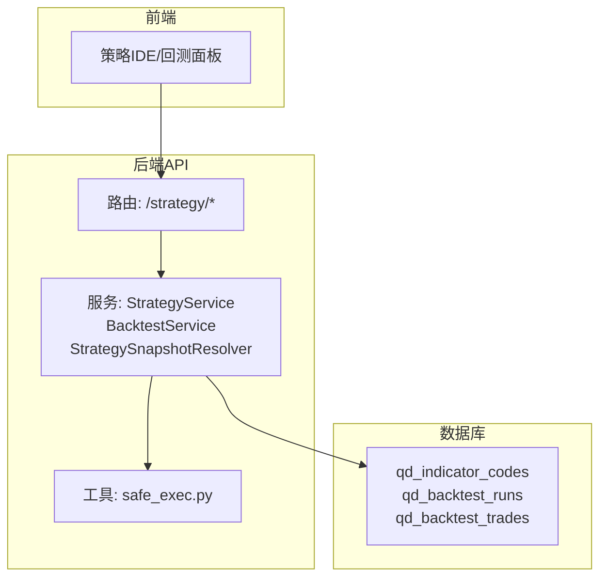
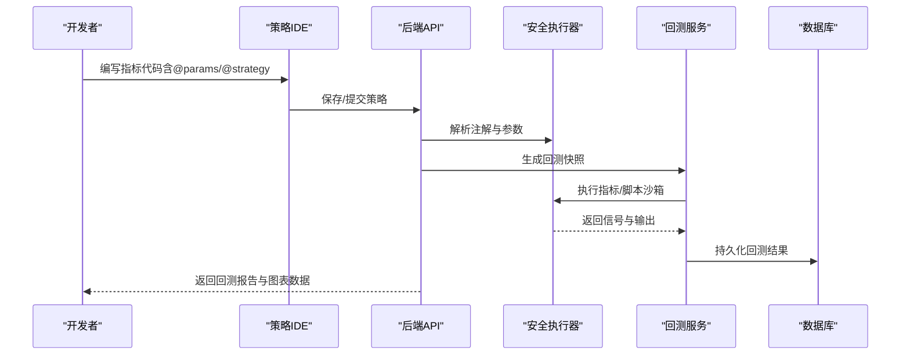
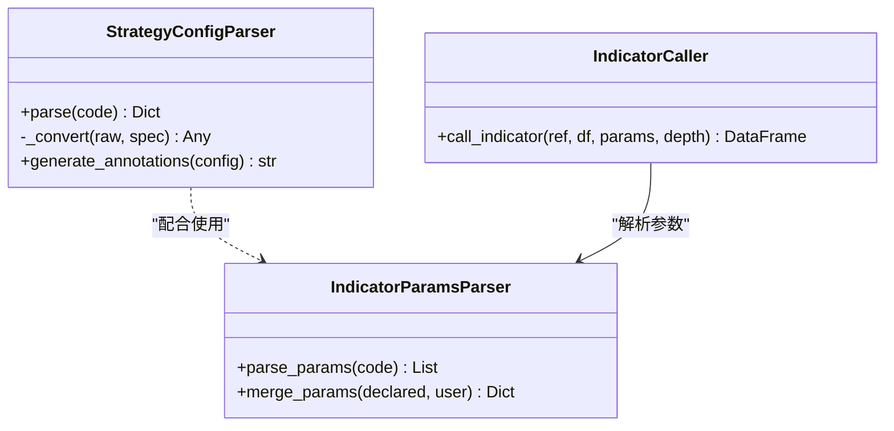
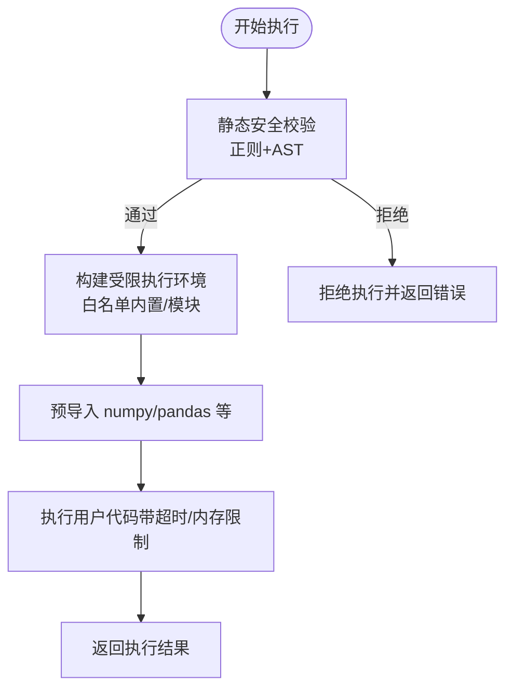
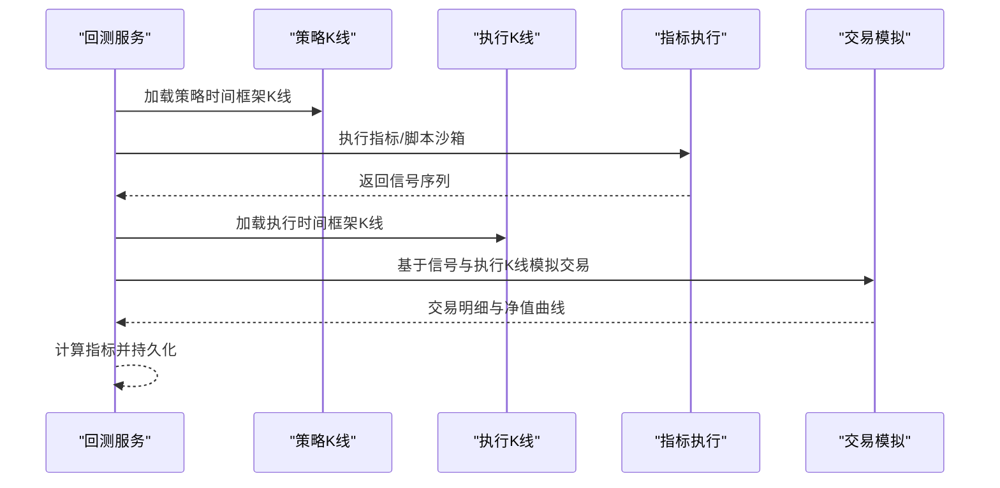
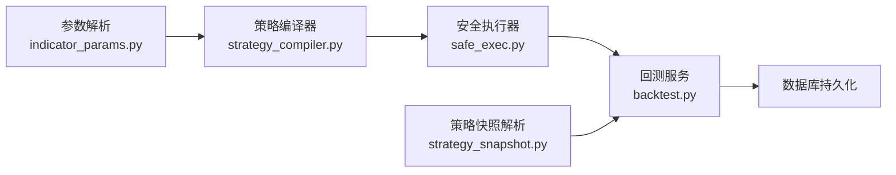

# IndicatorStrategy开发

<cite>
**本文引用的文件**
- [STRATEGY_DEV_GUIDE_CN.md](file://docs/STRATEGY_DEV_GUIDE_CN.md)
- [dual_ma_with_params.py](file://docs/examples/dual_ma_with_params.py)
- [multi_indicator_composite.py](file://docs/examples/multi_indicator_composite.py)
- [cross_sectional_momentum_rsi.py](file://docs/examples/cross_sectional_momentum_rsi.py)
- [builtin_indicators.py](file://backend_api_python/app/services/builtin_indicators.py)
- [indicator_params.py](file://backend_api_python/app/services/indicator_params.py)
- [strategy_compiler.py](file://backend_api_python/app/services/strategy_compiler.py)
- [strategy.py](file://backend_api_python/app/routes/strategy.py)
- [strategy_snapshot.py](file://backend_api_python/app/services/strategy_snapshot.py)
- [backtest.py](file://backend_api_python/app/services/backtest.py)
- [safe_exec.py](file://backend_api_python/app/utils/safe_exec.py)
</cite>

## 目录
1. [简介](#简介)
2. [项目结构](#项目结构)
3. [核心组件](#核心组件)
4. [架构总览](#架构总览)
5. [详细组件分析](#详细组件分析)
6. [依赖分析](#依赖分析)
7. [性能考量](#性能考量)
8. [故障排查指南](#故障排查指南)
9. [结论](#结论)
10. [附录](#附录)

## 简介
本指南面向策略开发者，系统讲解基于数据框的 IndicatorStrategy 策略开发方法，覆盖元数据声明、默认参数设置、指标计算、信号生成与图表输出。文档强调三层次架构：指标层、信号层、风险默认层的设计原则与实现方法，并提供从元数据声明到数据复制、指标计算、布尔信号生成、最终输出对象构建的完整开发流程。同时，给出固定止损止盈设置、指标驱动退出策略与位置管理的最佳实践，并通过多个实际代码示例（参数化策略、复合指标策略等）帮助快速落地。

## 项目结构
本项目围绕“策略开发与回测”提供完整链路：前端通过 API 创建/管理策略，后端解析策略配置与代码，安全执行指标/脚本，回测服务执行多时间框架回测，最终产出回测结果与图表数据。

**图表来源**
- [strategy.py:1-200](file://backend_api_python/app/routes/strategy.py#L1-L200)
- [backtest.py:1-200](file://backend_api_python/app/services/backtest.py#L1-L200)
- [strategy_snapshot.py:1-220](file://backend_api_python/app/services/strategy_snapshot.py#L1-L220)

**章节来源**
- [strategy.py:1-200](file://backend_api_python/app/routes/strategy.py#L1-L200)
- [backtest.py:1-200](file://backend_api_python/app/services/backtest.py#L1-L200)
- [strategy_snapshot.py:1-220](file://backend_api_python/app/services/strategy_snapshot.py#L1-L220)

## 核心组件
- 策略参数解析与注解支持：通过注解解析器识别 `# @param` 与 `# @strategy`，并生成策略配置与参数清单。
- 指标调用器：支持在指标代码中调用其他指标，实现模块化与复用。
- 策略编译器：将配置转化为可执行的 Python 代码，包含参数、指标计算、信号逻辑与核心循环。
- 回测服务：加载数据、执行指标/脚本、模拟交易、计算指标并持久化结果。
- 安全执行：严格的白名单内置函数、模块导入限制与超时机制，保障沙箱执行安全。
- 策略快照解析：将存储的策略信息解析为回测所需的快照，统一风控、仓位、执行配置。

**章节来源**
- [indicator_params.py:1-380](file://backend_api_python/app/services/indicator_params.py#L1-L380)
- [strategy_compiler.py:1-689](file://backend_api_python/app/services/strategy_compiler.py#L1-L689)
- [backtest.py:1-800](file://backend_api_python/app/services/backtest.py#L1-L800)
- [safe_exec.py:1-471](file://backend_api_python/app/utils/safe_exec.py#L1-L471)
- [strategy_snapshot.py:1-220](file://backend_api_python/app/services/strategy_snapshot.py#L1-L220)

## 架构总览
IndicatorStrategy 的开发与回测链路如下：

**图表来源**
- [indicator_params.py:1-380](file://backend_api_python/app/services/indicator_params.py#L1-L380)
- [safe_exec.py:1-471](file://backend_api_python/app/utils/safe_exec.py#L1-L471)
- [backtest.py:1-800](file://backend_api_python/app/services/backtest.py#L1-L800)
- [strategy_snapshot.py:1-220](file://backend_api_python/app/services/strategy_snapshot.py#L1-L220)

## 详细组件分析

### 1) 三层次架构与开发流程
- 指标层：计算各类技术指标序列（如 EMA、RSI、MACD、布林带等），确保与 DataFrame 长度一致。
- 信号层：生成布尔型 buy/sell 信号，建议采用“边缘触发”避免重复发信号。
- 风险默认层：通过 `# @strategy` 声明默认止损、止盈、跟踪止损与交易方向等，不在此层写入额外数据列。

开发流程（从元数据到输出）：
- 元数据与默认配置：定义名称、描述、参数与默认策略配置。
- 数据复制与指标计算：复制 DataFrame，按需计算指标。
- 信号生成：将原始条件整理为边缘触发的布尔信号。
- 图表输出：组装 plots 与 signals，形成 output 对象。
- 回测验证：确认成交语义与回测一致性。

**章节来源**
- [STRATEGY_DEV_GUIDE_CN.md:1-800](file://docs/STRATEGY_DEV_GUIDE_CN.md#L1-L800)

### 2) 元数据与默认参数声明
- `# @param`：声明可调参数，支持 int/float/bool/str 类型，便于前端与 AI 调参。
- `# @strategy`：声明默认风控与仓位配置，如止损、止盈、跟踪止损、交易方向等。
- 杠杆与产品配置分离：杠杆不应写入指标脚本，应由产品配置层管理。

示例参考：
- 文档同步版双均线策略：展示 `# @param` 与 `# @strategy` 的标准写法。
- 文档同步版多指标组合策略：演示参数化与组合信号的稳定写法。

**章节来源**
- [dual_ma_with_params.py:1-64](file://docs/examples/dual_ma_with_params.py#L1-L64)
- [multi_indicator_composite.py:1-109](file://docs/examples/multi_indicator_composite.py#L1-L109)
- [STRATEGY_DEV_GUIDE_CN.md:1-800](file://docs/STRATEGY_DEV_GUIDE_CN.md#L1-L800)

### 3) 指标计算与信号生成
- 指标计算：在复制后的 DataFrame 上计算指标列，避免直接修改原数据。
- 信号生成：先生成原始布尔条件，再通过边缘触发逻辑去重，保证信号稳定性。
- 图表输出：将指标序列与买卖标记点打包为 plots 与 signals，供回测面板渲染。

策略编译器示例（生成可执行代码）：
- 参数区：初始仓位、杠杆、金字塔规则与风控参数。
- 指标区：根据规则生成指标计算代码（如 SuperTrend、EMA、RSI、MACD、布林带、KDJ、MA 等）。
- 信号区：根据指标与操作符生成 buy/sell 条件。
- 核心循环：基于信号与风控参数进行开平仓与金字塔加仓逻辑。
- 输出区：生成 plots 与 signals。

**章节来源**
- [strategy_compiler.py:1-689](file://backend_api_python/app/services/strategy_compiler.py#L1-L689)

### 4) 固定止损止盈与指标驱动退出
- 固定止损止盈：通过 `# @strategy` 声明，由引擎按固定规则处理，适合策略逻辑相对独立、不需要运行时状态的场景。
- 指标驱动退出：将退出条件直接写入 sell 信号，适合“突破止损线即离场”等明确的策略思想。
- 位置管理边界：IndicatorStrategy 适合简单仓位管理（默认开仓比例、交易方向），复杂加减仓、动态止损等应迁移到 ScriptStrategy。

最佳实践：
- 明确“主退出来源”，避免信号与引擎双重退出导致逻辑混乱。
- 在注释或描述中说明退出来源，便于他人理解。

**章节来源**
- [STRATEGY_DEV_GUIDE_CN.md:298-363](file://docs/STRATEGY_DEV_GUIDE_CN.md#L298-L363)

### 5) 策略参数解析与调用
- 参数解析：从指标代码中提取 `# @param` 与 `# @strategy`，并进行类型转换与范围校验。
- 指标调用：支持在指标代码中调用其他指标，实现模块化与复用，具备调用深度限制与循环依赖检测。

**图表来源**
- [indicator_params.py:26-380](file://backend_api_python/app/services/indicator_params.py#L26-L380)

**章节来源**
- [indicator_params.py:1-380](file://backend_api_python/app/services/indicator_params.py#L1-L380)

### 6) 安全执行与沙箱
- 白名单内置函数与模块导入限制，禁止危险操作（如 os、sys、subprocess、eval、exec 等）。
- 超时与内存限制，跨平台注入超时异常，保障执行稳定性。
- 支持子进程隔离执行，进一步提升安全性。

**图表来源**
- [safe_exec.py:1-471](file://backend_api_python/app/utils/safe_exec.py#L1-L471)

**章节来源**
- [safe_exec.py:1-471](file://backend_api_python/app/utils/safe_exec.py#L1-L471)

### 7) 回测服务与多时间框架
- 回测服务负责加载数据、执行指标/脚本、模拟交易、计算指标并持久化结果。
- 支持多时间框架（MTF）回测：策略时间框架用于信号生成，执行时间框架（1m/5m）用于精确成交模拟。
- 执行精度信息与回退策略：当不支持 MTF 或信号时机不兼容时，自动回退到标准回测。

**图表来源**
- [backtest.py:444-668](file://backend_api_python/app/services/backtest.py#L444-L668)

**章节来源**
- [backtest.py:1-800](file://backend_api_python/app/services/backtest.py#L1-L800)

### 8) 策略快照解析与回测配置
- 将存储的策略信息解析为回测快照，统一风控、仓位、执行配置。
- 支持覆盖配置（如 symbol、timeframe、leverage、commission、slippage 等）。
- 将策略类型（IndicatorStrategy/ScriptStrategy）与运行类型（strategy_indicator/strategy_script）规范化。

**章节来源**
- [strategy_snapshot.py:1-220](file://backend_api_python/app/services/strategy_snapshot.py#L1-L220)

### 9) 内置示例与模板
- 内置示例指标：包含 RSI 边缘触发、双均线金叉死叉、MACD 柱穿零轴、布林带触及等，可直接用于学习与二次开发。
- 示例文档：提供参数化策略与复合指标策略的完整示例，便于对照与迁移。

**章节来源**
- [builtin_indicators.py:1-250](file://backend_api_python/app/services/builtin_indicators.py#L1-L250)
- [dual_ma_with_params.py:1-64](file://docs/examples/dual_ma_with_params.py#L1-L64)
- [multi_indicator_composite.py:1-109](file://docs/examples/multi_indicator_composite.py#L1-L109)
- [cross_sectional_momentum_rsi.py:1-71](file://docs/examples/cross_sectional_momentum_rsi.py#L1-L71)

## 依赖分析
- 策略参数解析依赖注解正则与类型转换，确保参数与策略配置的合法性。
- 策略编译器依赖策略配置与规则，生成可执行代码，包含参数、指标、信号与核心循环。
- 回测服务依赖数据源与安全执行器，执行指标/脚本并模拟交易。
- 安全执行器提供沙箱环境，限制内置函数与模块导入，保障执行安全。
- 策略快照解析将存储的策略信息统一为回测所需配置，屏蔽策略类型差异。

**图表来源**
- [indicator_params.py:1-380](file://backend_api_python/app/services/indicator_params.py#L1-L380)
- [strategy_compiler.py:1-689](file://backend_api_python/app/services/strategy_compiler.py#L1-L689)
- [safe_exec.py:1-471](file://backend_api_python/app/utils/safe_exec.py#L1-L471)
- [backtest.py:1-800](file://backend_api_python/app/services/backtest.py#L1-L800)
- [strategy_snapshot.py:1-220](file://backend_api_python/app/services/strategy_snapshot.py#L1-L220)

**章节来源**
- [indicator_params.py:1-380](file://backend_api_python/app/services/indicator_params.py#L1-L380)
- [strategy_compiler.py:1-689](file://backend_api_python/app/services/strategy_compiler.py#L1-L689)
- [safe_exec.py:1-471](file://backend_api_python/app/utils/safe_exec.py#L1-L471)
- [backtest.py:1-800](file://backend_api_python/app/services/backtest.py#L1-L800)
- [strategy_snapshot.py:1-220](file://backend_api_python/app/services/strategy_snapshot.py#L1-L220)

## 性能考量
- 多时间框架回测：在支持范围内优先使用 MTF（1m/5m）以提高成交模拟精度，但需考虑信号时机与规模规则的兼容性。
- 数据缓存：回测服务内置 K 线缓存，减少重复拉取外部数据的开销。
- 指标计算：优先使用向量化操作（pandas/numpy），避免显式循环；必要时进行指标去重与边缘触发，降低信号噪声。
- 执行超时与内存限制：安全执行器提供超时与内存限制，防止长时间或大内存占用任务拖垮系统。

[本节为通用指导，无需特定文件引用]

## 故障排查指南
- 代码安全校验失败：检查是否使用了危险内置函数或模块导入，确保仅使用白名单内的模块与函数。
- 注解解析异常：确认 `# @param` 与 `# @strategy` 的格式正确，类型与默认值符合预期。
- 回测范围限制：根据时间框架限制选择合适的回测日期范围，避免超出最大天数限制。
- 多时间框架回退：当 MTF 不支持或信号时机不兼容时，回测服务会自动回退到标准回测，检查回退原因与精度信息。

**章节来源**
- [safe_exec.py:358-471](file://backend_api_python/app/utils/safe_exec.py#L358-L471)
- [indicator_params.py:26-117](file://backend_api_python/app/services/indicator_params.py#L26-L117)
- [backtest.py:444-668](file://backend_api_python/app/services/backtest.py#L444-L668)

## 结论
IndicatorStrategy 为策略开发提供了清晰的三层次架构与稳健的回测链路。通过规范的元数据声明、参数化与默认风控配置、稳健的信号生成与图表输出，开发者可以在平台上高效验证策略思想并进行参数优化。对于需要复杂仓位管理与动态风控的场景，可逐步迁移到 ScriptStrategy。借助内置示例与策略编译器，开发者能够快速构建可复用、可扩展的策略模块。

[本节为总结，无需特定文件引用]

## 附录
- 参考示例：
  - 双均线策略（参数化与默认风控）：[dual_ma_with_params.py:1-64](file://docs/examples/dual_ma_with_params.py#L1-L64)
  - 多指标组合策略（参数化与组合信号）：[multi_indicator_composite.py:1-109](file://docs/examples/multi_indicator_composite.py#L1-L109)
  - 截面策略指标示例（研究参考）：[cross_sectional_momentum_rsi.py:1-71](file://docs/examples/cross_sectional_momentum_rsi.py#L1-L71)
- 内置示例指标：[builtin_indicators.py:1-250](file://backend_api_python/app/services/builtin_indicators.py#L1-L250)
- 策略开发指南：[STRATEGY_DEV_GUIDE_CN.md:1-1270](file://docs/STRATEGY_DEV_GUIDE_CN.md#L1-L1270)

[本节为附录，无需特定文件引用]