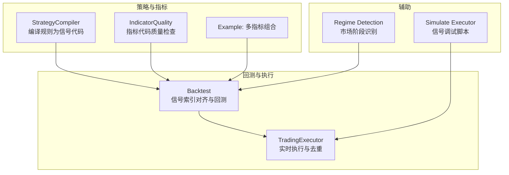
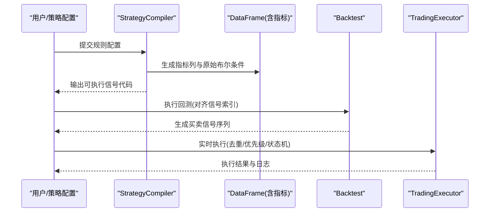
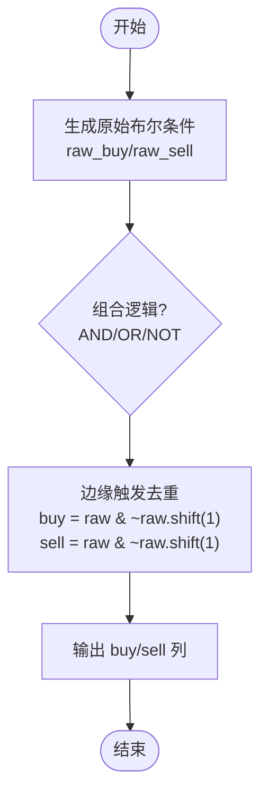
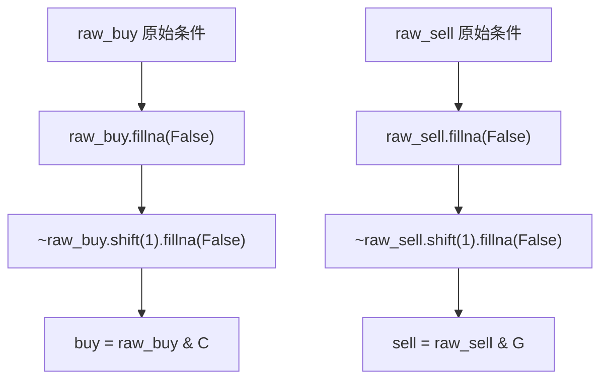
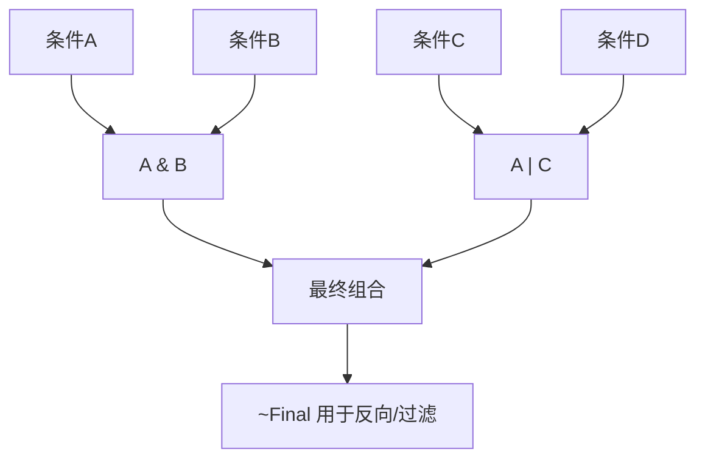
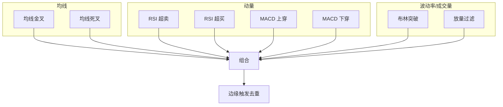
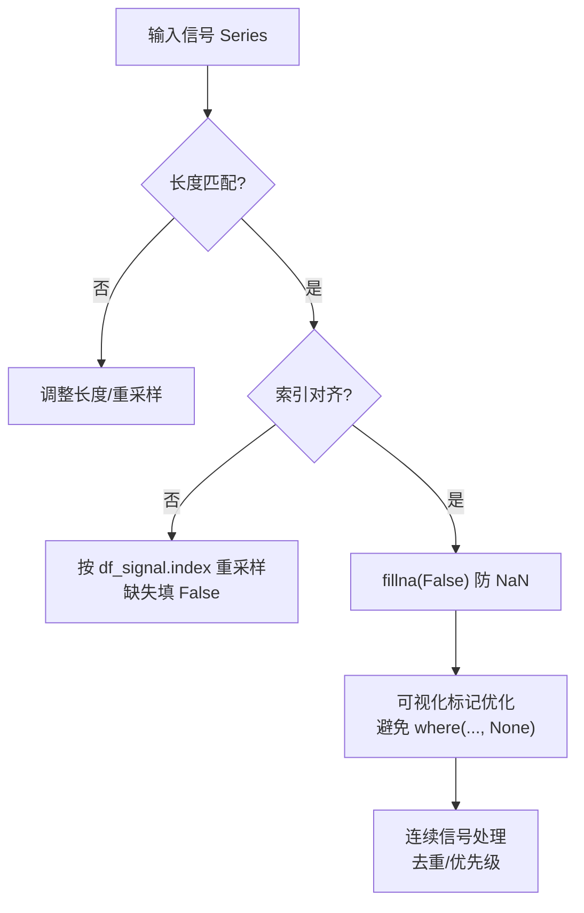
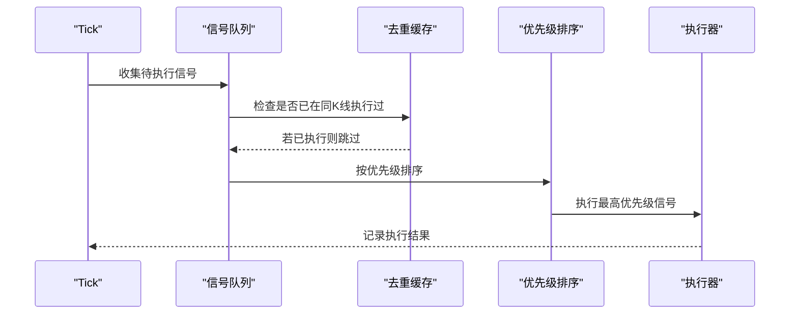
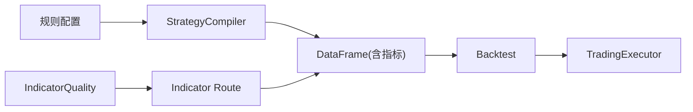

# 信号生成和布尔逻辑

<cite>
**本文引用的文件**
- [strategy_compiler.py](file://backend_api_python/app/services/strategy_compiler.py)
- [multi_indicator_composite.py](file://docs/examples/multi_indicator_composite.py)
- [indicator_code_quality.py](file://backend_api_python/app/services/indicator_code_quality.py)
- [indicator.py](file://backend_api_python/app/routes/indicator.py)
- [backtest.py](file://backend_api_python/app/services/backtest.py)
- [trading_executor.py](file://backend_api_python/app/services/trading_executor.py)
- [regime.py](file://backend_api_python/app/services/experiment/regime.py)
- [simulate_trading_executor.py](file://backend_api_python/scripts/simulate_trading_executor.py)
</cite>

## 目录
1. [引言](#引言)
2. [项目结构](#项目结构)
3. [核心组件](#核心组件)
4. [架构总览](#架构总览)
5. [详细组件分析](#详细组件分析)
6. [依赖分析](#依赖分析)
7. [性能考虑](#性能考虑)
8. [故障排查指南](#故障排查指南)
9. [结论](#结论)
10. [附录](#附录)

## 引言
本指南聚焦于 IndicatorStrategy 的信号生成机制，系统讲解布尔信号的创建与管理、边缘触发信号的实现、信号逻辑组合（AND/OR/NOT）、常见信号模式（交叉背离、突破确认、均值回归），以及信号质量保障（长度匹配、填充策略、连续信号处理）。同时提供调试技巧与常见陷阱的规避方法，帮助开发者构建稳定可靠的信号生成器。

## 项目结构
围绕信号生成与执行的关键模块如下：
- 策略编译器：将规则配置转换为可执行的信号生成与回测代码
- 指标质量检查：对用户指标代码进行静态质量分析
- 回测引擎：标准化信号索引、对齐信号与K线、执行交易
- 实时交易执行：去重、优先级、状态机与订单执行
- 示例与脚本：演示多指标组合与信号调试

**图表来源**
- [strategy_compiler.py:1-689](file://backend_api_python/app/services/strategy_compiler.py#L1-L689)
- [indicator_code_quality.py:1-206](file://backend_api_python/app/services/indicator_code_quality.py#L1-L206)
- [multi_indicator_composite.py:1-109](file://docs/examples/multi_indicator_composite.py#L1-L109)
- [backtest.py:755-933](file://backend_api_python/app/services/backtest.py#L755-L933)
- [trading_executor.py:218-1381](file://backend_api_python/app/services/trading_executor.py#L218-L1381)
- [regime.py:24-57](file://backend_api_python/app/services/experiment/regime.py#L24-L57)
- [simulate_trading_executor.py:191-200](file://backend_api_python/scripts/simulate_trading_executor.py#L191-L200)

**章节来源**
- [strategy_compiler.py:1-689](file://backend_api_python/app/services/strategy_compiler.py#L1-L689)
- [indicator_code_quality.py:1-206](file://backend_api_python/app/services/indicator_code_quality.py#L1-L206)
- [multi_indicator_composite.py:1-109](file://docs/examples/multi_indicator_composite.py#L1-L109)
- [backtest.py:755-933](file://backend_api_python/app/services/backtest.py#L755-L933)
- [trading_executor.py:218-1381](file://backend_api_python/app/services/trading_executor.py#L218-L1381)
- [regime.py:24-57](file://backend_api_python/app/services/experiment/regime.py#L24-L57)
- [simulate_trading_executor.py:191-200](file://backend_api_python/scripts/simulate_trading_executor.py#L191-L200)

## 核心组件
- 策略编译器：负责将规则配置转换为信号生成代码，内置多种指标（如 EMA、RSI、MACD、布林带、KDJ、均线）的布尔条件与边缘触发逻辑
- 指标质量检查：对用户指标代码进行静态分析，提示缺失 buy/sell 列、输出字典、参数读取等问题
- 回测引擎：确保信号与K线索引一致，按时间窗口对齐并执行交易
- 实时交易执行：防止同一K线重复下单、信号优先级排序、状态机驱动的执行批次
- 示例与脚本：展示如何用 AND/OR/NOT 组合多个条件，以及如何调试信号

**章节来源**
- [strategy_compiler.py:224-376](file://backend_api_python/app/services/strategy_compiler.py#L224-L376)
- [indicator_code_quality.py:79-205](file://backend_api_python/app/services/indicator_code_quality.py#L79-L205)
- [backtest.py:755-933](file://backend_api_python/app/services/backtest.py#L755-L933)
- [trading_executor.py:218-1381](file://backend_api_python/app/services/trading_executor.py#L218-L1381)
- [multi_indicator_composite.py:67-90](file://docs/examples/multi_indicator_composite.py#L67-L90)
- [simulate_trading_executor.py:191-200](file://backend_api_python/scripts/simulate_trading_executor.py#L191-L200)

## 架构总览
信号生成与执行的端到端流程如下：

**图表来源**
- [strategy_compiler.py:224-376](file://backend_api_python/app/services/strategy_compiler.py#L224-L376)
- [backtest.py:755-933](file://backend_api_python/app/services/backtest.py#L755-L933)
- [trading_executor.py:218-1381](file://backend_api_python/app/services/trading_executor.py#L218-L1381)

## 详细组件分析

### 布尔信号生成与管理（buy/sell 列）
- 原始布尔列：编译器在生成的代码中默认创建 raw_buy/raw_sell 布尔列，作为基础条件集合
- 边缘触发信号：最终输出 buy/sell 列通常基于“当前为真且前一时刻为假”的逻辑，确保只在转折点产生信号
- 示例路径：多指标组合示例展示了如何将多个条件用 OR/AND 组合后，再通过 shift 去重形成稳定的边缘触发信号

**图表来源**
- [strategy_compiler.py:224-376](file://backend_api_python/app/services/strategy_compiler.py#L224-L376)
- [multi_indicator_composite.py:67-90](file://docs/examples/multi_indicator_composite.py#L67-L90)

**章节来源**
- [strategy_compiler.py:224-376](file://backend_api_python/app/services/strategy_compiler.py#L224-L376)
- [multi_indicator_composite.py:67-90](file://docs/examples/multi_indicator_composite.py#L67-L90)

### 边缘触发信号与 shift 操作
- 边缘触发的核心思想：使用 shift(1) 捕捉从 False 到 True 或从 True 到 False 的转折
- 正确使用 shift 的要点：
  - 在比较中同时使用当前值与前值，确保只在转折点产生信号
  - 注意空值填充（fillna）后再进行布尔与非运算，避免 NaN 导致的信号污染
- 实战参考：多指标组合示例中，通过 fillna(False) 与按位非运算实现稳定的 buy/sell 边缘触发

**图表来源**
- [multi_indicator_composite.py:87-90](file://docs/examples/multi_indicator_composite.py#L87-L90)

**章节来源**
- [multi_indicator_composite.py:87-90](file://docs/examples/multi_indicator_composite.py#L87-L90)

### 信号逻辑组合（AND、OR、NOT）
- AND：将多个条件用 & 连接，提高信号稳定性
- OR：用 | 组合多个独立信号源，扩大机会
- NOT：用 ~ 对布尔列取反，常用于反向信号或过滤
- 实战参考：多指标组合示例展示了如何将金叉/死叉、RSI 超卖/超买、MACD 方向与成交量过滤用 AND/OR 组合，再经边缘触发形成最终 buy/sell

**图表来源**
- [multi_indicator_composite.py:76-89](file://docs/examples/multi_indicator_composite.py#L76-L89)

**章节来源**
- [multi_indicator_composite.py:76-89](file://docs/examples/multi_indicator_composite.py#L76-L89)

### 常见信号模式与实现思路
- 均线交叉（金叉/死叉）：使用短周期与长周期均线的交叉条件，结合 shift 实现边缘触发
- RSI 超买/超卖反转：在超卖区反弹做多、超买区回落做空，可叠加成交量过滤
- MACD 金叉/死叉：使用柱状图与信号线的关系，配合趋势方向过滤
- 布林带突破/回归：价格突破上下轨或回到中轨附近，结合成交量确认
- 示例参考：多指标组合示例展示了如何将均线、RSI、MACD、成交量过滤组合为稳定的边缘触发信号

**图表来源**
- [multi_indicator_composite.py:47-89](file://docs/examples/multi_indicator_composite.py#L47-L89)

**章节来源**
- [multi_indicator_composite.py:47-89](file://docs/examples/multi_indicator_composite.py#L47-L89)

### 信号质量与长度匹配、填充策略、连续信号处理
- 长度匹配：输出信号列表长度必须等于 DataFrame 行数，否则验证失败
- 索引对齐：回测阶段会对 buy/sell 或 open_long/close_long/open_short/close_short 的索引进行校验与重采样，缺失位置填充 False
- 填充策略：使用 fillna(False) 防止 NaN 影响布尔运算；在可视化标记中避免 where(..., None).tolist()，推荐显式 None 列表
- 连续信号处理：在实时执行中，同一 K 线内通过去重机制避免重复下单；在 bot 模式下允许多次状态转移，indicator 模式每轮最多一次执行

**图表来源**
- [backtest.py:755-863](file://backend_api_python/app/services/backtest.py#L755-L863)
- [indicator.py:247-267](file://backend_api_python/app/routes/indicator.py#L247-L267)
- [indicator_code_quality.py:117-124](file://backend_api_python/app/services/indicator_code_quality.py#L117-L124)
- [trading_executor.py:239-281](file://backend_api_python/app/services/trading_executor.py#L239-L281)

**章节来源**
- [backtest.py:755-863](file://backend_api_python/app/services/backtest.py#L755-L863)
- [indicator.py:247-267](file://backend_api_python/app/routes/indicator.py#L247-L267)
- [indicator_code_quality.py:117-124](file://backend_api_python/app/services/indicator_code_quality.py#L117-L124)
- [trading_executor.py:239-281](file://backend_api_python/app/services/trading_executor.py#L239-L281)

### 实时执行中的信号去重与优先级
- 去重策略：基于 (strategy_id, symbol, signal_type, signal_timestamp) 的键，结合 TTL 控制同一 K 线内的重复执行
- 优先级：close_ > reduce_ > open_ > add_，保证先平仓再开仓/加仓
- 批次执行：indicator 模式每轮最多一条信号，bot 模式可跨级别多次状态转移

**图表来源**
- [trading_executor.py:218-281](file://backend_api_python/app/services/trading_executor.py#L218-L281)
- [trading_executor.py:1356-1381](file://backend_api_python/app/services/trading_executor.py#L1356-L1381)

**章节来源**
- [trading_executor.py:218-281](file://backend_api_python/app/services/trading_executor.py#L218-L281)
- [trading_executor.py:1356-1381](file://backend_api_python/app/services/trading_executor.py#L1356-L1381)

### 信号调试技巧与常见陷阱
- 调试技巧
  - 使用模拟执行脚本生成测试 K 线，统计 buy/sell 数量，逐步缩小模式范围
  - 在回测阶段打印信号队列数量与索引信息，定位索引不匹配问题
  - 在实时执行阶段启用去重日志，观察同一 K 线重复信号被抑制的情况
- 常见陷阱
  - 忽略 df = df.copy() 导致原数据被修改
  - 缺少 output 字典或 buy/sell 列，导致验证失败
  - where(..., None).tolist() 导致渲染异常
  - 未读取声明的参数，导致参数未生效
  - 未设置止损/止盈或百分比过低，影响策略表现

**章节来源**
- [simulate_trading_executor.py:191-200](file://backend_api_python/scripts/simulate_trading_executor.py#L191-L200)
- [backtest.py:877-933](file://backend_api_python/app/services/backtest.py#L877-L933)
- [indicator_code_quality.py:79-205](file://backend_api_python/app/services/indicator_code_quality.py#L79-L205)
- [indicator.py:317-361](file://backend_api_python/app/routes/indicator.py#L317-L361)

## 依赖分析
- StrategyCompiler 依赖于规则配置，生成包含指标计算与信号逻辑的完整代码
- Backtest 依赖于 DataFrame 索引与信号列，确保长度与索引一致
- TradingExecutor 依赖于回测/策略运行时产生的信号，结合去重与优先级控制执行
- IndicatorQuality 与 Indicator 路由共同保障用户指标代码的质量与合规性

**图表来源**
- [strategy_compiler.py:1-689](file://backend_api_python/app/services/strategy_compiler.py#L1-L689)
- [backtest.py:755-933](file://backend_api_python/app/services/backtest.py#L755-L933)
- [trading_executor.py:218-1381](file://backend_api_python/app/services/trading_executor.py#L218-L1381)
- [indicator_code_quality.py:1-206](file://backend_api_python/app/services/indicator_code_quality.py#L1-L206)
- [indicator.py:317-516](file://backend_api_python/app/routes/indicator.py#L317-L516)

**章节来源**
- [strategy_compiler.py:1-689](file://backend_api_python/app/services/strategy_compiler.py#L1-L689)
- [backtest.py:755-933](file://backend_api_python/app/services/backtest.py#L755-L933)
- [trading_executor.py:218-1381](file://backend_api_python/app/services/trading_executor.py#L218-L1381)
- [indicator_code_quality.py:1-206](file://backend_api_python/app/services/indicator_code_quality.py#L1-L206)
- [indicator.py:317-516](file://backend_api_python/app/routes/indicator.py#L317-L516)

## 性能考虑
- 信号生成尽量使用向量化运算（pandas/numpy），避免循环
- 合理使用 shift 操作，注意空值填充与布尔运算的顺序
- 在回测阶段对索引与长度进行一次性校验与重采样，减少后续查找成本
- 实时执行中通过去重与优先级排序，减少无效订单与重复处理

[本节为通用指导，无需具体文件分析]

## 故障排查指南
- 信号长度不匹配：检查输出信号列表长度与 DataFrame 行数是否一致
- 索引不一致：回测日志会提示索引不匹配，需按 df_signal.index 重采样并填充 False
- 缺失 buy/sell：确保生成了 df['buy'] 与 df['sell'] 列，或提供四象限信号
- 可视化异常：避免 where(..., None).tolist()，改用显式 None 列表
- 重复下单：检查去重缓存与 TTL 设置，确认同一 K 线内信号是否被正确抑制
- 参数未生效：确认已通过 params.get(...) 读取声明的参数

**章节来源**
- [indicator.py:247-267](file://backend_api_python/app/routes/indicator.py#L247-L267)
- [backtest.py:755-863](file://backend_api_python/app/services/backtest.py#L755-L863)
- [indicator_code_quality.py:79-205](file://backend_api_python/app/services/indicator_code_quality.py#L79-L205)
- [trading_executor.py:239-281](file://backend_api_python/app/services/trading_executor.py#L239-L281)

## 结论
通过策略编译器、指标质量检查、回测与实时执行的协同，可以构建高质量的布尔信号生成体系。关键在于：正确的边缘触发（shift 与去重）、稳健的逻辑组合（AND/OR/NOT）、严格的信号质量保障（长度匹配、索引对齐、填充策略），以及完善的调试与去重机制。遵循本文建议，可显著提升策略的稳定性与可维护性。

[本节为总结，无需具体文件分析]

## 附录
- 示例参考：多指标组合策略展示了如何将均线、RSI、MACD、成交量过滤组合为稳定的边缘触发信号
- 调试脚本：通过模拟执行脚本生成测试 K 线并统计信号数量，快速定位模式

**章节来源**
- [multi_indicator_composite.py:1-109](file://docs/examples/multi_indicator_composite.py#L1-L109)
- [simulate_trading_executor.py:191-200](file://backend_api_python/scripts/simulate_trading_executor.py#L191-L200)