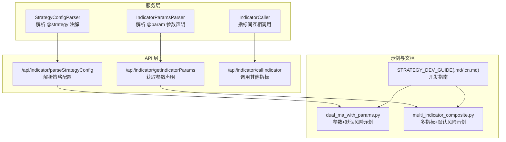
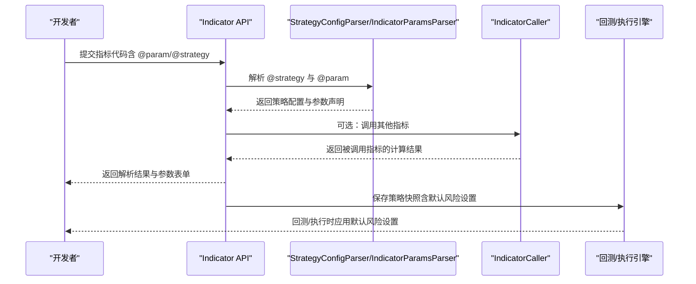
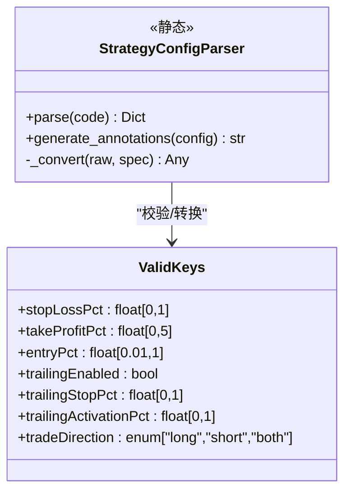
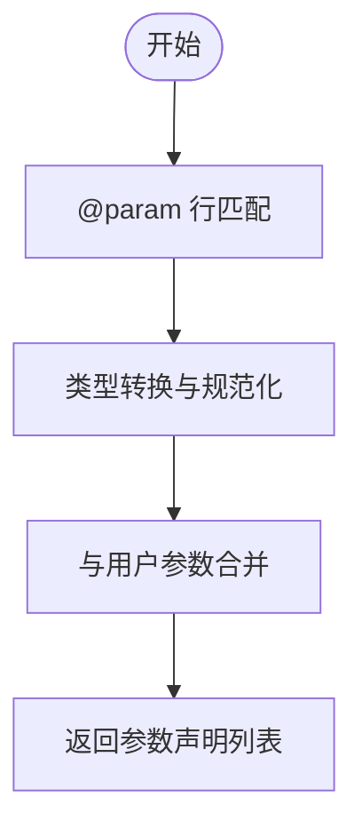
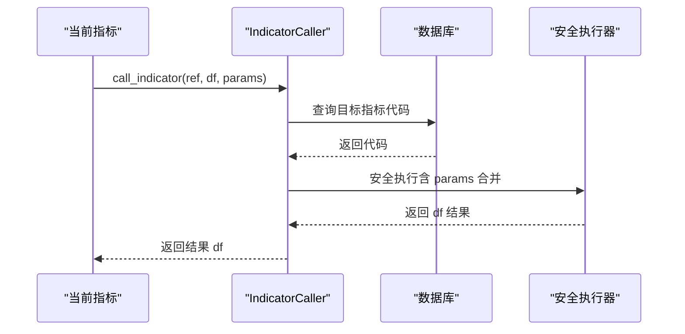
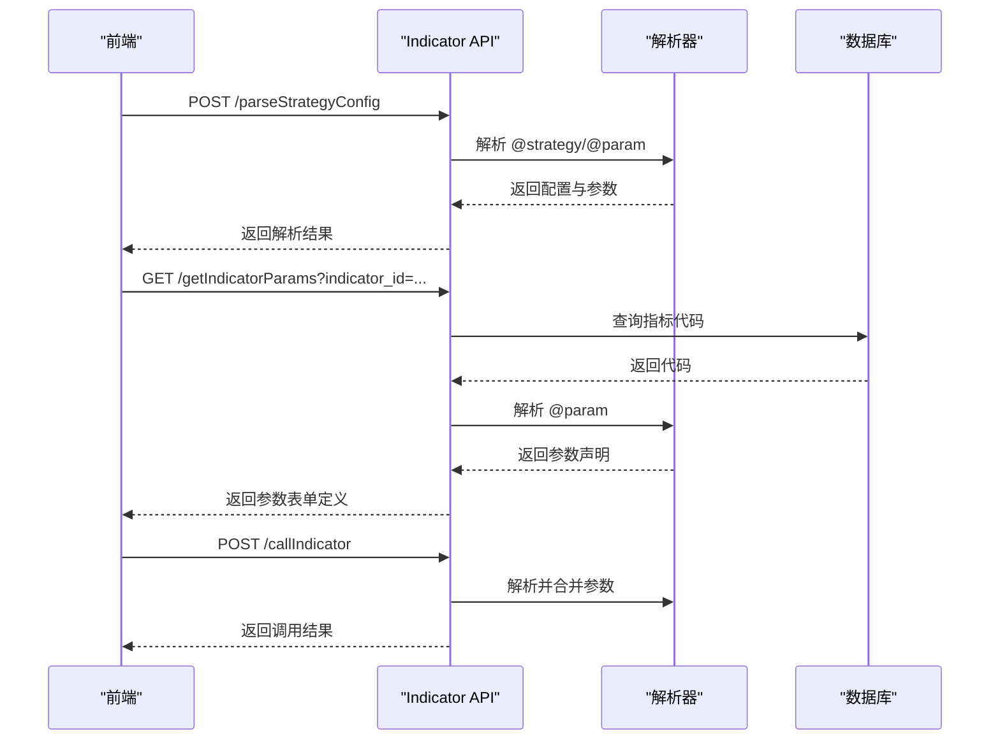
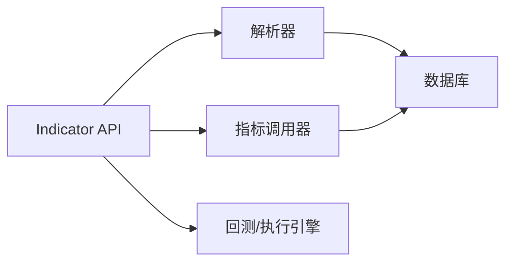

# 元数据和默认参数配置

<cite>
**本文引用的文件**
- [backend_api_python/app/services/indicator_params.py](file://backend_api_python/app/services/indicator_params.py)
- [backend_api_python/app/routes/indicator.py](file://backend_api_python/app/routes/indicator.py)
- [docs/examples/dual_ma_with_params.py](file://docs/examples/dual_ma_with_params.py)
- [docs/examples/multi_indicator_composite.py](file://docs/examples/multi_indicator_composite.py)
- [docs/STRATEGY_DEV_GUIDE.md](file://docs/STRATEGY_DEV_GUIDE.md)
- [docs/STRATEGY_DEV_GUIDE_CN.md](file://docs/STRATEGY_DEV_GUIDE_CN.md)
</cite>

## 目录
1. [简介](#简介)
2. [项目结构](#项目结构)
3. [核心组件](#核心组件)
4. [架构总览](#架构总览)
5. [详细组件分析](#详细组件分析)
6. [依赖分析](#依赖分析)
7. [性能考虑](#性能考虑)
8. [故障排查指南](#故障排查指南)
9. [结论](#结论)
10. [附录](#附录)

## 简介
本指南聚焦于 IndicatorStrategy 的元数据与默认参数配置，系统讲解策略元数据声明的重要性、参数与默认风险设置的配置方法、注释语法与最佳实践，并提供完整示例与常见错误规避建议。通过本文，您将掌握如何在指标脚本中正确声明参数与默认风险设置，使策略具备良好的可配置性、可回测性与可移植性。

## 项目结构
围绕元数据与默认参数配置，本仓库的关键位置与职责如下：
- 服务层：解析与合并参数、生成策略注解
  - [backend_api_python/app/services/indicator_params.py](file://backend_api_python/app/services/indicator_params.py)
- API 层：对外提供参数解析、策略配置解析、指标调用等接口
  - [backend_api_python/app/routes/indicator.py](file://backend_api_python/app/routes/indicator.py)
- 示例与文档：展示参数与默认风险配置的正确写法与最佳实践
  - [docs/examples/dual_ma_with_params.py](file://docs/examples/dual_ma_with_params.py)
  - [docs/examples/multi_indicator_composite.py](file://docs/examples/multi_indicator_composite.py)
  - [docs/STRATEGY_DEV_GUIDE.md](file://docs/STRATEGY_DEV_GUIDE.md)
  - [docs/STRATEGY_DEV_GUIDE_CN.md](file://docs/STRATEGY_DEV_GUIDE_CN.md)

**图表来源**
- [backend_api_python/app/services/indicator_params.py:26-117](file://backend_api_python/app/services/indicator_params.py#L26-L117)
- [backend_api_python/app/routes/indicator.py:1202-1222](file://backend_api_python/app/routes/indicator.py#L1202-L1222)
- [docs/examples/dual_ma_with_params.py:1-64](file://docs/examples/dual_ma_with_params.py#L1-L64)
- [docs/examples/multi_indicator_composite.py:1-109](file://docs/examples/multi_indicator_composite.py#L1-L109)
- [docs/STRATEGY_DEV_GUIDE.md:93-149](file://docs/STRATEGY_DEV_GUIDE.md#L93-L149)

**章节来源**
- [backend_api_python/app/services/indicator_params.py:1-117](file://backend_api_python/app/services/indicator_params.py#L1-L117)
- [backend_api_python/app/routes/indicator.py:1202-1222](file://backend_api_python/app/routes/indicator.py#L1202-L1222)

## 核心组件
- 策略配置解析器（StrategyConfigParser）
  - 负责解析指标代码中的 @strategy 注解，提取止损、止盈、入场比例、跟踪止损等默认风险设置，并进行类型与范围校验。
- 指标参数解析器（IndicatorParamsParser）
  - 负责解析指标代码中的 @param 注解，提取参数名、类型、默认值与描述，并与用户输入合并。
- 指标调用器（IndicatorCaller）
  - 支持在指标内调用其他指标，构建安全的执行环境并进行循环依赖检测。

**章节来源**
- [backend_api_python/app/services/indicator_params.py:26-117](file://backend_api_python/app/services/indicator_params.py#L26-L117)
- [backend_api_python/app/services/indicator_params.py:119-216](file://backend_api_python/app/services/indicator_params.py#L119-L216)
- [backend_api_python/app/services/indicator_params.py:218-380](file://backend_api_python/app/services/indicator_params.py#L218-L380)

## 架构总览
下图展示了从指标脚本到策略配置解析、参数合并与调用的整体流程。

**图表来源**
- [backend_api_python/app/routes/indicator.py:1202-1222](file://backend_api_python/app/routes/indicator.py#L1202-L1222)
- [backend_api_python/app/services/indicator_params.py:26-117](file://backend_api_python/app/services/indicator_params.py#L26-L117)
- [backend_api_python/app/services/indicator_params.py:218-380](file://backend_api_python/app/services/indicator_params.py#L218-L380)

## 详细组件分析

### 策略配置解析器（@strategy）
- 支持的键与约束
  - stopLossPct：浮点数，最小 0，最大 1
  - takeProfitPct：浮点数，最小 0，最大 5
  - entryPct：浮点数，最小 0.01，最大 1.0
  - trailingEnabled：布尔
  - trailingStopPct：浮点数，最小 0，最大 1
  - trailingActivationPct：浮点数，最小 0，最大 1
  - tradeDirection：枚举，允许值为 long、short、both
- 解析与转换
  - 使用正则匹配形如 # @strategy key value 的行
  - 对 value 进行类型转换与范围裁剪
  - 仅返回代码中出现的键，未声明的键不包含在结果中
- 自动生成注解
  - 可将策略配置字典转换为标准的 @strategy 注解行，便于 AI 自动生成代码时附加

**图表来源**
- [backend_api_python/app/services/indicator_params.py:26-117](file://backend_api_python/app/services/indicator_params.py#L26-L117)

**章节来源**
- [backend_api_python/app/services/indicator_params.py:26-117](file://backend_api_python/app/services/indicator_params.py#L26-L117)

### 指标参数解析器（@param）
- 注释语法
  - # @param name type default description
  - 支持类型：int、float、bool、str（string 亦视为 str）
- 解析与合并
  - 解析出参数名、类型、默认值与描述
  - 与用户提供的参数进行合并，优先使用用户值，否则采用默认值
- 重要约束
  - 声明的参数必须通过 params.get(...) 读取，否则会被代码质量检查提示

**图表来源**
- [backend_api_python/app/services/indicator_params.py:119-216](file://backend_api_python/app/services/indicator_params.py#L119-L216)

**章节来源**
- [backend_api_python/app/services/indicator_params.py:119-216](file://backend_api_python/app/services/indicator_params.py#L119-L216)

### 指标调用器（call_indicator）
- 功能
  - 在指标内调用另一个指标（按 ID 或名称），支持参数透传与安全执行
- 安全与限制
  - 最大调用深度限制，防止循环依赖
  - 执行环境隔离，避免不安全操作
- 使用场景
  - 复用已有指标（如 RSI、MACD）作为子模块

**图表来源**
- [backend_api_python/app/services/indicator_params.py:218-380](file://backend_api_python/app/services/indicator_params.py#L218-L380)

**章节来源**
- [backend_api_python/app/services/indicator_params.py:218-380](file://backend_api_python/app/services/indicator_params.py#L218-L380)

### API 接口与前端交互
- /api/indicator/parseStrategyConfig
  - 解析指标代码中的 @strategy 与 @param，返回策略配置与参数声明
- /api/indicator/getIndicatorParams
  - 根据指标 ID 返回参数声明，供前端生成参数表单
- /api/indicator/callIndicator
  - 前端在本地 Pyodide 环境中调用其他指标，返回计算结果

**图表来源**
- [backend_api_python/app/routes/indicator.py:1202-1222](file://backend_api_python/app/routes/indicator.py#L1202-L1222)
- [backend_api_python/app/routes/indicator.py:1225-1313](file://backend_api_python/app/routes/indicator.py#L1225-L1313)

**章节来源**
- [backend_api_python/app/routes/indicator.py:1202-1222](file://backend_api_python/app/routes/indicator.py#L1202-L1222)
- [backend_api_python/app/routes/indicator.py:1225-1313](file://backend_api_python/app/routes/indicator.py#L1225-L1313)

## 依赖分析
- 组件耦合
  - StrategyConfigParser 与 IndicatorParamsParser 依赖正则与类型转换，彼此独立
  - IndicatorCaller 依赖数据库查询与安全执行器，耦合度较高但职责清晰
- 外部依赖
  - 数据库：存储指标代码与参数
  - 安全执行器：保障指标执行的安全性
- 关键接口契约
  - API 层提供统一入口，屏蔽内部实现细节
  - 前端通过 API 获取参数声明与策略配置，驱动 UI 与回测

**图表来源**
- [backend_api_python/app/routes/indicator.py:1202-1222](file://backend_api_python/app/routes/indicator.py#L1202-L1222)
- [backend_api_python/app/services/indicator_params.py:218-380](file://backend_api_python/app/services/indicator_params.py#L218-L380)

**章节来源**
- [backend_api_python/app/routes/indicator.py:1202-1222](file://backend_api_python/app/routes/indicator.py#L1202-L1222)
- [backend_api_python/app/services/indicator_params.py:218-380](file://backend_api_python/app/services/indicator_params.py#L218-L380)

## 性能考虑
- 解析复杂度
  - @param 与 @strategy 的解析为线性扫描，时间复杂度 O(N)，N 为代码行数
- 执行安全
  - 安全执行器与最大调用深度限制，避免资源耗尽与循环依赖
- 建议
  - 控制注释数量与复杂度，避免过长的参数列表
  - 合理拆分指标，减少跨指标调用层级

[本节为通用建议，无需特定文件来源]

## 故障排查指南
- 常见提示与错误
  - 未声明参数却被直接使用：提示“已检测到声明的参数未通过 params.get(...) 读取”
  - 缺少 output 字典或 buy/sell 列：提示“缺少 output 字典/缺少 df['buy'] 或 df['sell']”
  - 信号标记使用 where(..., None).tolist()：提示“信号标记使用 where(..., None).tolist()”
  - 未知 @strategy 键：提示“存在未知的 @strategy 键”
  - 未声明止损/止盈默认：提示“未声明止损和止盈默认配置”
- 处理建议
  - 严格遵循“先声明、后读取”的原则
  - 确保 output 结构完整且长度一致
  - 使用显式的 None 列表替代可能产生 NaN 的 where(..., None).tolist()

**章节来源**
- [backend_api_python/app/routes/indicator.py:317-361](file://backend_api_python/app/routes/indicator.py#L317-L361)

## 结论
通过规范的元数据与默认参数配置，IndicatorStrategy 能够在保持简洁信号逻辑的同时，提供可配置的参数与稳健的默认风险设置。配合解析器与 API 层，开发者可以高效地构建、验证与回测策略，确保代码质量与用户体验的一致性。

[本节为总结，无需特定文件来源]

## 附录

### # @param 注释语法详解
- 语法
  - # @param name type default description
  - 类型支持：int、float、bool、str（string 亦视为 str）
- 读取方式
  - 必须通过 params.get(...) 读取，否则会被代码质量检查提示
- 示例
  - 双均线策略参数示例：[docs/examples/dual_ma_with_params.py:21-22](file://docs/examples/dual_ma_with_params.py#L21-L22)
  - 多指标组合参数示例：[docs/examples/multi_indicator_composite.py:17-24](file://docs/examples/multi_indicator_composite.py#L17-L24)

**章节来源**
- [docs/examples/dual_ma_with_params.py:21-22](file://docs/examples/dual_ma_with_params.py#L21-L22)
- [docs/examples/multi_indicator_composite.py:17-24](file://docs/examples/multi_indicator_composite.py#L17-L24)
- [docs/STRATEGY_DEV_GUIDE.md:119-132](file://docs/STRATEGY_DEV_GUIDE.md#L119-L132)
- [docs/STRATEGY_DEV_GUIDE_CN.md:127-132](file://docs/STRATEGY_DEV_GUIDE_CN.md#L127-L132)

### # @strategy 注释详解
- 作用
  - 声明默认风险设置与入场比例，供引擎与 UI 使用
- 支持键
  - stopLossPct、takeProfitPct、entryPct、trailingEnabled、trailingStopPct、trailingActivationPct、tradeDirection
- 重要边界
  - 不要在 @strategy 中写入 leverage；杠杆由产品面板单独设置
  - 这些是默认配置，不是额外的数据列
- 示例
  - 双均线策略默认风险：[docs/examples/dual_ma_with_params.py:25-29](file://docs/examples/dual_ma_with_params.py#L25-L29)
  - 多指标组合默认风险：[docs/examples/multi_indicator_composite.py:27-33](file://docs/examples/multi_indicator_composite.py#L27-L33)

**章节来源**
- [docs/examples/dual_ma_with_params.py:25-29](file://docs/examples/dual_ma_with_params.py#L25-L29)
- [docs/examples/multi_indicator_composite.py:27-33](file://docs/examples/multi_indicator_composite.py#L27-L33)
- [backend_api_python/app/routes/indicator.py:826-840](file://backend_api_python/app/routes/indicator.py#L826-L840)

### 最佳实践
- 参数命名规范
  - 使用小驼峰或下划线风格，保持一致性
  - 名称应直观反映用途（如 rsi_len、volume_mult）
- 默认值合理性
  - 默认值应覆盖常见场景，避免极端值
  - 对于百分比类参数，优先使用 0-1 的范围（引擎按 margin PnL 语义处理）
- 文档化要求
  - 为每个 @param 提供简短描述，说明用途与单位
  - 在策略描述中明确默认风险设置的来源与边界
- 与 UI 对齐
  - 使用 tradeDirection 明确方向性
  - 避免在 @strategy 中隐藏杠杆设置

**章节来源**
- [docs/STRATEGY_DEV_GUIDE.md:133-149](file://docs/STRATEGY_DEV_GUIDE.md#L133-L149)
- [docs/STRATEGY_DEV_GUIDE_CN.md:133-149](file://docs/STRATEGY_DEV_GUIDE_CN.md#L133-L149)

### 完整配置示例
- 双均线策略（含参数与默认风险）
  - [docs/examples/dual_ma_with_params.py:17-64](file://docs/examples/dual_ma_with_params.py#L17-L64)
- 多指标组合（含参数与默认风险）
  - [docs/examples/multi_indicator_composite.py:13-109](file://docs/examples/multi_indicator_composite.py#L13-L109)

**章节来源**
- [docs/examples/dual_ma_with_params.py:17-64](file://docs/examples/dual_ma_with_params.py#L17-L64)
- [docs/examples/multi_indicator_composite.py:13-109](file://docs/examples/multi_indicator_composite.py#L13-L109)

### 常见配置错误与规避
- 错误：声明了 @param 却未通过 params.get(...) 读取
  - 规避：严格遵循“先声明、后读取”的原则
- 错误：未提供 output 或缺少 buy/sell 列
  - 规避：确保 output 结构完整，长度与 df 一致
- 错误：在 @strategy 中设置 leverage
  - 规避：杠杆由产品面板设置，不要写入源码
- 错误：使用 where(..., None).tolist() 生成信号标记
  - 规避：改用显式的 None 列表，避免 NaN 渲染问题

**章节来源**
- [backend_api_python/app/routes/indicator.py:317-361](file://backend_api_python/app/routes/indicator.py#L317-L361)
- [backend_api_python/app/routes/indicator.py:846-858](file://backend_api_python/app/routes/indicator.py#L846-L858)