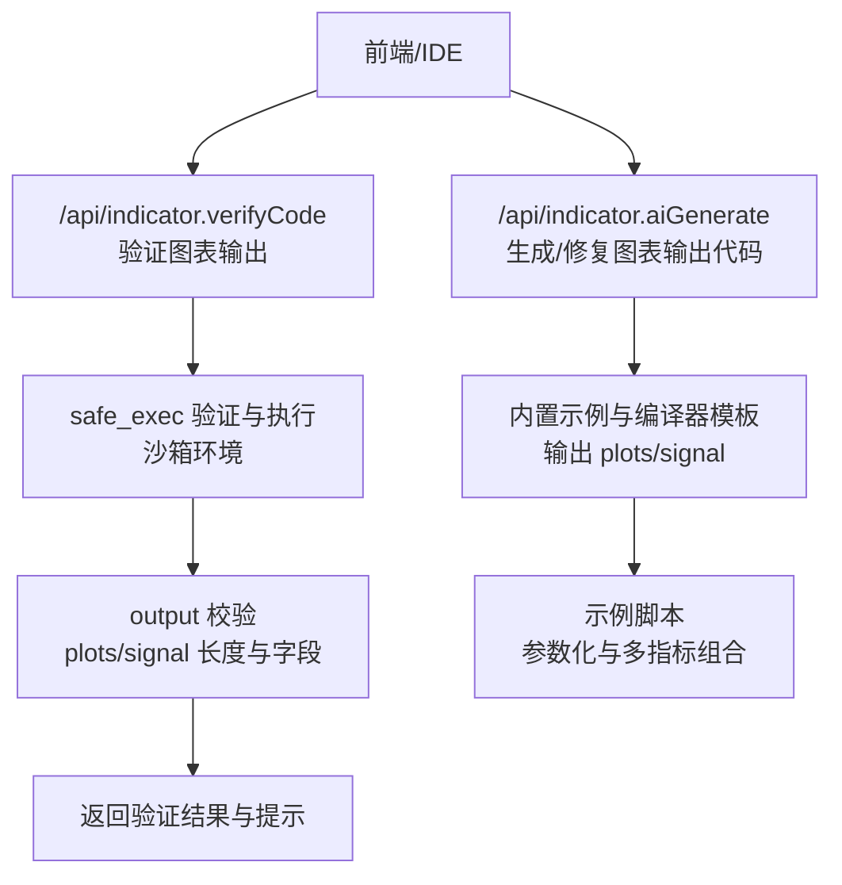
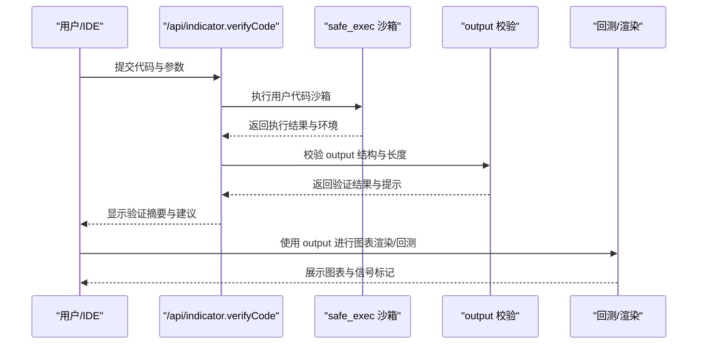
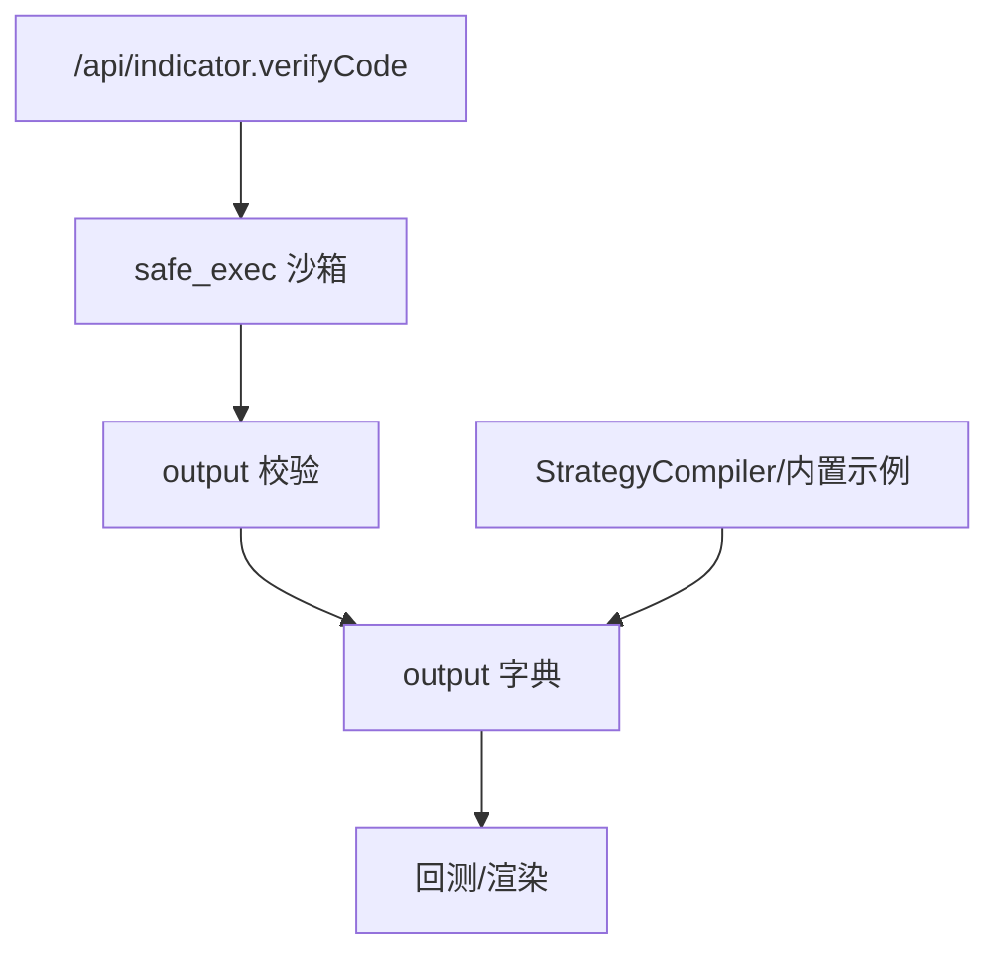

# 图表输出和可视化

<cite>
**本文引用的文件**
- [backend_api_python/app/routes/indicator.py](file://backend_api_python/app/routes/indicator.py)
- [backend_api_python/app/services/strategy_compiler.py](file://backend_api_python/app/services/strategy_compiler.py)
- [backend_api_python/app/services/builtin_indicators.py](file://backend_api_python/app/services/builtin_indicators.py)
- [docs/examples/dual_ma_with_params.py](file://docs/examples/dual_ma_with_params.py)
- [docs/examples/multi_indicator_composite.py](file://docs/examples/multi_indicator_composite.py)
- [backend_api_python/app/utils/safe_exec.py](file://backend_api_python/app/utils/safe_exec.py)
- [backend_api_python/app/services/backtest.py](file://backend_api_python/app/services/backtest.py)
- [backend_api_python/tests/test_indicator_code_quality.py](file://backend_api_python/tests/test_indicator_code_quality.py)
</cite>

## 目录
1. [简介](#简介)
2. [项目结构](#项目结构)
3. [核心组件](#核心组件)
4. [架构总览](#架构总览)
5. [详细组件分析](#详细组件分析)
6. [依赖分析](#依赖分析)
7. [性能考量](#性能考量)
8. [故障排查指南](#故障排查指南)
9. [结论](#结论)
10. [附录](#附录)

## 简介
本指南聚焦于 IndicatorStrategy 的图表输出机制，围绕 output 字典的结构与校验规则，系统讲解绘图元素与信号标记的配置方法、数据格式与长度约束、最佳实践与调试技巧。目标是帮助开发者在不混入渲染逻辑的前提下，清晰地输出图表所需的数据，并确保与信号逻辑解耦。

## 项目结构
与图表输出直接相关的核心模块如下：
- 后端接口层：负责接收用户代码、执行沙箱校验、验证 output 结构与长度、返回验证摘要与提示。
- 编译器与内置示例：演示如何生成 output 的 plots 与 signals，并展示 overlay 与独立 pane 的区别。
- 示例脚本：提供参数化与多指标组合的图表输出范式。
- 安全执行工具：保障用户代码在受控环境下运行，避免安全风险。
- 回测服务：在回测流程中读取 output 并与信号列对齐，保证索引一致性。

**图表来源**
- [backend_api_python/app/routes/indicator.py:169-277](file://backend_api_python/app/routes/indicator.py#L169-L277)
- [backend_api_python/app/utils/safe_exec.py:207-244](file://backend_api_python/app/utils/safe_exec.py#L207-L244)
- [backend_api_python/app/services/strategy_compiler.py:567-687](file://backend_api_python/app/services/strategy_compiler.py#L567-L687)
- [docs/examples/dual_ma_with_params.py:52-64](file://docs/examples/dual_ma_with_params.py#L52-L64)
- [docs/examples/multi_indicator_composite.py:95-109](file://docs/examples/multi_indicator_composite.py#L95-L109)

**章节来源**
- [backend_api_python/app/routes/indicator.py:169-277](file://backend_api_python/app/routes/indicator.py#L169-L277)
- [backend_api_python/app/utils/safe_exec.py:207-244](file://backend_api_python/app/utils/safe_exec.py#L207-L244)
- [backend_api_python/app/services/strategy_compiler.py:567-687](file://backend_api_python/app/services/strategy_compiler.py#L567-L687)
- [docs/examples/dual_ma_with_params.py:52-64](file://docs/examples/dual_ma_with_params.py#L52-L64)
- [docs/examples/multi_indicator_composite.py:95-109](file://docs/examples/multi_indicator_composite.py#L95-L109)

## 核心组件
- output 字典必须包含 name、plots、signals 三个关键字段（至少包含其一）。其中：
  - name：字符串，通常与 my_indicator_name 一致。
  - plots：列表，每个元素为字典，包含 name、type、data、color、overlay 等键；data 长度需等于 df 的行数。
  - signals：列表，每个元素为字典，包含 type、text、data、color 等键；data 长度同样需等于 df 的行数。
- 校验逻辑：
  - 必须存在 output 且为字典；
  - 至少包含 plots 或 signals；
  - 每个 plot/signal 的 data 字段必须存在且长度等于 len(df)；
  - 提供质量提示（如参数未读取、信号标记使用 where(None).tolist() 等）。

**章节来源**
- [backend_api_python/app/routes/indicator.py:211-277](file://backend_api_python/app/routes/indicator.py#L211-L277)
- [backend_api_python/app/routes/indicator.py:791-804](file://backend_api_python/app/routes/indicator.py#L791-L804)
- [backend_api_python/tests/test_indicator_code_quality.py:12-27](file://backend_api_python/tests/test_indicator_code_quality.py#L12-L27)

## 架构总览
下图展示了从用户提交代码到输出图表数据的关键流程，以及与信号逻辑的分离原则。

**图表来源**
- [backend_api_python/app/routes/indicator.py:169-277](file://backend_api_python/app/routes/indicator.py#L169-L277)
- [backend_api_python/app/utils/safe_exec.py:207-244](file://backend_api_python/app/utils/safe_exec.py#L207-L244)
- [backend_api_python/app/services/backtest.py:1593-1638](file://backend_api_python/app/services/backtest.py#L1593-L1638)

## 详细组件分析

### output 字典结构与字段详解
- 必需字段
  - name：字符串，标识图表名称。
  - plots：列表，元素为字典，至少包含 name、data；可选 type、color、overlay。
  - signals：列表，元素为字典，至少包含 type、data；可选 text、color。
- 数据格式要求
  - data 必须为列表，长度等于 df 行数。
  - type 为 "line"（或其他类型，视前端支持而定）。
  - overlay 为布尔值：True 表示叠加在价格轴上（如均线、布林带上下轨），False 表示独立 pane（如 RSI、MACD）。
- 信号标记
  - type 为 "buy" 或 "sell"。
  - data 中每个元素为数值价格或 None（None 表示无标记）。
  - text 为标记文本（如 "B"/"S"）。
  - color 为十六进制颜色值。

**章节来源**
- [backend_api_python/app/routes/indicator.py:791-804](file://backend_api_python/app/routes/indicator.py#L791-L804)
- [backend_api_python/app/routes/indicator.py:211-277](file://backend_api_python/app/routes/indicator.py#L211-L277)

### 绘图元素配置方法
- 线条名称与颜色
  - name：用于图例与标签。
  - color：使用 "#RRGGBB" 格式。
- 叠加选项
  - overlay：True 时叠加在价格图上；False 时显示在独立 pane。
- 数据格式
  - data：使用 series.tolist()，确保与 df 对齐。
- 典型示例
  - 布林带上下轨叠加在价格图上。
  - RSI/MACD 等振荡器显示在独立 pane。

**章节来源**
- [backend_api_python/app/services/strategy_compiler.py:567-627](file://backend_api_python/app/services/strategy_compiler.py#L567-L627)
- [docs/examples/dual_ma_with_params.py:52-63](file://docs/examples/dual_ma_with_params.py#L52-L63)
- [docs/examples/multi_indicator_composite.py:95-108](file://docs/examples/multi_indicator_composite.py#L95-L108)

### 信号标记实现
- 位置计算
  - 买入标记：在 df['buy'] 为 True 的位置，取对应 bar 的 "low" 或 "open" 略低的价格。
  - 卖出标记：在 df['sell'] 为 True 的位置，取对应 bar 的 "high" 或 "open" 略高的价格。
- 视觉设计
  - text：简短标签（如 "B"/"S"）。
  - color：与策略风格一致的颜色。
  - data：None 或具体价格，None 表示不显示标记。
- 推荐写法
  - 使用显式列表推导，避免 series.where(..., None).tolist() 导致 NaN 渲染问题。

**章节来源**
- [backend_api_python/app/routes/indicator.py:851-853](file://backend_api_python/app/routes/indicator.py#L851-L853)
- [docs/examples/dual_ma_with_params.py:48-50](file://docs/examples/dual_ma_with_params.py#L48-L50)
- [docs/examples/multi_indicator_composite.py:91-93](file://docs/examples/multi_indicator_composite.py#L91-L93)
- [backend_api_python/tests/test_indicator_code_quality.py:123-135](file://backend_api_python/tests/test_indicator_code_quality.py#L123-L135)

### 与信号逻辑的分离原则
- output 仅承载“可视化数据”，不包含下单或风控逻辑。
- 信号逻辑（df['buy']、df['sell']）与图表输出（output）解耦，前者用于回测与通知，后者用于展示。
- 编译器与内置示例均遵循该原则：先计算信号，再生成 output 的 plots 与 signals。

**章节来源**
- [backend_api_python/app/services/strategy_compiler.py:533-565](file://backend_api_python/app/services/strategy_compiler.py#L533-L565)
- [backend_api_python/app/services/builtin_indicators.py:23-47](file://backend_api_python/app/services/builtin_indicators.py#L23-L47)

### 自定义图表元素的高级用法
- 多指标组合
  - 在 output.plots 中添加多个 series，overlay 与 pane 的选择取决于指标性质。
- 参数化与默认策略注解
  - 使用 "# @param" 声明参数，通过 params.get(...) 读取。
  - 使用 "# @strategy" 提供默认风控与方向配置。
- 模板与 AI 生成
  - 若未配置 LLM，将返回模板代码；否则通过统一 LLMService 生成或修复代码。

**章节来源**
- [docs/examples/multi_indicator_composite.py:16-34](file://docs/examples/multi_indicator_composite.py#L16-L34)
- [backend_api_python/app/routes/indicator.py:807-825](file://backend_api_python/app/routes/indicator.py#L807-L825)
- [backend_api_python/app/routes/indicator.py:910-965](file://backend_api_python/app/routes/indicator.py#L910-L965)

### 调试技巧
- 使用 /api/indicator.codeQualityHints 获取质量提示（如参数未读取、where(None) 标记等）。
- 通过 /api/indicator.verifyCode 快速验证 output 结构与长度。
- 在回测阶段关注信号索引对齐与填充（False）行为，避免 lookup 失败。

**章节来源**
- [backend_api_python/app/routes/indicator.py:1185-1222](file://backend_api_python/app/routes/indicator.py#L1185-L1222)
- [backend_api_python/app/routes/indicator.py:211-277](file://backend_api_python/app/routes/indicator.py#L211-L277)
- [backend_api_python/app/services/backtest.py:755-800](file://backend_api_python/app/services/backtest.py#L755-L800)

## 依赖分析
- 校验依赖
  - verifyCode 依赖 safe_exec 的沙箱执行与构建受限 builtins。
  - 校验规则依赖 pandas/numpy 的可用性与 df 对齐。
- 编译与示例
  - StrategyCompiler 与内置示例提供 plots/signal 的生成模板。
- 回测依赖
  - 回测服务在执行策略代码后读取 output，并与信号列对齐。

**图表来源**
- [backend_api_python/app/routes/indicator.py:169-277](file://backend_api_python/app/routes/indicator.py#L169-L277)
- [backend_api_python/app/utils/safe_exec.py:207-244](file://backend_api_python/app/utils/safe_exec.py#L207-L244)
- [backend_api_python/app/services/strategy_compiler.py:567-687](file://backend_api_python/app/services/strategy_compiler.py#L567-L687)
- [backend_api_python/app/services/backtest.py:1593-1638](file://backend_api_python/app/services/backtest.py#L1593-L1638)

**章节来源**
- [backend_api_python/app/routes/indicator.py:169-277](file://backend_api_python/app/routes/indicator.py#L169-L277)
- [backend_api_python/app/utils/safe_exec.py:207-244](file://backend_api_python/app/utils/safe_exec.py#L207-L244)
- [backend_api_python/app/services/strategy_compiler.py:567-687](file://backend_api_python/app/services/strategy_compiler.py#L567-L687)
- [backend_api_python/app/services/backtest.py:1593-1638](file://backend_api_python/app/services/backtest.py#L1593-L1638)

## 性能考量
- 向量化优先：尽量使用 pandas/numpy 向量化操作，避免逐行循环。
- 数据长度校验：确保所有 plot/signal.data 长度与 df 对齐，减少后续索引对齐成本。
- 颜色与文本：使用固定数量的预定义颜色与简短文本，降低前端渲染压力。
- 信号标记：使用显式 None 列表而非 series.where(..., None).tolist()，避免 NaN 带来的额外处理。

[本节为通用指导，无需特定文件引用]

## 故障排查指南
- 常见错误类型
  - 缺失 output：返回 "MissingOutput"。
  - output 类型错误：返回 "InvalidOutputType"。
  - 缺失 plots/signals：返回 "InvalidOutputStructure"。
  - plot/signal 缺少 data：返回 "InvalidPlot"/"InvalidSignal"。
  - 数据长度不匹配：返回 "LengthMismatch"。
- 质量提示
  - 参数未通过 params.get(...) 读取：提示 "DECLARED_PARAMS_NOT_READ_VIA_PARAMS_GET"。
  - 信号标记使用 where(None).tolist()：提示 "SIGNAL_MARKERS_USE_WHERE_NONE"。
- 处理建议
  - 优先修复长度与字段缺失问题。
  - 修正参数读取与标记生成方式。
  - 使用 /api/indicator.codeQualityHints 获取进一步建议。

**章节来源**
- [backend_api_python/app/routes/indicator.py:188-209](file://backend_api_python/app/routes/indicator.py#L188-L209)
- [backend_api_python/app/routes/indicator.py:211-277](file://backend_api_python/app/routes/indicator.py#L211-L277)
- [backend_api_python/tests/test_indicator_code_quality.py:92-121](file://backend_api_python/tests/test_indicator_code_quality.py#L92-L121)
- [backend_api_python/tests/test_indicator_code_quality.py:123-135](file://backend_api_python/tests/test_indicator_code_quality.py#L123-L135)

## 结论
- output 字典是图表输出的唯一契约：严格遵守字段与长度要求，确保 plots 与 signals 的数据对齐。
- 将信号逻辑与可视化解耦，使代码更清晰、可维护、可复用。
- 使用参数化与默认策略注解提升可配置性与一致性。
- 通过沙箱执行与质量提示，快速定位并修复常见问题。

[本节为总结，无需特定文件引用]

## 附录

### output 字典字段对照表
- name：字符串，图表名称。
- plots：列表，元素字典包含：
  - name：字符串，图例名称。
  - type：字符串，图形类型（如 "line"）。
  - data：列表，数值序列的列表形式，长度等于 df 行数。
  - color：字符串，十六进制颜色值。
  - overlay：布尔，是否叠加在价格轴。
- signals：列表，元素字典包含：
  - type：字符串，"buy" 或 "sell"。
  - text：字符串，标记文本。
  - data：列表，数值或 None，长度等于 df 行数。
  - color：字符串，十六进制颜色值。

**章节来源**
- [backend_api_python/app/routes/indicator.py:791-804](file://backend_api_python/app/routes/indicator.py#L791-L804)