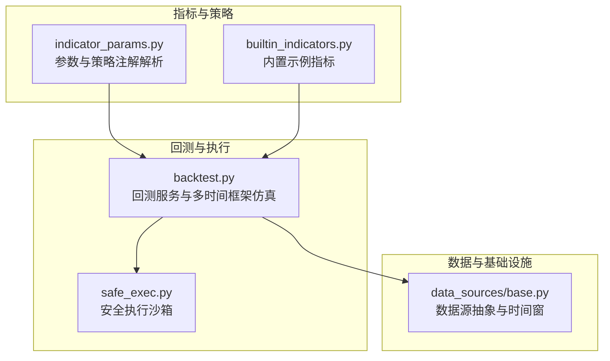
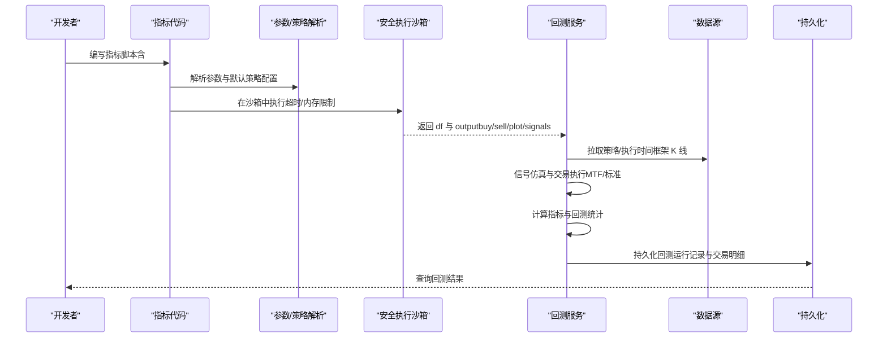
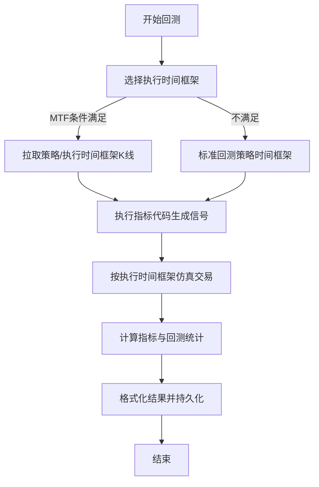
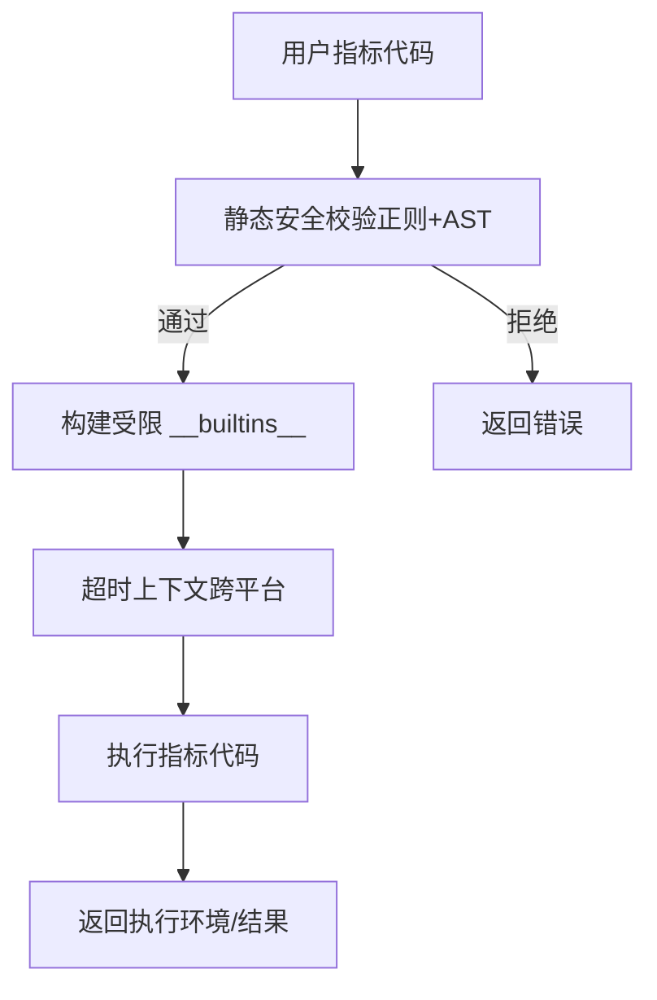
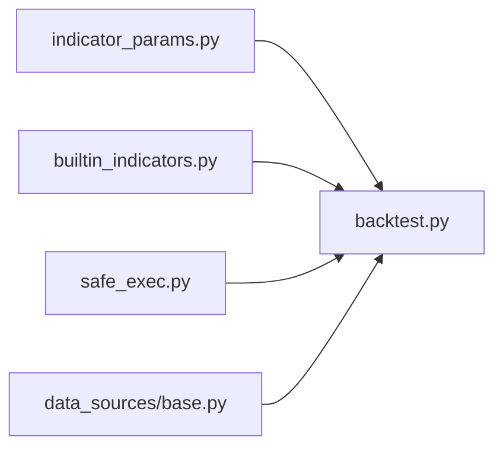

# 开发流程和最佳实践

<cite>
**本文引用的文件**
- [STRATEGY_DEV_GUIDE_CN.md](file://docs/STRATEGY_DEV_GUIDE_CN.md)
- [INDICATOR_DEFINITIONS_CN.md](file://docs/INDICATOR_DEFINITIONS_CN.md)
- [dual_ma_with_params.py](file://docs/examples/dual_ma_with_params.py)
- [multi_indicator_composite.py](file://docs/examples/multi_indicator_composite.py)
- [cross_sectional_momentum_rsi.py](file://docs/examples/cross_sectional_momentum_rsi.py)
- [builtin_indicators.py](file://backend_api_python/app/services/builtin_indicators.py)
- [backtest.py](file://backend_api_python/app/services/backtest.py)
- [indicator_params.py](file://backend_api_python/app/services/indicator_params.py)
- [safe_exec.py](file://backend_api_python/app/utils/safe_exec.py)
- [base.py](file://backend_api_python/app/data_sources/base.py)
</cite>

## 目录
1. [引言](#引言)
2. [项目结构](#项目结构)
3. [核心组件](#核心组件)
4. [架构总览](#架构总览)
5. [详细组件分析](#详细组件分析)
6. [依赖分析](#依赖分析)
7. [性能考量](#性能考量)
8. [故障排查指南](#故障排查指南)
9. [结论](#结论)
10. [附录](#附录)

## 引言
本指南面向 IndicatorStrategy 的完整开发流程，围绕“五步开发法”展开：元数据配置、数据处理、信号生成、退出设计、图表输出。文档同时系统阐述 backtest 语义（bar-close 确认、next-bar-open 执行）及其边界，给出常见问题与解决方案（回看偏差、数据泄漏、性能问题），并总结代码质量与可维护性最佳实践（注释规范、变量命名、模块化设计）。文中所有技术细节均来自仓库现有实现与文档，确保可追溯与可操作。

## 项目结构
本项目后端以服务层为核心，围绕指标与策略的解析、执行、回测与持久化形成闭环。与 IndicatorStrategy 直接相关的关键模块包括：
- 指标参数解析与调用：indicator_params.py
- 回测引擎：backtest.py
- 安全执行沙箱：safe_exec.py
- 数据源抽象：data_sources/base.py
- 内置示例指标：builtin_indicators.py
- 开发指南与示例：docs 下的策略开发指南与示例脚本

**图表来源**
- [indicator_params.py:1-380](file://backend_api_python/app/services/indicator_params.py#L1-L380)
- [backtest.py:1-800](file://backend_api_python/app/services/backtest.py#L1-L800)
- [safe_exec.py:1-471](file://backend_api_python/app/utils/safe_exec.py#L1-L471)
- [base.py:1-179](file://backend_api_python/app/data_sources/base.py#L1-L179)
- [builtin_indicators.py:1-250](file://backend_api_python/app/services/builtin_indicators.py#L1-L250)

**章节来源**
- [STRATEGY_DEV_GUIDE_CN.md:1-1270](file://docs/STRATEGY_DEV_GUIDE_CN.md#L1-L1270)
- [base.py:1-179](file://backend_api_python/app/data_sources/base.py#L1-L179)

## 核心组件
- 指标参数与策略注解解析：负责解析 # @param 与 # @strategy，生成参数与默认风控配置，保障平台 UI、AI 调参与代码一致性。
- 回测服务：负责多时间框架数据拉取、信号生成、精确交易仿真（包含 MTF 与标准回测路径）、指标计算与结果持久化。
- 安全执行沙箱：限定内置函数与允许模块，提供超时与内存限制，确保用户指标代码在受控环境下执行。
- 数据源抽象：统一 K 线接口、时间窗计算与延迟检测，支撑回测与实时数据。
- 内置示例指标：提供可直接运行的示例，便于学习与对照。

**章节来源**
- [indicator_params.py:26-117](file://backend_api_python/app/services/indicator_params.py#L26-L117)
- [backtest.py:64-142](file://backend_api_python/app/services/backtest.py#L64-L142)
- [safe_exec.py:74-93](file://backend_api_python/app/utils/safe_exec.py#L74-L93)
- [base.py:27-179](file://backend_api_python/app/data_sources/base.py#L27-L179)
- [builtin_indicators.py:17-250](file://backend_api_python/app/services/builtin_indicators.py#L17-L250)

## 架构总览
下图展示了从指标代码到回测执行与结果落库的端到端流程，突出“信号生成—执行仿真—指标计算—结果持久化”的关键步骤。

**图表来源**
- [indicator_params.py:119-216](file://backend_api_python/app/services/indicator_params.py#L119-L216)
- [safe_exec.py:207-244](file://backend_api_python/app/utils/safe_exec.py#L207-L244)
- [backtest.py:444-668](file://backend_api_python/app/services/backtest.py#L444-L668)
- [base.py:32-55](file://backend_api_python/app/data_sources/base.py#L32-L55)

## 详细组件分析

### 五步开发法详解与质量检查标准
- 元数据配置
  - 使用 # @param 暴露可调参数，使用 # @strategy 声明默认风控与方向。
  - 参数与默认值应与平台 UI、AI 调参与代码保持一致，避免“声明但不读取”。
  - 质量检查：平台内置代码质量检查会提示未读取的参数。
  - 参考示例：双均线与多指标组合示例。
  
  **章节来源**
  - [STRATEGY_DEV_GUIDE_CN.md:93-149](file://docs/STRATEGY_DEV_GUIDE_CN.md#L93-L149)
  - [dual_ma_with_params.py:20-34](file://docs/examples/dual_ma_with_params.py#L20-L34)
  - [multi_indicator_composite.py:16-46](file://docs/examples/multi_indicator_composite.py#L16-L46)

- 数据处理
  - 复制 df，确保后续计算不污染原始数据。
  - 使用 pandas/numpy 向量化计算，避免逐行循环。
  - 显式处理 NaN（滚动/指数平滑前导 NaN）。
  - 质量检查：序列长度与 df 对齐，plot 与 signal 的 data 数组长度一致。
  
  **章节来源**
  - [STRATEGY_DEV_GUIDE_CN.md:150-176](file://docs/STRATEGY_DEV_GUIDE_CN.md#L150-L176)
  - [STRATEGY_DEV_GUIDE_CN.md:816-827](file://docs/STRATEGY_DEV_GUIDE_CN.md#L816-L827)

- 信号生成
  - 生成布尔列 df['buy'] 与 df['sell']，尽量采用边缘触发，避免每根 bar 重复触发。
  - 严禁使用 shift(-1) 偷看未来数据。
  - 质量检查：buy/sell 为布尔、长度对齐、边缘触发。
  
  **章节来源**
  - [STRATEGY_DEV_GUIDE_CN.md:177-201](file://docs/STRATEGY_DEV_GUIDE_CN.md#L177-L201)
  - [STRATEGY_DEV_GUIDE_CN.md:810-815](file://docs/STRATEGY_DEV_GUIDE_CN.md#L810-L815)

- 退出设计
  - 两种合法写法：信号驱动退出（如均线死叉、RSI阈值）或引擎默认固定止盈止损/跟踪止损。
  - 明确主退出来源，避免混用且不标注。
  - 质量检查：退出来源清晰、默认值合理。
  
  **章节来源**
  - [STRATEGY_DEV_GUIDE_CN.md:202-242](file://docs/STRATEGY_DEV_GUIDE_CN.md#L202-L242)

- 图表输出
  - output 结构包含 name、plots、signals（可选 calculatedVars）。
  - plots 与 signals 的 data 必须与 len(df) 对齐，overlay/type/color 等字段按需提供。
  
  **章节来源**
  - [STRATEGY_DEV_GUIDE_CN.md:243-276](file://docs/STRATEGY_DEV_GUIDE_CN.md#L243-L276)
  - [STRATEGY_DEV_GUIDE_CN.md:1209-1257](file://docs/STRATEGY_DEV_GUIDE_CN.md#L1209-L1257)

### backtest 语义与执行时序
- 信号确认与执行时序
  - 引擎读取 df['buy']/df['sell']，以 bar close 确认信号，通常在下一根 bar 的开盘价执行。
  - 保存后的策略快照可能被规范化为 next_bar_open 或 same_bar_close，若更改成交时机，需重新回测核对。
- 多时间框架（MTF）回测
  - 使用策略时间框架生成信号，执行时间框架（1m/5m）进行精确仿真。
  - 当不满足 MTF 条件（如存在缩放规则、信号执行时机不支持）时，回退到标准回测。
- 价格路径推断
  - 在 MTF 仿真中，根据 K 线 OHLC 关系推断价格路径，以更贴近真实成交顺序。

**图表来源**
- [backtest.py:170-225](file://backend_api_python/app/services/backtest.py#L170-L225)
- [backtest.py:444-668](file://backend_api_python/app/services/backtest.py#L444-L668)
- [backtest.py:670-760](file://backend_api_python/app/services/backtest.py#L670-L760)

**章节来源**
- [STRATEGY_DEV_GUIDE_CN.md:277-295](file://docs/STRATEGY_DEV_GUIDE_CN.md#L277-L295)
- [backtest.py:151-169](file://backend_api_python/app/services/backtest.py#L151-L169)
- [backtest.py:444-554](file://backend_api_python/app/services/backtest.py#L444-L554)

### 安全执行与沙箱
- 限制内置函数与允许模块，拒绝危险调用与导入。
- 提供超时与内存限制，保障执行稳定性。
- 支持在当前进程内执行与子进程隔离两种模式。

**图表来源**
- [safe_exec.py:358-471](file://backend_api_python/app/utils/safe_exec.py#L358-L471)
- [safe_exec.py:95-153](file://backend_api_python/app/utils/safe_exec.py#L95-L153)
- [safe_exec.py:157-205](file://backend_api_python/app/utils/safe_exec.py#L157-L205)

**章节来源**
- [safe_exec.py:74-93](file://backend_api_python/app/utils/safe_exec.py#L74-L93)
- [safe_exec.py:207-244](file://backend_api_python/app/utils/safe_exec.py#L207-L244)

### 数据源与时间窗
- 统一 K 线接口，支持时间窗计算与过滤。
- 提供延迟检测，按周期设定最大容忍延迟，避免节假日/周末导致的误判。

**章节来源**
- [base.py:32-55](file://backend_api_python/app/data_sources/base.py#L32-L55)
- [base.py:85-139](file://backend_api_python/app/data_sources/base.py#L85-L139)
- [base.py:141-179](file://backend_api_python/app/data_sources/base.py#L141-L179)

### 内置示例与开发模板
- 内置示例指标包含 RSI、双均线、MACD、布林带等，可直接运行并作为开发模板。
- 示例脚本遵循“参数声明 + 默认策略 + 指标计算 + 信号 + 图表输出”的分层结构。

**章节来源**
- [builtin_indicators.py:17-185](file://backend_api_python/app/services/builtin_indicators.py#L17-L185)
- [dual_ma_with_params.py:17-64](file://docs/examples/dual_ma_with_params.py#L17-L64)
- [multi_indicator_composite.py:13-109](file://docs/examples/multi_indicator_composite.py#L13-L109)

## 依赖分析
- 指标参数解析依赖正则与 AST 校验，确保注解格式与类型约束。
- 回测服务依赖数据源抽象与安全执行沙箱，保证数据获取与代码执行的安全可控。
- 内置示例指标为开发提供可运行模板，降低入门成本。

**图表来源**
- [indicator_params.py:119-216](file://backend_api_python/app/services/indicator_params.py#L119-L216)
- [backtest.py:64-142](file://backend_api_python/app/services/backtest.py#L64-L142)
- [safe_exec.py:207-244](file://backend_api_python/app/utils/safe_exec.py#L207-L244)
- [base.py:27-55](file://backend_api_python/app/data_sources/base.py#L27-L55)
- [builtin_indicators.py:192-250](file://backend_api_python/app/services/builtin_indicators.py#L192-L250)

**章节来源**
- [indicator_params.py:1-380](file://backend_api_python/app/services/indicator_params.py#L1-L380)
- [backtest.py:1-800](file://backend_api_python/app/services/backtest.py#L1-L800)
- [safe_exec.py:1-471](file://backend_api_python/app/utils/safe_exec.py#L1-L471)
- [base.py:1-179](file://backend_api_python/app/data_sources/base.py#L1-L179)
- [builtin_indicators.py:1-250](file://backend_api_python/app/services/builtin_indicators.py#L1-L250)

## 性能考量
- 向量化优先：核心指标计算尽量使用 pandas/numpy 向量化，避免逐行循环。
- 数据缓存：回测服务内置 K 线缓存，减少重复外部 API 调用。
- 时间窗与 MTF：根据回测区间自动选择执行时间框架，平衡精度与性能。
- 资源限制：沙箱提供超时与内存限制，防止极端用例拖垮系统。

**章节来源**
- [STRATEGY_DEV_GUIDE_CN.md:824-827](file://docs/STRATEGY_DEV_GUIDE_CN.md#L824-L827)
- [backtest.py:25-61](file://backend_api_python/app/services/backtest.py#L25-L61)
- [backtest.py:170-225](file://backend_api_python/app/services/backtest.py#L170-L225)
- [safe_exec.py:180-205](file://backend_api_python/app/utils/safe_exec.py#L180-L205)

## 故障排查指南
- 常见错误与定位
  - 缺少必要函数：ScriptStrategy 必须定义 on_bar；UI 校验器要求 on_init/on_bar 同时存在。
  - 策略代码为空：保存后的策略在当前模式下必须包含有效代码。
  - 图表长度不一致：plot 或 signal 的数组长度未与 df 对齐。
  - 回测结果异常：检查是否误用未来数据、信号是否边缘触发、是否混用信号与引擎退出且未说明。
  - 数据库结构不匹配：qd_strategies_trading 缺少字段需迁移。
- 后端日志排查
  - 优先查看后端日志，关注数据库结构、JSON/配置载荷、代码校验、市场/符号、凭证配置等问题。

**章节来源**
- [STRATEGY_DEV_GUIDE_CN.md:840-881](file://docs/STRATEGY_DEV_GUIDE_CN.md#L840-L881)

## 结论
IndicatorStrategy 的开发应严格遵循“五步开发法”，以清晰的元数据、稳健的数据处理、严谨的信号生成、明确的退出设计与规范的图表输出为主线。backtest 语义（bar-close 确认、next-bar-open 执行）是理解回测与实盘差异的关键。通过内置示例、参数解析、安全执行与回测服务的协同，开发者可以在保证质量与性能的前提下高效完成策略原型与落地验证。

## 附录

### 开发示例与参考路径
- 双均线策略（参数 + 默认风控 + 边缘触发 + 图表输出）
  - [dual_ma_with_params.py:17-64](file://docs/examples/dual_ma_with_params.py#L17-L64)
- 多指标组合策略（均线 + RSI + MACD + 成交量过滤）
  - [multi_indicator_composite.py:13-109](file://docs/examples/multi_indicator_composite.py#L13-L109)
- 截面策略指标示例（研究参考）
  - [cross_sectional_momentum_rsi.py:1-71](file://docs/examples/cross_sectional_momentum_rsi.py#L1-L71)

### 代码审查清单（摘自指南）
- 是否使用 # @param 声明参数并读取 params？
- 是否使用 # @strategy 声明默认风控与方向？
- 是否避免未来函数（不使用 shift(-1)）？
- 是否对 NaN 进行显式处理？
- 是否保持所有序列长度与 df 对齐？
- 是否采用边缘触发信号？
- 是否明确主退出来源（信号/引擎）？
- 是否将杠杆等执行配置置于产品层而非源码？

**章节来源**
- [STRATEGY_DEV_GUIDE_CN.md:808-837](file://docs/STRATEGY_DEV_GUIDE_CN.md#L808-L837)
- [STRATEGY_DEV_GUIDE_CN.md:957-1127](file://docs/STRATEGY_DEV_GUIDE_CN.md#L957-L1127)