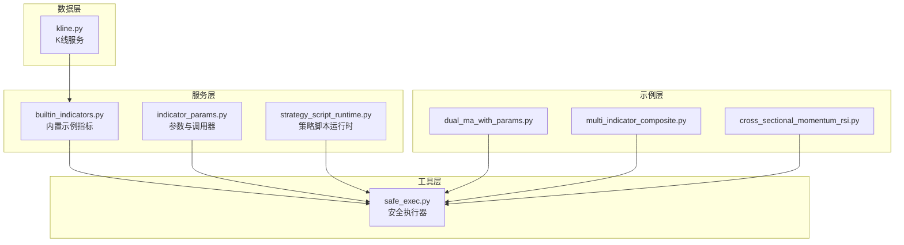
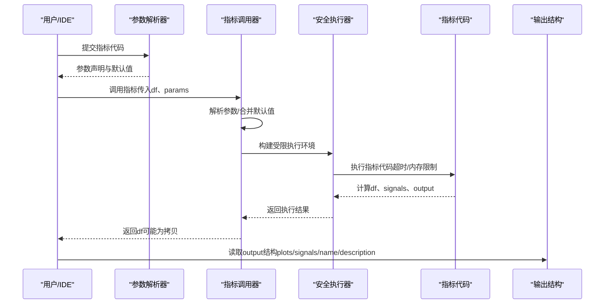
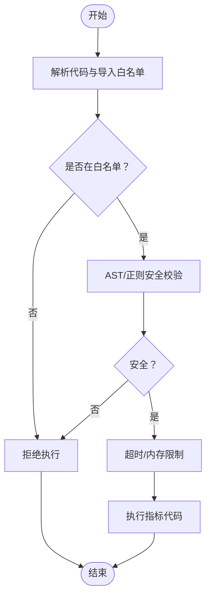
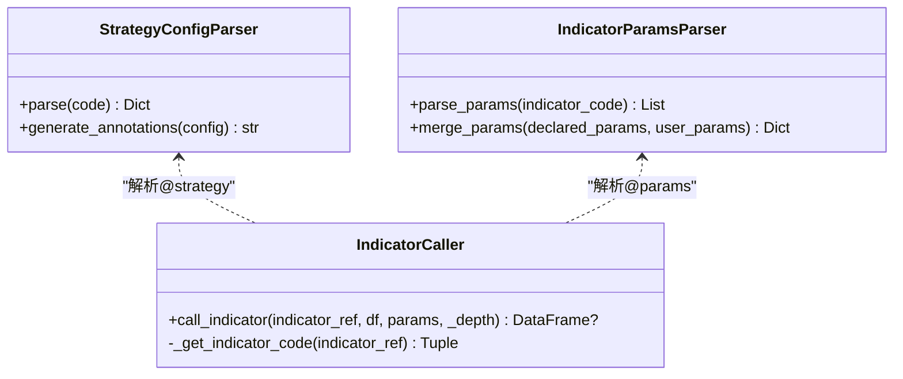
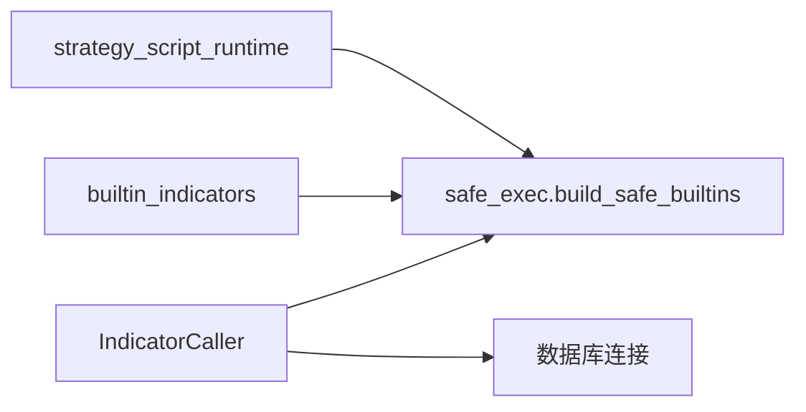

# 数据框处理和指标计算

<cite>
**本文引用的文件**
- [builtin_indicators.py](file://backend_api_python/app/services/builtin_indicators.py)
- [indicator_params.py](file://backend_api_python/app/services/indicator_params.py)
- [safe_exec.py](file://backend_api_python/app/utils/safe_exec.py)
- [strategy_script_runtime.py](file://backend_api_python/app/services/strategy_script_runtime.py)
- [indicator_code_quality.py](file://backend_api_python/app/services/indicator_code_quality.py)
- [dual_ma_with_params.py](file://docs/examples/dual_ma_with_params.py)
- [multi_indicator_composite.py](file://docs/examples/multi_indicator_composite.py)
- [cross_sectional_momentum_rsi.py](file://docs/examples/cross_sectional_momentum_rsi.py)
- [kline.py](file://backend_api_python/app/services/kline.py)
</cite>

## 目录
1. [简介](#简介)
2. [项目结构](#项目结构)
3. [核心组件](#核心组件)
4. [架构总览](#架构总览)
5. [详细组件分析](#详细组件分析)
6. [依赖分析](#依赖分析)
7. [性能考量](#性能考量)
8. [故障排查指南](#故障排查指南)
9. [结论](#结论)
10. [附录](#附录)

## 简介
本指南聚焦于 IndicatorStrategy 的数据框处理与指标计算，围绕以下主题展开：
- 数据沙箱环境的特点与安全边界（内置对象、导入白名单、超时与内存限制）
- 数据复制最佳实践（df.copy() 的必要性与数据完整性保障）
- 常用金融数据列（open、high、low、close、volume）的特性与使用方法
- 指标计算通用模式（移动平均线、RSI、MACD、布林带、ATR 等）
- 避免不安全操作（网络访问、文件 I/O、动态导入等）
- 数据质量检查、缺失值处理与异常情况处理的实用技巧

## 项目结构
本项目采用后端服务与工具模块分离的组织方式，与指标执行相关的关键目录与文件如下：
- 服务层：指标参数解析、指标调用器、内置示例指标、策略脚本运行时
- 工具层：安全执行器（沙箱、超时、内存限制、AST/正则安全校验）
- 示例层：双均线、多指标组合、截面动量+RSI 等示例代码

图表来源
- [builtin_indicators.py:1-250](file://backend_api_python/app/services/builtin_indicators.py#L1-L250)
- [indicator_params.py:1-380](file://backend_api_python/app/services/indicator_params.py#L1-L380)
- [safe_exec.py:1-471](file://backend_api_python/app/utils/safe_exec.py#L1-L471)
- [strategy_script_runtime.py:1-191](file://backend_api_python/app/services/strategy_script_runtime.py#L1-L191)
- [dual_ma_with_params.py:1-64](file://docs/examples/dual_ma_with_params.py#L1-L64)
- [multi_indicator_composite.py:1-109](file://docs/examples/multi_indicator_composite.py#L1-L109)
- [cross_sectional_momentum_rsi.py:1-71](file://docs/examples/cross_sectional_momentum_rsi.py#L1-L71)
- [kline.py:1-191](file://backend_api_python/app/services/kline.py#L1-L191)

章节来源
- [builtin_indicators.py:1-250](file://backend_api_python/app/services/builtin_indicators.py#L1-L250)
- [indicator_params.py:1-380](file://backend_api_python/app/services/indicator_params.py#L1-L380)
- [safe_exec.py:1-471](file://backend_api_python/app/utils/safe_exec.py#L1-L471)
- [strategy_script_runtime.py:1-191](file://backend_api_python/app/services/strategy_script_runtime.py#L1-L191)
- [dual_ma_with_params.py:1-64](file://docs/examples/dual_ma_with_params.py#L1-L64)
- [multi_indicator_composite.py:1-109](file://docs/examples/multi_indicator_composite.py#L1-L109)
- [cross_sectional_momentum_rsi.py:1-71](file://docs/examples/cross_sectional_momentum_rsi.py#L1-L71)
- [kline.py:1-191](file://backend_api_python/app/services/kline.py#L1-L191)

## 核心组件
- 指标参数解析与调用器：支持 @param 声明、@strategy 注解、指标间互相调用与参数合并
- 安全执行器：构建受限内置对象、白名单导入、超时与内存限制、AST/正则双重安全校验
- 内置示例指标：提供 RSI、双均线、MACD、布林带等模板，演示边缘触发与输出结构
- 策略脚本运行时：为实盘/回测提供 on_init/on_bar 的安全执行环境
- 代码质量检查：启发式规则检测缺失元信息、df.copy、输出结构、参数使用等

章节来源
- [indicator_params.py:26-380](file://backend_api_python/app/services/indicator_params.py#L26-L380)
- [safe_exec.py:24-471](file://backend_api_python/app/utils/safe_exec.py#L24-L471)
- [builtin_indicators.py:17-250](file://backend_api_python/app/services/builtin_indicators.py#L17-L250)
- [strategy_script_runtime.py:114-191](file://backend_api_python/app/services/strategy_script_runtime.py#L114-L191)
- [indicator_code_quality.py:79-206](file://backend_api_python/app/services/indicator_code_quality.py#L79-L206)

## 架构总览
下图展示了指标执行的端到端流程，从输入数据到安全执行再到输出结构。

图表来源
- [indicator_params.py:238-321](file://backend_api_python/app/services/indicator_params.py#L238-L321)
- [safe_exec.py:207-244](file://backend_api_python/app/utils/safe_exec.py#L207-L244)
- [builtin_indicators.py:31-62](file://backend_api_python/app/services/builtin_indicators.py#L31-L62)

## 详细组件分析

### 数据沙箱与安全边界
- 受限内置对象：仅允许纯计算类内置函数，禁止 eval/exec/open/getattr/type 等危险能力
- 白名单导入：仅允许 numpy、pandas、json、datetime、time、statistics、copy 等模块
- 超时与内存限制：默认超时 30~60 秒，可配置最大内存限制；跨平台超时策略覆盖 Unix 信号与线程异步注入
- AST/正则双重校验：拒绝危险正则模式与 AST 中的危险节点（如 import、eval、exec、__builtins__ 等）

图表来源
- [safe_exec.py:24-92](file://backend_api_python/app/utils/safe_exec.py#L24-L92)
- [safe_exec.py:358-471](file://backend_api_python/app/utils/safe_exec.py#L358-L471)
- [safe_exec.py:97-153](file://backend_api_python/app/utils/safe_exec.py#L97-L153)

章节来源
- [safe_exec.py:24-92](file://backend_api_python/app/utils/safe_exec.py#L24-L92)
- [safe_exec.py:97-153](file://backend_api_python/app/utils/safe_exec.py#L97-L153)
- [safe_exec.py:207-244](file://backend_api_python/app/utils/safe_exec.py#L207-L244)
- [safe_exec.py:358-471](file://backend_api_python/app/utils/safe_exec.py#L358-L471)

### 数据复制最佳实践
- 必要性：指标代码应在开始处显式复制 df，避免对输入 DataFrame 的原地修改影响后续计算或可视化
- 完整性：复制后可安全进行列赋值、填充、滚动/指数平滑等操作，同时保留原始数据用于对比或调试
- 一致性：内置示例与官方示例均以 df.copy() 作为第一条语句，形成统一规范

章节来源
- [builtin_indicators.py:31](file://backend_api_python/app/services/builtin_indicators.py#L31)
- [builtin_indicators.py:75](file://backend_api_python/app/services/builtin_indicators.py#L75)
- [builtin_indicators.py:113](file://backend_api_python/app/services/builtin_indicators.py#L113)
- [builtin_indicators.py:153](file://backend_api_python/app/services/builtin_indicators.py#L153)
- [dual_ma_with_params.py:31](file://docs/examples/dual_ma_with_params.py#L31)
- [multi_indicator_composite.py:35](file://docs/examples/multi_indicator_composite.py#L35)
- [indicator_code_quality.py:41-43](file://backend_api_python/app/services/indicator_code_quality.py#L41-L43)

### 常用金融数据列特性与使用
- open：开盘价，通常用于当日开盘信号或与当日最高/最低价比较
- high：最高价，用于阻力位、布林上轨、ATR 计算
- low：最低价，用于支撑位、布林下轨、ATR 计算
- close：收盘价，最常用的基准价格，用于 MA、RSI、MACD、布林带等
- volume：成交量，常用于成交量过滤、能量潮指标、缩量放量判断

章节来源
- [indicator_params.py:284-292](file://backend_api_python/app/services/indicator_params.py#L284-L292)
- [multi_indicator_composite.py:48-65](file://docs/examples/multi_indicator_composite.py#L48-L65)

### 指标计算通用模式
- 移动平均线（MA/SMA/EMA）：滚动均值/指数平滑，常用于趋势判断与交叉信号
- RSI：相对强弱指数，结合超买/超卖阈值与边缘触发生成买卖信号
- MACD：DIF/DEA/柱，柱穿越零轴或柱形态变化可作为动量切换信号
- 布林带：中轨（MA）、上下轨（中轨±K×标准差），价格触及上下轨可视为反转信号
- ATR：平均真实波幅，衡量波动率，用于止盈止损设置与风险控制

章节来源
- [builtin_indicators.py:31-62](file://backend_api_python/app/services/builtin_indicators.py#L31-L62)
- [builtin_indicators.py:75-100](file://backend_api_python/app/services/builtin_indicators.py#L75-L100)
- [builtin_indicators.py:113-140](file://backend_api_python/app/services/builtin_indicators.py#L113-L140)
- [builtin_indicators.py:153-182](file://backend_api_python/app/services/builtin_indicators.py#L153-L182)
- [multi_indicator_composite.py:52-65](file://docs/examples/multi_indicator_composite.py#L52-L65)

### 指标参数与调用器
- 参数声明：通过 @param 声明参数名、类型、默认值与描述，解析后与用户参数合并
- 策略注解：通过 @strategy 声明止盈止损、仓位、追踪止损等策略配置
- 指标调用：支持按 ID 或名称调用其他指标，具备最大调用深度与循环依赖检测
- 执行环境：为每个被调用指标准备独立的本地变量（df、open、high、low、close、volume、signals、np、pd、params、call_indicator）

图表来源
- [indicator_params.py:26-117](file://backend_api_python/app/services/indicator_params.py#L26-L117)
- [indicator_params.py:119-216](file://backend_api_python/app/services/indicator_params.py#L119-L216)
- [indicator_params.py:218-355](file://backend_api_python/app/services/indicator_params.py#L218-L355)

章节来源
- [indicator_params.py:26-117](file://backend_api_python/app/services/indicator_params.py#L26-L117)
- [indicator_params.py:119-216](file://backend_api_python/app/services/indicator_params.py#L119-L216)
- [indicator_params.py:218-355](file://backend_api_python/app/services/indicator_params.py#L218-L355)

### 策略脚本运行时（实盘/回测）
- 提供 bars(n)、param(name, default)、log、buy/sell/close_position 等接口
- 与回测脚本上下文保持一致，确保 on_init/on_bar 的可移植性
- 通过安全执行器构建受限环境，避免不安全操作

章节来源
- [strategy_script_runtime.py:114-191](file://backend_api_python/app/services/strategy_script_runtime.py#L114-L191)

### 代码质量检查与常见问题
- 缺失元信息：未定义 my_indicator_name/my_indicator_description
- 缺失 df.copy：未复制输入数据框
- 缺失 output：未定义输出结构
- 未使用参数：声明了 @param 但未通过 params.get 读取
- 信号标记使用 where(None,...)：可读性与性能提示
- 未知 @strategy 键：键名不在允许集合内
- 无止盈止损：建议配置默认风控

章节来源
- [indicator_code_quality.py:79-206](file://backend_api_python/app/services/indicator_code_quality.py#L79-L206)

## 依赖分析
- 指标调用器依赖安全执行器与数据库连接，用于获取被调用指标代码并执行
- 内置示例指标依赖 pandas/numpy，遵循沙箱执行约束
- 策略脚本运行时依赖安全执行器，确保 on_init/on_bar 的安全执行

图表来源
- [indicator_params.py:300-304](file://backend_api_python/app/services/indicator_params.py#L300-L304)
- [builtin_indicators.py:300-304](file://backend_api_python/app/services/builtin_indicators.py#L300-L304)
- [strategy_script_runtime.py:167-180](file://backend_api_python/app/services/strategy_script_runtime.py#L167-L180)

章节来源
- [indicator_params.py:300-304](file://backend_api_python/app/services/indicator_params.py#L300-L304)
- [builtin_indicators.py:300-304](file://backend_api_python/app/services/builtin_indicators.py#L300-L304)
- [strategy_script_runtime.py:167-180](file://backend_api_python/app/services/strategy_script_runtime.py#L167-L180)

## 性能考量
- 超时与内存限制：默认超时 30~60 秒，内存上限 500MB，可通过配置调整
- 滚动/指数平滑：尽量使用向量化操作（rolling/ewm），避免逐行循环
- 数据复制：仅在需要修改时复制 df，减少不必要的副本
- 列类型：确保 open/high/low/close/volume 为 float64，避免隐式转换开销

章节来源
- [safe_exec.py:157-205](file://backend_api_python/app/utils/safe_exec.py#L157-L205)
- [indicator_params.py:284-292](file://backend_api_python/app/services/indicator_params.py#L284-L292)

## 故障排查指南
- 安全拒绝：代码包含危险模式或 AST 检测失败会被拒绝，需移除危险操作
- 超时错误：执行时间超过阈值，检查是否存在无限循环或复杂计算
- 内存不足：超出内存限制，优化算法或减少中间变量
- 缺少 output：必须定义 output 字典，包含 name/plots/signals
- 未复制 df：可能导致后续计算污染或不可预期行为
- 参数未读取：声明了 @param 但未通过 params.get 使用，将导致默认值未生效

章节来源
- [safe_exec.py:194-204](file://backend_api_python/app/utils/safe_exec.py#L194-L204)
- [indicator_code_quality.py:95-116](file://backend_api_python/app/services/indicator_code_quality.py#L95-L116)
- [indicator_params.py:260-264](file://backend_api_python/app/services/indicator_params.py#L260-L264)

## 结论
- 指标开发应严格遵守沙箱约束，使用受控内置对象与白名单模块
- 始终复制 df，确保数据完整性与可预测性
- 使用 @param/@strategy 注解提升可配置性与可维护性
- 采用边缘触发与稳健组合信号，降低重复交易与噪声
- 通过代码质量检查与安全执行器，保障运行稳定性与安全性

## 附录
- 示例参考：双均线、多指标组合、截面动量+RSI 等示例展示了参数声明、边缘触发与输出结构的规范写法
- 数据来源：K线服务提供多级降级获取实时价格的能力，便于指标在不同阶段使用

章节来源
- [dual_ma_with_params.py:17-64](file://docs/examples/dual_ma_with_params.py#L17-L64)
- [multi_indicator_composite.py:13-109](file://docs/examples/multi_indicator_composite.py#L13-L109)
- [cross_sectional_momentum_rsi.py:22-71](file://docs/examples/cross_sectional_momentum_rsi.py#L22-L71)
- [kline.py:74-191](file://backend_api_python/app/services/kline.py#L74-L191)