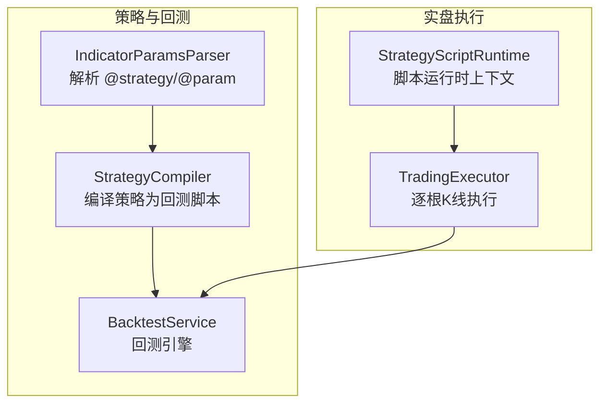
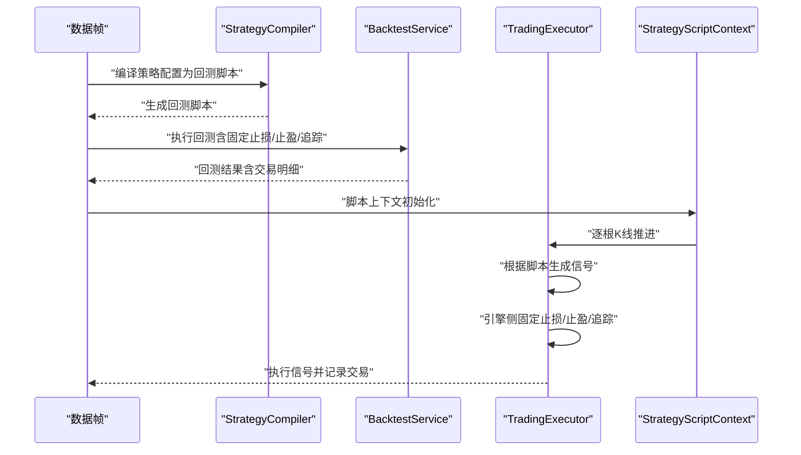
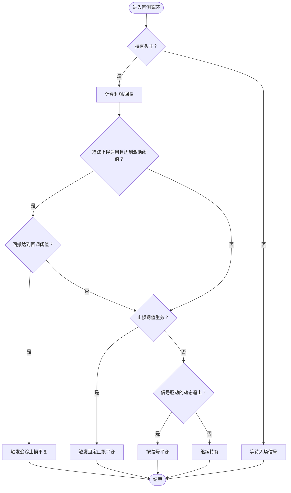
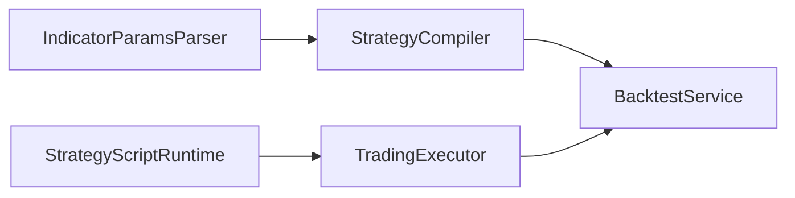

# 退出策略设计

<cite>
**本文引用的文件**
- [strategy.py](file://backend_api_python/app/services/strategy.py)
- [backtest.py](file://backend_api_python/app/services/backtest.py)
- [trading_executor.py](file://backend_api_python/app/services/trading_executor.py)
- [strategy_compiler.py](file://backend_api_python/app/services/strategy_compiler.py)
- [indicator_params.py](file://backend_api_python/app/services/indicator_params.py)
- [strategy_script_runtime.py](file://backend_api_python/app/services/strategy_script_runtime.py)
- [STRATEGY_DEV_GUIDE_CN.md](file://docs/STRATEGY_DEV_GUIDE_CN.md)
- [dual_ma_with_params.py](file://docs/examples/dual_ma_with_params.py)
- [multi_indicator_composite.py](file://docs/examples/multi_indicator_composite.py)
</cite>

## 目录
1. [引言](#引言)
2. [项目结构](#项目结构)
3. [核心组件](#核心组件)
4. [架构总览](#架构总览)
5. [详细组件分析](#详细组件分析)
6. [依赖关系分析](#依赖关系分析)
7. [性能考量](#性能考量)
8. [故障排查指南](#故障排查指南)
9. [结论](#结论)
10. [附录](#附录)

## 引言
本指南聚焦于 IndicatorStrategy 退出策略设计，系统阐述两类退出风格：信号管理式退出与引擎管理式退出的区别、适用场景与最佳实践；详解固定止损止盈的实现与 # @strategy 注释的使用；介绍指标驱动的动态退出策略（如 ATR 止损、移动平均反向）；给出退出策略与入场策略的协调方法，避免冲突与重复计算；强调退出逻辑的清晰性与可读性要求；并总结复杂退出策略的设计模式与性能优化技巧。

## 项目结构
围绕退出策略的关键模块与职责如下：
- 策略编译与回测：将策略配置与指标代码编译为可执行回测脚本，内置固定止损止盈与追踪止损逻辑。
- 实盘执行：在实时逐根 K 线推进中，根据策略脚本生成的信号与平台风控配置，执行引擎侧的固定止损止盈与追踪止损。
- 指标参数解析：解析 # @strategy 注解，提取止盈止损、入场比例、交易方向等策略配置。
- 策略脚本运行时：提供 on_init/on_bar 上下文，支持 buy/sell/close_position 等动作，与回测语义对齐。

图表来源
- [strategy_compiler.py:1-689](file://backend_api_python/app/services/strategy_compiler.py#L1-L689)
- [backtest.py:1-800](file://backend_api_python/app/services/backtest.py#L1-L800)
- [indicator_params.py:1-380](file://backend_api_python/app/services/indicator_params.py#L1-L380)
- [strategy_script_runtime.py:1-191](file://backend_api_python/app/services/strategy_script_runtime.py#L1-L191)
- [trading_executor.py:1-800](file://backend_api_python/app/services/trading_executor.py#L1-L800)

章节来源
- [strategy_compiler.py:1-689](file://backend_api_python/app/services/strategy_compiler.py#L1-L689)
- [backtest.py:1-800](file://backend_api_python/app/services/backtest.py#L1-L800)
- [indicator_params.py:1-380](file://backend_api_python/app/services/indicator_params.py#L1-L380)
- [strategy_script_runtime.py:1-191](file://backend_api_python/app/services/strategy_script_runtime.py#L1-L191)
- [trading_executor.py:1-800](file://backend_api_python/app/services/trading_executor.py#L1-L800)

## 核心组件
- 策略编译器（StrategyCompiler）：将策略配置与指标规则编译为回测脚本，内置固定止损止盈与追踪止损逻辑。
- 回测服务（BacktestService）：执行回测，支持多时间框架、滑点与手续费模拟，内置固定止损止盈与追踪止损优先级判定。
- 实盘执行器（TradingExecutor）：实时逐根 K 线推进，结合策略脚本与平台风控配置，生成并执行信号，同时执行引擎侧的固定止损止盈与追踪止损。
- 指标参数解析（IndicatorParamsParser）：解析 # @strategy 注解，提取止盈止损、入场比例、交易方向等策略配置。
- 策略脚本运行时（StrategyScriptContext）：提供 buy/sell/close_position 等动作，与回测语义对齐。

章节来源
- [strategy_compiler.py:1-689](file://backend_api_python/app/services/strategy_compiler.py#L1-L689)
- [backtest.py:1-800](file://backend_api_python/app/services/backtest.py#L1-L800)
- [trading_executor.py:1-800](file://backend_api_python/app/services/trading_executor.py#L1-L800)
- [indicator_params.py:1-380](file://backend_api_python/app/services/indicator_params.py#L1-L380)
- [strategy_script_runtime.py:1-191](file://backend_api_python/app/services/strategy_script_runtime.py#L1-L191)

## 架构总览
下面以序列图展示回测与实盘两条路径中，固定止损止盈与追踪止损的触发顺序与优先级。

图表来源
- [strategy_compiler.py:1-689](file://backend_api_python/app/services/strategy_compiler.py#L1-L689)
- [backtest.py:1-800](file://backend_api_python/app/services/backtest.py#L1-L800)
- [trading_executor.py:1-800](file://backend_api_python/app/services/trading_executor.py#L1-L800)
- [strategy_script_runtime.py:1-191](file://backend_api_python/app/services/strategy_script_runtime.py#L1-L191)

## 详细组件分析

### 信号管理式退出 vs 引擎管理式退出
- 信号管理式退出：由策略脚本或回测脚本中的 buy/sell 信号决定出场。适合以技术形态或反转信号为主导的策略。
- 引擎管理式退出：由 # @strategy 注解声明的固定止损止盈与追踪止损在引擎侧统一执行，适合希望简化信号逻辑、将风控外置的策略。

最佳实践建议：
- 明确一个“主退出来源”。若核心逻辑是“金叉进，死叉出”，则退出主要由 sell 信号负责；若采用固定 3% 止损 + 6% 止盈，则退出主要由 # @strategy 负责。两者可共存，但需在注释或文档中清晰标注，避免混淆。

章节来源
- [STRATEGY_DEV_GUIDE_CN.md:221-288](file://docs/STRATEGY_DEV_GUIDE_CN.md#L221-L288)
- [dual_ma_with_params.py:24-29](file://docs/examples/dual_ma_with_params.py#L24-L29)
- [multi_indicator_composite.py:26-33](file://docs/examples/multi_indicator_composite.py#L26-L33)

### 固定止损止盈的实现与 # @strategy 注解
- # @strategy 注解解析：支持 stopLossPct、takeProfitPct、entryPct、trailingEnabled、trailingStopPct、trailingActivationPct、tradeDirection 等键，解析后用于风控配置。
- 回测与实盘的固定风控：回测服务与交易执行器均读取风控配置，执行固定止损止盈与追踪止损。
- 风控参数的生效范围：在回测中，固定止盈在追踪止损禁用时生效；在实盘中，引擎侧固定风控与脚本信号共同作用。

章节来源
- [indicator_params.py:26-117](file://backend_api_python/app/services/indicator_params.py#L26-L117)
- [backtest.py:1075-1096](file://backend_api_python/app/services/backtest.py#L1075-L1096)
- [backtest.py:1137-1195](file://backend_api_python/app/services/backtest.py#L1137-L1195)
- [trading_executor.py:1297-1724](file://backend_api_python/app/services/trading_executor.py#L1297-L1724)

### 指标驱动的动态退出策略
- 固定止损止盈与追踪止损：回测脚本与回测服务均实现了固定止损止盈与追踪止损的优先级判定（SL > Trailing > TP），并在滑点与手续费下计算收益。
- ATR 止损：策略编译器内置 SuperTrend 指标计算，可作为动态止损的基础；在回测中可基于 ATR 动态调整止损线。
- 移动平均反向：策略脚本中可利用 MA/EMA 的交叉信号作为动态退出条件，与固定风控协同使用。

图表来源
- [strategy_compiler.py:417-532](file://backend_api_python/app/services/strategy_compiler.py#L417-L532)
- [backtest.py:1075-1096](file://backend_api_python/app/services/backtest.py#L1075-L1096)
- [backtest.py:1137-1195](file://backend_api_python/app/services/backtest.py#L1137-L1195)

章节来源
- [strategy_compiler.py:86-222](file://backend_api_python/app/services/strategy_compiler.py#L86-L222)
- [strategy_compiler.py:417-532](file://backend_api_python/app/services/strategy_compiler.py#L417-L532)
- [backtest.py:1075-1096](file://backend_api_python/app/services/backtest.py#L1075-L1096)
- [backtest.py:1137-1195](file://backend_api_python/app/services/backtest.py#L1137-L1195)

### 退出策略与入场策略的协调
- 一致性原则：回测语义为“读取 df['buy']/df['sell']，信号按 bar close 确认，通常在下一根 bar 开盘价成交”。避免使用 shift(-1) 引入未来函数。
- 主退出来源明确：若以信号驱动为主，应在脚本中明确 sell/buy 信号的退出逻辑；若以引擎固定风控为主，应在 # @strategy 中声明固定止损止盈与追踪止损。
- 避免冲突：当信号与引擎风控同时存在时，需在注释或文档中明确“主退出来源”，并统一优先级（回测中 SL > Trailing > TP）。

章节来源
- [STRATEGY_DEV_GUIDE_CN.md:277-288](file://docs/STRATEGY_DEV_GUIDE_CN.md#L277-L288)
- [backtest.py:2721-2728](file://backend_api_python/app/services/backtest.py#L2721-L2728)

### 退出逻辑的清晰性与可读性
- 文档化要求：在策略脚本中明确标注 # @strategy 的用途与参数含义，说明是信号管理式还是引擎管理式退出。
- 代码可读性标准：变量命名清晰、注释完整、优先级与触发条件明确；在回测与实盘中保持一致的语义与行为。

章节来源
- [STRATEGY_DEV_GUIDE_CN.md:221-288](file://docs/STRATEGY_DEV_GUIDE_CN.md#L221-L288)
- [dual_ma_with_params.py:24-29](file://docs/examples/dual_ma_with_params.py#L24-L29)
- [multi_indicator_composite.py:26-33](file://docs/examples/multi_indicator_composite.py#L26-L33)

### 复杂退出策略的设计模式与性能优化
- 设计模式
  - 分层分离：将信号生成与风控执行分层，信号层负责入场与动态退出，风控层负责固定止损止盈与追踪止损。
  - 组合策略：将多种动态退出条件（如 ATR、MA 反向、RSI 超买超卖）组合，形成稳健的动态退出。
- 性能优化
  - 回测缓存：K 线缓存与索引对齐，减少重复数据加载与重索引开销。
  - 优先级判定：在回测中统一优先级（SL > Trailing > TP），减少多次触发与重复计算。
  - 实盘去重：信号去重缓存，避免同一根 K 线上的重复订单。

章节来源
- [backtest.py:25-61](file://backend_api_python/app/services/backtest.py#L25-L61)
- [backtest.py:2721-2728](file://backend_api_python/app/services/backtest.py#L2721-L2728)
- [trading_executor.py:233-289](file://backend_api_python/app/services/trading_executor.py#L233-L289)

## 依赖关系分析
- 策略编译器依赖指标参数解析器，将 # @strategy 注解转换为回测脚本中的参数。
- 回测服务与交易执行器共享风控配置，分别在回测与实盘中执行固定止损止盈与追踪止损。
- 策略脚本运行时与交易执行器配合，将脚本动作（buy/sell/close_position）转化为信号并执行。

图表来源
- [indicator_params.py:1-380](file://backend_api_python/app/services/indicator_params.py#L1-L380)
- [strategy_compiler.py:1-689](file://backend_api_python/app/services/strategy_compiler.py#L1-L689)
- [backtest.py:1-800](file://backend_api_python/app/services/backtest.py#L1-L800)
- [strategy_script_runtime.py:1-191](file://backend_api_python/app/services/strategy_script_runtime.py#L1-L191)
- [trading_executor.py:1-800](file://backend_api_python/app/services/trading_executor.py#L1-L800)

章节来源
- [indicator_params.py:1-380](file://backend_api_python/app/services/indicator_params.py#L1-L380)
- [strategy_compiler.py:1-689](file://backend_api_python/app/services/strategy_compiler.py#L1-L689)
- [backtest.py:1-800](file://backend_api_python/app/services/backtest.py#L1-L800)
- [strategy_script_runtime.py:1-191](file://backend_api_python/app/services/strategy_script_runtime.py#L1-L191)
- [trading_executor.py:1-800](file://backend_api_python/app/services/trading_executor.py#L1-L800)

## 性能考量
- 回测缓存与索引：K 线缓存与索引对齐，降低重复加载与重索引成本。
- 优先级判定：统一优先级（SL > Trailing > TP），减少多次触发与重复计算。
- 实盘信号去重：同一根 K 线内信号去重，避免重复订单与系统压力。
- 指标计算：在策略编译器中对指标进行高效计算（如 EMA、MACD、RSI、Bollinger Bands、SuperTrend），减少回测与实盘中的重复计算。

章节来源
- [backtest.py:25-61](file://backend_api_python/app/services/backtest.py#L25-L61)
- [backtest.py:2721-2728](file://backend_api_python/app/services/backtest.py#L2721-L2728)
- [trading_executor.py:233-289](file://backend_api_python/app/services/trading_executor.py#L233-L289)
- [strategy_compiler.py:86-222](file://backend_api_python/app/services/strategy_compiler.py#L86-L222)

## 故障排查指南
- 回测与实盘差异：若出现回测与实盘差异，检查是否使用了 shift(-1) 导致未来函数；确认回测语义为“下一根 bar 开盘成交”。
- 风控未生效：检查 # @strategy 注解是否正确解析，确认 stopLossPct、takeProfitPct、trailingEnabled 等参数是否在风控配置中启用。
- 信号与风控冲突：明确主退出来源，避免信号与引擎风控同时触发相同类型的退出，造成重复平仓。
- 爆仓与强平：回测与实盘均考虑爆仓线与强平风险，若出现爆仓，优先检查止损与仓位控制配置。

章节来源
- [STRATEGY_DEV_GUIDE_CN.md:277-288](file://docs/STRATEGY_DEV_GUIDE_CN.md#L277-L288)
- [backtest.py:3494-3573](file://backend_api_python/app/services/backtest.py#L3494-L3573)
- [trading_executor.py:1297-1724](file://backend_api_python/app/services/trading_executor.py#L1297-L1724)

## 结论
退出策略设计应明确主退出来源，合理选择信号管理式或引擎管理式退出风格，并在 # @strategy 中清晰声明固定止损止盈与追踪止损参数。在回测与实盘中保持一致的语义与优先级（SL > Trailing > TP），避免未来函数与信号冲突。通过指标驱动的动态退出策略（如 ATR 止损、移动平均反向）与固定风控相结合，构建稳健的交易系统。最后，注重文档化与代码可读性，配合缓存与优先级判定等性能优化手段，提升策略开发与运行效率。

## 附录
- 示例策略参考
  - 双均线策略（含 # @strategy 默认风控配置）
  - 多指标组合策略（含追踪止损配置）

章节来源
- [dual_ma_with_params.py:24-29](file://docs/examples/dual_ma_with_params.py#L24-L29)
- [multi_indicator_composite.py:26-33](file://docs/examples/multi_indicator_composite.py#L26-L33)