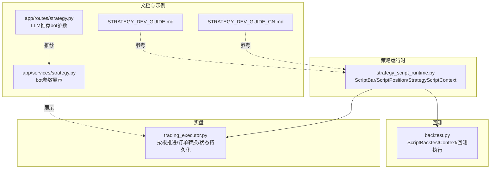
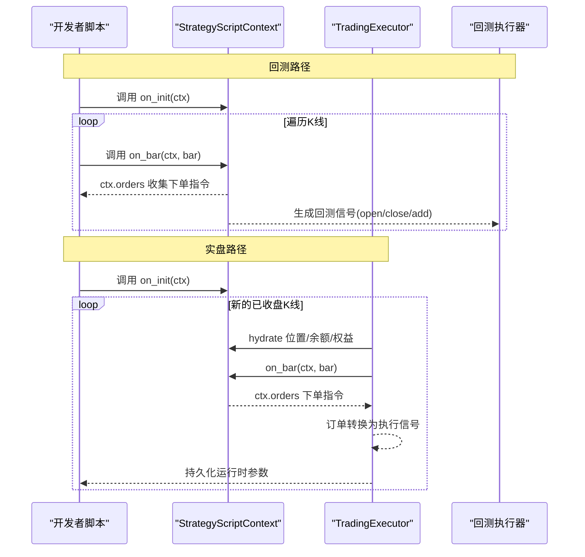
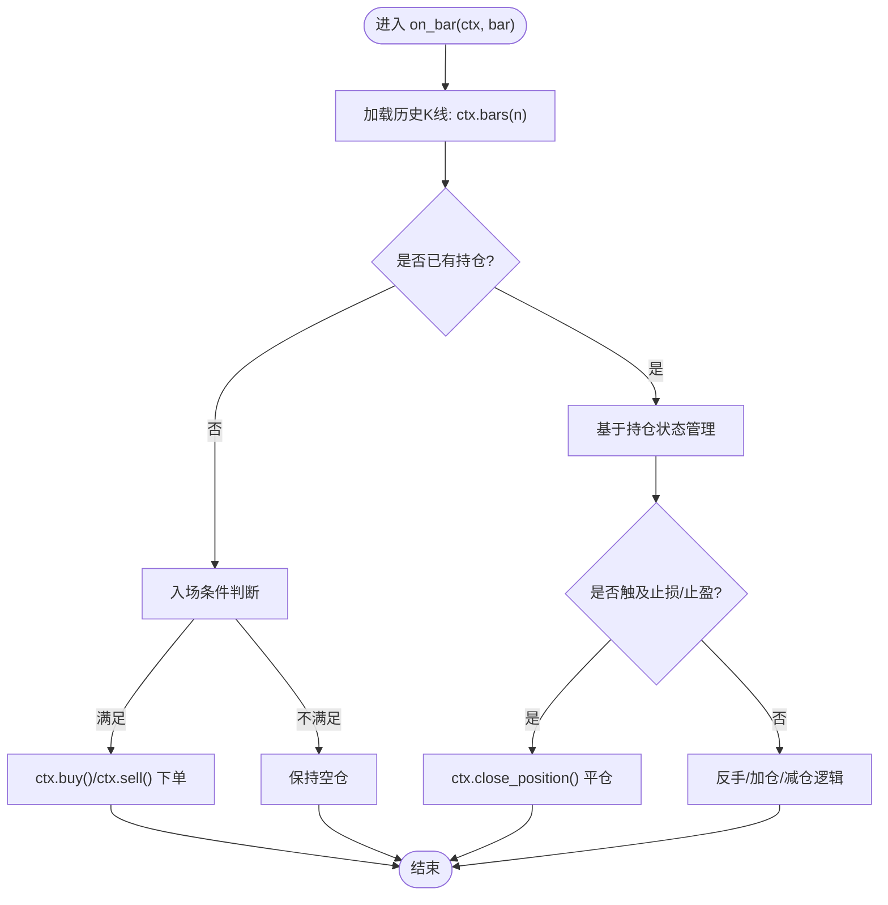
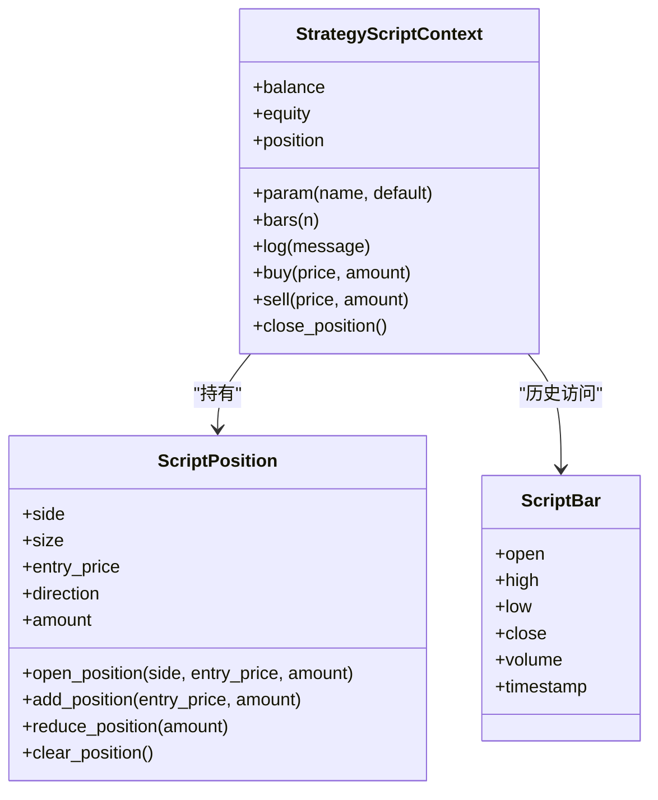
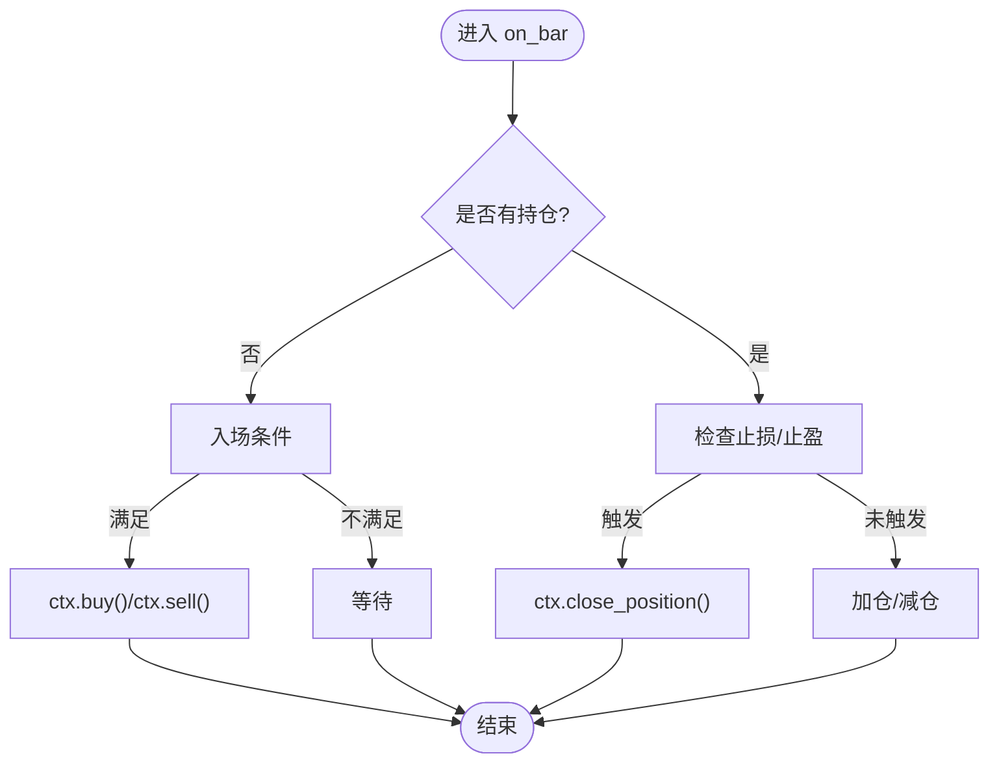
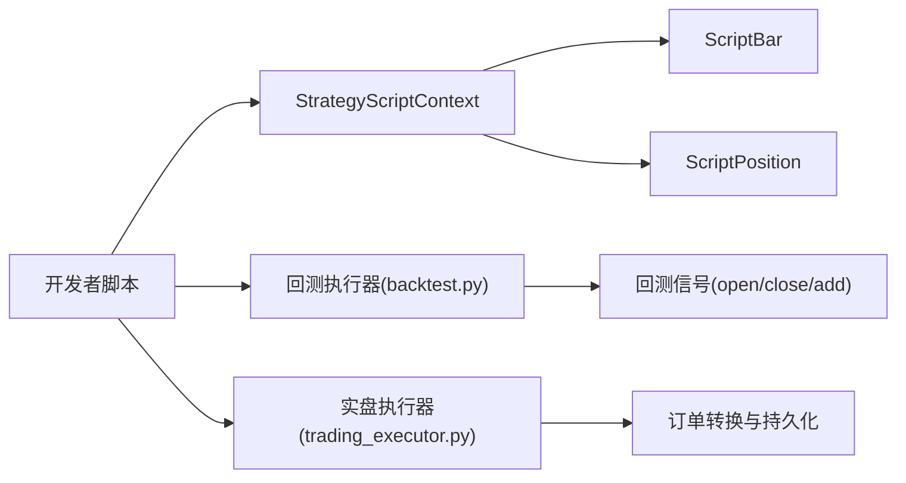

# ScriptStrategy开发

<cite>
**本文引用的文件**
- [strategy_script_runtime.py](file://backend_api_python/app/services/strategy_script_runtime.py)
- [backtest.py](file://backend_api_python/app/services/backtest.py)
- [trading_executor.py](file://backend_api_python/app/services/trading_executor.py)
- [STRATEGY_DEV_GUIDE_CN.md](file://docs/STRATEGY_DEV_GUIDE_CN.md)
- [STRATEGY_DEV_GUIDE.md](file://docs/STRATEGY_DEV_GUIDE.md)
- [strategy.py](file://backend_api_python/app/services/strategy.py)
- [routes/strategy.py](file://backend_api_python/app/routes/strategy.py)
</cite>

## 目录
1. [简介](#简介)
2. [项目结构](#项目结构)
3. [核心组件](#核心组件)
4. [架构总览](#架构总览)
5. [详细组件分析](#详细组件分析)
6. [依赖关系分析](#依赖关系分析)
7. [性能考量](#性能考量)
8. [故障排查指南](#故障排查指南)
9. [结论](#结论)
10. [附录](#附录)

## 简介
本指南面向策略开发者，系统讲解基于事件驱动的 ScriptStrategy 策略开发方法，覆盖以下主题：
- 事件驱动框架：on_init(ctx) 与 on_bar(ctx, bar) 的职责与实现要点
- 上下文对象 ctx 的可用属性与方法：参数获取、历史数据访问、位置状态检查、买卖下单与日志记录
- 运行时状态管理：参数持久化、订单队列、位置状态演进
- 高级功能：动态止损止盈、部分平仓、金字塔加仓
- bot 模式与普通模式：运行语义差异与适用场景
- 完整开发示例：基于位置状态的交易逻辑、动态风险管理和平仓策略

## 项目结构
围绕 ScriptStrategy 的核心实现位于后端服务模块，主要包括：
- 策略运行时与上下文：strategy_script_runtime.py
- 回测执行器：backtest.py
- 实盘执行器：trading_executor.py
- 开发指南与示例：docs/STRATEGY_DEV_GUIDE_CN.md、docs/STRATEGY_DEV_GUIDE.md
- bot 类型与参数展示：app/services/strategy.py、app/routes/strategy.py

**图示来源**
- [strategy_script_runtime.py:17-156](file://backend_api_python/app/services/strategy_script_runtime.py#L17-L156)
- [backtest.py:2047-2182](file://backend_api_python/app/services/backtest.py#L2047-L2182)
- [trading_executor.py:719-773](file://backend_api_python/app/services/trading_executor.py#L719-L773)
- [STRATEGY_DEV_GUIDE_CN.md:595-780](file://docs/STRATEGY_DEV_GUIDE_CN.md#L595-L780)
- [STRATEGY_DEV_GUIDE.md:595-780](file://docs/STRATEGY_DEV_GUIDE.md#L595-L780)
- [strategy.py:734-775](file://backend_api_python/app/services/strategy.py#L734-L775)
- [routes/strategy.py:1622-1654](file://backend_api_python/app/routes/strategy.py#L1622-L1654)

**章节来源**
- [strategy_script_runtime.py:17-156](file://backend_api_python/app/services/strategy_script_runtime.py#L17-L156)
- [backtest.py:2047-2182](file://backend_api_python/app/services/backtest.py#L2047-L2182)
- [trading_executor.py:719-773](file://backend_api_python/app/services/trading_executor.py#L719-L773)
- [STRATEGY_DEV_GUIDE_CN.md:595-780](file://docs/STRATEGY_DEV_GUIDE_CN.md#L595-L780)
- [STRATEGY_DEV_GUIDE.md:595-780](file://docs/STRATEGY_DEV_GUIDE.md#L595-L780)
- [strategy.py:734-775](file://backend_api_python/app/services/strategy.py#L734-L775)
- [routes/strategy.py:1622-1654](file://backend_api_python/app/routes/strategy.py#L1622-L1654)

## 核心组件
- ScriptBar：封装单根K线字段，支持属性访问，包含开盘、最高、最低、收盘、成交量、时间戳等。
- ScriptPosition：封装位置状态，支持布尔判断、数值比较、开仓、加仓、减仓、清仓等操作。
- StrategyScriptContext：策略上下文，提供参数注册与读取、历史K线访问、日志记录、下单指令收集、余额与权益查询。

上述组件在回测与实盘执行器中保持行为一致，确保策略逻辑可移植。

**章节来源**
- [strategy_script_runtime.py:17-156](file://backend_api_python/app/services/strategy_script_runtime.py#L17-L156)
- [backtest.py:2047-2182](file://backend_api_python/app/services/backtest.py#L2047-L2182)

## 架构总览
ScriptStrategy 的执行流程分为“回测”和“实盘”两条主线，二者共享相同的上下文与数据结构。

**图示来源**
- [backtest.py:2184-2250](file://backend_api_python/app/services/backtest.py#L2184-L2250)
- [trading_executor.py:719-773](file://backend_api_python/app/services/trading_executor.py#L719-L773)
- [strategy_script_runtime.py:114-156](file://backend_api_python/app/services/strategy_script_runtime.py#L114-L156)

## 详细组件分析

### 上下文对象 ctx 的可用属性与方法
- 参数管理
  - ctx.param(name, default=None)：注册并读取脚本级默认参数，未设置时使用默认值。
- 历史数据访问
  - ctx.bars(n=1)：返回最近 n 根 K 线（ScriptBar 列表），支持滑窗访问。
- 位置状态检查
  - ctx.position：ScriptPosition，支持：
    - 布尔判断：非空仓即为真
    - 数值比较：支持 >、<、== 等，依据方向值判断
    - 字段访问：side、size、entry_price、direction、amount
- 买卖下单与日志
  - ctx.buy(price=None, amount=None)、ctx.sell(price=None, amount=None)：记录下单指令
  - ctx.close_position()：记录平仓指令
  - ctx.log(message)：记录日志
- 账户信息
  - ctx.balance、ctx.equity：账户余额与权益

注意：
- amount 在实盘回测中主要受“规范化交易配置”影响，ctx.buy/sell 的 amount 更偏向“运行时下单意图”。
- 若需明确“全部平仓”，优先使用 ctx.close_position()。

**章节来源**
- [strategy_script_runtime.py:114-156](file://backend_api_python/app/services/strategy_script_runtime.py#L114-L156)
- [backtest.py:2142-2182](file://backend_api_python/app/services/backtest.py#L2142-L2182)
- [STRATEGY_DEV_GUIDE_CN.md:606-622](file://docs/STRATEGY_DEV_GUIDE_CN.md#L606-L622)
- [STRATEGY_DEV_GUIDE.md:606-622](file://docs/STRATEGY_DEV_GUIDE.md#L606-L622)

### on_init(ctx) 与 on_bar(ctx, bar) 的实现要点
- on_init(ctx)
  - 用途：初始化参数、打印日志、准备运行时状态
  - 建议：即使为空也保留该函数，保证产品侧校验通过
- on_bar(ctx, bar)
  - 用途：逐根K线决策，读取历史、检查位置、发出下单指令
  - 关键：在已收盘K线语义下推进，避免未来函数

**图示来源**
- [strategy_script_runtime.py:114-156](file://backend_api_python/app/services/strategy_script_runtime.py#L114-L156)
- [backtest.py:2214-2250](file://backend_api_python/app/services/backtest.py#L2214-L2250)

**章节来源**
- [STRATEGY_DEV_GUIDE_CN.md:582-622](file://docs/STRATEGY_DEV_GUIDE_CN.md#L582-L622)
- [STRATEGY_DEV_GUIDE.md:582-622](file://docs/STRATEGY_DEV_GUIDE.md#L582-L622)

### 运行时状态管理与参数持久化
- 参数持久化
  - 实盘执行器在每根已收盘K线结束后，将 ctx._params 持久化到策略运行时状态，供后续K线恢复使用。
- 位置状态演进
  - ScriptPosition 提供 open_position、add_position、reduce_position、clear_position 等方法，支持金字塔加仓与部分减仓。
- 订单队列
  - ctx._orders 为下单指令列表，按顺序转换为执行信号。

**图示来源**
- [strategy_script_runtime.py:114-156](file://backend_api_python/app/services/strategy_script_runtime.py#L114-L156)

**章节来源**
- [trading_executor.py:719-773](file://backend_api_python/app/services/trading_executor.py#L719-L773)
- [strategy_script_runtime.py:25-112](file://backend_api_python/app/services/strategy_script_runtime.py#L25-L112)

### 动态止损止盈、部分平仓与金字塔加仓
- 动态止损止盈
  - 基于 ctx.position.entry_price 与当前 bar.close 动态判断，满足条件则平仓。
- 部分平仓
  - 使用 ScriptPosition.reduce_position(amount) 或在下单时使用 ctx.sell(price, amount) 指定部分数量。
- 金字塔加仓
  - 使用 ScriptPosition.add_position(entry_price, amount) 或在同方向上再次 ctx.buy() 实现。

**图示来源**
- [strategy_script_runtime.py:73-112](file://backend_api_python/app/services/strategy_script_runtime.py#L73-L112)
- [backtest.py:2115-2141](file://backend_api_python/app/services/backtest.py#L2115-L2141)

**章节来源**
- [strategy_script_runtime.py:73-112](file://backend_api_python/app/services/strategy_script_runtime.py#L73-L112)
- [backtest.py:2115-2141](file://backend_api_python/app/services/backtest.py#L2115-L2141)

### bot 模式与普通模式的区别与使用场景
- 普通模式（已收盘K线）
  - 引擎在 bar 确认收盘后调用 on_bar(ctx, bar)，适合标准策略回测与逐根实盘。
- bot 模式（类tick驱动）
  - 引擎可能基于最新价格构造“类tick的伪bar”反复调用 on_bar，适合网格、DCA 等机器人风格策略。
- 适用建议
  - 若策略逻辑依赖实时价格波动与高频调整，考虑 bot 模式；否则优先使用普通模式。

**章节来源**
- [STRATEGY_DEV_GUIDE_CN.md:689-701](file://docs/STRATEGY_DEV_GUIDE_CN.md#L689-L701)
- [STRATEGY_DEV_GUIDE.md:689-701](file://docs/STRATEGY_DEV_GUIDE.md#L689-L701)
- [trading_executor.py:1162-1182](file://backend_api_python/app/services/trading_executor.py#L1162-L1182)

### 完整开发示例（步骤化说明）
以下示例展示如何实现“基于位置状态的交易逻辑、动态风险管理与平仓策略”。请按步骤完成：
1. 定义 on_init(ctx) 与 on_bar(ctx, bar)
2. 在 on_init 中使用 ctx.param 注册默认参数（如均线周期、风险比例、是否允许做空等）
3. 在 on_bar 中：
   - 使用 ctx.bars 获取历史K线，计算技术指标
   - 基于 ctx.position 决策：空仓、加仓、反手、减仓或全部平仓
   - 使用 ctx.buy/ctx.sell/ctx.close_position 发出指令
4. 在回测或实盘中验证参数与信号一致性，必要时通过“保存后的策略回测”核对仓位暴露

提示：
- 将“默认风控参数”放入保存后的策略配置（如 entryPct、stopLossPct、takeProfitPct），而非脚本内硬编码。
- “amount”更适合作为“运行时下单意图”，最终回测/实盘的仓位仍主要由规范化交易配置决定。

**章节来源**
- [STRATEGY_DEV_GUIDE_CN.md:637-780](file://docs/STRATEGY_DEV_GUIDE_CN.md#L637-L780)
- [STRATEGY_DEV_GUIDE.md:637-780](file://docs/STRATEGY_DEV_GUIDE.md#L637-L780)

## 依赖关系分析
ScriptStrategy 的核心依赖关系如下：

**图示来源**
- [strategy_script_runtime.py:17-156](file://backend_api_python/app/services/strategy_script_runtime.py#L17-L156)
- [backtest.py:2047-2182](file://backend_api_python/app/services/backtest.py#L2047-L2182)
- [trading_executor.py:600-618](file://backend_api_python/app/services/trading_executor.py#L600-L618)

**章节来源**
- [strategy_script_runtime.py:17-156](file://backend_api_python/app/services/strategy_script_runtime.py#L17-L156)
- [backtest.py:2047-2182](file://backend_api_python/app/services/backtest.py#L2047-L2182)
- [trading_executor.py:600-618](file://backend_api_python/app/services/trading_executor.py#L600-L618)

## 性能考量
- 历史K线访问：ctx.bars(n) 为 O(n) 遍历，建议在 on_bar 中限制 n 的规模，避免过长滑窗导致计算开销过大。
- 订单队列：ctx._orders 为简单列表，下单指令较少时开销可忽略；若频繁下单，建议合并指令或减少调用频率。
- 位置状态演进：add_position/reduce_position 为轻量计算，但需注意浮点精度与清仓阈值（如 1e-12）。

[本节为通用建议，无需特定文件来源]

## 故障排查指南
- 缺少 on_bar
  - 现象：策略编译失败，提示必须定义 on_bar(ctx, bar)
  - 处理：确保脚本中存在 on_bar 函数
- 未正确平仓
  - 现象：多头仍持有但规则应平仓
  - 处理：确认使用 ctx.close_position() 明确全平；避免隐式解释
- 金额与回测不一致
  - 现象：脚本 amount 与最终回测仓位不符
  - 处理：amount 更偏向“意图”，最终仓位由“规范化交易配置”主导；通过保存后的策略回测核对
- bot 模式与普通模式混淆
  - 现象：bot 模式下频繁触发，与预期不符
  - 处理：区分 bot 与普通模式，分别测试与验证

**章节来源**
- [backtest.py:2203-2208](file://backend_api_python/app/services/backtest.py#L2203-L2208)
- [STRATEGY_DEV_GUIDE_CN.md:774-780](file://docs/STRATEGY_DEV_GUIDE_CN.md#L774-L780)
- [STRATEGY_DEV_GUIDE.md:774-780](file://docs/STRATEGY_DEV_GUIDE.md#L774-L780)

## 结论
ScriptStrategy 通过 on_init/on_bar 的事件驱动模型，将“参数管理、历史访问、位置状态、下单意图”整合到统一上下文对象中，既适用于回测验证，也可落地到实盘执行。建议：
- 优先采用普通模式（已收盘K线）进行策略开发与验证
- 将风控参数与仓位配置放入保存后的策略配置，脚本内仅保留必要的运行时参数
- 使用 ctx.close_position() 明确全平，避免歧义
- 在 bot 模式下谨慎设计高频触发逻辑，确保与预期一致

[本节为总结，无需特定文件来源]

## 附录
- bot 类型与参数展示：网格、DCA、趋势跟踪等类型的参数与界面展示
- LLM 推荐 bot 参数：基于实时市场数据推荐最优参数与配置

**章节来源**
- [strategy.py:734-775](file://backend_api_python/app/services/strategy.py#L734-L775)
- [routes/strategy.py:1622-1654](file://backend_api_python/app/routes/strategy.py#L1622-L1654)