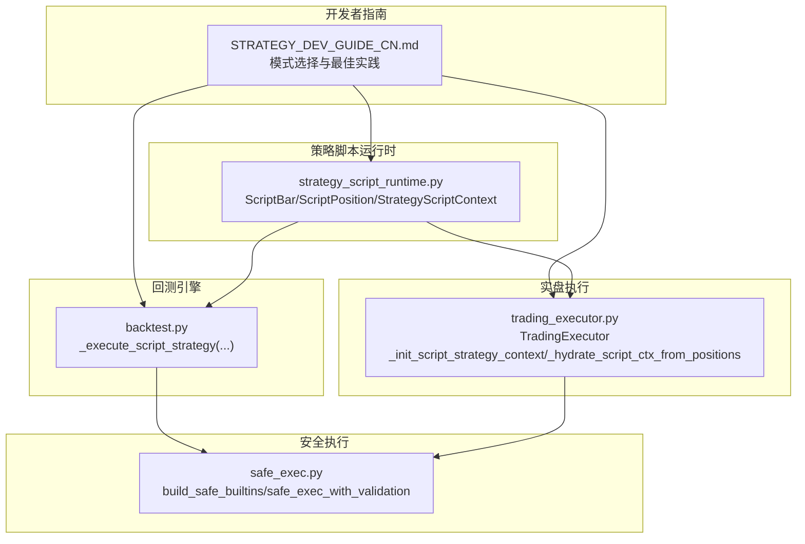
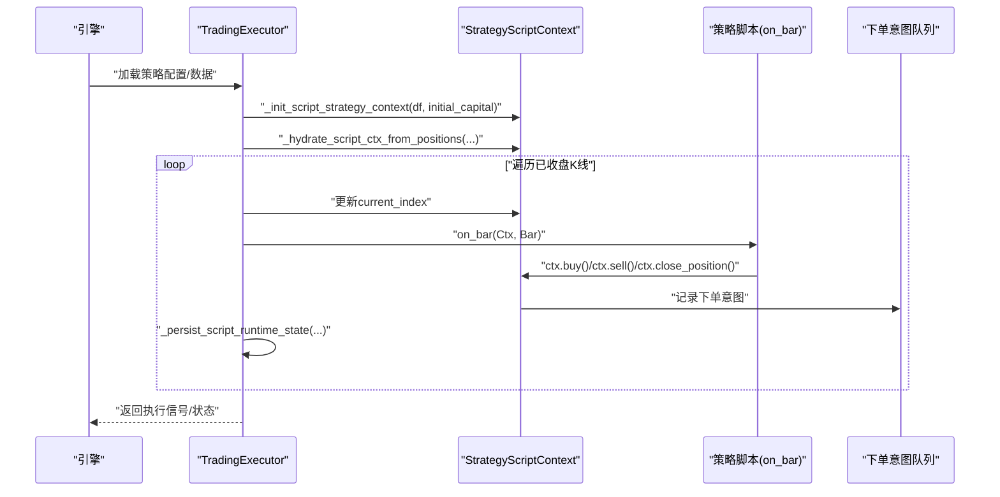
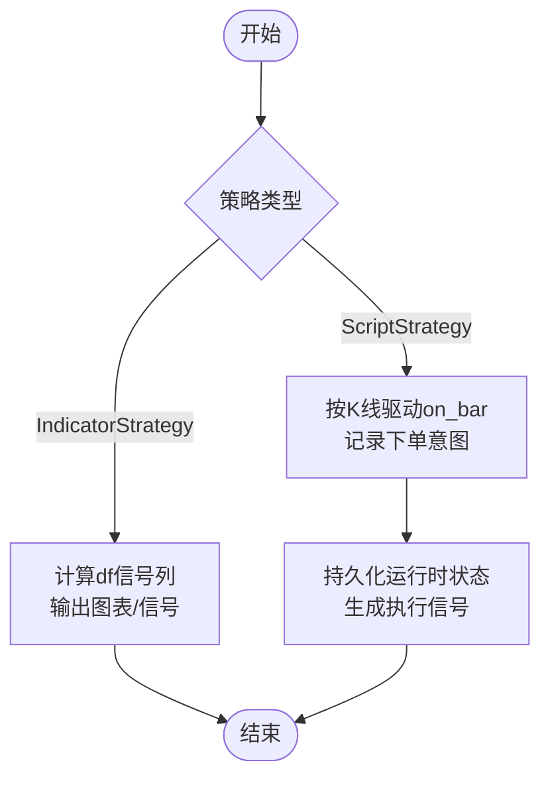
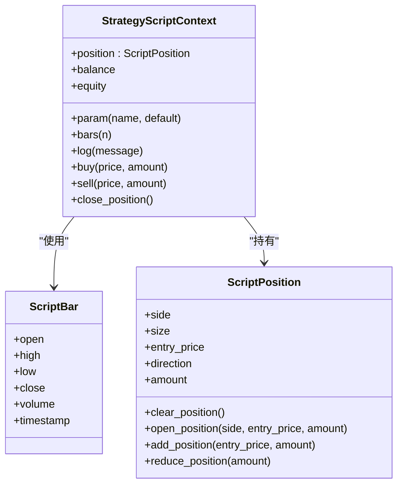
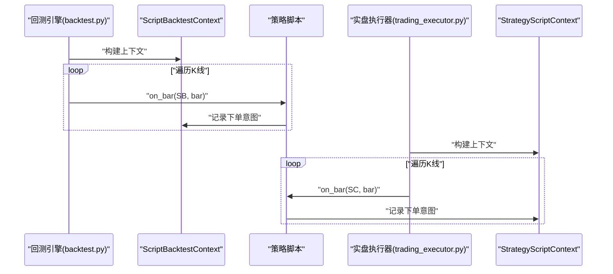
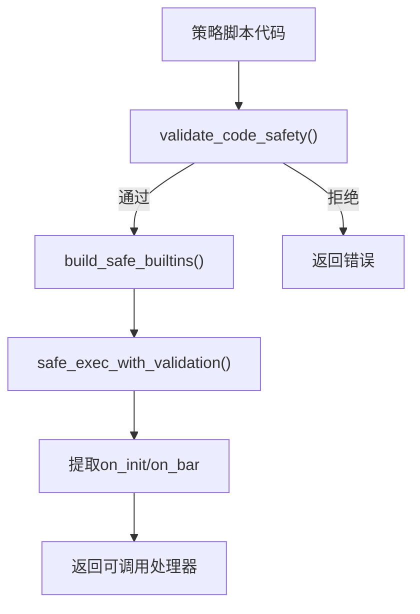
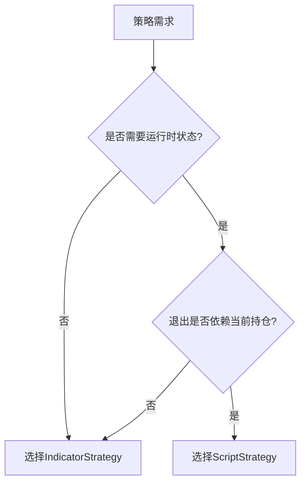
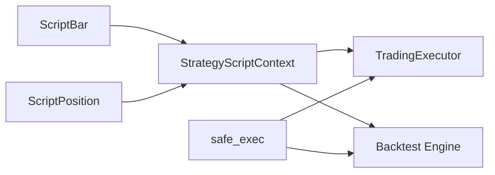

# ScriptStrategy核心概念

<cite>
**本文引用的文件**
- [strategy_script_runtime.py](file://backend_api_python/app/services/strategy_script_runtime.py)
- [trading_executor.py](file://backend_api_python/app/services/trading_executor.py)
- [backtest.py](file://backend_api_python/app/services/backtest.py)
- [safe_exec.py](file://backend_api_python/app/utils/safe_exec.py)
- [STRATEGY_DEV_GUIDE_CN.md](file://docs/STRATEGY_DEV_GUIDE_CN.md)
- [strategy.py](file://backend_api_python/app/routes/strategy.py)
- [indicator.py](file://backend_api_python/app/routes/indicator.py)
- [dual_ma_with_params.py](file://docs/examples/dual_ma_with_params.py)
- [cross_sectional_momentum_rsi.py](file://docs/examples/cross_sectional_momentum_rsi.py)
</cite>

## 目录
1. [引言](#引言)
2. [项目结构](#项目结构)
3. [核心组件](#核心组件)
4. [架构总览](#架构总览)
5. [详细组件分析](#详细组件分析)
6. [依赖关系分析](#依赖关系分析)
7. [性能考量](#性能考量)
8. [故障排查指南](#故障排查指南)
9. [结论](#结论)
10. [附录](#附录)

## 引言
本文件围绕ScriptStrategy核心概念展开，系统阐述事件驱动编程模型与IndicatorStrategy的根本差异，解释ScriptStrategy的适用场景、优势与最佳实践，并提供策略开发心理模型的思维转换路径。我们将从数据流、执行时机与状态管理三个维度对比两类策略，辅以架构与流程图，帮助开发者在何时选择ScriptStrategy时做出正确决策。

## 项目结构
本项目后端以服务化方式组织策略执行与回测逻辑，ScriptStrategy相关能力集中在以下模块：
- 策略脚本运行时与上下文：strategy_script_runtime.py
- 实盘执行器：trading_executor.py
- 回测引擎：backtest.py
- 代码安全执行：safe_exec.py
- 开发者指南：STRATEGY_DEV_GUIDE_CN.md
- 路由入口：routes下的策略与指标路由

**图表来源**
- [strategy_script_runtime.py:17-191](file://backend_api_python/app/services/strategy_script_runtime.py#L17-L191)
- [backtest.py:2031-2277](file://backend_api_python/app/services/backtest.py#L2031-L2277)
- [trading_executor.py:536-796](file://backend_api_python/app/services/trading_executor.py#L536-L796)
- [safe_exec.py:74-244](file://backend_api_python/app/utils/safe_exec.py#L74-L244)
- [STRATEGY_DEV_GUIDE_CN.md:1-1270](file://docs/STRATEGY_DEV_GUIDE_CN.md#L1-L1270)

**章节来源**
- [strategy_script_runtime.py:1-191](file://backend_api_python/app/services/strategy_script_runtime.py#L1-L191)
- [backtest.py:2031-2277](file://backend_api_python/app/services/backtest.py#L2031-L2277)
- [trading_executor.py:1-200](file://backend_api_python/app/services/trading_executor.py#L1-L200)
- [safe_exec.py:74-244](file://backend_api_python/app/utils/safe_exec.py#L74-L244)
- [STRATEGY_DEV_GUIDE_CN.md:1-1270](file://docs/STRATEGY_DEV_GUIDE_CN.md#L1-L1270)

## 核心组件
- ScriptBar：封装K线字段，提供属性访问，作为on_bar接收的bar对象。
- ScriptPosition：封装持仓状态（side/size/entry_price/direction/amount），提供开仓、加仓、减仓、平仓等操作。
- StrategyScriptContext：策略运行时上下文，提供参数读取、历史K线访问、日志、下单意图记录与账户余额/权益快照。
- ScriptBacktestContext：回测专用上下文，行为与实盘上下文对齐，用于策略脚本回测。
- TradingExecutor：实盘执行器，按已收盘K线驱动on_bar，收集下单意图并持久化运行时状态。
- safe_exec：构建受限内置与白名单导入，执行带超时与内存限制的安全沙盒执行。

**章节来源**
- [strategy_script_runtime.py:17-191](file://backend_api_python/app/services/strategy_script_runtime.py#L17-L191)
- [backtest.py:2142-2183](file://backend_api_python/app/services/backtest.py#L2142-L2183)
- [trading_executor.py:536-796](file://backend_api_python/app/services/trading_executor.py#L536-L796)
- [safe_exec.py:74-244](file://backend_api_python/app/utils/safe_exec.py#L74-L244)

## 架构总览
ScriptStrategy采用事件驱动模型：引擎在每根K线收盘后调用策略脚本的on_bar，脚本通过ctx记录下单意图，引擎将其转化为执行信号并持久化运行时状态。

**图表来源**
- [trading_executor.py:536-796](file://backend_api_python/app/services/trading_executor.py#L536-L796)
- [strategy_script_runtime.py:114-157](file://backend_api_python/app/services/strategy_script_runtime.py#L114-L157)

**章节来源**
- [trading_executor.py:536-796](file://backend_api_python/app/services/trading_executor.py#L536-L796)
- [strategy_script_runtime.py:114-157](file://backend_api_python/app/services/strategy_script_runtime.py#L114-L157)

## 详细组件分析

### 事件驱动模型与IndicatorStrategy的差异
- 数据流
  - IndicatorStrategy：在回测/指标IDE中一次性计算df上的指标与信号列，输出图表与信号。
  - ScriptStrategy：按K线逐根推进，on_bar在每根K线收盘后被调用，脚本通过ctx读取当前bar与历史K线，记录下单意图。
- 执行时机
  - IndicatorStrategy：信号确认与成交语义由引擎统一处理（如next-bar-open）。
  - ScriptStrategy：on_bar在K线确认收盘后触发，下单意图在当前K线结束后生效，引擎据此生成执行信号。
- 状态管理
  - IndicatorStrategy：无运行时状态，仅依赖历史序列与默认策略配置。
  - ScriptStrategy：通过ctx.position与上下文持久化，支持动态止盈止损、分批加减仓、冷却期与机器人式执行。

**图表来源**
- [STRATEGY_DEV_GUIDE_CN.md:24-56](file://docs/STRATEGY_DEV_GUIDE_CN.md#L24-L56)
- [backtest.py:2214-2272](file://backend_api_python/app/services/backtest.py#L2214-L2272)
- [trading_executor.py:775-796](file://backend_api_python/app/services/trading_executor.py#L775-L796)

**章节来源**
- [STRATEGY_DEV_GUIDE_CN.md:24-56](file://docs/STRATEGY_DEV_GUIDE_CN.md#L24-L56)
- [backtest.py:2214-2272](file://backend_api_python/app/services/backtest.py#L2214-L2272)
- [trading_executor.py:775-796](file://backend_api_python/app/services/trading_executor.py#L775-L796)

### ScriptBar与ScriptPosition
- ScriptBar：提供open/high/low/close/volume/timestamp等字段的属性访问，便于脚本直接读取当前K线。
- ScriptPosition：提供clear_position/open_position/add_position/reduce_position等方法，支持多空方向、平均成本与数量管理。

**图表来源**
- [strategy_script_runtime.py:17-157](file://backend_api_python/app/services/strategy_script_runtime.py#L17-L157)

**章节来源**
- [strategy_script_runtime.py:17-157](file://backend_api_python/app/services/strategy_script_runtime.py#L17-L157)

### 回测与实盘的上下文一致性
- 回测：ScriptBacktestContext与StrategyScriptContext行为一致，确保脚本在回测与实盘中的运行时体验一致。
- 实盘：TradingExecutor按已收盘K线推进，调用on_bar并收集下单意图，同时持久化运行时状态（参数、最后收盘K线时间戳）。

**图表来源**
- [backtest.py:2142-2272](file://backend_api_python/app/services/backtest.py#L2142-L2272)
- [trading_executor.py:536-796](file://backend_api_python/app/services/trading_executor.py#L536-L796)
- [strategy_script_runtime.py:114-157](file://backend_api_python/app/services/strategy_script_runtime.py#L114-L157)

**章节来源**
- [backtest.py:2142-2272](file://backend_api_python/app/services/backtest.py#L2142-L2272)
- [trading_executor.py:536-796](file://backend_api_python/app/services/trading_executor.py#L536-L796)
- [strategy_script_runtime.py:114-157](file://backend_api_python/app/services/strategy_script_runtime.py#L114-L157)

### 代码安全执行与编译
- safe_exec：构建受限内置与白名单导入，执行带超时与内存限制的沙盒执行，保证用户脚本安全。
- 编译：compile_strategy_script_handlers确保on_bar存在，on_init可选，必要时进行校验。

**图表来源**
- [safe_exec.py:207-244](file://backend_api_python/app/utils/safe_exec.py#L207-L244)
- [strategy_script_runtime.py:159-191](file://backend_api_python/app/services/strategy_script_runtime.py#L159-L191)

**章节来源**
- [safe_exec.py:74-244](file://backend_api_python/app/utils/safe_exec.py#L74-L244)
- [strategy_script_runtime.py:159-191](file://backend_api_python/app/services/strategy_script_runtime.py#L159-L191)

### 适用场景与选择建议
- 何时选择ScriptStrategy
  - 需要运行时状态（如动态止损、分批加减仓、冷却期）。
  - 退出逻辑依赖当前持仓状态而非仅历史序列。
  - 需要机器人式执行或bot风格策略。
- 何时选择IndicatorStrategy
  - 以信号驱动为主，固定默认风控即可。
  - 仅需图表与信号型回测，无需运行时状态。

**图表来源**
- [STRATEGY_DEV_GUIDE_CN.md:75-91](file://docs/STRATEGY_DEV_GUIDE_CN.md#L75-L91)

**章节来源**
- [STRATEGY_DEV_GUIDE_CN.md:75-91](file://docs/STRATEGY_DEV_GUIDE_CN.md#L75-L91)

## 依赖关系分析
- StrategyScriptContext依赖ScriptBar与ScriptPosition，提供参数、历史K线、日志与下单意图接口。
- TradingExecutor依赖StrategyScriptContext与safe_exec，按K线推进策略并持久化状态。
- 回测引擎在沙盒内执行策略脚本，产出执行信号序列，与实盘上下文保持一致。

**图表来源**
- [strategy_script_runtime.py:17-157](file://backend_api_python/app/services/strategy_script_runtime.py#L17-L157)
- [trading_executor.py:536-796](file://backend_api_python/app/services/trading_executor.py#L536-L796)
- [backtest.py:2031-2277](file://backend_api_python/app/services/backtest.py#L2031-L2277)
- [safe_exec.py:74-244](file://backend_api_python/app/utils/safe_exec.py#L74-L244)

**章节来源**
- [strategy_script_runtime.py:17-157](file://backend_api_python/app/services/strategy_script_runtime.py#L17-L157)
- [trading_executor.py:536-796](file://backend_api_python/app/services/trading_executor.py#L536-L796)
- [backtest.py:2031-2277](file://backend_api_python/app/services/backtest.py#L2031-L2277)
- [safe_exec.py:74-244](file://backend_api_python/app/utils/safe_exec.py#L74-L244)

## 性能考量
- 沙盒执行：safe_exec设置超时与内存限制，避免策略脚本长时间占用资源。
- K线推进：TradingExecutor按已收盘K线驱动，减少重复信号与无效计算。
- 状态持久化：运行时状态（参数、最后收盘K线时间戳）按K线推进持久化，降低重启后状态丢失风险。

[本节为通用指导，不直接分析具体文件]

## 故障排查指南
- 缺少必需函数：确保脚本定义on_bar；UI校验器可能要求同时存在on_init。
- 代码安全：违反安全策略的代码会被拒绝执行。
- 图表长度不一致：确保所有plot与signal数组长度与df一致。
- 回测结果异常：检查是否误用未来数据、信号是否边缘触发、是否混用信号退出与引擎退出。

**章节来源**
- [STRATEGY_DEV_GUIDE_CN.md:840-881](file://docs/STRATEGY_DEV_GUIDE_CN.md#L840-L881)
- [safe_exec.py:207-244](file://backend_api_python/app/utils/safe_exec.py#L207-L244)

## 结论
ScriptStrategy通过事件驱动模型与运行时状态管理，弥补了IndicatorStrategy在动态执行、动态风控与机器人式策略方面的不足。开发者应基于“是否需要运行时状态”与“退出是否依赖当前持仓”进行选择，并遵循最佳实践以获得稳定可靠的回测与实盘表现。

[本节为总结性内容，不直接分析具体文件]

## 附录
- 开发者指南与示例
  - 双均线策略示例展示了参数与默认策略配置的标准写法。
  - 截面策略示例展示了跨标的评分与排序思路，当前平台文档明确cross_sectional不在主策略快照回测/实盘链路中。

**章节来源**
- [dual_ma_with_params.py:1-64](file://docs/examples/dual_ma_with_params.py#L1-L64)
- [cross_sectional_momentum_rsi.py:1-71](file://docs/examples/cross_sectional_momentum_rsi.py#L1-L71)
- [STRATEGY_DEV_GUIDE_CN.md:1-1270](file://docs/STRATEGY_DEV_GUIDE_CN.md#L1-L1270)