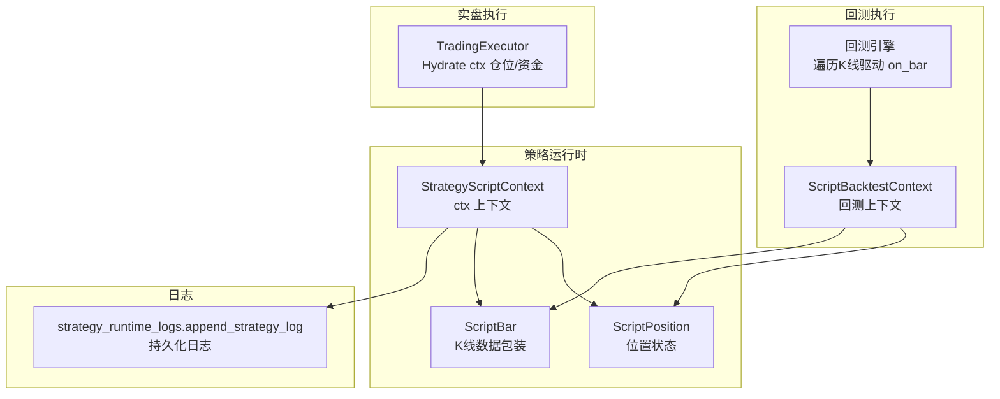
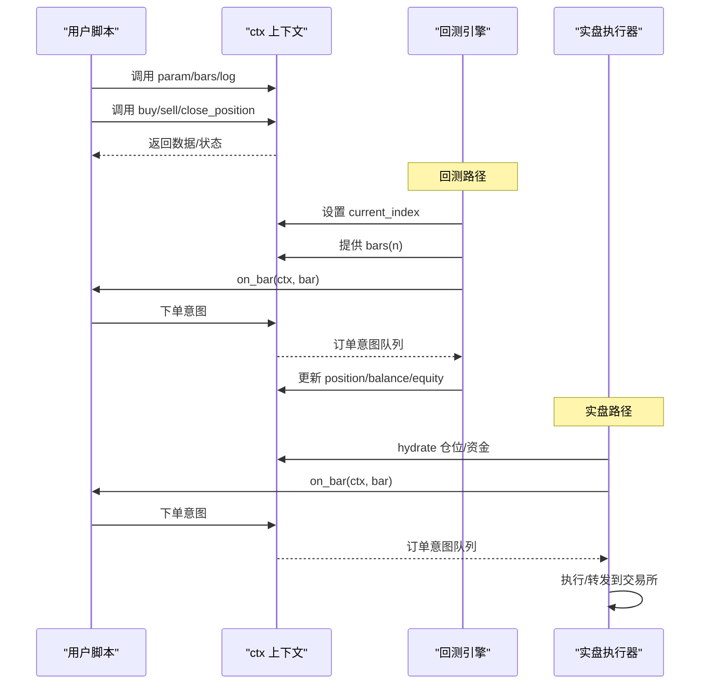
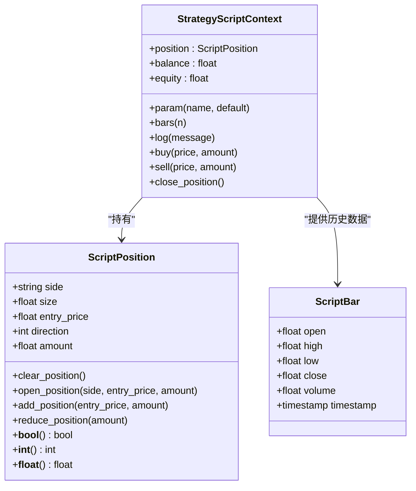
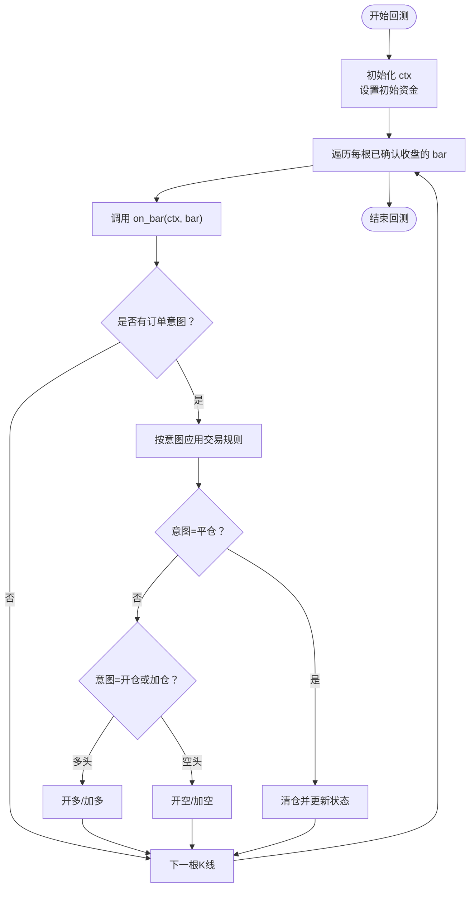
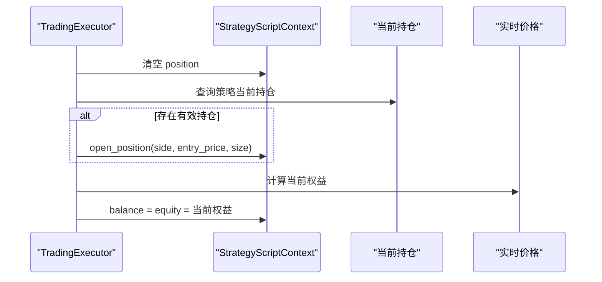
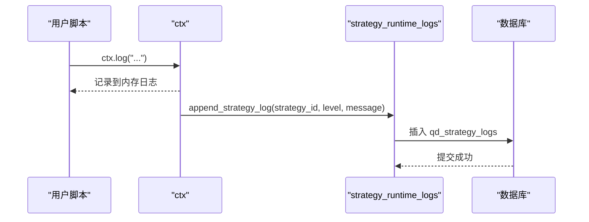
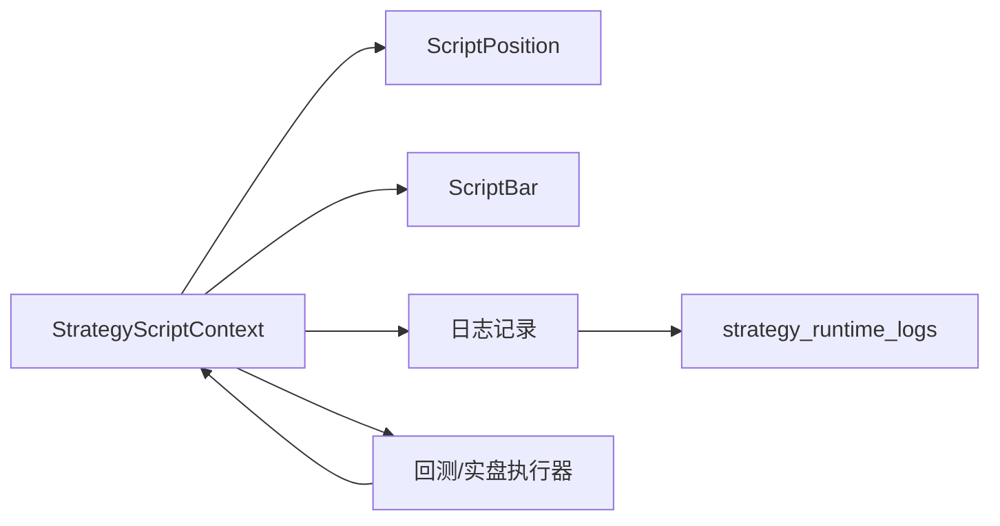

# 上下文对象使用

<cite>
**本文引用的文件**
- [backend_api_python/app/services/strategy_script_runtime.py](file://backend_api_python/app/services/strategy_script_runtime.py)
- [backend_api_python/app/services/backtest.py](file://backend_api_python/app/services/backtest.py)
- [backend_api_python/app/services/trading_executor.py](file://backend_api_python/app/services/trading_executor.py)
- [backend_api_python/app/utils/strategy_runtime_logs.py](file://backend_api_python/app/utils/strategy_runtime_logs.py)
- [docs/STRATEGY_DEV_GUIDE_CN.md](file://docs/STRATEGY_DEV_GUIDE_CN.md)
- [docs/examples/dual_ma_with_params.py](file://docs/examples/dual_ma_with_params.py)
- [docs/examples/multi_indicator_composite.py](file://docs/examples/multi_indicator_composite.py)
- [backend_api_python/app/utils/safe_exec.py](file://backend_api_python/app/utils/safe_exec.py)
- [backend_api_python/app/routes/strategy.py](file://backend_api_python/app/routes/strategy.py)
</cite>

## 目录
1. [简介](#简介)
2. [项目结构](#项目结构)
3. [核心组件](#核心组件)
4. [架构总览](#架构总览)
5. [详细组件分析](#详细组件分析)
6. [依赖分析](#依赖分析)
7. [性能考虑](#性能考虑)
8. [故障排查指南](#故障排查指南)
9. [结论](#结论)
10. [附录](#附录)

## 简介
本文面向使用 ScriptStrategy 的开发者，系统讲解上下文对象 ctx 的使用方法与最佳实践。内容覆盖参数获取、历史数据访问、位置状态检查、余额与权益查询、日志记录、以及交易意图表达（买入、卖出、平仓）等。同时结合回测与实盘执行链路，帮助你构建稳健、可维护的策略脚本。

## 项目结构
围绕 ScriptStrategy 的上下文对象，相关实现与文档分布如下：
- 上下文与数据结构定义：位于策略运行时模块
- 回测执行器中的上下文行为对齐：保证脚本在回测与实盘的一致性
- 实盘执行器对 ctx 的初始化与资金/权益刷新：确保实盘时资金信息准确
- 日志持久化工具：将运行时日志写入数据库，便于监控与排障
- 开发者指南与示例：提供参数、位置、交易意图的使用范式与组合技巧
- 安全执行环境：限制用户脚本能力，保障系统安全

**图表来源**
- [backend_api_python/app/services/strategy_script_runtime.py:17-157](file://backend_api_python/app/services/strategy_script_runtime.py#L17-L157)
- [backend_api_python/app/services/backtest.py:2142-2276](file://backend_api_python/app/services/backtest.py#L2142-L2276)
- [backend_api_python/app/services/trading_executor.py:502-534](file://backend_api_python/app/services/trading_executor.py#L502-L534)
- [backend_api_python/app/utils/strategy_runtime_logs.py:11-29](file://backend_api_python/app/utils/strategy_runtime_logs.py#L11-L29)

**章节来源**
- [backend_api_python/app/services/strategy_script_runtime.py:17-157](file://backend_api_python/app/services/strategy_script_runtime.py#L17-L157)
- [backend_api_python/app/services/backtest.py:2142-2276](file://backend_api_python/app/services/backtest.py#L2142-L2276)
- [backend_api_python/app/services/trading_executor.py:502-534](file://backend_api_python/app/services/trading_executor.py#L502-L534)
- [backend_api_python/app/utils/strategy_runtime_logs.py:11-29](file://backend_api_python/app/utils/strategy_runtime_logs.py#L11-L29)

## 核心组件
- ScriptBar：封装单根K线字段（开盘、最高、最低、收盘、成交量、时间戳），支持字典与属性两种访问方式。
- ScriptPosition：封装位置状态（方向、数量、开仓均价、金额等），支持布尔判断与数值比较，提供开仓、加仓、减仓、清仓等操作。
- StrategyScriptContext（ctx）：策略运行时上下文，提供参数、历史K线、日志、交易意图提交等能力；与回测上下文保持一致行为。

关键要点
- ctx.bars(n=1) 返回最近 n 根K线的 ScriptBar 列表，索引从当前已确认收盘的 bar 开始向前取。
- ctx.position 支持多种判断：空仓、多头、空头、数值比较；同时可通过字典键访问字段。
- ctx.buy/sell/close_position 不直接下单，而是记录“订单意图”，由回测/执行器根据规则转换为实际交易。

**章节来源**
- [backend_api_python/app/services/strategy_script_runtime.py:17-157](file://backend_api_python/app/services/strategy_script_runtime.py#L17-L157)
- [backend_api_python/app/services/backtest.py:2158-2182](file://backend_api_python/app/services/backtest.py#L2158-L2182)

## 架构总览
策略脚本在回测与实盘两条路径中共享同一套上下文接口，确保一致性与可移植性。

**图表来源**
- [backend_api_python/app/services/backtest.py:2184-2276](file://backend_api_python/app/services/backtest.py#L2184-L2276)
- [backend_api_python/app/services/trading_executor.py:502-534](file://backend_api_python/app/services/trading_executor.py#L502-L534)
- [backend_api_python/app/services/strategy_script_runtime.py:114-157](file://backend_api_python/app/services/strategy_script_runtime.py#L114-L157)

## 详细组件分析

### 上下文对象 ctx 的方法与属性
- 参数获取：ctx.param(name, default=None)
  - 用途：集中管理脚本默认参数，避免硬编码；首次访问时写入默认值。
  - 使用建议：在 on_init 中读取并校验，或在 on_bar 中按需读取。
- 历史数据访问：ctx.bars(n=1)
  - 用途：获取最近 n 根已确认收盘的 K 线，返回 ScriptBar 列表。
  - 注意：n 不能超过当前已遍历到的行数；不足时返回部分数据。
- 位置状态检查：ctx.position
  - 用途：判断是否持有仓位、多头/空头、方向与规模。
  - 支持：布尔判断、数值比较、字典键访问（如 side、size、entry_price、amount、direction）。
- 余额与权益：ctx.balance、ctx.equity
  - 用途：表示可用余额与总权益；实盘时由执行器根据当前持仓与价格刷新。
- 日志记录：ctx.log(message)
  - 用途：记录运行时信息；可配合持久化工具写入数据库。
- 交易意图：
  - ctx.buy(price=None, amount=None)
  - ctx.sell(price=None, amount=None)
  - ctx.close_position()
  - 说明：上述方法不直接下单，而是记录“订单意图”，由回测/执行器按规则转换为实际交易。

最佳实践
- 将“杠杆、交易标的、账户凭证”等产品配置置于产品层，脚本内仅通过 ctx.param(...) 管理默认参数。
- 使用 ctx.position 决策分支，先判断空仓/多头/空头，再决定开仓、反手、减仓或平仓。
- 明确“全部退出”的语义时，优先使用 ctx.close_position()。

**章节来源**
- [backend_api_python/app/services/strategy_script_runtime.py:127-157](file://backend_api_python/app/services/strategy_script_runtime.py#L127-L157)
- [docs/STRATEGY_DEV_GUIDE_CN.md:606-623](file://docs/STRATEGY_DEV_GUIDE_CN.md#L606-L623)
- [docs/STRATEGY_DEV_GUIDE_CN.md:683-701](file://docs/STRATEGY_DEV_GUIDE_CN.md#L683-L701)

### 数据结构：ScriptBar 与 ScriptPosition

**图表来源**
- [backend_api_python/app/services/strategy_script_runtime.py:17-157](file://backend_api_python/app/services/strategy_script_runtime.py#L17-L157)

**章节来源**
- [backend_api_python/app/services/strategy_script_runtime.py:17-157](file://backend_api_python/app/services/strategy_script_runtime.py#L17-L157)

### 回测中的 ctx 行为与订单转换
回测引擎在每根 bar 驱动 on_bar，将 ctx 的“订单意图”转换为实际交易，并更新 position、balance、equity 等状态。

**图表来源**
- [backend_api_python/app/services/backtest.py:2214-2276](file://backend_api_python/app/services/backtest.py#L2214-L2276)

**章节来源**
- [backend_api_python/app/services/backtest.py:2142-2276](file://backend_api_python/app/services/backtest.py#L2142-L2276)

### 实盘执行中的 ctx 初始化与资金刷新
实盘执行器会根据当前策略持仓与实时价格，刷新 ctx.position、ctx.balance 与 ctx.equity，使脚本能感知真实资金状况。

**图表来源**
- [backend_api_python/app/services/trading_executor.py:502-534](file://backend_api_python/app/services/trading_executor.py#L502-L534)

**章节来源**
- [backend_api_python/app/services/trading_executor.py:502-534](file://backend_api_python/app/services/trading_executor.py#L502-L534)

### 日志记录与持久化
- ctx.log(message)：将消息追加到 ctx._logs。
- strategy_runtime_logs.append_strategy_log：将运行时日志持久化到数据库，便于策略管理界面查看。

**图表来源**
- [backend_api_python/app/utils/strategy_runtime_logs.py:11-29](file://backend_api_python/app/utils/strategy_runtime_logs.py#L11-L29)
- [backend_api_python/app/services/strategy_script_runtime.py:146-147](file://backend_api_python/app/services/strategy_script_runtime.py#L146-L147)

**章节来源**
- [backend_api_python/app/utils/strategy_runtime_logs.py:11-29](file://backend_api_python/app/utils/strategy_runtime_logs.py#L11-L29)
- [backend_api_python/app/services/strategy_script_runtime.py:146-147](file://backend_api_python/app/services/strategy_script_runtime.py#L146-L147)

### 代码示例与使用模式
以下示例展示了 ctx 的典型用法与组合技巧（请参考对应路径以获取完整示例）：
- 基于参数与止盈止损的运行时退出策略
  - 使用 ctx.param(...) 管理默认参数
  - 使用 ctx.bars(...) 获取历史收盘价序列
  - 使用 ctx.position 判断方向与入场价
  - 使用 ctx.buy/ctx.close_position 实现止盈止损与趋势反转退出
  - 参考路径：[docs/STRATEGY_DEV_GUIDE_CN.md:637-681](file://docs/STRATEGY_DEV_GUIDE_CN.md#L637-L681)
- 接近实盘的双向策略（允许做多/做空）
  - 使用 ctx.param(...) 管理均线周期、风控比例、是否允许做空
  - 使用 ctx.position 分支处理多头/空头不同规则
  - 使用 ctx.buy/ctx.sell/ctx.close_position 组合实现多空切换与止盈止损
  - 参考路径：[docs/STRATEGY_DEV_GUIDE_CN.md:702-773](file://docs/STRATEGY_DEV_GUIDE_CN.md#L702-L773)
- 文档同步的双均线策略（参数声明与平台默认风控）
  - 展示如何通过 ctx.param(...) 读取参数
  - 结合平台默认风控配置 entryPct、stopLossPct、takeProfitPct
  - 参考路径：[docs/examples/dual_ma_with_params.py:20-46](file://docs/examples/dual_ma_with_params.py#L20-L46)
- 多指标组合策略（参数与平台默认风控对齐）
  - 展示如何组合均线、RSI、MACD、成交量过滤
  - 使用 ctx.param(...) 读取各指标周期与阈值
  - 参考路径：[docs/examples/multi_indicator_composite.py:16-46](file://docs/examples/multi_indicator_composite.py#L16-L46)

**章节来源**
- [docs/STRATEGY_DEV_GUIDE_CN.md:637-773](file://docs/STRATEGY_DEV_GUIDE_CN.md#L637-L773)
- [docs/examples/dual_ma_with_params.py:20-46](file://docs/examples/dual_ma_with_params.py#L20-L46)
- [docs/examples/multi_indicator_composite.py:16-46](file://docs/examples/multi_indicator_composite.py#L16-L46)

## 依赖分析
- ctx 的核心行为在 StrategyScriptContext 中定义，与回测上下文 ScriptBacktestContext 保持一致，确保脚本在回测与实盘的可移植性。
- 实盘执行器通过 _hydrate_script_ctx_from_positions 将当前持仓与权益注入 ctx，使脚本感知真实资金。
- 日志工具 append_strategy_log 采用“尽力而为”的插入策略，避免影响主流程。
- 用户脚本在受限环境中执行，仅允许安全的内置函数与模块，防止越权操作。

**图表来源**
- [backend_api_python/app/services/strategy_script_runtime.py:114-157](file://backend_api_python/app/services/strategy_script_runtime.py#L114-L157)
- [backend_api_python/app/services/backtest.py:2142-2182](file://backend_api_python/app/services/backtest.py#L2142-L2182)
- [backend_api_python/app/services/trading_executor.py:502-534](file://backend_api_python/app/services/trading_executor.py#L502-L534)
- [backend_api_python/app/utils/strategy_runtime_logs.py:11-29](file://backend_api_python/app/utils/strategy_runtime_logs.py#L11-L29)

**章节来源**
- [backend_api_python/app/services/strategy_script_runtime.py:114-157](file://backend_api_python/app/services/strategy_script_runtime.py#L114-L157)
- [backend_api_python/app/services/backtest.py:2142-2182](file://backend_api_python/app/services/backtest.py#L2142-L2182)
- [backend_api_python/app/services/trading_executor.py:502-534](file://backend_api_python/app/services/trading_executor.py#L502-L534)
- [backend_api_python/app/utils/strategy_runtime_logs.py:11-29](file://backend_api_python/app/utils/strategy_runtime_logs.py#L11-L29)

## 性能考虑
- ctx.bars(n) 会遍历 DataFrame 的子区间，n 建议控制在合理范围，避免过长窗口导致计算开销增大。
- ctx.param(...) 首次访问写入默认值，频繁读取成本极低；建议在 on_init 中预热常用参数。
- 实盘 hydrate 时计算权益涉及当前价格与持仓，建议在高频驱动场景中缓存必要数据，减少重复计算。
- 日志持久化为异步尽力而为写入，避免阻塞主流程；若日志量巨大，建议降低日志频率或聚合输出。

## 故障排查指南
- 脚本验证与提示
  - 路由层会对策略代码进行基本校验，检测缺失函数、未声明参数默认值、未出现交易意图等，并给出提示。
  - 参考路径：[backend_api_python/app/routes/strategy.py:45-64](file://backend_api_python/app/routes/strategy.py#L45-L64)
- 代码质量检测
  - 检测是否包含 on_init/on_bar、是否使用 ctx.param(...)、是否包含 buy/sell/close_position 等。
  - 参考路径：[backend_api_python/app/routes/strategy.py:67-121](file://backend_api_python/app/routes/strategy.py#L67-L121)
- 安全执行与超时
  - 用户脚本在受限环境中执行，禁止危险内置与导入，执行有超时保护。
  - 参考路径：[backend_api_python/app/utils/safe_exec.py:74-92](file://backend_api_python/app/utils/safe_exec.py#L74-L92)
- 日志持久化失败
  - append_strategy_log 为尽力而为写入，异常会被记录到调试日志，不影响主流程。
  - 参考路径：[backend_api_python/app/utils/strategy_runtime_logs.py:28-29](file://backend_api_python/app/utils/strategy_runtime_logs.py#L28-L29)

**章节来源**
- [backend_api_python/app/routes/strategy.py:45-121](file://backend_api_python/app/routes/strategy.py#L45-L121)
- [backend_api_python/app/utils/safe_exec.py:74-92](file://backend_api_python/app/utils/safe_exec.py#L74-L92)
- [backend_api_python/app/utils/strategy_runtime_logs.py:28-29](file://backend_api_python/app/utils/strategy_runtime_logs.py#L28-L29)

## 结论
通过统一的 ctx 接口，ScriptStrategy 在回测与实盘之间实现了高度一致的行为模型。建议遵循以下原则：
- 使用 ctx.param(...) 管理参数默认值，避免硬编码；
- 使用 ctx.position 作为决策中枢，结合 ctx.bars(...) 获取市场信号；
- 使用 ctx.buy/ctx.sell/ctx.close_position 表达交易意图，明确“全部退出”时使用 close_position；
- 通过日志与持久化工具记录运行轨迹，便于监控与回溯。

## 附录
- 术语说明
  - 订单意图：ctx.buy/sell/close_position 记录的指令，非即时成交；
  - 已确认收盘的 bar：回测/实盘均以“已收盘”K线为驱动基础；
  - 实盘 hydrate：执行器根据当前持仓与价格刷新 ctx 的 position/balance/equity。