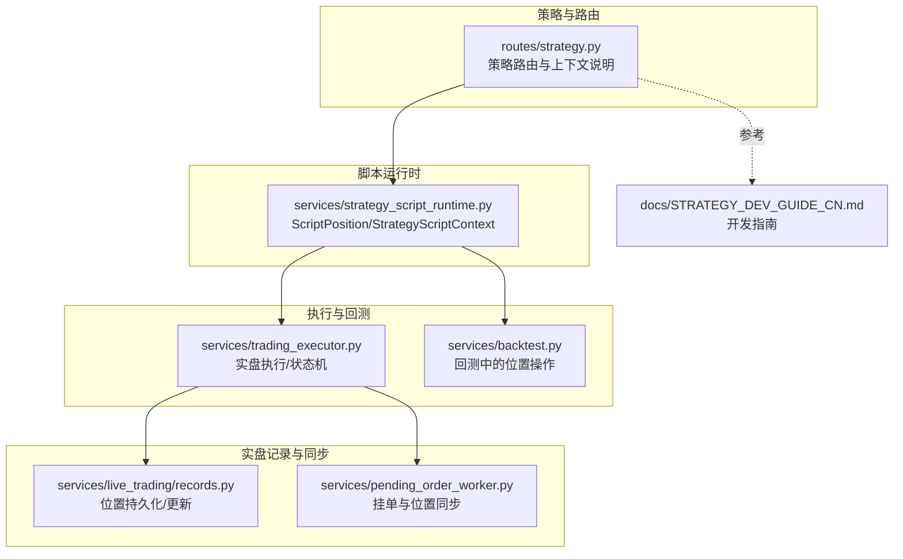
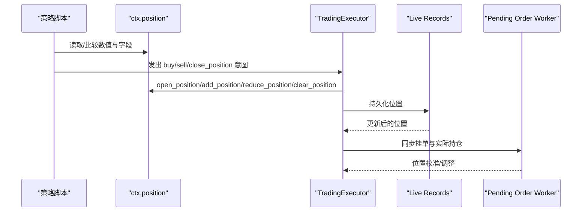
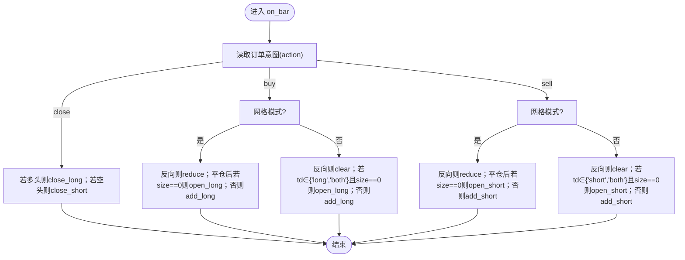
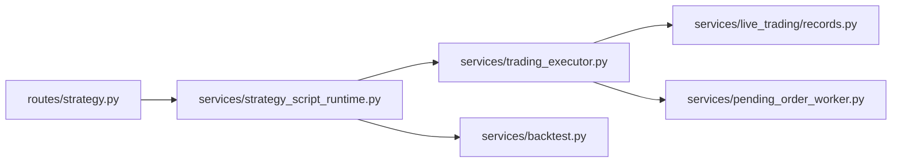

# 位置状态管理

<cite>
**本文引用的文件**
- [strategy.py](file://backend_api_python/app/routes/strategy.py)
- [strategy_script_runtime.py](file://backend_api_python/app/services/strategy_script_runtime.py)
- [trading_executor.py](file://backend_api_python/app/services/trading_executor.py)
- [backtest.py](file://backend_api_python/app/services/backtest.py)
- [records.py](file://backend_api_python/app/services/live_trading/records.py)
- [pending_order_worker.py](file://backend_api_python/app/services/pending_order_worker.py)
- [STRATEGY_DEV_GUIDE_CN.md](file://docs/STRATEGY_DEV_GUIDE_CN.md)
</cite>

## 目录
1. [简介](#简介)
2. [项目结构](#项目结构)
3. [核心组件](#核心组件)
4. [架构总览](#架构总览)
5. [详细组件分析](#详细组件分析)
6. [依赖关系分析](#依赖关系分析)
7. [性能考量](#性能考量)
8. [故障排查指南](#故障排查指南)
9. [结论](#结论)
10. [附录](#附录)

## 简介
本指南聚焦于 ScriptStrategy 中的“位置状态管理”。围绕 ctx.position 对象，系统讲解其结构、数值检查与字段访问模式，详述空仓(flat)、多头(long)、空头(short)状态的判定方法，解释 side、entry_price、quantity 等字段含义，并提供最佳实践与常见陷阱，最后给出完整状态切换逻辑示例，帮助开发者在不同交易方向下做出正确的决策。

## 项目结构
与位置状态管理直接相关的核心模块与文件：
- 路由与策略框架：app/routes/strategy.py
- 脚本运行时与位置对象：app/services/strategy_script_runtime.py
- 实盘执行器与状态机：app/services/trading_executor.py
- 回测中的位置操作：app/services/backtest.py
- 实盘记录与位置更新：app/services/live_trading/records.py
- 挂单与位置同步：app/services/pending_order_worker.py
- 开发者指南：docs/STRATEGY_DEV_GUIDE_CN.md

**图示来源**
- [strategy.py:1740-1760](file://backend_api_python/app/routes/strategy.py#L1740-L1760)
- [strategy_script_runtime.py:25-126](file://backend_api_python/app/services/strategy_script_runtime.py#L25-L126)
- [trading_executor.py:184-216](file://backend_api_python/app/services/trading_executor.py#L184-L216)
- [backtest.py:2220-2272](file://backend_api_python/app/services/backtest.py#L2220-L2272)
- [records.py:224-277](file://backend_api_python/app/services/live_trading/records.py#L224-L277)
- [pending_order_worker.py:506-599](file://backend_api_python/app/services/pending_order_worker.py#L506-L599)

**章节来源**
- [strategy.py:1740-1760](file://backend_api_python/app/routes/strategy.py#L1740-L1760)
- [strategy_script_runtime.py:25-126](file://backend_api_python/app/services/strategy_script_runtime.py#L25-L126)
- [trading_executor.py:184-216](file://backend_api_python/app/services/trading_executor.py#L184-L216)

## 核心组件
- ctx.position：ScriptPosition 类实例，提供数值比较与字典式字段访问，支持 open_position/add_position/reduce_position/clear_position 等操作。
- StrategyScriptContext：策略上下文，持有 ctx.position、ctx.balance、ctx.equity 等。
- TradingExecutor：实盘执行器，负责将策略意图转换为订单信号，维护状态机与去重逻辑。
- BacktestService：回测服务，模拟 on_bar 执行与位置变更。
- Live Trading Records：实盘记录模块，负责位置持久化与更新。
- Pending Order Worker：挂单处理与位置同步。

**章节来源**
- [strategy_script_runtime.py:25-126](file://backend_api_python/app/services/strategy_script_runtime.py#L25-L126)
- [trading_executor.py:184-216](file://backend_api_python/app/services/trading_executor.py#L184-L216)
- [backtest.py:2220-2272](file://backend_api_python/app/services/backtest.py#L2220-L2272)
- [records.py:224-277](file://backend_api_python/app/services/live_trading/records.py#L224-L277)
- [pending_order_worker.py:506-599](file://backend_api_python/app/services/pending_order_worker.py#L506-L599)

## 架构总览
位置状态管理贯穿“策略脚本 -> 执行器 -> 订单信号 -> 实盘记录/同步”的链路。策略脚本通过 ctx.position 的数值与字段进行状态判断；执行器根据 trade_direction 与网格模式决定具体动作；回测与实盘分别在各自环境中模拟/执行相同的状态切换逻辑。

**图示来源**
- [strategy_script_runtime.py:73-112](file://backend_api_python/app/services/strategy_script_runtime.py#L73-L112)
- [trading_executor.py:664-717](file://backend_api_python/app/services/trading_executor.py#L664-L717)
- [records.py:224-277](file://backend_api_python/app/services/live_trading/records.py#L224-L277)
- [pending_order_worker.py:506-599](file://backend_api_python/app/services/pending_order_worker.py#L506-L599)

## 详细组件分析

### ctx.position 结构与字段
- 数据结构：ScriptPosition 继承自 dict，内部维护以下字段：
  - side：'long' | 'short' | ''（空仓）
  - size/amount：当前未平仓数量（浮点）
  - entry_price：加仓/开仓的加权平均成交价（浮点）
  - direction：1（多头）、-1（空头）、0（空仓）
- 数值比较：
  - 布尔：非空且 size>0 视为真
  - 整数/浮点：返回 direction（1/-1/0）
  - 支持比较运算符：==、<、<=、>、>=

字段访问模式：
- 数值检查：if ctx.position / if ctx.position > 0 / if ctx.position < 0
- 字典式字段：ctx.position['side']、ctx.position['size']、ctx.position['entry_price']

注意：
- size 与 amount 在 open_position/add_position 后均等于 size
- reduce_position 将 remaining 与 size/amount 同步更新，当 remaining 极小（<=1e-12）时清空为 flat

**章节来源**
- [strategy_script_runtime.py:25-126](file://backend_api_python/app/services/strategy_script_runtime.py#L25-L126)
- [strategy.py:1748-1752](file://backend_api_python/app/routes/strategy.py#L1748-L1752)

### 位置状态判定：flat、long、short
- 空仓(flat)：size <= 0 或 side 为空字符串
- 多头(long)：size > 0 且 direction == 1
- 空头(short)：size > 0 且 direction == -1

在执行器中，位置状态还被用于状态机约束：
- flat：仅允许 open_long/open_short
- long：仅允许 add_long/reduce_long/close_long
- short：仅允许 add_short/reduce_short/close_short

**章节来源**
- [strategy_script_runtime.py:36-61](file://backend_api_python/app/services/strategy_script_runtime.py#L36-L61)
- [trading_executor.py:184-216](file://backend_api_python/app/services/trading_executor.py#L184-L216)

### 位置操作方法
- open_position(side, entry_price, amount)：清空并设置为指定方向的新仓
- add_position(entry_price, amount)：在同向增加仓位，计算加权平均 entry_price
- reduce_position(amount)：按数量减少仓位，接近 0 时清空
- clear_position()：清空为 flat

权重计算与边界：
- add_position 会在 current_size>0 且 current_price>0 时，采用加权平均公式更新 entry_price
- reduce_position 当 remaining <= 1e-12 时视为 0 并清空

**章节来源**
- [strategy_script_runtime.py:73-112](file://backend_api_python/app/services/strategy_script_runtime.py#L73-L112)

### 交易方向与状态切换逻辑
- trade_direction 控制策略方向：
  - 'long'：仅允许多头
  - 'short'：仅允许空头
  - 'both'：允许双向，但 flat 时需按 trade_direction 选择开仓方向
- 网格机器人模式(is_grid_bot)：
  - 反向时先 close 对方，再按需 open 或 add
  - 非网格模式：反向时先 close，再按需 open 或 add

**图示来源**
- [trading_executor.py:664-717](file://backend_api_python/app/services/trading_executor.py#L664-L717)

**章节来源**
- [trading_executor.py:664-717](file://backend_api_python/app/services/trading_executor.py#L664-L717)

### 回测中的位置状态与切换
回测服务在 on_bar 中模拟相同的状态切换逻辑，确保策略在回测与实盘行为一致：
- close：若多头/空头则清仓
- buy：反向先平仓，再按方向开仓或加仓
- sell：反向先平仓，再按方向开仓或加仓

**章节来源**
- [backtest.py:2231-2263](file://backend_api_python/app/services/backtest.py#L2231-L2263)

### 实盘记录与位置更新
实盘记录模块在成交后更新位置：
- 开仓：计算新的 size 与加权平均 entry_price，并更新最高/最低价格
- 平仓：计算已实现盈亏，删除或更新剩余位置

**章节来源**
- [records.py:224-277](file://backend_api_python/app/services/live_trading/records.py#L224-L277)

### 挂单与位置同步
挂单工作器会：
- 从交易所查询实际持仓
- 若实际持仓小于请求量，则按实际量调整
- 对本地位置进行插入/更新/删除，维持与交易所一致

**章节来源**
- [pending_order_worker.py:1279-1303](file://backend_api_python/app/services/pending_order_worker.py#L1279-L1303)

## 依赖关系分析
- 路由层在策略生成与说明中强调 ctx.position 的两种访问方式（数值与字段）
- 运行时层提供 ScriptPosition 的数值与字段语义
- 执行器层将策略意图映射为订单信号，并受状态机约束
- 回测层与实盘层分别在各自环境中复用相同的状态切换逻辑
- 实盘记录与挂单同步保障位置一致性

**图示来源**
- [strategy.py:1748-1752](file://backend_api_python/app/routes/strategy.py#L1748-L1752)
- [strategy_script_runtime.py:25-126](file://backend_api_python/app/services/strategy_script_runtime.py#L25-L126)
- [trading_executor.py:664-717](file://backend_api_python/app/services/trading_executor.py#L664-L717)
- [backtest.py:2231-2263](file://backend_api_python/app/services/backtest.py#L2231-L2263)
- [records.py:224-277](file://backend_api_python/app/services/live_trading/records.py#L224-L277)
- [pending_order_worker.py:1279-1303](file://backend_api_python/app/services/pending_order_worker.py#L1279-L1303)

**章节来源**
- [strategy.py:1748-1752](file://backend_api_python/app/routes/strategy.py#L1748-L1752)
- [strategy_script_runtime.py:25-126](file://backend_api_python/app/services/strategy_script_runtime.py#L25-L126)
- [trading_executor.py:664-717](file://backend_api_python/app/services/trading_executor.py#L664-L717)
- [backtest.py:2231-2263](file://backend_api_python/app/services/backtest.py#L2231-L2263)
- [records.py:224-277](file://backend_api_python/app/services/live_trading/records.py#L224-L277)
- [pending_order_worker.py:1279-1303](file://backend_api_python/app/services/pending_order_worker.py#L1279-L1303)

## 性能考量
- 位置对象为轻量 dict 包装，数值比较与字段访问均为 O(1)，性能开销极低
- 状态机与去重逻辑在执行器中集中处理，避免重复下单
- 回测与实盘共享同一套状态切换逻辑，减少维护成本

[本节为通用指导，不直接分析具体文件]

## 故障排查指南
- 误用方向判断：仅用 size 判断方向可能错误，应使用 direction 或布尔上下文
- 忽视浮点精度：减少仓位后 size 可能极小但非零，应以 1e-12 作为阈值判断清仓
- 未考虑 trade_direction：在 both 模式下 flat 时需按 trade_direction 选择开仓方向
- 网格与非网格差异：网格模式下反向先 reduce，非网格模式先 clear
- 未处理挂单与实际持仓差异：实盘中需依赖挂单同步模块进行校准

**章节来源**
- [strategy_script_runtime.py:100-112](file://backend_api_python/app/services/strategy_script_runtime.py#L100-L112)
- [trading_executor.py:1349-1354](file://backend_api_python/app/services/trading_executor.py#L1349-L1354)
- [pending_order_worker.py:506-599](file://backend_api_python/app/services/pending_order_worker.py#L506-L599)

## 结论
ctx.position 提供了简洁而强大的位置状态管理能力：既可通过数值快速判断方向与是否空仓，又可通过字段精确访问 side、size、entry_price 等关键信息。配合 TradingExecutor 的状态机与去重机制，以及回测与实盘一致的切换逻辑，开发者可以在多方向、多模式（网格/非网格）下构建稳健的交易策略。

[本节为总结性内容，不直接分析具体文件]

## 附录

### 最佳实践清单
- 使用布尔上下文判断是否持有仓位：if ctx.position
- 使用数值比较判断方向：if ctx.position > 0 / if ctx.position < 0
- 使用字段访问获取详细信息：ctx.position['side']、ctx.position['size']、ctx.position['entry_price']
- 在 both 模式下，flat 时按 trade_direction 选择开仓方向
- 网格模式下反向先 reduce，再按需 open 或 add
- 平仓后及时清空，避免残留极小值导致状态异常
- 实盘中关注挂单与实际持仓差异，必要时进行同步校准

**章节来源**
- [strategy.py:1748-1752](file://backend_api_python/app/routes/strategy.py#L1748-L1752)
- [trading_executor.py:664-717](file://backend_api_python/app/services/trading_executor.py#L664-L717)
- [pending_order_worker.py:506-599](file://backend_api_python/app/services/pending_order_worker.py#L506-L599)

### 常见陷阱
- 将 size 作为唯一方向判断依据，忽略 direction 与布尔上下文
- reduce_position 后未考虑浮点误差，导致状态未清仓
- 未区分网格与非网格模式，导致反向时顺序错误
- both 模式下 flat 时未按 trade_direction 选择开仓方向
- 未处理挂单与交易所实际持仓不一致的情况

**章节来源**
- [strategy_script_runtime.py:100-112](file://backend_api_python/app/services/strategy_script_runtime.py#L100-L112)
- [trading_executor.py:1349-1354](file://backend_api_python/app/services/trading_executor.py#L1349-L1354)
- [pending_order_worker.py:506-599](file://backend_api_python/app/services/pending_order_worker.py#L506-L599)