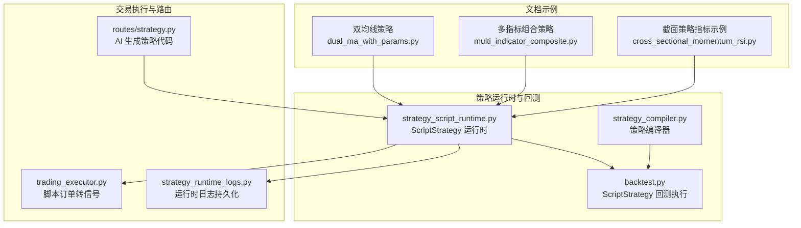
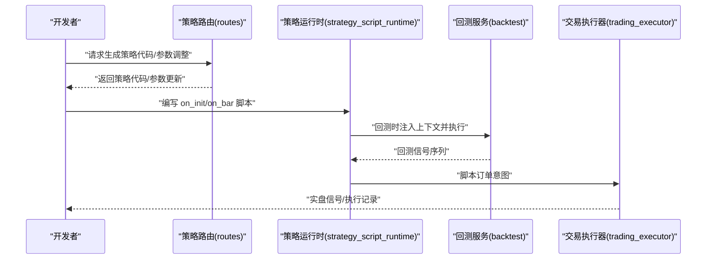
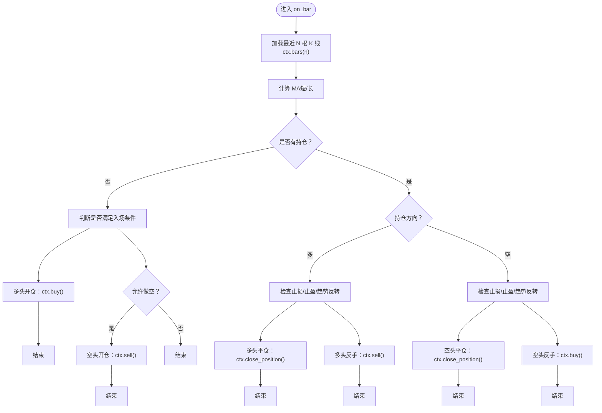
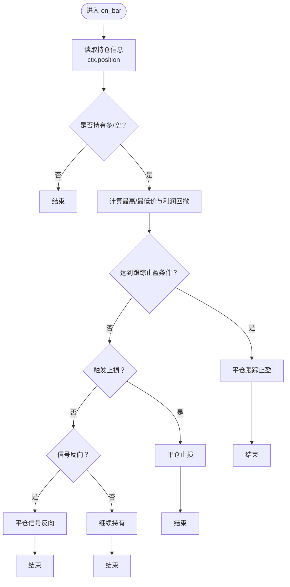
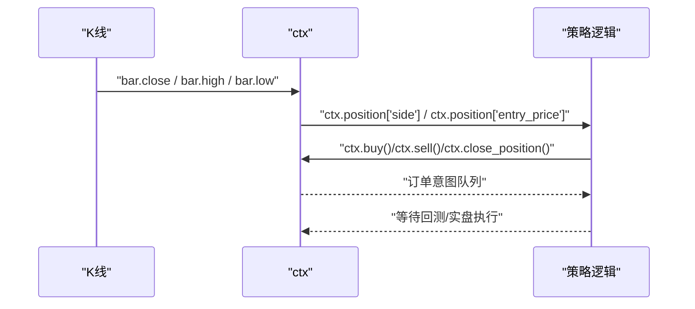
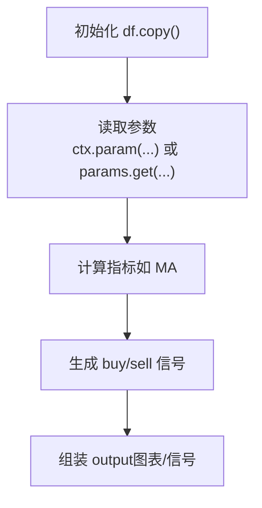
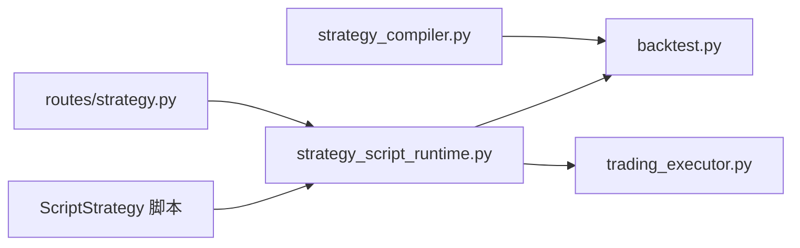

# 开发示例

<cite>
**本文引用的文件**
- [策略开发指南（中文）](file://docs/STRATEGY_DEV_GUIDE_CN.md)
- [策略开发指南（英文）](file://docs/STRATEGY_DEV_GUIDE.md)
- [双均线策略（文档同步版）](file://docs/examples/dual_ma_with_params.py)
- [多指标组合策略（文档同步版）](file://docs/examples/multi_indicator_composite.py)
- [截面策略指标示例（研究参考版）](file://docs/examples/cross_sectional_momentum_rsi.py)
- [策略脚本运行时（ScriptStrategy）](file://backend_api_python/app/services/strategy_script_runtime.py)
- [策略编译器（生成策略代码）](file://backend_api_python/app/services/strategy_compiler.py)
- [回测服务（ScriptStrategy 执行）](file://backend_api_python/app/services/backtest.py)
- [交易执行器（脚本订单转换为信号）](file://backend_api_python/app/services/trading_executor.py)
- [策略路由（AI 生成策略代码）](file://backend_api_python/app/routes/strategy.py)
- [策略运行时日志（持久化）](file://backend_api_python/app/utils/strategy_runtime_logs.py)
</cite>

## 目录
1. [简介](#简介)
2. [项目结构](#项目结构)
3. [核心组件](#核心组件)
4. [架构总览](#架构总览)
5. [详细组件分析](#详细组件分析)
6. [依赖关系分析](#依赖关系分析)
7. [性能考量](#性能考量)
8. [故障排查指南](#故障排查指南)
9. [结论](#结论)
10. [附录](#附录)

## 简介
本文件面向策略开发者，系统化整理 ScriptStrategy 的开发示例与最佳实践，覆盖从简单到复杂的策略范式，包括：
- 基础移动平均交叉策略
- 带动态止损止盈的位置管理策略
- 支持多方向交易的综合策略
并深入讲解：
- 普通模式与 bot 模式的区别
- 策略参数化与 ctx.param() 的使用
- 调试与测试技巧
- 与回测、实盘执行链路的衔接

## 项目结构
围绕 ScriptStrategy 的开发与运行，核心目录与文件如下：
- 文档示例：docs/examples 下提供多策略示例，便于对照学习
- 运行时与回测：backend_api_python/app/services 下包含策略脚本运行时、回测与交易执行器
- 路由与编译：app/routes 与 app/services 提供策略代码生成、编译与执行入口

**图表来源**
- [策略脚本运行时（ScriptStrategy）:114-191](file://backend_api_python/app/services/strategy_script_runtime.py#L114-L191)
- [回测服务（ScriptStrategy 执行）:2031-2199](file://backend_api_python/app/services/backtest.py#L2031-L2199)
- [策略编译器（生成策略代码）:1-689](file://backend_api_python/app/services/strategy_compiler.py#L1-L689)
- [交易执行器（脚本订单转换为信号）:600-789](file://backend_api_python/app/services/trading_executor.py#L600-L789)
- [策略路由（AI 生成策略代码）:1600-1799](file://backend_api_python/app/routes/strategy.py#L1600-L1799)
- [策略运行时日志（持久化）:1-30](file://backend_api_python/app/utils/strategy_runtime_logs.py#L1-L30)

**章节来源**
- [策略开发指南（中文）:1-1270](file://docs/STRATEGY_DEV_GUIDE_CN.md#L1-L1270)
- [策略开发指南（英文）:618-780](file://docs/STRATEGY_DEV_GUIDE.md#L618-L780)

## 核心组件
- ScriptStrategy 运行时上下文
  - ctx 提供参数读取、历史K线、下单与日志能力
  - ctx.position 支持数值判断与字段访问
- 回测执行器
  - 将 on_bar 产生的订单意图转换为回测信号
- 交易执行器
  - 将脚本订单映射为实盘信号，支持 bot 模式与网格/DCA 等特殊逻辑
- 策略编译器
  - 将配置转化为可执行的策略脚本（适合模板化生成）
- 路由与 AI
  - 提供策略代码生成与参数调整的 LLM 接口

**章节来源**
- [策略脚本运行时（ScriptStrategy）:114-191](file://backend_api_python/app/services/strategy_script_runtime.py#L114-L191)
- [回测服务（ScriptStrategy 执行）:2031-2199](file://backend_api_python/app/services/backtest.py#L2031-L2199)
- [交易执行器（脚本订单转换为信号）:600-789](file://backend_api_python/app/services/trading_executor.py#L600-L789)
- [策略编译器（生成策略代码）:1-689](file://backend_api_python/app/services/strategy_compiler.py#L1-L689)
- [策略路由（AI 生成策略代码）:1600-1799](file://backend_api_python/app/routes/strategy.py#L1600-L1799)

## 架构总览
ScriptStrategy 的执行链路从“策略脚本”出发，经“回测/实盘运行时”与“交易执行器”，最终落盘为订单信号。

**图表来源**
- [策略路由（AI 生成策略代码）:1600-1799](file://backend_api_python/app/routes/strategy.py#L1600-L1799)
- [策略脚本运行时（ScriptStrategy）:114-191](file://backend_api_python/app/services/strategy_script_runtime.py#L114-L191)
- [回测服务（ScriptStrategy 执行）:2031-2199](file://backend_api_python/app/services/backtest.py#L2031-L2199)
- [交易执行器（脚本订单转换为信号）:600-789](file://backend_api_python/app/services/trading_executor.py#L600-L789)

## 详细组件分析

### 示例一：基础移动平均交叉策略（ScriptStrategy）
- 目标：以 MA 金叉/死叉为入场信号，结合动态止损止盈与多空方向控制
- 关键点：
  - 使用 ctx.param(...) 设置默认参数（如 MA 周期、止盈止损比例、是否允许做空）
  - 通过 ctx.bars(n) 获取历史K线，计算 MA
  - 依据 ctx.position 决策开仓/反手/平仓
  - 使用 ctx.buy()/ctx.sell()/ctx.close_position() 表达下单意图
- 适用场景：普通回测与实盘执行，适合“已收盘 K 线”语义
- 参考路径：
  - [策略开发指南（中文）- ScriptStrategy 示例:637-780](file://docs/STRATEGY_DEV_GUIDE_CN.md#L637-L780)
  - [策略开发指南（英文）- Script example with runtime exits:637-743](file://docs/STRATEGY_DEV_GUIDE.md#L637-L743)

**图表来源**
- [策略开发指南（中文）- ScriptStrategy 示例:637-780](file://docs/STRATEGY_DEV_GUIDE_CN.md#L637-L780)
- [策略开发指南（英文）- Script example with runtime exits:637-743](file://docs/STRATEGY_DEV_GUIDE.md#L637-L743)

**章节来源**
- [策略开发指南（中文）:637-780](file://docs/STRATEGY_DEV_GUIDE_CN.md#L637-L780)
- [策略开发指南（英文）:637-743](file://docs/STRATEGY_DEV_GUIDE.md#L637-L743)

### 示例二：带动态止损止盈的位置管理策略（ScriptStrategy）
- 目标：基于持仓成本与价格波动动态调整止盈/止损
- 关键点：
  - 以入场价为基准，动态计算回撤/利润百分比
  - 达到止盈激活阈值后，采用回调式止盈（跟踪止盈）
  - 触发止损或趋势反转时平仓
- 参考路径：
  - [策略开发指南（中文）- ScriptStrategy 示例:637-780](file://docs/STRATEGY_DEV_GUIDE_CN.md#L637-L780)
  - [策略开发指南（英文）- Script example with runtime exits:637-743](file://docs/STRATEGY_DEV_GUIDE.md#L637-L743)

**图表来源**
- [策略开发指南（中文）- ScriptStrategy 示例:637-780](file://docs/STRATEGY_DEV_GUIDE_CN.md#L637-L780)
- [策略开发指南（英文）- Script example with runtime exits:637-743](file://docs/STRATEGY_DEV_GUIDE.md#L637-L743)

**章节来源**
- [策略开发指南（中文）:637-780](file://docs/STRATEGY_DEV_GUIDE_CN.md#L637-L780)
- [策略开发指南（英文）:637-743](file://docs/STRATEGY_DEV_GUIDE.md#L637-L743)

### 示例三：支持多方向交易的综合策略（ScriptStrategy）
- 目标：在单根 K 线内根据多空方向分别管理位置
- 关键点：
  - 使用 ctx.position["side"] 判断方向，分别处理多/空
  - 入场条件与止盈止损逻辑分离，避免相互干扰
  - 反手逻辑：多头平仓后开空，空头平仓后开多
- 参考路径：
  - [策略开发指南（中文）- ScriptStrategy 示例:702-780](file://docs/STRATEGY_DEV_GUIDE_CN.md#L702-L780)
  - [策略开发指南（英文）- Script example with runtime exits:711-780](file://docs/STRATEGY_DEV_GUIDE.md#L711-L780)

**图表来源**
- [策略开发指南（中文）- ScriptStrategy 示例:702-780](file://docs/STRATEGY_DEV_GUIDE_CN.md#L702-L780)
- [策略开发指南（英文）- Script example with runtime exits:711-780](file://docs/STRATEGY_DEV_GUIDE.md#L711-L780)

**章节来源**
- [策略开发指南（中文）:702-780](file://docs/STRATEGY_DEV_GUIDE_CN.md#L702-L780)
- [策略开发指南（英文）:711-780](file://docs/STRATEGY_DEV_GUIDE.md#L711-L780)

### 示例四：文档同步的双均线策略（IndicatorStrategy 参考）
- 目标：展示参数声明与默认风控配置的规范写法
- 关键点：
  - 使用 # @param 声明可调参数
  - 使用 # @strategy 声明默认风控（止损、止盈、入场比例、跟踪止损、方向）
  - 生成 buy/sell 信号列与图表输出
- 参考路径：
  - [双均线策略（文档同步版）:1-64](file://docs/examples/dual_ma_with_params.py#L1-L64)

**图表来源**
- [双均线策略（文档同步版）:1-64](file://docs/examples/dual_ma_with_params.py#L1-L64)

**章节来源**
- [双均线策略（文档同步版）:1-64](file://docs/examples/dual_ma_with_params.py#L1-L64)

### 示例五：多指标组合策略（IndicatorStrategy 参考）
- 目标：组合均线、RSI、MACD、成交量过滤，输出稳定边缘触发信号
- 关键点：
  - 使用 # @param 暴露多组参数
  - 使用 # @strategy 暴露默认风控
  - 通过原始条件组合与边缘触发，降低信号噪音
- 参考路径：
  - [多指标组合策略（文档同步版）:1-109](file://docs/examples/multi_indicator_composite.py#L1-L109)

**章节来源**
- [多指标组合策略（文档同步版）:1-109](file://docs/examples/multi_indicator_composite.py#L1-L109)

### 示例六：截面策略指标示例（研究参考）
- 目标：对多个标的打分排序，作为研究参考
- 关键点：
  - 当前平台文档明确：cross_sectional 不在主策略快照回测/实盘链路
  - 适合研究阶段的“对多个标的打分再排序”的基本写法
- 参考路径：
  - [截面策略指标示例（研究参考版）:1-71](file://docs/examples/cross_sectional_momentum_rsi.py#L1-L71)

**章节来源**
- [截面策略指标示例（研究参考版）:1-71](file://docs/examples/cross_sectional_momentum_rsi.py#L1-L71)

### 普通模式 vs Bot 模式
- 普通模式（已收盘 K 线）：
  - 引擎在 bar 确认收盘后调用 on_bar(ctx, bar)
  - 适合普通策略回测与逐 bar 实盘
- Bot 模式（网格/网格+定投等）：
  - 系统可能基于最新价格构造“类 tick 的伪 bar”反复调用 on_bar
  - 更适合网格、DCA 或机器人风格执行策略
- 差异要点：
  - amount 更适合理解为运行时下单意图；保存后的策略回测，仓位大小主要受 entryPct 等规范化交易配置影响
  - 多头/空头反手时，实际效果可能表现为“先平后反手”，明确“全部平仓”应使用 ctx.close_position()

**章节来源**
- [策略开发指南（中文）- 普通脚本模式与 bot 模式:689-701](file://docs/STRATEGY_DEV_GUIDE_CN.md#L689-L701)
- [策略开发指南（英文）- Script example with runtime exits:637-743](file://docs/STRATEGY_DEV_GUIDE.md#L637-L743)

### 策略参数化最佳实践（ctx.param()）
- 使用 ctx.param(name, default) 作为脚本默认参数的集中管理入口
- 优点：
  - 与平台 UI/参数面板联动
  - 便于回测与实盘一致性
  - 避免硬编码，提升可维护性
- 注意：
  - 与 # @param（IndicatorStrategy）不同，ScriptStrategy 使用 ctx.param(...)
  - 参数命名与默认值应在 on_init 中初始化或首次使用时声明

**章节来源**
- [策略开发指南（中文）- 可用对象与 ctx.param:606-623](file://docs/STRATEGY_DEV_GUIDE_CN.md#L606-L623)
- [策略开发指南（英文）- 可用对象与 ctx.param:618-623](file://docs/STRATEGY_DEV_GUIDE.md#L618-L623)

### 调试与测试实用技巧
- 日志记录
  - 使用 ctx.log(message) 记录运行时日志，便于定位问题
  - 运行时日志可持久化到数据库，便于策略管理 UI 查看
- 回测验证
  - 先用 IndicatorStrategy 验证信号与默认风控
  - 再迁移到 ScriptStrategy，验证动态止损止盈与多方向逻辑
- 参数敏感性测试
  - 通过 ctx.param(...) 与平台参数面板快速调整参数，观察收益曲线变化
- bot 模式专项测试
  - bot 模式下频繁 on_bar 调用，需确保逻辑幂等与状态一致性

**章节来源**
- [策略脚本运行时（ScriptStrategy）- 日志接口:146-148](file://backend_api_python/app/services/strategy_script_runtime.py#L146-L148)
- [策略运行时日志（持久化）:1-30](file://backend_api_python/app/utils/strategy_runtime_logs.py#L1-L30)
- [策略开发指南（中文）- 回测、持久化与当前限制:783-800](file://docs/STRATEGY_DEV_GUIDE_CN.md#L783-L800)

## 依赖关系分析
- ScriptStrategy 运行时依赖 pandas/numpy，提供安全执行环境
- 回测服务将脚本编译并执行，产出回测信号序列
- 交易执行器将脚本订单映射为实盘信号，支持 bot 类型与网格/DCA 特殊逻辑
- 路由层提供策略代码生成与参数调整的 LLM 接口

**图表来源**
- [策略脚本运行时（ScriptStrategy）:114-191](file://backend_api_python/app/services/strategy_script_runtime.py#L114-L191)
- [回测服务（ScriptStrategy 执行）:2031-2199](file://backend_api_python/app/services/backtest.py#L2031-L2199)
- [交易执行器（脚本订单转换为信号）:600-789](file://backend_api_python/app/services/trading_executor.py#L600-L789)
- [策略编译器（生成策略代码）:1-689](file://backend_api_python/app/services/strategy_compiler.py#L1-L689)
- [策略路由（AI 生成策略代码）:1600-1799](file://backend_api_python/app/routes/strategy.py#L1600-L1799)

**章节来源**
- [策略脚本运行时（ScriptStrategy）:114-191](file://backend_api_python/app/services/strategy_script_runtime.py#L114-L191)
- [回测服务（ScriptStrategy 执行）:2031-2199](file://backend_api_python/app/services/backtest.py#L2031-L2199)
- [交易执行器（脚本订单转换为信号）:600-789](file://backend_api_python/app/services/trading_executor.py#L600-L789)
- [策略编译器（生成策略代码）:1-689](file://backend_api_python/app/services/strategy_compiler.py#L1-L689)
- [策略路由（AI 生成策略代码）:1600-1799](file://backend_api_python/app/routes/strategy.py#L1600-L1799)

## 性能考量
- 脚本执行时间限制：编译与执行均设置超时，避免长时间阻塞
- 数据访问优化：优先使用 ctx.bars(n) 获取局部窗口，减少全量 DataFrame 计算
- 订单意图合并：同一根 K 线内的多次下单意图会合并处理，避免过度交易
- bot 模式下的高频 on_bar：需谨慎控制逻辑复杂度，避免状态抖动

[本节为通用指导，无需特定文件引用]

## 故障排查指南
- 空间/属性访问错误
  - ScriptBar/ScriptPosition 通过 __getattr__ 抛出 AttributeError，检查字段名拼写
- 代码执行失败
  - 编译器/回测服务对脚本执行失败会抛出异常并记录堆栈
- 订单未生效
  - 检查 ctx.buy()/ctx.sell()/ctx.close_position() 是否在 on_bar 中调用
  - 确认交易方向与产品配置（如只允许多/空）一致
- 日志定位
  - 使用 ctx.log 记录关键变量与分支，结合策略运行时日志持久化查看

**章节来源**
- [策略脚本运行时（ScriptStrategy）- 属性访问与异常:17-23](file://backend_api_python/app/services/strategy_script_runtime.py#L17-L23)
- [回测服务（ScriptStrategy 执行）- 执行失败与日志:2184-2199](file://backend_api_python/app/services/backtest.py#L2184-L2199)
- [策略运行时日志（持久化）:1-30](file://backend_api_python/app/utils/strategy_runtime_logs.py#L1-L30)

## 结论
- ScriptStrategy 适合需要运行时状态、动态风控与多方向交易的策略
- 建议先用 IndicatorStrategy 验证信号与默认风控，再迁移到 ScriptStrategy
- 使用 ctx.param(...) 管理脚本默认参数，配合平台参数面板与回测链路
- bot 模式与普通模式差异显著，需分别测试与验证
- 通过日志与参数敏感性测试，持续优化策略稳定性与收益

[本节为总结，无需特定文件引用]

## 附录
- 相关文件路径与用途概览
  - docs/examples：策略示例（双均线、多指标组合、截面策略）
  - backend_api_python/app/services/strategy_script_runtime.py：ScriptStrategy 运行时上下文与订单接口
  - backend_api_python/app/services/backtest.py：ScriptStrategy 回测执行
  - backend_api_python/app/services/trading_executor.py：脚本订单转实盘信号
  - backend_api_python/app/services/strategy_compiler.py：策略配置编译为脚本
  - backend_api_python/app/routes/strategy.py：AI 生成策略代码与参数调整
  - backend_api_python/app/utils/strategy_runtime_logs.py：策略运行时日志持久化

[本节为概览，无需特定文件引用]