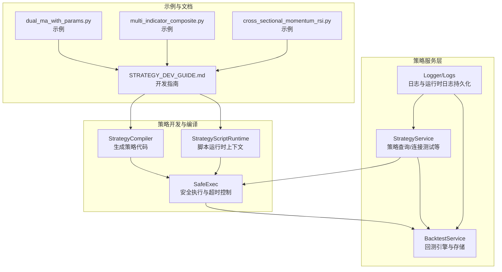
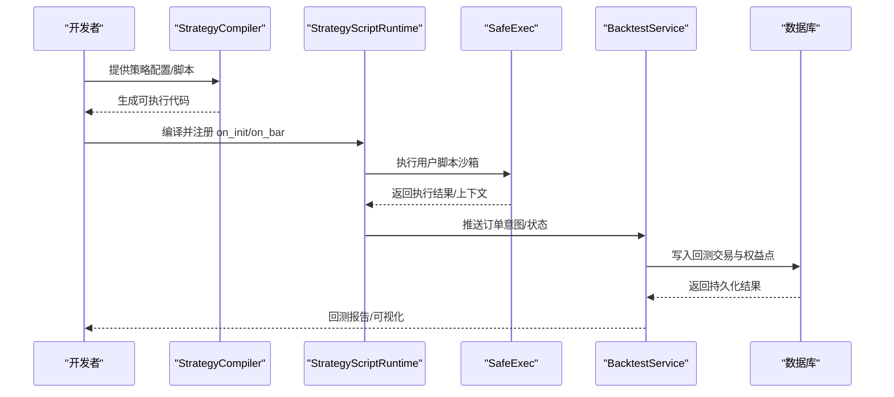
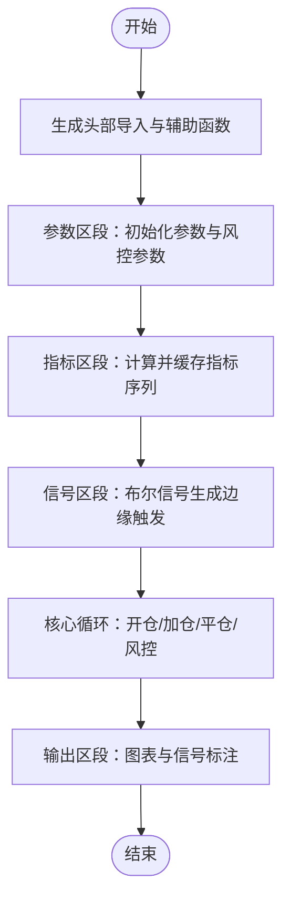
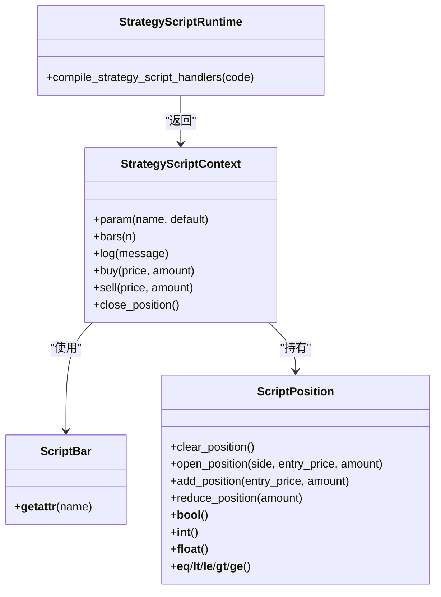
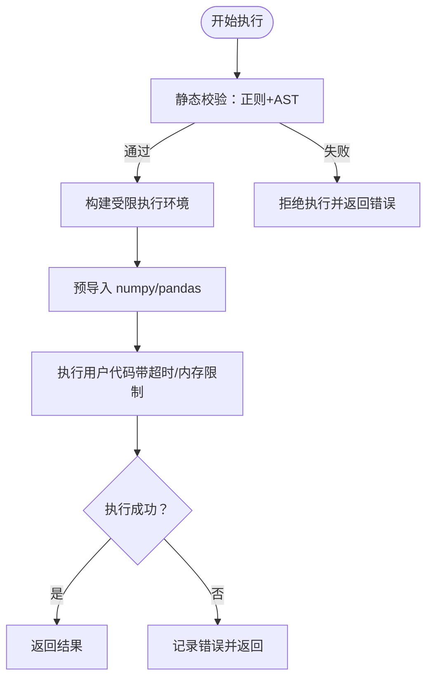
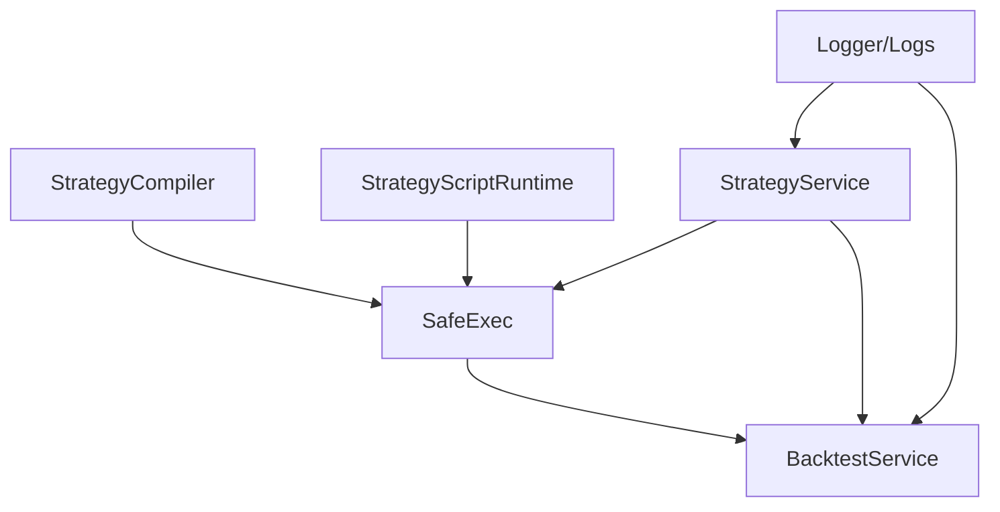

# 最佳实践指南

<cite>
**本文引用的文件**   
- [strategy.py](file://backend_api_python/app/services/strategy.py)
- [strategy_script_runtime.py](file://backend_api_python/app/services/strategy_script_runtime.py)
- [strategy_compiler.py](file://backend_api_python/app/services/strategy_compiler.py)
- [safe_exec.py](file://backend_api_python/app/utils/safe_exec.py)
- [STRATEGY_DEV_GUIDE.md](file://docs/STRATEGY_DEV_GUIDE.md)
- [dual_ma_with_params.py](file://docs/examples/dual_ma_with_params.py)
- [multi_indicator_composite.py](file://docs/examples/multi_indicator_composite.py)
- [cross_sectional_momentum_rsi.py](file://docs/examples/cross_sectional_momentum_rsi.py)
- [backtest.py](file://backend_api_python/app/services/backtest.py)
- [strategy_runtime_logs.py](file://backend_api_python/app/utils/strategy_runtime_logs.py)
- [logger.py](file://backend_api_python/app/utils/logger.py)
- [conftest.py](file://backend_api_python/tests/conftest.py)
- [test_data_providers.py](file://backend_api_python/tests/test_data_providers.py)
</cite>

## 目录
1. [简介](#简介)
2. [项目结构](#项目结构)
3. [核心组件](#核心组件)
4. [架构总览](#架构总览)
5. [详细组件分析](#详细组件分析)
6. [依赖分析](#依赖分析)
7. [性能考量](#性能考量)
8. [故障排查指南](#故障排查指南)
9. [结论](#结论)
10. [附录](#附录)

## 简介
本指南面向使用 ScriptStrategy 的开发者，系统总结了在 SharkQuantDinger 平台上编写策略脚本的最佳实践，涵盖参数管理、状态维护、错误处理、性能优化、可读性与可维护性、测试与调试等方面。文档同时结合平台提供的 IndicatorStrategy 与 ScriptStrategy 两种模式，给出何时采用 ScriptStrategy 的决策依据与迁移路径。

## 项目结构
本项目采用后端服务与前端分离的结构，策略开发主要围绕后端服务中的策略编译、脚本运行时、安全执行与回测服务展开。策略脚本通过编译器生成可执行代码或在运行时通过安全执行器沙箱执行，最终进入回测与实盘执行链路。

图表来源
- [strategy_compiler.py:1-689](file://backend_api_python/app/services/strategy_compiler.py#L1-L689)
- [strategy_script_runtime.py:1-191](file://backend_api_python/app/services/strategy_script_runtime.py#L1-L191)
- [safe_exec.py:1-471](file://backend_api_python/app/utils/safe_exec.py#L1-L471)
- [strategy.py:1-800](file://backend_api_python/app/services/strategy.py#L1-L800)
- [backtest.py:1-200](file://backend_api_python/app/services/backtest.py#L1-L200)
- [STRATEGY_DEV_GUIDE.md:1-800](file://docs/STRATEGY_DEV_GUIDE.md#L1-L800)

章节来源
- [strategy_compiler.py:1-689](file://backend_api_python/app/services/strategy_compiler.py#L1-L689)
- [strategy_script_runtime.py:1-191](file://backend_api_python/app/services/strategy_script_runtime.py#L1-L191)
- [safe_exec.py:1-471](file://backend_api_python/app/utils/safe_exec.py#L1-L471)
- [strategy.py:1-800](file://backend_api_python/app/services/strategy.py#L1-L800)
- [backtest.py:1-200](file://backend_api_python/app/services/backtest.py#L1-L200)
- [STRATEGY_DEV_GUIDE.md:1-800](file://docs/STRATEGY_DEV_GUIDE.md#L1-L800)

## 核心组件
- 策略编译器：将配置转换为可执行的 Python 代码，支持参数、指标、信号与核心循环生成。
- 脚本运行时：提供 on_init/on_bar 生命周期、参数读取、历史K线访问、位置状态、下单意图与日志记录。
- 安全执行器：白名单内置函数、限制导入模块、超时与内存保护、AST/正则双重校验。
- 策略服务：策略查询、连接测试、符号与交易所信息获取、参数展示构建等。
- 回测服务：K线缓存、多时间框架回测、交易与权益点持久化、执行时间框架推断。
- 日志与运行时日志：统一日志配置与策略运行时日志持久化。

章节来源
- [strategy_compiler.py:1-689](file://backend_api_python/app/services/strategy_compiler.py#L1-L689)
- [strategy_script_runtime.py:1-191](file://backend_api_python/app/services/strategy_script_runtime.py#L1-L191)
- [safe_exec.py:1-471](file://backend_api_python/app/utils/safe_exec.py#L1-L471)
- [strategy.py:1-800](file://backend_api_python/app/services/strategy.py#L1-L800)
- [backtest.py:1-200](file://backend_api_python/app/services/backtest.py#L1-L200)
- [strategy_runtime_logs.py:1-30](file://backend_api_python/app/utils/strategy_runtime_logs.py#L1-L30)
- [logger.py:1-63](file://backend_api_python/app/utils/logger.py#L1-L63)

## 架构总览
下图展示了 ScriptStrategy 从“配置/脚本”到“安全执行”再到“回测/实盘”的整体流程。

图表来源
- [strategy_compiler.py:1-689](file://backend_api_python/app/services/strategy_compiler.py#L1-L689)
- [strategy_script_runtime.py:159-191](file://backend_api_python/app/services/strategy_script_runtime.py#L159-L191)
- [safe_exec.py:207-244](file://backend_api_python/app/utils/safe_exec.py#L207-L244)
- [backtest.py:1-200](file://backend_api_python/app/services/backtest.py#L1-L200)

## 详细组件分析

### 组件一：策略编译器（StrategyCompiler）
- 职责：将策略配置转换为可执行的 Python 代码，包含参数、指标计算、信号逻辑与核心循环。
- 关键能力：
  - 参数区段：初始头寸比例、杠杆、金字塔规则、止盈止损与追踪止盈等。
  - 指标区段：支持多种技术指标（如 SuperTrend、EMA、RSI、MACD、布林带、KDJ、MA）的计算与缓存。
  - 信号区段：将指标条件映射为布尔信号（buy/sell）。
  - 核心循环：实现多时间框架下的开仓、加仓、平仓与风控逻辑。
  - 输出区段：生成图表绘制与信号标注所需的结构化输出。
- 最佳实践要点：
  - 将“参数/指标/信号/循环/输出”五段式结构化拆分，确保可读性与可维护性。
  - 指标重复计算应去重缓存，避免多次重复计算。
  - 信号生成应使用边缘触发（避免连续触发），并在输出中提供清晰的标注。

图表来源
- [strategy_compiler.py:37-689](file://backend_api_python/app/services/strategy_compiler.py#L37-L689)

章节来源
- [strategy_compiler.py:1-689](file://backend_api_python/app/services/strategy_compiler.py#L1-L689)

### 组件二：脚本运行时（StrategyScriptRuntime）
- 职责：提供 ScriptStrategy 的运行时上下文，包括参数读取、历史K线访问、位置状态、下单意图与日志记录。
- 关键对象：
  - ScriptBar：K线数据的字典式访问。
  - ScriptPosition：位置状态的封装，支持清仓、开仓、加仓与减仓。
  - StrategyScriptContext：脚本上下文，提供 param/bars/position/balance/equity/log/buy/sell/close_position 等。
  - 编译函数：compile_strategy_script_handlers，负责安全编译并返回 on_init/on_bar。
- 最佳实践要点：
  - 使用 ctx.param 读取脚本级默认参数，避免硬编码。
  - 使用 ctx.bars(n) 获取历史K线，注意长度不足时的保护。
  - 使用 ctx.position 判断当前方向与大小，避免误判。
  - 使用 ctx.buy/sell/close_position 明确表达意图，避免歧义。

图表来源
- [strategy_script_runtime.py:17-191](file://backend_api_python/app/services/strategy_script_runtime.py#L17-L191)

章节来源
- [strategy_script_runtime.py:1-191](file://backend_api_python/app/services/strategy_script_runtime.py#L1-L191)

### 组件三：安全执行器（SafeExec）
- 职责：在受限环境中执行用户脚本，防止危险操作与资源滥用。
- 关键机制：
  - 白名单内置函数与受控 import，禁止 os/sys/subprocess 等危险模块。
  - 正则与 AST 双重校验，拒绝 eval/exec/open 等危险调用。
  - 超时控制（Unix 使用 SIGALRM，Windows 使用异步异常注入）。
  - 可选的子进程隔离执行，进一步隔离风险。
- 最佳实践要点：
  - 严格遵循白名单与受控导入，避免使用未授权模块。
  - 脚本应尽量短小、幂等，避免长时间阻塞。
  - 合理设置超时与内存上限，防止资源耗尽。

图表来源
- [safe_exec.py:358-471](file://backend_api_python/app/utils/safe_exec.py#L358-L471)
- [safe_exec.py:157-244](file://backend_api_python/app/utils/safe_exec.py#L157-L244)

章节来源
- [safe_exec.py:1-471](file://backend_api_python/app/utils/safe_exec.py#L1-L471)

### 组件四：策略服务（StrategyService）
- 职责：策略查询、运行中策略列表、交易所符号获取、连接测试等。
- 关键能力：
  - 运行中策略查询与类型识别。
  - 交易所符号列表获取（支持 CCXT 与直连 REST）。
  - 连接测试：公共 ping 与私有账户数据验证，自动探测市场类型与提示错误。
- 最佳实践要点：
  - 连接测试需考虑并发限制与速率限制，避免对上游造成压力。
  - 对于直连 REST 的交易所，优先使用直连以获得更准确的可用性判断。
  - 错误消息需对用户友好，必要时提供诊断提示（如 IP 白名单、密钥权限等）。

章节来源
- [strategy.py:14-800](file://backend_api_python/app/services/strategy.py#L14-L800)

### 组件五：回测服务（BacktestService）
- 职责：回测引擎、K线缓存、多时间框架回测、交易与权益点持久化。
- 关键能力：
  - K线缓存（TTL）减少外部 API 调用。
  - 多时间框架回测阈值配置与执行时间框架推断。
  - 交易与权益点表结构设计，支持回测结果持久化。
- 最佳实践要点：
  - 合理设置回测时间范围与时间框架，避免过长导致性能问题。
  - 使用缓存提升回测速度，注意缓存失效策略。
  - 回测报告字段应与前端展示一致，便于对比与复现。

章节来源
- [backtest.py:1-200](file://backend_api_python/app/services/backtest.py#L1-L200)

### 组件六：日志与运行时日志
- 日志：统一日志配置与文件轮转，过滤噪声日志。
- 运行时日志：策略运行时日志持久化，便于 UI 展示与问题定位。

章节来源
- [logger.py:1-63](file://backend_api_python/app/utils/logger.py#L1-L63)
- [strategy_runtime_logs.py:1-30](file://backend_api_python/app/utils/strategy_runtime_logs.py#L1-L30)

## 依赖分析
- 组件耦合：
  - StrategyCompiler 与 StrategyScriptRuntime 分别面向“配置生成代码”和“脚本运行时”，二者通过安全执行器衔接。
  - SafeExec 为 StrategyCompiler 与 StrategyScriptRuntime 提供统一的安全边界。
  - StrategyService 与 BacktestService 分别承担策略生命周期与回测职责，彼此通过数据库交互。
- 外部依赖：
  - pandas/numpy：指标计算与向量化处理。
  - requests/ccxt：数据获取与交易所对接。
  - sqlite/postgres：回测与日志持久化。

图表来源
- [strategy_compiler.py:1-689](file://backend_api_python/app/services/strategy_compiler.py#L1-L689)
- [strategy_script_runtime.py:1-191](file://backend_api_python/app/services/strategy_script_runtime.py#L1-L191)
- [safe_exec.py:1-471](file://backend_api_python/app/utils/safe_exec.py#L1-L471)
- [strategy.py:1-800](file://backend_api_python/app/services/strategy.py#L1-L800)
- [backtest.py:1-200](file://backend_api_python/app/services/backtest.py#L1-L200)
- [logger.py:1-63](file://backend_api_python/app/utils/logger.py#L1-L63)
- [strategy_runtime_logs.py:1-30](file://backend_api_python/app/utils/strategy_runtime_logs.py#L1-L30)

## 性能考量
- 指标计算与缓存
  - 使用向量化运算（pandas/numpy）替代循环，减少 Python 层开销。
  - 对重复指标进行缓存，避免重复计算。
- 脚本执行
  - 设置合理的超时与内存上限，防止长时间阻塞或内存泄漏。
  - 避免在 on_bar 中进行网络请求或磁盘 I/O。
- 回测性能
  - 合理选择时间框架与回测区间，避免过长导致性能问题。
  - 使用 K线缓存（TTL）减少外部 API 调用。
- 并发与限流
  - 连接测试与外部 API 调用需限制并发，避免被限流或压垮上游。

[本节为通用指导，无需特定文件来源]

## 故障排查指南
- 脚本执行失败
  - 检查安全执行器的错误信息，确认是否违反白名单或存在危险调用。
  - 查看日志与运行时日志，定位具体报错位置。
- 连接测试失败
  - 根据错误提示检查密钥权限、IP 白名单、市场类型与 base_url 是否匹配。
  - 对于 Binance，区分主网与模拟盘密钥与 base_url。
- 回测异常
  - 检查回测时间框架与区间是否合理。
  - 确认数据库表结构是否已初始化，索引是否存在。
- 测试与调试
  - 使用单元测试夹具与最小化环境变量，确保测试可复现。
  - 对数据提供者进行断言测试，覆盖正常与异常分支。

章节来源
- [safe_exec.py:157-244](file://backend_api_python/app/utils/safe_exec.py#L157-L244)
- [strategy_runtime_logs.py:11-30](file://backend_api_python/app/utils/strategy_runtime_logs.py#L11-L30)
- [strategy.py:292-610](file://backend_api_python/app/services/strategy.py#L292-L610)
- [backtest.py:88-142](file://backend_api_python/app/services/backtest.py#L88-L142)
- [conftest.py:1-31](file://backend_api_python/tests/conftest.py#L1-L31)
- [test_data_providers.py:1-193](file://backend_api_python/tests/test_data_providers.py#L1-L193)

## 结论
ScriptStrategy 的开发需要在“参数管理、状态维护、错误处理、性能优化、可读性与可维护性、测试与调试”六个维度上形成系统化实践。通过 StrategyCompiler 的结构化生成、StrategyScriptRuntime 的运行时上下文、SafeExec 的安全边界与 BacktestService 的回测支撑，开发者可以构建稳定、可复现、可扩展的策略脚本。建议优先采用 IndicatorStrategy 验证信号与风控，再迁移到 ScriptStrategy 实现动态状态与执行控制。

[本节为总结性内容，无需特定文件来源]

## 附录

### 常见模式与反模式
- 常见模式
  - 参数与风控分离：使用 # @param 与 # @strategy 明确划分。
  - 边缘触发信号：避免连续触发，保证信号稳定性。
  - 位置状态驱动：以 ctx.position 为核心决策依据。
  - 清晰的上下文与意图：buy/sell/close_position 明确表达意图。
- 反模式
  - 硬编码参数与风控：不利于复用与调整。
  - 循环中进行网络/磁盘操作：影响性能与稳定性。
  - 忽视超时与内存限制：可能导致系统不稳定。
  - 混淆信号与引擎风控：导致行为不可预测。

章节来源
- [STRATEGY_DEV_GUIDE.md:1-800](file://docs/STRATEGY_DEV_GUIDE.md#L1-L800)
- [strategy_script_runtime.py:114-191](file://backend_api_python/app/services/strategy_script_runtime.py#L114-L191)

### 示例参考
- 双均线策略（参数与风控对齐）
  - 参考路径：[dual_ma_with_params.py:1-64](file://docs/examples/dual_ma_with_params.py#L1-L64)
- 多指标组合策略（参数、风控与图表输出）
  - 参考路径：[multi_indicator_composite.py:1-109](file://docs/examples/multi_indicator_composite.py#L1-L109)
- 截面策略指标示例（研究参考）
  - 参考路径：[cross_sectional_momentum_rsi.py:1-71](file://docs/examples/cross_sectional_momentum_rsi.py#L1-L71)

章节来源
- [dual_ma_with_params.py:1-64](file://docs/examples/dual_ma_with_params.py#L1-L64)
- [multi_indicator_composite.py:1-109](file://docs/examples/multi_indicator_composite.py#L1-L109)
- [cross_sectional_momentum_rsi.py:1-71](file://docs/examples/cross_sectional_momentum_rsi.py#L1-L71)