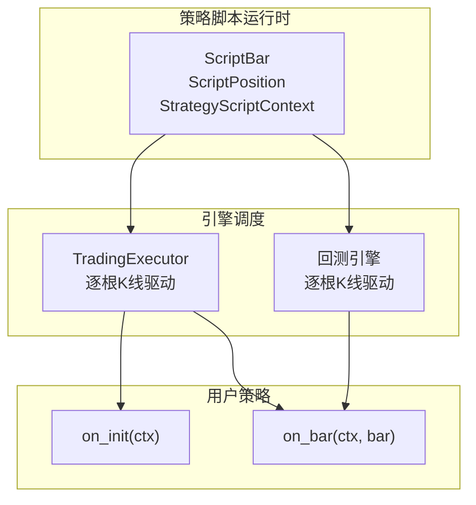
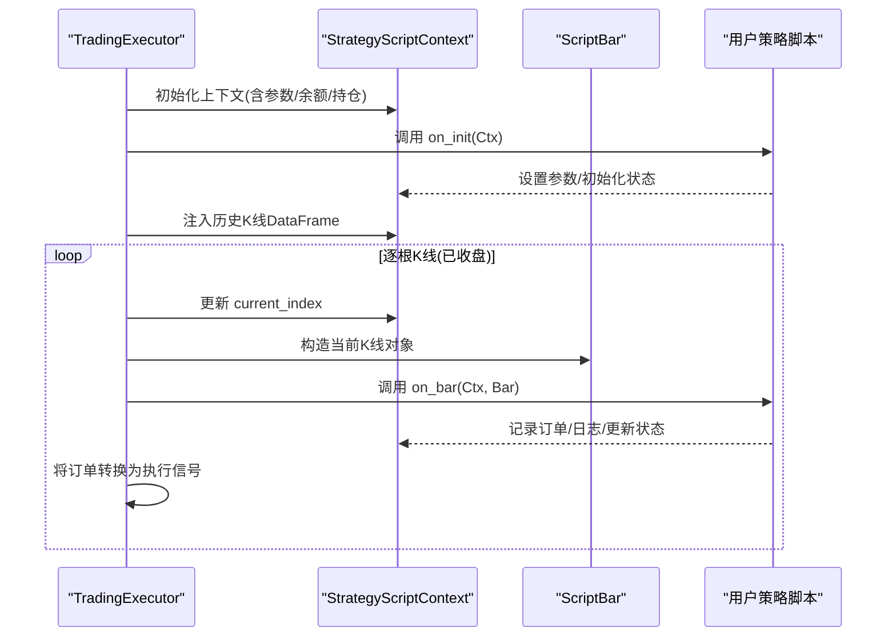
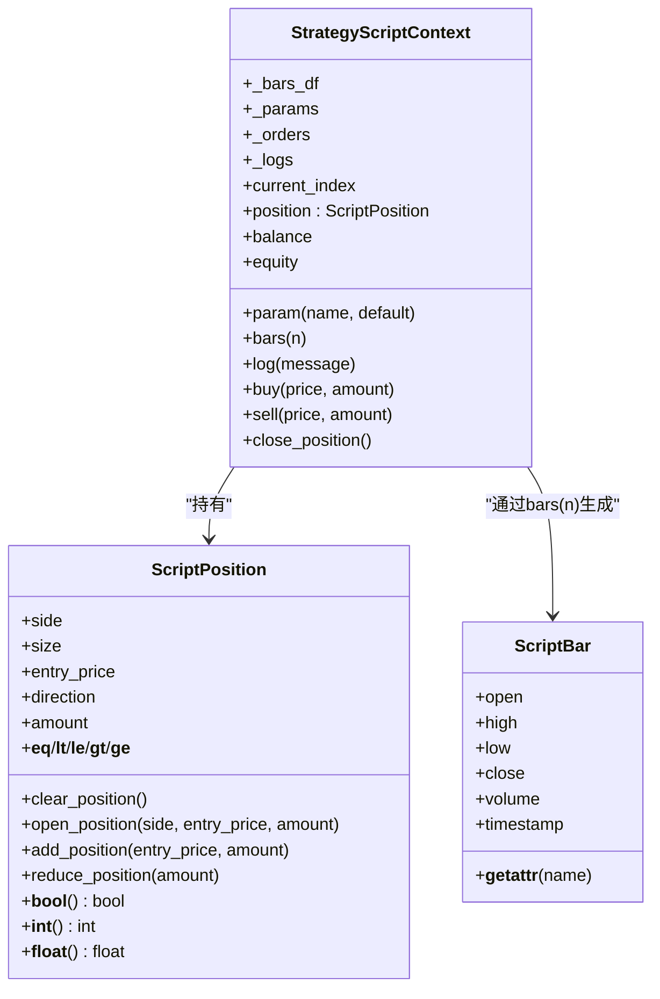

# 核心函数详解

<cite>
**本文引用的文件列表**
- [strategy_script_runtime.py](file://backend_api_python/app/services/strategy_script_runtime.py)
- [trading_executor.py](file://backend_api_python/app/services/trading_executor.py)
- [strategy.py](file://backend_api_python/app/routes/strategy.py)
- [backtest.py](file://backend_api_python/app/services/backtest.py)
- [STRATEGY_DEV_GUIDE_CN.md](file://docs/STRATEGY_DEV_GUIDE_CN.md)
</cite>

## 目录
1. [简介](#简介)
2. [项目结构与定位](#项目结构与定位)
3. [核心组件总览](#核心组件总览)
4. [架构概览](#架构概览)
5. [详细组件分析](#详细组件分析)
6. [依赖关系分析](#依赖关系分析)
7. [性能与并发特性](#性能与并发特性)
8. [故障排查指南](#故障排查指南)
9. [结论](#结论)
10. [附录：函数签名与调用约定](#附录函数签名与调用约定)

## 简介
本文件聚焦于 ScriptStrategy 的两个核心函数：on_init(ctx) 与 on_bar(ctx, bar)，系统性阐述它们的职责、实现要点、参数语义、执行时机、错误处理与日志记录，并给出可操作的实现建议与最佳实践。读者无需深厚的编程背景，也能据此正确编写策略脚本。

## 项目结构与定位
- ScriptStrategy 的运行时由策略脚本运行时模块提供，核心类型包括 ScriptBar、ScriptPosition、StrategyScriptContext。
- 实盘与回测均通过 TradingExecutor 驱动，逐根 K 线调用 on_bar；on_init 在策略启动时调用一次。
- 文档与路由层提供了 on_init/on_bar 的接口规范与示例，便于开发者遵循。

**图表来源**
- [strategy_script_runtime.py:17-157](file://backend_api_python/app/services/strategy_script_runtime.py#L17-L157)
- [trading_executor.py:995-1013](file://backend_api_python/app/services/trading_executor.py#L995-L1013)
- [backtest.py:2031-2238](file://backend_api_python/app/services/backtest.py#L2031-L2238)

**章节来源**
- [strategy_script_runtime.py:1-191](file://backend_api_python/app/services/strategy_script_runtime.py#L1-L191)
- [trading_executor.py:995-1013](file://backend_api_python/app/services/trading_executor.py#L995-L1013)
- [backtest.py:2031-2238](file://backend_api_python/app/services/backtest.py#L2031-L2238)

## 核心组件总览
- ScriptBar：封装单根 K 线数据，支持字典与属性两种访问方式，包含 open、high、low、close、volume、timestamp 字段。
- ScriptPosition：封装当前持仓状态，支持数值比较与字典字段访问，包含 side、size、entry_price、direction、amount 等。
- StrategyScriptContext：策略上下文，承载参数、订单队列、日志、当前索引、持仓、余额与净值等，提供 param、bars、log、buy、sell、close_position 等方法。

**章节来源**
- [strategy_script_runtime.py:17-157](file://backend_api_python/app/services/strategy_script_runtime.py#L17-L157)

## 架构概览
on_init 与 on_bar 的调用流程如下：

**图表来源**
- [trading_executor.py:995-1013](file://backend_api_python/app/services/trading_executor.py#L995-L1013)
- [trading_executor.py:719-773](file://backend_api_python/app/services/trading_executor.py#L719-L773)
- [strategy_script_runtime.py:114-157](file://backend_api_python/app/services/strategy_script_runtime.py#L114-L157)

## 详细组件分析

### on_init(ctx) 函数详解
- 职责
  - 初始化策略参数与内部状态，读取并缓存 ctx.param(name, default)。
  - 可进行一次性资源准备、状态恢复（如从持久化状态加载）。
- 关键实现要点
  - 使用 ctx.param(name, default) 读取/设置默认参数，避免硬编码。
  - 可通过 ctx.log(message) 记录初始化信息，便于调试与审计。
  - 可在 on_init 中读取历史数据（如 ctx.bars(n)），但更推荐在 on_bar 中按需使用。
- 执行时机
  - 在策略启动时调用一次，位于首次 on_bar 之前。
- 错误处理与日志
  - on_init 调用异常会被捕获并记录，不影响后续 on_bar 的执行。
- 实现模式
  - 仅做初始化，不做下单意图表达；下单意图通过 on_bar 中的 ctx.buy/ctx.sell/ctx.close_position 完成。

**章节来源**
- [strategy.py:1744-1766](file://backend_api_python/app/routes/strategy.py#L1744-L1766)
- [trading_executor.py:999-1010](file://backend_api_python/app/services/trading_executor.py#L999-L1010)

### on_bar(ctx, bar) 函数详解
- 职责
  - 每根已收盘 K 线触发一次，基于当前 bar 与 ctx 状态做出交易决策。
- 参数与语义
  - ctx：策略上下文，包含参数、订单队列、日志、当前索引、持仓、余额与净值。
  - bar：当前 K 线对象，支持 bar.close 与 bar['close'] 访问，字段包括 open、high、low、close、volume、timestamp。
- 执行时机
  - 严格在“K 线确认收盘”之后调用，确保信号基于已确认的价格数据。
- 实现模式
  - 读取 ctx.bars(n) 获取最近 N 根 K 线，计算技术指标或信号。
  - 基于 ctx.position 判断当前是否持有头寸及方向，决定开仓、加仓、反手或平仓。
  - 使用 ctx.buy(price, amount)、ctx.sell(price, amount)、ctx.close_position() 表达下单意图。
  - 使用 ctx.log(message) 记录关键事件与诊断信息。
- 错误处理
  - on_bar 异常被捕获并记录，不影响后续 K 线处理。

**章节来源**
- [strategy.py:1744-1766](file://backend_api_python/app/routes/strategy.py#L1744-L1766)
- [strategy_script_runtime.py:132-157](file://backend_api_python/app/services/strategy_script_runtime.py#L132-L157)
- [trading_executor.py:719-773](file://backend_api_python/app/services/trading_executor.py#L719-L773)

### bar 对象属性结构与使用
- 属性清单
  - open：开盘价
  - high：最高价
  - low：最低价
  - close：收盘价
  - volume：成交量
  - timestamp：时间戳
- 访问方式
  - 支持 bar.close 与 bar['close'] 两种方式。
- 使用建议
  - 仅使用已收盘的 bar 数据进行决策，避免前瞻。
  - 使用 ctx.bars(n) 获取多根 K 线，结合 close、high、low、volume 等字段进行分析。

**章节来源**
- [strategy_script_runtime.py:17-23](file://backend_api_python/app/services/strategy_script_runtime.py#L17-L23)
- [strategy_script_runtime.py:132-144](file://backend_api_python/app/services/strategy_script_runtime.py#L132-L144)

### ctx 上下文能力与约束
- 参数与状态
  - ctx.param(name, default)：读取/设置参数，避免硬编码。
  - ctx.bars(n)：获取最近 N 根 K 线，返回 ScriptBar 列表。
  - ctx.position：当前持仓，支持数值比较与字典字段访问。
  - ctx.balance、ctx.equity：账户余额与净值。
- 下单意图
  - ctx.buy(price=None, amount=None)、ctx.sell(price=None, amount=None)、ctx.close_position()。
- 日志
  - ctx.log(message)：记录运行时日志，便于调试与审计。
- 约束与注意
  - amount 更适合理解为运行时下单意图，最终仓位仍受产品配置（如 entryPct）影响。
  - 在多头/空头持仓中调用相反方向的下单，可能被解释为“先平后反手”。

**章节来源**
- [strategy_script_runtime.py:114-157](file://backend_api_python/app/services/strategy_script_runtime.py#L114-L157)
- [STRATEGY_DEV_GUIDE_CN.md:600-779](file://docs/STRATEGY_DEV_GUIDE_CN.md#L600-L779)

## 依赖关系分析
- 运行时类型依赖
  - ScriptBar/ScriptPosition/StrategyScriptContext 由策略脚本运行时模块定义。
- 调度依赖
  - TradingExecutor 在策略启动时调用 on_init，在每根已收盘 K 线调用 on_bar。
  - 回测引擎在逐根 K 线上驱动 on_bar，行为与实盘保持一致。
- 接口契约
  - on_bar 必须存在；on_init 可选。
  - on_bar 接收 ctx 与 bar 两个参数，返回值不使用。

**图表来源**
- [strategy_script_runtime.py:17-157](file://backend_api_python/app/services/strategy_script_runtime.py#L17-L157)

**章节来源**
- [strategy_script_runtime.py:17-157](file://backend_api_python/app/services/strategy_script_runtime.py#L17-L157)

## 性能与并发特性
- 性能特征
  - on_bar 每根 K 线执行，复杂度取决于策略逻辑与指标计算。
  - ctx.bars(n) 通过 DataFrame 切片与迭代器生成 ScriptBar，注意 n 不宜过大以免内存压力。
- 并发与稳定性
  - on_init/on_bar 在单线程引擎中顺序执行，无需考虑并发竞争。
  - 异常被捕获并记录，保证策略执行的鲁棒性。

[本节为通用性能讨论，不直接分析具体文件]

## 故障排查指南
- 常见问题
  - 缺少 on_bar：编译阶段会报错，必须定义。
  - on_init 报错：不影响后续 on_bar，但可能导致状态未初始化。
  - on_bar 报错：异常被捕获并记录，检查日志定位问题。
- 调试建议
  - 使用 ctx.log 记录关键中间变量与决策依据。
  - 逐步缩小范围：先验证 on_init 是否成功，再验证 on_bar 的输入数据与逻辑分支。
  - 对比回测与实盘结果，确认是否存在前瞻或时序差异。

**章节来源**
- [strategy_script_runtime.py:159-191](file://backend_api_python/app/services/strategy_script_runtime.py#L159-L191)
- [trading_executor.py:763-768](file://backend_api_python/app/services/trading_executor.py#L763-L768)

## 结论
- on_init 与 on_bar 是 ScriptStrategy 的两大支柱：前者负责初始化与状态恢复，后者负责逐根 K 线的交易决策。
- 正确使用 ctx.param、ctx.bars、ctx.position、ctx.buy/sell/close_position 与 ctx.log，是编写高质量策略的关键。
- 遵循“已收盘 K 线驱动”的心智模型，避免前瞻与过度拟合，确保策略在回测与实盘中的一致性。

[本节为总结性内容，不直接分析具体文件]

## 附录：函数签名与调用约定
- 函数签名规范
  - on_init(ctx)
  - on_bar(ctx, bar)
- 调用约定
  - on_bar 必须存在；on_init 可选。
  - on_bar 接收 ctx（策略上下文）与 bar（当前 K 线对象）。
  - ctx 提供 param、bars、position、balance、equity、log、buy、sell、close_position 等能力。
  - bar 支持属性与字典两种访问方式，字段包括 open、high、low、close、volume、timestamp。
- 实践建议
  - 使用 ctx.param 管理默认参数，避免硬编码。
  - 使用 ctx.bars(n) 获取所需的历史窗口，结合 close、high、low、volume 进行分析。
  - 使用 ctx.buy/sell/close_position 表达下单意图，避免直接修改内部状态。
  - 使用 ctx.log 记录关键事件，便于调试与审计。

**章节来源**
- [strategy.py:1744-1766](file://backend_api_python/app/routes/strategy.py#L1744-L1766)
- [strategy_script_runtime.py:114-157](file://backend_api_python/app/services/strategy_script_runtime.py#L114-L157)
- [STRATEGY_DEV_GUIDE_CN.md:600-779](file://docs/STRATEGY_DEV_GUIDE_CN.md#L600-L779)