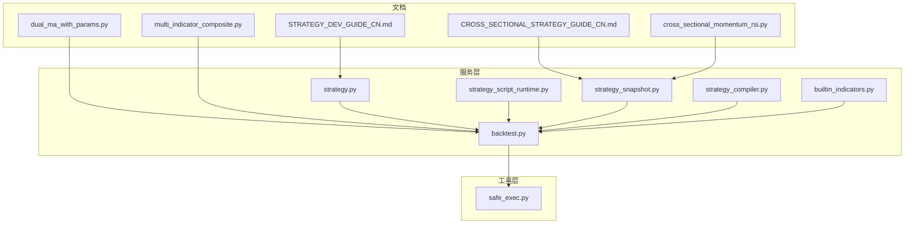
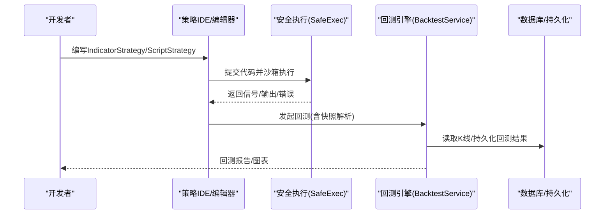
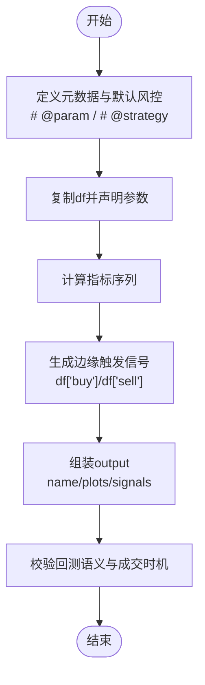
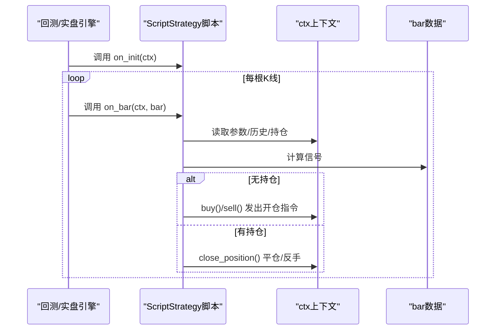
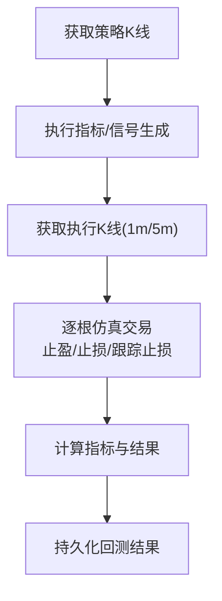
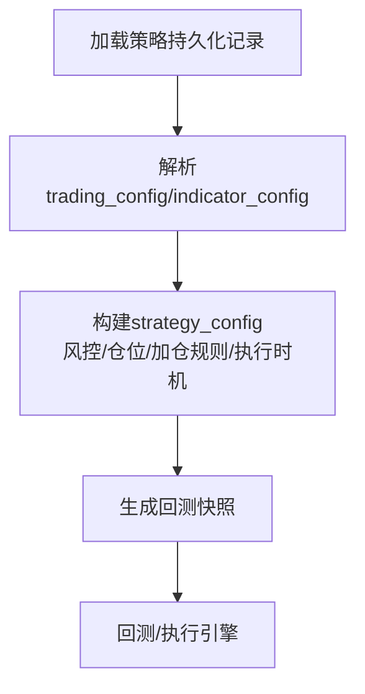
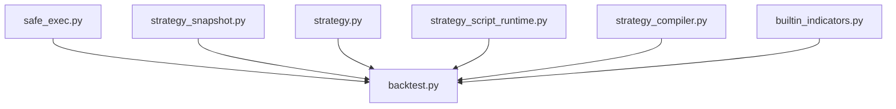

# 策略开发

<cite>
**本文引用的文件**
- [STRATEGY_DEV_GUIDE_CN.md](file://docs/STRATEGY_DEV_GUIDE_CN.md)
- [CROSS_SECTIONAL_STRATEGY_GUIDE_CN.md](file://docs/CROSS_SECTIONAL_STRATEGY_GUIDE_CN.md)
- [dual_ma_with_params.py](file://docs/examples/dual_ma_with_params.py)
- [multi_indicator_composite.py](file://docs/examples/multi_indicator_composite.py)
- [cross_sectional_momentum_rsi.py](file://docs/examples/cross_sectional_momentum_rsi.py)
- [strategy.py](file://backend_api_python/app/services/strategy.py)
- [strategy_script_runtime.py](file://backend_api_python/app/services/strategy_script_runtime.py)
- [builtin_indicators.py](file://backend_api_python/app/services/builtin_indicators.py)
- [backtest.py](file://backend_api_python/app/services/backtest.py)
- [safe_exec.py](file://backend_api_python/app/utils/safe_exec.py)
- [strategy_compiler.py](file://backend_api_python/app/services/strategy_compiler.py)
- [strategy_snapshot.py](file://backend_api_python/app/services/strategy_snapshot.py)
</cite>

## 目录
1. [引言](#引言)
2. [项目结构](#项目结构)
3. [核心组件](#核心组件)
4. [架构总览](#架构总览)
5. [详细组件分析](#详细组件分析)
6. [依赖分析](#依赖分析)
7. [性能考虑](#性能考虑)
8. [故障排查指南](#故障排查指南)
9. [结论](#结论)
10. [附录](#附录)

## 引言
本指南面向QuantDinger策略开发者，系统讲解两种主要策略开发模式：
- IndicatorStrategy：基于DataFrame的信号脚本，用于图表渲染、信号型回测与策略原型验证。
- ScriptStrategy：事件驱动的on_init(ctx)/on_bar(ctx, bar)脚本，具备显式的运行时控制与状态管理。

内容涵盖开发模式选择、环境搭建、基础与高级示例、参数化与复合指标、跨市场动量策略、生命周期管理、版本控制与性能优化等。

## 项目结构
QuantDinger后端以服务层为核心，围绕策略开发与回测形成闭环：
- 文档层：策略开发指南与示例脚本
- 服务层：策略服务、回测服务、脚本运行时、安全执行、策略快照解析
- 工具层：安全沙箱执行、指标参数解析与编译器

**图示来源**
- [STRATEGY_DEV_GUIDE_CN.md](file://docs/STRATEGY_DEV_GUIDE_CN.md)
- [CROSS_SECTIONAL_STRATEGY_GUIDE_CN.md](file://docs/CROSS_SECTIONAL_STRATEGY_GUIDE_CN.md)
- [strategy.py](file://backend_api_python/app/services/strategy.py)
- [strategy_script_runtime.py](file://backend_api_python/app/services/strategy_script_runtime.py)
- [backtest.py](file://backend_api_python/app/services/backtest.py)
- [strategy_snapshot.py](file://backend_api_python/app/services/strategy_snapshot.py)
- [strategy_compiler.py](file://backend_api_python/app/services/strategy_compiler.py)
- [builtin_indicators.py](file://backend_api_python/app/services/builtin_indicators.py)
- [safe_exec.py](file://backend_api_python/app/utils/safe_exec.py)

**章节来源**
- [STRATEGY_DEV_GUIDE_CN.md](file://docs/STRATEGY_DEV_GUIDE_CN.md)
- [CROSS_SECTIONAL_STRATEGY_GUIDE_CN.md](file://docs/CROSS_SECTIONAL_STRATEGY_GUIDE_CN.md)

## 核心组件
- 策略服务（StrategyService）：运行中策略查询、交易所符号与连接测试、策略状态更新、策略显示信息构建等。
- 脚本运行时（StrategyScriptRuntime）：ScriptStrategy的运行时上下文、bar封装、位置状态、订单队列与日志。
- 回测服务（BacktestService）：多时间框架回测、信号执行、交易仿真、指标缓存、结果持久化。
- 安全执行（SafeExec）：白名单内置函数、受限导入、超时与内存限制、子进程隔离。
- 策略快照解析（StrategySnapshotResolver）：将策略持久化记录转换为回测/执行所需的快照配置。
- 策略编译器（StrategyCompiler）：将配置编译为可执行的IndicatorStrategy脚本。
- 内置指标（BuiltinIndicators）：新用户注册时写入内置示例指标包。

**章节来源**
- [strategy.py](file://backend_api_python/app/services/strategy.py)
- [strategy_script_runtime.py](file://backend_api_python/app/services/strategy_script_runtime.py)
- [backtest.py](file://backend_api_python/app/services/backtest.py)
- [safe_exec.py](file://backend_api_python/app/utils/safe_exec.py)
- [strategy_snapshot.py](file://backend_api_python/app/services/strategy_snapshot.py)
- [strategy_compiler.py](file://backend_api_python/app/services/strategy_compiler.py)
- [builtin_indicators.py](file://backend_api_python/app/services/builtin_indicators.py)

## 架构总览
策略从“信号脚本”到“回测/实盘”的关键流程：
- IndicatorStrategy：在沙箱中执行，生成buy/sell信号与图表输出，支持参数与默认风控声明。
- ScriptStrategy：在回测/实盘中逐根驱动，通过ctx读取bar、管理position、发出buy/sell/close指令。
- 回测引擎：加载K线、执行信号、仿真交易、计算指标并持久化结果。
- 快照解析：将策略持久化配置转换为回测所需的标准快照，补齐成交时机、风控与仓位等。

**图示来源**
- [safe_exec.py](file://backend_api_python/app/utils/safe_exec.py)
- [backtest.py](file://backend_api_python/app/services/backtest.py)
- [strategy_snapshot.py](file://backend_api_python/app/services/strategy_snapshot.py)

## 详细组件分析

### IndicatorStrategy：基于DataFrame的信号脚本
- 设计要点
  - 元数据与默认风控：通过注释声明参数与默认风控（止损、止盈、跟踪止损、入场比例、交易方向）。
  - 三层分离：指标层（均线、RSI、ATR等）、信号层（df['buy']/df['sell']）、风险默认配置层。
  - 回测语义：信号在下一根K线开盘价成交，避免未来函数。
- 开发步骤
  - 定义名称、描述、参数与默认风控
  - 复制df并计算指标
  - 将原始条件转化为边缘触发的buy/sell
  - 组装output（name/plots/signals）
  - 校验回测语义与成交时机
- 示例参考
  - 双均线策略（参数化与平台对齐）
  - 多指标组合策略（均线+RSI+MACD+成交量过滤）

**图示来源**
- [STRATEGY_DEV_GUIDE_CN.md](file://docs/STRATEGY_DEV_GUIDE_CN.md)
- [dual_ma_with_params.py](file://docs/examples/dual_ma_with_params.py)
- [multi_indicator_composite.py](file://docs/examples/multi_indicator_composite.py)

**章节来源**
- [STRATEGY_DEV_GUIDE_CN.md](file://docs/STRATEGY_DEV_GUIDE_CN.md)
- [dual_ma_with_params.py](file://docs/examples/dual_ma_with_params.py)
- [multi_indicator_composite.py](file://docs/examples/multi_indicator_composite.py)

### ScriptStrategy：事件驱动的运行时脚本
- 设计要点
  - 必需函数：on_init(ctx)、on_bar(ctx, bar)，ctx提供param/bars/position/balance/equity/log以及下单接口。
  - 运行时状态：通过ctx.position读取当前持仓，动态止盈止损、分批加减仓、冷却期与机器人式执行。
  - 与回测/实盘一致性：amount更偏向下单意图，最终仓位由保存后的策略配置（如entryPct）主导。
- 开发步骤
  - 初始化参数与日志
  - 在on_bar中读取bars与计算信号
  - 基于ctx.position与风控条件发出buy/sell/close
  - 关注bot模式与标准bar-close模式的差异
- 示例参考
  - 带运行时退出的ScriptStrategy
  - 更贴近实盘的ScriptStrategy（参数化、多空双向、风控）

**图示来源**
- [strategy_script_runtime.py](file://backend_api_python/app/services/strategy_script_runtime.py)
- [STRATEGY_DEV_GUIDE_CN.md](file://docs/STRATEGY_DEV_GUIDE_CN.md)

**章节来源**
- [strategy_script_runtime.py](file://backend_api_python/app/services/strategy_script_runtime.py)
- [STRATEGY_DEV_GUIDE_CN.md](file://docs/STRATEGY_DEV_GUIDE_CN.md)

### 回测服务：多时间框架与交易仿真
- 多时间框架（MTF）回测
  - 策略信号在较高周期生成，执行在1m/5m精细K线仿真，提升精度并规避未来函数。
  - 当不支持或无更高精度数据时回退为标准回测。
- 交易仿真
  - 基于信号与风控配置（止损、止盈、跟踪止损、加仓/减仓规则）模拟逐根成交。
  - 记录交易明细、权益曲线并持久化。
- 指标缓存
  - 内存K线缓存（带TTL），减少重复拉取，提升性能。

**图示来源**
- [backtest.py](file://backend_api_python/app/services/backtest.py)

**章节来源**
- [backtest.py](file://backend_api_python/app/services/backtest.py)

### 策略快照解析：从持久化到回测
- 将策略持久化记录转换为回测/执行快照，补齐：
  - 市场、符号、时间框架
  - 初始资金、手续费、滑点、杠杆
  - 策略类型/模式、运行类型（indicator/script）
  - 风控、仓位、加仓/减仓规则、信号时机
- 跨市场动量策略当前限制：截面策略暂不进入标准回测/实盘链路。

**图示来源**
- [strategy_snapshot.py](file://backend_api_python/app/services/strategy_snapshot.py)

**章节来源**
- [strategy_snapshot.py](file://backend_api_python/app/services/strategy_snapshot.py)
- [CROSS_SECTIONAL_STRATEGY_GUIDE_CN.md](file://docs/CROSS_SECTIONAL_STRATEGY_GUIDE_CN.md)

### 策略编译器：将配置编译为IndicatorStrategy
- 将策略配置（指标、参数、入场规则、风控、加仓规则）编译为可执行的IndicatorStrategy脚本。
- 自动生成plot与signals输出，便于回测与可视化。

**章节来源**
- [strategy_compiler.py](file://backend_api_python/app/services/strategy_compiler.py)

### 内置指标：新用户示例
- 注册新用户时写入内置示例指标包，避免重复插入，便于快速上手。

**章节来源**
- [builtin_indicators.py](file://backend_api_python/app/services/builtin_indicators.py)

## 依赖分析
- 安全执行（SafeExec）为策略脚本提供沙箱环境，限制内置函数与导入模块，防止危险操作。
- 回测服务依赖数据源工厂与指标参数解析，确保信号生成与回测一致性。
- 策略服务提供运行中策略查询、交易所连接测试与策略状态管理。
- 快照解析贯穿策略生命周期，保证回测/实盘一致性。

**图示来源**
- [safe_exec.py](file://backend_api_python/app/utils/safe_exec.py)
- [backtest.py](file://backend_api_python/app/services/backtest.py)
- [strategy_snapshot.py](file://backend_api_python/app/services/strategy_snapshot.py)
- [strategy.py](file://backend_api_python/app/services/strategy.py)
- [strategy_script_runtime.py](file://backend_api_python/app/services/strategy_script_runtime.py)
- [strategy_compiler.py](file://backend_api_python/app/services/strategy_compiler.py)
- [builtin_indicators.py](file://backend_api_python/app/services/builtin_indicators.py)

**章节来源**
- [safe_exec.py](file://backend_api_python/app/utils/safe_exec.py)
- [backtest.py](file://backend_api_python/app/services/backtest.py)
- [strategy_snapshot.py](file://backend_api_python/app/services/strategy_snapshot.py)
- [strategy.py](file://backend_api_python/app/services/strategy.py)
- [strategy_script_runtime.py](file://backend_api_python/app/services/strategy_script_runtime.py)
- [strategy_compiler.py](file://backend_api_python/app/services/strategy_compiler.py)
- [builtin_indicators.py](file://backend_api_python/app/services/builtin_indicators.py)

## 性能考虑
- 多时间框架回测
  - 在支持范围内优先使用1m/5m执行K线提升精度；当不支持或信号周期已足够细时回退为标准回测。
  - 当存在加仓/减仓规则或非“next_bar_open”信号时机时，禁用MTF并记录回退原因。
- 指标缓存
  - 内存K线缓存（带TTL），减少重复拉取，控制最大缓存数量。
- 安全执行
  - 严格超时与内存限制，避免长时间或大内存占用导致系统不稳定。
- 回测指标
  - 交易仿真中避免未来函数，严格按“下一根K线开盘价成交”回测语义执行。

**章节来源**
- [backtest.py](file://backend_api_python/app/services/backtest.py)
- [safe_exec.py](file://backend_api_python/app/utils/safe_exec.py)

## 故障排查指南
- 代码安全与沙箱
  - 若报“危险代码模式/语法错误/AST解析失败”，检查导入模块与调用函数是否在白名单内。
- 回测失败
  - 检查数据范围与K线是否为空；确认信号索引与df_signal索引一致；关注MTF回测回退原因。
- 交易所连接
  - 使用策略服务的连接测试接口，查看返回的提示信息与错误原因（如币安权限、IP白名单、base_url不匹配等）。
- 策略状态
  - 批量启停策略时，若数据库状态与线程状态不一致，系统会自动修复为stopped，避免“僵尸”状态。

**章节来源**
- [safe_exec.py](file://backend_api_python/app/utils/safe_exec.py)
- [backtest.py](file://backend_api_python/app/services/backtest.py)
- [strategy.py](file://backend_api_python/app/services/strategy.py)

## 结论
- 选择策略模式的关键在于是否需要运行时状态与动态风控：若仅需信号与默认风控，优先IndicatorStrategy；若需要逐根状态管理与复杂执行逻辑，采用ScriptStrategy。
- 开发流程建议：先用IndicatorStrategy验证信号与回测语义，再升级为ScriptStrategy实现动态风控与执行节奏。
- 回测与实盘一致性：通过快照解析与回测引擎确保成交时机、风控与仓位配置的一致性；跨市场动量策略当前以研究为主，后续将逐步接入标准链路。

## 附录

### 开发模式选择矩阵
- 适用场景
  - IndicatorStrategy：指标研究、信号验证、参数调优、信号型回测
  - ScriptStrategy：有状态执行、动态止盈止损、分批加减仓、冷却期与机器人式执行
- 选择标准
  - 信号驱动为主：IndicatorStrategy
  - 需要运行时状态与复杂执行：ScriptStrategy

**章节来源**
- [STRATEGY_DEV_GUIDE_CN.md](file://docs/STRATEGY_DEV_GUIDE_CN.md)

### 参数化策略与复合指标策略示例
- 双均线策略（参数化与平台对齐）
- 多指标组合策略（均线+RSI+MACD+成交量过滤）
- 截面策略指标示例（动量+RSI复合评分）

**章节来源**
- [dual_ma_with_params.py](file://docs/examples/dual_ma_with_params.py)
- [multi_indicator_composite.py](file://docs/examples/multi_indicator_composite.py)
- [cross_sectional_momentum_rsi.py](file://docs/examples/cross_sectional_momentum_rsi.py)

### 跨市场动量策略
- 截面策略支持多标、自动排序、组合管理、定期调仓与批量执行。
- 当前限制：截面策略暂不进入标准回测/实盘链路，建议作为研究参考。

**章节来源**
- [CROSS_SECTIONAL_STRATEGY_GUIDE_CN.md](file://docs/CROSS_SECTIONAL_STRATEGY_GUIDE_CN.md)