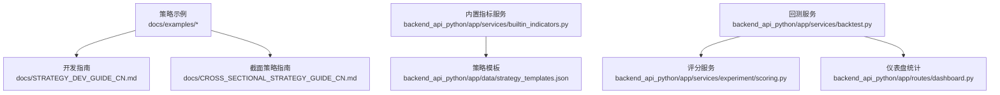
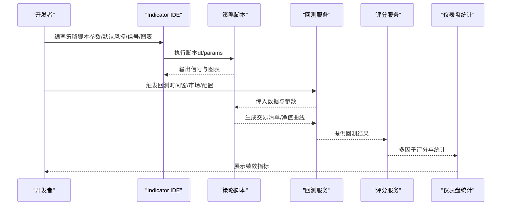
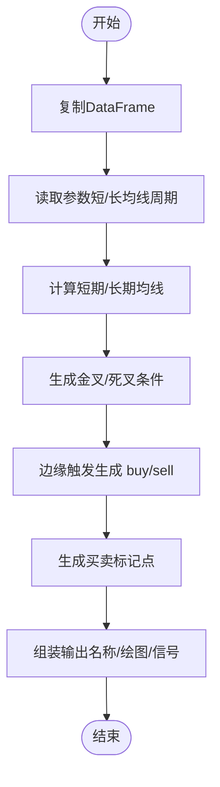
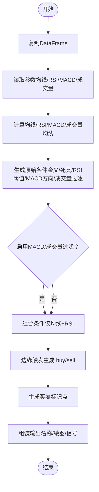
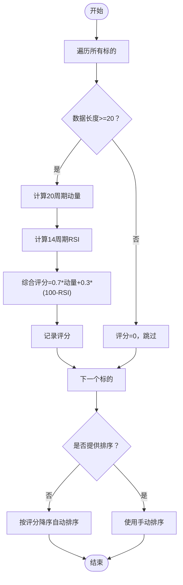
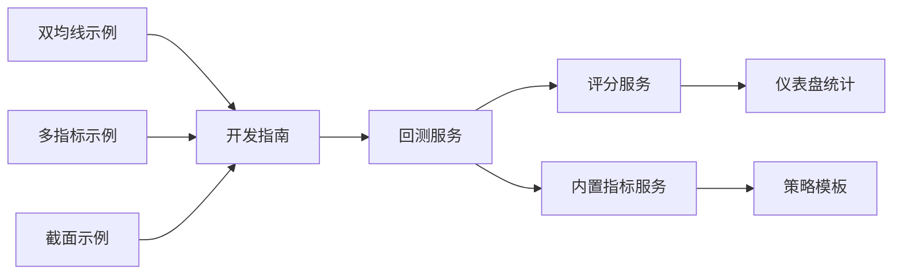

# 策略开发示例

<cite>
**本文引用的文件**
- [dual_ma_with_params.py](file://docs/examples/dual_ma_with_params.py)
- [multi_indicator_composite.py](file://docs/examples/multi_indicator_composite.py)
- [cross_sectional_momentum_rsi.py](file://docs/examples/cross_sectional_momentum_rsi.py)
- [STRATEGY_DEV_GUIDE_CN.md](file://docs/STRATEGY_DEV_GUIDE_CN.md)
- [CROSS_SECTIONAL_STRATEGY_GUIDE_CN.md](file://docs/CROSS_SECTIONAL_STRATEGY_GUIDE_CN.md)
- [builtin_indicators.py](file://backend_api_python/app/services/builtin_indicators.py)
- [strategy_templates.json](file://backend_api_python/app/data/strategy_templates.json)
- [scoring.py](file://backend_api_python/app/services/experiment/scoring.py)
- [backtest.py](file://backend_api_python/app/services/backtest.py)
- [dashboard.py](file://backend_api_python/app/routes/dashboard.py)
</cite>

## 目录
1. [引言](#引言)
2. [项目结构](#项目结构)
3. [核心组件](#核心组件)
4. [架构总览](#架构总览)
5. [详细组件分析](#详细组件分析)
6. [依赖分析](#依赖分析)
7. [性能考虑](#性能考虑)
8. [故障排查指南](#故障排查指南)
9. [结论](#结论)
10. [附录](#附录)

## 引言
本文件围绕 QuantDinger 平台提供的策略开发示例，系统梳理从基础双均线参数化策略，到多指标复合策略，再到截面动量 RSI 策略的完整演进路径。文档不仅解释策略逻辑、技术指标使用与参数配置，还提供参数调优方法、性能评估要点与最佳实践，帮助读者从简单技术指标组合逐步构建复杂多因子策略。

## 项目结构
仓库包含策略示例、开发指南、内置指标与回测服务等模块。策略示例位于 docs/examples，开发指南位于 docs，回测与评分服务位于 backend_api_python/app/services，策略模板位于 backend_api_python/app/data。

**图表来源**
- [dual_ma_with_params.py:1-64](file://docs/examples/dual_ma_with_params.py#L1-L64)
- [multi_indicator_composite.py:1-109](file://docs/examples/multi_indicator_composite.py#L1-L109)
- [cross_sectional_momentum_rsi.py:1-71](file://docs/examples/cross_sectional_momentum_rsi.py#L1-L71)
- [STRATEGY_DEV_GUIDE_CN.md:1-1270](file://docs/STRATEGY_DEV_GUIDE_CN.md#L1-L1270)
- [CROSS_SECTIONAL_STRATEGY_GUIDE_CN.md:1-224](file://docs/CROSS_SECTIONAL_STRATEGY_GUIDE_CN.md#L1-L224)
- [builtin_indicators.py:1-250](file://backend_api_python/app/services/builtin_indicators.py#L1-L250)
- [strategy_templates.json:1-191](file://backend_api_python/app/data/strategy_templates.json#L1-L191)
- [backtest.py:1-200](file://backend_api_python/app/services/backtest.py#L1-L200)
- [scoring.py:1-140](file://backend_api_python/app/services/experiment/scoring.py#L1-L140)
- [dashboard.py:127-167](file://backend_api_python/app/routes/dashboard.py#L127-L167)

**章节来源**
- [dual_ma_with_params.py:1-64](file://docs/examples/dual_ma_with_params.py#L1-L64)
- [multi_indicator_composite.py:1-109](file://docs/examples/multi_indicator_composite.py#L1-L109)
- [cross_sectional_momentum_rsi.py:1-71](file://docs/examples/cross_sectional_momentum_rsi.py#L1-L71)
- [STRATEGY_DEV_GUIDE_CN.md:1-1270](file://docs/STRATEGY_DEV_GUIDE_CN.md#L1-L1270)
- [CROSS_SECTIONAL_STRATEGY_GUIDE_CN.md:1-224](file://docs/CROSS_SECTIONAL_STRATEGY_GUIDE_CN.md#L1-L224)
- [builtin_indicators.py:1-250](file://backend_api_python/app/services/builtin_indicators.py#L1-L250)
- [strategy_templates.json:1-191](file://backend_api_python/app/data/strategy_templates.json#L1-L191)
- [backtest.py:1-200](file://backend_api_python/app/services/backtest.py#L1-L200)
- [scoring.py:1-140](file://backend_api_python/app/services/experiment/scoring.py#L1-L140)
- [dashboard.py:127-167](file://backend_api_python/app/routes/dashboard.py#L127-L167)

## 核心组件
- 策略示例：双均线参数化、多指标复合、截面动量 RSI
- 开发指南：策略分层、参数与默认风控声明、信号生成与图表输出
- 回测与评分：多因子评分、回测统计、仪表盘指标
- 内置指标与模板：平台内置示例与策略模板

**章节来源**
- [STRATEGY_DEV_GUIDE_CN.md:93-560](file://docs/STRATEGY_DEV_GUIDE_CN.md#L93-L560)
- [backtest.py:64-200](file://backend_api_python/app/services/backtest.py#L64-L200)
- [scoring.py:10-140](file://backend_api_python/app/services/experiment/scoring.py#L10-L140)
- [builtin_indicators.py:17-185](file://backend_api_python/app/services/builtin_indicators.py#L17-L185)
- [strategy_templates.json:1-191](file://backend_api_python/app/data/strategy_templates.json#L1-L191)

## 架构总览
策略开发在平台中的典型流程：Indicator IDE 原型 → 参数与默认风控声明 → 信号生成与图表输出 → 回测与评分 → 保存为策略 → 实盘执行。

**图表来源**
- [STRATEGY_DEV_GUIDE_CN.md:93-295](file://docs/STRATEGY_DEV_GUIDE_CN.md#L93-L295)
- [backtest.py:64-200](file://backend_api_python/app/services/backtest.py#L64-L200)
- [scoring.py:23-75](file://backend_api_python/app/services/experiment/scoring.py#L23-L75)
- [dashboard.py:127-167](file://backend_api_python/app/routes/dashboard.py#L127-L167)

## 详细组件分析

### 双均线参数化策略
- 策略目标：短期/长期均线金叉/死叉生成买卖信号，平台默认风控处理
- 关键点：
  - 使用参数声明与默认风控声明，便于参数调优与回测面板对齐
  - 通过边缘触发避免重复信号
  - 图表输出包含均线与买卖标记点
- 参数与风控：
  - 周期参数：短期/长期均线周期
  - 默认风控：止损、止盈、入场比例、跟踪止损开关与方向
- 信号生成：
  - 金叉/死叉条件与边缘触发逻辑
- 图表输出：
  - 均线覆盖图层与买卖信号标注

**图表来源**
- [dual_ma_with_params.py:31-64](file://docs/examples/dual_ma_with_params.py#L31-L64)

**章节来源**
- [dual_ma_with_params.py:1-64](file://docs/examples/dual_ma_with_params.py#L1-L64)
- [STRATEGY_DEV_GUIDE_CN.md:93-295](file://docs/STRATEGY_DEV_GUIDE_CN.md#L93-L295)

### 多指标复合策略
- 策略目标：均线、RSI、MACD 与成交量过滤共同参与的组合信号
- 关键点：
  - 参数声明覆盖均线、RSI、MACD、成交量过滤开关与倍数
  - 默认风控包含跟踪止损与方向
  - 将原始条件整合为更稳定的边缘触发信号
- 指标计算：
  - 均线：短期/长期
  - RSI：涨跌平均法计算
  - MACD：指数平滑计算
  - 成交量均线与过滤
- 信号合成：
  - 原始条件：均线金叉/死叉、RSI超买/超卖、MACD方向、成交量过滤
  - 组合条件：按开关启用 MACD 与成交量过滤
  - 边缘触发生成 buy/sell
- 图表输出：
  - 均线、RSI、MACD 独立图层与买卖标记点

**图表来源**
- [multi_indicator_composite.py:35-109](file://docs/examples/multi_indicator_composite.py#L35-L109)

**章节来源**
- [multi_indicator_composite.py:1-109](file://docs/examples/multi_indicator_composite.py#L1-L109)
- [STRATEGY_DEV_GUIDE_CN.md:93-295](file://docs/STRATEGY_DEV_GUIDE_CN.md#L93-L295)

### 截面动量 RSI 策略
- 策略目标：对多个标的打分并排序，构建多空组合
- 关键点：
  - 动量因子（20周期）与 RSI 反转值（14周期）组合评分
  - 权重：70% 动量 + 30% RSI 反转
  - 当前平台对 cross_sectional 的回测/实盘链路限制说明
- 评分逻辑：
  - 遍历每个标的，确保数据长度足够
  - 计算动量与 RSI，生成综合评分
  - 可选手动排序，否则按评分降序
- 使用建议：
  - 作为研究参考，理解“对多个标的打分再排序”的基本写法
  - 待平台链路完善后，可由系统统一生成买卖/平仓动作

**图表来源**
- [cross_sectional_momentum_rsi.py:26-71](file://docs/examples/cross_sectional_momentum_rsi.py#L26-L71)

**章节来源**
- [cross_sectional_momentum_rsi.py:1-71](file://docs/examples/cross_sectional_momentum_rsi.py#L1-L71)
- [CROSS_SECTIONAL_STRATEGY_GUIDE_CN.md:60-123](file://docs/CROSS_SECTIONAL_STRATEGY_GUIDE_CN.md#L60-L123)

## 依赖分析
- 策略示例依赖开发指南中的分层与参数/风控声明规范
- 回测服务提供统一回测入口与缓存机制
- 评分服务将回测结果转换为多因子评分
- 仪表盘统计提供交易层面的绩效指标
- 内置指标与策略模板为策略开发提供起点与参考

**图表来源**
- [STRATEGY_DEV_GUIDE_CN.md:93-295](file://docs/STRATEGY_DEV_GUIDE_CN.md#L93-L295)
- [backtest.py:64-200](file://backend_api_python/app/services/backtest.py#L64-L200)
- [scoring.py:10-140](file://backend_api_python/app/services/experiment/scoring.py#L10-L140)
- [dashboard.py:127-167](file://backend_api_python/app/routes/dashboard.py#L127-L167)
- [builtin_indicators.py:17-185](file://backend_api_python/app/services/builtin_indicators.py#L17-L185)
- [strategy_templates.json:1-191](file://backend_api_python/app/data/strategy_templates.json#L1-L191)

**章节来源**
- [STRATEGY_DEV_GUIDE_CN.md:93-295](file://docs/STRATEGY_DEV_GUIDE_CN.md#L93-L295)
- [backtest.py:64-200](file://backend_api_python/app/services/backtest.py#L64-L200)
- [scoring.py:10-140](file://backend_api_python/app/services/experiment/scoring.py#L10-L140)
- [dashboard.py:127-167](file://backend_api_python/app/routes/dashboard.py#L127-L167)
- [builtin_indicators.py:17-185](file://backend_api_python/app/services/builtin_indicators.py#L17-L185)
- [strategy_templates.json:1-191](file://backend_api_python/app/data/strategy_templates.json#L1-L191)

## 性能考虑
- 回测缓存：K线缓存按时间框与容量限制，减少重复拉取
- 时间框限制：不同时间框的最大回测天数限制，保障性能
- 多因子评分：对回测结果进行标准化与加权，兼顾样本量与稳定性
- 仪表盘统计：交易层面指标计算，避免重复计算

**章节来源**
- [backtest.py:25-82](file://backend_api_python/app/services/backtest.py#L25-L82)
- [backtest.py:170-200](file://backend_api_python/app/services/backtest.py#L170-L200)
- [scoring.py:13-22](file://backend_api_python/app/services/experiment/scoring.py#L13-L22)
- [dashboard.py:127-167](file://backend_api_python/app/routes/dashboard.py#L127-L167)

## 故障排查指南
- 常见问题定位：
  - 未来数据误用、信号非边缘触发、混合退出逻辑未明确、默认风控与策略风格不符
- 后端日志排查：
  - 数据库结构不匹配、JSON/配置载荷格式错误、代码校验失败、市场/符号不匹配、交易所凭证异常
- 工作流建议：
  - 先在 Indicator IDE 原型，再跑指标回测，确认信号密度与成交语义，最后保存为策略并进行实盘校验

**章节来源**
- [STRATEGY_DEV_GUIDE_CN.md:862-906](file://docs/STRATEGY_DEV_GUIDE_CN.md#L862-L906)
- [STRATEGY_DEV_GUIDE_CN.md:883-906](file://docs/STRATEGY_DEV_GUIDE_CN.md#L883-L906)

## 结论
通过三个策略示例，我们展示了从双均线到多指标复合，再到截面动量 RSI 的策略演进路径。开发指南明确了分层与参数/风控声明规范，回测与评分服务提供了可比较的性能评估维度。遵循最佳实践、避免常见陷阱，可稳步提升策略质量与稳定性。

## 附录

### 策略优化技巧与参数调优方法
- 参数扫描：结构化网格/随机搜索，结合回测结果评分
- 多时间框验证：在不同时间框下验证策略稳健性
- 回归期检测：根据市场阶段（牛市/熊市/震荡/高波动）调整权重
- 交易成本与滑点：在回测中纳入手续费与滑点，避免过度拟合

**章节来源**
- [scoring.py:23-75](file://backend_api_python/app/services/experiment/scoring.py#L23-L75)
- [STRATEGY_DEV_GUIDE_CN.md:883-906](file://docs/STRATEGY_DEV_GUIDE_CN.md#L883-L906)

### 性能评估要点
- 多因子评分：总收益、年化收益、夏普比率、盈亏比、胜率、最大回撤、稳定性、样本量
- 仪表盘统计：总交易数、胜率、总利润/损失、最大单笔盈利/亏损、最大回撤/百分比
- 等级划分：根据总体评分划分等级，便于横向比较

**章节来源**
- [scoring.py:66-75](file://backend_api_python/app/services/experiment/scoring.py#L66-L75)
- [dashboard.py:127-167](file://backend_api_python/app/routes/dashboard.py#L127-L167)

### 策略开发最佳实践
- 分层清晰：指标层、信号层、默认风控层
- 参数与风控分离：参数通过 params 读取，风控通过 # @strategy 声明
- 边缘触发：避免重复信号，保证回测语义清晰
- 杠杆与产品配置分离：杠杆在产品面板设置，不在脚本中硬编码
- 保存后回测：验证最终策略快照的成交与仓位暴露

**章节来源**
- [STRATEGY_DEV_GUIDE_CN.md:57-149](file://docs/STRATEGY_DEV_GUIDE_CN.md#L57-L149)
- [STRATEGY_DEV_GUIDE_CN.md:177-242](file://docs/STRATEGY_DEV_GUIDE_CN.md#L177-L242)
- [STRATEGY_DEV_GUIDE_CN.md:298-363](file://docs/STRATEGY_DEV_GUIDE_CN.md#L298-L363)