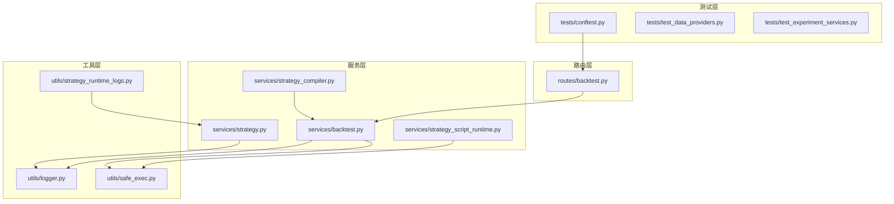
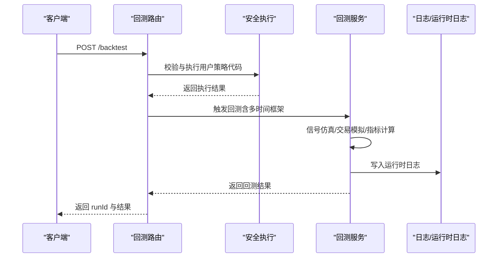
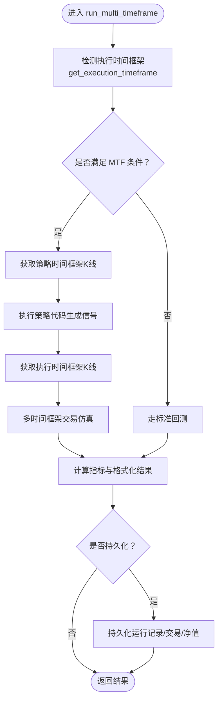
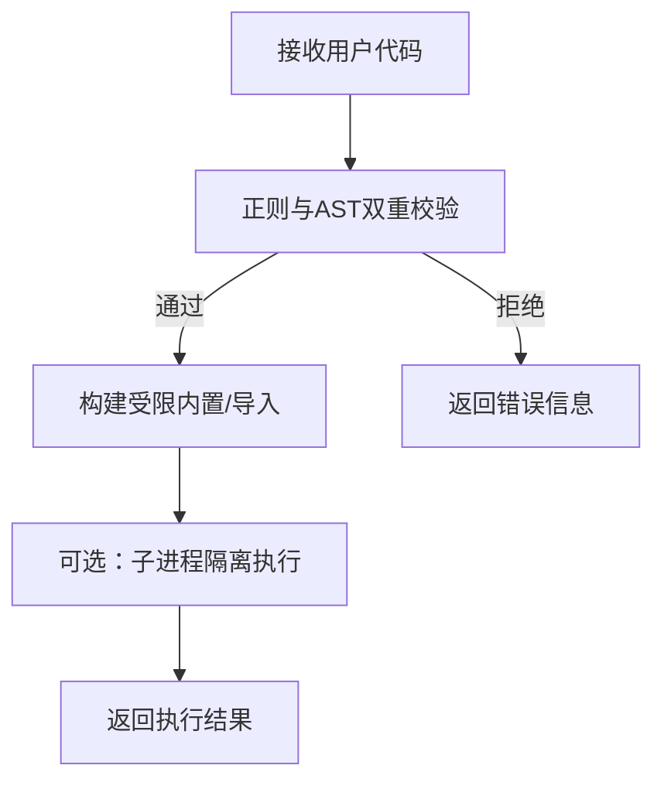
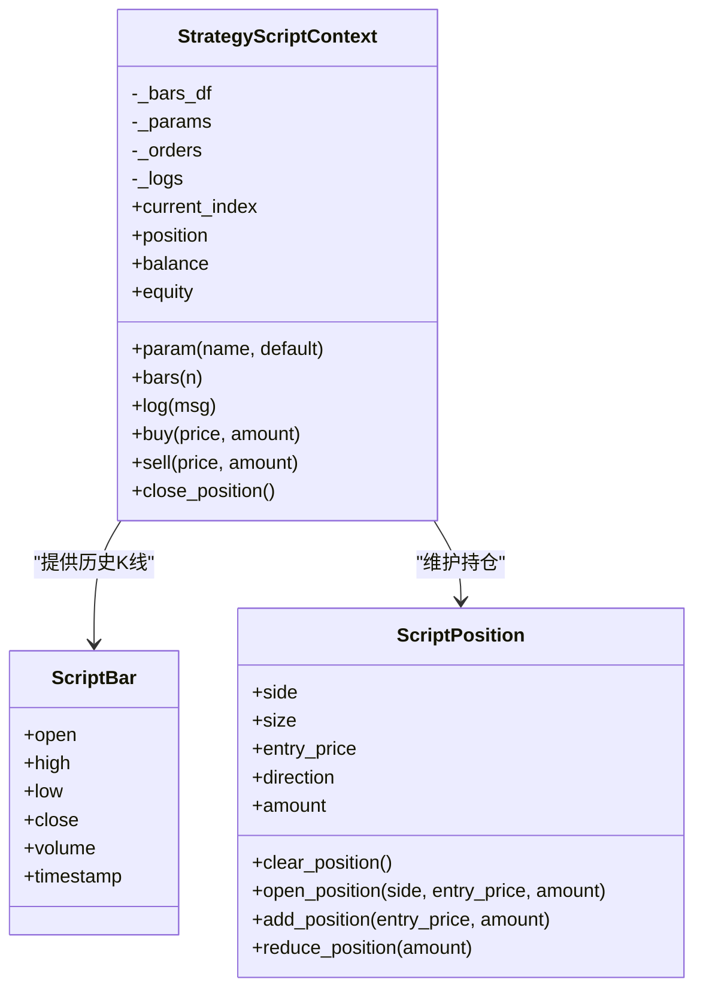
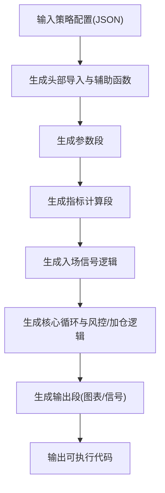
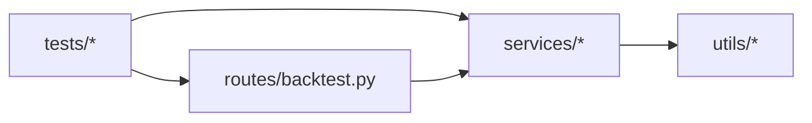

# 策略测试与调试

<cite>
**本文引用的文件**
- [backend_api_python/tests/conftest.py](file://backend_api_python/tests/conftest.py)
- [backend_api_python/tests/test_data_providers.py](file://backend_api_python/tests/test_data_providers.py)
- [backend_api_python/tests/test_experiment_services.py](file://backend_api_python/tests/test_experiment_services.py)
- [backend_api_python/app/routes/backtest.py](file://backend_api_python/app/routes/backtest.py)
- [backend_api_python/app/services/backtest.py](file://backend_api_python/app/services/backtest.py)
- [backend_api_python/app/utils/safe_exec.py](file://backend_api_python/app/utils/safe_exec.py)
- [backend_api_python/app/utils/logger.py](file://backend_api_python/app/utils/logger.py)
- [backend_api_python/app/utils/strategy_runtime_logs.py](file://backend_api_python/app/utils/strategy_runtime_logs.py)
- [backend_api_python/app/services/strategy.py](file://backend_api_python/app/services/strategy.py)
- [backend_api_python/app/services/strategy_compiler.py](file://backend_api_python/app/services/strategy_compiler.py)
- [backend_api_python/app/services/strategy_script_runtime.py](file://backend_api_python/app/services/strategy_script_runtime.py)
- [docs/STRATEGY_DEV_GUIDE.md](file://docs/STRATEGY_DEV_GUIDE.md)
- [docs/examples/cross_sectional_momentum_rsi.py](file://docs/examples/cross_sectional_momentum_rsi.py)
</cite>

## 目录
1. [引言](#引言)
2. [项目结构](#项目结构)
3. [核心组件](#核心组件)
4. [架构总览](#架构总览)
5. [详细组件分析](#详细组件分析)
6. [依赖分析](#依赖分析)
7. [性能考量](#性能考量)
8. [故障排查指南](#故障排查指南)
9. [结论](#结论)
10. [附录](#附录)

## 引言
本指南面向使用 QuantDinger 构建与验证策略的开发者，系统讲解策略测试与调试方法，覆盖单元测试、集成测试与回测验证，帮助你在开发过程中快速定位信号生成错误、参数设置问题与性能瓶颈，并提供参数敏感性分析与策略稳定性测试的实践路径。文档同时给出测试数据准备、测试环境搭建与测试结果分析的方法。

## 项目结构
QuantDinger 后端采用 Flask 应用，策略测试与回测相关能力集中在服务层与路由层，测试用例位于 tests 目录，策略开发与运行时行为由多处服务与工具模块支撑。

图示来源
- [backend_api_python/tests/conftest.py:1-31](file://backend_api_python/tests/conftest.py#L1-L31)
- [backend_api_python/tests/test_data_providers.py:1-193](file://backend_api_python/tests/test_data_providers.py#L1-L193)
- [backend_api_python/tests/test_experiment_services.py:1-132](file://backend_api_python/tests/test_experiment_services.py#L1-L132)
- [backend_api_python/app/routes/backtest.py:1-829](file://backend_api_python/app/routes/backtest.py#L1-L829)
- [backend_api_python/app/services/backtest.py:1-800](file://backend_api_python/app/services/backtest.py#L1-L800)
- [backend_api_python/app/services/strategy.py:1-800](file://backend_api_python/app/services/strategy.py#L1-L800)
- [backend_api_python/app/services/strategy_compiler.py:1-689](file://backend_api_python/app/services/strategy_compiler.py#L1-L689)
- [backend_api_python/app/services/strategy_script_runtime.py:1-191](file://backend_api_python/app/services/strategy_script_runtime.py#L1-L191)
- [backend_api_python/app/utils/safe_exec.py:1-471](file://backend_api_python/app/utils/safe_exec.py#L1-L471)
- [backend_api_python/app/utils/logger.py:1-63](file://backend_api_python/app/utils/logger.py#L1-L63)
- [backend_api_python/app/utils/strategy_runtime_logs.py:1-30](file://backend_api_python/app/utils/strategy_runtime_logs.py#L1-L30)

章节来源
- [backend_api_python/tests/conftest.py:1-31](file://backend_api_python/tests/conftest.py#L1-L31)
- [backend_api_python/app/routes/backtest.py:1-829](file://backend_api_python/app/routes/backtest.py#L1-L829)
- [backend_api_python/app/services/backtest.py:1-800](file://backend_api_python/app/services/backtest.py#L1-L800)

## 核心组件
- 回测服务与路由
  - 回测路由负责接收回测请求、参数校验、调用回测服务并持久化结果。
  - 回测服务实现多时间框架回测、信号仿真、交易模拟、指标计算与结果格式化。
- 安全执行与沙箱
  - 提供用户代码安全执行、超时控制、白名单导入与 AST/正则双重校验。
- 日志与运行时日志
  - 统一日志配置与运行时日志持久化，便于调试与审计。
- 策略服务与脚本运行时
  - 策略服务提供策略状态管理、连接测试与显示信息构建；脚本运行时提供 ScriptStrategy 的上下文与回调编译。

章节来源
- [backend_api_python/app/routes/backtest.py:149-376](file://backend_api_python/app/routes/backtest.py#L149-L376)
- [backend_api_python/app/services/backtest.py:64-668](file://backend_api_python/app/services/backtest.py#L64-L668)
- [backend_api_python/app/utils/safe_exec.py:157-244](file://backend_api_python/app/utils/safe_exec.py#L157-L244)
- [backend_api_python/app/utils/logger.py:9-63](file://backend_api_python/app/utils/logger.py#L9-L63)
- [backend_api_python/app/utils/strategy_runtime_logs.py:11-30](file://backend_api_python/app/utils/strategy_runtime_logs.py#L11-L30)
- [backend_api_python/app/services/strategy.py:14-800](file://backend_api_python/app/services/strategy.py#L14-L800)
- [backend_api_python/app/services/strategy_script_runtime.py:159-191](file://backend_api_python/app/services/strategy_script_runtime.py#L159-L191)

## 架构总览
回测从路由进入，经由安全执行与数据源加载，最终落到回测服务的多时间框架仿真与指标计算，期间通过日志与运行时日志进行可观测性。

图示来源
- [backend_api_python/app/routes/backtest.py:149-376](file://backend_api_python/app/routes/backtest.py#L149-L376)
- [backend_api_python/app/utils/safe_exec.py:207-244](file://backend_api_python/app/utils/safe_exec.py#L207-L244)
- [backend_api_python/app/services/backtest.py:444-668](file://backend_api_python/app/services/backtest.py#L444-L668)
- [backend_api_python/app/utils/strategy_runtime_logs.py:11-30](file://backend_api_python/app/utils/strategy_runtime_logs.py#L11-L30)

## 详细组件分析

### 组件A：回测路由与服务
- 路由职责
  - 接收回测请求，校验必填参数与时间窗口限制，支持多时间框架回测开关与持久化选项。
  - 调用回测服务执行回测，必要时落库保存运行历史与结果。
- 服务职责
  - 多时间框架回测：根据回测区间自动选择执行时间框架，若满足条件则使用高精度执行时间框架进行仿真。
  - 交易仿真：基于信号与执行时间框架推断 K 线内的价格路径，计算佣金与滑点影响，统计交易与净值曲线。
  - 指标计算：计算总收益、年化收益、胜率、总交易数、最大回撤、夏普比率、盈亏比等指标。
  - 结果持久化：将回测运行记录与交易明细、净值点位写入数据库。

图示来源
- [backend_api_python/app/services/backtest.py:444-668](file://backend_api_python/app/services/backtest.py#L444-L668)
- [backend_api_python/app/routes/backtest.py:262-300](file://backend_api_python/app/routes/backtest.py#L262-L300)

章节来源
- [backend_api_python/app/routes/backtest.py:149-376](file://backend_api_python/app/routes/backtest.py#L149-L376)
- [backend_api_python/app/services/backtest.py:64-668](file://backend_api_python/app/services/backtest.py#L64-L668)

### 组件B：安全执行与沙箱
- 安全执行
  - 通过白名单内置函数与受限导入模块，禁止危险操作；提供超时控制与内存限制。
  - 支持在当前进程内执行与子进程隔离两种模式，后者具备更强的隔离性。
- 代码校验
  - 正则与 AST 双重校验，拒绝潜在危险模式与非法模块导入。

图示来源
- [backend_api_python/app/utils/safe_exec.py:358-471](file://backend_api_python/app/utils/safe_exec.py#L358-L471)
- [backend_api_python/app/utils/safe_exec.py:157-244](file://backend_api_python/app/utils/safe_exec.py#L157-L244)

章节来源
- [backend_api_python/app/utils/safe_exec.py:157-244](file://backend_api_python/app/utils/safe_exec.py#L157-L244)
- [backend_api_python/app/utils/safe_exec.py:358-471](file://backend_api_python/app/utils/safe_exec.py#L358-L471)

### 组件C：策略脚本运行时
- 提供 ScriptStrategy 的运行时上下文，包括参数、历史 K 线、位置状态与下单指令。
- 编译用户脚本，提取 on_init/on_bar 回调，保证最小运行时约束。

图示来源
- [backend_api_python/app/services/strategy_script_runtime.py:17-191](file://backend_api_python/app/services/strategy_script_runtime.py#L17-L191)

章节来源
- [backend_api_python/app/services/strategy_script_runtime.py:159-191](file://backend_api_python/app/services/strategy_script_runtime.py#L159-L191)

### 组件D：策略编译器（配置到代码）
- 将策略配置转换为可执行的 Python 代码，包含参数、指标计算、入场逻辑与核心循环，输出图表与信号标注。

图示来源
- [backend_api_python/app/services/strategy_compiler.py:4-689](file://backend_api_python/app/services/strategy_compiler.py#L4-L689)

章节来源
- [backend_api_python/app/services/strategy_compiler.py:4-689](file://backend_api_python/app/services/strategy_compiler.py#L4-L689)

### 组件E：策略服务与运行时日志
- 策略服务
  - 提供策略运行状态查询、连接测试、符号列表获取与显示信息构建。
- 运行时日志
  - 将策略运行日志持久化至数据库表，便于 UI 查看与审计。

章节来源
- [backend_api_python/app/services/strategy.py:14-800](file://backend_api_python/app/services/strategy.py#L14-L800)
- [backend_api_python/app/utils/strategy_runtime_logs.py:11-30](file://backend_api_python/app/utils/strategy_runtime_logs.py#L11-L30)

## 依赖分析
- 路由依赖服务层与工具层，服务层依赖安全执行与日志工具。
- 测试用例依赖路由与服务层，覆盖数据提供缓存、实验服务与回测流程。

图示来源
- [backend_api_python/tests/test_data_providers.py:1-193](file://backend_api_python/tests/test_data_providers.py#L1-L193)
- [backend_api_python/tests/test_experiment_services.py:1-132](file://backend_api_python/tests/test_experiment_services.py#L1-L132)
- [backend_api_python/app/routes/backtest.py:1-829](file://backend_api_python/app/routes/backtest.py#L1-L829)
- [backend_api_python/app/services/backtest.py:1-800](file://backend_api_python/app/services/backtest.py#L1-L800)
- [backend_api_python/app/utils/safe_exec.py:1-471](file://backend_api_python/app/utils/safe_exec.py#L1-L471)
- [backend_api_python/app/utils/logger.py:1-63](file://backend_api_python/app/utils/logger.py#L1-L63)

章节来源
- [backend_api_python/tests/test_data_providers.py:1-193](file://backend_api_python/tests/test_data_providers.py#L1-L193)
- [backend_api_python/tests/test_experiment_services.py:1-132](file://backend_api_python/tests/test_experiment_services.py#L1-L132)

## 性能考量
- 多时间框架回测
  - 根据回测区间自动选择执行时间框架，减少不必要的高精度数据拉取与仿真成本。
  - 当不满足条件时自动回退到标准回测，避免无效计算。
- 交易仿真与指标计算
  - 通过净值曲线与交易明细的批量处理与向量化计算，提升回测效率。
- 资源限制
  - 安全执行提供超时与内存限制，防止长耗时或内存泄漏导致系统不稳定。

章节来源
- [backend_api_python/app/services/backtest.py:170-224](file://backend_api_python/app/services/backtest.py#L170-L224)
- [backend_api_python/app/utils/safe_exec.py:157-205](file://backend_api_python/app/utils/safe_exec.py#L157-L205)

## 故障排查指南
- 信号生成错误
  - 检查策略代码是否正确生成布尔列 buy/sell，索引需与 K 线索引一致，避免 look-ahead。
  - 关注回测服务中对信号索引兼容性的告警与日志。
- 参数设置问题
  - 使用 # @param 与 # @strategy 明确声明可调参数与默认风险设置，避免硬编码。
  - 通过回测路由的参数校验与范围限制，提前发现非法输入。
- 性能瓶颈
  - 减少不必要的高精度数据拉取，合理设置回测区间。
  - 使用安全执行的超时与内存限制，避免策略执行卡顿。
- 运行时日志
  - 利用运行时日志持久化功能查看策略执行过程，定位异常分支与状态变化。

章节来源
- [docs/STRATEGY_DEV_GUIDE.md:177-295](file://docs/STRATEGY_DEV_GUIDE.md#L177-L295)
- [backend_api_python/app/routes/backtest.py:225-251](file://backend_api_python/app/routes/backtest.py#L225-L251)
- [backend_api_python/app/services/backtest.py:744-789](file://backend_api_python/app/services/backtest.py#L744-L789)
- [backend_api_python/app/utils/strategy_runtime_logs.py:11-30](file://backend_api_python/app/utils/strategy_runtime_logs.py#L11-L30)

## 结论
通过将策略开发、安全执行、回测仿真与日志观测有机结合，QuantDinger 提供了从单元测试到集成测试再到回测验证的完整闭环。遵循本文的测试与调试方法，可显著提升策略开发效率与质量，降低上线风险。

## 附录

### A. 测试方法与步骤
- 单元测试
  - 使用 pytest 固定应用与测试客户端，验证数据提供缓存、经济日历、Sentiment 获取等基础功能。
  - 示例：参见测试用例对缓存读写、HTTP 错误处理与参数校验的覆盖。
- 集成测试
  - 通过回测路由发起回测请求，验证参数校验、时间窗口限制与回测执行流程。
  - 使用实验服务测试策略变体生成与评分流程，辅助参数敏感性分析。
- 回测验证
  - 使用回测服务的多时间框架仿真与指标计算，验证策略在不同时间尺度下的表现。
  - 通过持久化运行记录与交易明细，复盘每笔交易的触发原因与盈亏构成。

章节来源
- [backend_api_python/tests/conftest.py:19-31](file://backend_api_python/tests/conftest.py#L19-L31)
- [backend_api_python/tests/test_data_providers.py:1-193](file://backend_api_python/tests/test_data_providers.py#L1-L193)
- [backend_api_python/tests/test_experiment_services.py:1-132](file://backend_api_python/tests/test_experiment_services.py#L1-L132)
- [backend_api_python/app/routes/backtest.py:149-376](file://backend_api_python/app/routes/backtest.py#L149-L376)

### B. 测试数据准备与环境搭建
- 测试环境
  - 使用 pytest 固定应用与测试客户端，设置最小化环境变量（如 SECRET_KEY、ADMIN_USER 等）。
- 测试数据
  - 使用 pandas DataFrame 构造典型行情序列，覆盖多时间框架与极端情况（如 NaN、空序列）。
- 截面策略示例
  - 参考示例文件了解跨标的评分与排序思路，便于扩展到多资产回测场景。

章节来源
- [backend_api_python/tests/conftest.py:8-14](file://backend_api_python/tests/conftest.py#L8-L14)
- [docs/examples/cross_sectional_momentum_rsi.py:1-71](file://docs/examples/cross_sectional_momentum_rsi.py#L1-L71)

### C. 参数敏感性分析与稳定性测试
- 参数网格测试
  - 固定信号逻辑，按步长改变关键参数（如止盈止损、入场规模），对比总收益、最大回撤、夏普比率等指标。
- 多区间对比
  - 在不同市场阶段（牛市/熊市/震荡）分别回测，评估策略稳健性。
- 实验管线
  - 使用实验服务的变体生成与评分，自动筛选最优参数组合。

章节来源
- [backend_api_python/tests/test_experiment_services.py:55-132](file://backend_api_python/tests/test_experiment_services.py#L55-L132)
- [backend_api_python/app/routes/backtest.py:665-800](file://backend_api_python/app/routes/backtest.py#L665-L800)

### D. 策略开发最佳实践
- 分离信号、风险与执行
  - 信号层只负责买卖决策，风险层通过 # @strategy 声明默认保护，执行层由引擎或脚本运行时负责。
- 可回溯性与可读性
  - 使用 # @param 与 # @strategy 明确参数与默认值，避免硬编码；输出图表与信号标注清晰可读。
- 与回测语义对齐
  - 信号在 K 线收盘确认，通常在下一根开盘价成交，避免前瞻偏差。

章节来源
- [docs/STRATEGY_DEV_GUIDE.md:20-295](file://docs/STRATEGY_DEV_GUIDE.md#L20-L295)