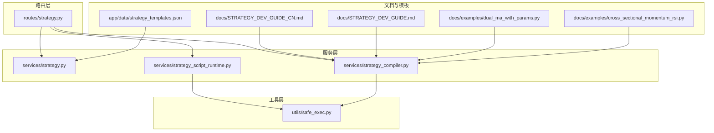
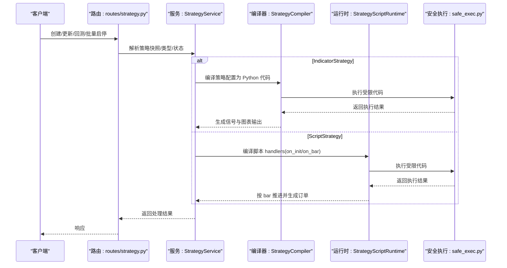
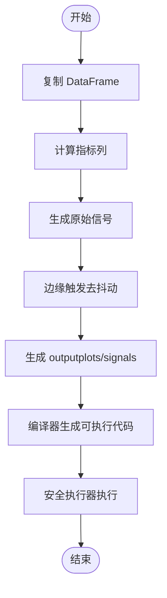
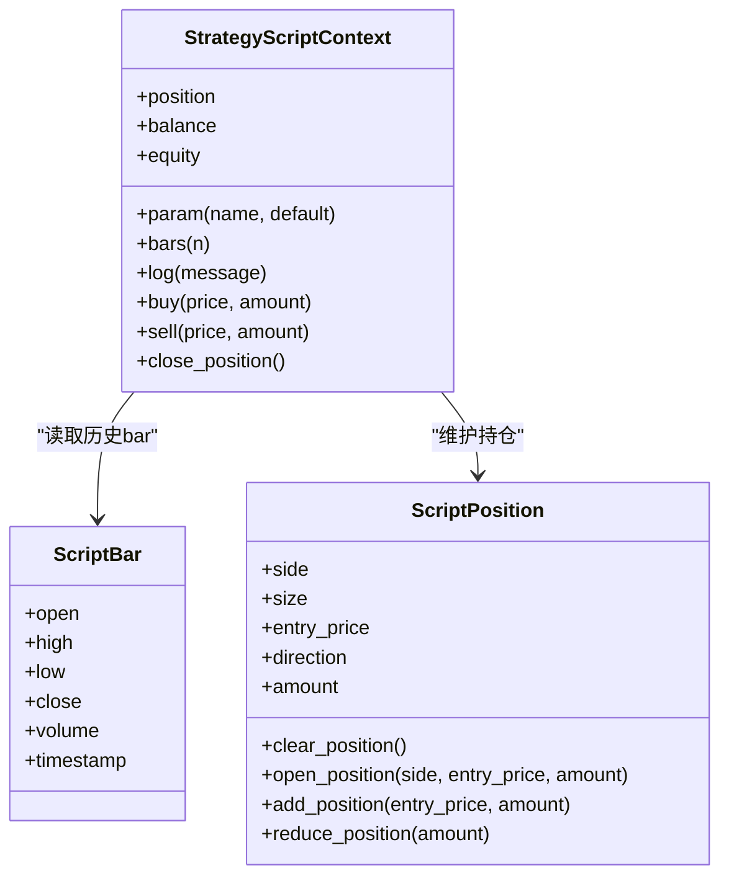
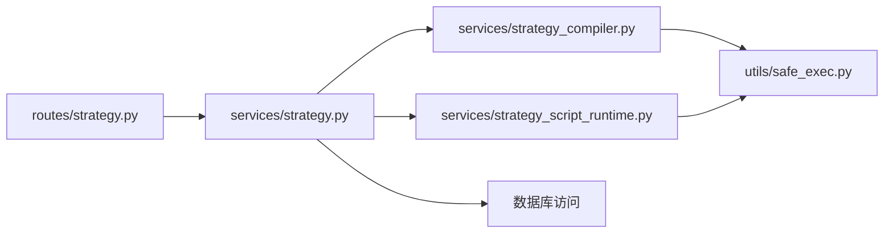

# 策略类型概述

<cite>
**本文引用的文件**
- [strategy.py](file://backend_api_python/app/services/strategy.py)
- [strategy_script_runtime.py](file://backend_api_python/app/services/strategy_script_runtime.py)
- [strategy_compiler.py](file://backend_api_python/app/services/strategy_compiler.py)
- [strategy.py](file://backend_api_python/app/routes/strategy.py)
- [safe_exec.py](file://backend_api_python/app/utils/safe_exec.py)
- [STRATEGY_DEV_GUIDE_CN.md](file://docs/STRATEGY_DEV_GUIDE_CN.md)
- [STRATEGY_DEV_GUIDE.md](file://docs/STRATEGY_DEV_GUIDE.md)
- [dual_ma_with_params.py](file://docs/examples/dual_ma_with_params.py)
- [cross_sectional_momentum_rsi.py](file://docs/examples/cross_sectional_momentum_rsi.py)
- [strategy_templates.json](file://backend_api_python/app/data/strategy_templates.json)
</cite>

## 目录
1. [引言](#引言)
2. [项目结构](#项目结构)
3. [核心组件](#核心组件)
4. [架构总览](#架构总览)
5. [详细组件分析](#详细组件分析)
6. [依赖关系分析](#依赖关系分析)
7. [性能考量](#性能考量)
8. [故障排查指南](#故障排查指南)
9. [结论](#结论)
10. [附录](#附录)

## 引言
本文件面向策略开发者，系统梳理 QuantDinger 的两类策略开发模式：IndicatorStrategy（基于数据框的 Python 脚本，用于生成买入/卖出信号、图表渲染与信号型回测）与 ScriptStrategy（事件驱动的 on_init(ctx)/on_bar(ctx, bar) 脚本，具备显式的运行时控制）。我们将从架构、数据流、处理逻辑、集成点、错误处理与性能特征等方面进行深入分析，并提供决策树帮助开发者根据自身需求选择合适模式，以及技术架构对比、性能特征与使用建议。

## 项目结构
QuantDinger 的策略体系围绕“服务层 + 路由层 + 工具层 + 文档与模板”组织：
- 服务层：策略服务、脚本运行时、策略编译器、回测服务等
- 路由层：策略 API 路由，负责策略生命周期、回测、批量启停等
- 工具层：安全执行器，保障用户脚本在受限沙箱中的安全运行
- 文档与模板：开发指南、示例脚本、策略模板 JSON



图表来源
- [strategy.py:1-200](file://backend_api_python/app/routes/strategy.py#L1-L200)
- [strategy.py:1-120](file://backend_api_python/app/services/strategy.py#L1-L120)
- [strategy_script_runtime.py:1-120](file://backend_api_python/app/services/strategy_script_runtime.py#L1-L120)
- [strategy_compiler.py:1-120](file://backend_api_python/app/services/strategy_compiler.py#L1-L120)
- [safe_exec.py:1-120](file://backend_api_python/app/utils/safe_exec.py#L1-L120)
- [STRATEGY_DEV_GUIDE_CN.md:1-120](file://docs/STRATEGY_DEV_GUIDE_CN.md#L1-L120)
- [STRATEGY_DEV_GUIDE.md:1-120](file://docs/STRATEGY_DEV_GUIDE.md#L1-L120)
- [dual_ma_with_params.py:1-64](file://docs/examples/dual_ma_with_params.py#L1-L64)
- [cross_sectional_momentum_rsi.py:1-71](file://docs/examples/cross_sectional_momentum_rsi.py#L1-L71)
- [strategy_templates.json:1-60](file://backend_api_python/app/data/strategy_templates.json#L1-L60)

章节来源
- [strategy.py:1-200](file://backend_api_python/app/routes/strategy.py#L1-L200)
- [strategy.py:1-120](file://backend_api_python/app/services/strategy.py#L1-L120)
- [strategy_script_runtime.py:1-120](file://backend_api_python/app/services/strategy_script_runtime.py#L1-L120)
- [strategy_compiler.py:1-120](file://backend_api_python/app/services/strategy_compiler.py#L1-L120)
- [safe_exec.py:1-120](file://backend_api_python/app/utils/safe_exec.py#L1-L120)
- [STRATEGY_DEV_GUIDE_CN.md:1-120](file://docs/STRATEGY_DEV_GUIDE_CN.md#L1-L120)
- [STRATEGY_DEV_GUIDE.md:1-120](file://docs/STRATEGY_DEV_GUIDE.md#L1-L120)
- [dual_ma_with_params.py:1-64](file://docs/examples/dual_ma_with_params.py#L1-L64)
- [cross_sectional_momentum_rsi.py:1-71](file://docs/examples/cross_sectional_momentum_rsi.py#L1-L71)
- [strategy_templates.json:1-60](file://backend_api_python/app/data/strategy_templates.json#L1-L60)

## 核心组件
- 策略服务（StrategyService）：提供策略查询、运行中策略统计、策略类型查询、状态更新、交易所符号与连接测试等能力
- 脚本运行时（StrategyScriptRuntime）：封装 ScriptStrategy 的上下文对象（ctx）、bar 对象、位置对象、订单队列与日志，提供编译与运行时校验
- 策略编译器（StrategyCompiler）：将策略配置转换为可执行的 Python 代码，生成信号列与图表输出
- 路由（routes/strategy.py）：策略 API，包括模板加载、回测、批量启停、交易记录查询等
- 安全执行器（safe_exec.py）：构建受限内置与模块白名单、超时与内存限制、跨平台超时注入、子进程隔离等

章节来源
- [strategy.py:1-120](file://backend_api_python/app/services/strategy.py#L1-L120)
- [strategy_script_runtime.py:1-120](file://backend_api_python/app/services/strategy_script_runtime.py#L1-L120)
- [strategy_compiler.py:1-120](file://backend_api_python/app/services/strategy_compiler.py#L1-L120)
- [strategy.py:1-200](file://backend_api_python/app/routes/strategy.py#L1-L200)
- [safe_exec.py:1-120](file://backend_api_python/app/utils/safe_exec.py#L1-L120)

## 架构总览
策略类型在系统中的交互关系如下：
- 路由层接收请求，调用服务层完成策略生命周期管理与回测
- 服务层根据策略类型选择不同的执行路径：IndicatorStrategy 通过编译器生成信号与图表；ScriptStrategy 通过运行时上下文在 bar 级别推进
- 安全执行器贯穿两类策略的代码执行阶段，确保沙箱与超时控制



图表来源
- [strategy.py:1-200](file://backend_api_python/app/routes/strategy.py#L1-L200)
- [strategy.py:1-120](file://backend_api_python/app/services/strategy.py#L1-L120)
- [strategy_compiler.py:1-120](file://backend_api_python/app/services/strategy_compiler.py#L1-L120)
- [strategy_script_runtime.py:1-120](file://backend_api_python/app/services/strategy_script_runtime.py#L1-L120)
- [safe_exec.py:1-120](file://backend_api_python/app/utils/safe_exec.py#L1-L120)

## 详细组件分析

### IndicatorStrategy（基于数据框的信号策略）
- 核心特点
  - 基于 DataFrame 的指标与信号计算，输出布尔型 buy/sell 列
  - 通过元数据声明默认策略配置（如止损、止盈、入场比例、交易方向等）
  - 生成图表绘制所需的 plots 与 signals
  - 适合指标研究、信号型回测与保存为平台策略
- 数据流与处理逻辑
  - 复制 df，计算指标列
  - 将原始条件转换为边缘触发的 buy/sell 布尔列
  - 生成 output（包含 name、plots、signals 等）
  - 通过编译器生成完整可执行脚本并执行
- 性能特征
  - 以向量化计算为主，适合大规模标的与长周期回测
  - 图表渲染与信号输出在单次执行中完成
- 适用场景
  - 指标研究、参数调优、信号验证、保存为策略
- 优缺点
  - 优点：开发简单、回测语义清晰、易于可视化
  - 缺点：无法表达复杂的运行时状态与动态风控



图表来源
- [strategy_compiler.py:1-120](file://backend_api_python/app/services/strategy_compiler.py#L1-L120)
- [safe_exec.py:1-120](file://backend_api_python/app/utils/safe_exec.py#L1-L120)

章节来源
- [strategy_compiler.py:1-120](file://backend_api_python/app/services/strategy_compiler.py#L1-L120)
- [STRATEGY_DEV_GUIDE_CN.md:93-295](file://docs/STRATEGY_DEV_GUIDE_CN.md#L93-L295)
- [STRATEGY_DEV_GUIDE.md:93-295](file://docs/STRATEGY_DEV_GUIDE.md#L93-L295)
- [dual_ma_with_params.py:1-64](file://docs/examples/dual_ma_with_params.py#L1-L64)

### ScriptStrategy（事件驱动的运行时策略）
- 核心特点
  - 事件驱动：on_init(ctx) 初始化，on_bar(ctx, bar) 按 bar 推进
  - 运行时上下文：ctx 提供参数、历史 bar、位置、余额、权益、日志与下单接口
  - 动态风控：基于当前持仓状态动态调整止损、止盈、加减仓与冷却
- 数据流与处理逻辑
  - 编译脚本，提取 on_init/on_bar
  - 每根 bar 触发 on_bar，读取 ctx.bars(n)、ctx.position、ctx.param(...)
  - 通过 ctx.buy()/ctx.sell()/ctx.close_position() 下单意图
  - 订单队列与日志在运行时上下文中维护
- 性能特征
  - 每根 bar 的循环与条件判断，适合中小规模标的与实时/准实时场景
  - 可通过 bot 模式以类 tick 的伪 bar 驱动，适合网格/DCA 等机器人策略
- 适用场景
  - 需要运行时状态、动态风控、分批加减仓、bot 风格执行
- 优缺点
  - 优点：灵活、可控、可表达复杂执行逻辑
  - 缺点：开发复杂度较高，调试与回测语义需更谨慎



图表来源
- [strategy_script_runtime.py:1-191](file://backend_api_python/app/services/strategy_script_runtime.py#L1-L191)

章节来源
- [strategy_script_runtime.py:1-191](file://backend_api_python/app/services/strategy_script_runtime.py#L1-L191)
- [STRATEGY_DEV_GUIDE_CN.md:570-780](file://docs/STRATEGY_DEV_GUIDE_CN.md#L570-L780)
- [STRATEGY_DEV_GUIDE.md:570-780](file://docs/STRATEGY_DEV_GUIDE.md#L570-L780)

### 策略类型的技术架构对比
- 执行模型
  - IndicatorStrategy：一次性生成信号与图表，适合信号型回测
  - ScriptStrategy：按 bar 逐根推进，适合运行时控制与实盘
- 数据结构
  - IndicatorStrategy：以 DataFrame 为中心，输出布尔信号与图表
  - ScriptStrategy：以 ctx 为中心，读取 bar、位置与参数
- 安全与隔离
  - 两类策略均通过安全执行器在受限环境中执行，防止危险操作
- 回测与持久化
  - 路由层支持策略回测、历史查询、批量启停与交易记录查询
  - 策略模板与示例脚本辅助快速入门

章节来源
- [strategy.py:1-200](file://backend_api_python/app/routes/strategy.py#L1-L200)
- [safe_exec.py:1-120](file://backend_api_python/app/utils/safe_exec.py#L1-L120)
- [strategy_templates.json:1-120](file://backend_api_python/app/data/strategy_templates.json#L1-L120)
- [dual_ma_with_params.py:1-64](file://docs/examples/dual_ma_with_params.py#L1-L64)

### 决策树：如何选择策略模式
- 优先使用 IndicatorStrategy 的场景
  - 仅需表达“条件 A 出现就买，条件 B 出现就卖”的信号逻辑
  - 需要先验证图表、信号与回测语义
  - 仅需固定止损、止盈、入场比例等默认风控
- 迁移至 ScriptStrategy 的场景
  - 需要运行时状态（如当前持仓）做判断
  - 止损止盈依赖当前持仓状态动态变化
  - 需要分批加仓、减仓、部分止盈或冷却期
  - 需要 bot 风格执行（网格、DCA 等）

```mermaid
flowchart TD
A["开始"] --> B{"逻辑是否可表达为<br/>\"条件A出现就买，条件B出现就卖\"?"}
B -- 是 --> C["优先使用 IndicatorStrategy"]
B -- 否 --> D{"是否需要运行时状态/动态风控?"}
D -- 否 --> C
D -- 是 --> E{"是否需要分批/冷却/机器人执行?"}
E -- 否 --> F["可考虑简化为 IndicatorStrategy 的默认风控"]
E -- 是 --> G["使用 ScriptStrategy"]
C --> H["验证图表/信号/回测"]
F --> H
G --> I["按 bar 推进，动态管理仓位与风控"]
```

图表来源
- [STRATEGY_DEV_GUIDE_CN.md:75-90](file://docs/STRATEGY_DEV_GUIDE_CN.md#L75-L90)
- [STRATEGY_DEV_GUIDE.md:75-90](file://docs/STRATEGY_DEV_GUIDE.md#L75-L90)

章节来源
- [STRATEGY_DEV_GUIDE_CN.md:75-90](file://docs/STRATEGY_DEV_GUIDE_CN.md#L75-L90)
- [STRATEGY_DEV_GUIDE.md:75-90](file://docs/STRATEGY_DEV_GUIDE.md#L75-L90)

## 依赖关系分析
- 组件耦合
  - 路由层依赖服务层；服务层内部通过编译器与运行时分别对接两类策略
  - 安全执行器被两类策略共享，保证执行安全
- 外部依赖
  - pandas/numpy 用于向量化计算
  - Flask 路由提供 REST 接口
  - PostgreSQL/psycopg2 用于数据库访问（在策略服务中体现）



图表来源
- [strategy.py:1-200](file://backend_api_python/app/routes/strategy.py#L1-L200)
- [strategy.py:1-120](file://backend_api_python/app/services/strategy.py#L1-L120)
- [strategy_compiler.py:1-120](file://backend_api_python/app/services/strategy_compiler.py#L1-L120)
- [strategy_script_runtime.py:1-120](file://backend_api_python/app/services/strategy_script_runtime.py#L1-L120)
- [safe_exec.py:1-120](file://backend_api_python/app/utils/safe_exec.py#L1-L120)

章节来源
- [strategy.py:1-200](file://backend_api_python/app/routes/strategy.py#L1-L200)
- [strategy.py:1-120](file://backend_api_python/app/services/strategy.py#L1-L120)
- [strategy_compiler.py:1-120](file://backend_api_python/app/services/strategy_compiler.py#L1-L120)
- [strategy_script_runtime.py:1-120](file://backend_api_python/app/services/strategy_script_runtime.py#L1-L120)
- [safe_exec.py:1-120](file://backend_api_python/app/utils/safe_exec.py#L1-L120)

## 性能考量
- IndicatorStrategy
  - 向量化计算为主，适合大批量标的与长时间回测
  - 图表与信号输出在单次执行中完成，I/O 成本较低
- ScriptStrategy
  - 每根 bar 的循环与条件判断，适合中小规模标的与实时/准实时场景
  - bot 模式可能频繁触发 on_bar，需关注性能与资源消耗
- 安全执行器
  - 提供超时与内存限制，避免恶意或异常代码导致系统资源耗尽
  - 跨平台超时注入与子进程隔离增强稳定性

章节来源
- [safe_exec.py:1-120](file://backend_api_python/app/utils/safe_exec.py#L1-L120)
- [strategy_script_runtime.py:1-120](file://backend_api_python/app/services/strategy_script_runtime.py#L1-L120)

## 故障排查指南
- 常见问题
  - 空代码或缺失必要函数：on_bar 必须存在，on_init 可选但建议保留
  - 语法错误：安全执行器会捕获并返回错误信息
  - 导入危险模块或使用危险函数：安全执行器会拒绝
  - 超时或内存不足：安全执行器会返回相应错误
- 排查步骤
  - 使用路由层提供的代码质量检查与人类可读摘要
  - 查看安全执行器返回的错误类型与详情
  - 核对策略类型与回测语义（信号确认与成交时序）
  - 对比保存后的策略快照与回测结果

章节来源
- [strategy.py:45-122](file://backend_api_python/app/routes/strategy.py#L45-L122)
- [safe_exec.py:1-120](file://backend_api_python/app/utils/safe_exec.py#L1-L120)

## 结论
QuantDinger 的两类策略模式分别覆盖“信号型研究与回测”和“运行时控制与实盘”的核心需求。IndicatorStrategy 适合快速验证与保存策略，ScriptStrategy 适合复杂执行逻辑与动态风控。通过安全执行器与完善的路由/服务层，系统在保证安全性的同时提供了清晰的开发与回测体验。建议开发者遵循“先信号、后执行”的渐进式开发路径，并根据具体需求选择合适的模式。

## 附录
- 策略模板与示例
  - 策略模板：涵盖趋势、均值回归、波动率、网格、定投、动量轮动等类别
  - 示例脚本：双均线、截面动量 RSI 等，便于快速上手
- 开发建议
  - IndicatorStrategy：明确三层分离（指标/信号/默认风控），避免硬编码参数
  - ScriptStrategy：优先使用 ctx.param/ctx.bars/ctx.position，明确“全部平仓”使用 close_position
  - 回测与实盘差异：注意成交时序与 amount 的语义，以保存后的策略回测为准

章节来源
- [strategy_templates.json:1-191](file://backend_api_python/app/data/strategy_templates.json#L1-L191)
- [dual_ma_with_params.py:1-64](file://docs/examples/dual_ma_with_params.py#L1-L64)
- [cross_sectional_momentum_rsi.py:1-71](file://docs/examples/cross_sectional_momentum_rsi.py#L1-L71)
- [STRATEGY_DEV_GUIDE_CN.md:570-780](file://docs/STRATEGY_DEV_GUIDE_CN.md#L570-L780)
- [STRATEGY_DEV_GUIDE.md:570-780](file://docs/STRATEGY_DEV_GUIDE.md#L570-L780)