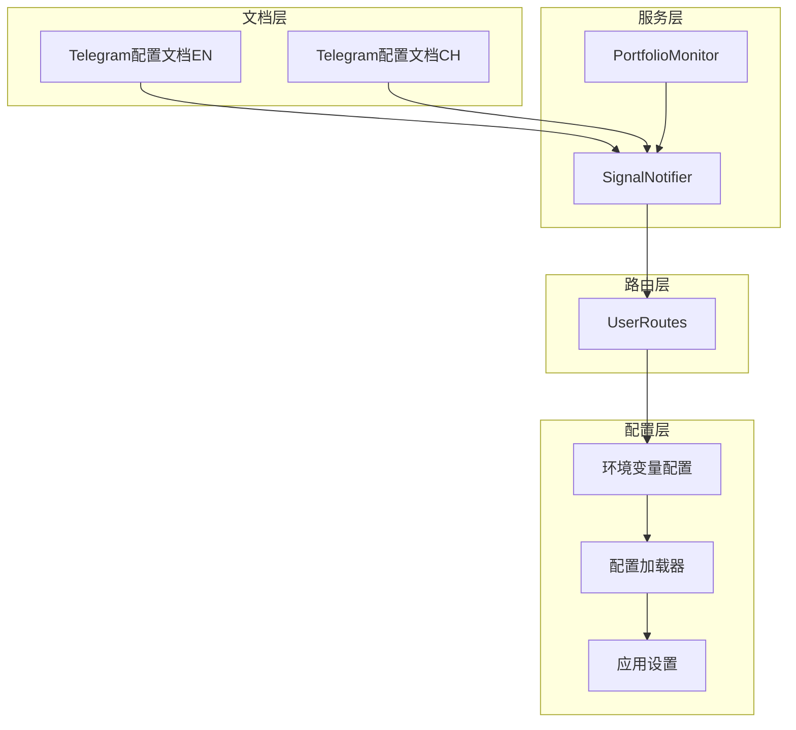
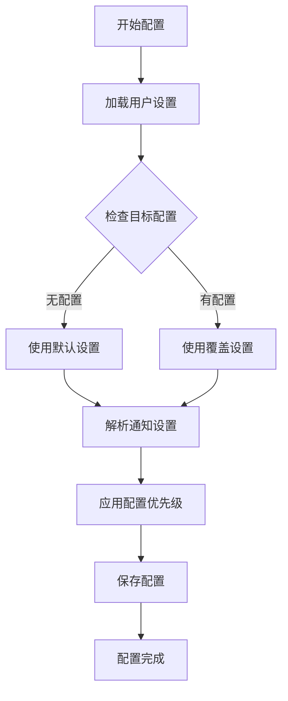
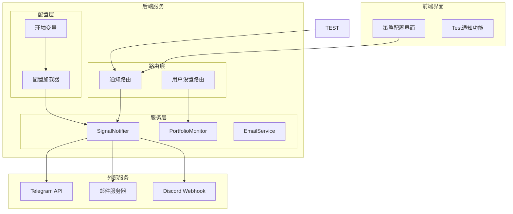
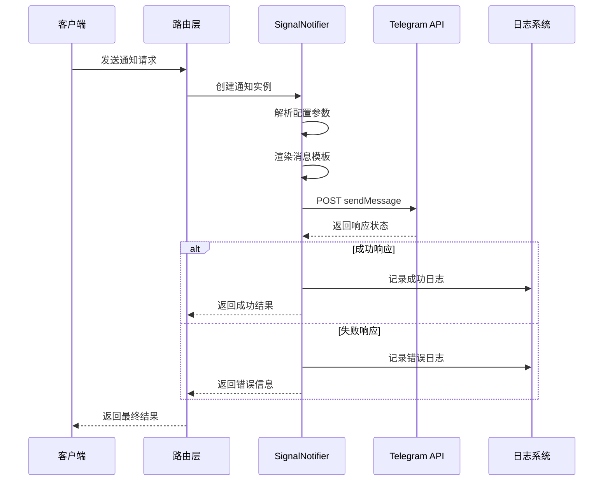
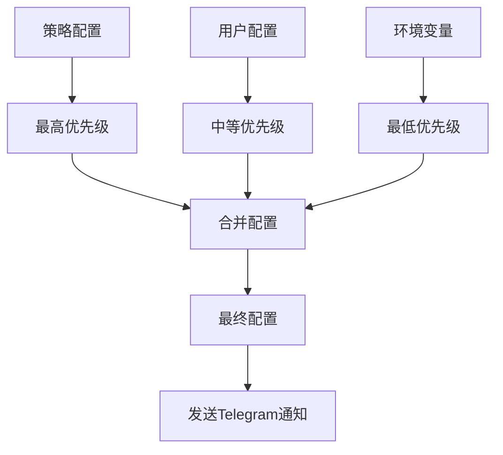
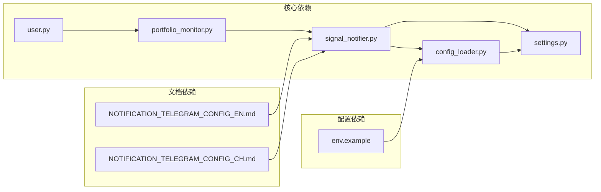

# Telegram通知集成

<cite>
**本文档引用的文件**
- [NOTIFICATION_TELEGRAM_CONFIG_EN.md](file://docs/NOTIFICATION_TELEGRAM_CONFIG_EN.md)
- [NOTIFICATION_TELEGRAM_CONFIG_CH.md](file://docs/NOTIFICATION_TELEGRAM_CONFIG_CH.md)
- [signal_notifier.py](file://backend_api_python/app/services/signal_notifier.py)
- [portfolio_monitor.py](file://backend_api_python/app/services/portfolio_monitor.py)
- [user.py](file://backend_api_python/app/routes/user.py)
- [env.example](file://backend_api_python/env.example)
- [settings.py](file://backend_api_python/app/config/settings.py)
- [config_loader.py](file://backend_api_python/app/utils/config_loader.py)
</cite>

## 目录
1. [简介](#简介)
2. [项目结构](#项目结构)
3. [核心组件](#核心组件)
4. [架构概览](#架构概览)
5. [详细组件分析](#详细组件分析)
6. [依赖关系分析](#依赖关系分析)
7. [性能考虑](#性能考虑)
8. [故障排除指南](#故障排除指南)
9. [结论](#结论)
10. [附录](#附录)

## 简介

QuantDinger 支持通过 Telegram Bot 实时推送策略信号通知，为用户提供及时的交易提醒和市场信号。该系统采用模块化设计，支持多种通知渠道，其中 Telegram 通知是核心功能之一。

Telegram 通知集成提供了完整的配置流程，包括 Bot 创建、Token 获取、用户 ID 设置等步骤。系统支持个人用户和群组通知，具有灵活的消息格式和丰富的配置选项。

## 项目结构

Telegram 通知功能在项目中的组织结构如下：



**图表来源**
- [signal_notifier.py:130-170](file://backend_api_python/app/services/signal_notifier.py#L130-L170)
- [portfolio_monitor.py:84-111](file://backend_api_python/app/services/portfolio_monitor.py#L84-L111)
- [user.py:694-756](file://backend_api_python/app/routes/user.py#L694-L756)

**章节来源**
- [signal_notifier.py:1-800](file://backend_api_python/app/services/signal_notifier.py#L1-L800)
- [portfolio_monitor.py:84-111](file://backend_api_python/app/services/portfolio_monitor.py#L84-L111)
- [user.py:694-756](file://backend_api_python/app/routes/user.py#L694-L756)

## 核心组件

### SignalNotifier 服务

SignalNotifier 是 Telegram 通知的核心服务，负责处理各种通知渠道的发送逻辑。该服务实现了统一的通知接口，支持多种通知方式。

关键特性：
- 支持多种通知渠道（Telegram、Email、Discord、Webhook、Phone）
- 智能消息模板渲染
- 错误处理和重试机制
- 配置优先级管理

### 通知配置管理

系统提供了灵活的通知配置管理机制，支持用户级别的个性化设置：



**图表来源**
- [portfolio_monitor.py:84-111](file://backend_api_python/app/services/portfolio_monitor.py#L84-L111)
- [user.py:694-756](file://backend_api_python/app/routes/user.py#L694-L756)

**章节来源**
- [signal_notifier.py:130-284](file://backend_api_python/app/services/signal_notifier.py#L130-L284)
- [portfolio_monitor.py:84-111](file://backend_api_python/app/services/portfolio_monitor.py#L84-L111)
- [user.py:694-756](file://backend_api_python/app/routes/user.py#L694-L756)

## 架构概览

Telegram 通知系统的整体架构采用分层设计，确保了功能的模块化和可维护性：



**图表来源**
- [signal_notifier.py:171-284](file://backend_api_python/app/services/signal_notifier.py#L171-L284)
- [user.py:694-756](file://backend_api_python/app/routes/user.py#L694-L756)
- [portfolio_monitor.py:84-111](file://backend_api_python/app/services/portfolio_monitor.py#L84-L111)

## 详细组件分析

### Telegram 通知发送机制

Telegram 通知的发送过程遵循严格的流程控制，确保消息的准确传递：



**图表来源**
- [signal_notifier.py:240-259](file://backend_api_python/app/services/signal_notifier.py#L240-L259)
- [signal_notifier.py:706-739](file://backend_api_python/app/services/signal_notifier.py#L706-L739)

### 消息模板系统

系统提供了丰富的消息模板，支持不同的通知场景：

#### 交易提醒模板
- 策略名称和ID
- 交易品种符号
- 交易类型（开仓/加仓/平仓/减仓）
- 方向（多头/空头）
- 价格和金额
- 时间戳信息

#### 策略信号模板
- 信号类型标识
- 价格水平
- 投注金额
- 挂单ID（如有）
- 运行模式

#### 系统通知模板
- 通知标题
- 详细描述
- 时间信息
- 系统状态

**章节来源**
- [signal_notifier.py:339-413](file://backend_api_python/app/services/signal_notifier.py#L339-L413)

### 配置优先级机制

系统实现了多层次的配置优先级，确保灵活性和一致性：



**图表来源**
- [signal_notifier.py:242-251](file://backend_api_python/app/services/signal_notifier.py#L242-L251)
- [portfolio_monitor.py:104-107](file://backend_api_python/app/services/portfolio_monitor.py#L104-L107)

**章节来源**
- [signal_notifier.py:240-259](file://backend_api_python/app/services/signal_notifier.py#L240-L259)
- [portfolio_monitor.py:84-111](file://backend_api_python/app/services/portfolio_monitor.py#L84-L111)

## 依赖关系分析

### 外部依赖

Telegram 通知功能依赖于以下外部服务：

| 依赖项 | 用途 | 版本要求 |
|--------|------|----------|
| Telegram Bot API | 发送消息 | v1.0+ |
| Python requests | HTTP通信 | 2.20.0+ |
| Python html | HTML转义 | 标准库 |
| Python json | 数据序列化 | 标准库 |

### 内部依赖

系统内部各组件之间的依赖关系：



**图表来源**
- [signal_notifier.py:18-38](file://backend_api_python/app/services/signal_notifier.py#L18-L38)
- [portfolio_monitor.py:84-111](file://backend_api_python/app/services/portfolio_monitor.py#L84-L111)
- [user.py:694-756](file://backend_api_python/app/routes/user.py#L694-L756)

**章节来源**
- [signal_notifier.py:18-38](file://backend_api_python/app/services/signal_notifier.py#L18-L38)
- [config_loader.py:1-251](file://backend_api_python/app/utils/config_loader.py#L1-L251)
- [settings.py:1-99](file://backend_api_python/app/config/settings.py#L1-L99)

## 性能考虑

### 消息大小限制

Telegram API 对消息大小有严格限制：
- 单条消息最大字符数：3900字符
- HTML解析模式：支持富文本格式
- 预览禁用：避免链接预览影响性能

### 超时配置

系统提供了灵活的超时配置：
- 默认超时时间：6秒
- 可配置超时：通过环境变量调整
- 异常处理：超时自动重试机制

### 并发处理

通知发送采用异步处理模式：
- 独立线程池管理
- 连接复用优化
- 错误隔离机制

## 故障排除指南

### 常见问题及解决方案

#### 无法接收Telegram通知

**问题症状**：用户报告收不到Telegram通知

**排查步骤**：
1. 确认已向Bot发送过消息（Bot需要被激活）
2. 检查TELEGRAM_BOT_TOKEN环境变量配置
3. 验证User ID格式正确性
4. 查看后端日志中的错误信息

**解决方案**：
- 重新获取Bot Token并正确配置
- 使用正确的User ID格式（支持多个ID逗号分隔）
- 检查网络连接和防火墙设置

#### 群组通知问题

**问题症状**：无法向群组发送通知

**解决方法**：
- 将Bot添加到群组后获取群组ID
- 群组ID格式为负数
- 使用相同的方法获取群组ID

#### Token格式问题

**问题症状**：Token格式不正确导致认证失败

**解决方法**：
- Token格式必须为"数字:字母数字字符串"
- 示例：123456789:ABCdefGHIjklMNOpqrsTUVwxyz
- 如怀疑泄露，立即在BotFather中撤销并重新生成

### 错误代码对照表

| 错误代码 | 描述 | 解决方案 |
|----------|------|----------|
| missing_telegram_bot_token | 缺少Telegram Bot Token | 在个人中心配置Token |
| missing_telegram_chat_id | 缺少聊天ID | 配置正确的User ID或群组ID |
| http_401 | 认证失败 | 检查Token有效性 |
| http_403 | 权限不足 | 确认Bot权限设置 |
| http_404 | 聊天ID不存在 | 验证聊天ID格式 |
| http_429 | 请求过于频繁 | 降低发送频率 |
| http_5xx | 服务器错误 | 稍后重试或检查服务状态 |

**章节来源**
- [signal_notifier.py:714-739](file://backend_api_python/app/services/signal_notifier.py#L714-L739)
- [NOTIFICATION_TELEGRAM_CONFIG_EN.md:103-127](file://docs/NOTIFICATION_TELEGRAM_CONFIG_EN.md#L103-L127)
- [NOTIFICATION_TELEGRAM_CONFIG_CH.md:103-127](file://docs/NOTIFICATION_TELEGRAM_CONFIG_CH.md#L103-L127)

## 结论

QuantDinger的Telegram通知集成为用户提供了强大而灵活的实时通知能力。通过模块化的架构设计和完善的配置管理机制，系统能够满足不同用户的需求。

主要优势包括：
- 简洁直观的配置流程
- 灵活的多渠道通知支持
- 完善的错误处理和日志记录
- 可扩展的模板系统
- 严格的安全和隐私保护

建议用户根据实际需求合理配置通知频率，确保及时获取重要信息的同时避免过度打扰。

## 附录

### 配置示例

#### 环境变量配置
```bash
# Telegram Bot Token（必填）
TELEGRAM_BOT_TOKEN=123456789:ABCdefGHIjklMNOpqrsTUVwxyz
```

#### 用户设置配置
```json
{
  "default_channels": ["telegram", "email"],
  "telegram_bot_token": "123456789:ABCdefGHIjklMNOpqrsTUVwxyz",
  "telegram_chat_id": "123456789",
  "email": "user@example.com"
}
```

### 最佳实践建议

1. **安全性**：定期轮换Bot Token，避免泄露
2. **频率控制**：合理设置通知频率，避免刷屏
3. **测试验证**：使用测试功能验证配置正确性
4. **备份策略**：保留多个通知渠道以防单一故障
5. **监控告警**：建立通知发送状态的监控机制