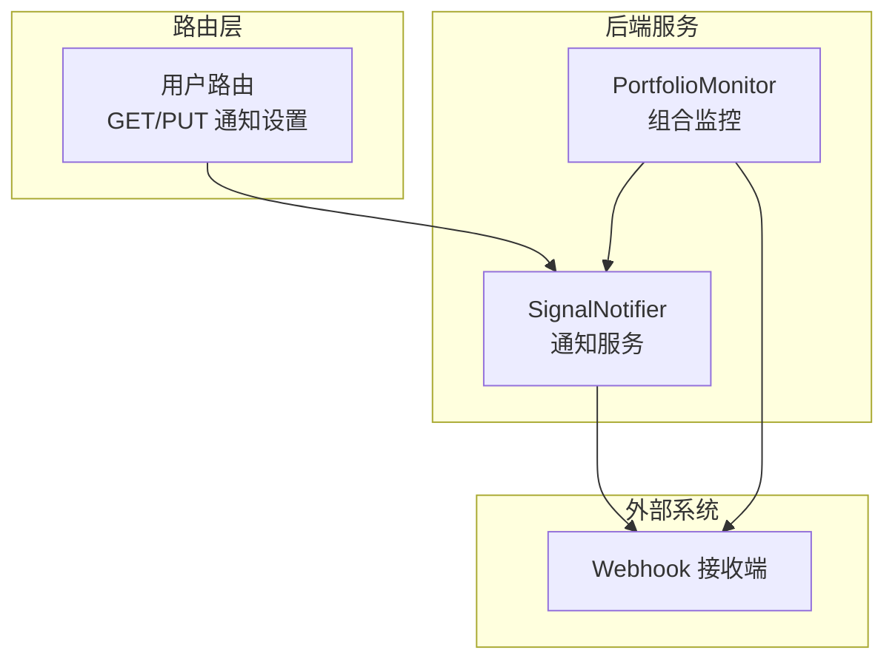
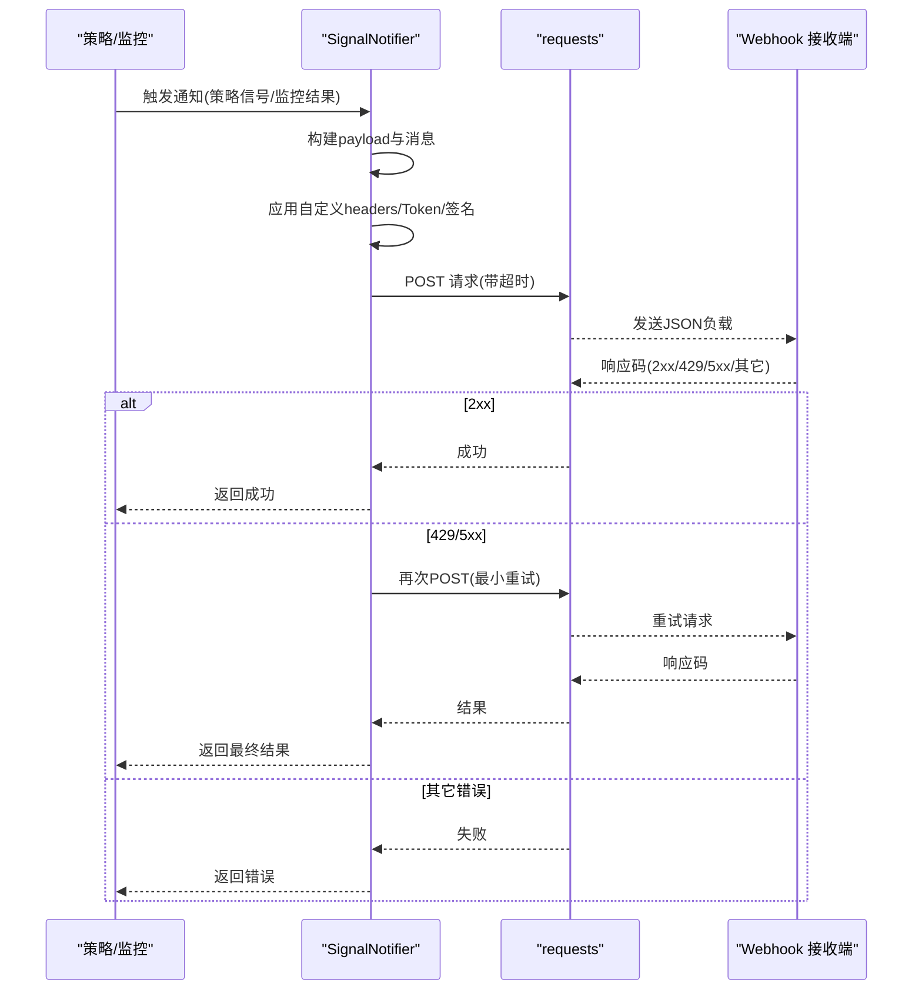
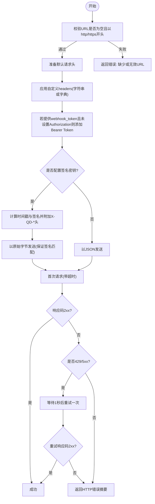
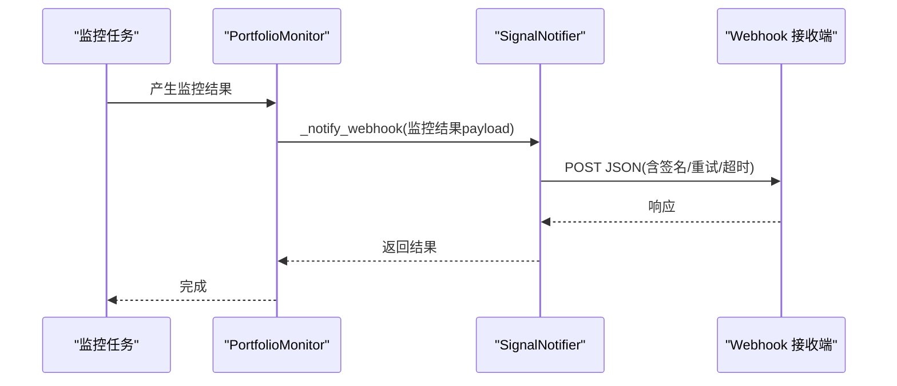
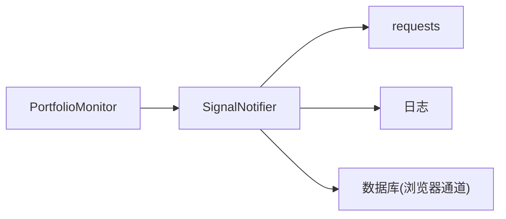

# Webhook集成

<cite>
**本文引用的文件**
- [signal_notifier.py](file://backend_api_python/app/services/signal_notifier.py)
- [portfolio_monitor.py](file://backend_api_python/app/services/portfolio_monitor.py)
- [user.py](file://backend_api_python/app/routes/user.py)
- [README.md](file://README.md)
</cite>

## 目录
1. [简介](#简介)
2. [项目结构](#项目结构)
3. [核心组件](#核心组件)
4. [架构总览](#架构总览)
5. [详细组件分析](#详细组件分析)
6. [依赖分析](#依赖分析)
7. [性能考虑](#性能考虑)
8. [故障排查指南](#故障排查指南)
9. [结论](#结论)
10. [附录](#附录)

## 简介
本文件面向需要在系统中集成Webhook的用户与开发者，系统性说明Webhook的配置方法、消息格式与数据结构、安全机制、重试与超时策略、以及监控与调试方法。系统通过统一的通知服务模块向外部Webhook推送交易信号与系统状态事件，并提供签名验证、自定义请求头、Bearer Token认证等能力。

## 项目结构
Webhook相关能力主要由后端通知服务模块实现，并在用户路由中暴露配置接口，在组合监控模块中用于推送组合监控结果。

图表来源
- [signal_notifier.py:171-283](file://backend_api_python/app/services/signal_notifier.py#L171-L283)
- [portfolio_monitor.py:1004-1235](file://backend_api_python/app/services/portfolio_monitor.py#L1004-L1235)
- [user.py:694-1023](file://backend_api_python/app/routes/user.py#L694-L1023)

章节来源
- [signal_notifier.py:171-283](file://backend_api_python/app/services/signal_notifier.py#L171-L283)
- [portfolio_monitor.py:1004-1235](file://backend_api_python/app/services/portfolio_monitor.py#L1004-L1235)
- [user.py:694-1023](file://backend_api_python/app/routes/user.py#L694-L1023)

## 核心组件
- 通知服务 SignalNotifier：负责构建信号事件负载、渲染消息、按通道投递（含Webhook），并实现Webhook的签名、重试与超时控制。
- 组合监控 PortfolioMonitor：在监控任务完成后，根据用户配置向Webhook推送监控结果。
- 用户路由 user.py：提供获取与更新通知设置的接口，其中包含Webhook URL、Token、签名密钥等配置项。

章节来源
- [signal_notifier.py:130-170](file://backend_api_python/app/services/signal_notifier.py#L130-L170)
- [portfolio_monitor.py:1004-1235](file://backend_api_python/app/services/portfolio_monitor.py#L1004-L1235)
- [user.py:694-1023](file://backend_api_python/app/routes/user.py#L694-L1023)

## 架构总览
Webhook调用链路从策略信号或监控任务触发，经通知服务统一构建payload并投递至外部Webhook地址；若启用签名，则附加时间戳与签名头；若出现429/5xx错误，将进行一次最小重试；同时受全局超时限制。

图表来源
- [signal_notifier.py:540-628](file://backend_api_python/app/services/signal_notifier.py#L540-L628)

## 详细组件分析

### 通知服务 SignalNotifier
- 通道选择与目标解析：从用户配置中读取 channels 与 targets，支持 browser、webhook、discord、telegram、email、phone 等。
- payload 构建：统一事件类型与版本号，包含策略、标的、信号、订单、追踪与额外字段。
- Webhook 投递：
  - URL校验：必须为 http 或 https。
  - 默认请求头：Content-Type 为 application/json，User-Agent 指定。
  - 自定义请求头：支持 per-strategy 的 headers 覆盖（字符串或字典）。
  - 认证：当存在 webhook_token 且未设置 Authorization 时，自动添加 Bearer Token。
  - 签名：若配置签名密钥（优先 per-strategy，否则环境变量），则附加 X-QD-Timestamp 与 X-QD-Signature，并以原始字节发送请求体以确保签名一致。
  - 超时：受全局超时控制（默认约6秒）。
  - 重试：对 429、500、502、503、504 进行一次最小重试。
- 测试通知：提供 profile_test 类型的测试负载，便于快速验证Webhook连通性与签名配置。

图表来源
- [signal_notifier.py:540-628](file://backend_api_python/app/services/signal_notifier.py#L540-L628)

章节来源
- [signal_notifier.py:171-283](file://backend_api_python/app/services/signal_notifier.py#L171-L283)
- [signal_notifier.py:285-413](file://backend_api_python/app/services/signal_notifier.py#L285-L413)
- [signal_notifier.py:540-628](file://backend_api_python/app/services/signal_notifier.py#L540-L628)
- [signal_notifier.py:804-912](file://backend_api_python/app/services/signal_notifier.py#L804-L912)

### 组合监控 PortfolioMonitor
- 在监控任务完成后，根据用户配置的目标向Webhook推送监控结果，payload包含监控名称、结果与报告内容。
- 通过通知服务统一走Webhook通道，复用签名、重试与超时逻辑。

图表来源
- [portfolio_monitor.py:1004-1235](file://backend_api_python/app/services/portfolio_monitor.py#L1004-L1235)
- [signal_notifier.py:540-628](file://backend_api_python/app/services/signal_notifier.py#L540-L628)

章节来源
- [portfolio_monitor.py:1004-1235](file://backend_api_python/app/services/portfolio_monitor.py#L1004-L1235)

### 用户路由 user.py
- 提供获取与更新通知设置的接口，支持设置默认通道、Webhook URL、Webhook Token、签名密钥、Discord/Webhook等目标。
- 更新接口会校验通道列表并持久化到用户配置中，后续通知将据此投递。

章节来源
- [user.py:694-1023](file://backend_api_python/app/routes/user.py#L694-L1023)

## 依赖分析
- SignalNotifier 依赖：
  - HTTP客户端：requests，用于POST请求与超时控制。
  - 日志：统一记录错误与异常。
  - 数据库：浏览器通道写入本地表，用于前端展示。
  - 环境变量：超时配置、SMTP/Twilio等（Webhook通道不依赖这些）。
- 组合监控依赖 SignalNotifier 的Webhook通道，形成“监控结果 → 通知服务 → Webhook”的链路。

图表来源
- [signal_notifier.py:33-38](file://backend_api_python/app/services/signal_notifier.py#L33-L38)
- [signal_notifier.py:148-170](file://backend_api_python/app/services/signal_notifier.py#L148-L170)
- [portfolio_monitor.py:1004-1235](file://backend_api_python/app/services/portfolio_monitor.py#L1004-L1235)

章节来源
- [signal_notifier.py:33-38](file://backend_api_python/app/services/signal_notifier.py#L33-L38)
- [signal_notifier.py:148-170](file://backend_api_python/app/services/signal_notifier.py#L148-L170)
- [portfolio_monitor.py:1004-1235](file://backend_api_python/app/services/portfolio_monitor.py#L1004-L1235)

## 性能考虑
- 超时控制：默认超时约6秒，避免长时间阻塞；可根据网络状况调整环境变量值。
- 最小重试：仅在429/5xx场景下进行一次重试，降低延迟与资源占用。
- 请求体大小：payload为JSON，建议接收端按需裁剪，避免过大响应导致超时。
- 并发与限流：Webhook端应具备限流与幂等处理能力，防止重复消息与过载。

## 故障排查指南
- 常见错误与定位
  - 缺少或无效URL：检查URL是否为空且以 http/https 开头。
  - 认证失败：确认已设置 webhook_token 且未被自定义headers覆盖 Authorization。
  - 签名失败：确认签名密钥配置正确，时间戳与签名头是否正确附加。
  - HTTP错误：查看返回的HTTP状态码与响应片段，结合日志定位。
  - 超时：适当增大超时配置或优化接收端处理速度。
- 日志与测试
  - 使用测试通知接口发送 profile_test 类型消息，快速验证Webhook连通性与签名配置。
  - 关注通知服务的日志输出，定位具体失败原因。

章节来源
- [signal_notifier.py:540-628](file://backend_api_python/app/services/signal_notifier.py#L540-L628)
- [signal_notifier.py:804-912](file://backend_api_python/app/services/signal_notifier.py#L804-L912)

## 结论
系统提供了完整的Webhook集成能力：统一的payload格式、灵活的请求头与认证配置、可选的签名验证、最小重试与超时控制，以及配套的测试与日志能力。通过用户路由与通知服务，用户可以便捷地完成Webhook配置并接收策略信号与系统状态更新。

## 附录

### Webhook配置清单
- 必填项
  - webhook_url：Webhook接收地址（必须为 http/https）
- 可选项
  - webhook_token：Bearer Token（当未设置 Authorization 时自动添加）
  - webhook_headers：自定义请求头（字符串或字典）
  - webhook_signing_secret：签名密钥（用于生成 X-QD-Timestamp 与 X-QD-Signature）

章节来源
- [signal_notifier.py:540-628](file://backend_api_python/app/services/signal_notifier.py#L540-L628)
- [user.py:694-1023](file://backend_api_python/app/routes/user.py#L694-L1023)

### Webhook消息格式与数据结构
- 通用字段
  - event：事件类型（如策略信号、系统测试）
  - version：消息版本
  - timestamp / timestamp_iso / timestamp_display / time_label：时间信息
  - strategy：策略标识（id/name）
  - instrument：标的符号
  - signal：信号类型、动作、方向
  - order：参考价格、金额
  - trace：追踪信息（如挂单ID、模式）
  - extra：扩展字段
- 示例路径
  - 策略信号payload构建：[signal_notifier.py:285-337](file://backend_api_python/app/services/signal_notifier.py#L285-L337)
  - 测试payload构建：[signal_notifier.py:830-841](file://backend_api_python/app/services/signal_notifier.py#L830-L841)

章节来源
- [signal_notifier.py:285-337](file://backend_api_python/app/services/signal_notifier.py#L285-L337)
- [signal_notifier.py:830-841](file://backend_api_python/app/services/signal_notifier.py#L830-L841)

### 安全机制
- 签名验证
  - 生成方式：基于时间戳与请求体计算 HMAC-SHA256 签名，附加 X-QD-Timestamp 与 X-QD-Signature。
  - 生效条件：配置签名密钥（优先 per-strategy，否则使用环境变量）。
- HTTPS与IP白名单
  - HTTPS：URL必须为 https，建议在接收端启用TLS。
  - IP白名单：建议在接收端（如反向代理、防火墙、云厂商WAF）配置IP白名单，仅允许系统出口IP访问。
- 认证
  - Bearer Token：当提供 webhook_token 且未设置 Authorization 时自动添加。

章节来源
- [signal_notifier.py:592-606](file://backend_api_python/app/services/signal_notifier.py#L592-L606)
- [signal_notifier.py:587-591](file://backend_api_python/app/services/signal_notifier.py#L587-L591)

### 重试策略、超时与错误恢复
- 重试：对 429、500、502、503、504 进行一次最小重试。
- 超时：受全局超时控制（默认约6秒），可在环境变量中调整。
- 错误恢复：记录异常与HTTP错误摘要，便于定位问题。

章节来源
- [signal_notifier.py:611-628](file://backend_api_python/app/services/signal_notifier.py#L611-L628)

### 监控与调试
- 测试通知：通过测试接口发送 profile_test 类型消息，验证Webhook连通性与签名配置。
- 日志：关注通知服务日志，定位URL、认证、签名、HTTP错误等问题。

章节来源
- [signal_notifier.py:804-912](file://backend_api_python/app/services/signal_notifier.py#L804-L912)