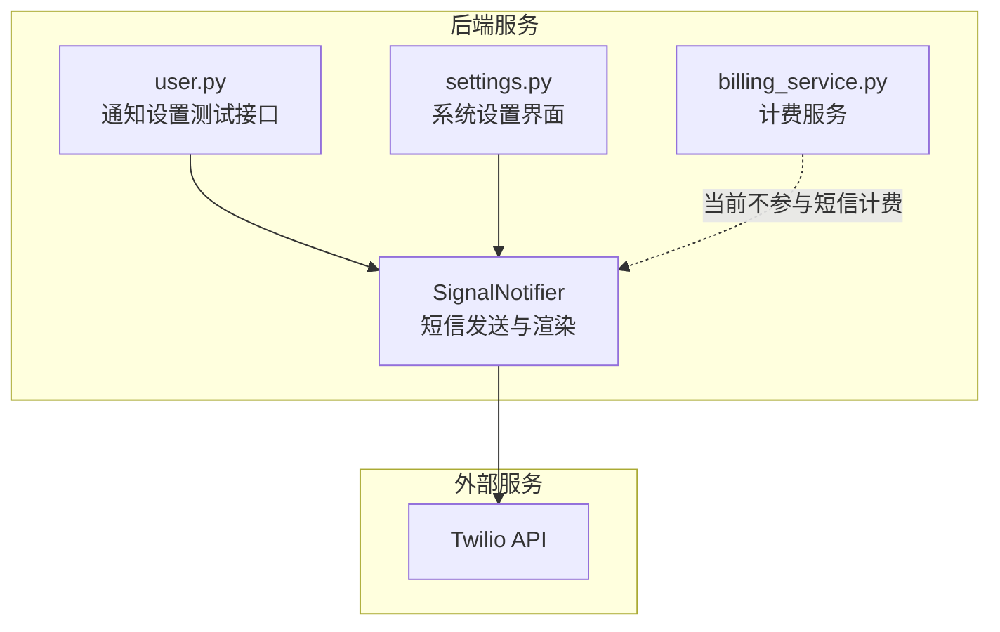
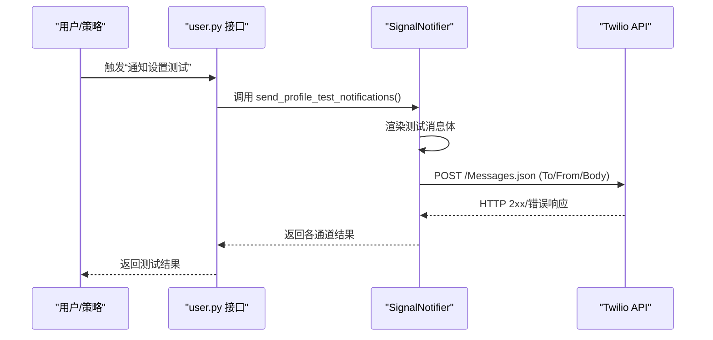
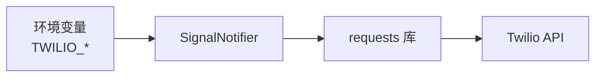

# 短信通知服务

<cite>
**本文引用的文件**
- [signal_notifier.py](file://backend_api_python/app/services/signal_notifier.py)
- [settings.py](file://backend_api_python/app/routes/settings.py)
- [user.py](file://backend_api_python/app/routes/user.py)
- [NOTIFICATION_SMS_CONFIG_EN.md](file://docs/NOTIFICATION_SMS_CONFIG_EN.md)
- [NOTIFICATION_SMS_CONFIG_CH.md](file://docs/NOTIFICATION_SMS_CONFIG_CH.md)
- [billing_service.py](file://backend_api_python/app/services/billing_service.py)
</cite>

## 目录
1. [简介](#简介)
2. [项目结构](#项目结构)
3. [核心组件](#核心组件)
4. [架构总览](#架构总览)
5. [详细组件分析](#详细组件分析)
6. [依赖关系分析](#依赖关系分析)
7. [性能考虑](#性能考虑)
8. [故障排查指南](#故障排查指南)
9. [结论](#结论)
10. [附录](#附录)

## 简介
本文件面向使用者与运维人员，系统性说明 QuantDinger 平台的短信通知服务，重点围绕 Twilio 短信网关的集成与使用，涵盖配置步骤、号码格式与限制、错误处理、成本控制与监控、最佳实践与合规要求。文档同时指出当前系统对 Twilio 的单一供应商依赖，并提供通过 Webhook 自行对接其他短信服务商的扩展路径。

## 项目结构
短信通知能力由后端服务模块提供，主要涉及以下文件：
- 通知服务实现：SignalNotifier（短信发送、渲染消息体、测试通知）
- 系统设置界面：settings.py（暴露 SMS/Twilio 配置项）
- 用户路由：user.py（触发“通知设置测试”）
- 文档：NOTIFICATION_SMS_CONFIG_EN.md / NOTIFICATION_SMS_CONFIG_CH.md（配置指南）
- 计费服务：billing_service.py（通用计费框架，当前短信不参与积分扣减）



图表来源
- [signal_notifier.py:130-283](file://backend_api_python/app/services/signal_notifier.py#L130-L283)
- [settings.py:544-574](file://backend_api_python/app/routes/settings.py#L544-L574)
- [user.py:985-1023](file://backend_api_python/app/routes/user.py#L985-L1023)
- [billing_service.py:47-96](file://backend_api_python/app/services/billing_service.py#L47-L96)

章节来源
- [signal_notifier.py:130-283](file://backend_api_python/app/services/signal_notifier.py#L130-L283)
- [settings.py:544-574](file://backend_api_python/app/routes/settings.py#L544-L574)
- [user.py:985-1023](file://backend_api_python/app/routes/user.py#L985-L1023)
- [NOTIFICATION_SMS_CONFIG_EN.md:1-212](file://docs/NOTIFICATION_SMS_CONFIG_EN.md#L1-L212)
- [NOTIFICATION_SMS_CONFIG_CH.md:1-212](file://docs/NOTIFICATION_SMS_CONFIG_CH.md#L1-L212)
- [billing_service.py:47-96](file://backend_api_python/app/services/billing_service.py#L47-L96)

## 核心组件
- SignalNotifier：负责构建通知负载、渲染消息体、按通道发送通知（含短信）。短信通道基于 Twilio REST API 实现。
- settings.py：在系统设置界面暴露 Twilio 相关配置项（Account SID、Auth Token、Sender Number）。
- user.py：提供“通知设置测试”接口，用于验证各通知渠道（含短信）是否配置正确。
- 文档：提供 Twilio 集成的完整配置步骤、号码格式要求、费用说明与故障排查。
- billing_service.py：通用计费框架，当前短信不参与积分扣减。

章节来源
- [signal_notifier.py:130-283](file://backend_api_python/app/services/signal_notifier.py#L130-L283)
- [settings.py:544-574](file://backend_api_python/app/routes/settings.py#L544-L574)
- [user.py:985-1023](file://backend_api_python/app/routes/user.py#L985-L1023)
- [NOTIFICATION_SMS_CONFIG_EN.md:87-130](file://docs/NOTIFICATION_SMS_CONFIG_EN.md#L87-L130)
- [NOTIFICATION_SMS_CONFIG_CH.md:88-130](file://docs/NOTIFICATION_SMS_CONFIG_CH.md#L88-L130)
- [billing_service.py:47-96](file://backend_api_python/app/services/billing_service.py#L47-L96)

## 架构总览
短信通知的整体流程如下：
- 用户在系统设置中配置 Twilio 凭据与发送号码
- 用户在策略或个人中心配置通知目标（含短信）
- 触发通知时，SignalNotifier 渲染消息体并调用 Twilio API 发送短信
- 若失败，返回错误码与简要原因；成功则返回空字符串



图表来源
- [user.py:985-1023](file://backend_api_python/app/routes/user.py#L985-L1023)
- [signal_notifier.py:804-909](file://backend_api_python/app/services/signal_notifier.py#L804-L909)
- [signal_notifier.py:787-802](file://backend_api_python/app/services/signal_notifier.py#L787-L802)

## 详细组件分析

### SignalNotifier（短信发送与渲染）
- 初始化加载公共 SMTP/Twilio 配置（从环境变量读取）
- 通知入口：notify_signal() 根据 channels/targets 选择通道并调用对应发送函数
- 短信通道：_notify_phone() 通过 Twilio REST API 发送，限制消息长度（最多 1500 字符）
- 错误处理：捕获异常并返回错误字符串；HTTP 非 2xx 返回具体状态码与截断文本
- 测试通知：send_profile_test_notifications() 用于验证各通道（含短信）配置

```mermaid
classDiagram
class SignalNotifier {
+notify_signal(...)
+send_profile_test_notifications(...)
-_notify_phone(to_phone, body)
-_render_messages(payload)
-_build_payload(...)
}
class Twilio {
+"https : //api.twilio.com/2010-04-01/Accounts/{sid}/Messages.json"
}
SignalNotifier --> Twilio : "POST 短信"
```

图表来源
- [signal_notifier.py:130-283](file://backend_api_python/app/services/signal_notifier.py#L130-L283)
- [signal_notifier.py:787-802](file://backend_api_python/app/services/signal_notifier.py#L787-L802)

章节来源
- [signal_notifier.py:130-283](file://backend_api_python/app/services/signal_notifier.py#L130-L283)
- [signal_notifier.py:787-802](file://backend_api_python/app/services/signal_notifier.py#L787-L802)
- [signal_notifier.py:804-909](file://backend_api_python/app/services/signal_notifier.py#L804-L909)

### 系统设置界面（SMS/Twilio 配置）
- settings.py 中定义了 SMS 分组，包含三项关键配置：
  - TWILIO_ACCOUNT_SID
  - TWILIO_AUTH_TOKEN
  - TWILIO_FROM_NUMBER
- 这些配置项在系统设置界面中展示，便于管理员统一维护

章节来源
- [settings.py:544-574](file://backend_api_python/app/routes/settings.py#L544-L574)

### 通知设置测试（含短信）
- user.py 提供测试接口，调用 SignalNotifier 的 send_profile_test_notifications()
- 该方法会向浏览器、Telegram、Email、Phone、Discord、Webhook 等通道发送测试消息
- 若任一通道失败，接口会返回失败详情，便于快速定位问题

章节来源
- [user.py:985-1023](file://backend_api_python/app/routes/user.py#L985-L1023)
- [signal_notifier.py:804-909](file://backend_api_python/app/services/signal_notifier.py#L804-L909)

### 短信模板与消息体
- SignalNotifier 会根据策略信号构建统一 payload，并渲染多种格式的消息体（纯文本、HTML、Telegram HTML）
- 短信内容由纯文本消息体拼接标题与正文组成，长度受 Twilio 限制（最多 1500 字符）
- 文档提供了号码格式要求与多国家定价参考，便于用户理解发送限制与成本

章节来源
- [signal_notifier.py:285-413](file://backend_api_python/app/services/signal_notifier.py#L285-L413)
- [NOTIFICATION_SMS_CONFIG_EN.md:120-128](file://docs/NOTIFICATION_SMS_CONFIG_EN.md#L120-L128)
- [NOTIFICATION_SMS_CONFIG_CH.md:121-128](file://docs/NOTIFICATION_SMS_CONFIG_CH.md#L121-L128)

### 错误处理与返回码
- 短信发送失败时，返回包含 HTTP 状态码与响应文本前缀的错误字符串
- 异常捕获后记录日志，便于排障
- 测试接口会汇总各通道的错误详情，便于一次性验证所有通知渠道

章节来源
- [signal_notifier.py:787-802](file://backend_api_python/app/services/signal_notifier.py#L787-L802)
- [user.py:1007-1020](file://backend_api_python/app/routes/user.py#L1007-L1020)

## 依赖关系分析
- SignalNotifier 依赖 requests 库进行 HTTP 请求，无需额外第三方短信 SDK
- Twilio 凭据通过环境变量注入，避免硬编码
- 短信通道与其他通道（Email、Telegram、Discord、Webhook）共享同一通知入口与错误处理逻辑



图表来源
- [signal_notifier.py:148-169](file://backend_api_python/app/services/signal_notifier.py#L148-L169)
- [signal_notifier.py:787-802](file://backend_api_python/app/services/signal_notifier.py#L787-L802)

章节来源
- [signal_notifier.py:148-169](file://backend_api_python/app/services/signal_notifier.py#L148-L169)
- [signal_notifier.py:787-802](file://backend_api_python/app/services/signal_notifier.py#L787-L802)

## 性能考虑
- 短信发送为同步 HTTP 请求，默认超时时间可由环境变量控制（默认约 6 秒）
- 单次短信最大长度限制为 1500 字符，超出部分会被截断
- 测试接口会批量验证多个通道，有助于快速发现配置问题

章节来源
- [signal_notifier.py:148-152](file://backend_api_python/app/services/signal_notifier.py#L148-L152)
- [signal_notifier.py:787-794](file://backend_api_python/app/services/signal_notifier.py#L787-L794)
- [signal_notifier.py:804-909](file://backend_api_python/app/services/signal_notifier.py#L804-L909)

## 故障排查指南
- 无法发送短信
  - 检查 Twilio 凭据是否正确配置（Account SID、Auth Token、Sender Number）
  - 确认号码格式包含国家代码且符合要求
  - 查看 Twilio 控制台的 Logs/Messaging 获取详细状态与错误
- 试用账户限制
  - 试用账户仅能向已验证的号码发送短信
  - 升级为付费账户以解除限制
- 多号码与多通道
  - 支持在策略中配置多个短信号码（逗号分隔）
  - 可同时启用多种通知渠道进行测试与验证

章节来源
- [NOTIFICATION_SMS_CONFIG_EN.md:158-184](file://docs/NOTIFICATION_SMS_CONFIG_EN.md#L158-L184)
- [NOTIFICATION_SMS_CONFIG_CH.md:158-184](file://docs/NOTIFICATION_SMS_CONFIG_CH.md#L158-L184)
- [signal_notifier.py:787-802](file://backend_api_python/app/services/signal_notifier.py#L787-L802)

## 结论
QuantDinger 当前的短信通知服务以 Twilio 为核心，通过 SignalNotifier 提供统一的短信发送能力，配合系统设置界面与测试接口，能够快速完成配置与验证。对于需要接入阿里云短信、腾讯云短信等其他服务商的场景，可在现有基础上通过 Webhook 通道进行扩展。未来若需统一计费模型，可结合 billing_service 的通用框架进行适配。

## 附录

### 配置步骤（Twilio）
- 注册并获取 Account SID、Auth Token、Sender Number
- 在系统设置界面填写 Twilio 相关参数
- 在策略配置中启用 Phone 通道并填写接收号码（需包含国家代码）
- 通过“通知设置测试”接口验证短信是否正常发送

章节来源
- [NOTIFICATION_SMS_CONFIG_EN.md:43-130](file://docs/NOTIFICATION_SMS_CONFIG_EN.md#L43-L130)
- [NOTIFICATION_SMS_CONFIG_CH.md:43-130](file://docs/NOTIFICATION_SMS_CONFIG_CH.md#L43-L130)
- [settings.py:544-574](file://backend_api_python/app/routes/settings.py#L544-L574)
- [user.py:985-1023](file://backend_api_python/app/routes/user.py#L985-L1023)

### 短信发送 API 调用示例（路径参考）
- 通知入口：notify_signal()
- 短信发送：_notify_phone()
- 测试接口：send_profile_test_notifications()

章节来源
- [signal_notifier.py:171-283](file://backend_api_python/app/services/signal_notifier.py#L171-L283)
- [signal_notifier.py:787-802](file://backend_api_python/app/services/signal_notifier.py#L787-L802)
- [signal_notifier.py:804-909](file://backend_api_python/app/services/signal_notifier.py#L804-L909)

### 成本控制与监控
- 当前短信不参与积分扣减，计费以 Twilio 为准
- 建议：
  - 使用系统设置界面集中管理 Twilio 凭据
  - 通过 Twilio 控制台的 Logs/Messaging 监控发送状态与错误
  - 合理规划短信内容长度，避免超长导致截断

章节来源
- [NOTIFICATION_SMS_CONFIG_EN.md:133-155](file://docs/NOTIFICATION_SMS_CONFIG_EN.md#L133-L155)
- [NOTIFICATION_SMS_CONFIG_CH.md:133-155](file://docs/NOTIFICATION_SMS_CONFIG_CH.md#L133-L155)
- [billing_service.py:47-96](file://backend_api_python/app/services/billing_service.py#L47-L96)

### 最佳实践与合规要求
- 号码格式：必须包含国家代码，例如 +14155552671、+8613812345678
- 国际短信：部分国家/运营商可能拦截国际短信，建议使用 Alphanumeric Sender ID 或购买支持目标国家的号码
- 安全：妥善保管 Auth Token，一旦泄露立即在 Twilio 控制台重新生成
- 多号码：支持逗号分隔的多号码配置，便于团队或多用户通知

章节来源
- [NOTIFICATION_SMS_CONFIG_EN.md:120-176](file://docs/NOTIFICATION_SMS_CONFIG_EN.md#L120-L176)
- [NOTIFICATION_SMS_CONFIG_CH.md:121-176](file://docs/NOTIFICATION_SMS_CONFIG_CH.md#L121-L176)