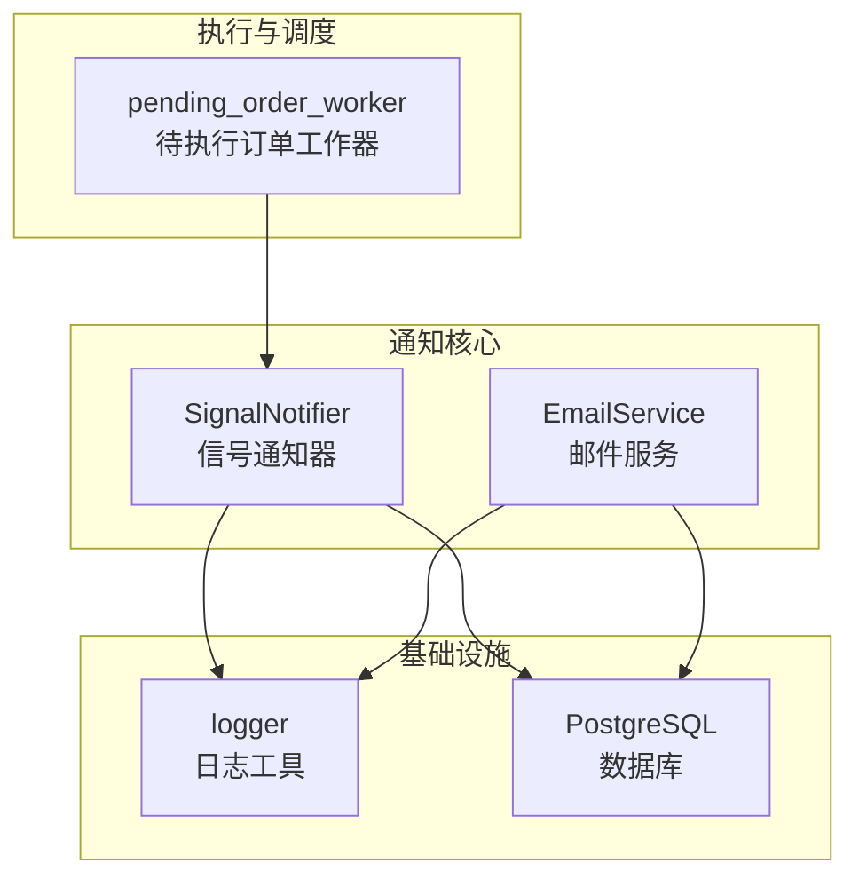
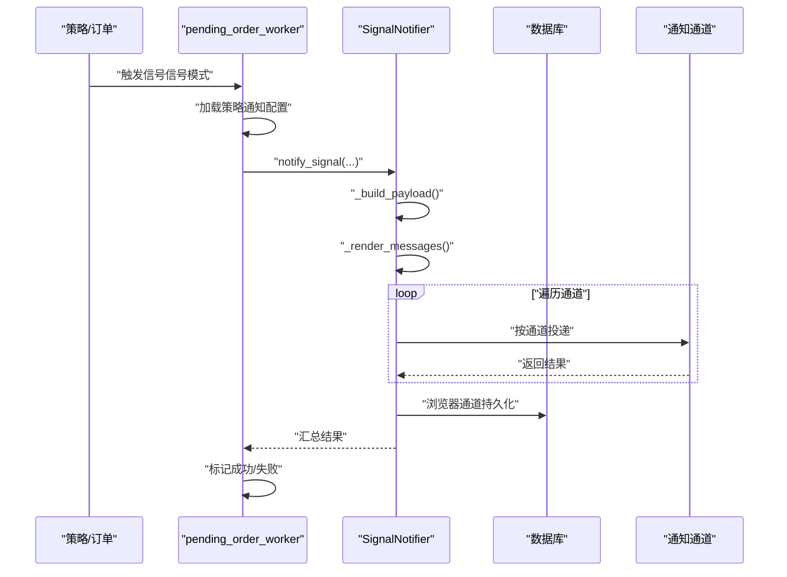
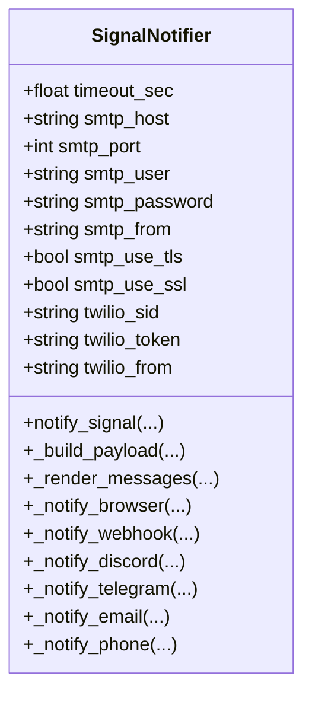
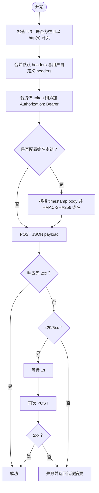
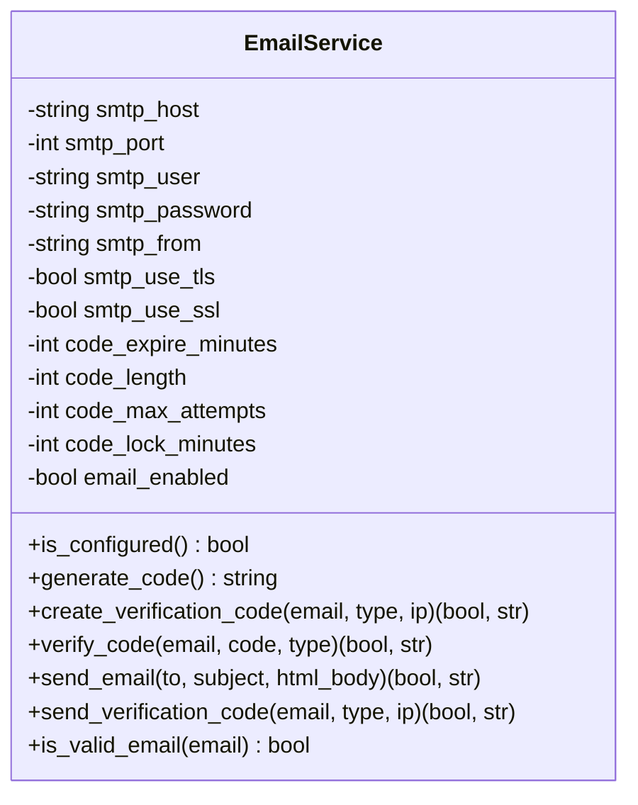
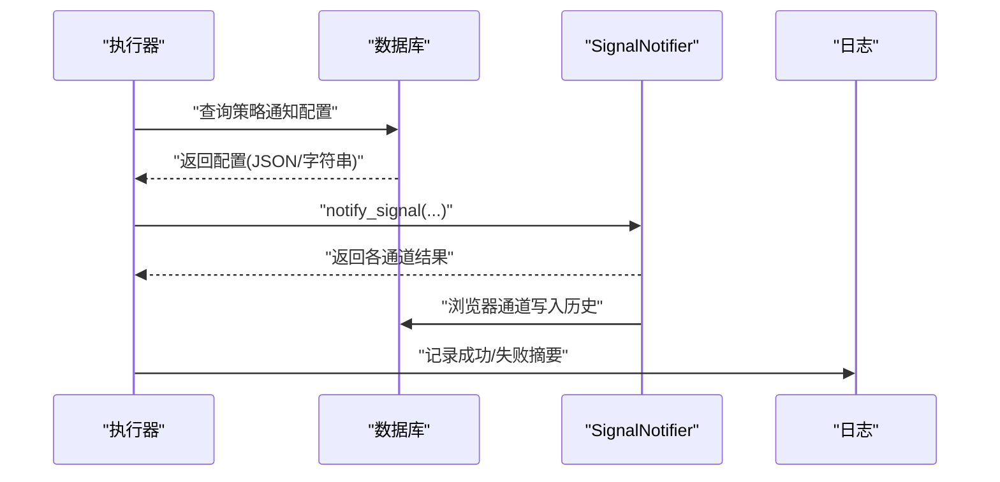
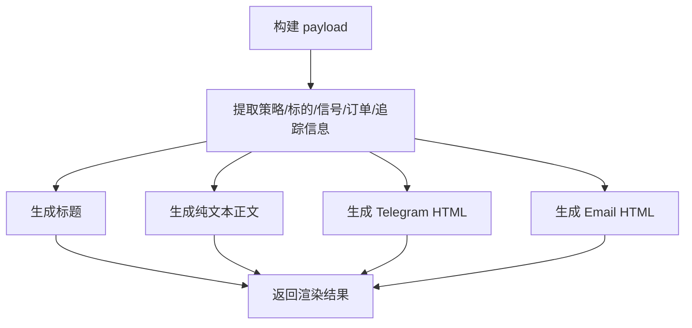
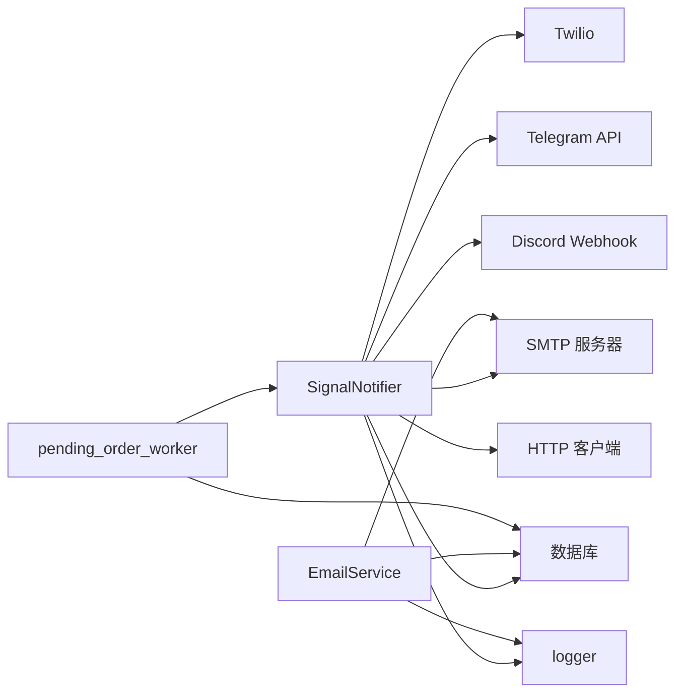

# 通知架构设计

<cite>
**本文档引用的文件**
- [signal_notifier.py](file://backend_api_python/app/services/signal_notifier.py)
- [email_service.py](file://backend_api_python/app/services/email_service.py)
- [pending_order_worker.py](file://backend_api_python/app/services/pending_order_worker.py)
- [logger.py](file://backend_api_python/app/utils/logger.py)
- [NOTIFICATION_EMAIL_CONFIG_EN.md](file://docs/NOTIFICATION_EMAIL_CONFIG_EN.md)
- [NOTIFICATION_TELEGRAM_CONFIG_EN.md](file://docs/NOTIFICATION_TELEGRAM_CONFIG_EN.md)
- [init.sql](file://backend_api_python/migrations/init.sql)
</cite>

## 目录
1. [简介](#简介)
2. [项目结构](#项目结构)
3. [核心组件](#核心组件)
4. [架构总览](#架构总览)
5. [详细组件分析](#详细组件分析)
6. [依赖关系分析](#依赖关系分析)
7. [性能考虑](#性能考虑)
8. [故障排除指南](#故障排除指南)
9. [结论](#结论)
10. [附录](#附录)

## 简介
本文件系统性阐述 QuantDinger 通知架构的设计与实现，重点覆盖 SignalNotifier 核心组件与 EmailService 的实现原理，以及通知队列管理、异步通知处理流程、通知模板系统、触发条件判断逻辑、消息格式化规则与个性化定制选项，并给出性能优化策略、错误处理与重试机制、扩展性与插件化设计建议。

## 项目结构
通知系统主要分布在以下模块：
- 信号通知核心：SignalNotifier（支持浏览器、Webhook、Discord、Telegram、Email、Phone 多通道）
- 邮件服务：EmailService（验证码生成与发送、通用邮件发送）
- 异步执行与调度：pending_order_worker（信号模式下的通知派发）
- 日志工具：logger（统一日志输出与过滤）
- 数据库迁移：init.sql（用户与策略通知相关字段）

**图示来源**
- [signal_notifier.py:130-912](file://backend_api_python/app/services/signal_notifier.py#L130-L912)
- [email_service.py:29-362](file://backend_api_python/app/services/email_service.py#L29-L362)
- [pending_order_worker.py:740-939](file://backend_api_python/app/services/pending_order_worker.py#L740-L939)
- [logger.py:9-63](file://backend_api_python/app/utils/logger.py#L9-L63)
- [init.sql:8-31](file://backend_api_python/migrations/init.sql#L8-L31)

**章节来源**
- [signal_notifier.py:1-912](file://backend_api_python/app/services/signal_notifier.py#L1-L912)
- [email_service.py:1-362](file://backend_api_python/app/services/email_service.py#L1-L362)
- [pending_order_worker.py:740-939](file://backend_api_python/app/services/pending_order_worker.py#L740-L939)
- [logger.py:1-63](file://backend_api_python/app/utils/logger.py#L1-L63)
- [init.sql:1-200](file://backend_api_python/migrations/init.sql#L1-L200)

## 核心组件
- SignalNotifier：统一的信号通知入口，负责构建通知载荷、渲染多渠道消息模板、按通道异步投递并记录结果。
- EmailService：提供验证码生成与存储、验证码校验（含防暴力破解）、通用邮件发送能力。
- pending_order_worker：在“信号模式”下从队列取出待执行订单，调用 SignalNotifier 发送通知；在“实盘模式”下执行真实交易。
- logger：集中日志配置与输出，过滤噪声并写入本地文件。

**章节来源**
- [signal_notifier.py:130-912](file://backend_api_python/app/services/signal_notifier.py#L130-L912)
- [email_service.py:29-362](file://backend_api_python/app/services/email_service.py#L29-L362)
- [pending_order_worker.py:740-939](file://backend_api_python/app/services/pending_order_worker.py#L740-L939)
- [logger.py:9-63](file://backend_api_python/app/utils/logger.py#L9-L63)

## 架构总览
通知系统采用“事件驱动 + 多通道投递”的架构：
- 触发源：策略运行或订单状态变化（如 pending_order_worker 执行信号模式）
- 通知构建：SignalNotifier 统一构建 payload 并渲染各渠道消息
- 投递执行：按通道异步投递，失败时记录错误并进行有限重试
- 结果记录：浏览器通道持久化到数据库；其他通道通过返回值与日志记录结果
- 配置来源：用户级通知配置（用户表）与策略级通知配置（策略表）

**图示来源**
- [pending_order_worker.py:749-792](file://backend_api_python/app/services/pending_order_worker.py#L749-L792)
- [signal_notifier.py:171-283](file://backend_api_python/app/services/signal_notifier.py#L171-L283)
- [signal_notifier.py:285-413](file://backend_api_python/app/services/signal_notifier.py#L285-L413)

## 详细组件分析

### SignalNotifier 组件分析
SignalNotifier 是通知系统的核心，负责：
- 通知配置解析与标准化（channels/targets）
- 用户时区解析与时间显示转换
- 信号元数据解析（action/side/type）
- payload 构建与消息模板渲染（纯文本、Telegram HTML、Email HTML）
- 多通道投递与错误处理、有限重试

**图示来源**
- [signal_notifier.py:130-170](file://backend_api_python/app/services/signal_notifier.py#L130-L170)
- [signal_notifier.py:171-912](file://backend_api_python/app/services/signal_notifier.py#L171-L912)

关键流程与要点：
- 通知配置解析：支持 channels 与 targets 的数组/字符串/JSON 多形态输入，自动清洗与去空。
- 时间处理：根据策略绑定的用户时区，将 UTC 时间转换为本地显示时间与 ISO 字符串。
- 信号元数据：从 signal_type 推断 action（open/add/close/reduce）与 side（long/short），并保留原始类型。
- payload 字段：包含事件类型、版本、时间戳、策略、标的、信号、订单、追踪信息与额外扩展字段。
- 模板渲染：生成标题、纯文本正文、Telegram HTML、Email HTML，确保兼容性与可读性。
- 投递通道：
  - 浏览器：写入数据库表 qd_strategy_notifications，供前端拉取展示。
  - Webhook：支持自定义 headers、Bearer Token、签名（timestamp+secret）与 429/5xx 一次性重试。
  - Discord：Embed 带颜色区分动作，支持速率限制自动等待与回退纯文本。
  - Telegram：基于 Bot Token 与 Chat ID，支持 HTML 解析模式与长度截断。
  - Email：基于 SMTP，支持 TLS/SSL、认证与 HTML/纯文本双内容。
  - Phone：基于 Twilio REST（需配置 SID/TOKEN/FROM）。
- 错误处理：捕获异常并记录，对 webhook/discord 通道避免泄露敏感 URL；记录日志并返回错误摘要。

**章节来源**
- [signal_notifier.py:41-128](file://backend_api_python/app/services/signal_notifier.py#L41-L128)
- [signal_notifier.py:171-283](file://backend_api_python/app/services/signal_notifier.py#L171-L283)
- [signal_notifier.py:285-413](file://backend_api_python/app/services/signal_notifier.py#L285-L413)
- [signal_notifier.py:540-704](file://backend_api_python/app/services/signal_notifier.py#L540-L704)
- [signal_notifier.py:706-740](file://backend_api_python/app/services/signal_notifier.py#L706-L740)
- [signal_notifier.py:741-785](file://backend_api_python/app/services/signal_notifier.py#L741-L785)
- [signal_notifier.py:787-800](file://backend_api_python/app/services/signal_notifier.py#L787-L800)

#### Webhook 投递流程（含签名与重试）

**图示来源**
- [signal_notifier.py:540-628](file://backend_api_python/app/services/signal_notifier.py#L540-L628)

### EmailService 组件分析
EmailService 提供两类能力：
- 验证码：生成随机验证码、入库（带过期时间与尝试次数）、校验（含锁定保护）。
- 邮件发送：构造 HTML/纯文本双内容邮件，按配置选择 TLS 或 SSL，支持认证与发送。

**图示来源**
- [email_service.py:29-58](file://backend_api_python/app/services/email_service.py#L29-L58)
- [email_service.py:67-213](file://backend_api_python/app/services/email_service.py#L67-L213)
- [email_service.py:218-362](file://backend_api_python/app/services/email_service.py#L218-L362)

关键点：
- 配置加载：从环境变量读取 SMTP 参数与验证码策略参数，自动推断是否启用邮件服务。
- 验证码：同一类型同一邮箱仅保留最新未使用验证码，过期与失败尝试计数，超过阈值临时锁定。
- 邮件发送：HTML 与纯文本双内容，自动选择 SSL/TLS，统一异常处理与日志记录。

**章节来源**
- [email_service.py:35-58](file://backend_api_python/app/services/email_service.py#L35-L58)
- [email_service.py:119-213](file://backend_api_python/app/services/email_service.py#L119-L213)
- [email_service.py:218-276](file://backend_api_python/app/services/email_service.py#L218-L276)

### 异步通知处理与队列管理
- 触发条件：pending_order_worker 在 execution_mode 为 "signal" 时触发通知；在 "live" 模式下执行真实交易。
- 通知配置来源：优先使用 payload 中的 notification_config，否则回退从数据库加载策略配置。
- 结果记录：成功则标记“已通知”，失败则记录首个错误摘要；日志中包含通道成功/失败集合。
- 浏览器通道：直接持久化到 qd_strategy_notifications 表，供前端轮询展示。

**图示来源**
- [pending_order_worker.py:749-792](file://backend_api_python/app/services/pending_order_worker.py#L749-L792)
- [pending_order_worker.py:800-821](file://backend_api_python/app/services/pending_order_worker.py#L800-L821)

**章节来源**
- [pending_order_worker.py:749-792](file://backend_api_python/app/services/pending_order_worker.py#L749-L792)
- [pending_order_worker.py:800-821](file://backend_api_python/app/services/pending_order_worker.py#L800-L821)

### 通知模板系统
- 标题：基于策略名、标的、信号动作与方向生成。
- 纯文本：包含策略、标的、信号、价格、金额、挂单号（如有）、模式（如有）、时间标签与本地时间。
- Telegram HTML：使用 HTML 标签与转义，突出关键字段，长度截断。
- Email HTML：表格化展示字段，内嵌 CSS，支持时间行与生成说明。

**图示来源**
- [signal_notifier.py:285-337](file://backend_api_python/app/services/signal_notifier.py#L285-L337)
- [signal_notifier.py:339-413](file://backend_api_python/app/services/signal_notifier.py#L339-L413)
- [signal_notifier.py:415-482](file://backend_api_python/app/services/signal_notifier.py#L415-L482)

**章节来源**
- [signal_notifier.py:339-413](file://backend_api_python/app/services/signal_notifier.py#L339-L413)
- [signal_notifier.py:415-482](file://backend_api_python/app/services/signal_notifier.py#L415-L482)

### 个性化定制与配置
- 用户级配置：用户表 qd_users.notification_settings（如 telegram_chat_id、默认通道等）。
- 策略级配置：策略表 qd_strategies_trading.notification_config（JSON 字符串或对象），包含 channels 与 targets。
- 通道级覆盖：部分通道允许在 notification_config.targets 中覆盖 webhook_headers、webhook_token、webhook_signing_secret、telegram_bot_token 等。

**章节来源**
- [init.sql:8-31](file://backend_api_python/migrations/init.sql#L8-L31)
- [signal_notifier.py:171-283](file://backend_api_python/app/services/signal_notifier.py#L171-L283)
- [pending_order_worker.py:800-821](file://backend_api_python/app/services/pending_order_worker.py#L800-L821)

## 依赖关系分析
- SignalNotifier 依赖：
  - 数据库连接：获取用户时区、持久化浏览器通知
  - 日志：统一记录错误与调试信息
  - 外部服务：SMTP、Twilio、Telegram API、Discord Webhook、HTTP 客户端
- EmailService 依赖：
  - 数据库：验证码表 qd_verification_codes
  - SMTP 库：发送邮件
- pending_order_worker 依赖：
  - SignalNotifier：通知投递
  - 数据库：策略配置与通知历史
  - 日志：记录执行状态

**图示来源**
- [signal_notifier.py:148-170](file://backend_api_python/app/services/signal_notifier.py#L148-L170)
- [email_service.py:35-58](file://backend_api_python/app/services/email_service.py#L35-L58)
- [pending_order_worker.py:749-792](file://backend_api_python/app/services/pending_order_worker.py#L749-L792)
- [logger.py:9-63](file://backend_api_python/app/utils/logger.py#L9-L63)

**章节来源**
- [signal_notifier.py:148-170](file://backend_api_python/app/services/signal_notifier.py#L148-L170)
- [email_service.py:35-58](file://backend_api_python/app/services/email_service.py#L35-L58)
- [pending_order_worker.py:749-792](file://backend_api_python/app/services/pending_order_worker.py#L749-L792)
- [logger.py:9-63](file://backend_api_python/app/utils/logger.py#L9-L63)

## 性能考虑
- 超时控制：通道投递统一使用可配置超时（SIGNAL_NOTIFY_TIMEOUT_SEC），避免阻塞。
- 限速与重试：Webhook 对 429/5xx 做一次性重试；Discord 对速率限制自动等待并回退纯文本；Email 使用较长超时保障稳定性。
- 资源复用：SMTP/HTTP 客户端按需建立连接，避免长生命周期占用。
- 日志降噪：集中日志配置过滤高频噪声，降低 IO 压力。
- 数据库写入：浏览器通道写入单条记录，字段紧凑，索引合理（策略/用户/时间）。

**章节来源**
- [signal_notifier.py:148-170](file://backend_api_python/app/services/signal_notifier.py#L148-L170)
- [signal_notifier.py:611-628](file://backend_api_python/app/services/signal_notifier.py#L611-L628)
- [signal_notifier.py:677-704](file://backend_api_python/app/services/signal_notifier.py#L677-L704)
- [logger.py:9-63](file://backend_api_python/app/utils/logger.py#L9-L63)

## 故障排除指南
- 邮件发送失败：
  - 检查 SMTP_HOST/SMTP_USER/SMTP_PASSWORD/SMTP_FROM 是否配置完整
  - 确认端口与加密方式（TLS/SSL）匹配
  - 查看日志中的 SMTP 认证/连接错误
- Telegram 无法接收：
  - 确认 Bot Token 与 Chat ID 正确
  - 确保已向 Bot 发送过消息以激活对话
- Discord 投递失败：
  - 检查 Webhook URL 格式
  - 若返回 429，系统会自动等待并重试
- Webhook 签名失败：
  - 确认签名密钥与时间戳拼接规则一致
  - 检查 headers 合并与 Authorization 设置
- 验证码问题：
  - 检查验证码过期时间与尝试次数限制
  - 确认数据库中仅保留最新未使用验证码

**章节来源**
- [signal_notifier.py:741-785](file://backend_api_python/app/services/signal_notifier.py#L741-L785)
- [signal_notifier.py:706-740](file://backend_api_python/app/services/signal_notifier.py#L706-L740)
- [signal_notifier.py:630-704](file://backend_api_python/app/services/signal_notifier.py#L630-L704)
- [email_service.py:267-276](file://backend_api_python/app/services/email_service.py#L267-L276)
- [NOTIFICATION_EMAIL_CONFIG_EN.md:202-244](file://docs/NOTIFICATION_EMAIL_CONFIG_EN.md#L202-L244)
- [NOTIFICATION_TELEGRAM_CONFIG_EN.md:103-120](file://docs/NOTIFICATION_TELEGRAM_CONFIG_EN.md#L103-L120)

## 结论
QuantDinger 通知架构以 SignalNotifier 为核心，结合 EmailService 与 pending_order_worker，实现了跨通道、可扩展、可重试、可观测的通知体系。通过统一的 payload 构建与模板渲染，保证了不同渠道的一致性与可读性；通过有限重试与日志记录，提升了可靠性与可维护性。未来可在通道抽象层进一步解耦，引入插件化注册机制，以支持更多外部通知平台。

## 附录

### 通知通道与配置要点
- 浏览器：写入数据库，供前端轮询展示
- Webhook：支持 headers、token、签名与重试
- Discord：Embed 颜色区分动作，支持速率限制与回退
- Telegram：Bot Token 与 Chat ID 必填，HTML 解析
- Email：SMTP 配置，TLS/SSL，HTML/纯文本双内容
- Phone：Twilio 配置（SID/TOKEN/FROM）

**章节来源**
- [signal_notifier.py:171-283](file://backend_api_python/app/services/signal_notifier.py#L171-L283)
- [signal_notifier.py:540-704](file://backend_api_python/app/services/signal_notifier.py#L540-L704)
- [signal_notifier.py:741-800](file://backend_api_python/app/services/signal_notifier.py#L741-L800)
- [NOTIFICATION_EMAIL_CONFIG_EN.md:67-99](file://docs/NOTIFICATION_EMAIL_CONFIG_EN.md#L67-L99)
- [NOTIFICATION_TELEGRAM_CONFIG_EN.md:77-86](file://docs/NOTIFICATION_TELEGRAM_CONFIG_EN.md#L77-L86)