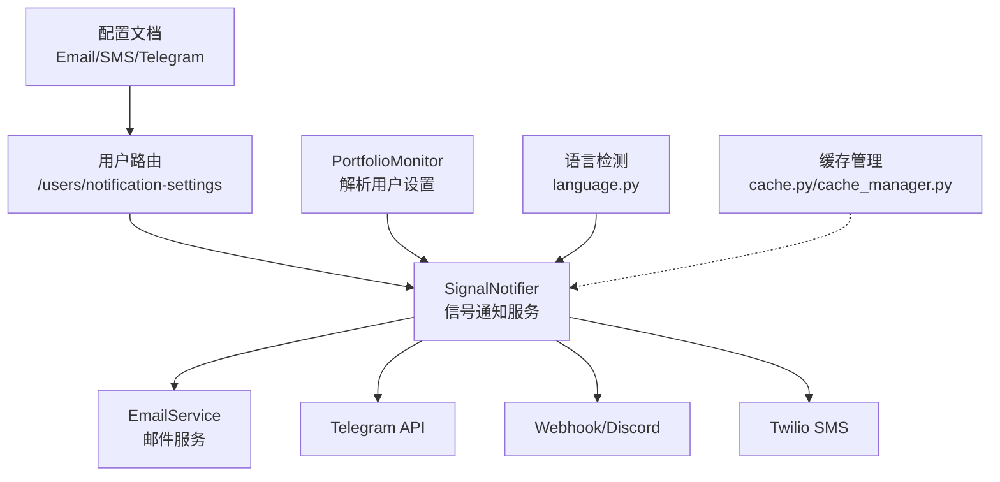
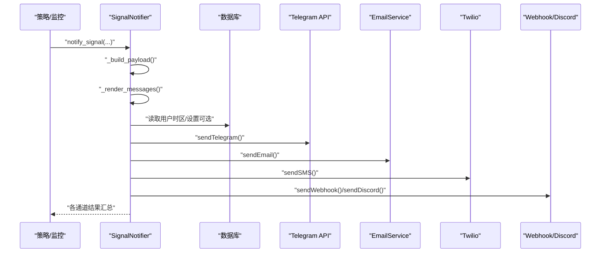
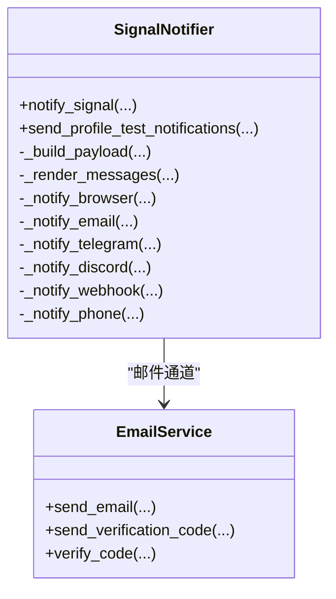
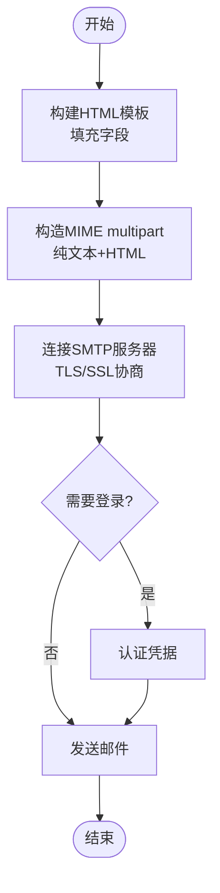
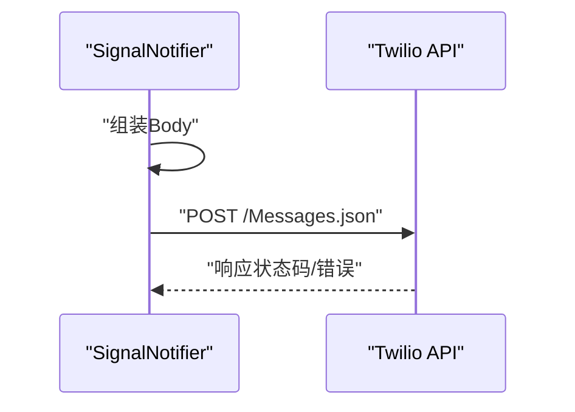
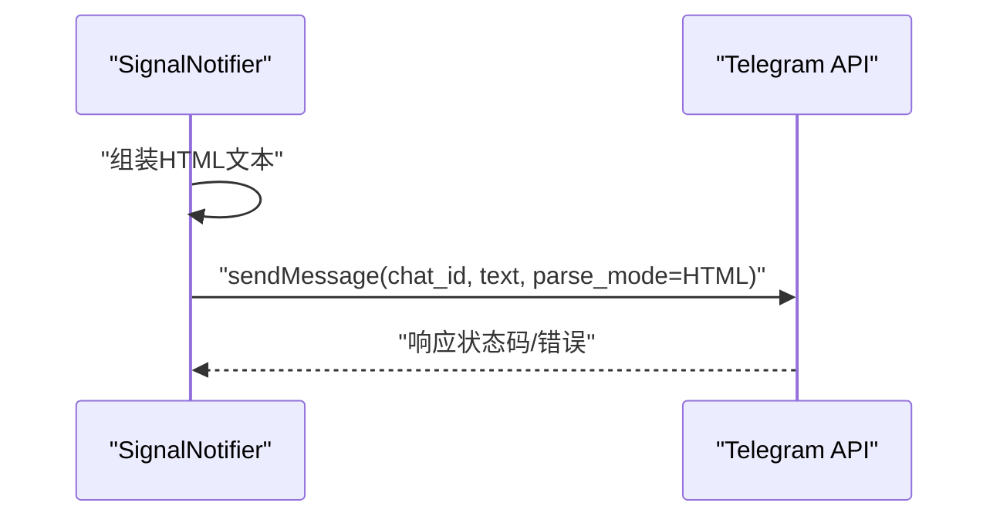
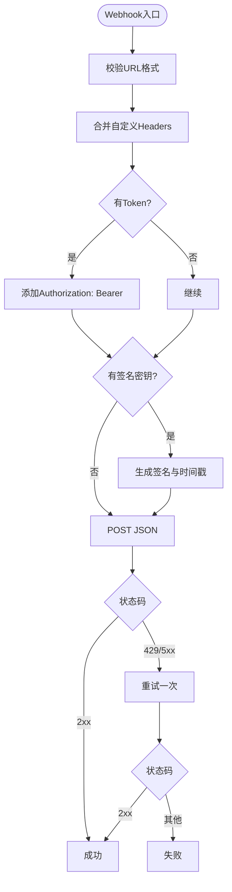
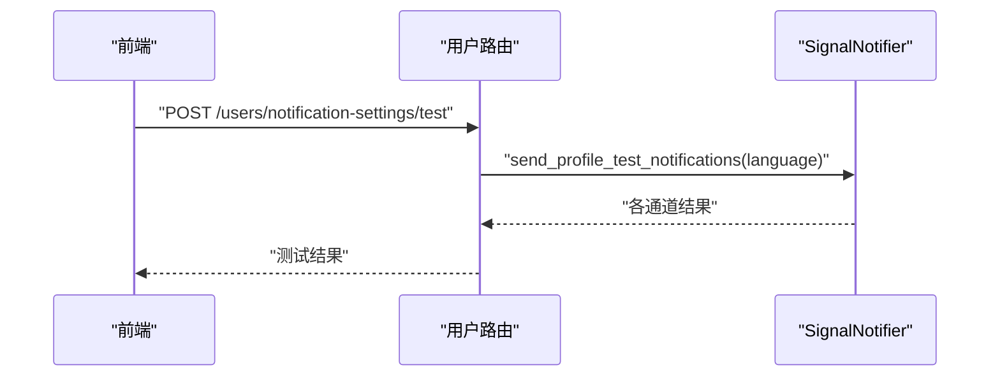
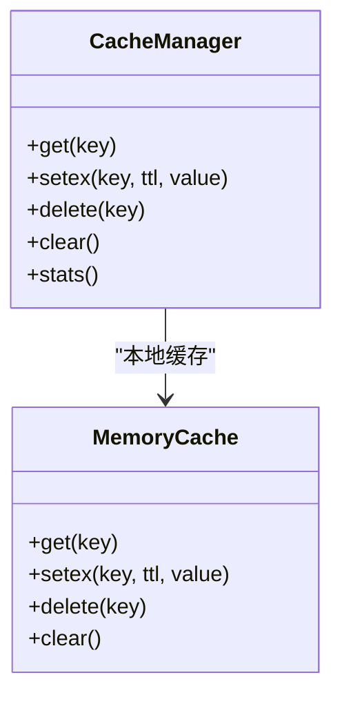
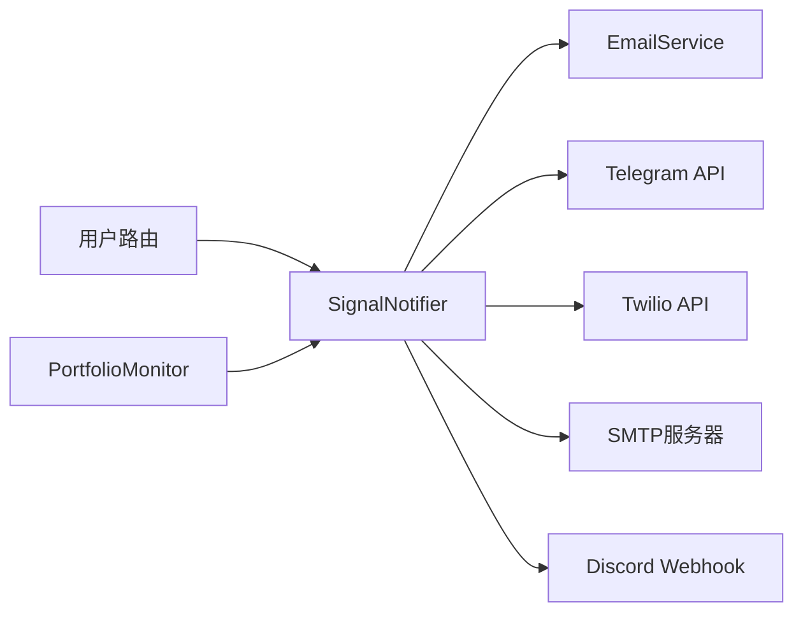

# 通知模板管理

<cite>
**本文引用的文件**
- [signal_notifier.py](file://backend_api_python/app/services/signal_notifier.py)
- [email_service.py](file://backend_api_python/app/services/email_service.py)
- [user.py](file://backend_api_python/app/routes/user.py)
- [portfolio_monitor.py](file://backend_api_python/app/services/portfolio_monitor.py)
- [NOTIFICATION_EMAIL_CONFIG_EN.md](file://docs/NOTIFICATION_EMAIL_CONFIG_EN.md)
- [NOTIFICATION_SMS_CONFIG_EN.md](file://docs/NOTIFICATION_SMS_CONFIG_EN.md)
- [NOTIFICATION_TELEGRAM_CONFIG_EN.md](file://docs/NOTIFICATION_TELEGRAM_CONFIG_EN.md)
- [language.py](file://backend_api_python/app/utils/language.py)
- [cache_manager.py](file://backend_api_python/app/data_sources/cache_manager.py)
- [cache.py](file://backend_api_python/app/utils/cache.py)
</cite>

## 目录
1. [简介](#简介)
2. [项目结构](#项目结构)
3. [核心组件](#核心组件)
4. [架构总览](#架构总览)
5. [详细组件分析](#详细组件分析)
6. [依赖分析](#依赖分析)
7. [性能考虑](#性能考虑)
8. [故障排查指南](#故障排查指南)
9. [结论](#结论)
10. [附录](#附录)

## 简介
本文件系统化阐述通知模板管理的设计与实现，覆盖模板语法、变量替换、条件渲染、多类型模板配置（邮件、短信、Telegram、Webhook）、模板编辑器与预览、版本管理与A/B测试、国际化与多语言切换、性能优化与缓存策略，以及调试与测试最佳实践。通知模板并非以“模板文件”形式存储，而是通过统一的信号通知服务在运行时构建消息体并按通道渲染输出。

## 项目结构
通知模板相关能力主要由以下模块协同完成：
- 信号通知服务：负责构建消息载荷、渲染消息、按通道投递
- 邮件服务：负责邮件发送（可独立于通知服务使用）
- 用户路由：提供通知设置的读取、更新与测试接口
- 监控与投递辅助：从用户设置解析通知目标
- 文档与配置：提供各渠道配置示例与参数说明
- 国际化：语言检测与选择
- 缓存：通用缓存与数据源缓存

图表来源
- [signal_notifier.py:130-284](file://backend_api_python/app/services/signal_notifier.py#L130-L284)
- [email_service.py:29-61](file://backend_api_python/app/services/email_service.py#L29-L61)
- [user.py:694-1023](file://backend_api_python/app/routes/user.py#L694-L1023)
- [portfolio_monitor.py:84-111](file://backend_api_python/app/services/portfolio_monitor.py#L84-L111)
- [language.py:13-57](file://backend_api_python/app/utils/language.py#L13-L57)
- [cache.py:49-80](file://backend_api_python/app/utils/cache.py#L49-L80)
- [cache_manager.py:44-174](file://backend_api_python/app/data_sources/cache_manager.py#L44-L174)

章节来源
- [signal_notifier.py:130-284](file://backend_api_python/app/services/signal_notifier.py#L130-L284)
- [email_service.py:29-61](file://backend_api_python/app/services/email_service.py#L29-L61)
- [user.py:694-1023](file://backend_api_python/app/routes/user.py#L694-L1023)
- [portfolio_monitor.py:84-111](file://backend_api_python/app/services/portfolio_monitor.py#L84-L111)
- [language.py:13-57](file://backend_api_python/app/utils/language.py#L13-L57)
- [cache.py:49-80](file://backend_api_python/app/utils/cache.py#L49-L80)
- [cache_manager.py:44-174](file://backend_api_python/app/data_sources/cache_manager.py#L44-L174)

## 核心组件
- 信号通知服务（SignalNotifier）
  - 构建标准化事件载荷
  - 渲染多通道消息（纯文本、HTML、Discord Embed等）
  - 多通道投递（浏览器、邮件、Telegram、Discord、Webhook、短信）
- 邮件服务（EmailService）
  - 提供邮件发送能力（HTML与纯文本双版本）
  - 验证码发送与校验（独立功能）
- 用户路由（/users/notification-settings）
  - 读取/更新通知设置
  - 触发测试通知
- 监控与投递辅助（PortfolioMonitor）
  - 解析用户通知目标（邮箱、Telegram、Webhook等）
- 国际化（language.py）
  - 请求语言检测与归一化
- 缓存（cache.py、cache_manager.py）
  - 内存缓存与Redis缓存（可选）

章节来源
- [signal_notifier.py:171-284](file://backend_api_python/app/services/signal_notifier.py#L171-L284)
- [email_service.py:218-276](file://backend_api_python/app/services/email_service.py#L218-L276)
- [user.py:694-1023](file://backend_api_python/app/routes/user.py#L694-L1023)
- [portfolio_monitor.py:84-111](file://backend_api_python/app/services/portfolio_monitor.py#L84-L111)
- [language.py:27-57](file://backend_api_python/app/utils/language.py#L27-L57)
- [cache.py:17-80](file://backend_api_python/app/utils/cache.py#L17-L80)
- [cache_manager.py:44-174](file://backend_api_python/app/data_sources/cache_manager.py#L44-L174)

## 架构总览
通知流程从策略触发开始，经由SignalNotifier构建payload并渲染消息，再根据用户配置的目标通道进行投递；用户可通过路由接口管理通知设置并进行测试。

图表来源
- [signal_notifier.py:171-284](file://backend_api_python/app/services/signal_notifier.py#L171-L284)
- [signal_notifier.py:285-413](file://backend_api_python/app/services/signal_notifier.py#L285-L413)
- [signal_notifier.py:706-785](file://backend_api_python/app/services/signal_notifier.py#L706-L785)
- [signal_notifier.py:540-628](file://backend_api_python/app/services/signal_notifier.py#L540-L628)
- [email_service.py:218-276](file://backend_api_python/app/services/email_service.py#L218-L276)

## 详细组件分析

### 信号通知服务（SignalNotifier）
- 职责
  - 接收策略信号，构建标准化payload
  - 渲染多通道消息（标题、纯文本、HTML、Embed等）
  - 按通道调用具体投递方法
- 关键流程
  - 构建payload：包含策略、标的、信号、订单、追踪、额外字段
  - 渲染消息：生成标题、纯文本正文、HTML正文、Telegram HTML、Discord Embed
  - 投递：浏览器、邮件、Telegram、Discord、Webhook、短信
- 通道特性
  - 浏览器：持久化到通知表
  - 邮件：HTML与纯文本双版本
  - Telegram：支持HTML parse_mode，长度限制
  - Discord：Embed颜色与字段，失败回退纯文本
  - Webhook：支持自定义headers、Bearer Token、签名头、自动重试
  - 短信：基于Twilio REST API

图表来源
- [signal_notifier.py:130-912](file://backend_api_python/app/services/signal_notifier.py#L130-L912)
- [email_service.py:29-362](file://backend_api_python/app/services/email_service.py#L29-L362)

章节来源
- [signal_notifier.py:171-284](file://backend_api_python/app/services/signal_notifier.py#L171-L284)
- [signal_notifier.py:285-413](file://backend_api_python/app/services/signal_notifier.py#L285-L413)
- [signal_notifier.py:706-785](file://backend_api_python/app/services/signal_notifier.py#L706-L785)
- [signal_notifier.py:540-628](file://backend_api_python/app/services/signal_notifier.py#L540-L628)

### 邮件模板与配置
- 模板语法与变量
  - HTML表格布局，包含策略、标的、信号、价格、金额、时间等字段
  - 使用内联CSS保证兼容性
- 变量替换
  - 动态填充策略名称、符号、信号类型、价格、金额、时间显示等
- 条件渲染
  - 当存在挂单ID、模式、时间显示时追加行
- 配置要点
  - SMTP_HOST、SMTP_PORT、SMTP_USER、SMTP_PASSWORD、SMTP_FROM、SMTP_USE_TLS、SMTP_USE_SSL
  - 支持隐式SSL（端口465）与STARTTLS（端口587）
- 发送流程
  - 构造MIME multipart，同时包含纯文本与HTML版本
  - 登录SMTP服务器发送

图表来源
- [signal_notifier.py:415-482](file://backend_api_python/app/services/signal_notifier.py#L415-L482)
- [email_service.py:218-276](file://backend_api_python/app/services/email_service.py#L218-L276)

章节来源
- [signal_notifier.py:415-482](file://backend_api_python/app/services/signal_notifier.py#L415-L482)
- [email_service.py:218-276](file://backend_api_python/app/services/email_service.py#L218-L276)
- [NOTIFICATION_EMAIL_CONFIG_EN.md:67-97](file://docs/NOTIFICATION_EMAIL_CONFIG_EN.md#L67-L97)

### 短信模板与配置（Twilio）
- 模板语法与变量
  - 纯文本模板，包含策略、符号、信号、价格、金额、时间等字段
- 变量替换
  - 动态替换字段，保留关键信息
- 配置要点
  - TWILIO_ACCOUNT_SID、TWILIO_AUTH_TOKEN、TWILIO_FROM_NUMBER
- 发送流程
  - 调用Twilio Messages API，Body长度限制约1500字符

图表来源
- [signal_notifier.py:787-802](file://backend_api_python/app/services/signal_notifier.py#L787-L802)
- [NOTIFICATION_SMS_CONFIG_EN.md:87-107](file://docs/NOTIFICATION_SMS_CONFIG_EN.md#L87-L107)

章节来源
- [signal_notifier.py:787-802](file://backend_api_python/app/services/signal_notifier.py#L787-L802)
- [NOTIFICATION_SMS_CONFIG_EN.md:87-107](file://docs/NOTIFICATION_SMS_CONFIG_EN.md#L87-L107)

### Telegram消息模板与配置
- 模板语法与变量
  - HTML模板，使用粗体、代码样式等
  - 包含策略、符号、信号、价格、金额、时间等字段
- 变量替换
  - 动态填充字段并进行HTML转义
- 配置要点
  - 用户侧可配置telegram_bot_token与telegram_chat_id
  - 若未配置，回退至环境变量中的全局Token
- 发送流程
  - 调用Telegram sendMessage接口，parse_mode=HTML，长度限制约3900字符

图表来源
- [signal_notifier.py:706-739](file://backend_api_python/app/services/signal_notifier.py#L706-L739)
- [signal_notifier.py:240-259](file://backend_api_python/app/services/signal_notifier.py#L240-L259)
- [portfolio_monitor.py:104-109](file://backend_api_python/app/services/portfolio_monitor.py#L104-L109)
- [NOTIFICATION_TELEGRAM_CONFIG_EN.md:77-86](file://docs/NOTIFICATION_TELEGRAM_CONFIG_EN.md#L77-L86)

章节来源
- [signal_notifier.py:706-739](file://backend_api_python/app/services/signal_notifier.py#L706-L739)
- [signal_notifier.py:240-259](file://backend_api_python/app/services/signal_notifier.py#L240-L259)
- [portfolio_monitor.py:104-109](file://backend_api_python/app/services/portfolio_monitor.py#L104-L109)
- [NOTIFICATION_TELEGRAM_CONFIG_EN.md:77-86](file://docs/NOTIFICATION_TELEGRAM_CONFIG_EN.md#L77-L86)

### Webhook与Discord模板
- Webhook
  - 支持自定义headers、Bearer Token、签名头（X-QD-Timestamp、X-QD-Signature）
  - 自动重试：对429/5xx重试一次
  - 支持HTTP/HTTPS地址校验
- Discord
  - Embed颜色随动作变化（开仓/加仓/平仓/减仓）
  - 失败时回退纯文本

图表来源
- [signal_notifier.py:540-628](file://backend_api_python/app/services/signal_notifier.py#L540-L628)

章节来源
- [signal_notifier.py:540-628](file://backend_api_python/app/services/signal_notifier.py#L540-L628)

### 模板编辑器与预览
- 预览机制
  - 通过“测试通知”接口触发，使用当前用户保存的通知设置
  - 支持多通道并行测试，返回各通道结果
- 语言选择
  - 根据请求头Accept-Language与X-Locale选择语言，内置中英文测试文案
- 使用步骤
  - 在“通知设置”中保存目标通道与目标地址
  - 调用测试接口，查看各通道返回结果

图表来源
- [user.py:947-1023](file://backend_api_python/app/routes/user.py#L947-L1023)
- [signal_notifier.py:804-909](file://backend_api_python/app/services/signal_notifier.py#L804-L909)

章节来源
- [user.py:947-1023](file://backend_api_python/app/routes/user.py#L947-L1023)
- [signal_notifier.py:804-909](file://backend_api_python/app/services/signal_notifier.py#L804-L909)

### 版本管理与A/B测试
- 版本管理
  - 通知payload包含版本字段，便于后续演进与兼容
- A/B测试
  - 可通过Webhook签名机制与自定义headers实现差异化路由与观测
  - 建议在Webhook端基于签名与时间戳进行分流与指标采集

章节来源
- [signal_notifier.py:285-337](file://backend_api_python/app/services/signal_notifier.py#L285-L337)
- [signal_notifier.py:592-601](file://backend_api_python/app/services/signal_notifier.py#L592-L601)

### 国际化与多语言切换
- 语言检测
  - 支持Accept-Language与X-Locale，归一化为标准语言标签
  - 支持zh-CN、zh-TW、en-US、ja-JP、ko-KR、vi-VN、th-TH、ar-SA、fr-FR、de-DE
- 测试文案
  - 测试通知根据语言选择中文或英文文案

章节来源
- [language.py:13-57](file://backend_api_python/app/utils/language.py#L13-L57)
- [signal_notifier.py:804-827](file://backend_api_python/app/services/signal_notifier.py#L804-L827)

### 性能优化与缓存策略
- 通知服务
  - 本地内存缓存（MemoryCache）优先，Redis仅在显式启用时使用
  - 通知服务本身不直接缓存消息模板，但可结合外部缓存层
- 数据源缓存
  - 提供统一缓存管理器，支持TTL、最大容量、LRU淘汰、线程安全
  - 适用于高频查询与计算结果的缓存

图表来源
- [cache.py:49-80](file://backend_api_python/app/utils/cache.py#L49-L80)
- [cache_manager.py:44-174](file://backend_api_python/app/data_sources/cache_manager.py#L44-L174)

章节来源
- [cache.py:49-80](file://backend_api_python/app/utils/cache.py#L49-L80)
- [cache_manager.py:44-174](file://backend_api_python/app/data_sources/cache_manager.py#L44-L174)

## 依赖分析
- 组件耦合
  - SignalNotifier依赖EmailService进行邮件发送
  - 用户路由依赖SignalNotifier进行测试通知
  - PortfolioMonitor依赖用户设置解析通知目标
- 外部依赖
  - Telegram API、Twilio API、SMTP服务器、Discord Webhook
- 潜在循环依赖
  - 未发现循环导入；模块职责清晰

图表来源
- [signal_notifier.py:130-912](file://backend_api_python/app/services/signal_notifier.py#L130-L912)
- [email_service.py:29-362](file://backend_api_python/app/services/email_service.py#L29-L362)
- [user.py:694-1023](file://backend_api_python/app/routes/user.py#L694-L1023)
- [portfolio_monitor.py:84-111](file://backend_api_python/app/services/portfolio_monitor.py#L84-L111)

章节来源
- [signal_notifier.py:130-912](file://backend_api_python/app/services/signal_notifier.py#L130-L912)
- [email_service.py:29-362](file://backend_api_python/app/services/email_service.py#L29-L362)
- [user.py:694-1023](file://backend_api_python/app/routes/user.py#L694-L1023)
- [portfolio_monitor.py:84-111](file://backend_api_python/app/services/portfolio_monitor.py#L84-L111)

## 性能考虑
- 通知超时控制
  - HTTP超时可通过环境变量配置，默认约6秒
- 并发与重试
  - Webhook对429/5xx自动重试一次
  - Discord对429按retry_after重试
- 缓存与资源复用
  - 使用本地内存缓存减少重复初始化
  - SMTP连接按需建立，避免长连接占用
- 建议
  - 对高并发场景建议启用Redis缓存
  - 对Webhook端点实施幂等与去重

[本节为通用指导，无需列出章节来源]

## 故障排查指南
- 邮件
  - 缺少SMTP配置或FROM地址：检查SMTP_HOST、SMTP_FROM
  - 认证失败：确认用户名与密码或应用密码
  - 端口与加密：区分587（STARTTLS）与465（SSL）
- 短信
  - 缺少Twilio配置或号码格式错误：检查TWILIO_ACCOUNT_SID、TWILIO_FROM_NUMBER
  - 国际短信受限：检查运营商与地区限制
- Telegram
  - 缺少Token或Chat ID：检查用户设置或环境变量
  - 消息长度超限：注意HTML长度限制
- Webhook/Discord
  - URL格式错误：确保http/https
  - 签名失败：核对签名密钥与时间戳
- 测试
  - 使用“测试通知”接口快速定位失败通道与错误详情

章节来源
- [signal_notifier.py:741-785](file://backend_api_python/app/services/signal_notifier.py#L741-L785)
- [signal_notifier.py:787-802](file://backend_api_python/app/services/signal_notifier.py#L787-L802)
- [signal_notifier.py:706-739](file://backend_api_python/app/services/signal_notifier.py#L706-L739)
- [signal_notifier.py:540-628](file://backend_api_python/app/services/signal_notifier.py#L540-L628)
- [user.py:947-1023](file://backend_api_python/app/routes/user.py#L947-L1023)

## 结论
通知模板管理通过“运行时构建+多通道渲染”的方式实现灵活的消息输出。系统提供了完善的邮件、短信、Telegram、Webhook、Discord通知能力，并配套测试接口、国际化与缓存策略。对于模板的版本与A/B测试，建议结合Webhook签名与自定义头部在接收端实现。未来可在模板层引入版本化与灰度发布机制，进一步提升可维护性与可观测性。

[本节为总结性内容，无需列出章节来源]

## 附录
- 通知设置接口
  - 读取：GET /users/notification-settings
  - 更新：PUT /users/notification-settings
  - 测试：POST /users/notification-settings/test
- 关键环境变量
  - SMTP_HOST、SMTP_PORT、SMTP_USER、SMTP_PASSWORD、SMTP_FROM、SMTP_USE_TLS、SMTP_USE_SSL
  - TWILIO_ACCOUNT_SID、TWILIO_AUTH_TOKEN、TWILIO_FROM_NUMBER
  - TELEGRAM_BOT_TOKEN（用户侧可覆盖）
  - SIGNAL_NOTIFY_TIMEOUT_SEC（通知超时）
  - SIGNAL_WEBHOOK_SIGNING_SECRET（Webhook签名密钥）

章节来源
- [user.py:694-1023](file://backend_api_python/app/routes/user.py#L694-L1023)
- [NOTIFICATION_EMAIL_CONFIG_EN.md:67-97](file://docs/NOTIFICATION_EMAIL_CONFIG_EN.md#L67-L97)
- [NOTIFICATION_SMS_CONFIG_EN.md:87-107](file://docs/NOTIFICATION_SMS_CONFIG_EN.md#L87-L107)
- [signal_notifier.py:148-170](file://backend_api_python/app/services/signal_notifier.py#L148-L170)