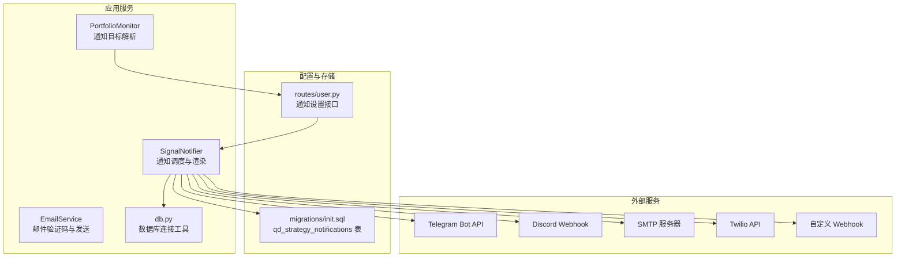
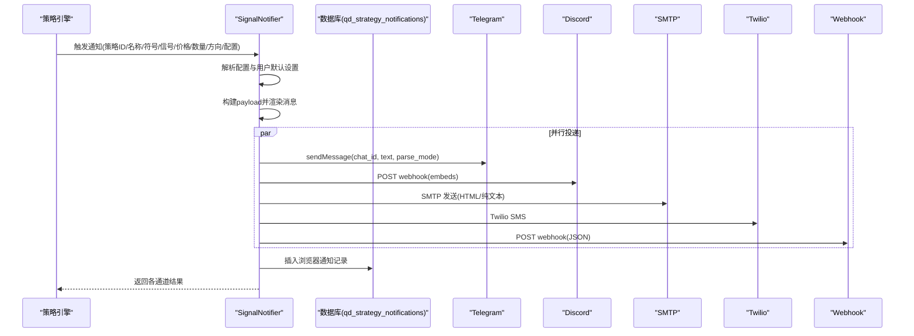
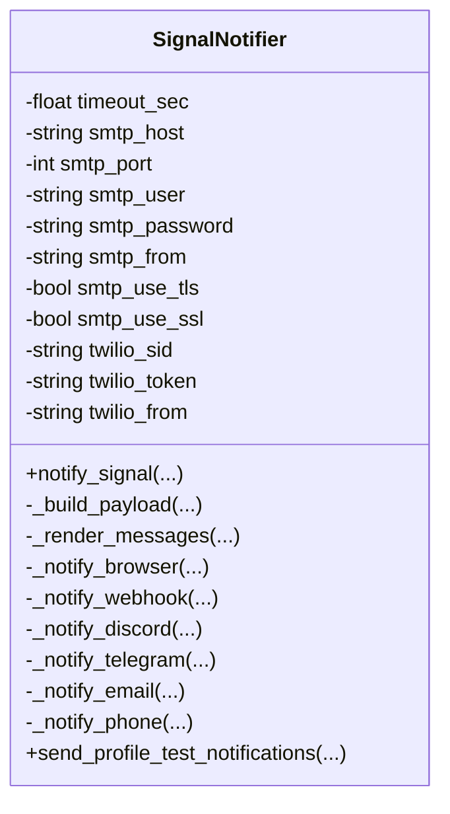
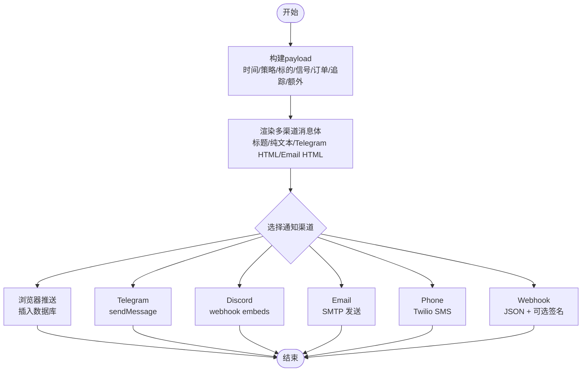
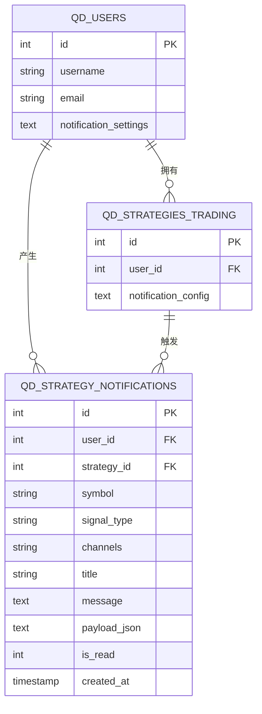
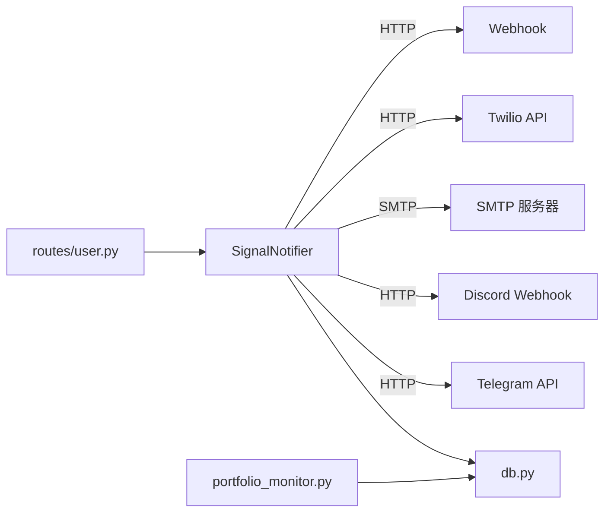

# 通知系统

<cite>
**本文档引用的文件**
- [signal_notifier.py](file://backend_api_python/app/services/signal_notifier.py)
- [email_service.py](file://backend_api_python/app/services/email_service.py)
- [user.py](file://backend_api_python/app/routes/user.py)
- [portfolio_monitor.py](file://backend_api_python/app/services/portfolio_monitor.py)
- [db.py](file://backend_api_python/app/utils/db.py)
- [init.sql](file://backend_api_python/migrations/init.sql)
- [NOTIFICATION_TELEGRAM_CONFIG_EN.md](file://docs/NOTIFICATION_TELEGRAM_CONFIG_EN.md)
- [NOTIFICATION_EMAIL_CONFIG_EN.md](file://docs/NOTIFICATION_EMAIL_CONFIG_EN.md)
- [NOTIFICATION_SMS_CONFIG_EN.md](file://docs/NOTIFICATION_SMS_CONFIG_EN.md)
- [strategy.py](file://backend_api_python/app/routes/strategy.py)
</cite>

## 目录
1. [简介](#简介)
2. [项目结构](#项目结构)
3. [核心组件](#核心组件)
4. [架构总览](#架构总览)
5. [详细组件分析](#详细组件分析)
6. [依赖分析](#依赖分析)
7. [性能考虑](#性能考虑)
8. [故障排除指南](#故障排除指南)
9. [结论](#结论)
10. [附录](#附录)

## 简介
QuantDinger 通知系统是一个多通道通知平台，支持浏览器内推送、Telegram 机器人、Discord Webhook、Email SMTP、SMS（Twilio）以及通用 Webhook。系统采用“策略级通知配置 + 用户默认设置”的双层配置模型，结合统一的消息模板渲染与通道适配器，实现跨渠道的一致化通知体验。

通知系统的关键特性：
- 多通道并行投递：策略触发时可同时向多个渠道发送通知
- 统一消息模板：构建标准化 payload，按渠道渲染不同格式
- 用户与策略两级配置：用户可在个人中心设置默认通知目标，策略可覆盖特定目标
- 错误隔离与重试：各通道独立失败不影响其他通道；部分通道具备最小重试能力
- 数据持久化：浏览器通知直接落库，便于前端展示与历史查询

## 项目结构
通知系统主要由以下模块构成：
- 服务层：SignalNotifier 负责通知调度、模板渲染与通道投递
- 配置层：用户路由提供通知设置的增删改查接口
- 存储层：PostgreSQL 表 qd_strategy_notifications 存储浏览器通知
- 文档层：各渠道配置文档提供环境变量与使用指南

**图示来源**
- [signal_notifier.py](file://backend_api_python/app/services/signal_notifier.py)
- [email_service.py](file://backend_api_python/app/services/email_service.py)
- [user.py](file://backend_api_python/app/routes/user.py)
- [portfolio_monitor.py](file://backend_api_python/app/services/portfolio_monitor.py)
- [db.py](file://backend_api_python/app/utils/db.py)
- [init.sql](file://backend_api_python/migrations/init.sql)

**章节来源**
- [signal_notifier.py](file://backend_api_python/app/services/signal_notifier.py)
- [user.py](file://backend_api_python/app/routes/user.py)
- [init.sql](file://backend_api_python/migrations/init.sql)

## 核心组件
- SignalNotifier：通知主控制器，负责：
  - 解析策略通知配置与用户默认设置
  - 构建标准化 payload
  - 渲染多渠道消息体
  - 并行调用各通道适配器
  - 记录浏览器通知到数据库
- EmailService：邮件服务（验证码与通知），提供 SMTP 配置加载、验证码生成与发送
- 用户路由：提供更新通知设置与测试通知的接口
- PortfolioMonitor：在策略执行前解析通知目标（从用户设置回填）
- 数据库工具：统一 PostgreSQL 连接与初始化
- 数据表：qd_strategy_notifications 存储浏览器通知

**章节来源**
- [signal_notifier.py](file://backend_api_python/app/services/signal_notifier.py)
- [email_service.py](file://backend_api_python/app/services/email_service.py)
- [user.py](file://backend_api_python/app/routes/user.py)
- [portfolio_monitor.py](file://backend_api_python/app/services/portfolio_monitor.py)
- [db.py](file://backend_api_python/app/utils/db.py)
- [init.sql](file://backend_api_python/migrations/init.sql)

## 架构总览
通知系统采用“策略触发 → 配置解析 → 模板渲染 → 多通道投递 → 结果汇总”的流水线式设计。SignalNotifier 是核心编排者，负责：
- 合并策略配置与用户默认设置
- 生成标准化 payload（含时间戳、策略、标的、信号、订单、追踪信息）
- 渲染标题、纯文本、Telegram HTML、Email HTML
- 逐通道投递并收集结果
- 浏览器通知落地数据库

**图示来源**
- [signal_notifier.py](file://backend_api_python/app/services/signal_notifier.py)
- [init.sql](file://backend_api_python/migrations/init.sql)

## 详细组件分析

### SignalNotifier 类
SignalNotifier 是通知系统的核心类，承担以下职责：
- 初始化公共 SMTP/Twilio 配置
- 解析策略通知配置与用户默认设置
- 构建标准化 payload
- 渲染多渠道消息体
- 调用各通道适配器并汇总结果
- 浏览器通知持久化

**图示来源**
- [signal_notifier.py](file://backend_api_python/app/services/signal_notifier.py)

**章节来源**
- [signal_notifier.py](file://backend_api_python/app/services/signal_notifier.py)

### 通知模板系统
SignalNotifier 提供统一的 payload 构建与消息渲染逻辑：
- payload 字段：事件类型、版本、时间戳、策略、标的、信号、订单、追踪、额外信息
- 渲染输出：
  - 标题：基于策略名、符号、动作与方向
  - 纯文本：适用于 Email、SMS、Webhook
  - Telegram HTML：带标签的富文本
  - Email HTML：表格化展示，兼容性良好

**图示来源**
- [signal_notifier.py](file://backend_api_python/app/services/signal_notifier.py)

**章节来源**
- [signal_notifier.py](file://backend_api_python/app/services/signal_notifier.py)

### 通知队列管理
- 浏览器通知：直接写入 qd_strategy_notifications 表，便于前端轮询展示
- 其他渠道：即时投递，不引入外部队列中间件
- 数据库表结构：
  - qd_strategy_notifications：包含用户ID、策略ID、符号、信号类型、渠道列表、标题、消息正文、payload JSON、是否已读、创建时间

**图示来源**
- [init.sql](file://backend_api_python/migrations/init.sql)

**章节来源**
- [init.sql](file://backend_api_python/migrations/init.sql)

### 通知渠道集成

#### Telegram 机器人
- 配置方式：
  - 用户在个人中心设置 telegram_bot_token 与 telegram_chat_id
  - 策略配置可覆盖 token 或 chat_id
- 投递流程：调用 Telegram Bot API 的 sendMessage，支持 parse_mode=HTML
- 限制与注意：
  - 必须先与机器人交互以激活
  - 支持多用户/群组/频道 ID（逗号分隔）

**章节来源**
- [signal_notifier.py](file://backend_api_python/app/services/signal_notifier.py)
- [user.py](file://backend_api_python/app/routes/user.py)
- [NOTIFICATION_TELEGRAM_CONFIG_EN.md](file://docs/NOTIFICATION_TELEGRAM_CONFIG_EN.md)

#### Email SMTP
- 配置方式：
  - 系统管理员配置 SMTP_HOST/PORT/USER/PASSWORD/FROM/USE_TLS/USE_SSL
  - 用户可在个人中心设置 email 作为覆盖
- 投递流程：使用 smtplib 发送，支持 HTML 与纯文本双版本
- 限制与注意：
  - 需启用 SMTP 授权码（如 Gmail）
  - 不同提供商端口与加密方式不同

**章节来源**
- [signal_notifier.py](file://backend_api_python/app/services/signal_notifier.py)
- [email_service.py](file://backend_api_python/app/services/email_service.py)
- [NOTIFICATION_EMAIL_CONFIG_EN.md](file://docs/NOTIFICATION_EMAIL_CONFIG_EN.md)

#### SMS（Twilio）
- 配置方式：
  - 系统管理员配置 TWILIO_ACCOUNT_SID/AUTH_TOKEN/FROM_NUMBER
  - 用户可在个人中心设置 phone 作为覆盖
- 投递流程：调用 Twilio Messages 接口发送短信
- 限制与注意：
  - 国际短信可能受限，需关注运营商与地区政策
  - 试用账户仅能向已验证号码发送

**章节来源**
- [signal_notifier.py](file://backend_api_python/app/services/signal_notifier.py)
- [NOTIFICATION_SMS_CONFIG_EN.md](file://docs/NOTIFICATION_SMS_CONFIG_EN.md)

#### Discord Webhook
- 配置方式：
  - 用户在个人中心设置 discord_webhook（或策略配置 targets.discord）
- 投递流程：发送 JSON Embeds；若失败且返回 429，则按 retry_after 重试；最后回退为纯文本
- 限制与注意：
  - 频繁速率限制时会自动等待

**章节来源**
- [signal_notifier.py](file://backend_api_python/app/services/signal_notifier.py)

#### Webhook（通用）
- 配置方式：
  - 用户在个人中心设置 webhook_url、webhook_token、webhook_headers、webhook_signing_secret
  - 策略 targets 可覆盖上述字段
- 投递流程：发送 JSON；支持 Authorization Bearer、签名头 X-QD-Timestamp/X-QD-Signature；对 429/5xx 最小重试一次
- 限制与注意：
  - 签名密钥可策略级覆盖，否则使用环境变量

**章节来源**
- [signal_notifier.py](file://backend_api_python/app/services/signal_notifier.py)

### 通知触发条件与消息格式
- 触发条件：策略信号事件（开仓、加仓、平仓、减仓等）
- 消息格式：
  - 标题：包含策略名、符号、动作与方向
  - 纯文本：包含策略、符号、信号、价格、金额、挂单ID（如有）、模式（如有）、时间
  - Telegram HTML：富文本，数值以等宽字体显示
  - Email HTML：表格化展示，带时间戳与品牌信息

**章节来源**
- [signal_notifier.py](file://backend_api_python/app/services/signal_notifier.py)

### 个性化定制选项
- 用户默认设置：default_channels、telegram_bot_token、telegram_chat_id、email、discord_webhook、webhook_url、webhook_token、phone
- 策略覆盖：targets 中可指定各渠道的目标与令牌
- 时间显示：根据策略所属用户时区进行本地化展示

**章节来源**
- [user.py](file://backend_api_python/app/routes/user.py)
- [portfolio_monitor.py](file://backend_api_python/app/services/portfolio_monitor.py)
- [signal_notifier.py](file://backend_api_python/app/services/signal_notifier.py)

## 依赖分析
- 内部依赖：
  - SignalNotifier 依赖数据库工具与日志工具
  - 用户路由依赖 SignalNotifier 进行测试通知
  - PortfolioMonitor 依赖数据库工具解析用户设置
- 外部依赖：
  - Telegram Bot API、Discord Webhook、SMTP 服务器、Twilio API、HTTP 客户端

**图示来源**
- [signal_notifier.py](file://backend_api_python/app/services/signal_notifier.py)
- [user.py](file://backend_api_python/app/routes/user.py)
- [portfolio_monitor.py](file://backend_api_python/app/services/portfolio_monitor.py)
- [db.py](file://backend_api_python/app/utils/db.py)

**章节来源**
- [signal_notifier.py](file://backend_api_python/app/services/signal_notifier.py)
- [user.py](file://backend_api_python/app/routes/user.py)
- [portfolio_monitor.py](file://backend_api_python/app/services/portfolio_monitor.py)
- [db.py](file://backend_api_python/app/utils/db.py)

## 性能考虑
- 并行投递：各通道独立并发，缩短整体通知延迟
- 最小重试：Webhook 与 Discord 在 429/5xx 时进行一次重试，提升成功率
- 超时控制：统一超时参数（SIGNAL_NOTIFY_TIMEOUT_SEC，默认 6 秒），避免阻塞
- 数据库写入：浏览器通知采用批量插入，索引覆盖 user_id、strategy_id、is_read，便于查询
- 邮件发送：根据端口与加密标志自动选择 SSL/TLS，避免握手失败导致的重试

[本节为通用指导，无需具体文件引用]

## 故障排除指南
- Telegram
  - 症状：收不到通知
  - 排查：确认已与机器人交互、token 与 chat_id 正确、服务重启生效
- Email
  - 症状：认证失败/连接超时/被标记垃圾
  - 排查：检查 SMTP_HOST/PORT/USER/PASSWORD/FROM/USE_TLS/USE_SSL；使用应用密码；检查防火墙与端口；合理配置 SPF/DKIM/DMARC
- SMS（Twilio）
  - 症状：无效号码/国际短信未送达
  - 排查：确保带国家码、移除特殊字符；确认运营商与地区政策；升级账户解除限制
- Discord/Webhook
  - 症状：429 限流/签名失败
  - 排查：遵循 retry_after；核对签名密钥与时间戳头；检查 URL 与权限
- 浏览器通知
  - 症状：前端看不到历史
  - 排查：确认 qd_strategy_notifications 表存在且索引正常；检查查询接口时间转换逻辑

**章节来源**
- [signal_notifier.py](file://backend_api_python/app/services/signal_notifier.py)
- [NOTIFICATION_TELEGRAM_CONFIG_EN.md](file://docs/NOTIFICATION_TELEGRAM_CONFIG_EN.md)
- [NOTIFICATION_EMAIL_CONFIG_EN.md](file://docs/NOTIFICATION_EMAIL_CONFIG_EN.md)
- [NOTIFICATION_SMS_CONFIG_EN.md](file://docs/NOTIFICATION_SMS_CONFIG_EN.md)
- [strategy.py](file://backend_api_python/app/routes/strategy.py)

## 结论
QuantDinger 通知系统通过统一的 payload 与多通道适配器，实现了跨渠道的一致化通知体验。其双层配置模型兼顾灵活性与易用性，浏览器通知持久化便于前端展示与审计。建议在生产环境中：
- 明确各渠道的环境变量与权限
- 针对高并发场景评估超时与重试策略
- 使用签名与令牌加强 Webhook 安全
- 定期检查各渠道的发送限额与合规要求

[本节为总结性内容，无需具体文件引用]

## 附录

### 配置与环境变量参考
- SMTP 配置（系统级）
  - SMTP_HOST、SMTP_PORT、SMTP_USER、SMTP_PASSWORD、SMTP_FROM、SMTP_USE_TLS、SMTP_USE_SSL
- Twilio 配置（系统级）
  - TWILIO_ACCOUNT_SID、TWILIO_AUTH_TOKEN、TWILIO_FROM_NUMBER
- 通知超时（可选）
  - SIGNAL_NOTIFY_TIMEOUT_SEC（默认 6 秒）
- Webhook 签名（可选）
  - SIGNAL_WEBHOOK_SIGNING_SECRET（策略级可覆盖）

**章节来源**
- [signal_notifier.py](file://backend_api_python/app/services/signal_notifier.py)

### API 与数据接口
- 更新通知设置（用户）
  - 路径：PUT /api/users/notification-settings
  - 请求体：default_channels、telegram_bot_token、telegram_chat_id、email、discord_webhook、webhook_url、webhook_token、phone
- 测试通知设置（用户）
  - 路径：POST /api/users/notification-settings/test
  - 功能：使用当前用户保存的设置发送测试消息
- 查询通知历史（策略）
  - 路径：GET /api/strategies/{id}/notifications
  - 功能：分页查询策略通知历史，时间字段转换为 UTC 秒

**章节来源**
- [user.py](file://backend_api_python/app/routes/user.py)
- [strategy.py](file://backend_api_python/app/routes/strategy.py)