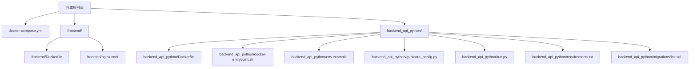
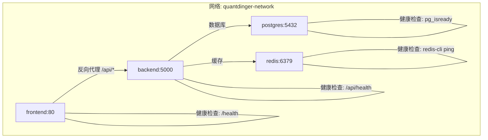
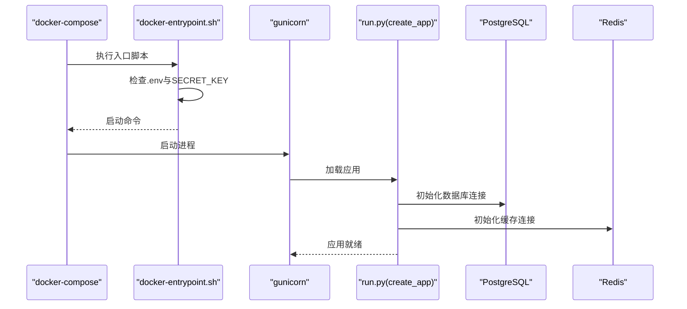
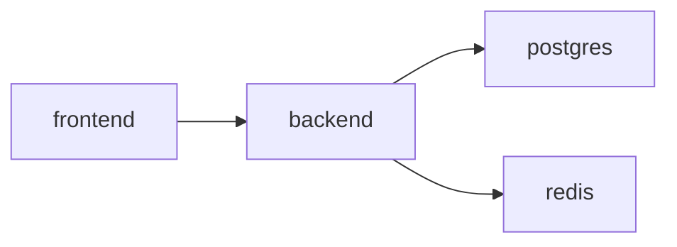

# Docker部署配置

<cite>
**本文引用的文件**
- [docker-compose.yml](file://docker-compose.yml)
- [backend_api_python/Dockerfile](file://backend_api_python/Dockerfile)
- [frontend/Dockerfile](file://frontend/Dockerfile)
- [frontend/nginx.conf](file://frontend/nginx.conf)
- [backend_api_python/docker-entrypoint.sh](file://backend_api_python/docker-entrypoint.sh)
- [backend_api_python/env.example](file://backend_api_python/env.example)
- [backend_api_python/gunicorn_config.py](file://backend_api_python/gunicorn_config.py)
- [backend_api_python/run.py](file://backend_api_python/run.py)
- [backend_api_python/requirements.txt](file://backend_api_python/requirements.txt)
- [backend_api_python/.dockerignore](file://backend_api_python/.dockerignore)
- [backend_api_python/migrations/init.sql](file://backend_api_python/migrations/init.sql)
</cite>

## 目录
1. [简介](#简介)
2. [项目结构](#项目结构)
3. [核心组件](#核心组件)
4. [架构总览](#架构总览)
5. [详细组件分析](#详细组件分析)
6. [依赖关系分析](#依赖关系分析)
7. [性能考量](#性能考量)
8. [故障排查指南](#故障排查指南)
9. [结论](#结论)
10. [附录](#附录)

## 简介
本指南面向希望使用Docker一键部署QuantDinger（后端API、前端Nginx、PostgreSQL数据库、Redis缓存）的用户。文档覆盖以下主题：
- docker-compose.yml服务编排与网络配置
- 容器构建流程（Dockerfile、镜像来源、依赖安装）
- 环境变量与安全密钥管理
- 健康检查与端口映射策略
- 本地开发与生产环境差异
- 常见部署问题排查

## 项目结构
仓库采用“根目录编排 + 子目录应用”的组织方式：
- 根目录提供docker-compose.yml统一编排
- 后端API位于backend_api_python，包含Dockerfile、入口脚本、Gunicorn配置、环境示例与初始化SQL
- 前端位于frontend，包含Dockerfile与Nginx配置
- 数据库初始化脚本位于backend_api_python/migrations/init.sql

**图示来源**
- [docker-compose.yml:25-167](file://docker-compose.yml#L25-L167)
- [frontend/Dockerfile:1-19](file://frontend/Dockerfile#L1-L19)
- [frontend/nginx.conf:1-56](file://frontend/nginx.conf#L1-L56)
- [backend_api_python/Dockerfile:1-62](file://backend_api_python/Dockerfile#L1-L62)
- [backend_api_python/docker-entrypoint.sh:1-49](file://backend_api_python/docker-entrypoint.sh#L1-L49)
- [backend_api_python/env.example:1-288](file://backend_api_python/env.example#L1-L288)
- [backend_api_python/gunicorn_config.py:1-36](file://backend_api_python/gunicorn_config.py#L1-L36)
- [backend_api_python/run.py:1-134](file://backend_api_python/run.py#L1-L134)
- [backend_api_python/requirements.txt:1-37](file://backend_api_python/requirements.txt#L1-L37)
- [backend_api_python/migrations/init.sql:1-1026](file://backend_api_python/migrations/init.sql#L1-L1026)

**章节来源**
- [docker-compose.yml:1-167](file://docker-compose.yml#L1-L167)
- [frontend/Dockerfile:1-19](file://frontend/Dockerfile#L1-L19)
- [backend_api_python/Dockerfile:1-62](file://backend_api_python/Dockerfile#L1-L62)

## 核心组件
- PostgreSQL数据库：负责持久化用户、交易、回测、指标等数据；首次启动自动执行初始化SQL。
- Redis缓存：可选的键值缓存层，用于提升并发场景下的响应速度。
- 后端API（Python/Flask + Gunicorn）：提供REST接口与WebSocket支持，连接数据库与缓存。
- 前端Nginx：静态资源服务，代理/api/请求至后端，支持SPA路由回退。

**章节来源**
- [docker-compose.yml:29-154](file://docker-compose.yml#L29-L154)
- [backend_api_python/migrations/init.sql:1-1026](file://backend_api_python/migrations/init.sql#L1-L1026)
- [frontend/nginx.conf:26-47](file://frontend/nginx.conf#L26-L47)

## 架构总览
下图展示容器间的依赖与通信路径，以及默认端口映射与健康检查策略。

**图示来源**
- [docker-compose.yml:29-154](file://docker-compose.yml#L29-L154)
- [frontend/nginx.conf:49-54](file://frontend/nginx.conf#L49-L54)

## 详细组件分析

### PostgreSQL数据库服务
- 镜像与命令
  - 使用官方postgres:16-alpine镜像，启动时通过命令参数设置最大连接数与共享缓冲。
- 环境变量
  - 数据库名、用户名、密码、时区等通过环境变量注入。
- 卷与初始化
  - 数据卷持久化；首次启动挂载初始化SQL脚本，自动创建表结构与种子数据。
- 端口与网络
  - 默认仅绑定到127.0.0.1:5432；加入自定义桥接网络。
- 健康检查
  - 使用pg_isready检测数据库可用性。

**章节来源**
- [docker-compose.yml:29-58](file://docker-compose.yml#L29-L58)
- [backend_api_python/migrations/init.sql:1-1026](file://backend_api_python/migrations/init.sql#L1-L1026)

### Redis缓存服务
- 镜像与命令
  - 使用官方redis:7-alpine镜像，限制内存与淘汰策略以适配小内存容器。
- 端口与网络
  - 默认仅绑定到127.0.0.1:6379；加入自定义桥接网络。
- 健康检查
  - 使用redis-cli ping检测。

**章节来源**
- [docker-compose.yml:63-76](file://docker-compose.yml#L63-L76)

### 后端API服务（Python/Flask + Gunicorn）
- 构建上下文与Dockerfile
  - 基于python:3.12-slim-bookworm，国内镜像优先安装apt与pip依赖，失败则回退官方源。
  - 暴露5000端口，设置PYTHON_API_HOST与PYTHON_API_PORT环境变量。
- 入口脚本与安全密钥
  - 启动前检查.env是否存在与SECRET_KEY配置；若缺失或为默认值则自动生成并写回。
- 环境变量与连接池
  - 通过环境变量配置数据库URL、Redis主机与端口、缓存开关、数据库连接池参数、并发工作线程等。
- 健康检查
  - 访问后端健康端点进行探测。
- 日志与数据卷
  - 挂载logs与data卷，便于持久化与调试。

**图示来源**
- [backend_api_python/docker-entrypoint.sh:1-49](file://backend_api_python/docker-entrypoint.sh#L1-L49)
- [backend_api_python/run.py:96-134](file://backend_api_python/run.py#L96-L134)
- [backend_api_python/gunicorn_config.py:10-36](file://backend_api_python/gunicorn_config.py#L10-L36)
- [docker-compose.yml:81-131](file://docker-compose.yml#L81-L131)

**章节来源**
- [backend_api_python/Dockerfile:1-62](file://backend_api_python/Dockerfile#L1-L62)
- [backend_api_python/docker-entrypoint.sh:1-49](file://backend_api_python/docker-entrypoint.sh#L1-L49)
- [backend_api_python/env.example:1-288](file://backend_api_python/env.example#L1-L288)
- [backend_api_python/gunicorn_config.py:1-36](file://backend_api_python/gunicorn_config.py#L1-L36)
- [backend_api_python/run.py:1-134](file://backend_api_python/run.py#L1-L134)
- [docker-compose.yml:81-131](file://docker-compose.yml#L81-L131)

### 前端Nginx服务
- 构建上下文与Dockerfile
  - 基于nginx:1.25-alpine，复制预构建的dist与配置文件。
- Nginx配置要点
  - 安全头、Gzip压缩、静态资源强缓存、/api/代理到backend:5000、SPA路由回退至index.html、/health健康检查。
- 端口与网络
  - 映射宿主8888端口到容器80；加入自定义桥接网络。
- 健康检查
  - 访问/health返回OK。

**章节来源**
- [frontend/Dockerfile:1-19](file://frontend/Dockerfile#L1-L19)
- [frontend/nginx.conf:1-56](file://frontend/nginx.conf#L1-L56)
- [docker-compose.yml:136-154](file://docker-compose.yml#L136-L154)

## 依赖关系分析
- 组件耦合
  - backend依赖postgres与redis；frontend依赖backend。
  - 三者均加入同一bridge网络，实现容器间DNS解析。
- 外部依赖
  - 后端通过requirements.txt引入Flask、Gunicorn、psycopg2、redis等。
  - Dockerfile中对apt与pip镜像源做了国内优化与回退策略。

**图示来源**
- [docker-compose.yml:25-167](file://docker-compose.yml#L25-L167)

**章节来源**
- [backend_api_python/requirements.txt:1-37](file://backend_api_python/requirements.txt#L1-L37)
- [backend_api_python/Dockerfile:8-44](file://backend_api_python/Dockerfile#L8-L44)
- [docker-compose.yml:25-167](file://docker-compose.yml#L25-L167)

## 性能考量
- 数据库连接池
  - 通过环境变量调优DB_POOL_MIN、DB_POOL_MAX、DB_POOL_ACQUIRE_TIMEOUT与DB_POOL_HEALTH_CHECK，避免“连接池耗尽”错误。
- 并发模型
  - Gunicorn采用gthread模式，默认1个worker与4个线程；可根据CPU核数提高GUNICORN_WORKERS，同时保持线程数稳定。
- 缓存启用
  - 在多worker场景建议启用Redis缓存（CACHE_ENABLED=true），降低数据库压力。
- Nginx超时
  - 针对长回测任务，已设置较长的proxy_read_timeout与proxy_send_timeout，确保大文件上传与长时间响应稳定。

**章节来源**
- [docker-compose.yml:110-124](file://docker-compose.yml#L110-L124)
- [backend_api_python/gunicorn_config.py:10-36](file://backend_api_python/gunicorn_config.py#L10-L36)
- [frontend/nginx.conf:37-41](file://frontend/nginx.conf#L37-L41)

## 故障排查指南
- 启动失败：SECRET_KEY未正确设置
  - 现象：容器启动即退出或报安全警告。
  - 处理：在backend_api_python/.env中设置安全的SECRET_KEY，或允许入口脚本自动生成。
  - 参考：入口脚本对.env与SECRET_KEY的检查逻辑。
- 数据库无法连接
  - 现象：后端健康检查失败。
  - 处理：确认DATABASE_URL、postgres容器健康状态、网络连通性与初始化SQL执行情况。
- 连接池耗尽
  - 现象：出现“connection pool exhausted”错误。
  - 处理：提高DB_POOL_MAX并确保PostgreSQL的max_connections高于该值。
- Redis不可用
  - 现象：缓存相关功能异常。
  - 处理：确认redis容器健康、网络可达与内存限制合理。
- 前端空白或404
  - 现象：访问8888端口白屏或路由跳转失败。
  - 处理：确认Nginx代理到backend:5000、/api/代理超时设置、SPA路由回退配置。
- 端口冲突
  - 现象：端口映射失败。
  - 处理：修改docker-compose.yml中的宿主端口映射或释放占用端口。

**章节来源**
- [backend_api_python/docker-entrypoint.sh:11-49](file://backend_api_python/docker-entrypoint.sh#L11-L49)
- [docker-compose.yml:54-58](file://docker-compose.yml#L54-L58)
- [frontend/nginx.conf:49-54](file://frontend/nginx.conf#L49-L54)

## 结论
通过docker-compose.yml统一编排，结合各组件的Dockerfile与配置文件，可快速完成本地开发与生产环境的一键部署。建议在生产环境中：
- 固定并轮换SECRET_KEY
- 调整数据库连接池与Gunicorn并发参数
- 启用Redis缓存并监控资源使用
- 使用非本地绑定端口映射并配合反向代理与证书

## 附录

### 环境变量与默认值速览
- 数据库
  - POSTGRES_DB、POSTGRES_USER、POSTGRES_PASSWORD、TZ、PG_MAX_CONNECTIONS、PG_SHARED_BUFFERS
- Redis
  - 无特殊环境变量，使用默认配置
- 后端
  - PYTHON_API_HOST、PYTHON_API_PORT、DATABASE_URL、DB_TYPE、REDIS_HOST、REDIS_PORT、CACHE_ENABLED、DB_POOL_MIN、DB_POOL_MAX、DB_POOL_ACQUIRE_TIMEOUT、DB_POOL_HEALTH_CHECK、MARKET_EXECUTOR_WORKERS、PORTFOLIO_EXECUTOR_WORKERS、GUNICORN_WORKERS、GUNICORN_THREADS、ALLOW_LOCAL_DESKTOP_BROKERS
- 前端
  - 无特殊环境变量，使用Nginx默认监听80

**章节来源**
- [docker-compose.yml:33-124](file://docker-compose.yml#L33-L124)
- [backend_api_python/env.example:1-288](file://backend_api_python/env.example#L1-L288)

### 端口映射与健康检查
- 端口
  - 数据库：127.0.0.1:5432:5432
  - Redis：127.0.0.1:6379:6379
  - 后端：127.0.0.1:5000:5000
  - 前端：宿主8888:80
- 健康检查
  - 数据库：pg_isready
  - Redis：redis-cli ping
  - 后端：curl /api/health
  - 前端：curl /health

**章节来源**
- [docker-compose.yml:54-154](file://docker-compose.yml#L54-L154)
- [frontend/nginx.conf:49-54](file://frontend/nginx.conf#L49-L54)