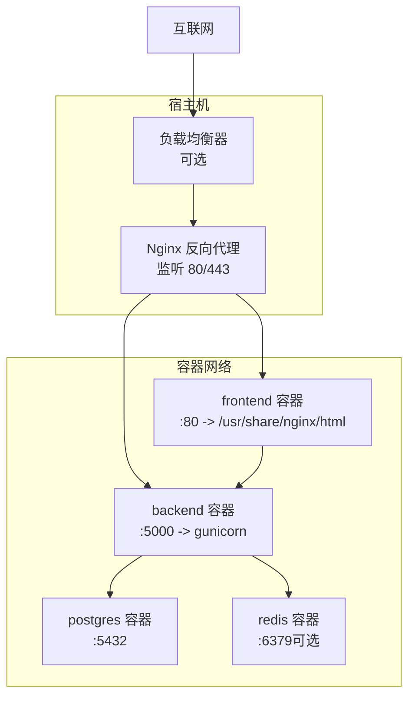
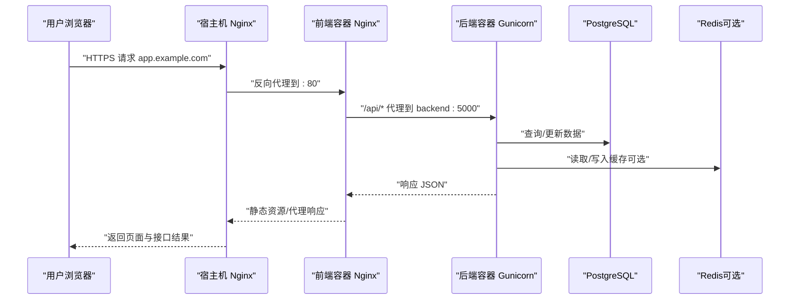
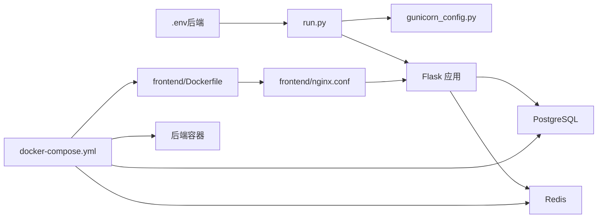

# 生产环境配置

<cite>
**本文引用的文件**
- [backend_api_python/env.example](file://backend_api_python/env.example)
- [backend_api_python/Dockerfile](file://backend_api_python/Dockerfile)
- [docker-compose.yml](file://docker-compose.yml)
- [docs/CLOUD_DEPLOYMENT_EN.md](file://docs/CLOUD_DEPLOYMENT_EN.md)
- [backend_api_python/gunicorn_config.py](file://backend_api_python/gunicorn_config.py)
- [scripts/generate-secret-key.sh](file://scripts/generate-secret-key.sh)
- [scripts/generate-secret-key.ps1](file://scripts/generate-secret-key.ps1)
- [backend_api_python/run.py](file://backend_api_python/run.py)
- [frontend/Dockerfile](file://frontend/Dockerfile)
- [frontend/nginx.conf](file://frontend/nginx.conf)
- [backend_api_python/app/config/settings.py](file://backend_api_python/app/config/settings.py)
- [backend_api_python/app/config/database.py](file://backend_api_python/app/config/database.py)
- [backend_api_python/app/config/api_keys.py](file://backend_api_python/app/config/api_keys.py)
- [SECURITY.md](file://SECURITY.md)
</cite>

## 目录
1. [简介](#简介)
2. [项目结构](#项目结构)
3. [核心组件](#核心组件)
4. [架构总览](#架构总览)
5. [详细组件分析](#详细组件分析)
6. [依赖关系分析](#依赖关系分析)
7. [性能考量](#性能考量)
8. [故障排查指南](#故障排查指南)
9. [结论](#结论)
10. [附录](#附录)

## 简介
本指南面向生产环境部署与运维，覆盖云平台部署（AWS/Azure/Google Cloud）、域名与SSL证书、反向代理、环境变量安全配置（含SECRET_KEY生成、数据库与第三方服务）、负载均衡与高可用、备份与监控告警、以及安全加固要点。内容基于仓库中的Docker Compose、Nginx配置、Gunicorn并发模型、环境变量模板与部署文档进行系统化整理。

## 项目结构
- 后端采用Flask应用，通过Gunicorn运行；容器镜像构建于Python 3.12 slim基础镜像，内置CA证书与编译工具链，安装依赖后复制源码并以入口脚本启动。
- 前端为静态站点，使用Nginx提供服务，容器内直接从预构建目录提供资源，并对/api前缀进行反向代理到后端。
- 数据层使用PostgreSQL与可选Redis缓存，通过Compose统一编排，容器间通过自定义桥接网络通信。
- 部署推荐模式：单域+宿主机Nginx反代，仅对外暴露80/443，后端与数据库不直接暴露公网。

图表来源
- [docker-compose.yml:25-167](file://docker-compose.yml#L25-L167)
- [frontend/Dockerfile:1-19](file://frontend/Dockerfile#L1-L19)
- [frontend/nginx.conf:1-56](file://frontend/nginx.conf#L1-L56)
- [backend_api_python/Dockerfile:1-62](file://backend_api_python/Dockerfile#L1-L62)

章节来源
- [docker-compose.yml:1-167](file://docker-compose.yml#L1-L167)
- [docs/CLOUD_DEPLOYMENT_EN.md:1-451](file://docs/CLOUD_DEPLOYMENT_EN.md#L1-L451)

## 核心组件
- 应用入口与环境加载
  - 应用入口脚本负责加载.env文件、应用代理环境变量、创建Flask应用实例，并在生产模式下对默认密钥进行安全处理。
- Web服务器与并发模型
  - 使用Gunicorn作为WSGI服务器，默认采用单进程多线程（gthread）模型，可通过环境变量调整工作进程数与线程数。
- 反向代理与前端
  - 前端容器内置Nginx，提供静态资源服务与/api前缀代理；宿主机可再叠加Nginx实现TLS终止与反代。
- 数据与缓存
  - PostgreSQL作为主数据存储；Redis作为可选缓存层，支持连接池与TTL配置。
- 环境变量与密钥
  - 提供完整的环境变量模板，涵盖认证、数据库、AI/LLM、邮件、代理、计费、安全阈值等；包含生成安全SECRET_KEY的脚本。

章节来源
- [backend_api_python/run.py:1-134](file://backend_api_python/run.py#L1-L134)
- [backend_api_python/gunicorn_config.py:1-36](file://backend_api_python/gunicorn_config.py#L1-L36)
- [frontend/nginx.conf:1-56](file://frontend/nginx.conf#L1-L56)
- [backend_api_python/app/config/database.py:1-90](file://backend_api_python/app/config/database.py#L1-L90)
- [backend_api_python/env.example:1-288](file://backend_api_python/env.example#L1-L288)

## 架构总览
生产推荐拓扑：单域名，宿主机Nginx负责TLS终止与反向代理，后端与数据库仅内网可达；前端容器内也提供/api代理，便于同源访问与简化部署。

图表来源
- [docs/CLOUD_DEPLOYMENT_EN.md:221-239](file://docs/CLOUD_DEPLOYMENT_EN.md#L221-L239)
- [frontend/nginx.conf:26-42](file://frontend/nginx.conf#L26-L42)
- [docker-compose.yml:134-154](file://docker-compose.yml#L134-L154)

## 详细组件分析

### 1) 云平台部署（AWS/Azure/Google Cloud）
- 推荐架构
  - 单域名 + 宿主机Nginx反向代理，仅暴露80/443；后端与数据库不直接暴露公网。
- 基础设施准备
  - 操作系统：Ubuntu 22.04/Debian 12；开放端口：22、80、443；准备域名A记录指向服务器公网IP。
- 安装与克隆
  - 安装Docker与Docker Compose；拉取项目代码。
- 配置文件
  - 复制并编辑后端.env与根目录.env；生成并设置安全SECRET_KEY；按需启用AI/LLM、邮件、支付等第三方服务。
- 启动与验证
  - 使用Compose启动；查看健康检查状态与日志；确认Nginx与Let’s Encrypt证书生效。

章节来源
- [docs/CLOUD_DEPLOYMENT_EN.md:21-451](file://docs/CLOUD_DEPLOYMENT_EN.md#L21-L451)
- [backend_api_python/env.example:1-288](file://backend_api_python/env.example#L1-L288)
- [docker-compose.yml:1-167](file://docker-compose.yml#L1-L167)

### 2) 域名与SSL证书
- DNS配置
  - 为子域（如app.example.com）添加A记录指向服务器公网IP；等待解析生效。
- 宿主机Nginx
  - 配置站点文件，监听80；将/api前缀代理至127.0.0.1:8888（前端容器）。
- Let’s Encrypt
  - 使用Certbot申请证书；测试续期；最终通过HTTPS访问。

章节来源
- [docs/CLOUD_DEPLOYMENT_EN.md:30-220](file://docs/CLOUD_DEPLOYMENT_EN.md#L30-L220)

### 3) 反向代理配置
- 前端容器内Nginx
  - 提供静态资源缓存、安全头、gzip压缩；对/api前缀进行反代，设置长超时以适配长时间回测任务。
- 宿主机Nginx（可选）
  - 在已有前端反代基础上，进一步实现TLS终止与统一入口；可按需拆分为app.example.com与api.example.com双域。

章节来源
- [frontend/nginx.conf:1-56](file://frontend/nginx.conf#L1-L56)
- [docs/CLOUD_DEPLOYMENT_EN.md:241-283](file://docs/CLOUD_DEPLOYMENT_EN.md#L241-L283)

### 4) 环境变量与安全配置
- SECRET_KEY生成
  - 提供跨平台脚本生成安全密钥并写入后端.env；应用启动时若检测到默认密钥会自动生成临时密钥并提示持久化。
- 数据库连接
  - DATABASE_URL、连接池参数（最小/最大/获取超时/健康检查）；确保PostgreSQL最大连接数高于连接池上限。
- 第三方服务
  - 支持多家LLM提供商与搜索服务；可配置代理与证书校验；支持轮换密钥。
- 安全阈值
  - 登录尝试限制、验证码策略、请求日志与速率限制等。

章节来源
- [scripts/generate-secret-key.sh:1-34](file://scripts/generate-secret-key.sh#L1-L34)
- [scripts/generate-secret-key.ps1:1-32](file://scripts/generate-secret-key.ps1#L1-L32)
- [backend_api_python/run.py:109-120](file://backend_api_python/run.py#L109-L120)
- [backend_api_python/env.example:1-288](file://backend_api_python/env.example#L1-L288)
- [backend_api_python/app/config/api_keys.py:1-184](file://backend_api_python/app/config/api_keys.py#L1-L184)
- [backend_api_python/app/config/database.py:1-90](file://backend_api_python/app/config/database.py#L1-L90)

### 5) 负载均衡、自动扩缩容与高可用
- 负载均衡
  - 在多实例场景中，建议在容器前放置硬件/软件负载均衡器，将流量分发至多个后端实例。
- 自动扩缩容
  - 可结合容器编排平台的HPA策略，依据CPU/内存或自定义指标进行弹性伸缩；注意数据库连接池上限与后端并发配置。
- 高可用
  - 数据库使用独立高可用集群；前端与后端均支持多副本；Redis可启用哨兵或集群模式（视部署形态而定）。

章节来源
- [docs/CLOUD_DEPLOYMENT_EN.md:21-451](file://docs/CLOUD_DEPLOYMENT_EN.md#L21-L451)
- [docker-compose.yml:29-58](file://docker-compose.yml#L29-L58)

### 6) 备份策略
- 数据库
  - 定期执行逻辑备份（如pg_dump）与物理备份；保留多版本快照，验证恢复流程。
- 配置与日志
  - 将.env与日志目录纳入备份范围；区分敏感配置与公开日志。
- 缓存
  - Redis持久化策略（RDB/AOF）与定期快照；必要时进行主从复制。

章节来源
- [docker-compose.yml:47-49](file://docker-compose.yml#L47-L49)
- [backend_api_python/env.example:1-288](file://backend_api_python/env.example#L1-L288)

### 7) 监控告警
- 健康检查
  - 利用Compose内置健康检查与Nginx健康端点；结合外部探针持续探测。
- 指标采集
  - 收集容器CPU/内存、网络、磁盘、数据库连接数与慢查询；后端接入日志与追踪系统。
- 告警规则
  - 服务不可用、响应时间过长、错误率上升、数据库连接池耗尽、磁盘空间不足等。

章节来源
- [docker-compose.yml:54-58](file://docker-compose.yml#L54-L58)
- [frontend/nginx.conf:49-54](file://frontend/nginx.conf#L49-L54)

### 8) 安全加固
- 密钥与配置
  - 使用脚本生成并持久化SECRET_KEY；避免将密钥写入镜像或共享配置；限制.env文件权限。
- 网络隔离
  - 数据库与后端仅绑定本地回环地址；通过反向代理暴露80/443。
- 传输安全
  - 强制HTTPS；正确配置TLS版本与密码套件；禁用弱加密算法。
- 访问控制
  - 启用速率限制、登录失败锁定、验证码与IP白名单；严格管理管理员账户。
- 供应链与镜像
  - 使用可信镜像源；启用镜像签名；定期扫描漏洞并更新基础镜像。

章节来源
- [SECURITY.md:1-110](file://SECURITY.md#L1-L110)
- [docs/CLOUD_DEPLOYMENT_EN.md:421-450](file://docs/CLOUD_DEPLOYMENT_EN.md#L421-L450)
- [backend_api_python/env.example:1-288](file://backend_api_python/env.example#L1-L288)

## 依赖关系分析
- 组件耦合
  - 后端依赖数据库与可选缓存；前端依赖后端API；反向代理贯穿前后端。
- 外部依赖
  - Docker镜像、PostgreSQL、Redis、第三方LLM/搜索服务；需考虑网络连通性与代理配置。
- 并发与资源
  - Gunicorn线程模型与数据库连接池需协同调优；避免连接池耗尽与上下文切换开销过大。

图表来源
- [backend_api_python/run.py:1-134](file://backend_api_python/run.py#L1-L134)
- [backend_api_python/gunicorn_config.py:1-36](file://backend_api_python/gunicorn_config.py#L1-L36)
- [frontend/Dockerfile:1-19](file://frontend/Dockerfile#L1-L19)
- [frontend/nginx.conf:1-56](file://frontend/nginx.conf#L1-L56)
- [docker-compose.yml:25-167](file://docker-compose.yml#L25-L167)

章节来源
- [backend_api_python/run.py:1-134](file://backend_api_python/run.py#L1-L134)
- [docker-compose.yml:1-167](file://docker-compose.yml#L1-L167)

## 性能考量
- 并发模型
  - 默认gthread模型适合I/O密集型；可根据CPU核数提升GUNICORN_WORKERS并适当增加线程数。
- 数据库连接池
  - DB_POOL_MAX应低于PostgreSQL max_connections；合理设置获取超时与健康检查。
- 缓存策略
  - 启用Redis缓存并设置合理的TTL；对高频K线与分析结果进行缓存。
- 反向代理
  - 为长任务设置较长超时；限制上传大小；启用gzip与静态资源缓存。

章节来源
- [backend_api_python/gunicorn_config.py:1-36](file://backend_api_python/gunicorn_config.py#L1-L36)
- [backend_api_python/app/config/database.py:1-90](file://backend_api_python/app/config/database.py#L1-L90)
- [frontend/nginx.conf:12-42](file://frontend/nginx.conf#L12-L42)
- [docker-compose.yml:110-122](file://docker-compose.yml#L110-L122)

## 故障排查指南
- 镜像拉取失败
  - 更换镜像源前缀后重建容器。
- 容器内找不到入口脚本
  - 清理缓存重建后端镜像。
- 前端无法解析后端上游
  - 检查后端健康状态与日志，先修复后端再重启前端。
- 前端构建缺失dist
  - 检查.dockerignore是否排除了frontend/dist。
- 设置保存报只读文件系统
  - 确保.env挂载为可写；避免只读挂载。
- 代理在容器内不可达
  - 使用host.docker.internal替代127.0.0.1。
- Nginx 502/504
  - 检查容器健康状态、后端健康端点与Nginx配置语法。
- 数据库不应外露
  - 确保仅映射本地回环地址；仅对外暴露80/443。

章节来源
- [docs/CLOUD_DEPLOYMENT_EN.md:320-450](file://docs/CLOUD_DEPLOYMENT_EN.md#L320-L450)

## 结论
通过单域+宿主机Nginx的生产部署模式，配合完善的环境变量安全配置、数据库与缓存优化、以及负载均衡与高可用设计，可在AWS/Azure/Google Cloud等主流平台上稳定运行本项目。务必重视密钥管理、网络隔离与TLS安全，建立自动化备份与监控告警体系，持续加固供应链与镜像安全。

## 附录

### A. 关键配置清单（摘要）
- 认证与安全
  - SECRET_KEY、ADMIN_USER/PASSWORD、OAuth允许重定向、CSRF状态TTL、验证码与登录尝试阈值。
- 数据库与缓存
  - DATABASE_URL、DB_POOL_MIN/MAX/ACQUIRE_TIMEOUT/HEALTH_CHECK、Redis连接参数与TTL。
- 并发与性能
  - GUNICORN_WORKERS、GUNICORN_THREADS、市场/组合执行器工作线程数。
- 第三方服务
  - LLM提供商与模型、搜索服务、邮件SMTP、短信Twilio、代理与证书校验。
- 运维操作
  - 健康检查端点、日志级别与文件滚动、请求日志开关。

章节来源
- [backend_api_python/env.example:1-288](file://backend_api_python/env.example#L1-L288)
- [backend_api_python/app/config/settings.py:1-99](file://backend_api_python/app/config/settings.py#L1-L99)
- [backend_api_python/app/config/database.py:1-90](file://backend_api_python/app/config/database.py#L1-L90)
- [backend_api_python/app/config/api_keys.py:1-184](file://backend_api_python/app/config/api_keys.py#L1-L184)