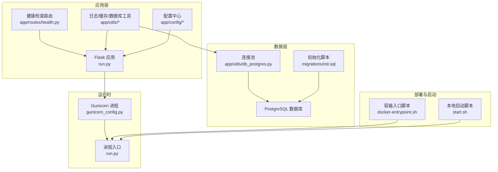
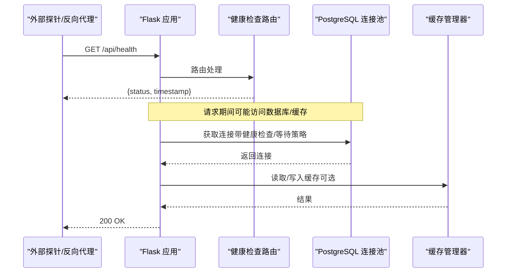
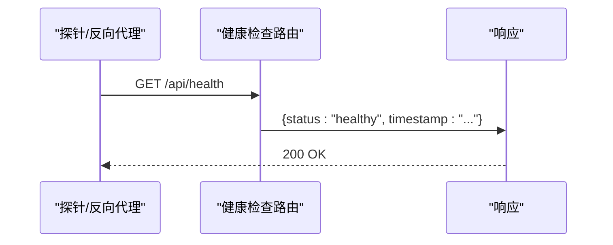
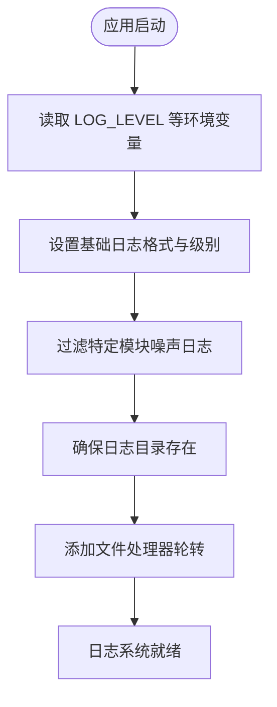
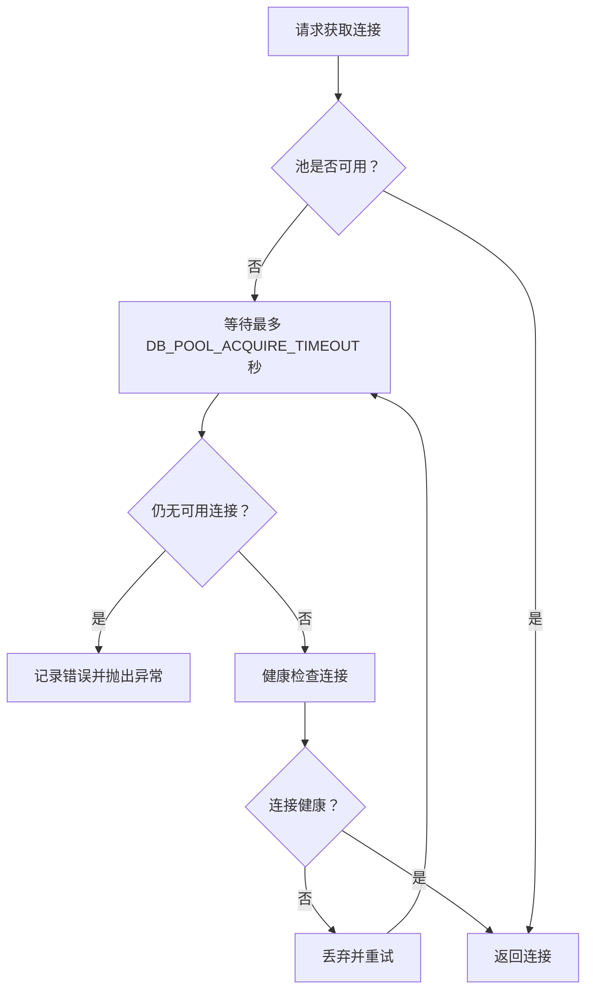
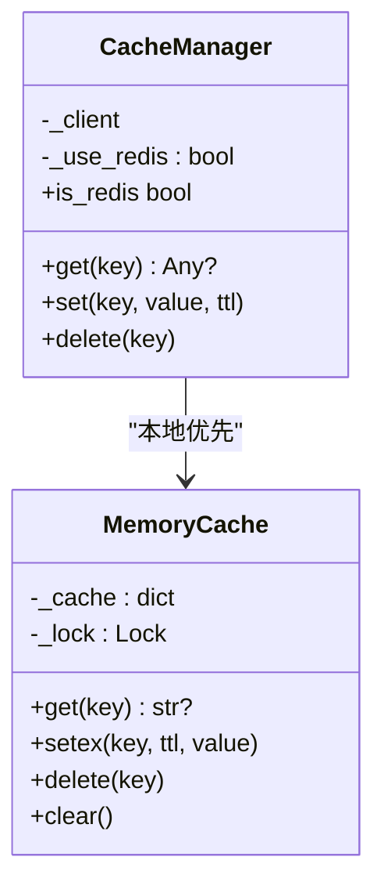
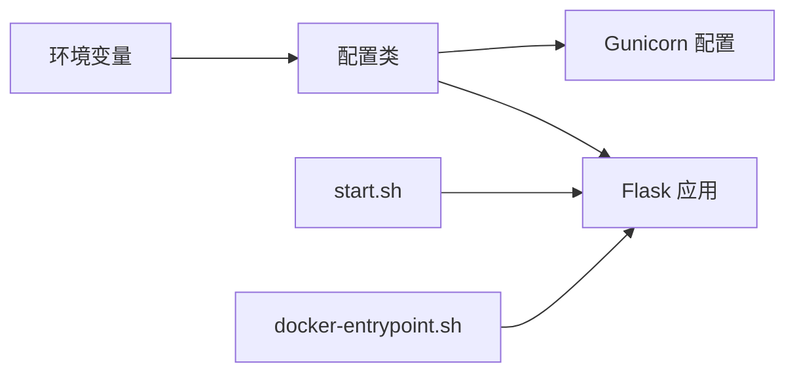
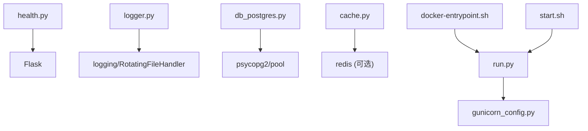

# 监控运维管理

<cite>
**本文引用的文件**   
- [backend_api_python/app/routes/health.py](file://backend_api_python/app/routes/health.py)
- [backend_api_python/app/utils/logger.py](file://backend_api_python/app/utils/logger.py)
- [backend_api_python/app/config/settings.py](file://backend_api_python/app/config/settings.py)
- [backend_api_python/app/config/database.py](file://backend_api_python/app/config/database.py)
- [backend_api_python/app/utils/db.py](file://backend_api_python/app/utils/db.py)
- [backend_api_python/app/utils/db_postgres.py](file://backend_api_python/app/utils/db_postgres.py)
- [backend_api_python/gunicorn_config.py](file://backend_api_python/gunicorn_config.py)
- [backend_api_python/run.py](file://backend_api_python/run.py)
- [backend_api_python/start.sh](file://backend_api_python/start.sh)
- [backend_api_python/docker-entrypoint.sh](file://backend_api_python/docker-entrypoint.sh)
- [backend_api_python/migrations/init.sql](file://backend_api_python/migrations/init.sql)
- [backend_api_python/app/utils/cache.py](file://backend_api_python/app/utils/cache.py)
- [backend_api_python/tests/test_health.py](file://backend_api_python/tests/test_health.py)
- [backend_api_python/scripts/run_calibration.py](file://backend_api_python/scripts/run_calibration.py)
</cite>

## 目录
1. [简介](#简介)
2. [项目结构](#项目结构)
3. [核心组件](#核心组件)
4. [架构总览](#架构总览)
5. [详细组件分析](#详细组件分析)
6. [依赖分析](#依赖分析)
7. [性能考虑](#性能考虑)
8. [故障排除指南](#故障排除指南)
9. [结论](#结论)
10. [附录](#附录)

## 简介
本指南面向运维与开发团队，系统性阐述本项目的监控运维实践，覆盖应用健康检查、数据库连接与池化、日志管理、性能指标采集、故障排除流程以及自动化脚本与定期维护任务。文档基于仓库中现有的健康检查路由、日志工具、数据库连接池、Gunicorn 配置、启动脚本与容器入口脚本等实现进行归纳总结，并提供可操作的运维建议与可视化图示。

## 项目结构
后端采用 Python + Flask 应用，通过 Gunicorn 提供生产级服务；数据库为 PostgreSQL，使用连接池与健康检查；日志系统支持本地文件轮转与按模块过滤；缓存支持本地内存与 Redis 双态；容器入口脚本负责密钥校验与环境准备；迁移脚本初始化数据库结构。

**图示来源**
- [backend_api_python/run.py:96-101](file://backend_api_python/run.py#L96-L101)
- [backend_api_python/gunicorn_config.py:10-36](file://backend_api_python/gunicorn_config.py#L10-L36)
- [backend_api_python/app/routes/health.py:10-33](file://backend_api_python/app/routes/health.py#L10-L33)
- [backend_api_python/app/utils/db_postgres.py:107-161](file://backend_api_python/app/utils/db_postgres.py#L107-L161)
- [backend_api_python/migrations/init.sql:1-20](file://backend_api_python/migrations/init.sql#L1-L20)
- [backend_api_python/docker-entrypoint.sh:1-49](file://backend_api_python/docker-entrypoint.sh#L1-L49)
- [backend_api_python/start.sh:1-27](file://backend_api_python/start.sh#L1-L27)

**章节来源**
- [backend_api_python/run.py:96-101](file://backend_api_python/run.py#L96-L101)
- [backend_api_python/gunicorn_config.py:10-36](file://backend_api_python/gunicorn_config.py#L10-L36)
- [backend_api_python/app/routes/health.py:10-33](file://backend_api_python/app/routes/health.py#L10-L33)
- [backend_api_python/app/utils/db_postgres.py:107-161](file://backend_api_python/app/utils/db_postgres.py#L107-L161)
- [backend_api_python/migrations/init.sql:1-20](file://backend_api_python/migrations/init.sql#L1-L20)
- [backend_api_python/docker-entrypoint.sh:1-49](file://backend_api_python/docker-entrypoint.sh#L1-L49)
- [backend_api_python/start.sh:1-27](file://backend_api_python/start.sh#L1-L27)

## 核心组件
- 健康检查路由：提供应用基础信息、健康状态与兼容路径，便于容器探针与反向代理使用。
- 日志系统：统一配置日志级别、格式与文件轮转，按模块过滤噪声日志，支持本地日志目录与文件处理器。
- 数据库连接与池化：PostgreSQL 连接池，支持最小/最大连接数、获取超时、健康检查开关与轻量健康探测。
- 缓存：本地内存缓存优先，可选启用 Redis，自动降级与日志提示。
- 配置中心：集中管理主机、端口、调试模式、日志、速率限制、功能开关等。
- 运行与部署：Gunicorn 生产配置、本地启动脚本、容器入口脚本负责密钥与环境校验。

**章节来源**
- [backend_api_python/app/routes/health.py:10-33](file://backend_api_python/app/routes/health.py#L10-L33)
- [backend_api_python/app/utils/logger.py:9-63](file://backend_api_python/app/utils/logger.py#L9-L63)
- [backend_api_python/app/config/settings.py:10-91](file://backend_api_python/app/config/settings.py#L10-L91)
- [backend_api_python/app/utils/db_postgres.py:53-56](file://backend_api_python/app/utils/db_postgres.py#L53-L56)
- [backend_api_python/app/utils/cache.py:49-99](file://backend_api_python/app/utils/cache.py#L49-L99)
- [backend_api_python/gunicorn_config.py:12-36](file://backend_api_python/gunicorn_config.py#L12-L36)

## 架构总览
下图展示健康检查、日志、数据库与缓存的关键交互路径，以及生产运行时的进程与配置关系。

**图示来源**
- [backend_api_python/app/routes/health.py:21-33](file://backend_api_python/app/routes/health.py#L21-L33)
- [backend_api_python/app/utils/db_postgres.py:402-438](file://backend_api_python/app/utils/db_postgres.py#L402-L438)
- [backend_api_python/app/utils/cache.py:100-124](file://backend_api_python/app/utils/cache.py#L100-L124)

## 详细组件分析

### 健康检查机制
- 路由提供应用首页、健康检查与兼容路径，返回状态与时间戳，便于容器健康探针与反向代理使用。
- 测试用例确保 /api/health 返回 200 且响应体非空。

**图示来源**
- [backend_api_python/app/routes/health.py:21-33](file://backend_api_python/app/routes/health.py#L21-L33)
- [backend_api_python/tests/test_health.py:4-10](file://backend_api_python/tests/test_health.py#L4-L10)

**章节来源**
- [backend_api_python/app/routes/health.py:10-33](file://backend_api_python/app/routes/health.py#L10-L33)
- [backend_api_python/tests/test_health.py:4-10](file://backend_api_python/tests/test_health.py#L4-L10)

### 日志管理系统
- 全局日志配置：从环境变量读取日志级别，设置格式；对特定子系统（如 WSGI、特定路由）进行噪声过滤。
- 文件轮转：本地日志目录与文件处理器，单文件最大大小与备份数量可配置。
- 日志获取：提供按名称获取日志记录器的便捷方法。

**图示来源**
- [backend_api_python/app/utils/logger.py:9-48](file://backend_api_python/app/utils/logger.py#L9-L48)
- [backend_api_python/app/config/settings.py:46-64](file://backend_api_python/app/config/settings.py#L46-L64)

**章节来源**
- [backend_api_python/app/utils/logger.py:9-63](file://backend_api_python/app/utils/logger.py#L9-L63)
- [backend_api_python/app/config/settings.py:46-64](file://backend_api_python/app/config/settings.py#L46-L64)

### 数据库连接与池化
- 连接池参数：最小/最大连接数、获取超时、健康检查开关，均来自环境变量，具备安全默认值。
- 连接获取策略：当池耗尽时等待至超时上限，期间进行轻量健康检查，丢弃不可用连接并重试。
- 健康检查：对连接执行简单查询以确认可用性。
- 初始化与可用性检测：启动时验证连接可用性，失败时抛出明确错误。

**图示来源**
- [backend_api_python/app/utils/db_postgres.py:184-234](file://backend_api_python/app/utils/db_postgres.py#L184-L234)
- [backend_api_python/app/utils/db_postgres.py:164-182](file://backend_api_python/app/utils/db_postgres.py#L164-L182)

**章节来源**
- [backend_api_python/app/utils/db_postgres.py:53-56](file://backend_api_python/app/utils/db_postgres.py#L53-L56)
- [backend_api_python/app/utils/db_postgres.py:164-182](file://backend_api_python/app/utils/db_postgres.py#L164-L182)
- [backend_api_python/app/utils/db_postgres.py:184-234](file://backend_api_python/app/utils/db_postgres.py#L184-L234)
- [backend_api_python/app/utils/db.py:38-48](file://backend_api_python/app/utils/db.py#L38-L48)

### 缓存系统
- 本地优先：默认使用内存缓存；仅在显式启用时尝试连接 Redis。
- 自动降级：Redis 不可用时静默切换到内存缓存并记录日志。
- TTL 策略：不同业务类型有默认过期时间，可通过配置中心统一管理。

**图示来源**
- [backend_api_python/app/utils/cache.py:49-99](file://backend_api_python/app/utils/cache.py#L49-L99)

**章节来源**
- [backend_api_python/app/utils/cache.py:49-99](file://backend_api_python/app/utils/cache.py#L49-L99)
- [backend_api_python/app/config/database.py:49-85](file://backend_api_python/app/config/database.py#L49-L85)

### 配置中心与运行时
- 主机与端口、调试模式、版本信息、安全密钥、日志与缓存开关、请求日志开关等集中于配置类，支持环境变量覆盖。
- Gunicorn 配置：绑定地址与端口、工作进程与线程数、超时、访问/错误日志、请求行限制等。
- 本地启动脚本：自动创建日志目录，区分开发与生产启动方式。
- 容器入口脚本：自动生成/替换密钥、校验 .env 存在性与完整性，再启动应用。

**图示来源**
- [backend_api_python/app/config/settings.py:10-91](file://backend_api_python/app/config/settings.py#L10-L91)
- [backend_api_python/gunicorn_config.py:12-36](file://backend_api_python/gunicorn_config.py#L12-L36)
- [backend_api_python/start.sh:18-26](file://backend_api_python/start.sh#L18-L26)
- [backend_api_python/docker-entrypoint.sh:11-44](file://backend_api_python/docker-entrypoint.sh#L11-L44)

**章节来源**
- [backend_api_python/app/config/settings.py:10-91](file://backend_api_python/app/config/settings.py#L10-L91)
- [backend_api_python/gunicorn_config.py:12-36](file://backend_api_python/gunicorn_config.py#L12-L36)
- [backend_api_python/start.sh:18-26](file://backend_api_python/start.sh#L18-L26)
- [backend_api_python/docker-entrypoint.sh:11-44](file://backend_api_python/docker-entrypoint.sh#L11-L44)

## 依赖分析
- 健康检查路由依赖 Flask 蓝图注册，对外暴露 / 与 /api/health。
- 日志工具依赖 Python 标准库 logging 与 RotatingFileHandler，按模块过滤噪声。
- 数据库工具依赖 psycopg2 与 ThreadedConnectionPool，参数化连接池配置。
- 缓存工具依赖 Redis（可选），否则回退内存缓存。
- 运行时依赖 Gunicorn 配置与入口脚本，容器入口脚本负责密钥与 .env 校验。

**图示来源**
- [backend_api_python/app/routes/health.py:4-7](file://backend_api_python/app/routes/health.py#L4-L7)
- [backend_api_python/app/utils/logger.py:4-6](file://backend_api_python/app/utils/logger.py#L4-L6)
- [backend_api_python/app/utils/db_postgres.py:22-31](file://backend_api_python/app/utils/db_postgres.py#L22-L31)
- [backend_api_python/app/utils/cache.py:78-98](file://backend_api_python/app/utils/cache.py#L78-L98)
- [backend_api_python/run.py:96-101](file://backend_api_python/run.py#L96-L101)
- [backend_api_python/gunicorn_config.py:10-36](file://backend_api_python/gunicorn_config.py#L10-L36)
- [backend_api_python/docker-entrypoint.sh:1-49](file://backend_api_python/docker-entrypoint.sh#L1-L49)
- [backend_api_python/start.sh:1-27](file://backend_api_python/start.sh#L1-L27)

**章节来源**
- [backend_api_python/app/routes/health.py:4-7](file://backend_api_python/app/routes/health.py#L4-L7)
- [backend_api_python/app/utils/logger.py:4-6](file://backend_api_python/app/utils/logger.py#L4-L6)
- [backend_api_python/app/utils/db_postgres.py:22-31](file://backend_api_python/app/utils/db_postgres.py#L22-L31)
- [backend_api_python/app/utils/cache.py:78-98](file://backend_api_python/app/utils/cache.py#L78-L98)
- [backend_api_python/run.py:96-101](file://backend_api_python/run.py#L96-L101)
- [backend_api_python/gunicorn_config.py:10-36](file://backend_api_python/gunicorn_config.py#L10-L36)
- [backend_api_python/docker-entrypoint.sh:1-49](file://backend_api_python/docker-entrypoint.sh#L1-L49)
- [backend_api_python/start.sh:1-27](file://backend_api_python/start.sh#L1-L27)

## 性能考虑
- 连接池参数：通过环境变量调节最小/最大连接数与获取超时，结合健康检查降低无效连接带来的延迟。
- 线程模型：Gunicorn 使用 gthread，默认 1 个工作进程与 4 个线程，适合 I/O 密集型并发；可根据 CPU 核心数提升工作进程数。
- 日志开销：本地文件轮转与噪声过滤有助于减少磁盘 IO 与日志体积；建议在高吞吐场景下调低噪声模块日志级别。
- 缓存命中：合理设置 TTL 与启用 Redis 可显著降低数据库压力；注意缓存一致性与失效策略。
- 请求限制：速率限制与请求行/字段限制可防止异常流量放大。

**章节来源**
- [backend_api_python/app/utils/db_postgres.py:53-56](file://backend_api_python/app/utils/db_postgres.py#L53-L56)
- [backend_api_python/gunicorn_config.py:17-23](file://backend_api_python/gunicorn_config.py#L17-L23)
- [backend_api_python/app/utils/logger.py:19-33](file://backend_api_python/app/utils/logger.py#L19-L33)
- [backend_api_python/app/config/settings.py:69-72](file://backend_api_python/app/config/settings.py#L69-L72)
- [backend_api_python/gunicorn_config.py:34-36](file://backend_api_python/gunicorn_config.py#L34-L36)

## 故障排除指南
- 健康检查失败
  - 现象：/api/health 返回非 200 或响应为空。
  - 排查：确认路由注册与测试通过；检查应用启动日志与容器探针配置。
  - 参考：[健康检查路由:21-33](file://backend_api_python/app/routes/health.py#L21-L33)，[健康检查测试:4-10](file://backend_api_python/tests/test_health.py#L4-L10)

- 数据库连接问题
  - 现象：连接池耗尽、获取超时、连接不可用。
  - 排查：检查 DATABASE_URL、环境变量 DB_POOL_MIN/MAX/ACQUIRE_TIMEOUT/HEALTH_CHECK；查看连接池日志；确认 PostgreSQL 可达性。
  - 参考：[连接池参数:53-56](file://backend_api_python/app/utils/db_postgres.py#L53-L56)，[连接获取与健康检查:184-234](file://backend_api_python/app/utils/db_postgres.py#L184-L234)

- 日志异常
  - 现象：日志目录不存在、文件无法写入、噪声过多。
  - 排查：确认 LOG_LEVEL、LOG_DIR、LOG_FILE、LOG_MAX_BYTES、LOG_BACKUP_COUNT；检查权限与磁盘空间；必要时调整模块过滤级别。
  - 参考：[日志配置与轮转:9-48](file://backend_api_python/app/utils/logger.py#L9-L48)，[配置项:46-64](file://backend_api_python/app/config/settings.py#L46-L64)

- 缓存不可用
  - 现象：启用 Redis 后仍回退到内存缓存。
  - 排查：确认 CACHE_ENABLED、Redis 地址与密码、网络连通性；查看日志中的降级提示。
  - 参考：[缓存管理器:49-99](file://backend_api_python/app/utils/cache.py#L49-L99)

- 容器启动密钥问题
  - 现象：默认密钥或缺失密钥导致启动失败或警告。
  - 排查：检查 .env 中 SECRET_KEY；容器入口脚本会自动生成随机密钥或替换默认值。
  - 参考：[容器入口脚本:25-44](file://backend_api_python/docker-entrypoint.sh#L25-L44)

- 数据库初始化
  - 现象：首次启动缺少表结构。
  - 排查：确认 PostgreSQL 容器已执行初始化脚本；检查 DATABASE_URL 与权限。
  - 参考：[初始化脚本:1-20](file://backend_api_python/migrations/init.sql#L1-L20)

**章节来源**
- [backend_api_python/app/routes/health.py:21-33](file://backend_api_python/app/routes/health.py#L21-L33)
- [backend_api_python/tests/test_health.py:4-10](file://backend_api_python/tests/test_health.py#L4-L10)
- [backend_api_python/app/utils/db_postgres.py:53-56](file://backend_api_python/app/utils/db_postgres.py#L53-L56)
- [backend_api_python/app/utils/db_postgres.py:184-234](file://backend_api_python/app/utils/db_postgres.py#L184-L234)
- [backend_api_python/app/utils/logger.py:9-48](file://backend_api_python/app/utils/logger.py#L9-L48)
- [backend_api_python/app/config/settings.py:46-64](file://backend_api_python/app/config/settings.py#L46-L64)
- [backend_api_python/app/utils/cache.py:49-99](file://backend_api_python/app/utils/cache.py#L49-L99)
- [backend_api_python/docker-entrypoint.sh:25-44](file://backend_api_python/docker-entrypoint.sh#L25-L44)
- [backend_api_python/migrations/init.sql:1-20](file://backend_api_python/migrations/init.sql#L1-L20)

## 结论
本项目提供了完善的健康检查、日志、数据库连接池与缓存的基础能力，配合 Gunicorn 生产配置与容器入口脚本，能够满足日常运维与生产部署需求。建议在生产环境中：
- 明确配置项与环境变量，严格管理密钥与数据库连接；
- 启用 Redis 缓存并监控其状态；
- 设置合理的连接池参数与日志级别；
- 建立自动化巡检与告警机制，结合健康检查与日志轮转策略，持续优化性能与稳定性。

## 附录
- 运维自动化脚本与定期维护
  - AI 校准脚本：支持通过环境变量指定市场列表，定时执行校准任务。
  - 建议：将该脚本加入系统计划任务，按需触发；结合日志与结果输出进行监控。

**章节来源**
- [backend_api_python/scripts/run_calibration.py:18-31](file://backend_api_python/scripts/run_calibration.py#L18-L31)