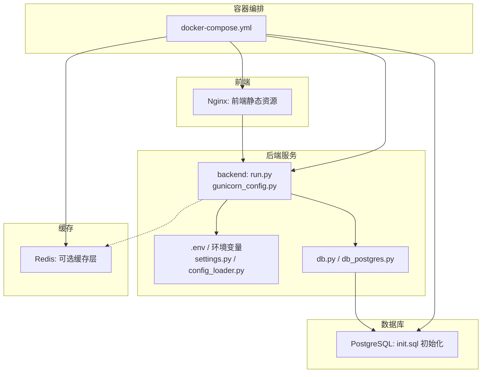
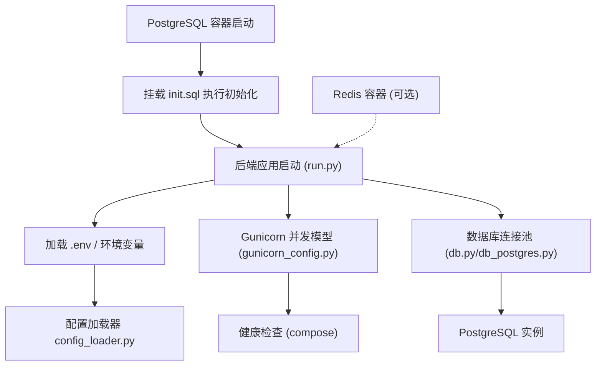
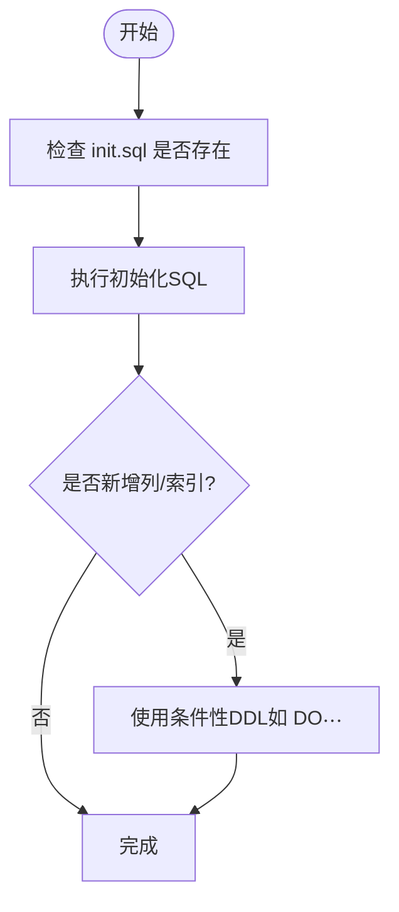
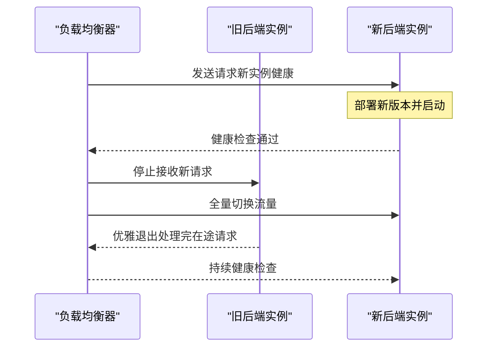
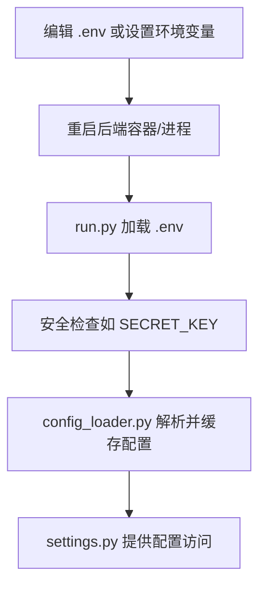
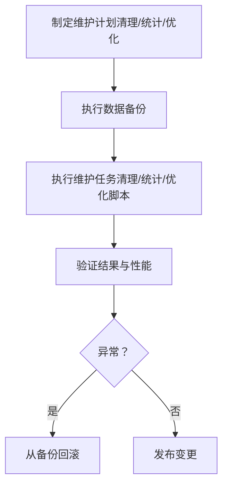
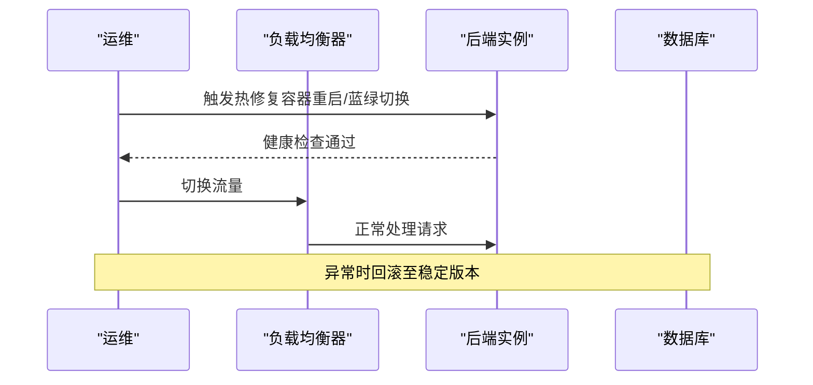
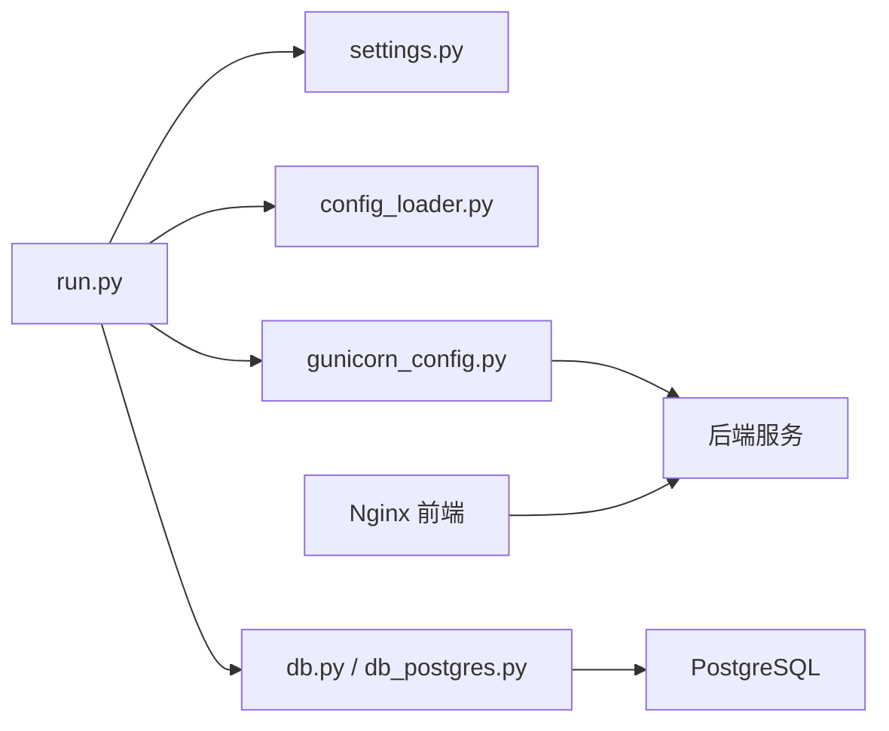

# 维护升级

<cite>
**本文引用的文件**
- [backend_api_python/migrations/init.sql](file://backend_api_python/migrations/init.sql)
- [backend_api_python/run.py](file://backend_api_python/run.py)
- [backend_api_python/start.sh](file://backend_api_python/start.sh)
- [backend_api_python/docker-entrypoint.sh](file://backend_api_python/docker-entrypoint.sh)
- [backend_api_python/Dockerfile](file://backend_api_python/Dockerfile)
- [backend_api_python/gunicorn_config.py](file://backend_api_python/gunicorn_config.py)
- [backend_api_python/env.example](file://backend_api_python/env.example)
- [backend_api_python/app/config/settings.py](file://backend_api_python/app/config/settings.py)
- [backend_api_python/app/utils/db.py](file://backend_api_python/app/utils/db.py)
- [backend_api_python/app/utils/db_postgres.py](file://backend_api_python/app/utils/db_postgres.py)
- [backend_api_python/app/utils/config_loader.py](file://backend_api_python/app/utils/config_loader.py)
- [backend_api_python/scripts/run_calibration.py](file://backend_api_python/scripts/run_calibration.py)
- [backend_api_python/scripts/run_reflection_task.py](file://backend_api_python/scripts/run_reflection_task.py)
- [backend_api_python/scripts/simulate_trading_executor.py](file://backend_api_python/scripts/simulate_trading_executor.py)
- [docker-compose.yml](file://docker-compose.yml)
</cite>

## 目录
1. [简介](#简介)
2. [项目结构](#项目结构)
3. [核心组件](#核心组件)
4. [架构总览](#架构总览)
5. [详细组件分析](#详细组件分析)
6. [依赖分析](#依赖分析)
7. [性能考虑](#性能考虑)
8. [故障排查指南](#故障排查指南)
9. [结论](#结论)
10. [附录](#附录)

## 简介
本指南面向运维与开发团队，系统化阐述维护升级操作，覆盖数据库迁移与Schema更新、版本管理、数据备份与回滚策略；应用升级（蓝绿部署、滚动更新、零停机升级）；配置变更管理（环境变量更新、服务重启、配置验证）；数据维护任务（历史数据清理、统计信息更新、性能优化脚本执行）；以及紧急修复流程、热修复发布与灾难恢复预案。

## 项目结构
后端采用Python/Flask + PostgreSQL + Redis + Nginx前端镜像的容器化架构。数据库初始化脚本随首次启动注入，应用通过Gunicorn提供生产服务，支持多工作线程并发模型；配置主要来源于.env与环境变量，部分高级配置可通过附加配置加载器按需启用。

**图示来源**
- [docker-compose.yml: 25-167:25-167](file://docker-compose.yml#L25-L167)
- [backend_api_python/run.py: 96-134:96-134](file://backend_api_python/run.py#L96-L134)
- [backend_api_python/gunicorn_config.py: 10-36:10-36](file://backend_api_python/gunicorn_config.py#L10-L36)
- [backend_api_python/app/utils/db.py: 19-66:19-66](file://backend_api_python/app/utils/db.py#L19-L66)
- [backend_api_python/app/utils/db_postgres.py: 194-219:194-219](file://backend_api_python/app/utils/db_postgres.py#L194-L219)

**章节来源**
- [docker-compose.yml: 1-167:1-167](file://docker-compose.yml#L1-L167)
- [backend_api_python/Dockerfile: 1-62:1-62](file://backend_api_python/Dockerfile#L1-L62)
- [backend_api_python/start.sh: 1-27:1-27](file://backend_api_python/start.sh#L1-L27)
- [backend_api_python/docker-entrypoint.sh: 1-49:1-49](file://backend_api_python/docker-entrypoint.sh#L1-L49)

## 核心组件
- 数据库初始化与Schema：通过PostgreSQL容器启动时挂载的初始化SQL完成，包含用户、积分、会员、OAuth状态、登录尝试、安全审计、策略、交易、挂单队列、通知、指标、自选股、回测、交易所凭证、手动持仓、提醒与监控、市场符号种子等表及索引。
- 应用入口与配置：run.py负责加载.env、设置代理、安全检查（SECRET_KEY）、启动Flask或Gunicorn；settings.py与config_loader.py统一读取环境变量与附加配置。
- 连接池与健康检查：db.py/db_postgres.py提供连接池封装与超时退避逻辑；compose中定义了PostgreSQL与Redis健康检查。
- 部署与运行：Dockerfile构建后端镜像；docker-entrypoint.sh在容器启动前校验/生成SECRET_KEY；gunicorn_config.py定义并发模型与超时参数。

**章节来源**
- [backend_api_python/migrations/init.sql: 1-1026:1-1026](file://backend_api_python/migrations/init.sql#L1-L1026)
- [backend_api_python/run.py: 17-134:17-134](file://backend_api_python/run.py#L17-L134)
- [backend_api_python/app/config/settings.py: 1-99:1-99](file://backend_api_python/app/config/settings.py#L1-L99)
- [backend_api_python/app/utils/config_loader.py: 24-251:24-251](file://backend_api_python/app/utils/config_loader.py#L24-L251)
- [backend_api_python/app/utils/db.py: 19-66:19-66](file://backend_api_python/app/utils/db.py#L19-L66)
- [backend_api_python/app/utils/db_postgres.py: 194-219:194-219](file://backend_api_python/app/utils/db_postgres.py#L194-L219)
- [backend_api_python/Dockerfile: 1-62:1-62](file://backend_api_python/Dockerfile#L1-L62)
- [backend_api_python/docker-entrypoint.sh: 25-44:25-44](file://backend_api_python/docker-entrypoint.sh#L25-L44)
- [backend_api_python/gunicorn_config.py: 10-36:10-36](file://backend_api_python/gunicorn_config.py#L10-L36)

## 架构总览
下图展示维护升级相关的关键交互：数据库初始化、配置加载、连接池与健康检查、容器启动与服务暴露、以及Gunicorn并发模型。

**图示来源**
- [docker-compose.yml: 29-58:29-58](file://docker-compose.yml#L29-L58)
- [backend_api_python/migrations/init.sql: 1-1026:1-1026](file://backend_api_python/migrations/init.sql#L1-L1026)
- [backend_api_python/run.py: 17-134:17-134](file://backend_api_python/run.py#L17-L134)
- [backend_api_python/app/utils/config_loader.py: 24-251:24-251](file://backend_api_python/app/utils/config_loader.py#L24-L251)
- [backend_api_python/gunicorn_config.py: 10-36:10-36](file://backend_api_python/gunicorn_config.py#L10-L36)
- [backend_api_python/app/utils/db.py: 19-66:19-66](file://backend_api_python/app/utils/db.py#L19-L66)
- [backend_api_python/app/utils/db_postgres.py: 194-219:194-219](file://backend_api_python/app/utils/db_postgres.py#L194-L219)

## 详细组件分析

### 数据库迁移与Schema更新
- 版本管理与初始化：PostgreSQL容器启动时自动执行挂载的初始化SQL，创建所有核心表与索引。该脚本内含条件性DDL（如条件添加列），确保向后兼容。
- Schema演进策略：
  - 新增表：在初始化脚本中统一声明，避免分散迁移。
  - 新增列：使用条件判断（如DO $$ ... $$）避免重复执行导致错误。
  - 索引维护：对高频查询字段建立索引，保障查询性能。
- 回滚策略：
  - 由于初始化脚本为幂等式DDL，且未提供显式回滚脚本，建议在变更前进行“影子测试”（在非生产环境复现变更）与数据备份。
  - 若需撤销变更，可在新版本中补充反向DDL（例如删除列或重建索引），并在新版本发布后执行。

**图示来源**
- [backend_api_python/migrations/init.sql: 226-255:226-255](file://backend_api_python/migrations/init.sql#L226-L255)
- [docker-compose.yml: 49-49:49-49](file://docker-compose.yml#L49-L49)

**章节来源**
- [backend_api_python/migrations/init.sql: 1-1026:1-1026](file://backend_api_python/migrations/init.sql#L1-L1026)
- [docker-compose.yml: 49-49:49-49](file://docker-compose.yml#L49-L49)

### 应用升级（蓝绿部署、滚动更新、零停机升级）
- 蓝绿部署：
  - 使用两个完全相同的后端服务实例（A/B），通过外部负载均衡器在两者间切换流量。
  - 升级前先在备用实例上部署新版本并进行健康检查；通过健康检查后，将流量切至新实例；旧实例在确认无流量后回收。
- 滚动更新：
  - 逐批替换后端容器，每批替换后等待健康检查通过再继续，以降低风险。
- 零停机升级：
  - 利用Gunicorn的优雅关闭（graceful_timeout）与健康检查，确保请求处理完成后再停止旧实例。
  - 在容器层面，通过重启策略与健康检查配合，保证服务可用性。

**图示来源**
- [backend_api_python/gunicorn_config.py: 20-28:20-28](file://backend_api_python/gunicorn_config.py#L20-L28)
- [docker-compose.yml: 127-131:127-131](file://docker-compose.yml#L127-L131)

**章节来源**
- [backend_api_python/gunicorn_config.py: 10-36:10-36](file://backend_api_python/gunicorn_config.py#L10-L36)
- [docker-compose.yml: 127-131:127-131](file://docker-compose.yml#L127-L131)

### 配置变更管理（环境变量、重启与验证）
- 环境变量更新：
  - 通过修改后端容器挂载的.env文件或设置环境变量，实现配置变更。
  - run.py在启动时会加载.env并进行安全检查（如SECRET_KEY）。
- 服务重启：
  - Docker Compose重启后端容器即可生效；也可在容器内触发进程重启（取决于部署方式）。
- 配置验证：
  - config_loader.py将环境变量映射为嵌套配置结构，支持类型转换与缓存；变更后可调用清除缓存函数以强制重新加载。
  - settings.py提供统一访问入口，便于在代码中读取配置。

**图示来源**
- [backend_api_python/run.py: 17-121:17-121](file://backend_api_python/run.py#L17-L121)
- [backend_api_python/app/utils/config_loader.py: 24-251:24-251](file://backend_api_python/app/utils/config_loader.py#L24-L251)
- [backend_api_python/app/config/settings.py: 1-99:1-99](file://backend_api_python/app/config/settings.py#L1-L99)

**章节来源**
- [backend_api_python/run.py: 17-121:17-121](file://backend_api_python/run.py#L17-L121)
- [backend_api_python/app/utils/config_loader.py: 24-251:24-251](file://backend_api_python/app/utils/config_loader.py#L24-L251)
- [backend_api_python/app/config/settings.py: 1-99:1-99](file://backend_api_python/app/config/settings.py#L1-L99)
- [backend_api_python/env.example: 1-288:1-288](file://backend_api_python/env.example#L1-L288)

### 数据维护任务（历史数据清理、统计更新、性能优化脚本）
- 历史数据清理：
  - 可基于业务表（如回测、分析记忆、登录尝试、OAuth状态等）设计定期清理策略（保留周期、归档方案）。
  - 建议在低峰时段执行，结合事务与批量删除，避免长事务锁表。
- 统计信息更新：
  - 对高频查询表（如回测运行、交易、日志）定期更新统计信息，提升查询计划质量。
- 性能优化脚本：
  - 提供脚本入口（如AI校准、反射验证、交易执行模拟）便于离线执行与验证。
  - 示例脚本路径：
    - [scripts/run_calibration.py:1-36](file://backend_api_python/scripts/run_calibration.py#L1-L36)
    - [scripts/run_reflection_task.py:1-34](file://backend_api_python/scripts/run_reflection_task.py#L1-L34)
    - [scripts/simulate_trading_executor.py:1-395](file://backend_api_python/scripts/simulate_trading_executor.py#L1-L395)

**图示来源**
- [backend_api_python/scripts/run_calibration.py: 18-31:18-31](file://backend_api_python/scripts/run_calibration.py#L18-L31)
- [backend_api_python/scripts/run_reflection_task.py: 11-29:11-29](file://backend_api_python/scripts/run_reflection_task.py#L11-L29)
- [backend_api_python/scripts/simulate_trading_executor.py: 303-394:303-394](file://backend_api_python/scripts/simulate_trading_executor.py#L303-L394)

**章节来源**
- [backend_api_python/scripts/run_calibration.py: 18-31:18-31](file://backend_api_python/scripts/run_calibration.py#L18-L31)
- [backend_api_python/scripts/run_reflection_task.py: 11-29:11-29](file://backend_api_python/scripts/run_reflection_task.py#L11-L29)
- [backend_api_python/scripts/simulate_trading_executor.py: 303-394:303-394](file://backend_api_python/scripts/simulate_trading_executor.py#L303-L394)

### 紧急修复流程、热修复发布与灾难恢复预案
- 紧急修复流程：
  - 快速定位问题（日志、健康检查、指标）；准备最小化修复补丁；在预生产环境验证；灰度发布；观察指标与告警；必要时快速回滚。
- 热修复发布：
  - 通过容器重启或蓝绿切换快速上线；确保健康检查通过后再扩大流量。
- 灾难恢复预案：
  - 数据库与日志卷备份策略；容器健康检查失败时的自动重启与报警；跨节点部署与多副本；回滚到上一稳定版本。

**图示来源**
- [docker-compose.yml: 127-131:127-131](file://docker-compose.yml#L127-L131)
- [backend_api_python/gunicorn_config.py: 20-28:20-28](file://backend_api_python/gunicorn_config.py#L20-L28)

**章节来源**
- [docker-compose.yml: 127-131:127-131](file://docker-compose.yml#L127-L131)
- [backend_api_python/gunicorn_config.py: 20-28:20-28](file://backend_api_python/gunicorn_config.py#L20-L28)

## 依赖分析
- 组件耦合：
  - run.py依赖dotenv加载配置，依赖settings与config_loader读取配置。
  - db.py/db_postgres.py提供统一数据库访问与连接池封装。
  - docker-compose定义了后端、数据库、缓存与前端的依赖关系与健康检查。
- 外部依赖：
  - PostgreSQL（数据库）、Redis（可选缓存）、Nginx（前端）、Gunicorn（生产WSGI）。

**图示来源**
- [backend_api_python/run.py: 96-134:96-134](file://backend_api_python/run.py#L96-L134)
- [backend_api_python/app/config/settings.py: 1-99:1-99](file://backend_api_python/app/config/settings.py#L1-L99)
- [backend_api_python/app/utils/config_loader.py: 24-251:24-251](file://backend_api_python/app/utils/config_loader.py#L24-L251)
- [backend_api_python/app/utils/db.py: 19-66:19-66](file://backend_api_python/app/utils/db.py#L19-L66)
- [backend_api_python/app/utils/db_postgres.py: 194-219:194-219](file://backend_api_python/app/utils/db_postgres.py#L194-L219)
- [backend_api_python/gunicorn_config.py: 10-36:10-36](file://backend_api_python/gunicorn_config.py#L10-L36)

**章节来源**
- [backend_api_python/run.py: 96-134:96-134](file://backend_api_python/run.py#L96-L134)
- [backend_api_python/app/utils/db.py: 19-66:19-66](file://backend_api_python/app/utils/db.py#L19-L66)
- [docker-compose.yml: 25-167:25-167](file://docker-compose.yml#L25-L167)

## 性能考虑
- 连接池与并发：
  - 通过Gunicorn线程模型（gthread）与连接池参数（DB_POOL_MIN/MAX/ACQUIRE_TIMEOUT/HEALTH_CHECK）平衡吞吐与稳定性。
  - 当出现“连接池耗尽”时，适当提高DB_POOL_MAX或优化慢查询。
- 缓存与索引：
  - 合理使用Redis缓存热点数据；为高频查询字段建立索引，减少全表扫描。
- 健康检查与超时：
  - 设置合理的超时与优雅关闭时间，避免长时间阻塞导致服务不可用。

**章节来源**
- [backend_api_python/gunicorn_config.py: 10-36:10-36](file://backend_api_python/gunicorn_config.py#L10-L36)
- [backend_api_python/app/utils/db_postgres.py: 194-219:194-219](file://backend_api_python/app/utils/db_postgres.py#L194-L219)
- [docker-compose.yml: 54-58:54-58](file://docker-compose.yml#L54-L58)

## 故障排查指南
- 启动失败（SECRET_KEY默认值）：
  - docker-entrypoint.sh会在检测到默认密钥时自动生成随机密钥并写入.env；生产环境需持久化设置。
- 数据库连接问题：
  - 检查DATABASE_URL与连接池参数；关注“连接池耗尽”日志并调整DB_POOL_MAX。
- 健康检查失败：
  - 查看后端健康端点与容器日志；确认数据库与缓存服务可用。
- 配置解析异常：
  - config_loader在解析失败时会记录警告；检查环境变量格式与类型转换。

**章节来源**
- [backend_api_python/docker-entrypoint.sh: 25-44:25-44](file://backend_api_python/docker-entrypoint.sh#L25-L44)
- [backend_api_python/app/utils/db_postgres.py: 194-219:194-219](file://backend_api_python/app/utils/db_postgres.py#L194-L219)
- [docker-compose.yml: 127-131:127-131](file://docker-compose.yml#L127-L131)
- [backend_api_python/app/utils/config_loader.py: 154-158:154-158](file://backend_api_python/app/utils/config_loader.py#L154-L158)

## 结论
通过容器化部署、集中式配置管理、连接池与健康检查机制，以及完善的初始化与维护脚本，本项目实现了可演进、可维护、可恢复的运维体系。建议在每次变更前进行充分的影子测试与备份，并结合蓝绿/滚动发布策略，确保零停机与可回滚能力。

## 附录
- 关键文件清单与用途概览：
  - [backend_api_python/migrations/init.sql](file://backend_api_python/migrations/init.sql)：数据库初始化与Schema定义
  - [backend_api_python/run.py](file://backend_api_python/run.py)：应用入口与安全检查
  - [backend_api_python/gunicorn_config.py](file://backend_api_python/gunicorn_config.py)：Gunicorn并发与超时配置
  - [backend_api_python/app/utils/db.py](file://backend_api_python/app/utils/db.py)：数据库连接封装
  - [backend_api_python/app/utils/db_postgres.py](file://backend_api_python/app/utils/db_postgres.py)：连接池与超时退避
  - [backend_api_python/app/utils/config_loader.py](file://backend_api_python/app/utils/config_loader.py)：环境变量到配置映射
  - [backend_api_python/env.example](file://backend_api_python/env.example)：环境变量参考
  - [docker-compose.yml](file://docker-compose.yml)：容器编排与健康检查
  - [backend_api_python/Dockerfile](file://backend_api_python/Dockerfile)：后端镜像构建
  - [backend_api_python/docker-entrypoint.sh](file://backend_api_python/docker-entrypoint.sh)：容器启动前密钥检查
  - [backend_api_python/start.sh](file://backend_api_python/start.sh)：本地启动脚本
  - [backend_api_python/scripts/run_calibration.py](file://backend_api_python/scripts/run_calibration.py)：AI校准脚本
  - [backend_api_python/scripts/run_reflection_task.py](file://backend_api_python/scripts/run_reflection_task.py)：反射验证脚本
  - [backend_api_python/scripts/simulate_trading_executor.py](file://backend_api_python/scripts/simulate_trading_executor.py)：交易执行模拟脚本