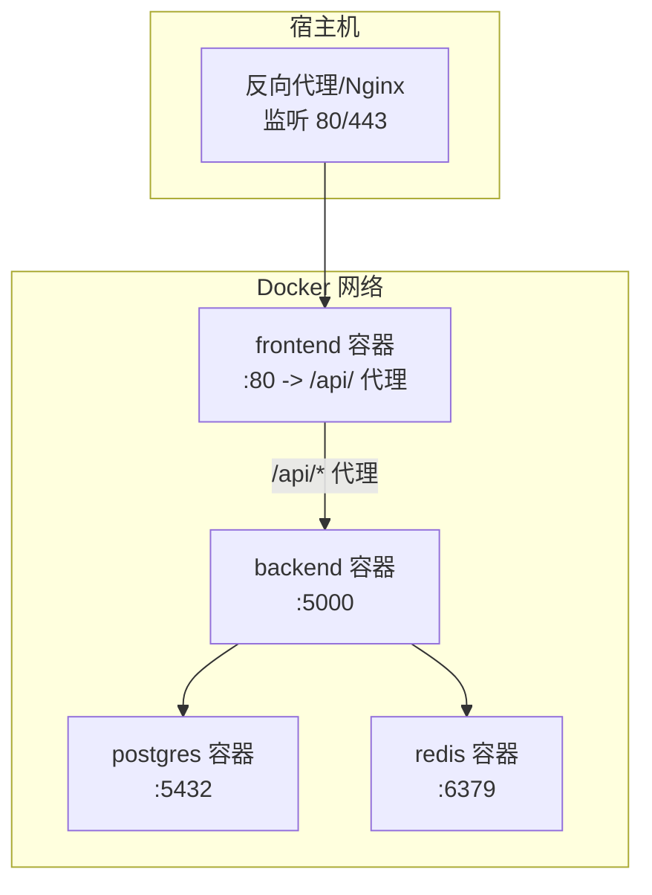
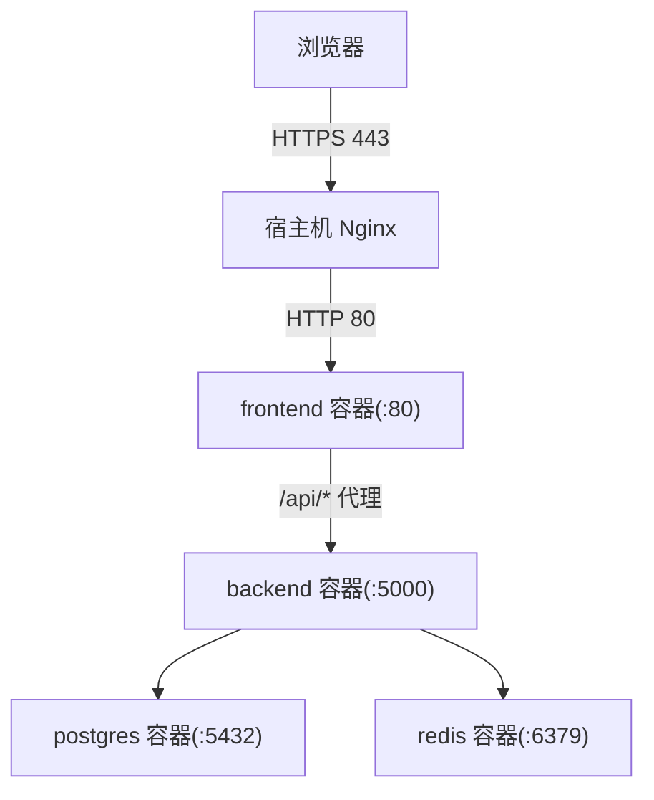
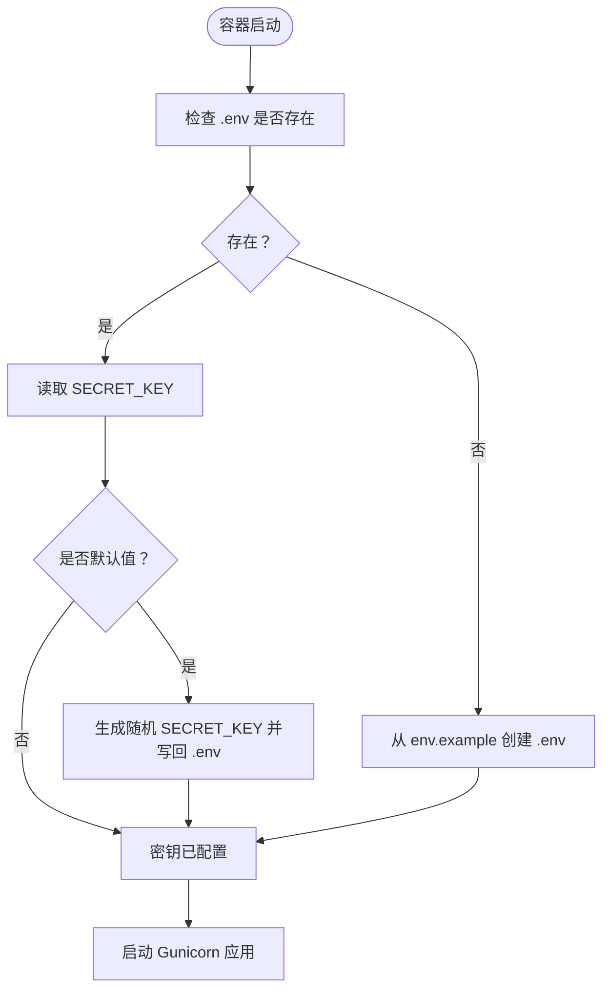
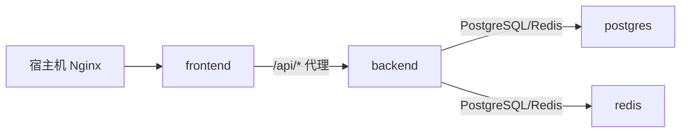

# 部署运维

<cite>
**本文引用的文件**
- [docker-compose.yml](file://docker-compose.yml)
- [Dockerfile（后端）](file://backend_api_python/Dockerfile)
- [Dockerfile（前端）](file://frontend/Dockerfile)
- [入口脚本（后端）](file://backend_api_python/docker-entrypoint.sh)
- [Gunicorn 配置](file://backend_api_python/gunicorn_config.py)
- [示例环境变量（后端）](file://backend_api_python/env.example)
- [运行入口（后端）](file://backend_api_python/run.py)
- [启动脚本（后端）](file://backend_api_python/start.sh)
- [Nginx 配置（前端）](file://frontend/nginx.conf)
- [云部署指南（英文）](file://docs/CLOUD_DEPLOYMENT_EN.md)
- [云部署指南（中文）](file://docs/CLOUD_DEPLOYMENT_CN.md)
- [开发指南](file://DEVELOPMENT.md)
- [安全策略](file://SECURITY.md)
- [后端依赖清单](file://backend_api_python/requirements.txt)
- [应用配置（后端）](file://backend_api_python/app/config/settings.py)
- [健康检查路由（后端）](file://backend_api_python/app/routes/health.py)
</cite>

## 目录
1. [简介](#简介)
2. [项目结构](#项目结构)
3. [核心组件](#核心组件)
4. [架构总览](#架构总览)
5. [详细组件分析](#详细组件分析)
6. [依赖关系分析](#依赖关系分析)
7. [性能考量](#性能考量)
8. [故障排除指南](#故障排除指南)
9. [结论](#结论)
10. [附录](#附录)

## 简介
本指南面向运维与平台工程团队，提供 QuantDinger 的生产级部署与运维操作手册。内容覆盖 Docker Compose 服务编排、容器配置与网络、生产最佳实践（域名与 HTTPS、反向代理）、监控与日志、配置管理、备份与升级、安全加固与资源优化等。

## 项目结构
QuantDinger 采用多服务编排：前端 Nginx 容器、后端 Python/Flask 容器、PostgreSQL 数据库容器、可选 Redis 缓存容器。服务通过自定义桥接网络互联，默认仅对外暴露 80/443，数据库与后端 API 默认绑定到 127.0.0.1，避免直接暴露公网。

图表来源
- [docker-compose.yml:25-167](file://docker-compose.yml#L25-L167)
- [frontend/nginx.conf:26-42](file://frontend/nginx.conf#L26-L42)
- [backend_api_python/gunicorn_config.py:12-18](file://backend_api_python/gunicorn_config.py#L12-L18)

章节来源
- [docker-compose.yml:1-167](file://docker-compose.yml#L1-L167)
- [DEVELOPMENT.md:30-63](file://DEVELOPMENT.md#L30-L63)

## 核心组件
- 前端容器（Nginx）：提供静态资源与反向代理，将 /api 请求转发至后端；内置健康检查端点。
- 后端容器（Python/Flask + Gunicorn）：应用入口加载 .env，执行安全密钥校验；通过健康检查路由提供存活探测。
- 数据库容器（PostgreSQL）：初始化脚本、连接池参数与健康检查；默认最大连接数与共享缓冲可调。
- 缓存容器（Redis）：可选缓存层，限制内存与淘汰策略，适合多工作线程场景。
- 网络与卷：自定义桥接网络隔离服务；持久化卷用于数据库与后端日志/数据。

章节来源
- [docker-compose.yml:25-167](file://docker-compose.yml#L25-L167)
- [frontend/Dockerfile:1-19](file://frontend/Dockerfile#L1-L19)
- [backend_api_python/Dockerfile:1-62](file://backend_api_python/Dockerfile#L1-L62)
- [backend_api_python/gunicorn_config.py:1-36](file://backend_api_python/gunicorn_config.py#L1-L36)
- [frontend/nginx.conf:1-56](file://frontend/nginx.conf#L1-L56)
- [backend_api_python/app/routes/health.py:10-34](file://backend_api_python/app/routes/health.py#L10-L34)

## 架构总览
下图展示生产推荐拓扑：宿主机 Nginx 作为统一入口，仅暴露 80/443；前端容器监听 127.0.0.1:8888，后端容器监听 127.0.0.1:5000，数据库监听 127.0.0.1:5432，三者均不直接暴露公网。

图表来源
- [docs/CLOUD_DEPLOYMENT_EN.md:7-20](file://docs/CLOUD_DEPLOYMENT_EN.md#L7-L20)
- [docs/CLOUD_DEPLOYMENT_CN.md:5-20](file://docs/CLOUD_DEPLOYMENT_CN.md#L5-L20)
- [frontend/nginx.conf:26-42](file://frontend/nginx.conf#L26-L42)
- [docker-compose.yml:104-125](file://docker-compose.yml#L104-L125)

## 详细组件分析

### 组件一：Docker Compose 服务编排
- 服务定义与依赖：后端依赖数据库与缓存健康；前端依赖后端可用；容器间通过自定义网络通信。
- 端口绑定：默认仅绑定到 127.0.0.1，避免公网直连；可通过项目根 .env 调整端口。
- 健康检查：数据库、缓存、后端、前端均配置健康检查，便于编排器自动恢复。
- 卷与持久化：数据库数据卷、后端日志与数据卷，保障重启后数据不丢失。

章节来源
- [docker-compose.yml:25-167](file://docker-compose.yml#L25-L167)

### 组件二：后端容器（Python/Flask + Gunicorn）
- 入口与安全校验：容器启动前通过入口脚本检查并生成/替换 SECRET_KEY；应用启动时再次校验 SECRET_KEY，防止默认密钥导致的安全风险。
- 运行模式：开发使用内置 Flask 服务器；生产使用 Gunicorn（gthread），支持多线程与稳定连接处理。
- 环境变量：数据库连接串、Redis 地址、连接池参数、并发工作线程、本地桌面券商开关等。
- 日志：Gunicorn 访问与错误日志输出到标准输出，结合容器日志收集。

图表来源
- [backend_api_python/docker-entrypoint.sh:11-44](file://backend_api_python/docker-entrypoint.sh#L11-L44)
- [backend_api_python/run.py:109-120](file://backend_api_python/run.py#L109-L120)
- [backend_api_python/gunicorn_config.py:10-36](file://backend_api_python/gunicorn_config.py#L10-L36)

章节来源
- [backend_api_python/Dockerfile:1-62](file://backend_api_python/Dockerfile#L1-L62)
- [backend_api_python/docker-entrypoint.sh:1-49](file://backend_api_python/docker-entrypoint.sh#L1-L49)
- [backend_api_python/gunicorn_config.py:1-36](file://backend_api_python/gunicorn_config.py#L1-L36)
- [backend_api_python/run.py:1-134](file://backend_api_python/run.py#L1-L134)

### 组件三：前端容器（Nginx）
- 静态资源与 SPA 路由：提供预编译静态文件，支持单页应用回退到 index.html。
- API 代理：将 /api/* 请求代理到后端容器，设置必要的头部信息与超时。
- 健康检查：提供 /health 端点返回 200，便于外部探针检测。
- 安全头与压缩：内置常见安全响应头与 Gzip 压缩配置。

章节来源
- [frontend/Dockerfile:1-19](file://frontend/Dockerfile#L1-L19)
- [frontend/nginx.conf:1-56](file://frontend/nginx.conf#L1-L56)

### 组件四：数据库（PostgreSQL）
- 初始化与迁移：容器首次启动执行初始化 SQL 文件。
- 连接池与性能：通过环境变量调整最大连接数与共享缓冲，适配并发与扩展需求。
- 健康检查：基于 pg_isready 的健康检查，周期性探测。

章节来源
- [docker-compose.yml:29-58](file://docker-compose.yml#L29-L58)
- [backend_api_python/env.example:42-57](file://backend_api_python/env.example#L42-L57)

### 组件五：缓存（Redis）
- 用途：可选缓存层，提升多工作线程下的读取性能。
- 配置：限制内存与 LRU 淘汰策略，降低资源占用。
- 健康检查：PING 探测。

章节来源
- [docker-compose.yml:63-76](file://docker-compose.yml#L63-L76)
- [backend_api_python/env.example:281-284](file://backend_api_python/env.example#L281-L284)

### 组件六：健康检查与监控
- 后端健康检查：/api/health 返回健康状态，供容器编排与反向代理探针使用。
- 前端健康检查：/health 返回 200，便于反向代理与编排器探测。
- 数据库与缓存健康检查：分别基于命令行工具的探针。

章节来源
- [backend_api_python/app/routes/health.py:21-34](file://backend_api_python/app/routes/health.py#L21-L34)
- [frontend/nginx.conf:50-54](file://frontend/nginx.conf#L50-L54)
- [docker-compose.yml:54-58](file://docker-compose.yml#L54-L58)
- [docker-compose.yml:72-76](file://docker-compose.yml#L72-L76)

## 依赖关系分析
- 后端依赖数据库与缓存健康；前端依赖后端可用；容器间通过自定义桥接网络通信。
- 后端通过环境变量读取数据库与缓存配置；前端通过 Nginx 将 /api/* 代理到后端。
- 健康检查与重启策略由 Compose 管理，实现故障自动恢复。

图表来源
- [docker-compose.yml:89-93](file://docker-compose.yml#L89-L93)
- [frontend/nginx.conf:26-42](file://frontend/nginx.conf#L26-L42)

章节来源
- [docker-compose.yml:25-167](file://docker-compose.yml#L25-L167)
- [frontend/nginx.conf:26-42](file://frontend/nginx.conf#L26-L42)

## 性能考量
- 连接池与并发：根据并发用户与机器人数量调整数据库连接池上限；适当提高 Gunicorn 工作进程与线程数以提升吞吐。
- 缓存策略：启用 Redis 缓存可显著降低数据库压力；注意内存限制与淘汰策略。
- 网络与代理：合理设置代理超时与请求体大小，避免长回测或大文件上传失败。
- 日志与 IO：生产环境建议将日志输出到标准流并配合集中式日志收集，避免磁盘 IO 压力。

章节来源
- [backend_api_python/env.example:42-61](file://backend_api_python/env.example#L42-L61)
- [backend_api_python/gunicorn_config.py:10-36](file://backend_api_python/gunicorn_config.py#L10-L36)
- [frontend/nginx.conf:37-41](file://frontend/nginx.conf#L37-L41)

## 故障排除指南
- 镜像拉取失败：通过项目根 .env 设置镜像前缀切换镜像源后重试。
- 容器启动失败（后端）：重建后端镜像并单独启动后端容器修复。
- 前端无法解析后端上游：检查后端是否健康，必要时重启前端。
- 前端构建缺失静态资源：确认 .dockerignore 未排除 frontend/dist。
- 配置写入权限（/app/.env 只读）：修正 docker-compose.yml 中的挂载为可写。
- 代理在容器内不可用：Docker 环境使用 host.docker.internal 指向宿主机。
- 交易所符号不存在：多为交易所符号映射或代币更名问题，非网络故障。
- Nginx 502/504：检查容器状态、健康检查与 Nginx 配置。
- 数据库不应暴露公网：仅开放 80/443，数据库与后端 API 绑定到 127.0.0.1。

章节来源
- [docs/CLOUD_DEPLOYMENT_EN.md:320-451](file://docs/CLOUD_DEPLOYMENT_EN.md#L320-L451)
- [docs/CLOUD_DEPLOYMENT_CN.md:320-451](file://docs/CLOUD_DEPLOYMENT_CN.md#L320-L451)
- [docker-compose.yml:96-100](file://docker-compose.yml#L96-L100)

## 结论
通过 Docker Compose 实现的服务编排与反向代理架构，QuantDinger 在生产环境中实现了高内聚、低耦合与强隔离。遵循本文提供的部署与运维建议，可在保证安全与稳定的前提下，获得良好的性能与可维护性。

## 附录

### A. 生产环境部署最佳实践
- 域名与 HTTPS：使用单一域名并通过宿主机 Nginx 提供 HTTPS，仅暴露 80/443。
- 反向代理：将 app.example.com 指向前端容器，api.example.com 指向后端容器（可选）。
- 端口绑定：数据库与后端 API 绑定到 127.0.0.1，避免公网直连。
- 镜像源：如需加速，可在项目根 .env 设置镜像前缀。

章节来源
- [docs/CLOUD_DEPLOYMENT_EN.md:221-283](file://docs/CLOUD_DEPLOYMENT_EN.md#L221-L283)
- [docs/CLOUD_DEPLOYMENT_CN.md:221-283](file://docs/CLOUD_DEPLOYMENT_CN.md#L221-L283)
- [docker-compose.yml:104-116](file://docker-compose.yml#L104-L116)

### B. 监控与日志
- 健康检查：利用 /api/health 与 /health 端点进行存活与就绪探测。
- 日志：后端容器标准输出日志，结合宿主日志收集系统集中管理。
- 建议：使用 Prometheus/Grafana 或类似方案采集容器指标与应用日志。

章节来源
- [backend_api_python/app/routes/health.py:21-34](file://backend_api_python/app/routes/health.py#L21-L34)
- [frontend/nginx.conf:50-54](file://frontend/nginx.conf#L50-L54)
- [backend_api_python/gunicorn_config.py:30-32](file://backend_api_python/gunicorn_config.py#L30-L32)

### C. 配置管理
- 后端配置：通过 backend_api_python/.env 管理密钥、数据库、缓存、并发与功能开关。
- 项目根 .env：控制端口与镜像源。
- 环境变量优先级：运行入口会优先加载 backend_api_python/.env，其次为项目根 .env。

章节来源
- [backend_api_python/env.example:1-288](file://backend_api_python/env.example#L1-L288)
- [backend_api_python/run.py:17-29](file://backend_api_python/run.py#L17-L29)
- [docker-compose.yml:96-100](file://docker-compose.yml#L96-L100)

### D. 备份与升级
- 备份：定期导出数据库卷与后端日志/数据卷；制定快照与异地备份策略。
- 升级：拉取最新代码后重建并启动容器；必要时清理缓存与重启相关服务。

章节来源
- [docs/CLOUD_DEPLOYMENT_EN.md:284-318](file://docs/CLOUD_DEPLOYMENT_EN.md#L284-L318)
- [docs/CLOUD_DEPLOYMENT_CN.md:284-318](file://docs/CLOUD_DEPLOYMENT_CN.md#L284-L318)

### E. 安全加固
- 密钥管理：禁止使用默认 SECRET_KEY；生产环境务必持久化密钥。
- 网络隔离：数据库与后端 API 不暴露公网；仅开放 80/443。
- 最小权限：容器以非特权用户运行；禁用不必要的服务与端口。
- 依赖安全：定期更新依赖，关注安全公告。

章节来源
- [backend_api_python/docker-entrypoint.sh:25-44](file://backend_api_python/docker-entrypoint.sh#L25-L44)
- [backend_api_python/run.py:109-120](file://backend_api_python/run.py#L109-L120)
- [SECURITY.md:1-110](file://SECURITY.md#L1-L110)
- [backend_api_python/requirements.txt:1-37](file://backend_api_python/requirements.txt#L1-L37)

### F. 资源优化与容量规划
- CPU/内存：根据并发与业务负载评估 vCPU 与内存；逐步增加 Gunicorn 工作进程与线程。
- 存储：为数据库卷预留充足空间；开启日志轮转与清理策略。
- 缓存：启用 Redis 并合理设置内存上限与淘汰策略。

章节来源
- [backend_api_python/env.example:42-61](file://backend_api_python/env.example#L42-L61)
- [docker-compose.yml:67-68](file://docker-compose.yml#L67-L68)