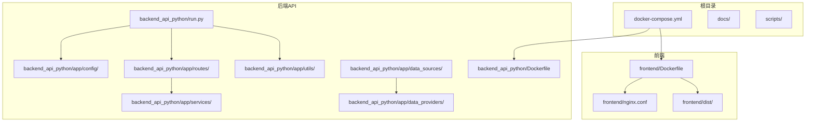
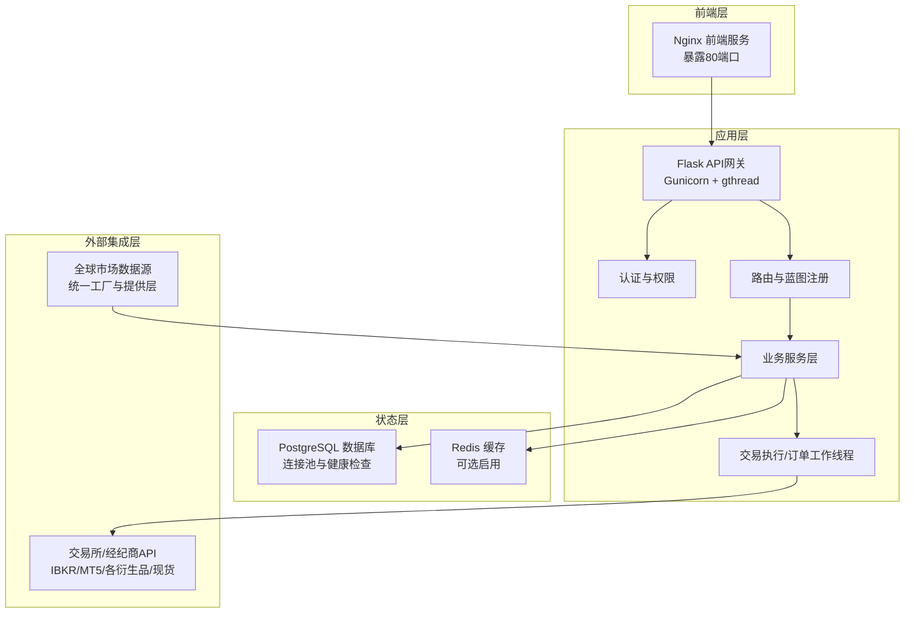
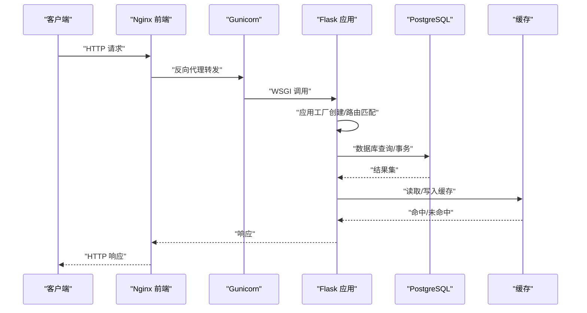
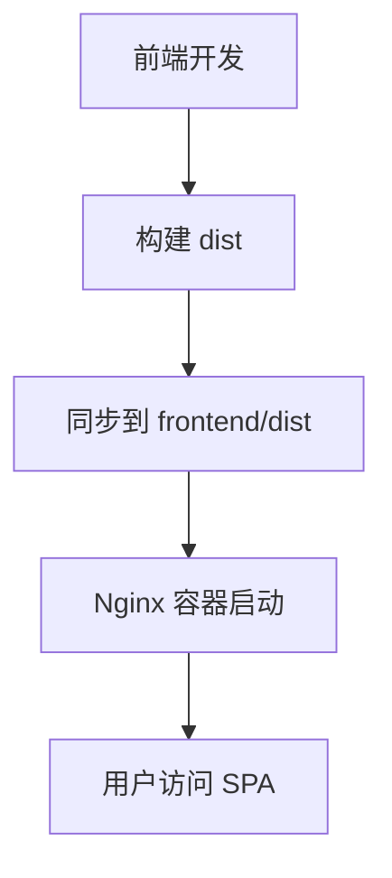
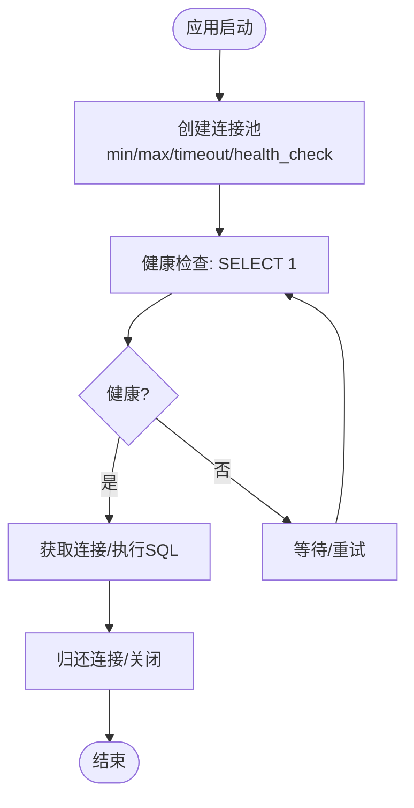
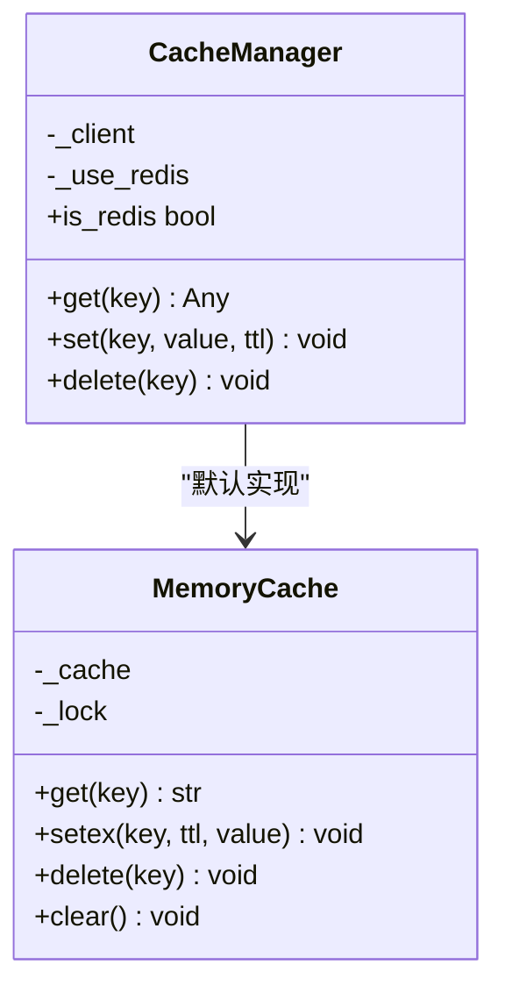
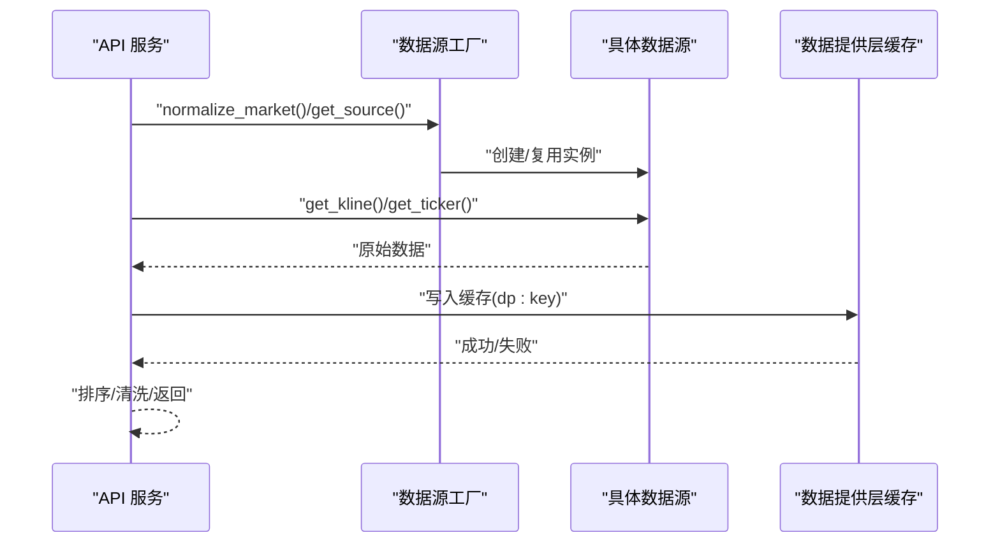
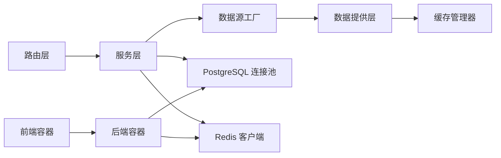

# 技术架构总览

<cite>
**本文档引用的文件**
- [docker-compose.yml](file://docker-compose.yml)
- [backend_api_python/Dockerfile](file://backend_api_python/Dockerfile)
- [frontend/Dockerfile](file://frontend/Dockerfile)
- [backend_api_python/run.py](file://backend_api_python/run.py)
- [backend_api_python/gunicorn_config.py](file://backend_api_python/gunicorn_config.py)
- [backend_api_python/app/__init__.py](file://backend_api_python/app/__init__.py)
- [backend_api_python/app/config/settings.py](file://backend_api_python/app/config/settings.py)
- [backend_api_python/app/config/database.py](file://backend_api_python/app/config/database.py)
- [backend_api_python/app/utils/db_postgres.py](file://backend_api_python/app/utils/db_postgres.py)
- [backend_api_python/app/utils/cache.py](file://backend_api_python/app/utils/cache.py)
- [backend_api_python/app/routes/__init__.py](file://backend_api_python/app/routes/__init__.py)
- [backend_api_python/app/data_sources/factory.py](file://backend_api_python/app/data_sources/factory.py)
- [backend_api_python/app/data_providers/__init__.py](file://backend_api_python/app/data_providers/__init__.py)
</cite>

## 目录
1. [引言](#引言)
2. [项目结构](#项目结构)
3. [核心组件](#核心组件)
4. [架构总览](#架构总览)
5. [详细组件分析](#详细组件分析)
6. [依赖关系分析](#依赖关系分析)
7. [性能考虑](#性能考虑)
8. [故障排查指南](#故障排查指南)
9. [结论](#结论)

## 引言
本文件面向QuantDinger量化交易平台的技术架构总览，聚焦于系统分层设计与容器化部署理念。文档将从四层视角阐述：前端层、应用层、状态层、外部集成层；并结合Flask API网关、Vue前端应用、PostgreSQL数据库、Redis缓存等核心组件，给出系统交互关系与数据流向的可视化说明，帮助开发者快速理解平台运行机制与扩展点。

## 项目结构
仓库采用多模块组织方式，核心目录与职责如下：
- backend_api_python：后端API与业务逻辑，基于Flask提供REST服务，包含配置、路由、服务、数据源、工具等子包。
- frontend：前端静态资源与Nginx镜像构建，负责打包后的SPA静态页面托管。
- docs：平台文档与用户指南。
- scripts：辅助脚本，如国际化处理、密钥生成等。
- 根目录docker-compose.yml：定义容器编排与网络、存储、健康检查与环境变量注入。

图表来源
- [docker-compose.yml:25-167](file://docker-compose.yml#L25-L167)
- [backend_api_python/Dockerfile:1-62](file://backend_api_python/Dockerfile#L1-L62)
- [frontend/Dockerfile:1-19](file://frontend/Dockerfile#L1-L19)

章节来源
- [docker-compose.yml:1-167](file://docker-compose.yml#L1-L167)
- [backend_api_python/Dockerfile:1-62](file://backend_api_python/Dockerfile#L1-L62)
- [frontend/Dockerfile:1-19](file://frontend/Dockerfile#L1-L19)

## 核心组件
- Flask API网关（后端服务）
  - 应用工厂模式创建Flask应用，注册路由蓝图，初始化数据库与管理员账户，启动后台任务与策略恢复。
  - 使用Gunicorn作为生产WSGI服务器，支持线程模型并发与连接池参数可调。
- Vue前端应用（静态站点）
  - 通过Nginx提供预构建SPA静态资源，前端开发与构建在独立仓库完成，发布时将dist同步至本仓库。
- PostgreSQL数据库
  - 提供持久化存储，支持连接池配置、超时与健康检查，兼容历史SQL占位符语法转换。
- Redis缓存
  - 可选缓存层，默认禁用；启用后透明替换为Redis，否则使用线程安全的内存缓存。
- 外部数据源与集成
  - 工厂模式抽象多市场数据源（加密货币、外汇、期货、美股、港股、沪深），统一K线与实时报价接口。
  - 统一数据提供层封装共享缓存与TTL策略，支持刷新与清理。

章节来源
- [backend_api_python/app/__init__.py:212-269](file://backend_api_python/app/__init__.py#L212-L269)
- [backend_api_python/gunicorn_config.py:1-36](file://backend_api_python/gunicorn_config.py#L1-L36)
- [backend_api_python/app/config/settings.py:1-99](file://backend_api_python/app/config/settings.py#L1-L99)
- [backend_api_python/app/utils/db_postgres.py:1-495](file://backend_api_python/app/utils/db_postgres.py#L1-L495)
- [backend_api_python/app/utils/cache.py:1-129](file://backend_api_python/app/utils/cache.py#L1-L129)
- [backend_api_python/app/data_sources/factory.py:1-169](file://backend_api_python/app/data_sources/factory.py#L1-L169)
- [backend_api_python/app/data_providers/__init__.py:1-86](file://backend_api_python/app/data_providers/__init__.py#L1-L86)

## 架构总览
系统采用“前端静态 + 后端API + 状态存储 + 缓存”的分层架构，容器化统一编排，确保可移植性与可观测性。

图表来源
- [docker-compose.yml:25-167](file://docker-compose.yml#L25-L167)
- [backend_api_python/app/__init__.py:212-269](file://backend_api_python/app/__init__.py#L212-L269)
- [backend_api_python/app/routes/__init__.py:1-53](file://backend_api_python/app/routes/__init__.py#L1-L53)
- [backend_api_python/app/utils/db_postgres.py:1-495](file://backend_api_python/app/utils/db_postgres.py#L1-L495)
- [backend_api_python/app/utils/cache.py:1-129](file://backend_api_python/app/utils/cache.py#L1-L129)
- [backend_api_python/app/data_sources/factory.py:1-169](file://backend_api_python/app/data_sources/factory.py#L1-L169)

## 详细组件分析

### Flask API网关（后端服务）
- 应用工厂与启动流程
  - 通过应用工厂创建Flask实例，设置安全JSON序列化、CORS、日志与数据库初始化。
  - 注册全部蓝图，启动后台任务（挂单处理、组合监控、USDT支付、Polymarket、AI校准、反思任务）与策略恢复。
- 并发与稳定性
  - 默认使用Gunicorn + gthread模型，支持多线程提升I/O并发；可通过环境变量调整工作进程与线程数。
- 安全与配置
  - 支持从.env加载运行时配置；强制生产环境不可使用默认密钥，自动检测并生成随机密钥以避免令牌伪造风险。
- 数据库与缓存
  - 初始化PostgreSQL连接池并进行健康检查；缓存层默认本地内存，可按需启用Redis。

图表来源
- [backend_api_python/app/__init__.py:212-269](file://backend_api_python/app/__init__.py#L212-L269)
- [backend_api_python/gunicorn_config.py:1-36](file://backend_api_python/gunicorn_config.py#L1-L36)
- [backend_api_python/app/utils/db_postgres.py:1-495](file://backend_api_python/app/utils/db_postgres.py#L1-L495)
- [backend_api_python/app/utils/cache.py:1-129](file://backend_api_python/app/utils/cache.py#L1-L129)

章节来源
- [backend_api_python/run.py:104-134](file://backend_api_python/run.py#L104-L134)
- [backend_api_python/app/__init__.py:212-269](file://backend_api_python/app/__init__.py#L212-L269)
- [backend_api_python/gunicorn_config.py:1-36](file://backend_api_python/gunicorn_config.py#L1-L36)
- [backend_api_python/app/config/settings.py:1-99](file://backend_api_python/app/config/settings.py#L1-L99)

### Vue前端应用（静态站点）
- 部署方式
  - 使用Nginx镜像直接提供frontend/dist中的静态资源，容器暴露80端口；前端源码在独立仓库维护，构建产物同步到本仓库。
- 与后端交互
  - 前端通过HTTP访问后端API，后端提供CORS支持；健康检查通过Nginx内部探测实现。

图表来源
- [frontend/Dockerfile:1-19](file://frontend/Dockerfile#L1-L19)
- [docker-compose.yml:133-154](file://docker-compose.yml#L133-L154)

章节来源
- [frontend/Dockerfile:1-19](file://frontend/Dockerfile#L1-L19)
- [docker-compose.yml:133-154](file://docker-compose.yml#L133-L154)

### PostgreSQL数据库
- 连接池与高可用
  - 通过环境变量控制最小/最大连接数、获取超时与健康检查；连接建立时设置时区与keepalives参数，降低NAT/网络抖动影响。
  - 健康检查通过pg_isready验证，防止启动过早导致连接失败。
- 兼容性与错误处理
  - 提供SQL占位符转换与INSERT兼容逻辑，避免历史SQL在PostgreSQL上的语法差异问题；异常时自动回滚并释放连接。
- 配置与迁移
  - 通过init.sql在首次启动时初始化数据库结构；容器卷映射保证数据持久化。

图表来源
- [backend_api_python/app/utils/db_postgres.py:107-162](file://backend_api_python/app/utils/db_postgres.py#L107-L162)
- [docker-compose.yml:44-58](file://docker-compose.yml#L44-L58)

章节来源
- [backend_api_python/app/utils/db_postgres.py:1-495](file://backend_api_python/app/utils/db_postgres.py#L1-L495)
- [docker-compose.yml:29-58](file://docker-compose.yml#L29-L58)

### Redis缓存
- 本地优先策略
  - 默认禁用Redis，使用线程安全的内存缓存；当显式启用时，尝试连接Redis并进行ping验证，失败则回退到内存缓存。
- TTL与键空间
  - 提供统一TTL策略与键前缀(dp:)，支持按需清理；Redis路径下每个键具备固有TTL，内存路径由管理器内部维护过期。
- 配置项
  - 主机、端口、密码、DB索引、连接/Socket超时、最大连接数等均来自环境变量。

图表来源
- [backend_api_python/app/utils/cache.py:49-129](file://backend_api_python/app/utils/cache.py#L49-L129)
- [backend_api_python/app/config/database.py:1-90](file://backend_api_python/app/config/database.py#L1-L90)

章节来源
- [backend_api_python/app/utils/cache.py:1-129](file://backend_api_python/app/utils/cache.py#L1-L129)
- [backend_api_python/app/config/database.py:1-90](file://backend_api_python/app/config/database.py#L1-L90)

### 外部数据源与集成
- 数据源工厂
  - 通过市场类型映射到具体数据源实现，支持别名标准化；提供K线与实时报价的统一入口，并保证返回数据的时间序一致性。
- 统一数据提供层
  - 在数据提供层集中管理缓存与TTL策略，支持刷新与清理；对数值转换提供安全包装，避免异常导致请求中断。
- 交易执行与外部Broker
  - 交易执行器与订单工作线程在应用启动时按需启用；支持多交易所/经纪商对接（IBKR/MT5/各大衍生品与现货平台），通过工厂与符号映射解耦。

图表来源
- [backend_api_python/app/data_sources/factory.py:27-169](file://backend_api_python/app/data_sources/factory.py#L27-L169)
- [backend_api_python/app/data_providers/__init__.py:1-86](file://backend_api_python/app/data_providers/__init__.py#L1-L86)

章节来源
- [backend_api_python/app/data_sources/factory.py:1-169](file://backend_api_python/app/data_sources/factory.py#L1-L169)
- [backend_api_python/app/data_providers/__init__.py:1-86](file://backend_api_python/app/data_providers/__init__.py#L1-L86)

## 依赖关系分析
- 组件耦合
  - 路由层依赖服务层；服务层依赖数据源工厂与统一数据提供层；数据提供层依赖缓存管理器；缓存管理器可选择Redis或内存实现。
  - 数据库连接通过连接池全局单例管理，避免重复创建与资源泄漏。
- 外部依赖
  - PostgreSQL驱动（psycopg2）、Redis客户端（redis-py）、Flask生态（CORS、JSON Provider）。
- 容器编排
  - 通过docker-compose定义网络、卷与健康检查；后端服务依赖数据库与缓存服务；前端服务依赖后端可达。

图表来源
- [backend_api_python/app/routes/__init__.py:1-53](file://backend_api_python/app/routes/__init__.py#L1-L53)
- [backend_api_python/app/data_sources/factory.py:1-169](file://backend_api_python/app/data_sources/factory.py#L1-L169)
- [backend_api_python/app/data_providers/__init__.py:1-86](file://backend_api_python/app/data_providers/__init__.py#L1-L86)
- [backend_api_python/app/utils/cache.py:1-129](file://backend_api_python/app/utils/cache.py#L1-L129)
- [backend_api_python/app/utils/db_postgres.py:1-495](file://backend_api_python/app/utils/db_postgres.py#L1-L495)
- [docker-compose.yml:25-167](file://docker-compose.yml#L25-L167)

章节来源
- [backend_api_python/app/routes/__init__.py:1-53](file://backend_api_python/app/routes/__init__.py#L1-L53)
- [backend_api_python/app/data_sources/factory.py:1-169](file://backend_api_python/app/data_sources/factory.py#L1-L169)
- [backend_api_python/app/data_providers/__init__.py:1-86](file://backend_api_python/app/data_providers/__init__.py#L1-L86)
- [backend_api_python/app/utils/cache.py:1-129](file://backend_api_python/app/utils/cache.py#L1-L129)
- [backend_api_python/app/utils/db_postgres.py:1-495](file://backend_api_python/app/utils/db_postgres.py#L1-L495)
- [docker-compose.yml:25-167](file://docker-compose.yml#L25-L167)

## 性能考虑
- 连接池与并发
  - PostgreSQL连接池参数（min/max/acquire_timeout/health_check）直接影响吞吐与稳定性；可根据并发请求数与机器人数量调整。
  - Gunicorn使用gthread模型，线程数与工作进程数可调；preload禁止以避免后台线程丢失。
- 缓存策略
  - 默认禁用Redis，减少额外依赖；启用后建议合理设置TTL与键空间，避免热点Key与内存压力。
- I/O与序列化
  - 自定义JSON Provider确保输出符合RFC规范，避免前端解析异常；数据提供层对数值转换进行兜底，提升健壮性。
- 健康检查与重启
  - 数据库与缓存服务均配置健康检查，后端服务依赖其健康状态再启动，降低启动失败概率。

## 故障排查指南
- 启动失败（SECRET_KEY默认值）
  - 生产环境必须设置非默认密钥；若检测到默认值，系统会自动生成随机密钥并提示持久化配置。
- 数据库连接问题
  - 检查DATABASE_URL格式与可达性；确认连接池参数是否合理；查看连接池耗尽告警并适当提高上限。
- 缓存不可用
  - 若启用Redis但连接失败，系统会回退到内存缓存；检查Redis主机/端口/密码与网络连通性。
- 健康检查失败
  - 查看后端/数据库/缓存的健康检查日志；确认容器间网络与端口映射正确。
- 前端无法访问
  - 确认前端容器已构建并映射到宿主机端口；检查Nginx配置与静态资源是否存在。

章节来源
- [backend_api_python/run.py:109-120](file://backend_api_python/run.py#L109-L120)
- [backend_api_python/app/utils/db_postgres.py:200-234](file://backend_api_python/app/utils/db_postgres.py#L200-L234)
- [backend_api_python/app/utils/cache.py:94-98](file://backend_api_python/app/utils/cache.py#L94-L98)
- [docker-compose.yml:54-76](file://docker-compose.yml#L54-L76)

## 结论
QuantDinger采用清晰的分层架构与容器化编排，后端以Flask+Gunicorn为核心，前端以Nginx托管静态资源，状态层以PostgreSQL为主、Redis为可选缓存，外部集成通过数据源工厂与统一数据提供层解耦。该架构在保证可维护性的同时，提供了良好的扩展性与可观测性，便于后续接入更多市场与交易通道。