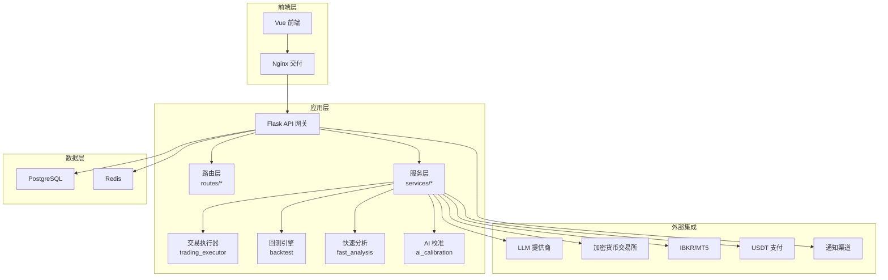
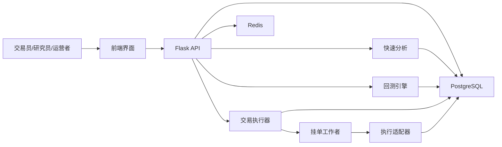
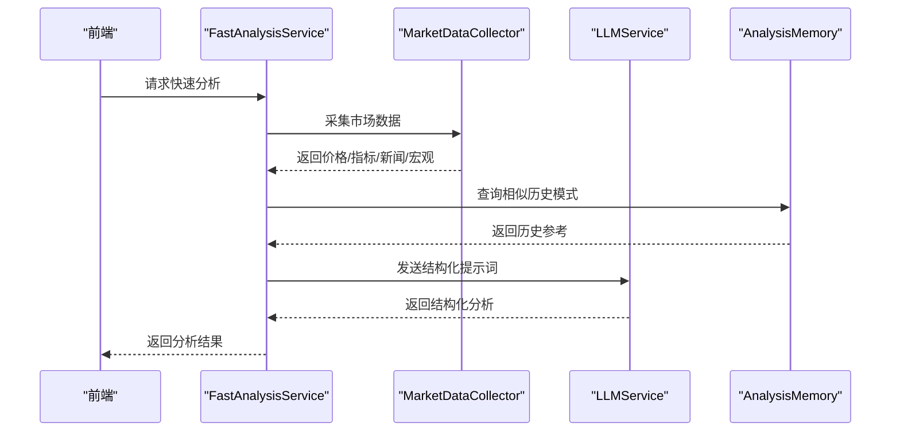
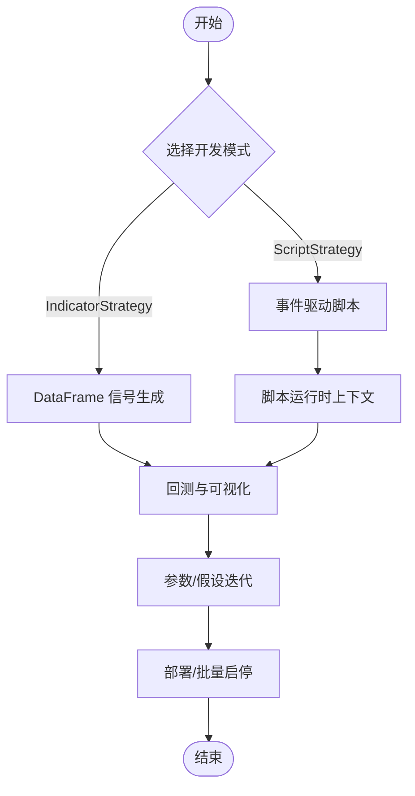
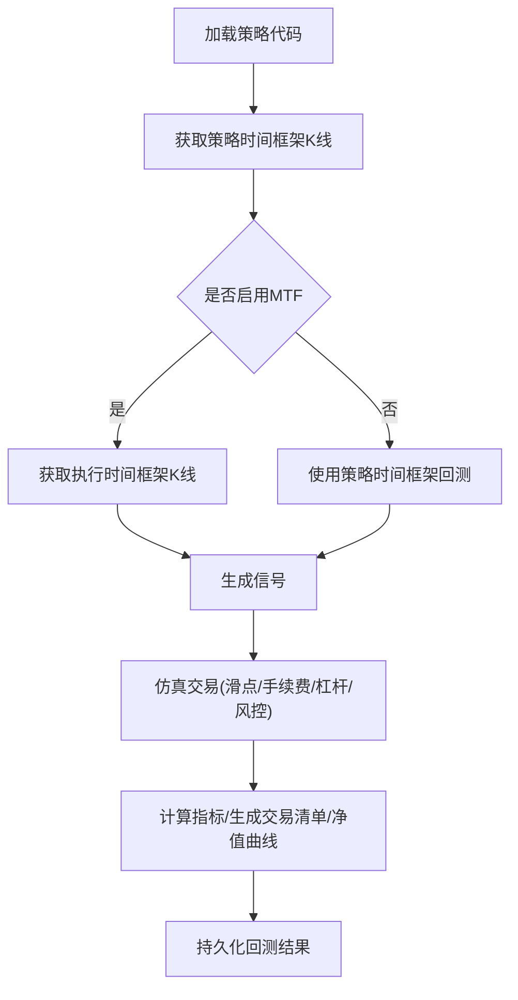
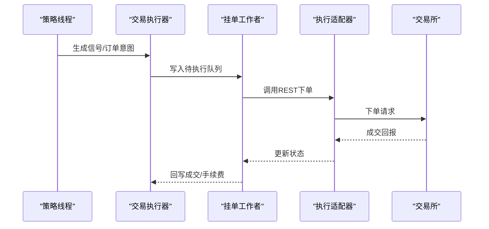
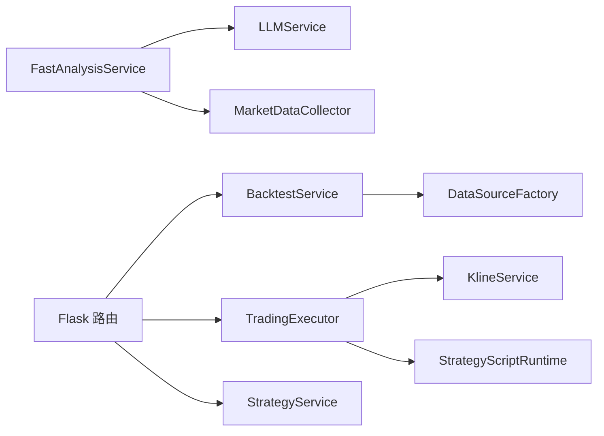

# 核心功能特性

<cite>
**本文引用的文件**
- [README.md](file://README.md)
- [backend_api_python/README.md](file://backend_api_python/README.md)
- [backend_api_python/run.py](file://backend_api_python/run.py)
- [backend_api_python/app/__init__.py](file://backend_api_python/app/__init__.py)
- [backend_api_python/app/services/fast_analysis.py](file://backend_api_python/app/services/fast_analysis.py)
- [backend_api_python/app/services/ai_calibration.py](file://backend_api_python/app/services/ai_calibration.py)
- [backend_api_python/app/services/backtest.py](file://backend_api_python/app/services/backtest.py)
- [backend_api_python/app/services/trading_executor.py](file://backend_api_python/app/services/trading_executor.py)
- [backend_api_python/app/services/live_trading/binance.py](file://backend_api_python/app/services/live_trading/binance.py)
- [backend_api_python/app/data_sources/factory.py](file://backend_api_python/app/data_sources/factory.py)
- [backend_api_python/app/routes/strategy.py](file://backend_api_python/app/routes/strategy.py)
</cite>

## 目录
1. [简介](#简介)
2. [项目结构](#项目结构)
3. [核心组件](#核心组件)
4. [架构总览](#架构总览)
5. [详细组件分析](#详细组件分析)
6. [依赖关系分析](#依赖关系分析)
7. [性能考量](#性能考量)
8. [故障排查指南](#故障排查指南)
9. [结论](#结论)
10. [附录](#附录)

## 简介
QuantDinger 是一个面向团队与运营者的“自托管、本地优先”的量化交易与算法交易平台，覆盖从 AI 市场分析、Python 指标与策略开发、回测与快照、到实盘执行与运营监控的全链路工作流。其核心优势在于：
- 一套栈替代五套工具：研究、策略、回测、执行、告警与运营一体化
- AI 置于工作流内部而非旁观者
- 在保持 Python 原生灵活性的同时提供产品化体验
- 支持私有化部署与商业化能力（会员、积分、支付、管理员控制）

## 项目结构
后端采用 Flask 应用工厂模式，按领域拆分服务层与路由层，配合 PostgreSQL 存储与可选 Redis 支撑运行时协调。前端为预构建包，通过 Nginx 提供静态交付。

图表来源
- [backend_api_python/app/__init__.py](file://backend_api_python/app/__init__.py)
- [backend_api_python/app/services/fast_analysis.py](file://backend_api_python/app/services/fast_analysis.py)
- [backend_api_python/app/services/backtest.py](file://backend_api_python/app/services/backtest.py)
- [backend_api_python/app/services/trading_executor.py](file://backend_api_python/app/services/trading_executor.py)
- [backend_api_python/app/services/ai_calibration.py](file://backend_api_python/app/services/ai_calibration.py)

章节来源
- [README.md](file://README.md)
- [backend_api_python/README.md](file://backend_api_python/README.md)

## 核心组件
- AI 快速分析与记忆：统一数据采集、单次 LLM 调用、结构化输出、历史记忆与校准
- 回测与快照：多时间框架回测、交易仿真、指标计算、结果持久化
- 实盘执行：策略线程化运行、信号去重、挂单派发、多交易所适配
- 数据源工厂：按市场类型抽象统一接口，支持多市场数据接入
- 路由与策略编排：策略 CRUD、批量启停、回测历史查询、模板导入

章节来源
- [backend_api_python/app/services/fast_analysis.py](file://backend_api_python/app/services/fast_analysis.py)
- [backend_api_python/app/services/backtest.py](file://backend_api_python/app/services/backtest.py)
- [backend_api_python/app/services/trading_executor.py](file://backend_api_python/app/services/trading_executor.py)
- [backend_api_python/app/data_sources/factory.py](file://backend_api_python/app/data_sources/factory.py)
- [backend_api_python/app/routes/strategy.py](file://backend_api_python/app/routes/strategy.py)

## 架构总览
QuantDinger 的执行模型强调“数据采集—回测—实盘执行—运营监控”的闭环：
- 市场数据通过可插拔数据层拉取
- 回测在服务端运行，支持策略快照与参数空间探索
- 实盘策略通过线程运行产生订单意图，由挂单工作者与执行适配器完成成交
- 加密货币实盘与行情采集解耦，降低耦合与风险

图表来源
- [backend_api_python/app/__init__.py](file://backend_api_python/app/__init__.py)
- [backend_api_python/app/services/fast_analysis.py](file://backend_api_python/app/services/fast_analysis.py)
- [backend_api_python/app/services/backtest.py](file://backend_api_python/app/services/backtest.py)
- [backend_api_python/app/services/trading_executor.py](file://backend_api_python/app/services/trading_executor.py)

## 详细组件分析

### AI 市场分析与决策支持
- 统一数据采集：基于 MarketDataCollector，整合价格、K 线、技术指标、宏观、新闻、预测市场等
- 结构化分析：单次 LLM 调用，输出包含决策、置信度、入场/止损/止盈、风险评估等
- 记忆与回溯：历史分析记忆库，相似模式检索与复盘
- 自动校准：基于历史验证结果的阈值校准，持续优化决策阈值

图表来源
- [backend_api_python/app/services/fast_analysis.py](file://backend_api_python/app/services/fast_analysis.py)
- [backend_api_python/app/services/ai_calibration.py](file://backend_api_python/app/services/ai_calibration.py)

章节来源
- [backend_api_python/app/services/fast_analysis.py](file://backend_api_python/app/services/fast_analysis.py)
- [backend_api_python/app/services/ai_calibration.py](file://backend_api_python/app/services/ai_calibration.py)

### 指标与策略开发
- 开发模式
  - IndicatorStrategy：基于 DataFrame 的信号生成与可视化回测
  - ScriptStrategy：事件驱动的脚本策略，支持上下文参数、显式订单控制与实盘对齐
- 编译与校验：内置脚本编译与运行时校验，提供质量提示与自动修复建议
- 模板与批量：提供策略模板与批量创建/启停能力，提升团队协作效率

图表来源
- [backend_api_python/app/routes/strategy.py](file://backend_api_python/app/routes/strategy.py)
- [backend_api_python/app/services/backtest.py](file://backend_api_python/app/services/backtest.py)

章节来源
- [backend_api_python/app/routes/strategy.py](file://backend_api_python/app/routes/strategy.py)

### 回测与迭代
- 多时间框架回测：策略时间框架与执行时间框架分离，支持高精度 1 分钟回测与标准蜡烛回测
- 交易仿真：基于滑点、手续费、杠杆与风控规则进行仿真交易，生成交易清单与净值曲线
- 结果持久化：回测运行记录、交易明细、净值点位均持久化，支持历史复盘与对比

图表来源
- [backend_api_python/app/services/backtest.py](file://backend_api_python/app/services/backtest.py)

章节来源
- [backend_api_python/app/services/backtest.py](file://backend_api_python/app/services/backtest.py)

### 实盘交易与运营
- 策略线程化执行：每策略独立线程，按 K 线/价格周期计算信号，写入待执行队列
- 信号去重与优先级：同根 K 烛内重复信号去重，严格的状态机与信号优先级保证执行顺序
- 执行适配器：统一 REST 接口对接多家交易所，支持币安、OKX、Bybit、Bitget、Kraken、Gate.io、HTX、Coinbase、Deepcoin 等
- 挂单工作者：轮询待执行订单，触发执行与通知

图表来源
- [backend_api_python/app/services/trading_executor.py](file://backend_api_python/app/services/trading_executor.py)
- [backend_api_python/app/services/live_trading/binance.py](file://backend_api_python/app/services/live_trading/binance.py)

章节来源
- [backend_api_python/app/services/trading_executor.py](file://backend_api_python/app/services/trading_executor.py)
- [backend_api_python/app/services/live_trading/binance.py](file://backend_api_python/app/services/live_trading/binance.py)

### 多用户管理与商业化
- 用户体系：基于角色的访问控制（管理员/经理/用户/查看者），支持用户增删改与密码重置
- 多语言与国际化：前端语言头透传，后端按语言生成提示与反馈
- 商业化能力：会员计划、积分、USDT 支付、管理员侧计费与控制

章节来源
- [backend_api_python/README.md](file://backend_api_python/README.md)
- [backend_api_python/app/__init__.py](file://backend_api_python/app/__init__.py)

## 依赖关系分析
- 组件耦合
  - FastAnalysisService 依赖 LLMService 与 MarketDataCollector，输出结构化分析
  - BacktestService 依赖数据源工厂与指标解析器，输出回测结果
  - TradingExecutor 依赖 K 线服务与脚本运行时，产出订单意图
  - 路由层聚合策略服务、回测服务与执行器，提供统一 API
- 外部依赖
  - 交易所 REST 接口（如币安、OKX 等）
  - LLM 提供商（OpenRouter/OpenAI/Gemini/DeepSeek 等）
  - 数据提供商（yfinance、FinMind、AkShare 等，按需配置）

图表来源
- [backend_api_python/app/services/fast_analysis.py](file://backend_api_python/app/services/fast_analysis.py)
- [backend_api_python/app/services/backtest.py](file://backend_api_python/app/services/backtest.py)
- [backend_api_python/app/services/trading_executor.py](file://backend_api_python/app/services/trading_executor.py)
- [backend_api_python/app/data_sources/factory.py](file://backend_api_python/app/data_sources/factory.py)
- [backend_api_python/app/routes/strategy.py](file://backend_api_python/app/routes/strategy.py)

章节来源
- [backend_api_python/app/data_sources/factory.py](file://backend_api_python/app/data_sources/factory.py)
- [backend_api_python/app/routes/strategy.py](file://backend_api_python/app/routes/strategy.py)

## 性能考量
- 回测缓存：K 线数据带 TTL 的内存缓存，减少重复外部调用
- 线程上限：策略线程数上限与资源状态打印，避免过度并发导致系统不可用
- 信号去重：按策略+标的+信号类型+时间戳的去重窗口，避免高频重复下单
- 执行精度：MTF 回测在满足条件时使用更高精度的执行时间框架，兼顾性能与准确性

章节来源
- [backend_api_python/app/services/backtest.py](file://backend_api_python/app/services/backtest.py)
- [backend_api_python/app/services/trading_executor.py](file://backend_api_python/app/services/trading_executor.py)

## 故障排查指南
- 启动与安全
  - SECRET_KEY 默认值会被自动替换并提示设置持久密钥
  - 代理环境变量统一注入，避免国内金融数据源绕过代理导致访问失败
- 数据与网络
  - PROXY_URL 与 NO_PROXY 配置，确保国内数据源直连、海外数据经代理
  - 数据源工厂按市场类型映射，错误的市场别名可能导致数据源创建失败
- 实盘执行
  - 交易所 REST 接口签名、时间同步与过滤器精度处理（如币安的步进与最小下单量）
  - 挂单工作者与执行适配器的错误码识别与重试策略
- 回测与策略
  - 回测范围与时间框架限制，避免超长回测导致内存与性能问题
  - 策略脚本语法与运行时校验，缺失必要函数或未声明参数默认值会触发提示

章节来源
- [backend_api_python/run.py](file://backend_api_python/run.py)
- [backend_api_python/app/__init__.py](file://backend_api_python/app/__init__.py)
- [backend_api_python/app/data_sources/factory.py](file://backend_api_python/app/data_sources/factory.py)
- [backend_api_python/app/services/live_trading/binance.py](file://backend_api_python/app/services/live_trading/binance.py)
- [backend_api_python/app/services/backtest.py](file://backend_api_python/app/services/backtest.py)
- [backend_api_python/app/routes/strategy.py](file://backend_api_python/app/routes/strategy.py)

## 结论
QuantDinger 以“自托管、本地优先”为核心理念，将 AI 研究、Python 策略开发、回测与实盘执行整合为统一操作系统，显著缩短从想法到执行的路径，同时提供多用户、商业化与运营能力。通过模块化设计与可插拔数据/执行适配器，平台既保持产品化体验，又不牺牲 Python 原生灵活性与扩展性。

## 附录
- 快速开始与部署：参见根目录与后端 README 的 Docker 一键启动说明
- 策略开发指南与示例：参见 docs 目录下的开发指南与示例脚本
- 市场覆盖：支持加密货币、美股（IBKR）、外汇（MT5）与预测市场研究

章节来源
- [README.md](file://README.md)
- [backend_api_python/README.md](file://backend_api_python/README.md)