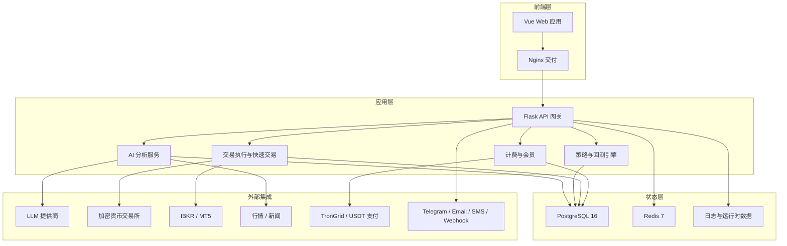
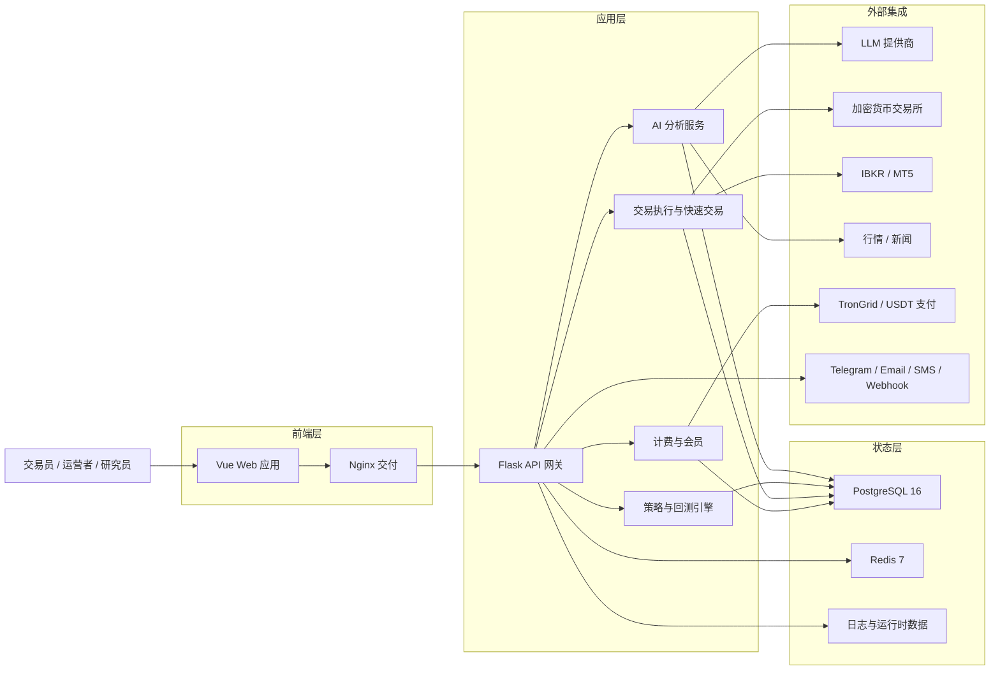
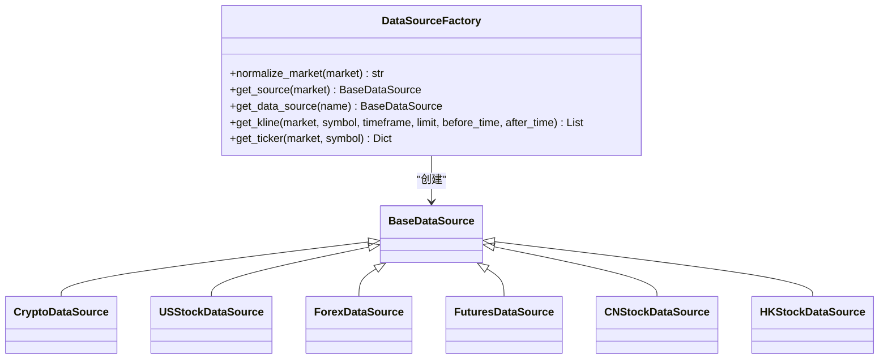
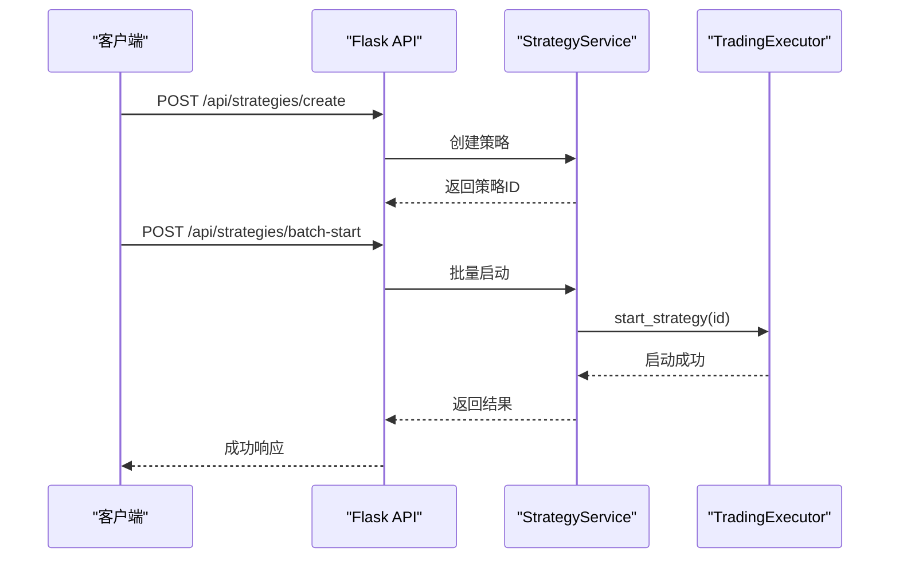
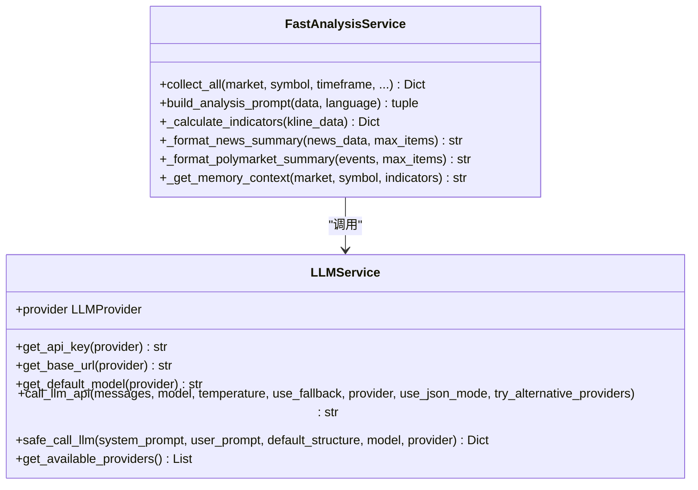
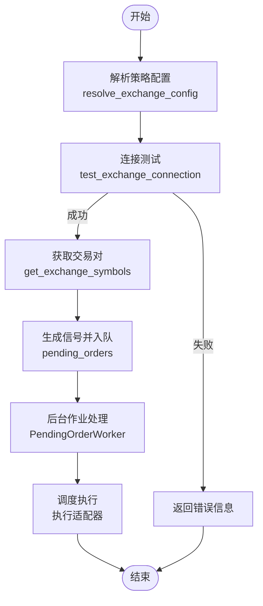
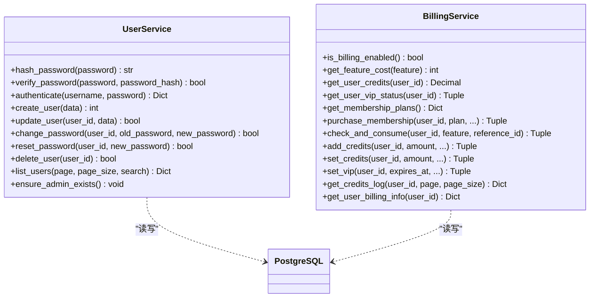
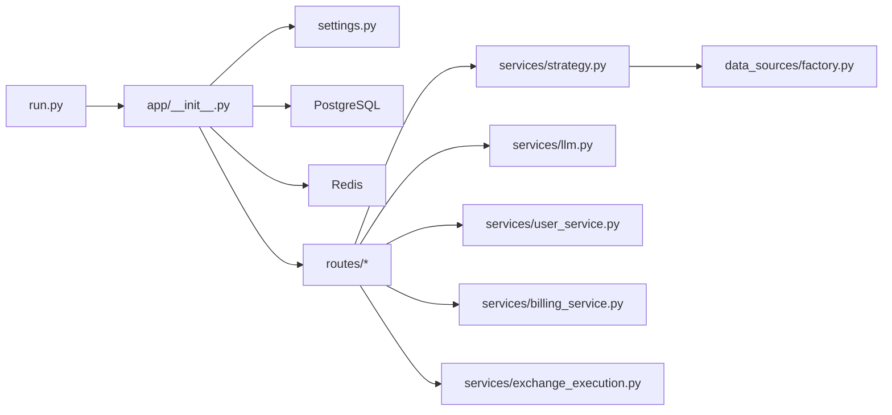

# 系统特性对比

<cite>
**本文引用的文件**
- [README.md](file://README.md)
- [backend_api_python/README.md](file://backend_api_python/README.md)
- [docs/README_CN.md](file://docs/README_CN.md)
- [backend_api_python/run.py](file://backend_api_python/run.py)
- [backend_api_python/app/__init__.py](file://backend_api_python/app/__init__.py)
- [backend_api_python/app/config/settings.py](file://backend_api_python/app/config/settings.py)
- [backend_api_python/app/data_sources/factory.py](file://backend_api_python/app/data_sources/factory.py)
- [backend_api_python/app/services/strategy.py](file://backend_api_python/app/services/strategy.py)
- [backend_api_python/app/routes/strategy.py](file://backend_api_python/app/routes/strategy.py)
- [backend_api_python/app/services/llm.py](file://backend_api_python/app/services/llm.py)
- [backend_api_python/app/services/user_service.py](file://backend_api_python/app/services/user_service.py)
- [backend_api_python/app/services/billing_service.py](file://backend_api_python/app/services/billing_service.py)
- [backend_api_python/app/services/exchange_execution.py](file://backend_api_python/app/services/exchange_execution.py)
- [backend_api_python/app/services/fast_analysis.py](file://backend_api_python/app/services/fast_analysis.py)
- [backend_api_python/migrations/init.sql](file://backend_api_python/migrations/init.sql)
</cite>

## 目录
1. [简介](#简介)
2. [项目结构](#项目结构)
3. [核心组件](#核心组件)
4. [架构总览](#架构总览)
5. [详细组件分析](#详细组件分析)
6. [依赖关系分析](#依赖关系分析)
7. [性能考量](#性能考量)
8. [故障排查指南](#故障排查指南)
9. [结论](#结论)
10. [附录](#附录)

## 简介
QuantDinger是一个可自托管、以本地优先为设计原则的量化交易与算法交易平台，将AI研究、Python策略生成、回测验证和实盘执行整合到一套系统中。其核心目标是通过“研究到执行一体化”的工作流，降低从想法到执行的成本，同时保留Python灵活性与产品化体验，并天然支持商业化。

## 项目结构
QuantDinger采用前后端分离的Docker Compose部署架构，后端为Flask + Python服务层，前端为预构建Vue应用，数据库采用PostgreSQL，缓存与后台作业使用Redis。核心模块包括：
- 应用入口与启动：run.py、app/__init__.py
- 配置与环境：app/config/settings.py
- 数据源与市场覆盖：app/data_sources/factory.py
- 策略与回测：app/services/strategy.py、app/routes/strategy.py
- AI分析与多模型：app/services/fast_analysis.py、app/services/llm.py
- 用户与计费：app/services/user_service.py、app/services/billing_service.py
- 交易执行与凭证：app/services/exchange_execution.py
- 数据库Schema：migrations/init.sql

**图表来源**
- [README.md](file://README.md)
- [backend_api_python/README.md](file://backend_api_python/README.md)
- [backend_api_python/app/__init__.py](file://backend_api_python/app/__init__.py)

**章节来源**
- [README.md](file://README.md)
- [backend_api_python/README.md](file://backend_api_python/README.md)
- [docs/README_CN.md](file://docs/README_CN.md)

## 核心组件
- 自托管与本地优先：默认可自托管，基础设施、密钥与业务数据由用户掌控，支持Docker Compose一键部署。
- 研究到执行一体化：AI分析、图表、策略、回测、快速交易与实盘运营在同一条产品链路中。
- Python原生与AI辅助：支持DataFrame风格的IndicatorStrategy与事件驱动的ScriptStrategy，亦可借助AI加速草拟与迭代。
- 多市场覆盖：加密货币（现货/永续/期权）、美股（IBKR）、外汇（MT5）、预测市场（Polymarket）。
- 多用户与商业化：基于PostgreSQL的多用户体系、OAuth登录、通知渠道、会员与积分体系、USDT支付。
- 可靠的执行与数据：统一数据源工厂、策略生命周期管理、挂单队列与后台作业、分析记忆与校准。

**章节来源**
- [README.md](file://README.md)
- [backend_api_python/README.md](file://backend_api_python/README.md)
- [docs/README_CN.md](file://docs/README_CN.md)

## 架构总览
QuantDinger的系统架构围绕“可自托管、AI原生、Python优先、商业化就绪”展开。后端通过Flask提供REST API，前端通过Nginx交付，PostgreSQL承载用户、策略、历史与状态，Redis支撑后台作业与运行时协调。AI层集成多提供商LLM，支持快速分析、指标与策略生成、分析记忆与校准。交易层通过统一适配器对接加密货币交易所、IBKR与MT5。

**图表来源**
- [README.md](file://README.md)
- [backend_api_python/app/__init__.py](file://backend_api_python/app/__init__.py)

## 详细组件分析

### 数据源与市场覆盖
- 数据源工厂支持多市场抽象，包括加密货币、美股、外汇、期货、港股、A股等，提供K线与实时报价统一接口。
- 通过别名映射与规范化，确保调用侧无需关心具体实现细节。
- 为每类市场提供便捷的K线与报价获取方法，异常时返回空或默认值，保证流程健壮性。

**图表来源**
- [backend_api_python/app/data_sources/factory.py](file://backend_api_python/app/data_sources/factory.py)

**章节来源**
- [backend_api_python/app/data_sources/factory.py](file://backend_api_python/app/data_sources/factory.py)

### 策略与回测
- 支持两类策略：IndicatorStrategy（基于DataFrame的信号与回测）与ScriptStrategy（事件驱动、显式下单意图）。
- 提供策略模板加载、批量创建与启停、交易与持仓查询、回测运行与历史查询、策略快照解析与持久化。
- 生命周期管理：启动时自动恢复IndicatorStrategy运行状态，避免僵尸状态；支持批量启停与删除。

**图表来源**
- [backend_api_python/app/routes/strategy.py](file://backend_api_python/app/routes/strategy.py)
- [backend_api_python/app/services/strategy.py](file://backend_api_python/app/services/strategy.py)

**章节来源**
- [backend_api_python/app/routes/strategy.py](file://backend_api_python/app/routes/strategy.py)
- [backend_api_python/app/services/strategy.py](file://backend_api_python/app/services/strategy.py)

### AI分析与多模型
- FastAnalysisService通过统一数据采集器收集价格、技术指标、宏观、新闻、预测市场与基本面数据，进行一次性结构化分析。
- LLMService支持多提供商（OpenRouter、OpenAI、Google Gemini、DeepSeek、Grok、Minimax、自定义），具备自动切换与降级策略。
- 分析记忆与校准：支持相似模式检索、历史分析存储、置信度校准与反射式工作进程。

**图表来源**
- [backend_api_python/app/services/fast_analysis.py](file://backend_api_python/app/services/fast_analysis.py)
- [backend_api_python/app/services/llm.py](file://backend_api_python/app/services/llm.py)

**章节来源**
- [backend_api_python/app/services/fast_analysis.py](file://backend_api_python/app/services/fast_analysis.py)
- [backend_api_python/app/services/llm.py](file://backend_api_python/app/services/llm.py)

### 交易执行与凭证
- 执行层通过统一配置解析与安全脱敏，支持加密货币交易所、IBKR与MT5。
- 提供交换机连接测试、交易对列表获取、凭证加密存储与解密、策略配置装载。
- 挂单队列与后台作业：支持挂单轮询、组合监控、USDT订单后台扫描与恢复。

**图表来源**
- [backend_api_python/app/services/exchange_execution.py](file://backend_api_python/app/services/exchange_execution.py)
- [backend_api_python/app/services/strategy.py](file://backend_api_python/app/services/strategy.py)

**章节来源**
- [backend_api_python/app/services/exchange_execution.py](file://backend_api_python/app/services/exchange_execution.py)
- [backend_api_python/app/services/strategy.py](file://backend_api_python/app/services/strategy.py)

### 用户与计费
- 多用户体系：支持角色（viewer/user/manager/admin）、密码哈希（bcrypt优先，回退SHA256）、OAuth登录、通知配置、时区与令牌版本控制。
- 计费与会员：积分余额、功能扣费、会员套餐（月卡/年卡/终身）、USDT支付、积分日志与审计。
- 数据库Schema：用户表、积分日志、会员订单、USDT订单、OAuth状态、验证码、登录尝试、安全审计、策略与回测运行记录等。

**图表来源**
- [backend_api_python/app/services/user_service.py](file://backend_api_python/app/services/user_service.py)
- [backend_api_python/app/services/billing_service.py](file://backend_api_python/app/services/billing_service.py)
- [backend_api_python/migrations/init.sql](file://backend_api_python/migrations/init.sql)

**章节来源**
- [backend_api_python/app/services/user_service.py](file://backend_api_python/app/services/user_service.py)
- [backend_api_python/app/services/billing_service.py](file://backend_api_python/app/services/billing_service.py)
- [backend_api_python/migrations/init.sql](file://backend_api_python/migrations/init.sql)

## 依赖关系分析
- 启动与配置：run.py负责加载.env、设置代理、注入Python路径并创建Flask应用；app/__init__.py负责数据库初始化、管理员账户创建、后台作业启动与策略恢复。
- 配置中心：settings.py从环境变量读取主机、端口、调试、密钥、速率限制、功能开关等。
- 数据与服务：数据源工厂统一抽象多市场；策略服务提供策略生命周期、回测与执行；AI服务提供多模型LLM调用；用户与计费服务提供多用户与商业化能力；执行服务提供统一适配器与凭证管理。

**图表来源**
- [backend_api_python/run.py](file://backend_api_python/run.py)
- [backend_api_python/app/__init__.py](file://backend_api_python/app/__init__.py)
- [backend_api_python/app/config/settings.py](file://backend_api_python/app/config/settings.py)
- [backend_api_python/app/data_sources/factory.py](file://backend_api_python/app/data_sources/factory.py)
- [backend_api_python/app/services/strategy.py](file://backend_api_python/app/services/strategy.py)
- [backend_api_python/app/services/llm.py](file://backend_api_python/app/services/llm.py)
- [backend_api_python/app/services/user_service.py](file://backend_api_python/app/services/user_service.py)
- [backend_api_python/app/services/billing_service.py](file://backend_api_python/app/services/billing_service.py)
- [backend_api_python/app/services/exchange_execution.py](file://backend_api_python/app/services/exchange_execution.py)

**章节来源**
- [backend_api_python/run.py](file://backend_api_python/run.py)
- [backend_api_python/app/__init__.py](file://backend_api_python/app/__init__.py)
- [backend_api_python/app/config/settings.py](file://backend_api_python/app/config/settings.py)

## 性能考量
- JSON序列化安全：自定义SafeJSONProvider将NaN/Inf替换为null，避免前端解析错误。
- 启动与恢复：启动时自动恢复IndicatorStrategy运行状态，避免僵尸策略占用资源。
- 并发与限流：策略服务对连接测试使用信号量限制并发，防止CPU与限流压力。
- 缓存与索引：PostgreSQL通过索引优化查询性能，Redis用于后台作业与运行时协调。
- 代理与网络：run.py支持统一代理配置，避免国内数据源绕路。

**章节来源**
- [backend_api_python/app/__init__.py](file://backend_api_python/app/__init__.py)
- [backend_api_python/app/services/strategy.py](file://backend_api_python/app/services/strategy.py)
- [backend_api_python/run.py](file://backend_api_python/run.py)

## 故障排查指南
- 数据库连接失败：检查DATABASE_URL格式与PostgreSQL服务状态。
- 外网请求失败：配置PROXY_URL；注意国内数据源域名白名单。
- 禁用自动恢复：设置DISABLE_RESTORE_RUNNING_STRATEGIES=true。
- 禁用挂单后台：设置ENABLE_PENDING_ORDER_WORKER=false。
- 策略代码质量：提供代码质量检测与修复建议，帮助快速定位缺失函数、参数声明与下单意图等问题。
- LLM调用失败：检查API Key配置与提供商可用性，必要时启用备用提供商。

**章节来源**
- [backend_api_python/README.md](file://backend_api_python/README.md)
- [backend_api_python/app/routes/strategy.py](file://backend_api_python/app/routes/strategy.py)
- [backend_api_python/app/services/llm.py](file://backend_api_python/app/services/llm.py)

## 结论
QuantDinger通过“自托管、AI原生、Python优先、商业化就绪”的设计，将研究、策略开发、回测与实盘执行整合为一条可部署的工作流。相比传统交易工具与开源量化平台，QuantDinger在以下方面形成差异化优势：
- 研究到执行一体化：AI分析、图表、策略、回测、快速交易与实盘运营闭环。
- 自托管与隐私：基础设施、密钥与数据由用户掌控，满足合规与隐私需求。
- Python灵活性与产品化体验：既保留Python策略控制权，又提供现代化前端与运营能力。
- 商业化原生：会员、积分、计费与USDT支付能力内建，便于产品化与增长。

## 附录

### 典型设置对比（概念性）
- 传统交易工具：AI聊天工具与真实策略流程割裂；图表、脚本、机器人、通知系统各自分散；SaaS工具对密钥与数据控制有限；只有研究工具，没有运营层。
- 开源量化平台：多工具拼装，缺乏统一工作流与运营能力。
- 商业解决方案：通常为封闭系统，难以自托管与二次定制。
- QuantDinger：AI分析、AI生成代码、回测反馈、执行流程在同一产品中闭环；统一部署平台承载图表、策略、运行时、通知与运营；可自托管架构，基础设施、密钥与业务数据由用户掌控；内置多用户、权限、积分、计费、后台管理与部署能力。

**章节来源**
- [README.md](file://README.md)
- [docs/README_CN.md](file://docs/README_CN.md)