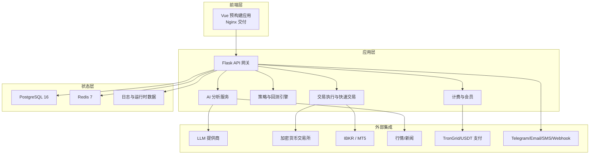
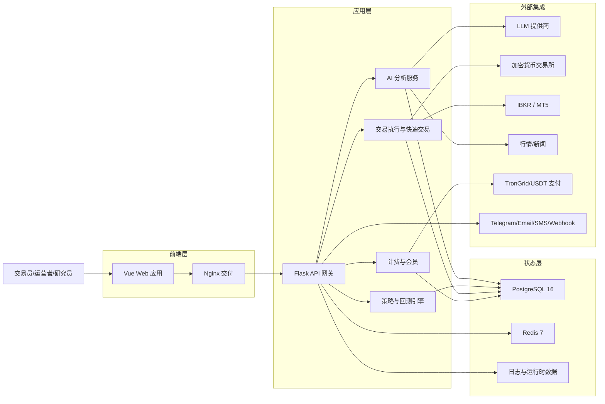
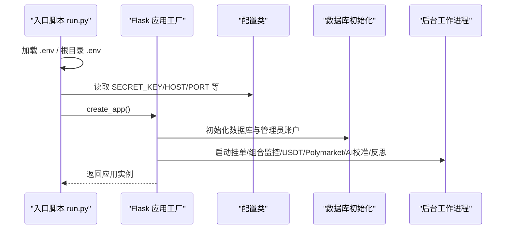
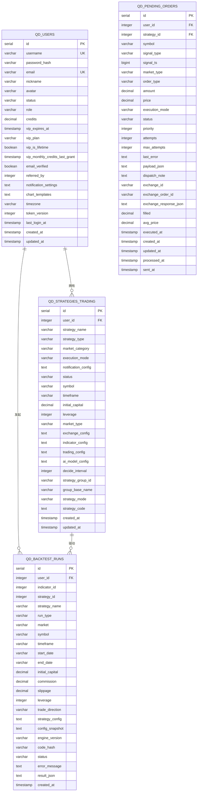
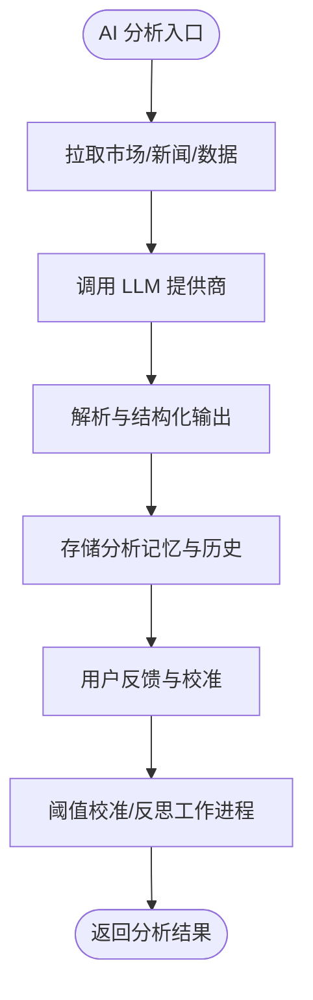
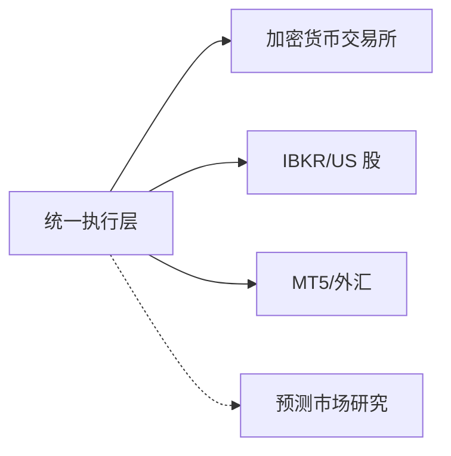
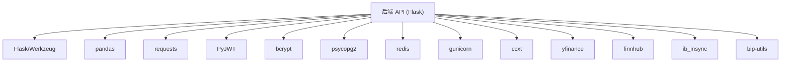

# 项目概述

<cite>
**本文引用的文件**
- [README.md](file://README.md)
- [docs/README_CN.md](file://docs/README_CN.md)
- [backend_api_python/README.md](file://backend_api_python/README.md)
- [DEVELOPMENT.md](file://DEVELOPMENT.md)
- [backend_api_python/run.py](file://backend_api_python/run.py)
- [backend_api_python/env.example](file://backend_api_python/env.example)
- [docker-compose.yml](file://docker-compose.yml)
- [backend_api_python/app/__init__.py](file://backend_api_python/app/__init__.py)
- [backend_api_python/app/config/settings.py](file://backend_api_python/app/config/settings.py)
- [backend_api_python/migrations/init.sql](file://backend_api_python/migrations/init.sql)
- [backend_api_python/requirements.txt](file://backend_api_python/requirements.txt)
- [backend_api_python/app/routes/__init__.py](file://backend_api_python/app/routes/__init__.py)
- [docs/STRATEGY_DEV_GUIDE.md](file://docs/STRATEGY_DEV_GUIDE.md)
- [docs/CROSS_SECTIONAL_STRATEGY_GUIDE_EN.md](file://docs/CROSS_SECTIONAL_STRATEGY_GUIDE_EN.md)
</cite>

## 目录
1. [简介](#简介)
2. [项目结构](#项目结构)
3. [核心组件](#核心组件)
4. [架构总览](#架构总览)
5. [详细组件分析](#详细组件分析)
6. [依赖分析](#依赖分析)
7. [性能考虑](#性能考虑)
8. [故障排查指南](#故障排查指南)
9. [结论](#结论)
10. [附录](#附录)

## 简介
QuantDinger 是一款“自托管、以本地优先为设计原则”的量化交易与算法交易平台，目标是将“AI 研究、Python 策略生成、回测验证、实盘执行、组合监控与通知、多用户运营与商业化”整合为一套可部署的一体化操作系统。其核心价值主张包括：
- 一套系统替代多个零散工具，打通从研究到执行的全链路
- AI 嵌入工作流而非旁观者，提升研究效率与可复盘性
- 保留 Python 原生灵活性的同时，提供产品化体验
- 支持私有化部署与商业化能力（会员、积分、USDT 支付、后台管理）

与传统交易工具相比，QuantDinger 的独特之处在于：
- 自托管架构：凭证、策略代码、交易流程与运营数据完全可控
- 研究到执行一体化：AI 分析、图表、策略、回测、快速交易与实盘运营闭环
- 多市场覆盖：加密货币、美股（IBKR）、外汇（MT5）、预测市场（Polymarket）研究
- 商业化原生：多用户、计费、积分、后台管理与 USDT 支付

**章节来源**
- [README.md:34-103](file://README.md#L34-L103)
- [docs/README_CN.md:34-103](file://docs/README_CN.md#L34-L103)

## 项目结构
仓库采用前后端分离与多服务编排的结构：
- 后端 API（Flask + Python）：位于 backend_api_python，提供 REST 接口、策略运行时、AI 分析、回测、交易执行、计费与多用户管理
- 前端：预构建静态资源，由 Nginx 提供服务
- 数据层：PostgreSQL（状态与历史）、Redis（缓存与后台工作进程）
- 外部集成：LLM 提供商、交易所/经纪商、支付与通知通道



**图表来源**
- [README.md:269-321](file://README.md#L269-L321)
- [docs/README_CN.md:269-321](file://docs/README_CN.md#L269-L321)

**章节来源**
- [README.md:466-484](file://README.md#L466-L484)
- [backend_api_python/README.md:15-33](file://backend_api_python/README.md#L15-L33)
- [DEVELOPMENT.md:39-63](file://DEVELOPMENT.md#L39-L63)

## 核心组件
- Flask 应用工厂与启动钩子：负责应用初始化、数据库与管理员账户准备、后台工作进程启动与策略恢复
- REST 蓝图路由：按功能域划分的 API 蓝图，覆盖认证、用户管理、指标与回测、市场数据、AI 快速分析、策略、交易、计费、快速交易、Polymarket、实验等
- 配置系统：集中于环境变量，支持认证、数据库、AI/LLM、OAuth、安全、计费、USDT 支付、后台工作进程、AI 调优、缓存等
- 数据层：PostgreSQL 初始化脚本定义用户、策略、回测、挂单、通知、分析记忆、交换凭证、手动持仓、提醒与监控等核心表
- 部署编排：Docker Compose 提供一键启动 PostgreSQL、Redis、后端 API、前端 Nginx，并内置健康检查与端口映射

**章节来源**
- [backend_api_python/app/__init__.py:212-269](file://backend_api_python/app/__init__.py#L212-L269)
- [backend_api_python/app/routes/__init__.py:7-53](file://backend_api_python/app/routes/__init__.py#L7-L53)
- [backend_api_python/app/config/settings.py:1-99](file://backend_api_python/app/config/settings.py#L1-L99)
- [backend_api_python/migrations/init.sql:1-800](file://backend_api_python/migrations/init.sql#L1-L800)
- [docker-compose.yml:25-167](file://docker-compose.yml#L25-L167)

## 架构总览
QuantDinger 的执行模型强调“数据拉取—回测—实盘—执行”的分层解耦：
- 市场数据通过可插拔的数据层拉取
- 回测在服务端策略引擎中执行，支持策略快照
- 实盘策略由运行时服务生成下单意图
- 待执行订单经由交易所专用执行适配器处理
- 加密货币实盘执行与行情采集刻意分层



**图表来源**
- [README.md:269-321](file://README.md#L269-L321)
- [docs/README_CN.md:269-321](file://docs/README_CN.md#L269-L321)

**章节来源**
- [README.md:259-266](file://README.md#L259-L266)
- [docs/README_CN.md:259-266](file://docs/README_CN.md#L259-L266)

## 详细组件分析

### 启动与配置组件
- 应用入口与安全检查：加载 .env、设置代理、注入 Python 路径、创建应用实例；在生产模式下若 SECRET_KEY 使用默认值则自动生成随机密钥并提示持久化
- 配置类：集中读取环境变量，支持主机、端口、调试、日志、速率限制、缓存与请求日志开关
- 后台工作进程：按配置启动挂单工作进程、组合监控、USDT 订单工作进程、Polymarket 工作进程、AI 校准与反思工作进程；支持启动时自动恢复 IndicatorStrategy 运行



**图表来源**
- [backend_api_python/run.py:17-134](file://backend_api_python/run.py#L17-L134)
- [backend_api_python/app/__init__.py:212-269](file://backend_api_python/app/__init__.py#L212-L269)
- [backend_api_python/app/config/settings.py:1-99](file://backend_api_python/app/config/settings.py#L1-L99)

**章节来源**
- [backend_api_python/run.py:104-134](file://backend_api_python/run.py#L104-L134)
- [backend_api_python/app/__init__.py:54-210](file://backend_api_python/app/__init__.py#L54-L210)

### 数据层与策略运行组件
- 数据库初始化：PostgreSQL 初始化脚本定义用户、策略、回测、挂单、通知、分析记忆、交换凭证、手动持仓、提醒与监控等核心表，包含索引与外键约束
- 策略类型：支持 IndicatorStrategy（基于数据框的信号与回测）与 ScriptStrategy（事件驱动的运行时控制与实盘对齐）
- 回测与快照：支持回测运行记录、交易明细与资金曲线点位持久化
- 交易执行：统一执行层对接多家加密货币交易所，支持快速交易与挂单队列



**图表来源**
- [backend_api_python/migrations/init.sql:8-593](file://backend_api_python/migrations/init.sql#L8-L593)

**章节来源**
- [backend_api_python/migrations/init.sql:195-281](file://backend_api_python/migrations/init.sql#L195-L281)
- [docs/STRATEGY_DEV_GUIDE.md:7-17](file://docs/STRATEGY_DEV_GUIDE.md#L7-L17)

### AI 与分析组件
- 快速分析：单次 LLM 调用的多因子结构化分析，支持历史存储、相似模式检索与用户反馈
- AI 校准与反思：基于历史回测结果进行阈值校准与定期反思，提升输出稳定性
- 多模型集成：支持 OpenRouter、OpenAI、Gemini、DeepSeek 等提供商，可选多模型协同与置信度校准



**图表来源**
- [backend_api_python/app/__init__.py:77-150](file://backend_api_python/app/__init__.py#L77-L150)

**章节来源**
- [backend_api_python/env.example:64-94](file://backend_api_python/env.example#L64-L94)
- [README.md:176-214](file://README.md#L176-L214)

### 多市场与执行组件
- 加密货币：覆盖主流交易所（Binance、OKX、Bitget、Bybit、Coinbase、Kraken、KuCoin、Gate.io、Deepcoin、HTX）
- 传统市场：美股（IBKR）、外汇（MT5）、期货数据与工作流支持
- 预测市场：Polymarket 研究工作流（非直连实盘），用于机会评分与分歧分析



**图表来源**
- [README.md:412-440](file://README.md#L412-L440)
- [docs/README_CN.md:412-440](file://docs/README_CN.md#L412-L440)

**章节来源**
- [README.md:412-440](file://README.md#L412-L440)

### 多用户与商业化组件
- 多用户与权限：基于 PostgreSQL 的用户表与角色（admin/manager/user/viewer），支持管理员创建/编辑/删除用户与重置密码
- OAuth：支持 Google 与 GitHub 登录
- 计费与支付：会员计划、积分、USDT TRC20 支付与后台计费管理
- 通知：Telegram、Email、SMS、Discord、Webhook

```mermaid
classDiagram
class 用户 {
+id
+username
+password_hash
+email
+role
+credits
+notification_settings
+timezone
}
class 会员订单 {
+id
+user_id
+plan
+price_usd
+status
+created_at
+paid_at
}
class USDT 订单 {
+id
+user_id
+plan
+chain
+amount_usdt
+address_index
+address
+status
+tx_hash
+paid_at
+confirmed_at
+expires_at
+created_at
+updated_at
}
class OAuth 状态 {
+state
+provider
+redirect
+created_at
+expires_at
}
用户 ||--o{ 会员订单 : "购买"
用户 ||--o{ USDT 订单 : "充值"
用户 ||--o{ OAuth 状态 : "关联"
```

**图表来源**
- [backend_api_python/migrations/init.sql:8-190](file://backend_api_python/migrations/init.sql#L8-L190)

**章节来源**
- [backend_api_python/migrations/init.sql:8-190](file://backend_api_python/migrations/init.sql#L8-L190)
- [backend_api_python/env.example:153-182](file://backend_api_python/env.example#L153-L182)

## 依赖分析
- 后端依赖：Flask、Werkzeug、CORS、pandas、requests、PyJWT、bcrypt、psycopg2、redis、gunicorn、ccxt、yfinance、finnhub、ib_insync、bip-utils 等
- 部署依赖：Docker 与 Docker Compose，Nginx 提供前端交付，PostgreSQL 与 Redis 提供状态与缓存
- 外部集成：LLM 提供商（OpenRouter、OpenAI、Gemini、DeepSeek 等）、交易所/经纪商（CCXT、IBKR、MT5）、支付（TronGrid/USDT）、通知（Telegram、Email、SMS、Discord、Webhook）



**图表来源**
- [backend_api_python/requirements.txt:1-37](file://backend_api_python/requirements.txt#L1-L37)

**章节来源**
- [backend_api_python/requirements.txt:1-37](file://backend_api_python/requirements.txt#L1-L37)
- [docker-compose.yml:25-167](file://docker-compose.yml#L25-L167)

## 性能考虑
- 数据库连接池：通过环境变量调节最小/最大连接数、获取超时与健康检查，避免“连接池耗尽”
- 并发与线程：Gunicorn 工作进程与线程模型、路由级并行执行器（市场与组合执行器）需与数据库连接池上限匹配
- 缓存与内存：Redis 作为可选缓存层，降低热点查询压力；默认最大内存 128MB，LRU 策略
- 策略执行：策略恢复与运行时线程数量需结合硬件资源评估，避免低资源主机启动过多线程
- 外部网络：代理与证书校验配置影响与交易所/LLM 提供商的访问稳定性

**章节来源**
- [backend_api_python/env.example:42-62](file://backend_api_python/env.example#L42-L62)
- [backend_api_python/env.example:187-288](file://backend_api_python/env.example#L187-L288)
- [docker-compose.yml:63-77](file://docker-compose.yml#L63-L77)

## 故障排查指南
- 后端无法启动：确认 SECRET_KEY 已修改；检查 .env 与根目录 .env 的加载顺序与覆盖
- 数据库连接失败：核对 DATABASE_URL 格式与 PostgreSQL 服务状态
- 外网请求失败：配置 PROXY_URL；必要时设置 CA 证书路径或禁用 SSL 校验（仅限测试）
- Redis 连接失败：确保 redis 服务运行；可关闭缓存降级为内存缓存
- 十二数据 API 错误：核对 TWELVE_DATA_API_KEY；中文股票数据需付费计划
- Heatmap 无数据：yfinance 数据可能含 NaN，JSON 编码器已做清洗
- 启动恢复策略失败：自动修复为停止状态，避免僵尸策略

**章节来源**
- [backend_api_python/README.md:231-237](file://backend_api_python/README.md#L231-L237)
- [DEVELOPMENT.md:146-151](file://DEVELOPMENT.md#L146-L151)
- [README.md:540-561](file://README.md#L540-L561)

## 结论
QuantDinger 以“自托管、AI 原生、研究到执行一体化”为核心理念，提供从指标与策略开发、回测、快速交易到实盘执行与运营的完整闭环。通过 Docker Compose 一键部署、完善的多用户与商业化能力、以及对多市场的广泛支持，它既适合个人研究者与小团队，也可作为可扩展的商业化产品底座。

## 附录

### 快速开始
- 安装 Docker，复制并编辑 .env，生成随机 SECRET_KEY，一键启动
- 前端：http://localhost:8888；后端健康检查：http://localhost:5000/api/health
- 默认登录：quantdinger / 123456（首次启动会创建管理员）

**章节来源**
- [README.md:323-370](file://README.md#L323-L370)
- [DEVELOPMENT.md:11-29](file://DEVELOPMENT.md#L11-L29)

### 策略开发模式
- IndicatorStrategy：数据框信号与回测，适合指标研究与可视化策略原型
- ScriptStrategy：事件驱动运行时控制，适合状态化策略与实盘对齐

**章节来源**
- [docs/STRATEGY_DEV_GUIDE.md:7-17](file://docs/STRATEGY_DEV_GUIDE.md#L7-L17)
- [docs/CROSS_SECTIONAL_STRATEGY_GUIDE_EN.md:1-200](file://docs/CROSS_SECTIONAL_STRATEGY_GUIDE_EN.md#L1-L200)