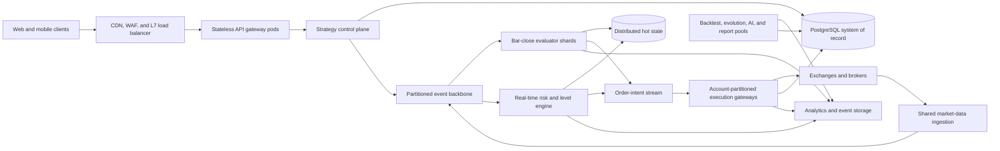

# QuantDinger V6 Hyperscale Architecture Plan

| Field | Value |
| --- | --- |
| Status | Living architecture RFC / implementation in progress |
| Target release | V6 |
| Owners | Platform Architecture and Trading Runtime |
| Last reviewed | 2026-09-30 |
| Capacity target | 20,000 users and 100,000 concurrently active strategies |
| Deployment model | Single-region, multi-AZ production with regional disaster recovery |
| Primary objective | Scale live, signal-only, grid, DCA, and scheduled strategies without weakening trading correctness |

## Current implementation checkpoint

The repository has completed the first horizontal runtime spine:

- exchange/provider-scoped market keys and shared in-process market feeds;
- a versioned Kafka event protocol with real topic initialization, audit,
  closed-bar dispatch, and evaluator consumer groups;
- durable evaluator inboxes, strategy-shard ownership, runtime leases, fencing
  tokens, hot runtime reuse, and fenced order intents;
- removal of one permanent execution thread per ordinary bar strategy;
- PostgreSQL-backed grid actor mailboxes and checkpoints routed to the trading
  worker that owns the strategy lease;
- single-host replica controls for trading, dispatcher, and evaluator workers.

The 100,000-strategy target is not yet certified. The major remaining boundaries
are independent shared market ingestion, account-partitioned execution gateways,
production multi-broker Kafka, database partition/retention and read isolation,
strategy sandbox quotas, multi-host orchestration, and staged load/failover
acceptance tests. Operational details are maintained in the
[distributed runtime deployment and scaling guide](../deployment/DISTRIBUTED_RUNTIME_SCALING.md).

## Executive summary

QuantDinger V5 established explicit process ownership for HTTP APIs, trading
runtimes, scheduled work, finite jobs, migrations, and durable coordination.
That separation is a necessary foundation, but the current strategy runtime is
not designed for 100,000 concurrently active strategies.

The V5.2 runtime schedules active strategies on a bounded cooperative evaluator
pool and shares exact-match public market-data subscriptions within each
process. It still performs frequent per-strategy risk, position, state, and
heartbeat work. Active state, database load, provider limits, and synchronized
bar bursts therefore remain the primary constraints on the path to 100,000
strategies.

V6 will replace that runtime model with a partitioned, event-driven trading
data plane. Market data will be ingested once and shared. Closed-candle events,
price-crossing events, and account events will be routed through durable
partitions. Strategy state will remain hot in bounded workers and will be
checkpointed only when dirty or at a low-frequency interval. Order intents will
pass through a separate account-partitioned execution gateway that preserves
idempotency, exchange rate limits, leases, and fencing.

The target is a horizontally scalable architecture, not a single oversized
server. Capacity will be proved at 10,000, 25,000, 50,000, and 100,000 active
strategies before the corresponding limit is enabled in production.

## Goals

V6 must:

- support 20,000 users and 100,000 concurrently active strategies;
- support bar-driven, scheduled, portfolio, grid, DCA, martingale, signal-only,
  virtual-account, and live-order execution modes;
- evaluate ordinary bar-close strategies only when their declared event occurs;
- preserve ordering for one strategy and serialize exchange side effects for one
  trading account;
- prevent duplicate live orders during retries, worker failure, deployment, and
  regional recovery;
- isolate user-authored strategy code with mandatory CPU, memory, wall-clock,
  filesystem, process, and network restrictions;
- separate live-trading capacity from backtests, strategy evolution, AI jobs,
  reports, and Monte Carlo workloads;
- scale automatically from queue lag and event age while retaining enough warm
  capacity for synchronized candle boundaries;
- produce an auditable event trail from market event to strategy decision,
  order intent, venue order, fill, position, and PnL state;
- retain an operable self-hosted profile at smaller scale.

## Non-goals

The first V6 hyperscale release will not:

- provide high-frequency or sub-millisecond trading;
- run live-order execution active-active across two regions;
- promise arbitrary strategy complexity within one fixed resource budget;
- put ticks, verbose logs, or every equity sample in the transactional database;
- use Spot capacity for live-order execution or critical account reconciliation;
- remove the existing idempotency, lease, fencing, or reconciliation contracts.

## Original V5.2 baseline and remaining constraints

The following table records the migration baseline. Rows describing cooperative
bar evaluation are historical for eligible Strategy V2 deployments; process-
local shared feeds, database write pressure, exchange limits, and connection
growth remain relevant until the corresponding V6 services are extracted.

| Constraint | Current behavior | Effect at 100,000 strategies |
| --- | --- | --- |
| Runtime ownership | Cooperative strategy generators on a fixed evaluator pool | Bounded OS threads, but active state still scales per strategy |
| Worker capacity | `STRATEGY_MAX_ACTIVE` admission with `STRATEGY_EVALUATOR_THREADS` workers | Capacity is evaluation and state limited rather than thread limited |
| Public crypto prices | Exact subscription sets share one process-local public feed | Connections remain duplicated across worker processes until the shared data plane is extracted |
| Signal-mode prices | Runtime-specific ticker retrieval | Provider limits and duplicated network work |
| Risk cadence | Runtime loop defaults to one second | Up to 100,000 full runtime cycles per second |
| Session checkpoint | Dirty session state may be written every five seconds | Up to 20,000 writes per second before other writes |
| Health checkpoint | Per-strategy health is written every ten seconds | Approximately 10,000 writes per second |
| Database pools | Trading worker pool maximum defaults to 32 | Linear worker scaling can expose tens of thousands of client connections |
| Recovery | Runtime leases and fencing are durable | Correct foundation to preserve and extend |

The V6 design must reduce work according to changed state and consumed events,
instead of multiplying one polling loop by the number of active strategies.

## Workload envelope

Capacity planning uses strategy evaluations, subscribed instruments, active
orders, and account operations. User count alone is not a sufficient sizing
metric.

The reference mixed workload is:

| Workload | Assumption |
| --- | ---: |
| Registered or concurrently addressable users | 20,000 |
| Concurrently active strategies | 100,000 |
| Average active strategies per user | 5 |
| Average primary instruments per strategy | 1 |
| One-minute strategies | 25% |
| Five-minute strategies | 25% |
| Fifteen-minute strategies | 25% |
| One-hour strategies | 25% |
| Grid, DCA, martingale, or real-time protection strategies | Up to 20% |
| Bar-close completion window | 10 seconds |
| Expected incremental evaluation CPU time | 20-50 ms at P95 |

The average closed-bar evaluation rate for this mix is approximately 535
evaluations per second:

```text
25,000 / 60 + 25,000 / 300 + 25,000 / 900 + 25,000 / 3,600
```

The minute-boundary target is at least 2,500 evaluations per second when 25,000
one-minute strategies are drained within ten seconds.

The evaluator capacity formula is:

```text
required CPU cores = peak evaluations/s * P95 CPU seconds / target utilization
```

At 60% target utilization, the reference workload requires approximately 84
cores at 20 ms per evaluation or 209 cores at 50 ms per evaluation, before
real-time protection, routing, execution, redundancy, and operational reserve.

An all-one-minute deployment requires 10,000 evaluations per second to clear
100,000 strategies in ten seconds. This scenario requires approximately 334 to
834 evaluator cores at the same per-evaluation cost and utilization target.

These figures are planning inputs. Production limits must be derived from
repeatable benchmark results for each supported strategy class.

## Target architecture



### Edge and API plane

The web and mobile applications are static assets served through a CDN. A WAF
and Layer 7 load balancer route API, SSE, and WebSocket traffic to stateless API
pods across at least three availability zones.

The API plane owns authentication, validation, read models, and durable command
submission. It must not start strategy loops or call a venue as a side effect of
an HTTP retry.

If 20,000 dashboards are concurrently open, high-frequency client polling must
be replaced with a shared push gateway backed by change events. API replicas
must not individually poll strategy state to feed each connected client.

### Strategy control plane

The control plane owns strategy definitions, versions, deployment state,
limits, entitlements, and lifecycle commands. PostgreSQL remains the source of
truth for these records.

Start, stop, pause, resume, migrate, and reconcile operations remain durable
commands. Existing strategy leases and monotonically increasing fencing tokens
will be extended so that a stale worker cannot publish a valid order intent.

Control-plane availability must not require all strategy evaluators to restart.

### Shared market-data plane

V6 will maintain shared connections by venue, market type, channel, and
instrument set. Subscription coordinators will pack instrument subscriptions
within venue-specific connection limits and rebalance them without creating one
connection per strategy.

Normalized events include:

- quote and mark-price updates;
- trades when required by a supported strategy contract;
- completed and corrected candles;
- market-session transitions;
- instrument and contract metadata changes;
- account orders, fills, balances, and positions.

Every event carries a source timestamp, ingestion timestamp, venue identity,
instrument identity, sequence or deduplication identifier, and schema version.
The system must detect gaps and reconcile them through bounded REST recovery.

### Partitioned event backbone

A durable event backbone such as Kafka or a managed equivalent will decouple
market ingestion, strategy evaluation, execution, persistence, notifications,
and analytics.

Partition keys are selected by correctness domain:

| Event family | Partition key | Guarantee |
| --- | --- | --- |
| Strategy lifecycle | `strategy_id` | Ordered deployment state |
| Bar-close evaluation | `strategy_id` | One evaluator owns sequential strategy state |
| Real-time levels | `venue:market:instrument` | Ordered price crossings for one instrument |
| Order intents | `venue:credential_id:account_type` | Serialized account-side effects and rate limits |
| Venue order and fill events | `venue:credential_id:venue_order_id` | Ordered reconciliation |
| Notifications | `user_id` | Bounded per-user delivery order |

Partition counts will not be selected from strategy count alone. The initial
benchmark configuration will test 96 and 128 strategy-event partitions across
at least three brokers and will retain expansion headroom.

### Bar-close evaluator shards

Ordinary indicator, CTA, portfolio, and scheduled strategies will execute only
when a declared event becomes due. One-minute strategies receive one completed
one-minute candle event; they do not run a one-second supervisory loop.

Each evaluator shard will:

1. load or claim a bounded set of strategy partitions;
2. restore versioned hot state;
3. consume ordered events;
4. evaluate precompiled strategy artifacts;
5. emit decisions and idempotent order intents;
6. checkpoint changed state asynchronously;
7. relinquish ownership only after its checkpoint and consumer offset are safe.

Indicator values should be incremental where the contract permits it. The
runtime must not rebuild an entire Pandas frame for every strategy and every
candle. Shared immutable candle windows may be reused by strategies with the
same venue, instrument, and timeframe.

### Real-time risk and level engine

Grid, DCA, martingale, trailing protection, stop loss, and take profit require
price-driven handling. They must not be implemented as a scan of every active
strategy for every price tick.

The engine will maintain an ordered price-level index for each instrument:

```text
instrument
  buy levels
  sell levels
  stop-loss levels
  take-profit levels
  trailing activation and callback state
```

When the market price crosses a range, only affected levels are activated. The
resulting strategy transitions are processed by the owning shard and converted
to idempotent order intents.

Signal-only virtual accounts and live accounts share strategy semantics but use
different execution adapters. Virtual settlement can never call a live venue.
Live execution can never consume a virtual fill as authoritative account state.

### Account-partitioned execution gateway

The execution gateway is the only service authorized to submit, amend, cancel,
or reconcile live venue orders. It consumes validated order intents and applies:

- fencing-token validation;
- durable idempotency and stable client order identifiers;
- account, venue, and endpoint rate limits;
- instrument precision and minimum-notional rules;
- pre-trade risk policy;
- timeout, retry, circuit-breaker, and uncertain-order reconciliation;
- private-stream fill processing with REST fallback;
- emergency-stop and account kill-switch enforcement.

Workers are partitioned by venue and credential identity. Different accounts
may execute in parallel, while one account's conflicting operations remain
serialized.

### Strategy code isolation

User-authored strategy code remains untrusted input. Resource limits are
mandatory platform policy and cannot depend on users enabling an environment
flag.

V6 will:

- compile and validate one immutable artifact per source version;
- cache artifacts by cryptographic source and contract hash;
- execute code in bounded warm sandbox pools instead of spawning a new process
  for every candle;
- disable network access and restrict filesystem, imports, subprocesses, and
  system calls;
- apply cgroup or equivalent CPU and memory limits in addition to language-level
  restrictions;
- enforce separate compile and per-event execution deadlines;
- terminate and quarantine a strategy version after repeated resource-policy
  violations;
- record resource usage and termination reason in the audit trail.

The current ten-second compile boundary remains suitable as a fail-safe, but a
normal strategy compile should complete far below that limit. Per-event
evaluation requires a much smaller strategy-class-specific budget.

## State and storage model

### PostgreSQL

PostgreSQL remains authoritative for:

- users, organizations, credentials, and entitlements;
- strategy definitions, source versions, deployments, and desired state;
- lifecycle commands, ownership leases, and fencing tokens;
- order intents, venue orders, fills, positions, and account reconciliation;
- immutable audit references and compliance-sensitive state.

PostgreSQL must not receive a heartbeat row or complete session snapshot from
every strategy every few seconds. Runtime liveness is derived primarily from
partition ownership, worker heartbeats, queue progress, and the timestamp of the
last processed event.

Writes will be batched where correctness permits. Large operational tables will
be partitioned by time and, where needed, tenant or strategy hash. Connection
pooling limits connection churn but is not a substitute for eliminating
unnecessary queries.

### Distributed hot state

The hot-state tier stores bounded, versioned runtime state required for quick
partition movement and process recovery. It may use Redis-compatible managed
storage, local RocksDB-backed stream state, or another benchmarked design.

The hot-state contract must define:

- ownership and fencing token;
- state schema version and source version;
- last consumed event sequence or offset;
- dirty checkpoint marker;
- maximum serialized state size;
- recovery behavior after partial writes.

Hot state is recoverable and must not become the sole record of a submitted live
order.

### Analytics and historical events

Ticks, candles, evaluation traces, equity points, verbose logs, and aggregate
analytics belong in a time-series or analytical store and object storage. They
are retained independently from the transactional database and queried through
read models.

## Reference cloud topology

The reference deployment uses one cloud region and three availability zones:

| Layer | Reference service class |
| --- | --- |
| Static clients | Object storage and CDN |
| Public ingress | WAF and Layer 7 application load balancer |
| Application compute | Managed Kubernetes with separate node pools |
| Event backbone | Managed Kafka-compatible service |
| Transactional database | Managed PostgreSQL, multi-AZ writer and readers |
| Connection management | Managed database proxy or PgBouncer |
| Hot state and locks | Managed Redis-compatible clustered service |
| Analytics | Columnar analytical database and object storage |
| Metrics and traces | Prometheus-compatible metrics, distributed tracing, and centralized logs |
| Secrets | Managed secret store and workload identity |

Live execution, account reconciliation, and core market ingestion use on-demand
capacity with minimum replicas and disruption budgets. Backtests, strategy
evolution, Monte Carlo, AI generation, and reports run in separate autoscaling
node pools and may use interruptible capacity.

The initial 100,000-strategy mixed-workload test environment is expected to
require the following aggregate range after the V6 runtime changes:

| Service group | Initial test capacity |
| --- | ---: |
| API gateway | 6-10 pods at 4 vCPU and 8 GiB |
| Market ingestion and routing | 6-12 pods at 4 vCPU and 8 GiB |
| Bar-close evaluation | 32-64 pods at 8 vCPU and 16 GiB |
| Real-time risk and level processing | 16-32 pods at 8 vCPU and 16 GiB |
| Execution gateways | 12-24 pods at 4 vCPU and 8 GiB |
| Notification and operational workers | 4-8 pods at 2 vCPU and 4 GiB |
| PostgreSQL writer | 32 vCPU and 128 GiB starting class |
| PostgreSQL standby/read capacity | Two nodes at 16-32 vCPU and 64-128 GiB |
| Event brokers | At least three brokers, benchmarked with 96 and 128 partitions |
| Hot-state cluster | At least three primary shards with replicas |

This represents approximately 350-700 application vCPUs and 0.7-1.4 TiB of
distributed application memory. It is a load-test starting range, not a final
purchase specification. The all-one-minute workload is expected to require
approximately 700-1,500 application vCPUs depending on strategy CPU cost and
completion SLO.

## Deployment packaging and elastic expansion

V6 must be deployable at small scale without creating a second architecture
that has to be replaced during growth. The same versioned service images,
configuration schema, event contracts, database migrations, health checks, and
operational controls will be used in every supported deployment profile.

| Profile | Intended use | Runtime shape |
| --- | --- | --- |
| Developer | Local development and deterministic integration tests | Docker Compose with single-replica services and replaceable local dependencies |
| Production starter | Small self-hosted or managed installation | Container platform with at least two API replicas, dedicated worker roles, managed PostgreSQL and Redis-compatible state |
| Hyperscale | Multi-AZ managed production | Kubernetes, managed event backbone, partitioned worker pools, multi-AZ data services, and separate live and batch capacity |

Docker Compose remains a development and small-installation package. It is not
the 100,000-strategy scheduler. Production starter and hyperscale deployments
must run the same application artifacts with different replica counts and
infrastructure adapters rather than environment-specific application forks.

### Release artifacts and infrastructure as code

Each V6 release will publish immutable, content-addressed images for explicit
process roles. A single source revision may produce role-specific images or a
shared image with fixed entrypoints, but runtime command selection must be
declarative and reviewable. Mutable `latest` tags are excluded from production
rollouts.

The deployment repository will provide:

- Terraform or OpenTofu modules for network, Kubernetes, database, event
  backbone, hot-state service, object storage, workload identity, and secrets;
- a versioned Helm chart, or an equivalent declarative package, with separate
  deployments for API, push gateway, market ingestion, evaluators, level
  engines, execution gateways, reconciliation, notifications, and batch jobs;
- checked-in environment overlays for development, staging, and production,
  containing capacity and routing differences but no secrets;
- migration jobs, readiness checks, dashboards, alerts, disruption budgets,
  topology-spread constraints, and network policies as release artifacts;
- a rendered-manifest validation step in CI so configuration failures are found
  before a cluster rollout.

Secrets are referenced through workload identity and a managed secret store.
They are not embedded in images, Helm values, event payloads, or GitOps state.

### Stateless and stateful boundaries

API, push, ingestion, evaluator, level-engine, and execution processes must be
replaceable without relying on a pod filesystem or process-local ownership.
Durable state belongs to PostgreSQL, the event log, object storage, or a
versioned checkpoint store. Hot state may be cached in a partition owner, but
the owner must be fenced and recoverable from a checkpoint plus replay.

This boundary allows a deployment to add servers by increasing replicas and
consumer capacity instead of copying databases or manually assigning users to
machines. Kubernetes service discovery balances stateless service calls, while
event partitions and leases assign stateful work.

### Horizontal expansion procedure

Normal expansion will follow this order:

1. provision or enlarge the appropriate node pool through infrastructure code;
2. add service replicas while keeping them unready for workload admission;
3. restore caches, establish venue streams, and pass dependency health checks;
4. join the relevant consumer group and transfer partitions through the drain
   and fencing protocol;
5. verify queue age, evaluation latency, reconciliation health, and error budget;
6. admit additional strategies only after measured spare capacity is available.

Scale-in reverses this sequence. A worker first stops accepting new ownership,
checkpoints dirty state, commits safe offsets, transfers partitions, and only
then terminates. Forceful process termination is tested as a recovery case but
is not the normal scale-in mechanism.

Increasing replica count does not increase concurrency past the available event
partitions. Partition expansion is therefore a planned capacity operation. It
must preserve key ordering, use a compatible partitioning scheme, and include a
rebalancing plan. Account execution partitions require particular care because
changing ownership cannot permit two workers to submit orders concurrently for
the same credential.

### Rollout, compatibility, and rollback

The platform will use rolling or canary deployment with a small partition set
or tenant cohort before broad rollout. A release may consume the current and
immediately preceding event and checkpoint schema during the migration window.
Producers switch only after compatible consumers are healthy.

Database migrations use expand-and-contract changes. Destructive schema removal
occurs only after old application versions are drained and rollback is no
longer required. A rollback must restore the previous application version
without rolling back acknowledged orders, fills, ledger entries, offsets, or
fencing epochs.

Live execution has stricter rollout policy than stateless APIs and batch pools:

- execution gateways retain minimum replicas and zone diversity throughout a
  deployment;
- one credential partition has exactly one fenced owner at a time;
- canary execution begins with signal-only or designated test accounts;
- automated rollback is disabled for ambiguous order-submission failures until
  reconciliation determines the venue result;
- emergency stop remains reachable independently of the release being rolled
  out.

### Portable operating contract

The first production reference may use one cloud provider, but application
services will depend on portable contracts: OCI images, Kubernetes APIs,
PostgreSQL, Kafka-compatible ordered streams, S3-compatible object storage, and
a Redis-compatible hot-state interface. Provider-specific managed services are
selected behind these contracts.

Portability does not require identical infrastructure on every provider. It
requires that a new region or provider can be created from versioned modules,
receive a tested configuration, restore durable state, and pass the same
conformance and load tests without application code changes.

## Load balancing and autoscaling

HTTP load balancing and strategy workload distribution are different problems.

- HTTP and streaming clients are balanced across stateless API and push-gateway
  replicas by the application load balancer.
- Strategy evaluation is balanced through event partitions and consumer groups.
- Real-time price work is balanced by instrument partitions.
- Live-order execution is balanced by account partitions.
- Read-only analytical queries are routed away from the transactional writer.

Autoscaling signals include:

- oldest unprocessed event age;
- ready events and due strategies per partition;
- evaluations per second and P95/P99 evaluation duration;
- order-intent and reconciliation queue age;
- market-data sequence lag and gap count;
- hot-state memory and checkpoint latency;
- API request rate, active streams, latency, and error rate;
- CPU and memory as safety signals rather than the only scaling inputs.

Reactive node scaling is too slow for a synchronized minute boundary. The
platform will keep a measured warm reserve and may pre-scale evaluator capacity
before predictable candle boundaries. Scale-in requires a drain protocol that
checkpoints state and transfers partition ownership safely.

## Availability, recovery, and regional design

### Multi-AZ production

All critical stateless services run across three availability zones. Event
brokers, PostgreSQL, and hot-state storage use managed multi-AZ replication.
Pod disruption budgets and topology constraints prevent routine maintenance
from removing all owners of a critical role.

### Failure handling

| Failure | Required behavior |
| --- | --- |
| Evaluator process exit | Partition is reassigned and resumes from checkpoint and committed offset |
| Stale evaluator resumes | Fencing token rejects all new state transitions and intents |
| Execution worker exit after submit | Reconcile stable client order ID before retrying |
| Market-data disconnect | Mark feed degraded, recover gaps, and block unsafe new actions |
| Database writer failover | Queue durable work and reconnect without duplicate side effects |
| Redis or hot-state loss | Restore from durable checkpoint and replay bounded events |
| Venue degradation | Open venue-specific circuit breaker without blocking other venues |
| Region failure | Activate a fenced warm standby after operator or automated quorum decision |

### Regional disaster recovery

The first V6 release uses active-passive regional recovery for live trading.
Active-active order submission is deferred until QuantDinger can prove a global
account-level fencing protocol under network partition.

The recovery plan must define:

- transactional database replication and recovery point objective;
- event-log replication or recovery window;
- credential and secret replication boundaries;
- a regional execution epoch included in fencing validation;
- operator-visible promotion and rollback procedures;
- exchange reconciliation before new orders are accepted.

## Observability and service-level objectives

The primary V6 service-level indicators are:

| Indicator | Initial objective |
| --- | ---: |
| API availability | 99.9% monthly |
| Live execution control-plane availability | 99.95% monthly |
| Mixed-workload bar-close evaluation | P95 under 5 seconds, P99 under 10 seconds |
| Order intent to execution-gateway admission | P99 under 1 second |
| Duplicate live orders caused by platform retry | Zero |
| Strategy event loss after acknowledged ingestion | Zero |
| Oldest normal event age | Under 3 seconds outside declared boundary bursts |
| Transactional database sustained CPU | Below 60% target |
| Recovery from one evaluator failure | Under 30 seconds |

Metrics must be available by tenant, strategy class, timeframe, venue, worker,
partition, and deployment version without using user-controlled values as
unbounded metric labels.

Distributed traces will link:

```text
market event -> strategy evaluation -> decision -> order intent
             -> execution attempt -> venue acknowledgement -> fill -> position
```

## Security and tenancy

V6 will preserve strict tenant boundaries throughout asynchronous processing:

- every command and event includes tenant and ownership identity;
- consumers authorize durable references rather than trusting message payloads;
- credentials are decrypted only in the execution boundary that needs them;
- workload identity replaces shared static infrastructure credentials;
- live and virtual execution have separate authorization paths;
- strategy sandboxes have no direct credential, database, Redis, broker, or
  internet access;
- administrative actions and emergency controls are auditable;
- queue payloads exclude exchange secrets and unnecessary personal data;
- per-tenant quotas prevent one user from exhausting shared capacity.

### Credential vault and decryption boundary

The V5 encrypted database blob is a migration source, not the final V6 vault
model. V6 will use envelope encryption with a random data-encryption key per
credential. The credential ciphertext and wrapped data key are stored with a
key version, algorithm identifier, tenant identity, venue identity, and
credential identity as authenticated context. A managed KMS or HSM-backed key
encrypts or unwraps the data keys; the root key is never distributed as a
shared application environment variable.

Credential records separate non-secret routing metadata from secret material.
The API can list the venue, environment, market scope, key hint, status, and
assigned egress pool without decrypting the credential. Credential creation,
replacement, validation, and revocation are handled through a narrow credential
service. General API, evaluator, level-engine, notification, AI, backtest, and
strategy-sandbox processes have no decrypt permission.

The account-partitioned execution gateway obtains a credential by opaque
reference, verifies tenant and deployment ownership, and decrypts it just in
time under its workload identity. Plaintext credentials:

- never appear in event, intent, checkpoint, cache, analytics, or log payloads;
- remain only in the authorized execution process for a bounded in-memory
  lifetime;
- are redacted from errors, traces, crash reports, and administrative views;
- are never returned after creation;
- can be revoked or replaced without rewriting strategy definitions;
- generate an auditable access event containing identity and purpose but no
  secret value.

Key rotation is versioned. KMS key rotation normally rewraps data keys without
exposing exchange secrets to application code. Exchange API-key rotation uses a
bounded dual-key transition when the venue permits it, verifies the replacement
through the execution boundary, then revokes the old key. Backups contain only
encrypted blobs and wrapped keys and use an independent storage-encryption key.

### Deterministic exchange egress and IP allowlists

Inbound load balancer addresses are unrelated to exchange API allowlists.
Every private exchange REST request and authenticated private stream must leave
through a dedicated execution egress path with stable public addresses. API,
market-data, AI, reporting, and batch workloads use separate egress paths and
cannot originate authenticated exchange traffic.

Each credential is assigned an immutable `egress_pool_id` when it is enrolled.
An egress pool contains a small, capacity-tested set of static IPv4 addresses
distributed across availability zones. Execution pods may scale or move among
nodes behind that pool without changing the source addresses observed by the
venue. The credential UI and API return the authoritative address set for the
assigned pool, not the address of whichever API replica handled the request.

The initial model uses a small number of pools per venue and region:

```text
credential -> venue/region egress pool -> private execution subnet
           -> highly available NAT or egress gateway -> static IPv4 set
           -> venue private REST and WebSocket endpoints
```

Credentials are consistently assigned to pools so adding workers does not
require users to edit exchange allowlists. New pools accept new credentials.
Moving an existing credential to another pool is an explicit migration with a
dual-allowlist window, connectivity test, execution drain, ownership transfer,
and removal of the old addresses. It is never an automatic side effect of
autoscaling.

The egress design must enforce:

- at least two failure domains while staying within each venue's documented IP
  allowlist limit;
- fixed IPv4 source addresses for venues that do not support IPv6 allowlisting;
- default-deny network policy so only execution and reconciliation workloads
  can reach authenticated venue endpoints through the protected egress path;
- destination policy, connection limits, flow logs, and alerts for unexpected
  destinations or source identities;
- separate pools for live and non-live traffic where operationally practical;
- capacity tracking by destination, connection count, bandwidth, and source
  port utilization;
- no direct public address on execution pods or nodes.

The active-passive disaster-recovery region has its own stable address set.
Users are instructed to allowlist both the active and designated standby sets
when the venue limit permits it. Regional promotion is blocked if the
credential has not verified its standby egress addresses. If a venue cannot
hold both sets, recovery for that credential requires an explicit allowlist
change and remains unavailable for automatic regional failover.

The platform will expose two different diagnostics:

1. an operator-only probe that verifies every configured egress-pool address
   from inside the corresponding execution network;
2. a tenant-facing credential view that reports the assigned allowlist
   addresses, last successful venue verification, and whether standby egress is
   ready.

An API-replica public-IP discovery endpoint is not an authoritative V6
allowlist mechanism and will be retired from the hyperscale profile.

## Migration plan

V6 will be delivered through reversible stages. A stage cannot advance until
its capacity and correctness gates pass.

### Phase 0: measurement and contracts

- Add per-strategy CPU time, memory estimate, runtime-loop work, database query,
  provider-call, and state-size metrics.
- Build deterministic market replay and synthetic account simulators.
- Define versioned market-event, strategy-state, order-intent, and fill schemas.
- Establish baseline V5 capacity and cost per 1,000 strategies.
- Classify strategy contracts as bar-driven, scheduled, real-time-level, or
  unsupported for hyperscale execution.

**Exit gate:** reproducible benchmark results and approved event contracts.

### Phase 1: shared market-data service

- Extract public market streams from individual strategy runtimes.
- Add subscription packing, sequence-gap detection, normalized events, and REST
  recovery.
- Provide a compatibility adapter so V5 runtimes can consume shared prices
  during migration.

**Exit gate:** at least 10,000 strategies share bounded venue connections with
no loss of market-data correctness.

### Phase 2: event-driven bar evaluation

- Introduce the strategy event backbone and consumer partitions.
- Compile immutable strategy artifacts once per source version.
- Implement incremental indicator state and shared candle windows.
- Stop one-second polling for strategies that only require closed candles or
  schedules.

**Exit gate:** 25,000 mixed-frequency strategies meet the evaluation SLO.

### Phase 3: hot state and checkpointing

- Move active session state into partition-owned hot state.
- Replace per-strategy fixed-frequency heartbeats with worker and partition
  progress.
- Checkpoint on meaningful state changes and at bounded recovery intervals.
- Add schema migration and replay tests for strategy state.

**Exit gate:** worker termination and partition movement lose no acknowledged
decision and create no duplicate intent.

### Phase 4: execution gateway

- Route all live side effects through account-partitioned execution services.
- Enforce global account rate limits, stable client order IDs, fencing, and
  uncertain-order reconciliation.
- Keep virtual settlement physically and logically isolated from live adapters.
- Introduce the envelope-encrypted credential vault and remove decrypt
  permission from API, evaluator, batch, AI, and strategy-sandbox roles.
- Assign credentials to stable venue and region egress pools, publish the
  authoritative allowlist addresses, and route all private venue traffic
  through those pools.
- Migrate existing credentials from the shared Fernet key in bounded batches
  with audit records, verification, retry, and rollback tooling.

**Exit gate:** fault-injection tests produce zero duplicate live orders; no
unauthorized workload can decrypt a credential or reach a private venue path;
worker and zone failover preserve the credential's published source-IP set.

### Phase 5: real-time grid, DCA, and protection engine

- Build ordered level indexes and price-crossing activation.
- Migrate grid, DCA, martingale, trailing stops, stop loss, and take profit from
  full per-strategy scans.
- Validate baseline-price, average-cost, leverage, fee, slippage, and partial-fill
  semantics across virtual and live modes.

**Exit gate:** 20,000 simultaneous real-time strategies meet latency and
correctness targets without scanning inactive levels.

### Phase 6: storage and analytics separation

- Partition high-volume transactional tables.
- Move runtime telemetry, dense equity series, verbose logs, and evaluation
  traces to analytical and object storage.
- Build API read models and retention policies.

**Exit gate:** PostgreSQL remains below its sustained utilization target during
the 50,000-strategy test.

### Phase 7: 100,000-strategy qualification

- Run 10K, 25K, 50K, and 100K soak tests.
- Test mixed and all-one-minute bursts.
- Inject process, node, zone, broker, database, Redis, market-data, and venue
  failures.
- Run shadow decisions against production-like market replay.
- Complete operational runbooks, capacity alerts, and regional recovery drill.

**Exit gate:** all acceptance criteria pass for a sustained 24-hour workload and
a separate seven-day stability run.

### Phase 8: controlled production rollout

- Enable V6 by strategy class and tenant cohort.
- Shadow V5 and V6 decisions where deterministic comparison is possible.
- Use explicit capacity admission instead of accepting strategies beyond proven
  limits.
- Remove the V5 per-strategy runtime after migration and rollback windows close.

**Exit gate:** 100% of supported production strategy classes use the V6 data
plane and the V5 runtime is retired.

## Validation program

The performance suite will generate realistic distributions instead of only
empty strategies.

Required scenarios include:

1. 100,000 active definitions with no open positions.
2. 25,000 one-minute strategies triggered on the same candle boundary.
3. 100,000 one-minute strategies under the declared ten-second completion SLO.
4. 20,000 grid and DCA strategies distributed across popular and long-tail
   instruments.
5. 20,000 concurrent dashboards consuming push updates.
6. A correlated market move that crosses many stop and grid levels at once.
7. One account approaching venue order-rate limits while other accounts remain
   healthy.
8. One exchange outage while all other exchanges continue normally.
9. Evaluator, execution worker, broker, database writer, and availability-zone
   failure during active order flow.
10. Backtest and strategy-evolution saturation while live SLOs remain intact.

Every run records throughput, queue age, CPU time per evaluation, memory per
active strategy, state size, database queries and writes, cache operations,
event bytes, network calls, order latency, duplicate attempts, reconciliation
time, and infrastructure cost per 1,000 active strategies.

## Acceptance criteria

The 100,000-strategy production limit may be enabled only when:

- the mixed workload and declared all-one-minute workload meet their SLOs;
- a single pod, node, broker, database writer, and availability-zone failure do
  not create duplicate venue orders;
- no critical service depends on one in-process lock or singleton host;
- market-data connections remain bounded by venue subscription limits rather
  than strategy count;
- PostgreSQL load scales with material state changes and transactions rather
  than one-second strategy polling;
- live workloads retain reserved capacity during maximum batch demand;
- strategy sandbox escapes, unbounded resource use, and network access are
  blocked by mandatory platform controls;
- tenant quotas, admission control, circuit breakers, emergency stop, and
  regional recovery are tested and documented;
- capacity forecasts are based on measured profiles with at least 30% operating
  headroom.

## Principal risks

| Risk | Mitigation |
| --- | --- |
| Event reordering or duplicate delivery | Strategy and account partition keys, idempotent consumers, sequence checks |
| Duplicate live orders during failover | Stable client order IDs, durable intent state, fencing tokens, reconciliation before retry |
| Minute-boundary thundering herd | Warm capacity, partition fairness, scheduled pre-scaling, bounded completion window |
| Hot-state loss | Durable checkpoints, replayable events, versioned state schemas |
| One tenant dominates capacity | Per-tenant quotas, weighted queues, admission control |
| Exchange rate-limit breach | Account- and endpoint-aware token buckets, priority classes, backpressure |
| Strategy code exhausts workers | Mandatory sandbox budgets, artifact quarantine, bounded warm pools |
| Analytical traffic impacts trading | Separate stores, replicas, queues, and node pools |
| Active-active regional split brain | Active-passive execution and regional fencing in the first V6 release |
| Cost grows faster than strategy count | Incremental evaluation, shared data, scale-to-demand batch pools, measured unit economics |

## Architecture decisions required before implementation

The following decisions require focused RFCs and benchmarks:

1. Managed Kafka-compatible service versus another ordered event service.
2. Redis-compatible hot state versus embedded stream state with remote
   checkpoints.
3. Columnar analytics store and retention policy.
4. Kubernetes runtime versus an equivalent managed container platform.
5. Strategy sandbox implementation and warm-pool isolation boundary.
6. Event schema registry and compatibility policy.
7. Regional event and database replication mechanism.
8. Supported V6 strategy contracts and resource classes.
9. Managed KMS/HSM provider, envelope format, and credential rotation policy.
10. Per-venue egress-pool size, IP limits, capacity, and disaster-recovery
    allowlist policy.

## Deliverables

V6 hyperscale work is complete when the repository contains:

- approved component and event-contract RFCs;
- deployment manifests and infrastructure definitions;
- shared market-data, evaluator, level-engine, and execution services;
- versioned state, event, and intent schemas;
- deterministic replay, load, soak, failover, and chaos test suites;
- dashboards, alerts, capacity reports, and cost-per-unit reports;
- operator runbooks for deployment, drain, recovery, emergency stop, venue
  degradation, and regional promotion;
- migration and rollback tooling;
- public documentation for supported strategy classes and capacity limits.

## Reference material

- [Kubernetes Horizontal Pod Autoscaling](https://kubernetes.io/docs/concepts/workloads/autoscaling/horizontal-pod-autoscale/)
- [Amazon EKS compute autoscaling](https://docs.aws.amazon.com/eks/latest/userguide/autoscaling.html)
- [AWS Application Load Balancers](https://docs.aws.amazon.com/elasticloadbalancing/latest/application/introduction.html)
- [Amazon RDS Proxy concepts](https://docs.aws.amazon.com/AmazonRDS/latest/UserGuide/rds-proxy.howitworks.html)
- [Amazon RDS PostgreSQL read replicas](https://docs.aws.amazon.com/AmazonRDS/latest/UserGuide/USER_PostgreSQL.Replication.ReadReplicas.html)
- [Amazon MSK broker best practices](https://docs.aws.amazon.com/msk/latest/developerguide/bestpractices.html)
- [Amazon VPC NAT gateways](https://docs.aws.amazon.com/vpc/latest/userguide/vpc-nat-gateway.html)
- [AWS centralized IPv4 egress](https://docs.aws.amazon.com/whitepapers/latest/building-scalable-secure-multi-vpc-network-infrastructure/using-nat-gateway-for-centralized-egress.html)
- [Binance API-key IP restrictions](https://www.binance.com/en-AU/support/faq/detail/360002502072)

# Durable grid actors

Grid runtimes are no longer tied to the process that receives private execution
stream events. The private stream persists each fill first, then appends an
idempotent grid actor mailbox event. Only the trading worker holding the
strategy runtime lease and matching fencing token may claim and project that
event. Actor state is checkpointed by strategy run, while grid cells, resting
orders, and fill ledgers remain the authoritative business state.

REST fill reconciliation runs in every trading worker but filters by its local
grid runners. This preserves recovery when a private stream is unavailable
without allowing another worker to poll or replenish a grid it does not own.
