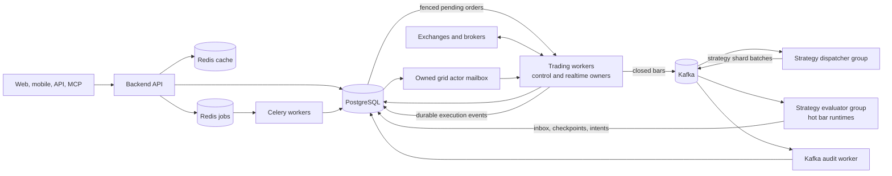

# Distributed Runtime Deployment and Scaling

This guide is the operational source of truth for the current event-driven
runtime. It describes what the repository runs today, how to release it safely,
and which boundaries must change before a multi-host 100,000-strategy cluster.

## Current production topology



PostgreSQL remains the business source of truth. Kafka provides ordered runtime
transport; its offsets do not replace event inboxes, actor mailboxes, leases,
fencing tokens, idempotency keys, or order reconciliation.

## Strategy execution paths

| Strategy class | Current owner | Trigger and recovery path |
| --- | --- | --- |
| Ordinary closed-bar Strategy API V2 | `strategy-evaluator-worker` | Kafka shard batch, durable inbox, runtime lease, hot checkpoint |
| Grid with resting exchange orders | `trading-worker` | Private fill stream or REST reconciliation, durable grid actor mailbox |
| Martingale, DCA, tick-driven, and session-driven runtime | `trading-worker` | Realtime local scheduler protected by strategy lease and fencing |
| Pending live order submission | `trading-worker` | PostgreSQL claim, runtime fencing validation, stable client order ID |
| AI, backtest, report, and maintenance job | `celery-worker` | Durable Redis jobs queue and task retry policy |

Market identity must include venue/provider, market, market type, instrument ID,
and timeframe. A symbol string such as `BTC/USDT` is not a globally unique price
stream and must never be used as the only routing key.

## Safe release procedure

1. Freeze schema-changing deployments and take a verified PostgreSQL backup.
2. Save the current image tags and environment files for rollback.
3. Pull or build all images from the same release version.
4. Run the database migration and Kafka topic initializer.
5. Recreate the services and verify health, worker heartbeats, leases, consumer
   lag, pending-order backlog, grid actor backlog, and error logs.

Prebuilt-image deployment:

```bash
docker compose -f docker-compose.ghcr.yml pull
docker compose -f docker-compose.ghcr.yml run --rm migration
docker compose -f docker-compose.ghcr.yml run --rm kafka-init
docker compose -f docker-compose.ghcr.yml up -d --remove-orphans
docker compose -f docker-compose.ghcr.yml ps
```

Source deployment:

```bash
git pull --ff-only
docker compose build backend
docker compose run --rm migration
docker compose run --rm kafka-init
docker compose up -d --remove-orphans
docker compose ps
```

Do not use `down -v` during an upgrade. It deletes local state volumes. A schema
migration must complete before workers using the new schema are admitted.

Minimum post-release checks:

```bash
curl -f http://127.0.0.1:5000/api/health
curl -f http://127.0.0.1:5000/api/health/ready
curl -f http://127.0.0.1:5000/api/health/workers
docker compose logs --since=10m trading-worker strategy-dispatcher-worker strategy-evaluator-worker kafka-audit-worker
```

For a GHCR installation, add `-f docker-compose.ghcr.yml` to the log command.
Verify at least one controlled paper strategy through start, bar evaluation,
order intent, fill projection, stop, worker restart, and ownership recovery.

## Scaling on one host

Set replica counts in the project-root `.env` and recreate only the affected
roles:

```dotenv
TRADING_WORKER_REPLICAS=4
STRATEGY_DISPATCHER_REPLICAS=2
STRATEGY_EVALUATOR_REPLICAS=8
```

```bash
docker compose up -d --force-recreate \
  trading-worker strategy-dispatcher-worker strategy-evaluator-worker
```

Scale one role at a time and observe CPU, memory, PostgreSQL connections and
query latency, Kafka consumer lag, exchange rate-limit errors, event inbox age,
pending-order age, and actor retry/dead counts. Kafka partition counts cap useful
consumer parallelism; adding more evaluator replicas than assigned partitions
does not create more throughput.

## Moving to multiple hosts

The default Compose stack is a single-host topology. Do not copy it unchanged
to several servers: every host would create its own PostgreSQL, Redis, Kafka,
and local volumes.

A real multi-host deployment needs:

- one shared PostgreSQL primary with backups, connection control, tested restore,
  and read replicas for analytical/read-heavy endpoints;
- shared cache Redis and a separate durable jobs Redis;
- a multi-broker Kafka cluster with replication and externally resolvable
  advertised listeners;
- an orchestrator or equivalent service manager for unique identities, health,
  rolling drain, restart, anti-affinity, secrets, and network policy;
- private networking from workers to stateful services and controlled egress to
  exchanges and brokers;
- centralized metrics, logs, alerts, and consumer-lag monitoring.

Only stateless or lease-owned worker roles should be scaled horizontally. Move
PostgreSQL, Redis, and Kafka out of the application Compose stack before adding
application hosts.

## Is adding servers enough for 100,000 strategies?

No. The current ownership, event, inbox, fencing, and actor boundaries make
horizontal expansion possible, but 100,000 live strategies is a capacity target,
not a configured guarantee. Additional servers increase evaluator and realtime
compute only after shared bottlenecks are removed.

Before claiming 100,000-strategy capacity, complete and benchmark at least:

1. independent shared market ingestion and bar-clock services;
2. account/credential-partitioned execution gateways with endpoint-aware rate
   limits and backpressure;
3. production Kafka replication, partition sizing, retention, and replay drills;
4. PostgreSQL partitioning/retention for high-volume event, log, and trade data,
   plus read-path isolation and connection pooling;
5. strategy resource classes, tenant quotas, sandbox budgets, and admission
   control;
6. 10,000, then 30,000, then 100,000 synthetic strategy load tests with minute
   boundary burst measurements;
7. restart, broker disconnect, rebalance, database failover, duplicate-event,
   stale-owner, and disaster-recovery tests;
8. production dashboards and alerts for end-to-end bar-to-decision and
   intent-to-order latency.

Capacity must be published as a measured envelope for each strategy class and
timeframe. A lightweight one-minute moving-average strategy, a multi-symbol
portfolio, and a tick-driven grid do not consume equivalent resources.

## Rollback boundary

Application images can be rolled back only when the previous version supports
the migrated schema and current event versions. Keep migrations additive across
the release window, retain Kafka topics during rollback, and drain evaluator and
trading workers before replacing them. Never roll back by restoring an old
database snapshot while new workers or exchange sessions are still active.
