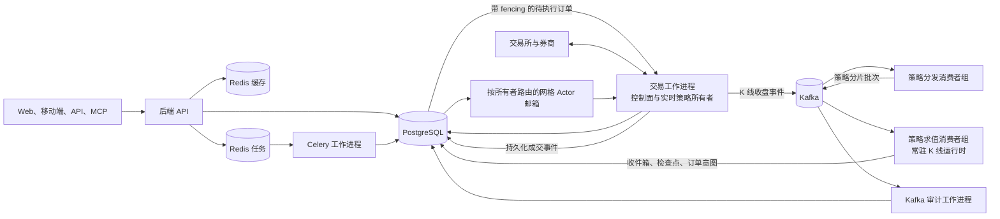

# 分布式运行时部署与扩容

本文是当前事件驱动运行时的运维事实来源，说明仓库目前实际运行的架构、安全发布步骤，
以及扩展为多机十万策略集群前必须补齐的边界。

## 当前生产拓扑



PostgreSQL 仍是业务事实来源。Kafka 提供有序的运行时传输，但 offset 不能替代事件收件箱、
Actor 邮箱、租约、fencing token、幂等键或订单对账。

## 各类策略的执行路径

| 策略类型 | 当前所有者 | 触发与恢复路径 |
| --- | --- | --- |
| 普通 K 线收盘 Strategy API V2 | `strategy-evaluator-worker` | Kafka 分片批次、持久收件箱、运行时租约、热状态检查点 |
| 使用交易所挂单的网格 | `trading-worker` | 私有成交流或 REST 对账、持久化网格 Actor 邮箱 |
| 马丁、DCA、tick 驱动和交易时段驱动策略 | `trading-worker` | 带策略租约和 fencing 的本地实时调度器 |
| 实盘待执行订单 | `trading-worker` | PostgreSQL 认领、运行时 fencing 校验、稳定客户端订单 ID |
| AI、回测、报告与维护任务 | `celery-worker` | 持久 Redis 任务队列与任务重试策略 |

行情身份必须包含交易所/数据提供方、市场、市场类型、instrument ID 和周期。
`BTC/USDT` 这样的符号字符串不是全局唯一行情源，绝不能作为唯一的路由键。

## 安全发布步骤

1. 暂停同时发生的数据库结构发布，并制作经过验证的 PostgreSQL 备份。
2. 保存当前镜像 tag 和环境文件，作为回滚依据。
3. 拉取或构建同一个版本的全部镜像。
4. 执行数据库迁移和 Kafka 主题初始化。
5. 重建服务，并检查健康状态、Worker 心跳、租约、消费者积压、待执行订单、
   网格 Actor 积压和错误日志。

预构建镜像部署：

```bash
docker compose -f docker-compose.ghcr.yml pull
docker compose -f docker-compose.ghcr.yml run --rm migration
docker compose -f docker-compose.ghcr.yml run --rm kafka-init
docker compose -f docker-compose.ghcr.yml up -d --remove-orphans
docker compose -f docker-compose.ghcr.yml ps
```

源码部署：

```bash
git pull --ff-only
docker compose build backend
docker compose run --rm migration
docker compose run --rm kafka-init
docker compose up -d --remove-orphans
docker compose ps
```

升级时不要执行 `down -v`，该命令会删除本地状态卷。数据库迁移必须在使用新结构的
Worker 被接纳前完成。

最低发布后检查：

```bash
curl -f http://127.0.0.1:5000/api/health
curl -f http://127.0.0.1:5000/api/health/ready
curl -f http://127.0.0.1:5000/api/health/workers
docker compose logs --since=10m trading-worker strategy-dispatcher-worker strategy-evaluator-worker kafka-audit-worker
```

GHCR 部署需要在日志命令中加入 `-f docker-compose.ghcr.yml`。至少选择一个可控的模拟盘策略，
完整验证启动、K 线求值、订单意图、成交投影、停止、Worker 重启和所有权恢复。

## 单机扩容

在项目根目录 `.env` 设置副本数，再只重建对应角色：

```dotenv
TRADING_WORKER_REPLICAS=4
STRATEGY_DISPATCHER_REPLICAS=2
STRATEGY_EVALUATOR_REPLICAS=8
```

```bash
docker compose up -d --force-recreate \
  trading-worker strategy-dispatcher-worker strategy-evaluator-worker
```

一次只调整一个角色，并观察 CPU、内存、PostgreSQL 连接与 SQL 延迟、Kafka consumer lag、
交易所限频错误、事件收件箱年龄、待执行订单年龄，以及 Actor 重试/死信数量。Kafka 分区数会
限制有效并行度；求值副本多于可分配分区时，不会继续增加吞吐量。

## 迁移到多台服务器

默认 Compose 是单机拓扑，不能原样复制到多台服务器，否则每台机器都会创建独立的
PostgreSQL、Redis、Kafka 和本地数据卷，形成状态分裂。

真正的多机部署需要：

- 共享 PostgreSQL 主库、备份、连接治理、已验证恢复，以及服务分析/重查询的只读副本；
- 共享缓存 Redis，以及独立的持久任务 Redis；
- 有副本机制、对外可解析 advertised listener 的多 Broker Kafka 集群；
- 编排系统或等价的服务管理层，负责唯一实例身份、健康检查、滚动 drain、重启、反亲和、
  密钥和网络策略；
- Worker 到有状态服务的私网，以及访问交易所/券商的受控出口；
- 集中的指标、日志、告警和 consumer lag 监控。

只有无状态或由租约明确所有权的 Worker 角色适合横向扩容。增加应用服务器前，应先把
PostgreSQL、Redis 和 Kafka 从应用 Compose 中独立出去。

## 十万策略是不是只需要加服务器

不是。当前的所有权、事件、收件箱、fencing 和 Actor 边界已经让横向扩容成为可能，
但十万实盘策略仍是容量目标，不是当前配置承诺。只有消除共享瓶颈后，增加服务器才能继续
提高求值与实时运行吞吐量。

对外声明十万策略容量前，至少需要完成并实测：

1. 独立的共享行情接入与 K 线时钟服务；
2. 按账户/凭据分区、感知接口限频并支持背压的执行网关；
3. 生产级 Kafka 副本、分区、保留策略和重放演练；
4. PostgreSQL 高频事件、日志和成交数据的分区/保留策略，以及读路径隔离和连接池治理；
5. 策略资源等级、租户配额、沙箱预算和准入控制；
6. 依次进行 1 万、3 万、10 万合成策略压测，并测量分钟边界突发；
7. 重启、交易所断连、Kafka rebalance、数据库故障转移、重复事件、过期所有者和灾备测试；
8. K 线到决策、订单意图到交易所提交的端到端延迟看板和告警。

容量必须按策略类型和周期给出实测范围。一分钟双均线、多标的组合与 tick 驱动网格的资源消耗
并不等价。

## 回滚边界

只有旧版本仍兼容已经迁移的数据库结构和当前事件版本时，才能回滚应用镜像。发布窗口内应保持
迁移向后兼容，回滚时保留 Kafka 主题，并先 drain 求值与交易 Worker。新 Worker 或交易所会话
仍在运行时，绝不能通过恢复旧数据库快照来回滚。
